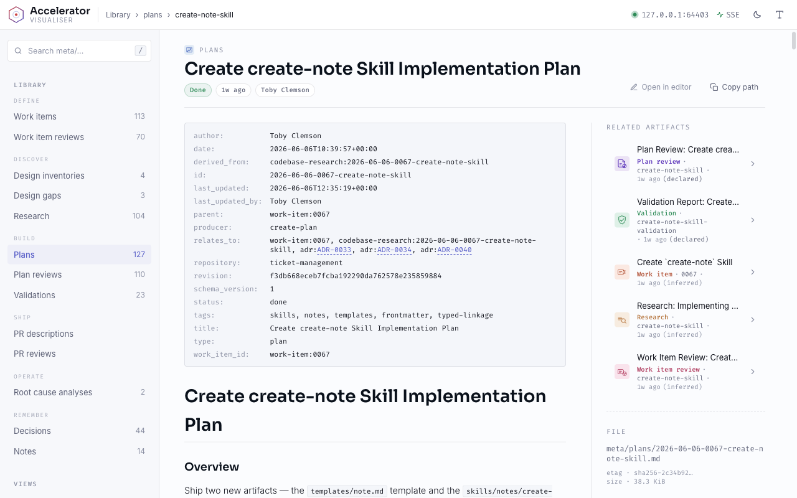

<p align="center">
  <picture>
    <source media="(prefers-color-scheme: dark)" srcset="assets/accelerator_logo_dark_bg.png">
    <source media="(prefers-color-scheme: light)" srcset="assets/accelerator_logo_light_bg.png">
    
  </picture>
</p>

A Claude Code plugin for structured, context-efficient software development.

<p align="center">
  <picture>
    <source media="(prefers-color-scheme: dark)" srcset="assets/visualiser_plan_dark.png">
    <source media="(prefers-color-scheme: light)" srcset="assets/visualiser_plan_light.png">
    
  </picture>
</p>

Accelerator splits development into discrete phases — research, plan, implement —
that communicate through the filesystem rather than the conversation. Each phase
runs with minimal context, writing its findings to a persistent `meta/`
directory, so every step stays focused and avoids the quality loss that comes
with large, cluttered context windows.

## Getting Started

Add the marketplace and install the stable plugin:

```bash
/plugin marketplace add atomicinnovation/accelerator
/plugin install accelerator@atomic-innovation
```

Then initialise your project and run the research → plan → implement loop:

```bash
/accelerator:init
/accelerator:research-codebase "how does auth work?"   # 1. research
/accelerator:create-plan                               # 2. plan (optionally pass a work-item key)
/accelerator:implement-plan                            # 3. implement
```

For the prerelease channel (where the newest features land first) and Claude
Code compatibility, see [Installation](docs/installation.md).

## Documentation

**Concepts**

- [How It Works](docs/how-it-works.md) — the phase model, the `meta/` directory,
  and VCS detection.
- [The Development Loop](docs/development-loop.md) — the research → plan →
  implement workflow in detail.
- [Configuration](docs/configuration.md) — config files, templates, per-skill
  customisation, and custom review lenses.
- [Visualiser](docs/visualiser.md) — the browser-based companion view of `meta/`.
- [Internals](docs/internals.md) — the `meta/` directory deep-dive and the agent
  roster.
- [Migrations](docs/migrations.md) — upgrading a repo with `/accelerator:migrate`.
- [Installation](docs/installation.md) — the prerelease channel and Claude Code
  compatibility.

**Skills**

- [Planning](docs/skills/planning.md) — research, issue investigation, and plan
  review companions.
- [Work Items](docs/skills/work-items.md) — capturing features, bugs, and tasks
  that feed into planning.
- [Issue Trackers (Jira & Linear)](docs/skills/issue-trackers.md) — remote
  tracker integration.
- [Architecture Decision Records (ADRs)](docs/skills/adrs.md) — capturing
  architectural decisions.
- [VCS & PR Workflow](docs/skills/vcs-and-pr.md) — commit, describe, review, and
  respond to PRs.
- [Review System](docs/skills/review-system.md) — the multi-lens review system.
- [Design Convergence](docs/skills/design-convergence.md) — design inventories
  and gap analysis.

Contributing to Accelerator? See [CONTRIBUTING](CONTRIBUTING.md) for local
development and the CI checks.

## License

MIT — see [LICENSE](LICENSE).
