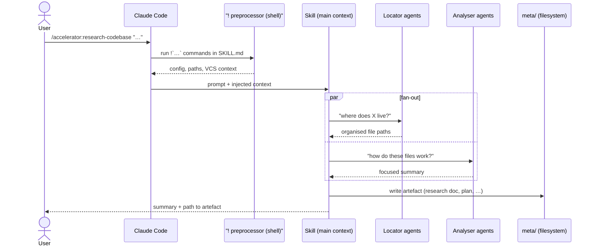

## Anatomy of a skill invocation

Every skill is a `SKILL.md` prompt with YAML frontmatter. The
non-obvious mechanism is the **`!` preprocessor**: lines of the form
``!`command` `` in the skill body are executed by Claude Code *at
invocation time*, and their output is injected into the prompt before
the model sees it. That is how a skill like `commit` starts with live
VCS status, recent log, and project configuration already in context —
without spending any conversation turns gathering them.

Once running, a skill that needs exploratory work fans out to
subagents, each in an isolated context, and finishes by writing its
artefact to `meta/`:

Three properties of this sequence matter:

- **Context is injected, not gathered.** The preprocessor output
  arrives as part of the prompt, so the skill never burns turns (or
  context) running orientation commands.
- **Exploration is quarantined.** Locators and analysers do the
  broad searching and deep reading in their own context windows; only
  summaries return (see [Agents](#agents) below).
- **The output is a file, not a message.** The durable result lands
  in `meta/`, where the next skill — possibly in a different session —
  picks it up.

Scripts referenced by skills are addressed via `${CLAUDE_PLUGIN_ROOT}`,
so they resolve from the installed plugin location rather than the
project being worked on.

## The `meta/` Directory

Every project using Accelerator gets a `meta/` directory (by default) that
serves as persistent state for the development workflow. Each skill reads from
and writes to predictable paths within it. Run
[`/init`](configuration.md#init) to create all directories up
front, or let skills create them on first use.
These paths can be overridden via the `paths` configuration section:

`research/` is itself subdivided into four subcategories — codebase
research, issue/RCA research, design inventories, and design gaps:

| Directory                       | Purpose                                                        | Written by                                                   |
|---------------------------------|----------------------------------------------------------------|--------------------------------------------------------------|
| `research/`                     | (parent — see subcategories below)                             | —                                                            |
| `  ├─ codebase/`                | Codebase research findings with YAML frontmatter               | `research-codebase`                                          |
| `  ├─ issues/`                  | Issue / RCA research findings                                  | `research-issue`                                             |
| `  ├─ design-inventories/`      | Per-source design inventory snapshots (markdown + screenshots) | `inventory-design`                                           |
| `  └─ design-gaps/`             | Design-gap analysis artefacts                                  | `analyse-design-gaps`                                        |
| `plans/`                        | Implementation plans with phased changes                       | `create-plan`                                                |
| `decisions/`                    | Architecture decision records (ADRs)                           | `create-adr`, `extract-adrs`, `review-adr`                   |
| `reviews/`                      | Review summaries and per-lens results                          | `review-pr`, `review-plan`                                   |
| `validations/`                  | Plan validation reports                                        | `validate-plan`                                              |
| `prs/`                          | PR descriptions                                                | `describe-pr`                                                |
| `work/`                         | Work item files referenced by planning                         | `create-work-item`, `extract-work-items`, `update-work-item` |
| `notes/`                        | Notes and working documents                                    | `create-note`                                                |

This approach means:

- No skill assumes access to another skill's conversation history
- Work survives session boundaries and context compaction
- Plans can be resumed after interruption (implement-plan picks up from the
  first unchecked item)
- Artefacts are structured and machine-parseable (YAML frontmatter, JSON
  schemas)

## Agents

Accelerator uses specialised subagents to keep the main context lean. Each
agent runs in its own context window with restricted tools, returning only a
focused summary to the parent:

| Agent                       | Role                                                              | Tools                                                                                                                                                                                                                                               |
|-----------------------------|-------------------------------------------------------------------|-----------------------------------------------------------------------------------------------------------------------------------------------------------------------------------------------------------------------------------------------------|
| **codebase-locator**        | Finds files and components by description                         | Grep, Glob, LS                                                                                                                                                                                                                                      |
| **codebase-analyser**       | Analyses implementation details of specific components            | Read, Grep, Glob, LS                                                                                                                                                                                                                                |
| **codebase-pattern-finder** | Finds similar implementations and usage examples                  | Read, Grep, Glob, LS                                                                                                                                                                                                                                |
| **documents-locator**       | Discovers relevant documents in configured directories            | Grep, Glob, LS                                                                                                                                                                                                                                      |
| **documents-analyser**      | Extracts insights from meta documents                             | Read, Grep, Glob, LS                                                                                                                                                                                                                                |
| **reviewer**                | Evaluates code/plans through a specific quality lens              | Read, Grep, Glob, LS                                                                                                                                                                                                                                |
| **web-search-researcher**   | Researches external documentation and resources                   | WebSearch, WebFetch, Read, Grep, Glob, LS                                                                                                                                                                                                           |
| **browser-locator**         | Locates routes/screens/components in a running app via Playwright | `Bash(run.sh navigate)`, `Bash(run.sh snapshot)`                   |
| **browser-analyser**        | Analyses screens, captures state and screenshots via Playwright   | `Bash(run.sh navigate\|snapshot\|screenshot\|evaluate\|click\|type\|wait_for)` |

The separation between locators (find, no Read) and analysers (understand, with
Read) is deliberate: it prevents any single agent from needing to both search
broadly and read deeply, keeping each agent's context bounded.

`browser-*` agents drive Playwright through the skill-shipped executor
(`run.sh`), a Bash wrapper around a Node.js TCP daemon that runs Chromium.
No MCP server is required. See `skills/design/inventory-design/PROTOCOL.md`
for the executor wire protocol.

## VCS Detection

Accelerator automatically detects whether a repository uses git or
[jujutsu (jj)](https://github.com/jj-vcs/jj) and adapts its behaviour
accordingly. A `SessionStart` hook inspects the working directory for `.jj/` and
`.git/` directories, injecting VCS-specific context (command references and
conventions) into the session. Detection also recognises git **linked
worktrees** — where `.git` is a file (a `gitdir:` pointer) rather than a
directory — so worktree-based sessions are detected just like plain checkouts. A
complementary `PreToolUse` guard warns when raw git commands are used in a
jujutsu repository.

This means all VCS-aware skills — `commit`, `respond-to-pr`, and ad-hoc
interactions — use the correct CLI commands without manual configuration. The
detection covers three modes:

| Mode               | Detected when      | VCS commands used |
|--------------------|--------------------|-------------------|
| **git**            | `.git/` only       | `git`             |
| **jj (colocated)** | `.jj/` and `.git/` | `jj`              |
| **jj (pure)**      | `.jj/` only        | `jj`              |
