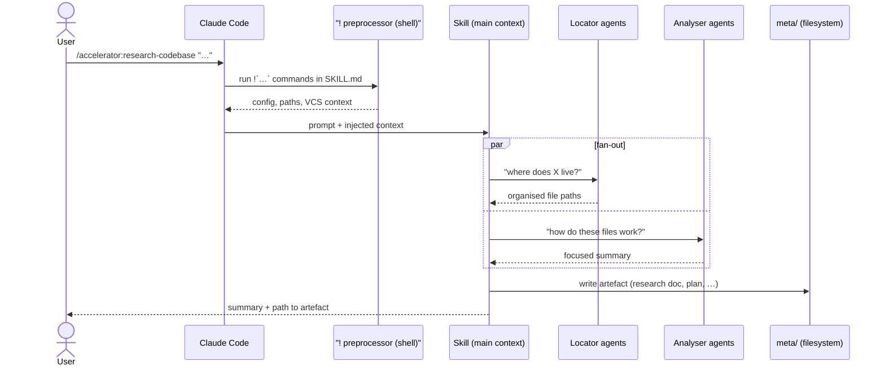

## Anatomy of a skill invocation

Every skill is a `SKILL.md` prompt with YAML frontmatter. The
non-obvious mechanism is the **`!` preprocessor**: lines of the form
``!`command` `` in the skill body are executed by Claude Code *at
invocation time*, and their output is injected into the prompt before
the model sees it. That is how a skill like `commit` starts with live
VCS status, recent log, and project configuration already in context —
without spending any conversation turns gathering them.

Once running, a skill that needs exploratory work fans out to
subagents, each in an isolated context, and finishes by writing its
artefact to `meta/`:


```mermaid
sequenceDiagram
  actor User
  participant CC as Claude Code
  participant Shell as "! preprocessor (shell)"
  participant Skill as Skill (main context)
  participant Loc as Locator agents
  participant Ana as Analyser agents
  participant FS as meta/ (filesystem)

  User->>CC: /accelerator:research-codebase "…"
  CC->>Shell: run !`…` commands in SKILL.md
  Shell-->>CC: config, paths, VCS context
  CC->>Skill: prompt + injected context
  par fan-out
    Skill->>Loc: "where does X live?"
    Loc-->>Skill: organised file paths
  and
    Skill->>Ana: "how do these files work?"
    Ana-->>Skill: focused summary
  end
  Skill->>FS: write artefact (research doc, plan, …)
  Skill-->>User: summary + path to artefact
```

Three properties of this sequence matter:

- **Context is injected, not gathered.** The preprocessor output
  arrives as part of the prompt, so the skill never burns turns (or
  context) running orientation commands.
- **Exploration is quarantined.** Locators and analysers do the
  broad searching and deep reading in their own context windows; only
  summaries return (see [Agents](#agents) below).
- **The output is a file, not a message.** The durable result lands
  in `meta/`, where the next skill — possibly in a different session —
  picks it up.

Scripts referenced by skills are addressed via `${CLAUDE_PLUGIN_ROOT}`,
so they resolve from the installed plugin location rather than the
project being worked on.

## The `meta/` Directory

Every project using Accelerator gets a `meta/` directory (by default) that
serves as persistent state for the development workflow. Each skill reads from
and writes to predictable paths within it. Run
[`/init`](reference/skills/config/init.md) to create all directories up
front, or let skills create them on first use.
These paths can be overridden via the `paths` configuration section:

`research/` is itself subdivided into four subcategories — codebase
research, issue/RCA research, design inventories, and design gaps:

| Directory                       | Purpose                                                        | Written by                                                   |
|---------------------------------|----------------------------------------------------------------|--------------------------------------------------------------|
| `research/`                     | (parent — see subcategories below)                             | —                                                            |
| `  ├─ codebase/`                | Codebase research findings with YAML frontmatter               | `research-codebase`                                          |
| `  ├─ issues/`                  | Issue / RCA research findings                                  | `research-issue`                                             |
| `  ├─ design-inventories/`      | Per-source design inventory snapshots (markdown + screenshots) | `inventory-design`                                           |
| `  └─ design-gaps/`             | Design-gap analysis artefacts                                  | `analyse-design-gaps`                                        |
| `plans/`                        | Implementation plans with phased changes                       | `create-plan`                                                |
| `decisions/`                    | Architecture decision records (ADRs)                           | `create-adr`, `extract-adrs`, `review-adr`                   |
| `reviews/`                      | Review summaries and per-lens results                          | `review-pr`, `review-plan`                                   |
| `validations/`                  | Plan validation reports                                        | `validate-plan`                                              |
| `prs/`                          | PR descriptions                                                | `describe-pr`                                                |
| `work/`                         | Work item files referenced by planning                         | `create-work-item`, `extract-work-items`, `update-work-item` |
| `notes/`                        | Notes and working documents                                    | `create-note`                                                |

This approach means:

- No skill assumes access to another skill's conversation history
- Work survives session boundaries and context compaction
- Plans can be resumed after interruption (implement-plan picks up from the
  first unchecked item)
- Artefacts are structured and machine-parseable (YAML frontmatter, JSON
  schemas)

## Agents

Accelerator uses specialised subagents to keep the main context lean. Each
agent runs in its own context window with restricted tools, returning only a
focused summary to the parent:

| Agent                       | Role                                                              | Tools                                                                                                                                                                                                                                               |
|-----------------------------|-------------------------------------------------------------------|-----------------------------------------------------------------------------------------------------------------------------------------------------------------------------------------------------------------------------------------------------|
| **codebase-locator**        | Finds files and components by description                         | Grep, Glob, LS                                                                                                                                                                                                                                      |
| **codebase-analyser**       | Analyses implementation details of specific components            | Read, Grep, Glob, LS                                                                                                                                                                                                                                |
| **codebase-pattern-finder** | Finds similar implementations and usage examples                  | Read, Grep, Glob, LS                                                                                                                                                                                                                                |
| **documents-locator**       | Discovers relevant documents in configured directories            | Grep, Glob, LS                                                                                                                                                                                                                                      |
| **documents-analyser**      | Extracts insights from meta documents                             | Read, Grep, Glob, LS                                                                                                                                                                                                                                |
| **reviewer**                | Evaluates code/plans through a specific quality lens              | Read, Grep, Glob, LS                                                                                                                                                                                                                                |
| **web-search-researcher**   | Researches external documentation and resources                   | WebSearch, WebFetch, Read, Grep, Glob, LS                                                                                                                                                                                                           |
| **browser-locator**         | Locates routes/screens/components in a running app via Playwright | Bash (`accelerator design executor navigate\|snapshot`)                   |
| **browser-analyser**        | Analyses screens, captures state and screenshots via Playwright   | Bash (`accelerator design executor navigate\|snapshot\|screenshot\|evaluate\|click\|type\|wait_for`) |

The separation between locators (find, no Read) and analysers (understand, with
Read) is deliberate: it prevents any single agent from needing to both search
broadly and read deeply, keeping each agent's context bounded.

`browser-*` agents drive Playwright through `accelerator design executor`,
which launches and reuses a Node.js TCP daemon running Chromium. No MCP server
is required. See `skills/design/inventory-design/PROTOCOL.md` for the executor
wire protocol.

## VCS Detection

Accelerator automatically detects whether a repository uses git or
[jujutsu (jj)](https://github.com/jj-vcs/jj) and adapts its behaviour
accordingly. A `SessionStart` hook inspects the working directory for `.jj/` and
`.git/` directories, injecting VCS-specific context (command references and
conventions) into the session. Detection also recognises git **linked
worktrees** — where `.git` is a file (a `gitdir:` pointer) rather than a
directory — so worktree-based sessions are detected just like plain checkouts. A
complementary `PreToolUse` guard warns when raw git commands are used in a
jujutsu repository.

This means all VCS-aware skills — `commit`, `respond-to-pr`, and ad-hoc
interactions — use the correct CLI commands without manual configuration. The
detection covers three modes:

| Mode               | Detected when      | VCS commands used |
|--------------------|--------------------|-------------------|
| **git**            | `.git/` only       | `git`             |
| **jj (colocated)** | `.jj/` and `.git/` | `jj`              |
| **jj (pure)**      | `.jj/` only        | `jj`              |

## Terminal Invocation

Accelerator's CLI can be run from an ordinary terminal, not only from inside a
Claude Code session. Because the plugin is installed into a version-scoped
directory that moves on every upgrade, the supported route is a two-hop chain:

```
~/.local/bin/accelerator                # you create this, once
  -> <plugin data>/bin/accelerator      # a SessionStart hook refreshes this
    -> <plugin root>/bin/accelerator    # version-pinned, moves on upgrade
```

The hop you create points at a target that never moves, so it never needs
re-running. The hop that must track the version is owned by
`hooks/launcher-link-refresh.sh`, which refreshes it at every session start.
This requires Claude Code **v2.1.78 or later** (the release that added the
plugin data directory). Below that, link `<plugin root>/bin/accelerator`
directly and re-run the link after each upgrade.

**Supported platforms**: macOS or Linux (including WSL) on x86-64 or arm64. The
CLI refuses anything else, so Git Bash, Cygwin, armv7, riscv64 and ppc64le are
out of scope. The Linux artifacts are statically linked (musl), so there is no
glibc floor. Under WSL the plugin data directory must sit on the Linux
filesystem — a `/mnt/<drive>` DrvFs path cannot hold symlinks.

### Setting it up

First, find the path the hook maintains. It is printed by the hook whenever it
re-points the link, and otherwise discoverable:

```bash
CLAUDE_DIR="${CLAUDE_CONFIG_DIR:-$HOME/.claude}"
ls -d "$CLAUDE_DIR"/plugins/data/*accelerator*/bin/accelerator
```

Typical results, one per channel:

| Channel     | Typical path                                                       |
|-------------|--------------------------------------------------------------------|
| Stable      | `~/.claude/plugins/data/accelerator-atomic-innovation/bin/accelerator` |
| Prerelease  | `~/.claude/plugins/data/accelerator-atomic-innovation-prerelease/bin/accelerator` |

These are examples rather than a contract: `~/.claude` moves with
`CLAUDE_CONFIG_DIR`, and the directory name is derived from the plugin
identifier. Prefer the discovery command, or the path the hook printed.

Verify it exists and points somewhere real before linking anything:

```bash
ls -l <discovered path>
```

If it is missing, the hook has not run — start a Claude Code session first, and
check your Claude Code version against the floor above.

Then create your own hop:

```bash
mkdir -p ~/.local/bin
ln -sfn <discovered path> ~/.local/bin/accelerator
```

The `mkdir -p` is not optional; `~/.local/bin` frequently does not exist, and
`ln` then fails with `No such file or directory`. Prefer a directory you own
that is not group-writable: this command fetches and executes signed binaries,
so its `PATH` entry is part of the trust chain, and Homebrew-managed
`/usr/local/bin` is often group-writable.

`~/.local/bin` is not on `PATH` by default on macOS, and some Linux
distributions add it only in a login shell. Open a new shell and check:

```bash
command -v accelerator
```

If that prints nothing, the directory is not on your `PATH`. In a POSIX shell:

```bash
case ":$PATH:" in *":$HOME/.local/bin:"*) echo on ;; *) echo missing ;; esac
```

Add it in your shell profile. In fish the diagnostic above is a syntax error and
the fix is `fish_add_path ~/.local/bin`.

If you track both channels, link the second under a different name — for
example `accelerator-pre` — so the two do not collide.

### Which installation am I running?

The link is opaque, so ask the CLI:

```bash
accelerator version                          # the resolved installation
readlink ~/.local/bin/accelerator            # your hop
readlink "$(readlink ~/.local/bin/accelerator)"   # the plugin-owned hop
```

This matters because the plugin-owned hop is **channel-global with
last-session-wins semantics**. A session started before an upgrade re-points it
to the older installation for every terminal user and every concurrent session,
not just itself — and what it selects is the whole installation: the bootstrap,
the vendored verifier, the release key and the launcher cache. So a stale
session can put your terminal command back on an installation old enough to
predate a security fix, for as long as Claude Code retains the old directory
(observed at roughly two weeks, though that is Claude Code's behaviour rather
than something this plugin controls). `/reload-plugins` corrects it immediately;
the next session corrects it anyway.

### Offline, mirrored and read-only installs

The terminal surface assumes a cache already populated by a Claude Code session.
A first run against an empty cache needs network access to the artifact host and
has no degraded mode. Two environment variables cover the awkward cases:

| Variable                       | Effect                                          |
|--------------------------------|-------------------------------------------------|
| `ACCELERATOR_CACHE_DIR`        | Where the launcher is staged and executed from  |
| `ACCELERATOR_RELEASE_BASE_URL` | Where release artifacts are fetched from        |

Both are trust-root inputs rather than ordinary conveniences. The cache
directory is where signed binaries are staged and executed from, so point it at
a directory you own and that is not group-writable. The release base URL should
be a host you trust not to serve an older signed release: the cache key carries
no content hash, so a mirror can hand back an older validly-signed launcher for
the current version.

The bootstrap needs that directory to be writable and executable on a *cold*
start — one where it has no verified launcher cached, which includes the first
run after a version bump and any run where verification fails. It writes and
*executes* a probe file there to check. A *warm* start neither writes nor
probes; it runs the already-staged verifier and launcher instead, so a cache
directory populated once may afterwards be read-only for warm bootstrap
invocations. Sub-binary dispatch follows the same rule, with warm meaning what
it does for the bootstrap: a cached binary that re-verifies successfully. Such a
dispatch resolves from the cache and re-verifies what it finds there without
writing or probing, so it too tolerates a read-only cache directory. Only a cold
dispatch probes — a first use of that subcommand, the first run after a version
bump, or a run where re-verification fails and the binary must be refetched.

A cold dispatch against a cache directory that is not writable and exec-capable
fails at the probe with a `no usable cache directory` error naming the
directory. What that means for the caller depends on why the dispatch went cold,
and on `--fail-safe` — a flag the plugin's own hooks and skills pass so a
launcher failure degrades rather than breaks the session. Under it, a first-use
or version-bump miss exits 0: the subcommand simply does not run, with only a
warning on stderr. So does a cached copy that could not be *read*. But a cached
copy that fails its checksum or signature check and cannot then be refetched is
reported as confirmed tampering — a `cached copy failed verification` message
with the probe error nested inside it — which `--fail-safe` never swallows: it
exits 2, and for the `PreToolUse` guard that blocks the tool call rather than
letting it through.

A cache directory can therefore only be kept read-only for a fixed set of
subcommands at a fixed version. Make it writable and exec-capable, run every
subcommand you intend to use — including the ones the plugin dispatches for you,
such as `vcs`, which the git guard runs on every Bash tool call — then set it
read-only again, and repeat after each plugin upgrade, since a version bump
makes every subcommand cold again. A subcommand left cold does not fail loudly
under `--fail-safe`; it silently does not run. If that upkeep is impractical,
point `ACCELERATOR_CACHE_DIR` at a writable, exec-capable directory instead.

`ACCELERATOR_PLUGIN_ROOT` is **exported by** the bootstrap for the launcher it
runs; it is never read as an input. Setting it has no effect.

### Removing it

Uninstalling the plugin stops the hook that maintains the second hop, but leaves
your own link behind as a broken `accelerator` on `PATH`. Remove it yourself:

```bash
rm ~/.local/bin/accelerator
```
