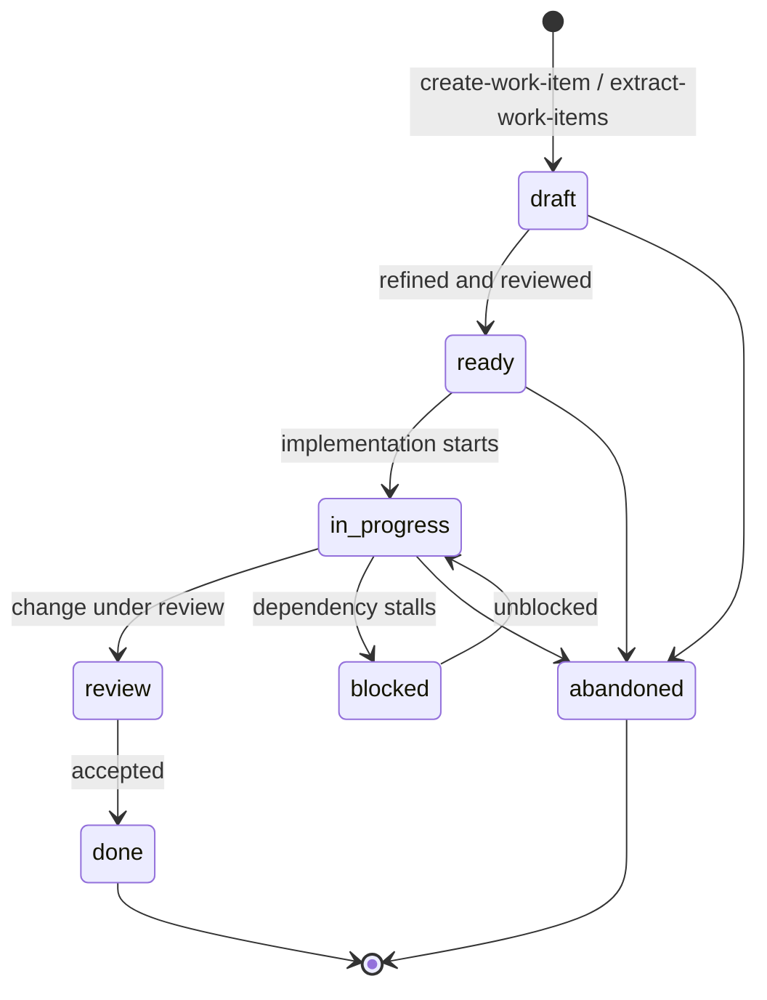

The `meta/` directory is the persistent shared memory that lets skills
communicate through the filesystem instead of the conversation. Each
skill reads and writes predictable paths within it. Every path below is
the plugin default; all are configurable via `/configure` (see
[Configuration](../configuration.md)) — the `paths.*` keys map one-to-one
onto these directories.

## Directory map

| Path                              | Contents                        | Written by                                                              | Read by                                     |
| --------------------------------- | ------------------------------- | ----------------------------------------------------------------------- | ------------------------------------------- |
| `meta/work/`                      | Work items (`NNNN-title.md`)    | [create-work-item](skills/work/create-work-item.md), [extract-work-items](skills/work/extract-work-items.md), [refine-work-item](skills/work/refine-work-item.md), [update-work-item](skills/work/update-work-item.md), [sync-work-items](skills/work/sync-work-items.md), [conduct-spike](skills/research/conduct-spike.md) | [list-work-items](skills/work/list-work-items.md), [review-work-item](skills/work/review-work-item.md), [create-plan](skills/planning/create-plan.md) |
| `meta/plans/`                     | Phased implementation plans     | [create-plan](skills/planning/create-plan.md); [implement-plan](skills/planning/implement-plan.md) ticks criteria | [review-plan](skills/planning/review-plan.md), [stress-test-plan](skills/planning/stress-test-plan.md), [validate-plan](skills/planning/validate-plan.md), [extract-adrs](skills/decisions/extract-adrs.md) |
| `meta/research/codebase/`         | Codebase research documents     | [research-codebase](skills/research/research-codebase.md)               | [create-plan](skills/planning/create-plan.md), [extract-adrs](skills/decisions/extract-adrs.md) |
| `meta/research/issues/`           | Root-cause analyses (RCAs)      | [research-issue](skills/research/research-issue.md)                     | planning and work-item skills               |
| `meta/research/design-inventories/` | Design inventory snapshots    | [inventory-design](skills/design/inventory-design.md)                   | [analyse-design-gaps](skills/design/analyse-design-gaps.md) |
| `meta/research/design-gaps/`      | Design gap artefacts            | [analyse-design-gaps](skills/design/analyse-design-gaps.md)             | [extract-work-items](skills/work/extract-work-items.md) |
| `meta/decisions/`                 | Architecture decision records   | [create-adr](skills/decisions/create-adr.md), [extract-adrs](skills/decisions/extract-adrs.md); [review-adr](skills/decisions/review-adr.md) transitions status | research and planning skills                |
| `meta/notes/`                     | Short-form notes                | [create-note](skills/notes/create-note.md)                              | research skills via `documents-locator`     |
| `meta/prs/`                       | PR descriptions                 | [describe-pr](skills/github/describe-pr.md)                             | [review-pr](skills/github/review-pr.md)     |
| `meta/validations/`               | Plan validation reports         | [validate-plan](skills/planning/validate-plan.md)                       | —                                           |
| `meta/reviews/plans/`             | Plan review artefacts           | [review-plan](skills/planning/review-plan.md)                           | —                                           |
| `meta/reviews/prs/`               | PR review artefacts             | [review-pr](skills/github/review-pr.md)                                 | —                                           |
| `meta/reviews/work/`              | Work-item review artefacts      | [review-work-item](skills/work/review-work-item.md)                     | —                                           |
| `meta/global/`                    | Cross-repo / org-wide context   | you, by hand                                                             | research skills via `documents-locator`     |

Beyond these directed reads, the `documents-locator` and
`documents-analyser` [agents](agents.md) search *all* configured paths
during research, so anything captured in `meta/` can resurface as
context later.

## Artefact lifecycle

### Work items

Work items carry a `status` field in their YAML frontmatter. The
template allows `draft`, `ready`, `in-progress`, `review`, `done`,
`blocked`, and `abandoned`. The typical flow:

Transitions are made with
[update-work-item](skills/work/update-work-item.md), which shows a diff
preview but enforces no state machine — any field change is allowed. The
diagram is the convention, not a constraint.

### Plans

Plans use `draft` → `ready` → `in-progress` → `done`. A plan starts as a
`draft` from [create-plan](skills/planning/create-plan.md), becomes
`ready` once reviewed and approved,
[implement-plan](skills/planning/implement-plan.md) moves it through
`in-progress` while ticking success criteria, and `done` marks a fully
implemented plan —
[validate-plan](skills/planning/validate-plan.md) then confirms the code
matches it.

### ADRs

ADRs use `proposed` → `accepted` | `rejected`, and accepted ADRs can
later become `superseded` or `deprecated`. They are **append-only**:
[review-adr](skills/decisions/review-adr.md) enforces that only a
`proposed` ADR's content can be modified. To revise an accepted
decision, run [create-adr](skills/decisions/create-adr.md) with
`--supersedes ADR-NNNN`; the
original is marked superseded, never edited.

### Everything else

Research documents, reviews, validations, and PR descriptions are
point-in-time artefacts (`status: complete`); notes are `captured`.
Design inventories start as `draft` and are `superseded` when a newer
snapshot of the same source is taken — the old snapshot is kept.
