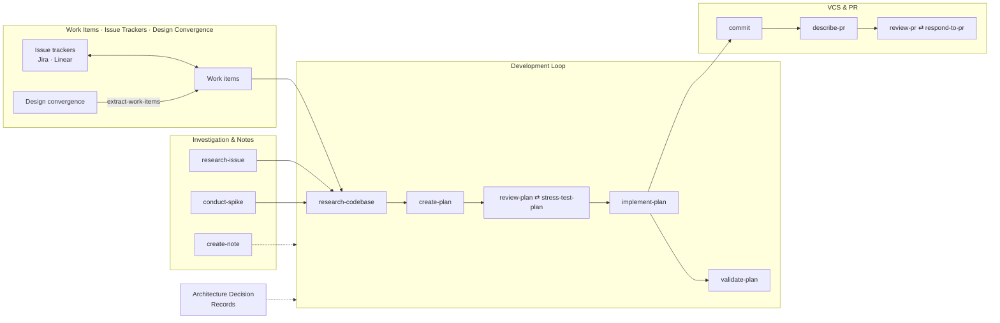

Accelerator is a toolkit, not a fixed pipeline. The skills are designed to fit
together end to end — from capturing work through to shipping a PR — but you
pick the parts you need. A bug fix might be `research-issue → create-plan →
implement-plan`; a larger feature might run the whole map below.

The spine is the [Development Loop](development-loop.md) — **research → plan →
implement**. The other families attach to it: some feed work in before research,
others capture decisions along the way and land the change after.

Each box below is a skill family from [All Skills](skills/index.md).

## How the families fit together

Each heading below is a skill family from [All Skills](skills/index.md). They
are ordered by where they sit relative to the spine — what feeds work in, the
loop itself, and what lands the result.

**Work Items, Issue Trackers & Design Convergence — what gets worked on.**
[Work items](skills/work-items.md) are the unit of work. They can be created
locally, or synced both ways with a remote
[issue tracker](skills/issue-trackers.md) (Jira or Linear).
[Design convergence](skills/design-convergence.md) feeds the funnel from the
other side: it inventories a frontend, analyses gaps, and emits a document that
[`extract-work-items`](skills/work-items.md#extract-work-items) turns into work
items.

**Investigation & Notes — understand before planning.**
Two skills feed the loop ahead of research when needed:
[`research-issue`](skills/investigation.md#research-issue) for hypothesis-driven
bug investigation, and
[`conduct-spike`](skills/investigation.md#conduct-spike) for time-boxed
uncertainty reduction. [`create-note`](skills/investigation.md#create-note)
captures observations at any point.

**Development Loop — the spine.**
The loop opens with
[`research-codebase`](skills/development-loop.md#research-codebase), which
investigates the code and writes a structured findings document.
[`create-plan`](skills/development-loop.md#create-plan) builds a phased plan from
that research; [`review-plan`](skills/development-loop.md#review-plan) and
[`stress-test-plan`](skills/development-loop.md#stress-test-plan) iterate on its
quality before any code is written;
[`implement-plan`](skills/development-loop.md#implement-plan) executes it phase by
phase; [`validate-plan`](skills/development-loop.md#validate-plan) confirms the
result matches the plan. See the [Development Loop](development-loop.md) for
detail.

**Architecture Decision Records — captured as you go.**
[ADRs](skills/adrs.md) record architectural decisions made during planning or
implementation; [`extract-adrs`](skills/adrs.md#extract-adrs) pulls them out of
existing research and plan documents.

**VCS & PR — land the change.**
The [VCS & PR workflow](skills/vcs-and-pr.md) closes the loop:
[`commit`](skills/vcs-and-pr.md#commit) through implementation, then
[`describe-pr`](skills/vcs-and-pr.md#describe-pr),
[`review-pr`](skills/vcs-and-pr.md#review-pr), and
[`respond-to-pr`](skills/vcs-and-pr.md#respond-to-pr) to get the change reviewed
and merged.

Every skill reads and writes the shared [`meta/`](philosophy.md) directory, so
phases hand off through the filesystem rather than the conversation. For the
complete catalogue, see [All Skills](skills/index.md).
