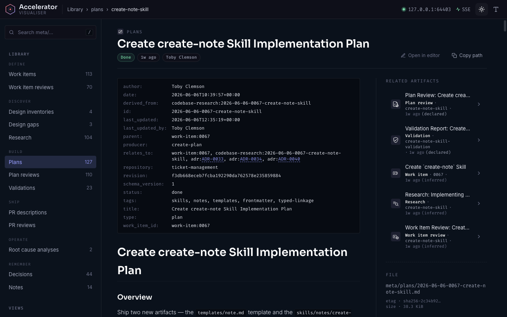

# 🚀✨ Accelerator 1.21 **AND** 1.22 are here 🎉🥳

📣📣📣 Gather round, team. 📣📣📣 Two releases dropped and they are 🔥
absolutely 🔥 stuffed 🔥 with the kind of features you didn't know you were
allowed to want. 🙏

TL;DR for the chronically busy 🕐: **the visualiser got *gorgeous* 🖼️, Jira
**and** Linear now talk to Accelerator natively 🔌, root-cause analysis is a
slash command 🔍, and your whole `meta/` corpus is now one clean schema 🧼.**
But you have to upgrade *correctly* — see the ⚠️ bit near the bottom before you
do literally anything else. ⬇️

---

## 🖼️ The Meta Visualiser (1.21) — now genuinely lovely (1.22)

1.21 shipped the **browser-based companion view of your `meta/` directory** 🌐.
Launch it with `/accelerator:visualise` (or the `accelerator-visualiser` CLI)
and get three views:

- 📚 **Library** — a proper Markdown reader for *every* doc type, with
  cross-reference rendering and `[[WORK-ITEM-NNNN]]` / `[[ADR-NNNN]]` wiki-link
  resolution. 🔗
- ⏳ **Lifecycle** — clustered timelines so you can watch a work item travel
  research → plan → implement. 🛤️
- 📋 **Kanban** — drag-and-drop work-item status updates 🖱️, columns
  configurable via `visualiser.kanban_columns`. ✅

Then 1.22 came along and made it *nice* 💅:

- 🔎 **Global search** — sidebar search box (mash `/` to focus 🎯) across every
  doc's title, slug, and body preview. Bucket-and-rank ordered, because of
  course it is. 🪣
- 📋➡️ **Detail-page actions** — "Copy path" and "Open in editor" buttons.
  The editor deep-link is configured via `visualiser.editor` (VS Code-family
  *and* JetBrains presets 🧩, or roll your own `{abs}`/`{rel}` template).
- 🧭 **Recovery surfaces** — a "Did you mean…" 🤔 not-found page with ranked
  suggestions instead of a sad blank screen. 😌
- 🛠️ **Operate category** — root-cause analyses from `meta/research/issues/`
  are now first-class browsable documents. 🩺
- 🧱 **Templates view** — your `templates/` directory, auto-discovered and
  browsable, each showing its active resolution tier. 🔭
- 💄 **Reader polish** — remapped typography scale, shared border-radius tokens,
  styled tables / inline code / task-list checkboxes ☑️, and smoother kanban
  drag-and-drop. *Chef's kiss.* 😘👌
- 😴 **Configurable idle auto-shutdown** — set `visualiser.idle_timeout`
  (`"8h"`, `"30m"`, `"1h30m"`, or `never` for the brave). Default bumped from a
  jittery 30 minutes to a relaxed 8 hours ⏰ so your review tab stops dying
  mid-thought.

---

## 🔌 Issue trackers, natively (no CLI gymnastics 🤸)

### 🟦 Jira Cloud (1.21)

Eight verb-decomposed skills 🎱 talking straight to the Jira REST API v3 — **no
external CLI dependency**. Run `/accelerator:init-jira` once, then:
`search-jira-issues` 🔍, `show-jira-issue` 👀, `create-jira-issue` ✍️,
`update-jira-issue` 🖊️, `comment-jira-issue` 💬, `transition-jira-issue` 🔀,
and `attach-jira-issue` 📎.

### 🟣 Linear Cloud (1.22)

The exact same energy ⚡, now over the **Linear GraphQL API** — also **no
external CLI**. `/accelerator:init-linear` once, then `search-linear-issues` 🔍,
`show-linear-issue` 👀, `create-linear-issue` ✍️, `update-linear-issue` 🖊️,
`comment-linear-issue` 💬, `transition-linear-issue` 🔀, and
`attach-linear-issue` 📎. Set `work.integration: linear` and it auto-scopes. 🎯

Token-only auth, kept in your gitignored `.accelerator/config.local.md` 🔐. Read
skills trigger on natural language; write skills are slash-only with a payload
preview + confirmation 🛡️ so nothing surprises your tracker.

### 🔁 Remote-tracker sync ergonomics (1.22)

`/accelerator:create-work-item` offers to push to your configured tracker on
accept 📤, `create-jira-issue` accepts a work-item file and writes the created
key back to `external_id` 🔖, and `/accelerator:list-work-items` shows a
per-item Sync column 📊 when an integration is configured.

---

## 🔍 Root-cause analysis as a slash command (1.21)

`/accelerator:research-issue` 🕵️ — hypothesis-driven RCA for production
issues and bugs. Throw it a stacktrace 📉, a log 📜, an error message ⚠️, or
just a vague "it feels slow" 😶‍🌫️, and it investigates multiple hypotheses with
parallel sub-agents 🤖🤖🤖 before writing a tidy RCA into `meta/research/issues/`.

## 🎨 Design-convergence workflow (1.21)

A whole new `skills/design/` category 🆕. `/accelerator:inventory-design`
crawls a design source — static code analysis (`--crawler code`, zero runtime
deps) or a *real browser* 🌐 (`--crawler runtime|hybrid`) — and
`/accelerator:analyse-design-gaps` diffs two inventories across five drift
categories 📐 into a gap report that feeds straight into
`/accelerator:extract-work-items`. ➡️

## 🗒️ Quick capture + tidier ADRs (1.22)

- `/accelerator:create-note` 📝 — capture a short-form note (observation,
  insight, snippet) to `meta/notes/` in a single round-trip. No sub-agents, no
  ceremony. 🎈
- `rejected` ADR status ❌ — the ADR vocabulary is now `proposed | accepted |
  rejected | superseded | deprecated`.

---

## ⚠️🚨 READ THIS BEFORE YOU UPGRADE 🚨⚠️ (yes, you 👈)

This is the boring bit that is somehow the *most* important bit. 🫶

### 👥 Upgrade as a whole team, at the same time

These releases change on-disk schemas and config layout 🗂️. A repo that's
half-upgraded is a repo where the visualiser quietly drops work items off the
board 👻 and teammates step on each other's frontmatter. **Coordinate the bump.
Everyone hops to the new version together — no stragglers. 🧍🚫**

### 🪄 Run `/accelerator:migrate` on every existing repo

After updating the plugin:

1. 🔁 **Restart your Claude Code session.**
2. 🪄 **Run `/accelerator:migrate`** *before your next Accelerator skill
   invocation.*

- Coming from **1.20 → 1.21**: applies migrations **0003–0006** (consolidates
  state under `.accelerator/`, restructures `meta/research/`, renames work-item
  `type` → `kind`, canonicalises `work_item_id`/`author`). 🧰
- Coming from **1.21 → 1.22**: applies migration **0007**, unifying your entire
  `meta/` corpus to the canonical ADR-0033/0034 schema 🧼. **The 1.22 visualiser
  reads only this unified schema** — until you migrate, anything still keyed by
  the old `work-item:` / `ticket:` / filename-derived shapes silently vanishes
  from the library and kanban. 🫥 Running the migration brings it all back. 🪄✨

The migrate runner refuses to run on a dirty working tree 🧹, previews every
change before applying 👁️, is idempotent 🔂, and is fully recoverable with a VCS
revert (`jj op restore` / `git reset`). So: deep breath, migrate, done. 😮‍💨✅

> 🧪 **Heads up for `--crawler runtime|hybrid` design crawl users (1.21):** the
> Playwright MCP integration is gone — runtime crawls now need **Node.js ≥ 20**
> and the project-scoped Playwright MCP server was removed (re-register it in
> *your* MCP config if you relied on it). `--crawler code` is unaffected. 🟢

---

## ⭐ Are you getting value out of Accelerator? ⭐

If any of the above made you go "oh, *nice*" 😍 — please **drop us a star on
GitHub** 🌟. It is genuinely the cheapest, kindest thing you can do 🫰: it helps
other teams find the plugin 🔭, and it makes the maintainers feel briefly,
gloriously visible. 🥹 One click. 🖱️ That's the whole ask. ⭐👉

---

🏁 **Upgrade together, migrate once, and go build something. 🛠️💛**
*Emoji budget for this announcement: comfortably exceeded. 🤷📈*
