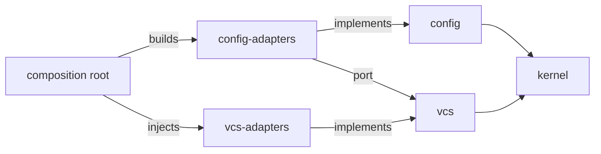

# ADR-0069: Crate Dependency Rules for the Hexagonal CLI Workspace

**Date**: 2026-10-05
**Status**: Accepted
**Author**: Toby Clemson

## Context

ADR-0053 makes each bounded context a hexagon and requires dependencies to
point inward, towards the domain. ADR-0054 splits the `cli/` workspace into
crates and makes each sub-binary a composition root. Neither decision says
which crate may depend on which once more than one context is involved. The
workspace now has over 40 crates and many edges between contexts, and each of
those edges was decided in its own plan.

Those decisions have drifted apart. Some adapters reach another context's
adapters directly (`corpus-adapters` → `vcs-adapters`). One crate,
`consent-adapters`, exists only to keep `gix` and `jj-lib` out of its
siblings' dependents, a packaging concern given an architectural boundary. A
domain crate reaches a YAML codec (`migrate` → `document`), and the launcher
reaches tracker policy (`launcher` → `tracker-support`). Nothing checks
dependency direction between workspace crates. `cargo-pup` checks `use`
paths, and `cargo-deny` checks third-party crates.

ADR-0054 also says the launcher "depends on `kernel` (and `config` …), never
on a subdomain". This rules out the launcher answering a VCS question
in-process, even though `vcs` is something other contexts build on rather
than a feature a sub-binary ships.

## Decision Drivers

- Dependencies point inward and are enforced mechanically, not by convention
  (ADR-0053).
- One context's capability reaches another through a port, bound at a
  composition root.
- Few crates. A crate boundary has to mean something architecturally.
- A placement rule general enough to settle a new crate's edges without a new
  decision.

## Considered Options

1. **Case by case** — keep deciding each edge in the plan that introduces it.
2. **Adapter reuse** — allow an adapter to depend on an upstream context's
   adapter when it consumes that context as infrastructure.
3. **Strict injection** — adapters depend only on domain crates; another
   context's capability arrives through that context's port, injected at a
   composition root.
4. **Coarser crates** — merge contexts into fewer, larger crates so most edges
   become module edges inside one crate.

## Decision

We will hold every workspace crate to strict injection (option 3), using the
roles, context kinds and rules below.

Every workspace crate has one **role**:

| Role | Examples | Holds |
|---|---|---|
| Kernel | `kernel` | contracts every crate shares, including naming constants |
| Domain | `config`, `vcs`, `work` | one context's model and its ports |
| Adapter | `vcs-adapters`, `jira-client`, `tracker-support` | implementations of one context's ports |
| Technical library | `document`, `store`, `process-probe`, `remote-projection` | codecs and I/O primitives belonging to no context |
| Composition root | `*-cli`, `launcher`, `visualiser/server` | wiring of ports to adapters |
| Test support | `*-test-support` | dev-only fixtures; exempt |
| Bootstrap verifier | `verify` | the launcher's root of trust; exempt |

Every context has one **kind**:

- **Platform** (`config`, `vcs`, `corpus`): general capabilities any
  context may build on.
- **Shared** (`tracker`): an abstraction serving a declared, closed set of
  downstream contexts (`work`, `jira`, `linear`).
- **Product** (`work`, `research`, `design`, `collaboration`, `migrate`,
  `jira`, `linear`): what the sub-binaries exist to ship. No other context
  depends on a product context.

The rules:

1. **Inward.** A domain crate depends only on `kernel` and on upstream
   domain crates. It reaches a technical library only through one of its own
   ports.
2. **Upstream and acyclic.** An edge between contexts points to a platform
   context, or to a shared context that has declared the downstream. It never
   points to a product context.
3. **Shared models only.** A domain crate depends on another domain crate
   only when its own model is expressed in the upstream's terms (`work`'s
   items are `tracker` items). Avoiding a translation is not a reason; the
   translation belongs in an adapter.
4. **Injection between contexts.** An adapter depends on its own and
   upstream domain crates, on technical libraries, and on adapters of its own
   context. It never depends on another context's adapter. That capability
   arrives through the other context's port, injected at a composition root.
   The one exception is a shared context: its adapters (`tracker-support`)
   hold policy that its declared downstreams' adapters share, and those
   adapters may depend on them.
5. **Wiring at roots.** Only a composition root binds one context's adapters
   to another context's ports. A composition root may depend on any crate
   except another composition root.
6. **Launcher.** The launcher is a composition root limited to `kernel`, the
   domain and adapter crates of platform contexts, and technical libraries.
   This replaces ADR-0054's "never on a subdomain" clause; the rest of
   ADR-0054 stands.
7. **Packaging is separate.** Binary size, linked licence closure and compile
   time are governed by `cli/deny.toml` and by measurement. Below the
   composition roots they never justify adding or keeping a crate boundary.
   One composition root per sub-binary remains ADR-0054's packaging decision.
8. **Enforcement.** Each crate declares its role and context in its manifest.
   A lint over `cargo metadata` rejects every normal and build dependency the
   rules forbid. Registering a crate includes declaring both. The lint reads
   declared dependencies rather than `use` paths, so it runs on the stable
   toolchain and catches a dependency that is declared but never imported.

We rejected option 1 because it produced the inconsistencies described
above, and nothing checks it. We rejected option 2 because an adapter that
reaches another context's adapter does that context's wiring for it, and that
wiring is hidden from the composition root. Option 2 is also what let
packaging-driven crates such as `consent-adapters` look principled. We
rejected option 4 because it trades many small edges for crates that each
mix several contexts' models, and ADR-0054 chose one crate per context for
independent shipping.

## Consequences

### Positive

- One rule settles where a new crate may point. Plans stop deciding edges
  one at a time.
- Every edge between contexts is visible at a composition root, and test
  doubles can replace it.
- Crates that exist only for packaging are merged away. `consent-adapters` is
  the first.
- A domain crate's closure is free of codecs and I/O, as the `config` domain
  crate already requires.

### Negative

- More port traits and more injection code at composition roots. The same
  wiring repeats across every root that needs a capability.
- If the launcher answers VCS questions in-process, it links `gix` and
  `jj-lib`. Its binary grows, its warm-dispatch latency needs re-measuring,
  and it carries the MPL-2.0 notice obligation `uluru` brings.
- Existing edges violate the rules and must be refactored, among them 10
  adapter → adapter edges across 7 crates.
- Deciding whether a context is platform, shared or product is a judgement
  call. A misclassified context weakens rules 2 and 6.

### Neutral

- ADR-0054 is superseded only in its launcher clause. Following ADR-0039's
  precedent, it stays `accepted` and unedited, and this ADR is where the
  supersession is recorded.
- `cargo-pup` keeps enforcing direction inside a crate. The new lint covers
  the edges between crates that ADR-0053 assigned to "crate boundaries" but
  nothing checked.

## References

- `meta/decisions/ADR-0053-thin-cli-over-a-hexagonal-ports-and-adapters-core.md`
  — Hexagonal pattern and the inward rule
- `meta/decisions/ADR-0054-git-style-modular-cli-of-on-demand-static-binaries.md`
  — Crate split and the launcher clause partially superseded here
- `meta/decisions/ADR-0039-border-radius-consumption-rule.md` — Precedent for
  recording a partial supersession
- `meta/plans/2026-09-25-0226-unify-the-trust-barrier-for-consent-config-keys.md`
  — Origin of `consent-adapters`
- `meta/plans/2026-08-10-0185-converge-corpus-adapters-on-library-backed-vcs.md`
  — Origin of the first adapter → adapter edge
- `meta/work/0299-bring-the-cli-workspace-s-crate-dependencies-into-line-with.md`
  — Brings the existing edges into line with these rules
