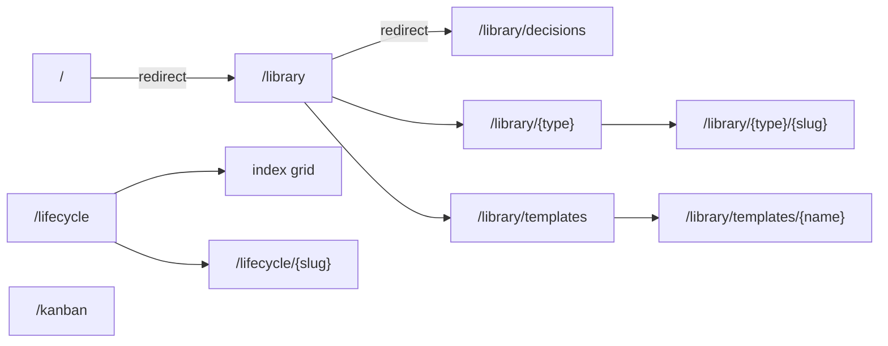

# Design Inventory: current-app

## Overview

**Scope**: the Accelerator Visualiser frontend (React 19 SPA served by a local Rust HTTP server). Crawl covered every top-level navigation entry exposed by the sidebar — Documents (12 doc-type list views + per-document detail views), Views (Lifecycle index + cluster detail, Kanban board), and Meta (Templates index + per-template detail) — plus a "document not found" error state.

**Crawler methodology**: hybrid. Code-static analysis was the ground truth for design tokens (CSS variables, CSS-module values), components (TSX exports, prop signatures), and routes (`@tanstack/react-router` declarations in `src/router.ts`). Runtime navigation captured screen states and screenshots from a live server instance against this workspace's local meta directory.

**Known gaps**:
- The `http://` loopback validator in `inventory-design` v1 was bypassed at user request — see Crawl Notes.
- Per-document detail screenshots were captured for only a subset of doc types (decisions, work-items); the underlying view component is shared, so other types render with the same chrome.
- No loading-state screenshots — TanStack Query resolves against the local backend instantly; transient skeletons could not be reliably timed.
- Drag-and-drop interaction states for the Kanban board (drop targets, conflict banner, optimistic-revert flash) were not exercised.

## Design System

### Tokens

CSS custom properties — defined on `:root` in `src/styles/global.css`, mirrored in `src/styles/tokens.ts` for type-safe consumption (`COLOR_TOKENS`, `ColorToken` type at `src/styles/tokens.ts:11`).

| Token                      | Value     | Category | Source                    |
|----------------------------|-----------|----------|---------------------------|
| `--color-text`             | `#0f172a` | color    | `src/styles/global.css:2` |
| `--color-muted-text`       | `#4b5563` | color    | `src/styles/global.css:3` |
| `--color-muted-decorative` | `#9ca3af` | color    | `src/styles/global.css:4` |
| `--color-divider`          | `#e5e7eb` | color    | `src/styles/global.css:5` |
| `--color-focus-ring`       | `#2563eb` | color    | `src/styles/global.css:6` |
| `--color-warning-bg`       | `#fff8e6` | color    | `src/styles/global.css:7` |
| `--color-warning-border`   | `#d97706` | color    | `src/styles/global.css:8` |
| `--color-warning-text`     | `#7c2d12` | color    | `src/styles/global.css:9` |

Recurring hard-coded colour values used inline across CSS modules — function as a de-facto palette, not yet promoted to tokens:

| Hex                               | Role                                    | Sample source                                                                                      |
|-----------------------------------|-----------------------------------------|----------------------------------------------------------------------------------------------------|
| `#111827`                         | strong heading text                     | `src/routes/lifecycle/LifecycleIndex.module.css:93`, `src/routes/kanban/KanbanBoard.module.css:11` |
| `#1f2937`                         | markdown body text                      | `src/components/MarkdownRenderer/MarkdownRenderer.module.css:4`                                    |
| `#374151`                         | secondary text / link rest              | `src/components/Sidebar/Sidebar.module.css:30`                                                     |
| `#6b7280`                         | muted secondary                         | many modules                                                                                       |
| `#d1d5db`                         | strong border                           | `src/components/PipelineDots/PipelineDots.module.css:14`                                           |
| `#f3f4f6`                         | inline-code / badge bg                  | `src/components/MarkdownRenderer/MarkdownRenderer.module.css:19`                                   |
| `#f9fafb`                         | sidebar bg / hover row                  | `src/components/Sidebar/Sidebar.module.css:6`                                                      |
| `#ffffff`                         | card surface                            | `src/routes/kanban/WorkItemCard.module.css:6`                                                      |
| `#1e1e1e` / `#d4d4d4`             | code-block bg / fg                      | `src/components/MarkdownRenderer/MarkdownRenderer.module.css:14`                                   |
| `#2563eb`                         | primary blue (focus, present-state)     | `src/components/PipelineDots/PipelineDots.module.css:20`                                           |
| `#1d4ed8`                         | hover/active blue, present-state border | `src/components/Sidebar/Sidebar.module.css:34`                                                     |
| `#dbeafe`                         | active link bg                          | `src/components/Sidebar/Sidebar.module.css:34`                                                     |
| `#6366f1`                         | drop-target outline                     | `src/routes/kanban/KanbanColumn.module.css:40`                                                     |
| `#fef3c7` / `#f59e0b`             | malformed-frontmatter banner            | `src/components/FrontmatterChips/FrontmatterChips.module.css:10`                                   |
| `#fef2f2` / `#fecaca` / `#991b1b` | error states                            | `src/routes/kanban/KanbanBoard.module.css:31-44`                                                   |

Typography:
- Body / chrome: `font-family: system-ui, sans-serif` — `src/components/RootLayout/RootLayout.module.css:1`
- Monospace (slug, path, etag, work-item id): `font-family: monospace` — `src/routes/library/LibraryTypeView.module.css:31`, `src/routes/kanban/WorkItemCard.module.css:23,24`
- Code highlighting: `highlight.js/styles/github.css` imported in `src/main.tsx:7`
- Body line-height: `1.6` — `src/components/MarkdownRenderer/MarkdownRenderer.module.css:3`
- Letter-spacing on uppercase eyebrow labels: `0.06em`–`0.08em` — `src/components/Sidebar/Sidebar.module.css:18`, `src/routes/lifecycle/LifecycleClusterView.module.css:62`

Border radius (no formal scale; recurring values):
- `2px` (badge), `3px` (inline-code), `0.25rem` / `4px` (most widgets), `6px` (cards), `8px` (template tier panels), `9999px` / `999px` (pill chips)

Shadows / elevation:
- Card hover: `box-shadow: 0 1px 4px rgba(29, 78, 216, 0.12)` — `src/routes/lifecycle/LifecycleIndex.module.css:79`

Motion:
- Card hover transition: `border-color 120ms, box-shadow 120ms` — `src/routes/lifecycle/LifecycleIndex.module.css:73`

Focus styling:
- Global `:focus-visible { outline: 2px solid var(--color-focus-ring); outline-offset: 2px }` — `src/styles/global.css:12-15`
- Forced-colors override at `src/styles/global.css:17-21`

Reusable runtime constants (token-like):
- SSE backoff: `INITIAL_BACKOFF_MS=1000`, `MAX_BACKOFF_MS=30_000`, `JITTER=0.2`, `MAX_ATTEMPTS=32` — `src/api/reconnecting-event-source.ts:1-4`
- Self-cause TTL: `ttlMs=5_000`, `maxEntries=256` — `src/api/self-cause.ts:16-17`
- Conflict banner timeout: `30_000` ms; reconnected flash: `3_000` ms — `src/routes/kanban/KanbanBoard.tsx:84,90`
- Drag activation distance: `5` px — `src/routes/kanban/KanbanBoard.tsx:47`
- Deferred fetching hint: `delayMs=250` — `src/api/use-deferred-fetching-hint.ts:18`

### Layout Primitives

- Sidebar width: `220px` — `src/components/Sidebar/Sidebar.module.css:2`
- Library list / lifecycle index max-width: `900px` — `src/routes/library/LibraryTypeView.module.css:1`, `src/routes/lifecycle/LifecycleIndex.module.css:1`
- Templates index max-width: `600px` — `src/routes/library/LibraryTemplatesIndex.module.css:1`
- Doc article max-width: `1100px` (with right aside column `260px`) — `src/routes/library/LibraryDocView.module.css:1-7`
- Markdown body max-width: `720px` — `src/components/MarkdownRenderer/MarkdownRenderer.module.css:2`
- Lifecycle cluster max-width: `800px` — `src/routes/lifecycle/LifecycleClusterView.module.css:1`
- Lifecycle card grid: `repeat(auto-fill, minmax(320px, 1fr))` — `src/routes/lifecycle/LifecycleIndex.module.css:65`
- Kanban column min-width / flex basis: `16rem` — `src/routes/kanban/KanbanColumn.module.css:4-5`
- Pipeline dots: outer `14px`, inner `5px`, border `1.5px` — `src/components/PipelineDots/PipelineDots.module.css:11-35`

No formal breakpoint scale; only `@media (forced-colors: active)` for high-contrast adaptation. No tailwind / CSS-in-JS — styling is vanilla CSS plus per-component CSS modules.

## Component Catalogue

### RootLayout
- **Variants / props**: none.
- **Used on screens**: every screen (root route component).
- **Source**: `src/components/RootLayout/RootLayout.tsx:9`
- **Purpose**: app shell — sidebar + main scroll area; provides `DocEventsContext`.

### Sidebar
- **Variants / props**: `docTypes: DocType[]`.
- **Used on screens**: every screen (rendered inside RootLayout).
- **Source**: `src/components/Sidebar/Sidebar.tsx:15`
- **Purpose**: navigation; partitions doc types into "Documents" (`virtual=false`) vs "Meta" (`virtual=true`), plus a fixed "Views" group (Lifecycle, Kanban).

### SidebarFooter
- **Variants / props**: none.
- **Used on screens**: every screen (mounted in `Sidebar`).
- **Source**: `src/components/SidebarFooter/SidebarFooter.tsx:5`
- **Purpose**: live SSE status (reconnecting / reconnected) + version label from `useServerInfo`.

### FrontmatterChips
- **Variants / props**: `frontmatter: Record<string, unknown>`, `state: 'parsed' | 'absent' | 'malformed'`.
- **Used on screens**: `library-doc-detail`.
- **Source**: `src/components/FrontmatterChips/FrontmatterChips.tsx:8`
- **Purpose**: render YAML frontmatter as inline definition-list chips; surfaces a banner when malformed.

### MarkdownRenderer
- **Variants / props**: `content: string`, `resolveWikiLink?: Resolver`, `wikiLinkPattern?: RegExp`.
- **Used on screens**: `library-doc-detail`, `library-template-detail`, `lifecycle-cluster`.
- **Source**: `src/components/MarkdownRenderer/MarkdownRenderer.tsx:25`
- **Purpose**: markdown via `react-markdown` + `remarkGfm` + custom `remarkWikiLinks` + `rehypeHighlight`.

### PipelineDots
- **Variants / props**: `completeness: Completeness`.
- **Used on screens**: `lifecycle-index` (one per cluster card).
- **Source**: `src/components/PipelineDots/PipelineDots.tsx:9`
- **Purpose**: row of present/absent dots indicating workflow-pipeline completeness; iterates `WORKFLOW_PIPELINE_STEPS`.

### RelatedArtifacts
- **Variants / props**: `related: RelatedArtifactsResponse`, `showUpdatingHint?: boolean`.
- **Used on screens**: `library-doc-detail` (right aside).
- **Source**: `src/components/RelatedArtifacts/RelatedArtifacts.tsx:17`
- **Purpose**: groups related artifacts — Targets (declaredOutbound), Referenced by (declaredInbound), Same lifecycle (inferredCluster).

### LibraryLayout
- **Variants / props**: none. Pass-through `<Outlet />`.
- **Source**: `src/routes/library/LibraryLayout.tsx:3`

### LibraryTypeView
- **Variants / props**: `type?: DocTypeKey`. Internal sort state: `sortKey: 'title' | 'slug' | 'status' | 'mtime'`, `sortDir: 'asc' | 'desc'`.
- **Used on screens**: every `/library/{type}` (12 doc types).
- **Source**: `src/routes/library/LibraryTypeView.tsx:41`
- **Purpose**: sortable table of documents for one doc-type.

### LibraryDocView
- **Variants / props**: `type?: DocTypeKey`, `fileSlug?: string`.
- **Used on screens**: every `/library/{type}/{slug}`.
- **Source**: `src/routes/library/LibraryDocView.tsx:21`
- **Purpose**: single document — title + frontmatter chips + markdown body + related artifacts aside; renders "Document not found." inline when slug doesn't resolve.

### LibraryTemplatesIndex
- **Variants / props**: none.
- **Used on screens**: `library-templates-index`.
- **Source**: `src/routes/library/LibraryTemplatesIndex.tsx:14`

### LibraryTemplatesView
- **Variants / props**: `name?: string`. File-local `TierPanel` at `:55`.
- **Used on screens**: `library-template-detail`.
- **Source**: `src/routes/library/LibraryTemplatesView.tsx:17`
- **Purpose**: shows all three template tiers (`config-override`, `user-override`, `plugin-default`) with active marker and rendered markdown.

### LifecycleLayout
- **Variants / props**: none. Pass-through.
- **Source**: `src/routes/lifecycle/LifecycleLayout.tsx:3`

### LifecycleIndex
- **Variants / props**: internal `sortMode: 'recent' | 'oldest' | 'completeness'`; filter input.
- **Used on screens**: `lifecycle-index`.
- **Source**: `src/routes/lifecycle/LifecycleIndex.tsx:44`
- **Purpose**: filter + sort grid of lifecycle cluster cards (each embeds `PipelineDots`).

### LifecycleClusterContent
- **Variants / props**: `slug: string`. File-local `EntryCard` at `:109`.
- **Source**: `src/routes/lifecycle/LifecycleClusterView.tsx:14`
- **Purpose**: vertical timeline of pipeline stages for one cluster, with optional "Other artifacts" section.

### LifecycleClusterView
- **Variants / props**: none (reads `slug` from router).
- **Source**: `src/routes/lifecycle/LifecycleClusterView.tsx:137`

### KanbanBoard
- **Variants / props**: none.
- **Used on screens**: `kanban`.
- **Source**: `src/routes/kanban/KanbanBoard.tsx:39`
- **Purpose**: dnd-kit kanban; fetches work-items + kanban config, groups by status, supports drag-to-move with optimistic update + 412-conflict revert; SSE invalidation pauses while dragging.

### KanbanColumn
- **Variants / props**: `columnKey: string`, `label: string`, `entries: IndexEntry[]`, `description?: string`. Read-only when `columnKey === OTHER_COLUMN_KEY`.
- **Source**: `src/routes/kanban/KanbanColumn.tsx:15`

### WorkItemCard
- **Variants / props**: `entry: IndexEntry`, `now?: number`.
- **Source**: `src/routes/kanban/WorkItemCard.tsx:15`
- **Purpose**: draggable + linkable work-item card; `useSortable`; shows `#NNNN` ID chip, mtime, title, optional `frontmatter.type`.

## Screen Inventory

### library-decisions-index — `/library/decisions`
- **Purpose**: sortable table of all ADR documents (default landing — `/` and `/library` both redirect here via `router.ts:21-25,35-41`).
- **Components used**: `RootLayout`, `Sidebar`, `SidebarFooter`, `LibraryLayout`, `LibraryTypeView`.
- **States observed**: success.
- **Key interactions**: column header click → re-sort; row link → `/library/decisions/{slug}`.
- **Screenshot**: `screenshots/library-decisions-index.png`.

### library-work-items-index — `/library/work-items`
- **Purpose**: sortable table of work items.
- **Components used**: same as above.
- **States observed**: success.
- **Screenshot**: `screenshots/library-work-items.png`.

### library-notes-index — `/library/notes`
- **Purpose**: sortable table of notes (a partial list with multiple entries was observed).
- **Components used**: same as library-type views.
- **States observed**: partial.
- **Screenshot**: `screenshots/library-empty-or-list.png`.

### library-other-type-indexes — `/library/{plans,research,plan-reviews,pr-reviews,work-item-reviews,validations,prs,design-gaps,design-inventories}`
- **Purpose**: sortable table for each remaining doc type.
- **Components used**: `LibraryTypeView` (shared component; chrome identical to `library-decisions-index`).
- **Screenshot**: not separately captured — chrome is shared.

### library-doc-detail — `/library/decisions/userspace-configuration-model`
- **Purpose**: single document — title, frontmatter chips, markdown body, related-artifacts aside.
- **Components used**: `RootLayout`, `Sidebar`, `LibraryDocView`, `FrontmatterChips`, `MarkdownRenderer`, `RelatedArtifacts`.
- **States observed**: success (with rendered ADR including frontmatter chips, headings, lists, inline code, references).
- **Key interactions**: wiki-link in body → resolved to internal route or rendered as pending/unresolved marker.
- **Screenshot**: `screenshots/library-decision-detail.png`.

### library-work-item-detail — `/library/work-items/consolidate-accelerator-owned-files-under-accelerator`
- **Purpose**: same template as library-doc-detail; a work-item example showing wider chip set (`tags`, `priority`, `status`, `parent`, `type`) and right-aside "RELATED ARTIFACTS / FILE" panel.
- **Components used**: same as `library-doc-detail`.
- **States observed**: success.
- **Screenshot**: `screenshots/library-work-item-detail.png`.

### library-doc-not-found — `/library/decisions/{nonexistent-slug}`
- **Purpose**: error state for unknown document slug — renders inline "Document not found." in main pane; sidebar still active.
- **Components used**: `RootLayout`, `Sidebar`, `LibraryDocView` (renders the not-found message at `LibraryDocView.tsx:67`).
- **States observed**: error.
- **Screenshot**: `screenshots/library-doc-not-found.png`.

### library-templates-index — `/library/templates`
- **Purpose**: list of all templates with active-tier label per template.
- **Components used**: `RootLayout`, `Sidebar`, `LibraryLayout`, `LibraryTemplatesIndex`.
- **States observed**: success.
- **Screenshot**: `screenshots/library-templates-index.png`.

### library-template-detail — `/library/templates/adr`
- **Purpose**: per-template detail showing all three tiers (config-override, user-override, plugin-default) with the active tier marked, plus the rendered template body.
- **Components used**: `LibraryTemplatesView`, `MarkdownRenderer`, internal `TierPanel`.
- **States observed**: success — empty config-override and user-override tiers render "Not currently configured." stubs; plugin-default rendered with `active` chip.
- **Screenshot**: `screenshots/library-template-detail.png`.

### lifecycle-index — `/lifecycle`
- **Purpose**: filter + sort grid of lifecycle clusters; each card shows title, slug, mtime, and `PipelineDots` row with `N of 8 stages` label.
- **Components used**: `RootLayout`, `Sidebar`, `LifecycleLayout`, `LifecycleIndex`, `PipelineDots`.
- **States observed**: success.
- **Key interactions**: filter input; sort toggle (Recent / Oldest / Completeness); card click → `/lifecycle/{slug}`.
- **Screenshot**: `screenshots/lifecycle-index.png`.

### lifecycle-cluster — `/lifecycle/userspace-configuration-model`
- **Purpose**: vertical timeline of an 8-stage pipeline (Work item → Research → Plan → Plan review → Validation → PR → PR review → Decision); each stage either shows a present entry-card or "no X yet" placeholder.
- **Components used**: `LifecycleClusterContent`, `EntryCard`, `MarkdownRenderer` (entry preview).
- **States observed**: partial (most stages absent in the example cluster).
- **Key interactions**: "← All clusters" back link to `/lifecycle`.
- **Screenshot**: `screenshots/lifecycle-cluster.png`.

### kanban — `/kanban`
- **Purpose**: drag-and-drop work-item status board. Columns (e.g. Draft, Ready, In progress, …) come from server-side kanban config.
- **Components used**: `RootLayout`, `Sidebar`, `KanbanBoard`, `KanbanColumn`, `WorkItemCard`.
- **States observed**: success. Conflict banner / optimistic-revert / drop-target / "Other" swimlane states not exercised.
- **Key interactions**: drag a card across columns → optimistic PATCH `/api/docs/{path}/frontmatter` with `If-Match` etag; 412 → revert; SSE invalidation paused while dragging.
- **Screenshot**: `screenshots/kanban-board.png`.

## Feature Catalogue

### library-browser
- **Capability**: browse meta-directory documents grouped by 12 doc types, with sortable tables and per-document detail pages featuring frontmatter, rendered markdown, and related-artifact links.
- **Surfaces on**: every `library-*-index` and `library-doc-detail` screen.
- **Depends on**: `GET /api/types`, `GET /api/docs?type=…`, `GET /api/docs/{relPath}`, `GET /api/related/{relPath}`.

### template-browser
- **Capability**: list templates and inspect each template's three configuration tiers (config-override, user-override, plugin-default) with active-tier indication.
- **Surfaces on**: `library-templates-index`, `library-template-detail`.
- **Depends on**: `GET /api/templates`, `GET /api/templates/{name}`.

### lifecycle-view
- **Capability**: surface lifecycle clusters as cards with filter, three sort modes (Recent / Oldest / Completeness), and pipeline-completeness dots; drill into a cluster to see the 8-stage pipeline timeline.
- **Surfaces on**: `lifecycle-index`, `lifecycle-cluster`.
- **Depends on**: `GET /api/lifecycle`, `GET /api/lifecycle/{slug}`.

### kanban-board
- **Capability**: drag-and-drop status management for work items with optimistic update, 412-conflict detection and revert, accessibility announcements (`buildKanbanAnnouncements`), and drop-outcome resolution (`resolve-drop-outcome.ts`).
- **Surfaces on**: `kanban`.
- **Depends on**: `GET /api/work-item/config`, `GET /api/kanban/config`, `GET /api/docs?type=work-item`, `PATCH /api/docs/{relPath}/frontmatter` (with `If-Match`), SSE `/api/events`.

### wiki-links
- **Capability**: rewrite `[[ADR-N]]`, `[[WORK-ITEM-N]]`, `[[WORK-ITEM-PROJ-N]]` markers in markdown to anchors / pending markers / unresolved markers.
- **Surfaces on**: every screen rendering markdown via `MarkdownRenderer` (library-doc-detail, library-template-detail, lifecycle-cluster).
- **Depends on**: `useWikiLinkResolver` (combines decisions + work-items caches), `remarkWikiLinks` plugin in `src/components/MarkdownRenderer/wiki-link-plugin.ts`.

### sse-live-updates
- **Capability**: long-lived `EventSource` to `/api/events` with exponential-backoff reconnection (`ReconnectingEventSource`); on file-change events, invalidates affected query caches; suppresses the local mutation echo via the `SelfCauseRegistry` (5s TTL); on reconnect, prefix-invalidates non-stable query roots.
- **Surfaces on**: every screen (subscription opened by `RootLayout`'s `DocEventsProvider`).
- **Depends on**: SSE `/api/events`, `query-keys.ts` `SESSION_STABLE_QUERY_ROOTS` allowlist (`server-info`, `work-item-config`).

### sidebar-status
- **Capability**: live indicator for SSE connection state (reconnecting banner / reconnected flash) and footer version label.
- **Surfaces on**: every screen.
- **Depends on**: `useDocEventsContext`, `useServerInfo` (`GET /api/info`).

### frontmatter-banner
- **Capability**: warning region rendered when a document's frontmatter is malformed.
- **Surfaces on**: any `library-doc-detail` for a document with malformed frontmatter (state not exercised in this crawl).
- **Depends on**: backend frontmatter parse `state` field.

### deferred-fetching-hint
- **Capability**: 250ms-debounced "Updating…" hint to suppress flicker on fast re-fetches.
- **Surfaces on**: `RelatedArtifacts` aside on `library-doc-detail`.
- **Depends on**: `useDeferredFetchingHint`.

### accessibility-focus-styling
- **Capability**: app-wide `:focus-visible` outline using `--color-focus-ring`, plus `forced-colors` adaptation for high-contrast mode.
- **Surfaces on**: every interactive element on every screen.
- **Depends on**: `src/styles/global.css`.

## Information Architecture

Top-level navigation is a left sidebar partitioned into three groups (`Sidebar.tsx:15`):

- **Documents** (12 entries — `DocType.virtual === false` from `/api/types`):
  - Decisions
  - Work items
  - Plans
  - Research
  - Plan reviews
  - PR reviews
  - Work item reviews
  - Validations
  - Notes
  - PRs
  - Design gaps
  - Design inventories
- **Views** (fixed, `Sidebar.tsx:6-9`):
  - Lifecycle
  - Kanban
- **Meta** (`DocType.virtual === true`):
  - Templates

Route table (`@tanstack/react-router`, defined in `src/router.ts:105-117`):

| Path                       | Component               | Notes                                                                          |
|----------------------------|-------------------------|--------------------------------------------------------------------------------|
| `/`                        | —                       | redirects to `/library` (`router.ts:21-25`)                                    |
| `/library`                 | `LibraryLayout`         | layout route                                                                   |
| `/library/`                | —                       | redirects to `/library/decisions` (`router.ts:35-41`)                          |
| `/library/templates`       | `LibraryTemplatesIndex` | literal beats `/$type`                                                         |
| `/library/templates/$name` | `LibraryTemplatesView`  |                                                                                |
| `/library/$type`           | `LibraryTypeView`       | `parseParams` validates via `isDocTypeKey`; redirects to `/library` on failure |
| `/library/$type/$fileSlug` | `LibraryDocView`        | child of `libraryTypeRoute`                                                    |
| `/lifecycle`               | `LifecycleLayout`       |                                                                                |
| `/lifecycle/`              | `LifecycleIndex`        |                                                                                |
| `/lifecycle/$slug`         | `LifecycleClusterView`  |                                                                                |
| `/kanban`                  | `KanbanBoard`           |                                                                                |

Primary user flows:
1. **Browse documents by type**: sidebar Documents → list view → row → detail.
2. **Track work-item lifecycle**: sidebar Lifecycle → cluster card → cluster timeline → entry card → underlying document.
3. **Manage work-item status**: sidebar Kanban → drag card across columns → optimistic mutation persisted via PATCH.
4. **Inspect templates**: sidebar Meta › Templates → template name → tier panels (config-override / user-override / plugin-default).

Cross-document navigation is also possible via wiki-link rewriting inside rendered markdown bodies (`[[ADR-N]]` → `/library/decisions/{slug}`, `[[WORK-ITEM-N]]` → `/library/work-items/{slug}`).

## Crawl Notes

- **Validator bypass (intentional)**: `inventory-design`'s `validate-source.sh` rejects `http://` URLs and loopback addresses with no `--allow-internal` override in v1. The user explicitly authorised access to the local `http://127.0.0.1:51771/` visualiser; validation was skipped on that authority. Recommendation: thread the `--allow-internal` flag through validate-source for local-only servers.
- **Browser-locator agent fabrication**: the first invocation of the `accelerator:browser-locator` agent returned a confidently wrong route map (claimed `/work`, `/plans`, `/decisions`, `/inventories`, `/discoveries` as top-level routes; reported using `mcp__chrome-devtools__*` tools that aren't in its toolset; reported `tool_uses: 0`). Output was discarded; routes were re-validated by direct Playwright navigation.
- **Loading-state coverage**: TanStack Query resolves against the local backend instantly, so loading skeletons / spinners were not catchable in static screenshots. The `useDeferredFetchingHint` 250ms gate would gate "Updating…" flicker on slower remote backends.
- **Drag-and-drop states untested**: drop-target highlight, optimistic 412 conflict revert, "Other" swimlane, conflict banner, and accessibility announcements on the Kanban board were not exercised during this crawl.
- **Per-doc-type detail screenshots**: only decisions and work-items detail views were captured. The view component (`LibraryDocView`) is shared across all 12 doc types, so chrome is identical.
- **URL scrubbing**: query strings stripped from all URLs in this document (none observed; client-side routing relies on path segments only).
- **No auth walls encountered**: app is unauthenticated by design.

## References

- Source: `http://127.0.0.1:51771/` (live)
- Code: `skills/visualisation/visualise/frontend/` (in this jujutsu workspace)
- Key files: `src/router.ts`, `src/styles/global.css`, `src/styles/tokens.ts`, `src/components/`, `src/routes/{library,lifecycle,kanban}/`
- Related ADRs: ADR-0024 *Configurable Kanban Column Set*, ADR-0016 *Userspace Configuration Model*
