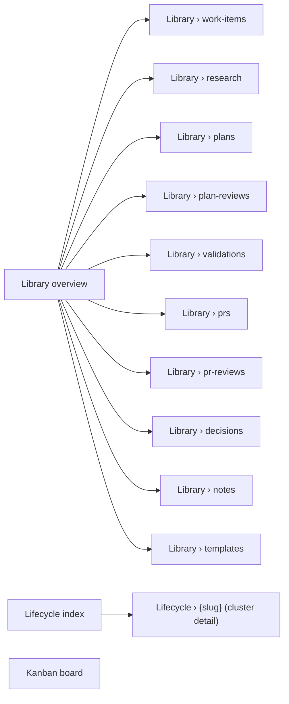

# Design Inventory: claude-design-prototype

## Overview

**Scope**: a single-file Claude design prototype (an `Accelerator Visualiser.html` artifact served from `claudeusercontent.com`). The prototype is a JSX-driven mock of a redesigned Accelerator Visualiser — three primary views (Library, Lifecycle, Kanban) plus per-doc-type list views and a Templates view, all with light/dark theming. Source-id `claude-design-prototype`.

**Crawler methodology**: `runtime` only. The prototype's source JSX (`app-shell.jsx`, `ui.jsx`, `view-library.jsx`, `view-lifecycle.jsx` per `data-om-id` annotations on rendered elements) is not exposed as a code repo for static analysis, so all observations are runtime: `getComputedStyle` for tokens, `document.styleSheets` for CSS custom properties, BEM-style `.ac-*` class enumeration for components, screen-by-screen Playwright screenshots.

**Known gaps**:
- Per-document detail screens (`/library/{type}/{slug}` equivalents) are not present in the prototype — clicking a row in a doc-type list does nothing in this build.
- Full markdown rendering is shown only inside the Templates view (the right-hand "tier preview" panel); a fully-rendered ADR/work-item detail view is not part of this prototype.
- Drag-and-drop interaction states (drop targets, conflict toast at high fidelity, optimistic-revert flash) on the Kanban board were not exercised — only the static columns were captured.
- A toast component ("External edit detected") was visible only on initial load; later screen captures dismissed it via state change.
- Search input was visible but the expanded/results state was not exercised.

## Design System

### Tokens

The prototype defines two layers of CSS custom properties: a brand palette (`--atomic-*`) and a semantic surface layer (`--ac-*`) that swaps under `[data-theme="dark"]`. Plus an older `--fg-*` / `--bg-*` aliases layer that redirects into the brand palette.

Sources: `:root` block in the inline stylesheet of the served HTML.

#### Brand palette — `--atomic-*`

| Token                             | Value                         | Category        |
|-----------------------------------|-------------------------------|-----------------|
| `--atomic-night`                  | `rgb(14, 15, 25)`             | color           |
| `--atomic-night-2`                | `rgb(10, 17, 27)`             | color           |
| `--atomic-night-3`                | `rgb(23, 25, 37)`             | color           |
| `--atomic-night-4`                | `rgb(29, 33, 49)`             | color           |
| `--atomic-ink`                    | `rgb(32, 34, 49)`             | color           |
| `--atomic-ink-2`                  | `rgb(44, 46, 65)`             | color           |
| `--atomic-red`                    | `rgb(203, 70, 71)`            | color           |
| `--atomic-red-2`                  | `rgb(223, 87, 88)`            | color           |
| `--atomic-red-3`                  | `rgb(226, 78, 83)`            | color           |
| `--atomic-indigo`                 | `rgb(89, 95, 200)`            | color           |
| `--atomic-indigo-2`               | `rgb(50, 48, 98)`             | color           |
| `--atomic-indigo-tint`            | `rgb(193, 197, 255)`          | color           |
| `--atomic-medium-purple`          | `#965DD9`                     | color           |
| `--atomic-cream-can`              | `#F5C25F`                     | color           |
| `--atomic-steel-blue`             | `#4295A5`                     | color           |
| `--atomic-pastel-green`           | `#6BE58B`                     | color           |
| `--atomic-river-bed`              | `#4A545F`                     | color           |
| `--atomic-aquamarine`             | `#73E4E2`                     | color           |
| `--atomic-tradewind`              | `#52B0AA`                     | color           |
| `--atomic-geyser`                 | `#D3DBE0`                     | color           |
| `--atomic-malibu`                 | `#72CBF5`                     | color           |
| `--atomic-link-water`             | `#DDECF4`                     | color           |
| `--atomic-marigold`               | `#F9DE6F`                     | color           |
| `--atomic-violet`                 | `var(--atomic-medium-purple)` | color (alias)   |
| `--atomic-teal`                   | `var(--atomic-tradewind)`     | color (alias)   |
| `--atomic-sky` / `--atomic-sky-2` | `var(--atomic-malibu)`        | color (alias)   |
| `--atomic-white`                  | `rgb(255, 255, 255)`          | color           |
| `--atomic-bone`                   | `rgb(251, 252, 254)`          | color           |
| `--atomic-mist`                   | `rgb(217, 217, 217)`          | color           |
| `--atomic-ash`                    | `rgb(211, 219, 224)`          | color           |
| `--atomic-smoke`                  | `rgb(199, 201, 216)`          | color           |
| `--atomic-slate`                  | `rgb(95, 99, 120)`            | color           |
| `--atomic-slate-2`                | `rgb(74, 84, 95)`             | color           |
| `--atomic-overlay-ink`            | `rgba(23, 25, 37, 0.56)`      | color (overlay) |
| `--atomic-stroke-light`           | `rgba(255, 255, 255, 0.35)`   | color (stroke)  |
| `--atomic-shadow-soft`            | `rgba(0, 0, 0, 0.08)`         | color (shadow)  |

#### Legacy semantic aliases — `--fg-*` / `--bg-*` / `--accent` / `--stroke`

| Token            | Value                        | Category                 |
|------------------|------------------------------|--------------------------|
| `--fg-1`         | `var(--atomic-night)`        | color (text strong)      |
| `--fg-2`         | `var(--atomic-slate)`        | color (text muted)       |
| `--fg-3`         | `var(--atomic-slate-2)`      | color (text faint)       |
| `--fg-on-dark-1` | `var(--atomic-white)`        | color                    |
| `--fg-on-dark-2` | `rgb(224, 224, 224)`         | color                    |
| `--fg-on-dark-3` | `rgba(255, 255, 255, 0.6)`   | color                    |
| `--bg-1`         | `var(--atomic-white)`        | color (surface)          |
| `--bg-2`         | `var(--atomic-bone)`         | color (surface alt)      |
| `--bg-dark-1`    | `var(--atomic-night)`        | color                    |
| `--bg-dark-2`    | `var(--atomic-night-2)`      | color                    |
| `--bg-dark-3`    | `var(--atomic-night-3)`      | color                    |
| `--accent`       | `var(--atomic-red)`          | color (primary accent)   |
| `--accent-2`     | `var(--atomic-indigo)`       | color (secondary accent) |
| `--stroke`       | `var(--atomic-ash)`          | color (border)           |
| `--stroke-dark`  | `var(--atomic-stroke-light)` | color (border, on-dark)  |

#### Active semantic layer — `--ac-*` (light)

| Token                | Value                                                            | Category                        |
|----------------------|------------------------------------------------------------------|---------------------------------|
| `--ac-bg`            | `#FBFCFE`                                                        | color (surface)                 |
| `--ac-bg-raised`     | `#FFFFFF`                                                        | color (surface raised)          |
| `--ac-bg-sunken`     | `#F4F6FA`                                                        | color (surface sunken)          |
| `--ac-bg-chrome`     | `#FFFFFF`                                                        | color (chrome)                  |
| `--ac-bg-sidebar`    | `#F7F8FB`                                                        | color (sidebar)                 |
| `--ac-bg-card`       | `#FFFFFF`                                                        | color (card surface)            |
| `--ac-bg-hover`      | `rgba(32, 34, 49, 0.04)`                                         | color (hover overlay)           |
| `--ac-bg-active`     | `rgba(89, 95, 200, 0.09)`                                        | color (active overlay)          |
| `--ac-fg`            | `#14161F`                                                        | color (text default)            |
| `--ac-fg-strong`     | `#0A111B`                                                        | color (text strong)             |
| `--ac-fg-muted`      | `#5F6378`                                                        | color (text muted)              |
| `--ac-fg-faint`      | `#8B90A3`                                                        | color (text faint)              |
| `--ac-stroke`        | `rgba(32, 34, 49, 0.10)`                                         | color (border)                  |
| `--ac-stroke-soft`   | `rgba(32, 34, 49, 0.06)`                                         | color (border soft)             |
| `--ac-stroke-strong` | `rgba(32, 34, 49, 0.18)`                                         | color (border strong)           |
| `--ac-accent`        | `#595FC8`                                                        | color (primary accent — indigo) |
| `--ac-accent-2`      | `#CB4647`                                                        | color (secondary accent — red)  |
| `--ac-accent-tint`   | `rgba(89, 95, 200, 0.12)`                                        | color (accent tint)             |
| `--ac-accent-faint`  | `rgba(89, 95, 200, 0.06)`                                        | color (accent faint)            |
| `--ac-ok`            | `#2E8B57`                                                        | color (semantic — success)      |
| `--ac-warn`          | `#D98F2E`                                                        | color (semantic — warning)      |
| `--ac-err`           | `#CB4647`                                                        | color (semantic — error)        |
| `--ac-violet`        | `#7B5CD9`                                                        | color                           |
| `--ac-shadow-soft`   | `0 1px 2px rgba(10,17,27,0.04), 0 8px 28px rgba(10,17,27,0.06)`  | shadow                          |
| `--ac-shadow-lift`   | `0 2px 4px rgba(10,17,27,0.06), 0 20px 60px rgba(10,17,27,0.10)` | shadow                          |

#### Active semantic layer — `--ac-*` (dark, overrides under `[data-theme="dark"]`)

| Token                | Value                                                     |
|----------------------|-----------------------------------------------------------|
| `--ac-bg`            | `#0A111B`                                                 |
| `--ac-bg-raised`     | `#0E0F19`                                                 |
| `--ac-bg-sunken`     | `#070B12`                                                 |
| `--ac-bg-chrome`     | `#0E0F19`                                                 |
| `--ac-bg-sidebar`    | `#0B121C`                                                 |
| `--ac-bg-card`       | `#131524`                                                 |
| `--ac-bg-hover`      | `rgba(255, 255, 255, 0.04)`                               |
| `--ac-bg-active`     | `rgba(89, 95, 200, 0.22)`                                 |
| `--ac-fg`            | `#E7E9F2`                                                 |
| `--ac-fg-strong`     | `#FFFFFF`                                                 |
| `--ac-fg-muted`      | `#A0A5B8`                                                 |
| `--ac-fg-faint`      | `#6C7088`                                                 |
| `--ac-stroke`        | `rgba(255, 255, 255, 0.08)`                               |
| `--ac-stroke-soft`   | `rgba(255, 255, 255, 0.04)`                               |
| `--ac-stroke-strong` | `rgba(255, 255, 255, 0.16)`                               |
| `--ac-accent`        | `#8A90E8`                                                 |
| `--ac-accent-2`      | `#E86A6B`                                                 |
| `--ac-accent-tint`   | `rgba(138, 144, 232, 0.18)`                               |
| `--ac-accent-faint`  | `rgba(138, 144, 232, 0.08)`                               |
| `--ac-shadow-soft`   | `0 1px 2px rgba(0,0,0,0.3), 0 8px 28px rgba(0,0,0,0.4)`   |
| `--ac-shadow-lift`   | `0 2px 4px rgba(0,0,0,0.4), 0 20px 60px rgba(0,0,0,0.55)` |

#### Typography

| Token | Value | Category |
|---|---|---|
| `--font-display` / `--ac-font-display` | `"Sora", system-ui, sans-serif` | typography (family) |
| `--font-body` / `--ac-font-body` | `"Inter", system-ui, sans-serif` | typography (family) |
| `--font-support` | `"Raleway", system-ui, sans-serif` | typography (family) |
| `--font-mono` / `--ac-font-mono` | `"Fira Code", ui-monospace, monospace` | typography (family) |
| `--size-hero` | `68px` | typography (size) |
| `--size-h1` | `48px` | typography (size) |
| `--size-h2` | `36px` | typography (size) |
| `--size-h3` | `28px` | typography (size) |
| `--size-h4` | `26px` | typography (size) |
| `--size-lg` | `22px` | typography (size) |
| `--size-body` | `20px` | typography (size) |
| `--size-md` | `18px` | typography (size) |
| `--size-sm` | `16px` | typography (size) |
| `--size-xs` | `14px` | typography (size) |
| `--size-xxs` | `12px` | typography (size) |
| `--lh-tight` | `1.05` | typography (line-height) |
| `--lh-snug` | `1.2` | typography (line-height) |
| `--lh-normal` | `1.5` | typography (line-height) |
| `--lh-loose` | `1.6` | typography (line-height) |
| `--tracking-caps` | `0.12em` | typography (tracking, eyebrow caps) |

`[data-font="mono"]` swaps `--ac-font-display` and `--ac-font-body` to Fira Code, exposing a "monospace mode" alternate.

Resolved body: `font-family: Inter, system-ui, sans-serif; font-size: 14px;` (i.e. body resolves to a smaller size than the documented `--size-xs` token; the token scale appears to define heading + label scale, not the table-cell body scale).

#### Spacing

| Token | Value | Category |
|---|---|---|
| `--sp-1` | `4px` | spacing |
| `--sp-2` | `8px` | spacing |
| `--sp-3` | `12px` | spacing |
| `--sp-4` | `16px` | spacing |
| `--sp-5` | `24px` | spacing |
| `--sp-6` | `32px` | spacing |
| `--sp-7` | `40px` | spacing |
| `--sp-8` | `48px` | spacing |
| `--sp-9` | `64px` | spacing |
| `--sp-10` | `80px` | spacing |
| `--sp-11` | `124px` | spacing |

#### Radius

| Token | Value | Category |
|---|---|---|
| `--radius-sm` | `4px` | radius |
| `--radius-md` | `8px` | radius |
| `--radius-lg` | `12px` | radius |
| `--radius-pill` | `999px` | radius |

#### Shadow

| Token | Value | Category |
|---|---|---|
| `--shadow-card` | `6px 12px 85px 0px rgba(0, 0, 0, 0.08)` | shadow |
| `--shadow-card-lg` | `12px 24px 120px 0px rgba(0, 0, 0, 0.12)` | shadow |
| `--shadow-crisp` | `0 1px 2px rgba(10, 17, 27, 0.06), 0 4px 12px rgba(10, 17, 27, 0.04)` | shadow |

(Plus `--ac-shadow-soft` / `--ac-shadow-lift` listed above per theme.)

### Layout Primitives

- App shell: top-bar (`.ac-topbar`) + left sidebar (`.ac-sidebar`) + main pane (`.ac-main`).
- Sidebar: brand mark, search input ("Search meta/…", with `/` keybind hint), grouped nav (Library → Define / Build / Ship / Remember), Views block (Kanban, Lifecycle), Activity feed ("live" badge), Meta block (Templates), version footer (`accelerator-visualiser  v0.4.1 · embed-dist`).
- Topbar: brand (logo + "Accelerator / VISUALISER" wordmark), centred breadcrumb crumbs (`.ac-topbar__crumbs`), spacer, status pill (`.ac-topbar__status` showing `127.0.0.1:52914` + green pulse), SSE indicator (`SSE` with bolt icon and `.ac-pulse`), theme toggle (`.ac-topbar__btn` with sun/moon).
- Eight-stage workflow pipeline visualisation rendered via `.ac-hexchain` (linear chain of stage tiles connected by coloured lines): Work item → Research → Plan → Plan review → Validation → PR → PR review → Decision.
- Themes via root `data-theme="light|dark"` attribute; font-mode swap via `data-font="display|mono"`.
- No formal breakpoint scale exposed in tokens; layout appears desktop-first (≥1200px viewport).
- `--tracking-caps` (0.12em) used on uppercase eyebrow labels (LIBRARY, DEFINE, BUILD, SHIP, REMEMBER, VIEWS, ACTIVITY, META).

## Component Catalogue

Components inferred from BEM-style `.ac-*` class enumeration in the rendered DOM (no source available for direct prop introspection). Source files referenced via `data-om-id` annotations: `app-shell.jsx`, `ui.jsx`, `view-library.jsx`, `view-lifecycle.jsx`.

### Topbar (`.ac-topbar`)
- **Variants / parts**: `.ac-topbar__brand`, `.ac-topbar__brand-name`, `.ac-topbar__brand-sub`, `.ac-topbar__brand-text`, `.ac-topbar__btn`, `.ac-topbar__crumbs`, `.ac-topbar__sep`, `.ac-topbar__spacer`, `.ac-topbar__status`.
- **Used on screens**: every screen.
- **Source**: `src/app-shell.jsx`
- **Purpose**: persistent top-bar — brand mark, breadcrumb crumbs reflecting active view, server origin pill, SSE connection indicator, theme toggle.

### Sidebar (`.ac-sidebar`)
- **Variants / parts**: `.ac-sidebar__search`, `.ac-sidebar__foot`.
- **Used on screens**: every screen.
- **Source**: `src/app-shell.jsx`
- **Purpose**: app navigation chrome; hosts the search box, the `Nav` component, the `Activity` feed, and the version footer.

### Nav (`.ac-nav`)
- **Variants / parts**: `.ac-nav__item`, `.ac-nav__group`, `.ac-nav__subgroup`, `.ac-nav__label` (+ `--clickable` modifier), `.ac-nav__label-l`, `.ac-nav__label-hint`, `.ac-nav__sublabel`, `.ac-nav__count`, `.ac-nav__meta`, `.ac-nav__right`.
- **Used on screens**: every screen.
- **Source**: `src/app-shell.jsx`
- **Purpose**: structured doc-type navigation grouped by lifecycle phase (Define → Build → Ship → Remember); each item shows label + count badge + optional unseen-changes dot.

### Activity feed (`.ac-activity`)
- **Variants / parts**: `.ac-activity__item`, `.ac-activity__glyph`, `.ac-activity__line1`, `.ac-activity__line2`, `.ac-activity__action`.
- **Used on screens**: every screen (renders inside the sidebar).
- **Source**: `src/app-shell.jsx`
- **Purpose**: rolling feed of recent file events (created / edited / moved); `LIVE` badge in the heading; each row has a doc-type glyph, a "type · action" line, and a relative timestamp / filename line.

### Pulse (`.ac-pulse`)
- **Used on screens**: every screen (in topbar status pill and SSE indicator).
- **Purpose**: small dot with breathing animation indicating live-connection liveness.

### Page wrapper (`.ac-page`)
- **Variants / parts**: `.ac-pagehead`, `.ac-pagehead__l`, `.ac-pagehead__eyebrow`, `.ac-pagehead__sub`, `.ac-pagehead__actions`.
- **Used on screens**: every main-pane screen.
- **Purpose**: page chrome — eyebrow row (icon + breadcrumb-style category), `<h1>` page title, subtitle/count line, right-aligned action buttons (Sort, Filter, segmented toggles).

### Glyph (`.ac-glyph`)
- **Used on screens**: every screen — embedded in nav items, page eyebrows, kanban cards, timeline steps, lifecycle cards, activity items.
- **Purpose**: square doc-type icon (16/24/32px) with per-doc-type fill colour; e.g. red for Decision, orange for Research, blue for Plan, purple for Plan review, green for Validation, teal for PR, mauve for PR review, red-pin for Note, dark-red for Work item.

### Chip (`.ac-chip`)
- **Variants**: `.ac-chip--green` (Done / accepted), `.ac-chip--indigo` (In progress / live), `.ac-chip--amber` (Approve w/ changes), `.ac-chip--neutral`, `.ac-chip--sm`.
- **Used on screens**: every screen displaying a status — page subtitle, kanban cards, timeline cards, lifecycle cards, library tables, templates "active/absent" indicators.
- **Purpose**: pill status badge.

### Sort button (`.ac-sort-btn`)
- **Used on screens**: library type views (Plans, Decisions, …).
- **Purpose**: pill-shaped sort selector (default label "Recently modified").

### Filter button (`.ac-filter`)
- **Used on screens**: library type views.
- **Purpose**: pill-shaped filter trigger.

### Library table (`.ac-libtable`)
- **Variants / parts**: `.ac-libtable__id`, `.ac-libtable__title`, `.ac-libtable__slug`, `.ac-libtable__date`. (Status cell uses `.ac-chip`.)
- **Used on screens**: `library-plans`, `library-decisions`, and every other doc-type list.
- **Purpose**: tabular list of documents with columns ID/Date, Title, Status, Slug, Modified.

### Hexchain pipeline (`.ac-hexchain`)
- **Variants / parts**: `.ac-hexchain__stage`, `.ac-hexchain__label`, `.ac-hexchain__link`. Linked by `.ac-chain__tile`.
- **Used on screens**: `lifecycle-cluster-detail`, `library-lifecycle-card` (in compact form inside `.ac-lcard__pipe`).
- **Purpose**: linear 8-stage workflow visualisation — coloured icon tile per stage, connecting line whose colour signals presence/absence, optional label below.

### Stage dots (`.ac-stagedots` / `.ac-stagedot`)
- **Used on screens**: `kanban-view` (one row per work-item card showing pipeline-completeness micro-dots).
- **Purpose**: compact 8-dot pipeline indicator embedded inside cards.

### Kanban (`.ac-kanban`)
- **Used on screens**: `kanban-view`.
- **Purpose**: horizontal flex container of `.ac-kcol` columns.

### Kanban column (`.ac-kcol`)
- **Variants / parts**: `.ac-kcol__head`, `.ac-kcol__title`, `.ac-kcol__count`.
- **Used on screens**: `kanban-view`.
- **Purpose**: a status column with header (status dot + title + count) and a vertical stack of `.ac-kcard` cards.

### Kanban card (`.ac-kcard`)
- **Variants / parts**: `.ac-kcard__top`, `.ac-kcard__id`, `.ac-kcard__title`, `.ac-kcard__slug`, `.ac-kcard__foot`, `.ac-kcard__links`, `.ac-kcard__mtime`.
- **Used on screens**: `kanban-view`.
- **Purpose**: work-item card — ID (PROJ-NNNN / ENG-NNNN / META-NNNN / NNNN), title, slug, "N linked", relative mtime, embedded `.ac-stagedots`.

### Lifecycle index (`.ac-lcycle`)
- **Used on screens**: `lifecycle-index`.
- **Purpose**: list-of-clusters layout with the segmented sort toggle (`.ac-tweaks__seg` — `Updated` / `Completeness`).

### Lifecycle cluster card (`.ac-lcard`)
- **Variants / parts**: `.ac-lcard__title`, `.ac-lcard__slug`, `.ac-lcard__meta`, `.ac-lcard__pipe`.
- **Used on screens**: `lifecycle-index`.
- **Purpose**: per-cluster summary card — title, slug, status chip, mtime, `N artifacts` count, embedded `.ac-hexchain` strip with `N/8` counter.

### Timeline (`.ac-timeline`)
- **Variants / parts**: step nodes (`.ac-tstep`, `.ac-tstep__node`), cards (`.ac-tcard`, `.ac-tcard__head`, `.ac-tcard__title`, `.ac-tcard__meta`, `.ac-tcard__body`, `.ac-tcard--missing`).
- **Used on screens**: `lifecycle-cluster-detail`.
- **Purpose**: vertical pipeline timeline with one card per stage; missing stages render an inline "No X yet" placeholder.

### Tweaks segmented control (`.ac-tweaks__seg`)
- **Used on screens**: `lifecycle-index` (two-segment "Updated / Completeness" sort toggle).
- **Purpose**: pill-grouped segmented control.

### Toaster (`.ac-toaster`)
- **Used on screens**: top-level (initial load showed "External edit detected" toast referencing `WORK-0007`).
- **Purpose**: ephemeral notification dialog with icon + heading + message + close button.

### App shell (`.ac-app` / `.ac-main`)
- **Used on screens**: every screen.
- **Purpose**: outermost layout grid wiring topbar + sidebar + main content.

## Screen Inventory

### lifecycle-cluster-detail-default — `/` (initial load: a Lifecycle cluster detail for `meta-visualisation`)
- **Purpose**: detail view of a single lifecycle cluster — pipeline strip (`.ac-hexchain`) at top, vertical `.ac-timeline` of stage cards below.
- **Components used**: `Topbar`, `Sidebar` (with `Nav`, `Activity`, search, footer), `Page`, `Hexchain`, `Timeline` (`Tstep` + `Tcard`), `Glyph`, `Chip`, `Toaster`.
- **States observed**: success (with toast `External edit detected · WORK-0007 · query invalidated`).
- **Key interactions**: theme-toggle button (top-right) toggles `data-theme`; sidebar nav swaps active screen.
- **Screenshot**: `screenshots/main-light.png`.

### lifecycle-cluster-detail-dark — same route, dark theme
- **Purpose**: dark-mode variant of the same lifecycle cluster detail screen.
- **States observed**: success.
- **Screenshot**: `screenshots/main-dark.png`.

### kanban-view — Kanban
- **Purpose**: drag-and-drop work-item status board with three columns (Todo, In progress, Done) populated from work-items by status; sub-headline "Every work item, grouped by status. Drag a card to move it between columns — the change writes back to the file on disk."; right-aligned `live` chip + `12 total` count.
- **Components used**: `Topbar`, `Sidebar`, `Page`, `Kanban`, `Kcol` (×3), `Kcard` (×N — each with `Stagedots` + `Glyph` + `Chip`).
- **States observed**: success.
- **Key interactions**: drag a card across columns (interaction not exercised); column header click would re-sort within column.
- **Screenshot**: `screenshots/kanban-view.png`.

### library-overview — Library (All artifacts)
- **Purpose**: dashboard / hub — "All artifacts in `meta/`" with a sub-headline "Browse every doc type produced by the research → plan → implement workflow. Click a type to drill in, or jump into a view."; doc-type cards grouped by lifecycle phase (Define / Build / Ship / Remember), each showing icon, doc-type label, doc count, and "latest · {title}" preview.
- **Components used**: `Topbar`, `Sidebar`, `Page`, `Glyph`, `Nav` (sidebar), per-card mini-component (no specific class captured but uses `Glyph` + heading + meta).
- **States observed**: success.
- **Key interactions**: card click → drill into that doc-type list view.
- **Screenshot**: `screenshots/library-view.png`.

### library-plans — Library › plans
- **Purpose**: sortable / filterable list of all plan documents.
- **Components used**: `Topbar`, `Sidebar`, `Page`, `Libtable` (with `__id`, `__title`, `__slug`, `__date` cells), `Chip` (status), `Sort-btn` ("Recently modified"), `Filter` button.
- **States observed**: success — 7 plans listed.
- **Key interactions**: column-header click → re-sort; sort-btn click → sort menu (not exercised); filter-btn → filter UI (not exercised); row click → no-op in this prototype build.
- **Screenshot**: `screenshots/library-type-view.png`.

### library-decisions — Library › decisions
- **Purpose**: same template as `library-plans` but populated with ADR-NNNN decision documents.
- **Components used**: same as above.
- **States observed**: success — 9 decisions listed.
- **Screenshot**: `screenshots/library-decisions.png`.

### lifecycle-index — Lifecycle (cluster list)
- **Purpose**: list of lifecycle clusters — "Work units, from idea to shipped. Each row is a slug-clustered work unit. Filled tiles mark the stages present on disk. Missing stages are where the workflow has gaps."; `Updated / Completeness` segmented sort.
- **Components used**: `Topbar`, `Sidebar`, `Page`, `Lcycle`, `Lcard` (×N — each with `Hexchain` strip), `Chip` (status), `Tweaks` segmented control.
- **States observed**: success — 8 clusters visible.
- **Key interactions**: sort-segment toggle; cluster card click → `lifecycle-cluster-detail`.
- **Screenshot**: `screenshots/lifecycle-cluster-detail.png`. *(Note: filename pre-dates the navigation step — the file actually shows the `lifecycle-index` screen.)*

### lifecycle-cluster-detail-after-click — Lifecycle › three-layer-review-system-architecture
- **Purpose**: lifecycle cluster detail navigated to via card click — confirms the cluster-card → cluster-detail flow.
- **Components used**: same as `lifecycle-cluster-detail-default`.
- **States observed**: success.
- **Screenshot**: `screenshots/lifecycle-cluster-after-click.png`.

### templates-view — Library › templates
- **Purpose**: "Authoring templates · Resolved across three tiers. The highest-priority present tier wins at authoring time — but every tier is inspectable here, regardless of current config." Top half: scrollable list of templates, each row showing template name, three tier indicators (`config` / `user` / `default`) with a `present`-state colour and a "winning" highlight, and a chevron-right disclosure. Bottom half: an expanded "Three tiers · {name}.md" detail with a stacked tier card (Tier 1 Config override / Tier 2 User override / Tier 3 Plugin default), plus a right pane rendering the template body with a `sha256-…` etag header.
- **Components used**: `Topbar`, `Sidebar`, `Page`, `Glyph`, `Chip`, plus template-specific tier-row + tier-detail components (no specific class captured).
- **States observed**: success — 5 templates: `adr.md`, `plan.md`, `research.md`, `validation.md`, `pr-description.md`. ADR template shows config-override absent, user-override active, plugin-default present.
- **Screenshot**: `screenshots/templates-view.png`.

### top-level-toast (initial-load) — overlaid on initial screen
- **Purpose**: toast notification shown on first render: "External edit detected · A reviewer agent updated `WORK-0007` while you were looking at it. Query invalidated."
- **Components used**: `Toaster`.
- **States observed**: success (success/info variant).
- **Key interactions**: dismiss via × button.
- **Screenshot**: visible in `screenshots/main-light.png` lower-right corner.

## Feature Catalogue

### theming
- **Capability**: light / dark theme toggle via `data-theme` attribute on `<html>`; full `--ac-*` palette overrides for dark mode (surfaces, foregrounds, strokes, accents, shadows).
- **Surfaces on**: every screen via the topbar `Toggle theme` button.
- **Depends on**: CSS custom-property cascade; toggle handler swaps `[data-theme]`.

### font-mode-swap
- **Capability**: alternate "monospace mode" toggleable via `data-font` attribute (`display` / `mono`) — repoints `--ac-font-display` / `--ac-font-body` to Fira Code.
- **Surfaces on**: not exposed in the visible UI of this prototype build, but defined in CSS at `[data-font="mono"]`.
- **Depends on**: `[data-font]` attribute on `<html>` (default `display`).

### lifecycle-phase-grouped-nav
- **Capability**: doc-type sidebar nav grouped by lifecycle phase: Define (Work items), Build (Research, Plans, Plan reviews, Validations), Ship (PRs, PR reviews), Remember (Decisions, Notes).
- **Surfaces on**: every screen via `.ac-nav`.
- **Depends on**: server-supplied doc-type metadata.

### activity-feed
- **Capability**: live feed of recent meta-directory file events (created / edited / moved-to-status) with per-event glyph, type · action label, filename, and relative timestamp; `LIVE` chip in heading.
- **Surfaces on**: every screen via `.ac-activity` in sidebar.
- **Depends on**: SSE event stream (cf. topbar `SSE` indicator).

### sse-status-indicator
- **Capability**: header `SSE` indicator with `Pulse` dot showing live-stream connectivity; paired with origin pill `127.0.0.1:52914`.
- **Surfaces on**: every screen.
- **Depends on**: SSE stream endpoint.

### unseen-changes-dot
- **Capability**: small accent dot rendered next to a nav item label when that doc type has unseen file changes since last visit.
- **Surfaces on**: any nav item (observed on Plans `· 18` and Decisions `· 9`).
- **Depends on**: per-doc-type unseen-event tracking (likely SSE-driven).

### eight-stage-pipeline-visualisation
- **Capability**: workflow-pipeline component rendered three different ways: (1) full chain on lifecycle-cluster-detail (`.ac-hexchain` with labels), (2) compact strip on lifecycle-index cluster cards (`.ac-lcard__pipe`), (3) micro stage-dots on kanban cards (`.ac-stagedots`).
- **Surfaces on**: `lifecycle-cluster-detail`, `lifecycle-index`, `kanban-view`.
- **Depends on**: workflow-pipeline definition (8 stages: Work item → Research → Plan → Plan review → Validation → PR → PR review → Decision).

### kanban-board
- **Capability**: drag-and-drop work-item status board; columns derived from kanban-status configuration; cards write back to disk on move; `live` chip + `N total` counter in the page subtitle.
- **Surfaces on**: `kanban-view`.
- **Depends on**: kanban config endpoint, work-item PATCH endpoint.

### lifecycle-cluster-list
- **Capability**: lifecycle clusters as cards with embedded compact pipeline strip and `N/8` stage-completeness counter; sorted by `Updated` or `Completeness`.
- **Surfaces on**: `lifecycle-index`.
- **Depends on**: lifecycle clusters endpoint.

### lifecycle-cluster-timeline
- **Capability**: vertical timeline detail of one cluster — `Tcard` per stage with `--missing` modifier for absent stages, plus a header pipeline (`.ac-hexchain`) reflecting the same data.
- **Surfaces on**: `lifecycle-cluster-detail`.
- **Depends on**: per-cluster artifact retrieval.

### library-overview-grouped
- **Capability**: hub view that groups the 12+ doc types by lifecycle phase, with each card showing count and the most recent document title — drillable into the per-doc-type list.
- **Surfaces on**: `library-overview`.
- **Depends on**: doc-type counts + most-recent-doc lookup.

### library-doc-type-list
- **Capability**: sortable / filterable table of documents for a single doc type with columns ID/Date, Title, Status, Slug, Modified; `Recently modified` sort default and a `Filter` action.
- **Surfaces on**: `library-plans`, `library-decisions`, and every other type.
- **Depends on**: per-type docs endpoint.

### template-tier-resolution
- **Capability**: three-tier template resolution view — for each authoring template, surfaces presence + active state across `config-override`, `user-override`, and `plugin-default` tiers, plus the rendered body of the active tier with a `sha256` etag header.
- **Surfaces on**: `templates-view`.
- **Depends on**: templates endpoint exposing per-tier present/absent state and content.

### search-with-keybind
- **Capability**: persistent sidebar search box ("Search meta/…") with `/` keyboard shortcut hint chip.
- **Surfaces on**: every screen via `.ac-sidebar__search`.
- **Depends on**: search endpoint (not exercised).

### external-edit-toast
- **Capability**: toast notification triggered by an external file change made by another agent; format: "External edit detected · A reviewer agent updated `WORK-0007` while you were looking at it. Query invalidated."
- **Surfaces on**: any screen, overlaid bottom-right.
- **Depends on**: SSE event stream + per-screen invalidation tracking.

### server-origin-pill
- **Capability**: topbar pill showing the local server origin (`127.0.0.1:52914`) with green pulse — surfaces the visualiser's live status to the user.
- **Surfaces on**: every screen.
- **Depends on**: server-info endpoint.

### version-footer
- **Capability**: sidebar footer with app id and version (`accelerator-visualiser  v0.4.1 · embed-dist`).
- **Surfaces on**: every screen.
- **Depends on**: build-time-injected version constant.

## Information Architecture

This prototype is a single-page mock (no client-side router URL changes); navigation is internal state. Logical "screens" map roughly as follows:

Sidebar nav structure (ground truth):

- **LIBRARY** (header)
  - "All" (the `library-overview` hub)
  - **DEFINE** — Work items (14)
  - **BUILD** — Research (12), Plans (18 · unseen-dot), Plan reviews (22), Validations (7)
  - **SHIP** — PRs (6), PR reviews (8)
  - **REMEMBER** — Decisions (9 · unseen-dot), Notes (4)
- **VIEWS**
  - Kanban
  - Lifecycle
- **ACTIVITY** — live feed (5 most recent events)
- **META** — Templates (5)

Topbar breadcrumbs reflect the active screen (e.g. `Lifecycle › meta-visualisation`, `Library › plans`, `Kanban`).

Primary user flows:
1. **Idea-to-shipped lifecycle inspection**: Lifecycle → cluster card → cluster timeline (8-stage trail with present/missing stages).
2. **Status-board work management**: Kanban → drag card across columns to move on disk.
3. **Doc-type browsing**: Library overview → drill into one doc-type list → (planned) drill into a single document.
4. **Template authoring inspection**: Library › Templates → expanded tier panel for a chosen `*.md` template (config / user / default).
5. **Activity awareness**: Sidebar Activity feed shows live changes; toast surfaces external edits affecting the open document.

## Crawl Notes

- **Single-file prototype**: source is one HTML file at `claudeusercontent.com/v1/design/projects/{id}/serve/Accelerator Visualiser.html` with inline JSX bundles (`app-shell.jsx`, `ui.jsx`, `view-library.jsx`, `view-lifecycle.jsx`). Source files are referenced by `data-om-id` annotations on rendered DOM nodes but are not exposed as a static-analysable repo.
- **No real routing**: the prototype is a single SPA without URL changes — every "navigation" mutates internal state. Screen-id assignments in this inventory are logical and labelled by the breadcrumb each view displays.
- **Detail screens missing**: clicking a row in `library-plans` / `library-decisions` does nothing — there is no per-document detail screen in this prototype build. Treat detail-screen design as TBD relative to this prototype.
- **Token scale vs. resolved body**: the typography token scale starts at `--size-xxs: 12px` and `--size-xs: 14px`, but `<body>` resolves to `font-size: 14px` directly (not via a token reference). Worth confirming whether the token scale is meant to drive the body or only headings/eyebrows.
- **`--font-support: Raleway`** is defined but not referenced by any `--ac-*` token observed in the rendered output — possibly aspirational or used only in deep nested rules not enumerated here.
- **Toast component** captured only in initial render of `main-light.png`; subsequent navigations dismissed it via state change.
- **Drag-and-drop**, **search**, **sort menus**, and **filter UI** were not exercised — only their static affordances were captured.
- **URL scrubbing**: query strings stripped from URLs in the inventory body (the long `?t=...` fingerprint on the prototype URL is preserved only in the frontmatter `source_location` for reproducibility).

## References

- Source: `https://64bfef0a-f5fb-4b90-81e4-229d1ebc705c.claudeusercontent.com/v1/design/projects/64bfef0a-f5fb-4b90-81e4-229d1ebc705c/serve/Accelerator%20Visualiser.html`
- Inferred source files (per `data-om-id` annotations): `src/app-shell.jsx`, `src/ui.jsx`, `src/view-library.jsx`, `src/view-lifecycle.jsx`
- Companion inventory: `meta/design-inventories/2026-05-06-135214-current-app/inventory.md` (the running visualiser at `http://127.0.0.1:51771/` for gap analysis)
- Suggested next step: `/accelerator:analyse-design-gaps current-app claude-design-prototype`
