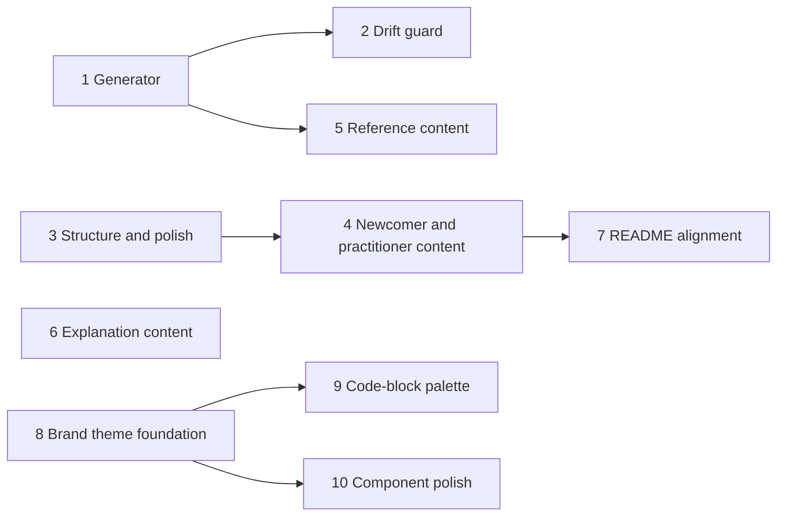

# Make the Docs Amazing Implementation Plan

## Overview

Overhaul the Astro Starlight docs site (`docs-site/`) per the audiences
in epic 0178: generated per-skill reference pages (69) built by a
prebuild script in the `tasks/` invoke toolchain, a CI drift guard, new
tutorial/how-to/FAQ content, a splash landing page, a restructured
sidebar, richer explanation pages, and Starlight polish.

## Current State Analysis

The site delivered by 0177: 18 pages (~1,517 lines), Astro 6 + Starlight
^0.40, mermaid via `rehype-mermaid` (img-svg + dark, needs Playwright
Chromium), `starlight-links-validator`, deployed to GitHub Pages under
`base: /accelerator`.

- **Sidebar** is fully manual (`docs-site/astro.config.mjs:25-51`); no
  page uses `sidebar.*` frontmatter.
- **Landing page** (`docs-site/src/content/docs/index.md`) uses the
  default doc template with `slug: ''`, not splash.
- **No polish config**: no `lastUpdated`, `editLink`, `social`,
  `favicon`, `logo`, or og `head` entries in the Starlight config.
- **Skills docs** are eight hand-written family pages plus a
  hand-written "All Skills" index; no per-skill pages.
- **69 real skills** across 14 categories, registered in
  `.claude-plugin/plugin.json:13-28` as **14 directory globs** — any
  walker must exclude stray SKILL.md files under
  `skills/visualisation/visualise/frontend/node_modules/**` and
  `skills/config/migrate/scripts/test-fixtures/**`. 23 skills carry
  `user-invocable: false`.
- **`tasks/` has no YAML parser**; frontmatter parsing is shell-only
  today. PyYAML must be added, version-pinned, to `pyproject.toml`.
- **CI**: `check-docs` runs `mise run docs:check`; `deploy-docs` runs
  `mise run docs:build` and uploads `docs-site/dist`
  (`.github/workflows/main.yml:343-398`). Both checkouts are shallow —
  `lastUpdated` requires `fetch-depth: 0`.

## Desired End State

A site where each audience self-serves:

- **Newcomers** follow a Getting Started tutorial from install through a
  first research → plan → implement loop.
- **Practitioners** find task-oriented how-tos, a "which skill do I
  need?" decision index, a configuration cookbook, and an FAQ.
- **Deep-divers** get one generated reference page per skill (from
  `SKILL.md` frontmatter + body), an agents reference, and a `meta/`
  anatomy page.
- **Evaluators** land on a splash page with hero, CardGrid, and
  LinkCards; Philosophy is a full treatment; a worked case study and an
  expanded visualiser page exist.
- The sidebar is Start Here / Guides / Reference; generated pages live
  in collapsed autogenerated groups; drift between `plugin.json` skills
  and docs pages is impossible (generation) and guarded (coverage
  check in CI).

Verify: `mise run check` green, `docs:build` (strict, incl. link
validation) green locally and in CI, Pages deploy succeeds, all
acceptance criteria in work item 0179 ticked.

### Key Discoveries

- Generator home: `tasks/docs.py:8-11`; invoke auto-registers new
  `@task` functions via `Collection.from_module`
  (`tasks/__init__.py:59`).
- Wiring point: `docs:build` (`mise.toml:79-82`) — a new mise task added
  to its `depends` is automatically exercised by both the PR gate
  (`docs:check`) and the deploy job.
- Drift-guard template: `tasks/build.py:184-210`
  (`validate_version_coherence`) — collect a `found` dict, raise with an
  actionable message, take `repo_root: Path | None` for test injection.
  Failure-message convention: `tasks/lint/vendor_shims.py:8-42`.
- SKILL.md bodies are MDX-hostile — generate **`.md`, not `.mdx`** and
  escape: whole-line and inline `!` preprocessor commands
  (`skills/vcs/commit/SKILL.md:12-15`,
  `skills/planning/create-plan/SKILL.md:22-23`), angle-bracket
  placeholders outside fences (`skills/config/migrate/SKILL.md:35-261`),
  and curly-brace placeholders (`create-plan/SKILL.md:78-80`).
- Descriptions use folded multi-line YAML — a real YAML parser
  (PyYAML `safe_load`) is required, not line-splitting.
- Per-page `sidebar.label` / `sidebar.order` / `sidebar.badge`
  frontmatter plus autogenerated collapsed groups keeps
  `astro.config.mjs` small for 69 pages; nothing on the site uses these
  yet so there is no convention to conflict with.
- Markdown links are base-prefixed by
  `astro-rehype-relative-markdown-links`, but `hero.actions` links and
  hand-written absolute links must be manually prefixed with
  `/accelerator`.
- Tests: `tests/conftest.py:11-17` `fake_repo_tree` (extend with
  `skills/*/SKILL.md`); shape per `tests/unit/tasks/test_version.py:18-63`.
- CI topology is guarded by `tests/unit/tasks/test_workflows.py`; never
  touch the `accelerator-release` concurrency group; actionlint
  hardcodes `main.yml`.

## What We're NOT Doing

- AI-generated explanatory diagrams / hero artwork (possible follow-up).
- A changelog page or contributor-docs overhaul (separate 0178 children).
- Visualiser feature changes.
- Committing generated pages — they are build-time only, gitignored.
- Deleting the eight family pages — they become curated overviews.
- Astro custom content loaders (Starlight's remark/rehype pipeline only
  runs on `docsLoader()` content).
- Starlight upgrade beyond ^0.40 (pre-1.0; pin-and-watch separately).
- CI Chromium caching (noted optimisation, out of scope).
- Live-reload GIF/video for the visualiser page is optional; ship
  screenshots first and treat the GIF as a follow-up if capture is
  awkward.
- Recolouring mermaid diagram output to brand colours (rendered to
  static SVG by `rehype-mermaid`; separate follow-up if wanted).
- Starlight `components:` slot overrides — theming stays CSS-only.
- A supplementary ADR for the docs site as a brand-token consumer —
  drift guard only (decided in the 2026-07-13 research follow-up).

## Implementation Approach

Prebuild generation in the `tasks/` invoke toolchain (matches the work
item's assumptions and ADR-0056's plain-markdown stance): a
`docs.generate` invoke task walks the `plugin.json` skill globs, parses
each `SKILL.md` with PyYAML, sanitises the body, and writes `.md` pages
plus a generated index into a gitignored directory inside the content
collection. It is wired as a mise dependency of `docs:build`, so every
CI docs build regenerates from source — drift is impossible by
construction. A separate coverage check (own phase) asserts every
registered skill produced a page, following the version-coherence
pattern.

Content work is split by audience so phases are independently mergeable;
each phase leaves the strict build (including the links validator)
green.

Phase 1 is developed test-first (clear unit-test surface). Content
phases (3–6) have no meaningful unit-test surface; their automated gate
is the strict docs build.

### Phase dependency DAG



- Parallel start set: **1, 3, 6, 8**.
- 9 and 10 depend on 8 (theme sheet + drift-test file exist).
- 2 depends on 1 (guards the generator's output).
- 4 depends on 3 (new pages slot into the Guides/Start Here sidebar
  groups phase 3 creates).
- 5 depends on 1 (family overviews and the reference IA link into
  generated pages).
- 7 depends on 4 (README links to the Getting Started page).
- 1 and 3 both edit the `sidebar` array in `astro.config.mjs` —
  mergeable in either order, but expect a trivial merge conflict if
  developed concurrently.

---

## Phase 1: Skill reference generation

**Depends on**: none

### Overview

A `docs.generate` invoke task that produces one `.md` reference page per
skill plus a generated index, wired into `docs:build`, with the
generated output gitignored and surfaced in the sidebar as collapsed
autogenerated groups (public grouped by category, internal in a single
"Internal" group with badges). Test-driven throughout.

### Changes Required:

#### 1. PyYAML dependency

**File**: `pyproject.toml`
**Changes**: Add `pyyaml` (and its type stubs if pyrefly needs them,
e.g. `types-PyYAML`) to the tasks toolchain dependencies,
version-pinned exactly, matching the existing pinning convention. Run
`uv lock`/sync per repo convention.

#### 2. Path constants

**File**: `tasks/shared/paths.py`
**Changes**: Add:

```python
SKILLS_DIR = REPO_ROOT / "skills"
DOCS_GENERATED_DIR = DOCS_SITE / "src/content/docs/reference/skills"
```

(Exact generated-dir slug decided here once; everything else derives
from the constant.)

#### 3. Generator module

**File**: `tasks/docs.py` (plus a helper module
`tasks/shared/skill_pages.py` if `docs.py` grows past comfortable size —
pure functions there, invoke glue in `docs.py`)
**Changes**: New `@task generate(context, repo_root=None)` that:

1. Reads the skill directory globs from `PLUGIN_JSON` (`skills` array).
2. Walks each glob directory for `SKILL.md` files, excluding any path
   containing `node_modules` or `test-fixtures`.
3. Parses frontmatter with `yaml.safe_load` (fields: `name`,
   `description`, `argument-hint`, `allowed-tools`,
   `disable-model-invocation`, `user-invocable`).
4. Sanitises the body for safe CommonMark rendering:
   - fence-protect or escape whole-line and inline `` !`…` ``
     preprocessor commands so they render as literal code, never
     executable-looking prose;
   - escape angle-bracket placeholders outside code fences;
   - leave curly-brace placeholders as-is (safe in `.md`).
5. Emits one page per skill into `DOCS_GENERATED_DIR/<category>/
   <skill-name>.md` with Starlight frontmatter:
   - `title` (skill name), `description` (from frontmatter),
   - `sidebar.label`, and for `user-invocable: false` skills
     `sidebar.badge: { text: Internal, variant: caution }`;
   - a definition-list-style header block rendering `argument-hint`,
     `allowed-tools`, invocability;
   - the sanitised body.
6. Emits a generated index page (`DOCS_GENERATED_DIR/index.md`) listing
   all skills grouped by category with one-line descriptions — this
   replaces the hand-written "All Skills" page (removal happens in
   phase 5 where the IA is reworked; until then both exist at different
   slugs).
7. Clears `DOCS_GENERATED_DIR` before writing (stale pages from renamed
   skills must not survive) and writes via
   `tasks.shared.files.atomic_write_text`.
8. Returns/records the list of (skill name, page path) pairs so the
   phase-2 coverage check can reuse the same walker.

Internal skills (`user-invocable: false`) are written under
`DOCS_GENERATED_DIR/internal/…` so the sidebar can autogenerate a
single collapsed Internal group.

#### 4. Gitignore

**File**: `docs-site/.gitignore` (or root `.gitignore`, matching where
`docs-site/dist` is currently ignored)
**Changes**: Ignore the generated content directory.

#### 5. mise wiring

**File**: `mise.toml`
**Changes**:

```toml
[tasks."docs:generate"]
description = "Generate per-skill reference pages from SKILL.md sources"
run = "invoke docs.generate"
```

and add `"docs:generate"` to `docs:build`'s `depends` (and
`docs:serve`'s, so local preview includes generated pages).

#### 6. Sidebar autogenerated groups

**File**: `docs-site/astro.config.mjs`
**Changes**: Append to the existing sidebar (full restructure is
phase 3):

```js
{
  label: 'Skills',
  collapsed: true,
  autogenerate: { directory: 'reference/skills' },
},
```

with the internal subdirectory autogenerating as its own collapsed
nested group (Starlight nests autogenerated subdirectories
automatically; verify the Internal group renders collapsed and badged).

#### 7. Tests (written first — TDD)

**Files**: `tests/unit/tasks/test_docs_generate.py`, extending
`tests/conftest.py` `fake_repo_tree` with a minimal `skills/` tree and
`.claude-plugin/plugin.json`.
**Changes**: Cover at minimum:

- glob walking honours `plugin.json` and excludes `node_modules` /
  `test-fixtures` paths;
- folded multi-line YAML descriptions parse correctly;
- `!` preprocessor lines (whole-line and inline) are neutralised in
  output;
- angle-bracket placeholders outside fences are escaped; ones inside
  fences are untouched;
- `user-invocable: false` skills land under `internal/` with the badge;
- index page lists every generated skill;
- regeneration removes stale pages;
- output filenames/slugs are stable and collision-free.

### Success Criteria:

#### Automated Verification:

- [x] Unit tests pass: `uv run pytest tests/unit/tasks/test_docs_generate.py -v`
- [x] Full check green: `mise run check`
- [x] `mise run docs:build` generates 69 skill pages + index and builds
      strictly (links validator passes over generated pages)
- [x] `git status` clean after a build (generated dir ignored)

#### Manual Verification:

- [ ] `mise run docs:serve` — spot-check a hazard-heavy page
      (`vcs/commit`, `planning/create-plan`, `config/migrate`) renders
      correctly with no executed/`!`-mangled content
- [ ] Internal group renders collapsed with Internal badges
- [ ] Generated index reads well and links resolve

---

## Phase 2: Drift guard

**Depends on**: Phase 1

### Overview

A CI-enforced coverage check: every skill registered via `plugin.json`
globs has a generated page. Because pages are build-time generated the
only drift vector is a generator bug or exclusion mistake — the check
asserts the walker's view of `plugin.json` matches the emitted pages,
modelled on `validate_version_coherence`. Test-driven.

### Changes Required:

#### 1. Coverage check

**File**: `tasks/docs.py`
**Changes**: `@task generate_check(context, repo_root=None)` (exposed as
`docs.generate-check`): re-walk `plugin.json` globs, assert a page
exists in `DOCS_GENERATED_DIR` for every discovered skill and no
orphan pages exist for unregistered skills; on failure `raise
Exit(...)` naming each missing/orphan skill and the fix command
(`mise run docs:generate`), per `tasks/lint/vendor_shims.py:8-42`.

#### 2. mise + roll-up wiring

**File**: `mise.toml`
**Changes**:

```toml
[tasks."docs:generate:check"]
description = "Verify every plugin.json skill has a generated docs page"
depends = ["docs:generate"]
run = "invoke docs.generate-check"
```

Add to `docs:check`'s `depends` so the existing CI job enforces it with
no workflow change.

#### 3. Tests (written first — TDD)

**File**: `tests/unit/tasks/test_docs_generate_check.py`
**Changes**: happy path; missing page for a registered skill fails
naming the skill; orphan page fails; error message names the fix
command.

### Success Criteria:

#### Automated Verification:

- [x] Unit tests pass: `uv run pytest tests/unit/tasks/test_docs_generate_check.py -v`
- [x] `mise run docs:check` runs the guard and is green
- [x] `mise run check` green
- [x] Deleting one generated page then running
      `invoke docs.generate-check` fails with the skill named

#### Manual Verification:

- [ ] CI `check-docs` job shows the guard executing

---

## Phase 3: Site structure and polish

**Depends on**: none (touches the same sidebar array as phase 1 —
trivial merge either order)

### Overview

Splash landing page, Start Here / Guides / Reference sidebar, and the
Starlight polish batch (`lastUpdated`, `editLink`, social, favicon, og
metadata).

### Changes Required:

#### 1. Splash landing page

**File**: `docs-site/src/content/docs/index.md` → `index.mdx` (MDX is
sanctioned-but-unused; needed for `<CardGrid>`/`<Card>`/`<LinkCard>`)
**Changes**: `template: splash`, `hero` with tagline, logo image, and
actions (Get Started primary → getting-started page once phase 4 lands;
until then point at `workflow`; GitHub secondary) — **all `hero.actions`
links manually prefixed `/accelerator`**. Below the hero: CardGrid of
key features (filesystem phases, bounded contexts, generated reference,
visualiser) and LinkCards into each sidebar section. Reuse the existing
light/dark logo/visualiser images from `docs-site/public/`.

#### 2. Sidebar restructure

**File**: `docs-site/astro.config.mjs`
**Changes**: Replace the flat array with:

- **Start Here** — getting-started placeholder slot (added in phase 4;
  group starts with `philosophy`, `workflow`), `development-loop`
- **Guides** — `configuration`, `migrations`,
  `releases-and-compatibility`, `visualiser` (phase-4 how-tos join
  here)
- **Reference** — the eight family pages, the generated Skills group
  (from phase 1 if merged; otherwise added when phases meet),
  `internals`

Keep label disambiguation for the two Development Loop entries.

#### 3. Polish config

**File**: `docs-site/astro.config.mjs`
**Changes**: In the Starlight integration: `lastUpdated: true`,
`editLink: { baseUrl: 'https://github.com/atomicinnovation/accelerator/edit/main/docs-site/' }`,
`social` (GitHub), `favicon`, `logo` (existing light/dark images), and
`head` entries for og metadata (`og:image` absolute URL including
site + base).

#### 4. CI fetch depth

**File**: `.github/workflows/main.yml`
**Changes**: Add `fetch-depth: 0` to the checkout steps of `check-docs`
and `deploy-docs` **only** (keep other jobs shallow; don't disturb the
`accelerator-release` concurrency group; `tests/unit/tasks/
test_workflows.py` must stay green).

### Success Criteria:

#### Automated Verification:

- [x] `mise run docs:check` green (links validator covers hero/LinkCard
      hrefs)
- [x] `mise run check` green (workflow topology tests pass, actionlint
      passes)

#### Manual Verification:

- [ ] Landing page renders splash with working action buttons under the
      `/accelerator` base (test via `npm run preview`, not just dev)
- [ ] Sidebar shows Start Here / Guides / Reference; no orphan pages
- [ ] "Last updated" shows real dates on the deployed site
- [ ] Edit link opens the correct GitHub file; favicon and og preview
      correct (check with a link unfurler)
- [ ] Light and dark themes both render logo/hero correctly

---

## Phase 4: Newcomer and practitioner content

**Depends on**: Phase 3 (pages slot into Start Here / Guides groups)

### Overview

Getting Started tutorial, task-oriented how-to guides, the decision
index, configuration cookbook, and FAQ/troubleshooting.

### Changes Required:

#### 1. Getting Started (tutorial)

**File**: `docs-site/src/content/docs/getting-started.mdx`
**Changes**: Using `<Steps>`: prerequisites (Claude Code ≥ v2.1.144,
supported platforms), marketplace install, `/accelerator:init`, then a
guided first loop — research → plan → implement on a toy change —
showing what the user actually sees at each step (prompt excerpts,
resulting `meta/` files). Asides for gotchas (binary download on first
visualiser use, bash 3.2). First entry in Start Here; hero "Get
Started" action retargeted here.

#### 2. How-to guides (Guides group)

**Files**: `docs-site/src/content/docs/guides/*.md` — plan a feature,
review a PR, capture a decision, sync work items with Linear/Jira.
**Changes**: Each guide is goal-oriented (Diátaxis how-to): assumes the
plugin is installed, states the goal, numbered steps naming the exact
skills, links into generated skill pages for detail.

#### 3. Decision index

**File**: `docs-site/src/content/docs/guides/which-skill.md`
**Changes**: Table mapping common intents ("I want to plan a feature",
"I found a bug", "I need to record a decision", …) to the skill to
invoke, linking each to its generated reference page.

#### 4. Configuration cookbook

**File**: `docs-site/src/content/docs/guides/configuration-cookbook.md`
**Changes**: Complete `.accelerator/config.md` recipes for common
customisations (paths, agent names, per-skill instructions,
integrations). Complements — does not duplicate — the existing
`configuration.md` reference; cross-link both ways.

#### 5. FAQ / troubleshooting

**File**: `docs-site/src/content/docs/guides/faq.md`
**Changes**: Binary download/checksum failures, bash 3.2 floor
(macOS-only shell failures), migration prompts, configuration not being
picked up. Asides (caution/tip) per entry.

#### 6. Sidebar

**File**: `docs-site/astro.config.mjs` — add the new slugs to Start
Here / Guides.

### Success Criteria:

#### Automated Verification:

- [x] `mise run docs:check` green
- [x] `mise run check` green

#### Manual Verification:

- [ ] A newcomer (or the author simulating one on a clean machine/repo)
      can follow only Getting Started to install and complete a first
      research → plan → implement loop (work-item AC 1)
- [ ] Decision index names a skill for every common task tried
      (work-item AC 4)
- [ ] Each cookbook recipe pasted into a scratch repo's
      `.accelerator/config.md` is picked up by the relevant skill

---

## Phase 5: Reference content

**Depends on**: Phase 1 (links into generated pages)

### Overview

Agents reference, `meta/` anatomy page, and reworking the eight family
pages into curated overviews; the hand-written "All Skills" index is
retired in favour of the generated index.

### Changes Required:

#### 1. Agents reference

**File**: `docs-site/src/content/docs/reference/agents.md`
**Changes**: One section per agent from `agents/*.md` (9 agents): role,
tools, and the locator/analyser split (locators have no Read) across
the three domains (codebase, documents, browser). Hand-written from the
agent files (generation is out of scope — only 9 files, low churn).

#### 2. `meta/` anatomy

**File**: `docs-site/src/content/docs/reference/meta-directory.md`
**Changes**: What lives in each `meta/` subdirectory (work, plans,
research, decisions, notes, review), which skills read/write each path,
and artifact lifecycle (draft → ready → in-progress → done; ADR
immutability). Mermaid work-item state machine lives here or in
phase 6's diagram set — placed here, since it documents lifecycle.

#### 3. Family pages → curated overviews

**Files**: `docs-site/src/content/docs/skills/*.md` (eight family
pages)
**Changes**: Trim exhaustive per-skill detail; keep narrative ("how
these skills fit together", ordering, when to reach for which) and link
every skill mention to its generated page. Delete
`docs-site/src/content/docs/skills/index.md` (hand-written All Skills)
and update inbound links to the generated index; move/redirect the
family pages under the Reference sidebar group.

### Success Criteria:

#### Automated Verification:

- [x] `mise run docs:check` green (validator proves every family-page
      link into generated pages resolves — this is the real test that
      the IA holds together)
- [x] `mise run check` green

#### Manual Verification:

- [ ] Agents page matches `agents/*.md` (names, tools, split)
- [ ] `meta/` anatomy verified against actual skill read/write paths
- [ ] No page links to the deleted All Skills slug

---

## Phase 6: Explanation content

**Depends on**: none

### Overview

Philosophy full treatment, worked end-to-end case study, expanded
visualiser page, and the remaining mermaid diagrams.

### Changes Required:

#### 1. Philosophy

**File**: `docs-site/src/content/docs/philosophy.md` (currently 24
lines)
**Changes**: Full treatment: the problem (context rot — why long
conversations degrade), the design response (filesystem phases, `meta/`
as persistent shared memory, bounded subagent contexts,
locator/analyser separation), drawing on the README Philosophy section
without duplicating it verbatim.

#### 2. Workflow diagrams

**Files**: `docs-site/src/content/docs/workflow.md`,
`internals.md`
**Changes**: Mermaid flowchart of the full workflow (research → plan →
implement → review → commit → PR) in `workflow.md`; skill-invocation
sequence diagram (`!` preprocessor → context injection → agent fan-out)
in `internals.md`. (Work-item state machine ships in phase 5's `meta/`
page.) Verify both render in light and dark (`strategy: 'img-svg',
dark: true` handles this).

#### 3. Case study

**File**: `docs-site/src/content/docs/case-study.md`
**Changes**: A real small feature taken end-to-end: research → plan →
implement → review → commit → PR, with genuine (trimmed) `meta/`
excerpts at each stage and visualiser screenshots. Source material: run
the loop on a small real change in a scratch clone and capture as you
go.

#### 4. Visualiser page

**File**: `docs-site/src/content/docs/visualiser.md`
**Changes**: Screenshots of each view in light and dark (captured from
a running visualiser, stored in `docs-site/public/` as compressed
PNGs with the existing light/dark `` pair pattern). Live-reload
GIF is optional follow-up, not a gate.

### Success Criteria:

#### Automated Verification:

- [x] `mise run docs:check` green
- [x] `mise run check` green

#### Manual Verification:

- [ ] Both new mermaid diagrams render correctly in light and dark
- [ ] Case study excerpts are real artefacts, not invented
- [ ] Screenshots current, both themes, acceptable page weight
- [ ] Philosophy reads as a standalone argument to an evaluator

---

## Phase 7: README alignment

**Depends on**: Phase 4 (Getting Started page must exist)

### Overview

Make the README's getting-started section link-only so install
instructions have one source of truth.

### Changes Required:

#### 1. README

**File**: `README.md`
**Changes**: Replace detailed install/getting-started steps with a
short pointer to
`https://atomicinnovation.github.io/accelerator/getting-started/`,
keeping only the one-line marketplace-install command as a teaser.
Keep the Philosophy section (the docs page links back to it as
canonical or vice versa — pick docs-canonical, README summarises).

### Success Criteria:

#### Automated Verification:

- [x] `mise run check` green

#### Manual Verification:

- [ ] README getting-started link resolves on the deployed site
- [ ] No install instructions remain that could drift from the docs

---

## Phase 8: Brand theme foundation — tokens + fonts

**Depends on**: none (parallel with all other phases)

### Overview

Retheme Starlight to the visualiser design system's colour and type
layer: self-hosted brand fonts, the `--atomic-*` brand palette, and a
mapping of visualiser semantic values onto Starlight's `--sl-*` custom
properties for both themes. Guarded by a drift test (written first)
asserting the duplicated values match the visualiser's canonical
sources.

Starlight styles live in `starlight.*` cascade layers and user
`customCss` is imported first and unlayered
(`node_modules/@astrojs/starlight/components/Page.astro:3`), so plain
`:root` / `[data-theme='light']` declarations override the stock theme
with no `!important`. Starlight is dark-by-default on `:root` with
light overrides under `:root[data-theme='light']` — the new sheet
mirrors that structure. Fonts are applied by setting `--sl-font` /
`--sl-font-mono` (consumed via the `--__sl-font` indirection,
`style/props.css:97-98`).

### Changes Required:

#### 1. Font assets

**Files**: `docs-site/public/fonts/` — copy from
`skills/visualisation/visualise/frontend/public/fonts/`:
`Inter-Regular.woff2`, `Inter-SemiBold.woff2`, `Inter-Bold.woff2`,
`Sora-SemiBold.woff2`, `Sora-Bold.woff2`, `FiraCode-Regular.woff2`,
plus `LICENSE-fonts.md`.
**Changes**: Byte-identical copies, committed. The trimmed set (no
Inter 300/500, no Fira Code 500) keeps docs page weight down; the
drift test pins each copy to its frontend source so the sets cannot
diverge silently.

#### 2. Theme sheet

**File**: `docs-site/src/styles/theme.css` (new; listed in `customCss`
before `custom.css` in `docs-site/astro.config.mjs:24`)
**Changes**:

1. `@font-face` rules for the six files (weights 400/600/700 Inter,
   600/700 Sora, 400 Fira Code; `font-display: swap`), URLs prefixed
   `/accelerator/fonts/` (public assets are served under the base
   path).
2. `--atomic-*` brand block on `:root`, values verbatim from
   `frontend/src/styles/global.css:256-292` (subset actually consumed
   is acceptable; every declared value must match the fixture).
3. Dark mapping on `:root` and light mapping on
   `:root[data-theme='light']`, assigning `--sl-*` from brand/semantic
   values per the research mapping table
   (`meta/research/codebase/2026-07-13-docs-site-visualiser-design-alignment.md`):
   accent triple (light accent `--atomic-indigo`, dark `#8a90e8`),
   `--sl-color-bg` (bone / night-2), `--sl-color-bg-nav`,
   `--sl-color-bg-sidebar` (#f7f8fb / #0b121c), `--sl-color-text`
   (#14161f / #e7e9f2), gray scale, and hairlines (ink rgba
   0.06/0.10/0.18 light, white rgba 0.04/0.08/0.16 dark).
4. `--sl-font: 'Inter'`, `--sl-font-mono: 'Fira Code'`, and a heading
   rule applying `'Sora', system-ui, sans-serif` with weight 600/700
   to `.sl-markdown-content` headings and the site title.

#### 3. Config wiring

**File**: `docs-site/astro.config.mjs`
**Changes**: `customCss: ['./src/styles/theme.css',
'./src/styles/custom.css']`.

#### 4. Drift guard tests (written first — TDD)

**File**: `tests/unit/tasks/test_docs_theme_drift.py`
**Changes**:

- Parse `docs-site/src/styles/theme.css` custom-property declarations
  (simple regex over `--name: value;` pairs is sufficient); assert
  every `--atomic-*` value matches
  `frontend/src/styles/fixtures/prototype-tokens.json` (normalise
  whitespace/case).
- Assert each font file in `docs-site/public/fonts/` is byte-identical
  to its counterpart in `frontend/public/fonts/`.
- Failure messages name the diverged token/file and the canonical
  source, per the `tasks/lint/vendor_shims.py:8-42` convention.
- Runs in the existing pytest suite — no new mise task needed.

### Success Criteria:

#### Automated Verification:

- [x] Drift tests pass: `uv run pytest tests/unit/tasks/test_docs_theme_drift.py -v`
- [x] `mise run docs:check` green
- [x] `mise run check` green
- [x] Mutating one hex in `theme.css` fails the drift test naming the
      token

#### Manual Verification:

- [ ] Both themes render with brand colours (indigo accent, bone/night
      backgrounds) — check via `npm run preview` under the
      `/accelerator` base, not just dev
- [ ] Inter body, Sora headings, Fira Code inline code visible in both
      themes; no FOUC or fallback-font flash on hard reload
- [ ] Logo, hero, and mermaid diagrams remain legible on the new
      backgrounds in both themes
- [ ] Text contrast spot-check (sidebar, muted text, links) in both
      themes

---

## Phase 9: Code-block palette

**Depends on**: Phase 8 (inline-code/backdrop values build on the
theme sheet)

### Overview

Match docs code blocks to the visualiser's theme-invariant code
surface: always-dark `--code-bg #0e1320` with the `--tk-*` syntax
palette. Shiki inlines colours at build time, so this is a custom
Shiki theme object rather than CSS variables. One theme serves both
modes because the visualiser's code surface is identical in light and
dark.

### Changes Required:

#### 1. Shiki theme

**File**: `docs-site/shiki-atomic.mjs` (new; a textmate-style theme
object)
**Changes**: `name: 'atomic-code'`, `type: 'dark'`, `bg: '#0e1320'`,
`fg: '#d7dcec'`, and `tokenColors` scopes mapped from the `--tk-*`
palette (`frontend/src/styles/global.css:317-344`): comments #6f7796,
strings #6be58b, numbers #f9de6f, keywords #c1c5ff, literals #f9a66b,
types #73e4e2, functions #ffc1a8, attributes/meta #c18cf0, variables
#72cbf5, punctuation #8990b0, tags #df5758, diff add/del
#6be58b/#e56b7e. Colours exported as a named map so the drift test can
import-free parse them.

#### 2. Config wiring

**File**: `docs-site/astro.config.mjs`
**Changes**: In `markdown`: `shikiConfig: { theme: atomicCodeTheme }`
alongside the existing `syntaxHighlight`/`excludeLangs` settings.

#### 3. Code-surface CSS

**File**: `docs-site/src/styles/theme.css`
**Changes**: In both theme blocks set `--sl-color-bg-inline-code` so
inline code sits on the dark code surface with `--code-fg` text (or,
if that reads too heavy in light prose, a light `--ac-bg-sunken`-style
tint — decide at implementation against the visualiser's inline-code
treatment in `code-syntax.global.css`); style `pre` borders with the
`--code-stroke` rgba(255,255,255,0.07) value.

#### 4. Drift guard extension (written first — TDD)

**File**: `tests/unit/tasks/test_docs_theme_drift.py`
**Changes**: Parse the hex colours out of `shiki-atomic.mjs` and
assert `bg`/`fg` and every token colour appears in, and matches,
`prototype-tokens.json`'s `--code-*`/`--tk-*` entries.

### Success Criteria:

#### Automated Verification:

- [x] Drift tests pass: `uv run pytest tests/unit/tasks/test_docs_theme_drift.py -v`
- [x] `mise run docs:check` green (strict build re-highlights every
      generated skill page with the new theme)
- [x] `mise run check` green

#### Manual Verification:

- [ ] Code blocks are dark `#0e1320` in both light and dark themes and
      visually match a visualiser code block side by side
- [ ] Spot-check highlighting across the site's main languages (bash,
      python, rust, js/ts, yaml, json, diff, toml)
- [ ] Inline code readable in prose in both themes

---

## Phase 10: Component polish

**Depends on**: Phase 8 (consumes the theme sheet's brand values)

### Overview

Refine Starlight's chrome to visualiser component conventions with
unlayered CSS only — sidebar, asides, cards, focus rings, radii,
shadows. No `components:` slot overrides: selector-level styling of
stock Starlight markup is accepted upgrade-sensitive surface, kept
small and behind the pinned ^0.40 version.

### Changes Required:

#### 1. Sidebar and nav

**File**: `docs-site/src/styles/theme.css`
**Changes**: Sidebar group headings in Fira Code, uppercase, 0.12em
tracking, faint colour (per
`frontend/src/components/Sidebar/Sidebar.module.css:165-177`); active
link accent-tinted background (rgba(89,95,200,0.06-0.12) light /
rgba(138,144,232,0.08-0.18) dark) with accent text; header bottom
border to the hairline stroke.

#### 2. Asides, cards, and controls

**File**: `docs-site/src/styles/theme.css`
**Changes**: Asides and Starlight cards get 1px hairline borders,
4-8px radii, and `--ac-shadow-soft`-style shadows (0 1px 2px + 0 8px
28px rgba(10,17,27,...) light, deeper rgba(0,0,0,...) dark); search
modal and pagination cards aligned to the same border/radius family;
global `:focus-visible` 2px accent outline matching
`frontend/src/styles/global.css:502-505`.

#### 3. Splash hero

**File**: `docs-site/src/styles/theme.css`
**Changes**: Hero title in Sora; primary action button uses
`--ac-accent` with hover per the visualiser button family (background
tint shift, no translate); card grid cards get the card border/shadow
treatment.

### Success Criteria:

#### Automated Verification:

- [x] `mise run docs:check` green
- [x] `mise run check` green

#### Manual Verification:

- [ ] Sidebar, asides, cards, search, and pagination read as the same
      design family as the visualiser (side-by-side check, both
      themes)
- [ ] Keyboard focus ring visible and accent-coloured on links,
      buttons, search, sidebar
- [ ] No layout breakage at mobile widths (Starlight's responsive
      drawer unaffected)
- [ ] Splash page hero and cards match the brand treatment in both
      themes

---

## Testing Strategy

### Unit Tests (phases 1–2, TDD):

- Generator: glob walking + exclusions, YAML edge cases (folded
  descriptions, missing optional fields), body sanitisation (each
  hazard class, in and out of fences), internal-skill routing +
  badging, index completeness, stale-page removal, slug stability.
- Drift guard: coverage happy path, missing page, orphan page,
  actionable failure message.
- Fixtures: extend `fake_repo_tree` with a small `skills/` tree incl.
  one hazard-laden SKILL.md, one `user-invocable: false`, one stray
  `node_modules` SKILL.md.

### Integration Tests:

- The strict `docs:build` over the real 69 skills **is** the
  integration test: any malformed generated page or broken link fails
  the build; the links validator exercises the whole IA every CI run.

### Manual Testing Steps:

1. `mise run docs:serve`; walk each sidebar group; spot-check
   hazard-heavy generated pages (`vcs/commit`, `planning/create-plan`,
   `config/migrate`, one lens, one output-format).
2. `npm --prefix docs-site run build && npm --prefix docs-site run
   preview`; verify splash actions and og/favicon under the
   `/accelerator` base.
3. Follow Getting Started end-to-end in a scratch repo.
4. After deploy: verify Pages URL, lastUpdated dates, edit links.

## Performance Considerations

- Generation is I/O-bound over 69 small files — negligible.
- 69 extra pages increase build time modestly; mermaid (Chromium)
  remains the dominant cost. No new mermaid on generated pages.
- `fetch-depth: 0` clones full history in two jobs — acceptable for
  this repo's size.
- Screenshot assets: compress PNGs; keep visualiser/case-study pages
  under a sensible weight (sub-2MB per page as a guide).

## Migration Notes

- Deleting `skills/index.md` (All Skills) changes a published URL;
  update all internal links (validator enforces) — external links 404,
  acceptable this early. If family pages move under `reference/`,
  same applies; prefer keeping their existing slugs if the sidebar
  grouping alone suffices.
- Generated dir must be gitignored in the same PR as the generator so
  no one commits build output.

## References

- Original work item: `meta/work/0179-make-the-docs-amazing.md`
- Research: `meta/research/codebase/2026-07-10-0179-make-the-docs-amazing.md`
- Theming research: `meta/research/codebase/2026-07-13-docs-site-visualiser-design-alignment.md`
- Canonical token sheet: `skills/visualisation/visualise/frontend/src/styles/global.css`
- Token fixture: `skills/visualisation/visualise/frontend/src/styles/fixtures/prototype-tokens.json`
- 0177 plan: `meta/plans/2026-07-10-0177-documentation-site-for-docs-tree.md`
- ADR: `meta/decisions/ADR-0056-astro-starlight-for-documentation-site.md`
- Drift-guard template: `tasks/build.py:184-210`
- Check-task failure pattern: `tasks/lint/vendor_shims.py:8-42`
- Starlight sidebar/frontmatter: https://starlight.astro.build/guides/sidebar/,
  https://starlight.astro.build/reference/frontmatter/
- Base-path gotcha: https://github.com/withastro/starlight/discussions/2158
