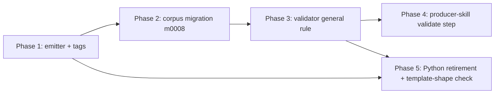

# Canonical Frontmatter Quoting Standard Implementation Plan

## Overview

Make the shared frontmatter renderer emit one canonical, type-driven quoting
style — every string double-quoted, integers/booleans/null bare — extend the
validator to enforce it, migrate the whole corpus (and the `templates/*.md`
skeletons) into conformance, and add a producer-run validate step to every
in-scope skill. This ratifies ADR-0065 in code and closes the originating
linkage defect (0220), where `work create` emitted unquoted typed-linkage
references because the renderer delegated quoting to `serde_saphyr`'s minimal
heuristic and nothing ran the validator.

The change is five independently-mergeable phases: a one-arm emitter change, a
mechanical whole-corpus migration, a broadened validator, producer-skill wiring,
and the retirement of a parallel Python enforcement surface (re-homing template
validation to a new Rust check).

## Current State Analysis

Every frontmatter write in `cli/` funnels through one function:
`document::render` → `serde_saphyr::to_string` → the `Serialize for Yaml` impl.
The `Scalar::String` arm at `cli/document/src/value.rs:173-175` calls
`serialize_str`, so quoting is delegated entirely to `serde_saphyr`'s default
`SerializerOptions` — plain when safe, double-quoted when ambiguous, and
**block-scalar (`>`/`|`) when long** (`prefer_block_scalars: true`). That default
is the PR #76 churn source: it refolds long titles to `>-` and collapses arrays.

`accelerator corpus frontmatter validate` exists and works, but is run by
nothing — no producer skill invokes it, and it is wired into no `mise` task.
Its checks scan raw frontmatter text (so `id: "0042"` and `id: 0042` stay
distinguishable) and are a mix of field-name-keyed (`check_id_quoting`,
`check_linkage_shape`) and type/schema-driven checks
(`cli/corpus/src/frontmatter_validation/mod.rs`). None enforces general string
quoting, so a bare `author: Toby` or `status: draft` passes today.

The corpus is large but clean: **1064 `meta/` files**, **zero frontmatter inline
comments**, **no CRLF**, and **18 files** carrying block-style frontmatter
sequences the renderer will reflow to flow. `this_repositorys_own_corpus_is_clean`
(`cli/corpus-cli/tests/frontmatter_goldens.rs:309-322`) currently passes.

### Key Discoveries

- **One emitter choke point** — `cli/document/src/value.rs:173-175`; sequence
  elements recurse through the same `String` arm via `FlowSeq` (`:177`), so one
  arm governs mapping values and list elements together.
- **`DoubleQuoted<T>` is the right tool** —
  `serde-saphyr-0.0.29/src/wrappers.rs:36` double-quotes in block and flow
  position and disables block folding for the value; `quote_all`
  (`serializer.rs:422`) is wrong because it prefers single quotes.
- **`id` cannot fold into the general rule** — `id: 0042` parses as the integer
  42 (losing zero-padding); the general "bare integer is allowed" rule would pass
  it, so `check_id_quoting` must stay a dedicated must-be-quoted-string
  constraint (`mod.rs:221-230`, test `an_unquoted_numeric_id_is_flagged:573-577`).
- **A second, hidden quoting rule** — `cli/work/src/tags.rs:47-62`
  (`needs_quoting`/`format_tag`) pre-quotes tag items; its output is an
  intermediate that `update.rs` re-parses via `parse_current_tags` and re-quotes
  through the renderer, so it is dead once the renderer quotes elements.
- **A parallel Python enforcement surface** — `tasks/lint/frontmatter_rules.py`
  encodes the same field-specific quoting rules and is the only validator of
  `templates/*.md` via `test_template_frontmatter.py`; a canonical standard must
  reconcile it or re-create the two-enforcer defect in a new form.
- **The migration hook already exists** —
  `MigrationContext::validate_frontmatter` (`cli/migrate/src/ports.rs:211-218`),
  and `m0006` is the mechanical-migration model (`impl Migration`, `apply()` →
  `ApplyOutcome::Applied`, registered `Mechanical(Box::new(...))`).
- **The visualiser is not a sixth write path** — its status-patch endpoint
  splices the `status:` line byte-for-byte via `patch_status`
  (`cli/corpus-adapters/src/patcher.rs`) and preserves the existing quote style;
  the emitter change never reaches it.

## Desired End State

The renderer emits canonical frontmatter for every `meta/` doc type and
`.accelerator/config.md`: every scalar double-quoted except bare
integer/boolean/null, sequences quoted per element, `schema_version: 1` bare.
The validator flags any bare string on a field the standard requires quoted and
passes bare integer/boolean/null. The committed corpus and the `templates/*.md`
skeletons are canonical and validate — `meta/` under `corpus frontmatter
validate`, templates under a new `corpus frontmatter validate-templates` action.
Every in-scope producer skill runs the validator on the document it wrote. The
parallel Python surface is gone, its template validation re-homed to Rust.

Verify: `mise run` (bare default, including the docs lane) exits 0 end-to-end;
`accelerator work create` with a bare-linkage hand-edit fails `corpus frontmatter
validate --file` with a specific code; re-running `accelerator migrate` on the
canonical corpus is a no-op.

## What We're NOT Doing

- **Validating config files** — config *conforms* here via the renderer and
  migration, but validating config (quoting plus semantic correctness) is work
  item 0227 (`accelerator config validate`). `corpus frontmatter validate`
  rejects config as `INVALID-TYPE`.
- **A CI conformance lane / repository-wide ongoing enforcement** — enforcement
  is producer-run by decision; a file hand-edited outside a skill is caught only
  when a skill next rewrites it.
- **Runtime assertion that a skill honours the validator's non-zero exit** — a
  skill is a prose-driven prompt; AC #6 (static presence) + AC #7 (deterministic
  command signal) are the accepted proxy.
- **Preserving frontmatter inline comments through the migration** — none exist
  in this repo's corpus; re-rendering drops comments by design (only
  `templates/*.md` carry them, and their comments are reproduced by the
  template-shape check, not the corpus migration). Downstream corpora that do
  carry comments or CRLF are not silently rewritten: `m0008` emits a per-file
  `0008-LOSSY` diagnostic and proceeds (see Migration Notes).
- **Changing ADR-0033 / ADR-0034** — ADR-0065 already overrides only their
  quoting clauses; both remain accepted.
- **The out-of-scope skills** — `configure`, `init` (route to 0227's
  validator), read-only skills, the commit/PR skills, and `migrate` (already
  validates in-process).

## Implementation Approach

Sequence the phases so the tree stays green after each. The emitter (Phase 1)
lands first and is independent. The migration (Phase 2) re-renders the committed
corpus through the now-canonical emitter — output that passes the *old* validator
too, so it can land before the validator tightens. The validator (Phase 3) then
tightens against an already-canonical corpus, keeping `this_repositorys_own_corpus_is_clean`
green. Producer wiring (Phase 4) and the Python retirement plus template-shape
check (Phase 5) follow.

The single definition of "canonical" is the emitter. The migration re-renders
through it (rather than re-implementing the quoting predicate a third time), so
the migration's correctness follows from the emitter's — the one place the
work item's "one canonical standard" is realised. The validator is a second,
unavoidable encoding: it scans raw text lexically (so `id: 0042` stays distinct
from `id: "0042"`) and cannot re-render. That structural-vs-lexical split is held
in lockstep not by the single-sample corpus self-check but by an explicit
symmetry guard (Phase 3) — a test asserting the validator accepts every emitter
output over a representative value-tree set — so a future divergence fails a test
rather than surfacing as a red self-check after Phase 2 has already committed the
corpus.



## Phase 1: Type-driven emitter and retire the second tag-quoting rule

### Overview

Force double quotes on every string scalar (and each string sequence element) at
the one choke point, and remove the now-dead tag-item quoting rule. This makes
every new producer write canonical; the committed corpus is untouched and still
valid under the unchanged validator.

### Changes Required

#### 1. The emitter arm

**File**: `cli/document/src/value.rs`
**Changes**: Wrap the string and float scalar arms of `Serialize for Yaml` in
`serde_saphyr::DoubleQuoted`; integer/bool/null arms are unchanged. Quoting a
float via `value.to_string()` coerces it to its string form on the next read
(`1.0` round-trips as `"1"`) — the intended consequence of ADR-0065's closed
bare set `{integer, boolean, null}`. Defensive only: no float-typed value exists
in `meta/` or `.accelerator/`; 0227's config schema must type no field as float
for this to stay defensive.

```rust
Self::Scalar(Scalar::Float(value)) => {
    serde_saphyr::DoubleQuoted(value.to_string()).serialize(serializer)
}
Self::Scalar(Scalar::String(value)) => {
    serde_saphyr::DoubleQuoted(value).serialize(serializer)
}
```

#### 2. The dead tag-item quoting rule

**File**: `cli/work/src/tags.rs`
**Changes**: Remove `needs_quoting` and `format_tag`; join tag items bare in
`build_canonical` (the renderer now quotes each element after the intermediate is
re-parsed).

```rust
fn build_canonical(tags: &[String]) -> String {
    format!("[{}]", tags.join(", "))
}
```

`needs_quoting`/`format_tag`/`build_canonical` are all private, so the `cli/work`
public surface (`parse_current_tags`, `mutate_tags`, `TagAction`/`TagMutation`)
is unchanged and its pinned public-api snapshot needs no regeneration — the work
item's "four snapshots" listing is conservative here; `public-api:check` in the
Phase 1 gate confirms no drift.

Optional but recommended: the intermediate contract between `work::tags` and
`work-cli::update` is a canonical-array *string* (`mutate_tags` →
`TagMutation::Changed(String)`) that `update.rs` re-parses with the naive
`parse_current_tags` splitter before rebuilding the `Yaml` sequence — so a
delimiter-bearing element's boundaries are only as robust as that splitter, and
the renderer's quoting no longer compensates at the intermediate stage. Changing
the contract to `TagMutation::Changed(Vec<String>)` (splice elements directly into
the `Yaml` tree, no lossy re-parse) would eliminate the ambiguity; note it would
alter the `cli/work` public surface and require a snapshot regeneration.

#### 3. Tests (TDD, red first)

**Files**: `cli/document/tests/document.rs`, `cli/work/src/tags.rs`,
`cli/work-cli/tests/cli_create.rs`, `cli/work-cli/tests/cli_create_push.rs`,
`cli/work-cli/tests/cli_update.rs`, `cli/work-cli/tests/cli_update_push.rs`,
`cli/work-cli/tests/cli_link_external_id.rs`

- Add the AC #9 regression test: drive a linkage-bearing and a
  plain-string-bearing document through `document::render` and assert quoted
  output (`parent: "work-item:0171"`, `author: "Toby"`, `tags: ["a", "b"]`). It
  fails against the current emitter, passes after change 1.
- Add a long-scalar anti-churn test: render a string value wider than 80 columns
  and assert single-line double-quoted output — no `>-`/`|` block scalar. This
  pins the load-bearing `DoubleQuoted` behaviour (block-fold suppression on long
  values) that the whole anti-churn guarantee rests on, on an exact-pinned
  pre-1.0 `serde_saphyr`, so a future dependency bump that refolds fails a test.
- Add an end-to-end special-char tag test: `work update` (or render) a tag
  containing `:` or `#` and assert the persisted file quotes the element
  (`"needs:colon"`). This closes the loop the deleted `format_tag` used to
  guarantee, now that quoting depends entirely on the renderer re-quoting the
  bare intermediate. Exclude a comma-bearing tag: `parse_current_tags`
  (`tags.rs:73`) splits on comma without respecting quotes (documented quirk
  `comma_quoted_tag_is_naively_resplit_on_the_next_mutation`), so `"a,b"` resplits
  into two elements — assert the existing resplit behaviour, not single-element
  preservation, if comma coverage is wanted.
- Flip `tags_needing_quoting_are_quoted_on_rebuild` (`tags.rs:221-229`) to expect
  bare intermediate items (`[needs:colon, needs#hash, z]`).
- Flip producer-output assertions from bare to quoted: `cli_create.rs:62-73`
  (`id`/linkage/tags), `:113-116`; `cli_create_push.rs:252` (`external_id`);
  `cli_update.rs:105-152` (`tags` flow); `cli_update_push.rs:147` (`status`).
- Regenerate the byte-identity canary fixture in `cli_link_external_id.rs:50-98`
  (`external_id` now quoted).

### Success Criteria

#### Automated Verification

- [x] The AC #9 regression test fails before change 1 and passes after: `cd cli && cargo nextest run -p document`
- [x] Work-CLI producer tests pass with quoted expectations: `mise run test:unit:cli`
- [x] Single-component loop green: `mise run cli:check`
- [x] `cli/document` public-api snapshot unchanged (the `Serialize` impl signature does not change): `mise run public-api:check`
- [x] Full read-only gate green: `mise run check`

#### Manual Verification

- [ ] `accelerator work create "T" bug medium --parent "work-item:0171" --relates-to "work-item:0194"` on a scratch repo writes `parent`/`relates_to`/`tags` fully double-quoted with no `>-` refolds.

---

## Phase 2: Mechanical corpus migration `m0008`

### Overview

Re-render every `meta/` file and `.accelerator/config.md` through the canonical
emitter, then run it over this repository and commit the canonicalised corpus.
Because the emitter now quotes, the migration's transformation is "re-render,"
and its output passes both the old and new validators.

### Changes Required

#### 1. A re-render port

**File**: `cli/migrate/src/ports.rs` (trait), `cli/migrate-adapters/src/context.rs` (impl)
**Changes**: Add `canonicalise_frontmatter(&self, content: &str) -> Result<String, MigrationError>`
to `MigrationContext`, defaulting to `Err` (matching `validate_frontmatter`'s
default). Implement it in `migrate-adapters` via `document`'s parse + `render`,
so the migration reuses the emitter as the single source of canonical form.

```rust
fn canonicalise_frontmatter(
    &self,
    _content: &str,
) -> Result<String, MigrationError> {
    Err(MigrationError::new(
        "canonicalise_frontmatter is not implemented by this context",
    ))
}
```

#### 2. The migration

**File**: `cli/migrate/src/migrations/m0008.rs` (new), `cli/migrate/src/migrations/mod.rs`, `cli/migrate/src/registry.rs`
**Changes**: `Migration0008` implements `MigrationMeta` + `Migration`,
decomposed into named helpers (enumerate, canonicalise-one, detect-loss,
round-trip-check) rather than one monolithic `apply()`. It walks every real
doc-type dir plus `.accelerator/config.md`, re-renders each via
`canonicalise_frontmatter`, writes on change, then runs the safety checks below.
Register with `pub mod m0008;` and
`MigrationEntry::Mechanical(Box::new(Migration0008))`.

**Enumeration.** Extract a shared corpus-walk helper (home:
`migrations/corpus_walk.rs`) that takes the doc-type dir set as a *parameter*.
Do not reuse `m0007`'s `corpus_files` as-is — it enumerates a linkage-filtered
table (`DocTypeKey::from_linkage_type_name`), so sharing it would couple `m0008`'s
migration completeness to the linkage vocabulary, silently excluding any future
local-only doc type that lacks a `linkage_type_name`. `m0008` supplies the full
`doc_type_dirs()` set explicitly; a regression test asserts it reaches a doc type
with no linkage type name.

**Value-preservation (fail closed).** After re-rendering each file, run three
checks, any failure aborting the migration with a `MigrationError` naming the file
and pointing at VCS revert (ledger unmarked, so a re-run resumes after the fix):

1. Compare the re-parsed value tree to the pre-render parse. This catches
   render-*introduced* drift (the `1.0`→`"1"` float coercion, any surprise
   re-typing) but — by construction — **not** parse-*introduced* normalisation:
   a bare `id: 0042` deserialises to `Int(42)` on both sides, so the trees match
   while the zero-padding is silently stripped. State this limitation explicitly.
2. Guard parse-time normalisation of bare scalars the standard requires quoted:
   for any field whose original raw value is bare but YAML implicitly re-types
   (a leading-zero or signed integer, a YAML-1.1 boolean spelling), compare the
   original raw bytes against the re-rendered value and abort on a normalising
   change — this is the padded-string class (`id`, `external_id`) the value-tree
   check cannot see.
3. Gate acceptance on the in-process `validate_frontmatter` passing over the
   re-rendered `meta/` file. Its result was previously unspecified; make a
   residual violation a fail-closed abort (not diagnose-and-proceed), so a
   downstream re-render that still fails the validator (e.g. a block-to-flow
   reflow exposing a latent bad-linkage element) stops the migration rather than
   committing a non-conformant file.

Checks 1 and 2 apply to every `meta/` file and to `.accelerator/config.md` (which
the corpus validator cannot cover as `INVALID-TYPE`), so no rewrite rests on
idempotency alone — idempotency proves a fixed point, not canonicity. Run all
checks against the in-memory re-rendered string *before* writing, so known-bad
bytes never reach disk.

**Comment/CRLF loss (diagnose and proceed).** Downstream corpora, unlike this
repo, may carry inline frontmatter comments or CRLF, which re-render drops (the
`Yaml` tree has no comment representation, and the read path decodes UTF-8-lossy).
The detector is defined by a tractable, testable predicate on the *original*
bytes — an inline `#` comment outside a quoted region, a CRLF line ending, or
content that does not round-trip through UTF-8 — **not** an open-ended
"bytes beyond quoting/flow" diff, which would be a third encoding of "canonical."
On any such file, emit a per-file `0008-LOSSY <path>: <reason>` diagnostic, then
proceed (`ApplyOutcome::Applied`). At the end of the run, emit an aggregate
summary line — `N files re-rendered, M with dropped comments/CRLF — revert this
migration commit to recover` — so the total blast radius is visible before commit
rather than only per-file lines scrolling past in a 1000+ file walk. The loss is
surfaced, not silent; VCS revert is the recovery path per project convention.
(`m0007`'s `REFUSE`/`MALFORMED` precedent is the detection model, applied here as
a report — comment loss is not a hard refusal because that would block downstream
adoption, whereas a *value* change, above, does fail closed.)

#### 3. Run and commit

Run `accelerator migrate` over this repo; commit the canonicalised 1064 `meta/`
files, `.accelerator/config.md`, and the config/corpus changes as a single
mechanical rewrite.

#### 4. Test tripwires

**Files**: `cli/migrate/tests/fixtures/public-api.txt` (add `Migration0008` + the
two new port methods, `canonicalise_frontmatter` and `realign_sync_baseline`),
the per-test "all other migrations applied" isolation lists in
`cli/migrate-cli/tests/migration_000N.rs`, `cli/migrate-cli/tests/full_registry_e2e.rs`.

#### 5. Migration unit tests (TDD)

**File**: `cli/migrate/src/migrations/m0008.rs`, `cli/migrate-cli/tests/migration_0008.rs`
- A bare-frontmatter fixture canonicalises to quoted output; a block-style
  sequence reflows to quoted flow.
- A multi-element block linkage sequence with colon-bearing values (e.g.
  `relates_to:\n  - work-item:0194\n  - adr:ADR-0034`) reflows to quoted flow
  `["work-item:0194", "adr:ADR-0034"]` and passes the linkage-shape check — the
  exact 0220 defect class, given a targeted regression rather than only the
  aggregate self-check.
- Idempotence, effective: apply the transform twice to real-corpus-derived
  content and assert byte-equality on the *second* pass (mirror
  `migration_0007`'s byte-equivalence golden). The ledger-gated "re-running
  `migrate` is a no-op" is not sufficient — once `m0008` is in the applied
  ledger the engine skips it unconditionally, so that path never exercises the
  emitter's fixed-point behaviour that AC #4 depends on.
- The config file's untyped nested frontmatter (top-level `visualiser:`/`work:`
  maps, a block sequence) quotes strings, leaves integers bare, and round-trips
  to an unchanged value tree.
- `0008-LOSSY` sensitivity and specificity: a comment-bearing fixture, a CRLF
  fixture, and a non-UTF-8 fixture each emit `0008-LOSSY`, still write, and return
  `ApplyOutcome::Applied`; a clean comment-free LF fixture (the common bare→quoted
  and block→flow case) emits **no** `0008-LOSSY`, so an over-firing detector fails
  a test rather than tagging the ordinary 1064-file rewrite as lossy.
- Value-preservation fail-closed: a fixture whose re-render would change a scalar
  type (a float `1.0` → `"1"`) aborts with a `MigrationError` and leaves the
  ledger unmarked, distinct from the diagnostic-and-proceed LOSSY path.
- Enumeration completeness: the shared corpus-walk, given `doc_type_dirs()`,
  reaches a doc type that has no `linkage_type_name` (a walk coupled to the
  linkage table would silently skip it).

#### 6. Realign the `/sync-work-items` baseline

**Files**: `cli/migrate/src/ports.rs` (trait), `cli/migrate-adapters/src/context.rs` (impl),
`cli/migrate/src/migrations/m0008.rs`, `cli/migrate-cli/tests/migration_0008.rs`
**Changes**: The sync change-detection baseline persists a per-item `local_hash`
in `<integrations>/<system>/last-sync.json`, computed by `digest::local` over the
raw frontmatter via `filter_frontmatter_keys`, which keeps whole lines verbatim
(quote characters included) and whose `IGNORE_KEYS` excludes none of the
re-quoted fields. Re-quoting therefore changes the `local_hash` of essentially
every synced item, so without realignment the next `/sync-work-items` classifies
every item as locally-modified — spuriously re-pushing content-identical updates
to the live tracker (corpus-scale remote churn) or forcing whole-corpus conflict
resolution. `m0008` rewrites `meta/` but not the baseline, and this ships to every
downstream user, so make it a concrete step rather than a manual check.

**Route it through a port.** `digest::local` lives in `work-adapters` and depends
on `work::normalise::filter_frontmatter_keys`, but the `migrate` domain crate may
depend only on corpus/document/kernel (enforced by the
`migrate_domain_imports_only_permitted` pup rule and the crate's
zero-infrastructure invariant). Do not reproduce the hash inside `m0008`. Add a
`realign_sync_baseline(&self) -> Result<usize, MigrationError>` method to
`MigrationContext` (defaulting to `Ok(0)`, no-op), implemented in
`migrate-adapters` where it can reuse `work-adapters`' `digest::local` and
`baseline` reader — keeping `migrate` domain-pure. This introduces a
`migrate-adapters → work-adapters` adapter-to-adapter edge that does not exist
today; justify it in the plan as the one place migration and sync-baseline
formats must meet, or relocate the shared digest recipe into a crate both adapters
already reach.

**Realign only pre-migration-Synced entries.** Recomputing `local_hash` for
*every* entry would mask a genuine hazard: an item edited-and-committed but not
yet pushed was already `LocallyModified`, and blindly setting its baseline to the
re-rendered hash reclassifies it `Synced`, silently dropping the pending push.
Realign only entries whose *pre-migration* `digest::local` equalled the stored
baseline `local_hash` (items that were `Synced` before the migration); leave a
diverged entry's baseline untouched so it stays `LocallyModified`. Preserve
`remote_hash`/`remote_updated_at` in both cases, and emit a diagnostic per
realigned baseline. Two regression tests: a pre-migration-`Synced` item is not
spuriously flagged after the migration, and a pre-migration-`LocallyModified`
item stays flagged (its pending push survives).

#### 7. Config-path-aware preflight scan

**Files**: `cli/migrate/src/preflight.rs`, `cli/migrate-cli/tests/`
**Changes**: Revert-based recovery rests on the dirty-tree preflight refusing to
run against uncommitted work in any path a migration rewrites. The scan scopes a
hardcoded set (`preflight.rs:16` — `["meta/", ".claude/accelerator",
".accelerator/"]`), but migration write scopes are config-driven: a corpus
relocated via a `paths.*` override is rewritten while the guard scans a different
set, so uncommitted edits there are overwritten with no revert point. This
exposure predates `m0008` (`m0006` already walks `paths.plans`), and preflight
runs once per run for *all* migrations, so fix it at the run level, not per
migration. Define the scan scope as the union of *every* config-driven path any
registered migration writes — the configured doc-type/corpus dirs *and*
`paths.integrations` (where change #6 writes `last-sync.json`) and
`paths.templates` (m0006 writes userspace templates), plus the fixed
`.accelerator/`/`.claude/accelerator` paths. Scoping to corpus dirs alone would
leave a blind spot precisely over the baseline file change #6 mutates. Add tests
asserting a dirty file aborts preflight under both a `paths.*`-relocated corpus
and a `paths.integrations`-relocated baseline. `m0008` — the first full-corpus
rewrite — is what makes this load-bearing, so it is owned here rather than left a
caveat.

### Success Criteria

#### Automated Verification

- [ ] Migration unit + e2e tests pass: `mise run test:unit:cli` and `cd cli && cargo nextest run -p migrate-cli`
- [ ] Sync-baseline realignment tests (both directions): a pre-migration-`Synced` item is not spuriously flagged after the migration, and a pre-migration-`LocallyModified` item stays flagged (its pending push survives): `cd cli && cargo nextest run -p migrate-cli migration_0008`
- [ ] Value-preservation aborts on parse-time normalisation of a bare padded numeric (`id: 0042`) and on a residual `validate_frontmatter` violation, not only on render-introduced drift: `cd cli && cargo nextest run -p migrate-cli migration_0008`
- [ ] The double-apply byte-equality idempotency test passes (the real proof of AC #4's byte-stability): `cd cli && cargo nextest run -p migrate-cli migration_0008`
- [ ] `accelerator migrate` applies cleanly and the in-process `validate_frontmatter` self-check passes.
- [ ] The self-check gate stays green under the unchanged validator: `cd cli && cargo nextest run -p corpus-cli this_repositorys_own_corpus_is_clean`
- [ ] Migrate public-api regenerated (`Migration0008` + the new port method) and pinned: `mise run public-api:update` then `mise run public-api:check`
- [ ] Full gate green: `mise run check`

#### Manual Verification

- [ ] `git diff` on the migration commit shows only quoting/flow changes — no body edits, no reordered keys, no semantic changes.
- [ ] Re-running `accelerator migrate` records `0008` in the ledger and reports no work (a ledger sanity check — the byte-stability proof is the automated double-apply test above, since the ledger unconditionally skips an already-applied migration).
- [ ] Any violation the block-to-flow reflow newly exposes on the 18 block-style files is a real corpus defect and is fixed, not suppressed.
- [ ] After migrating a repo with a `last-sync.json`, run `/sync-work-items` (preview) and confirm no item is spuriously reported as locally-modified — the baseline was realigned in the same pass (change #6).

---

## Phase 3: Validator general quoting rule

### Overview

Add one general check that flags a bare scalar unless it is an
integer/boolean/null literal or a flow collection whose elements recurse, while
keeping the dedicated `id`, `schema_version`, timestamp, and linkage checks. The
committed corpus is already canonical (Phase 2), so the self-check stays green.

### Changes Required

#### 1. The violation

**File**: `cli/corpus/src/frontmatter_validation/violation.rs`
**Changes**: Add `UnquotedString { key: String }` with code `UNQUOTED-STRING` and
a message naming the key. `UnquotedId` stays (it rejects a bare numeric `id` the
general rule would permit). Update the module header's taxonomy accounting (line
1 currently reads "the 16 bash-mirrored codes plus `DuplicateId`") to record
`UnquotedString` as a second genuine, non-bash addition, keeping the provenance
annotation accurate.

#### 2. The general check

**File**: `cli/corpus/src/frontmatter_validation/mod.rs`
**Changes**: Add `check_canonical_quoting(entries, row, &mut violations)` and call
it from `validate_file`. For each entry, skip an empty value and any key in
`dedicated_check_keys(row)` (a single helper the dedicated checks and this check
both consult — see below), then require the value be a double-quoted scalar, a
bare integer/boolean/null literal, or a flow collection whose elements each
satisfy the same rule.

The predicate must be quote-aware **and escape-aware**. The existing
`is_quoted_scalar` (`mod.rs:389`) locates the closing quote with
`rest.find('"')`, which stops at the *first* `"` byte — including a
backslash-escaped inner `\"` that the emitter emits for a string carrying a
double-quote. Two committed corpus files already carry such a value
(`2026-06-29-0176-workflows-rename-and-skill-catalogue.md:4` and
`2026-08-07-0172-migration-engine-subdomain.md`, both a `title:` with `\"`), so a
canonical string is mis-flagged `UNQUOTED-STRING` and the Phase 3 self-check turns
red on an already-canonical file. Fix `is_quoted_scalar` (and every flow scan) to
find the first *unescaped* `"`. The ` #`/comma-inside-quotes cases are handled by
the same escape-aware close-scan: the closing quote is the true end, so a comment
or comma before it is inside the string. The mistake to avoid is pre-stripping a
trailing comment over the *raw* value before the quote is located — that truncates
`"… #1 …"` and mis-flags it.

```rust
fn closing_quote(rest: &str) -> Option<usize> {
    let bytes = rest.as_bytes();
    let mut i = 0;
    while i < bytes.len() {
        match bytes[i] {
            b'\\' => i += 2,
            b'"' => return Some(i),
            _ => i += 1,
        }
    }
    None
}

fn is_quoted_scalar(raw: &str) -> bool {
    let Some(rest) = raw.strip_prefix('"') else {
        return false;
    };
    let Some(close) = closing_quote(rest) else {
        return false;
    };
    let tail = &rest[close + 1..];
    tail.is_empty() || is_trailing_comment(tail)
}

fn is_canonically_quoted(raw: &str) -> bool {
    let raw = raw.trim_start();
    if let Some(rest) = raw.strip_prefix('[') {
        let Some(close) = closing_bracket(rest) else {
            return false;
        };
        let tail = &rest[close + 1..];
        return (tail.is_empty() || is_trailing_comment(tail))
            && flow_elements(&rest[..close]).all(is_canonical_scalar);
    }
    is_canonical_scalar(raw)
}

fn is_canonical_scalar(raw: &str) -> bool {
    is_quoted_scalar(raw) || is_bare_int(raw) || is_bare_literal(raw)
}
```

`is_bare_int` mirrors `is_bare_one` (`mod.rs:400`) — a digit run, optional
leading `-`, then empty or a trailing comment; `is_bare_literal` matches
`true`/`false`/`null`/`~` with the same trailing-comment tolerance. `is_bare_int`
accepts a leading zero (`0042`), a by-design false-negative on a hand-edited
non-`id` numeric-string field: the general rule cannot know per-field string
semantics, `id` keeps its dedicated must-be-quoted check, and the emitter never
produces this shape.

`closing_bracket` and `flow_elements` are both quote- and escape-aware:
`closing_bracket` scans for the *structural* `]` (not `rfind`, which would grab a
`]` inside a trailing comment such as `tags: ["a"] # see [note]`), and
`flow_elements` splits on the *structural* commas only, so a comma or `#` inside a
quoted element (`["a, b"]`, `["needs#hash"]` — the value Phase 1's tag-rule
deletion now produces) is preserved, and it filters empty elements so `[]` passes
vacuously. Do **not** reuse `linkage_elements`' splitter (`mod.rs:154`): it is
deliberately non-quote-aware (`split('#').next()`, splits every comma) and feeds
two tested consumers (`check_linkage_shape`, `dangling_refs`) — changing it
regresses them. If sharing, extract only the innermost quote/escape-aware
comma-split and leave `linkage_elements`' bracket/comment wrapper and empty-filter
in place.

Because the same quote-aware predicate is needed by the Phase 5 template-shape
check and by work item 0227's config validator (config is `INVALID-TYPE`, so
neither can reach it via `validate_file`), it must be defined once and reachable by
both the corpus and config domains. A home inside `cli/corpus`
(`frontmatter_validation/canonical_quoting.rs`) serves the instance validator and
the template-shape check, but `config` and `corpus` both depend only on `kernel`
with no edge between them — so 0227 could not reuse it without a new `config →
corpus` domain-to-domain dependency, which would re-introduce the very fourth
duplication this avoids. The predicate is pure lexical string logic carrying no
corpus-domain concepts, so home it where both domains already reach without a new
edge — `kernel`, `document`, or a small dedicated shared crate — and have the
corpus validator, the template-shape check, and 0227 all import it from there. Pin
the choice in the plan rather than deferring the config-reuse seam to 0227.

`dedicated_check_keys(row)` returns `id`, `schema_version`, and the row's
`typed_linkage_keys` — the fields with their own check, which
`check_canonical_quoting` skips to avoid double-reporting. It is the single source
for the general check's skip-set; the single-key checks (`check_id_quoting`,
`check_schema_version`) keep their direct key lookup rather than iterating it. The
guard against drift is the test: for each `dedicated_check_keys` field, assert
exactly one *quoting* violation code fires (scoped to quoting codes, since an
orthogonal code such as an empty-placeholder violation can legitimately co-fire).

Timestamp quoting is enforced here (a bare `date:` is a non-literal string →
`UnquotedString`); `check_timestamps` continues to validate ISO format on the
stripped value. The two compose, with one overlap: a bare *malformed* timestamp
reports both `UnquotedString` and `BadTimestamp`. This is accepted and documented
(the two defects are genuinely distinct — unquoted AND bad format) rather than
suppressed, since gating one on the other would hide a real second defect.

#### 3. Tests and in-source fixtures (TDD)

**Files**: `cli/corpus/src/frontmatter_validation/mod.rs` (the validator's unit
tests live in-module, not in a `cli/corpus/tests/frontmatter.rs`, which does not
exist), `cli/corpus-cli/tests/frontmatter_goldens.rs`,
`cli/corpus/tests/fixtures/public-api.txt`
- Add `UnquotedString` tests: a bare `author`/`status`/`kind`/`priority`/`title`
  is flagged; the quoted form passes; a bare `tags` element is flagged; a bare
  timestamp is flagged; a bare integer field passes.
- Add a bare/quoted `type:` pair — `type` is bare in most corpus files today
  (`type: plan`) and quoted in others, so it is one of the most-migrated fields;
  assert bare `type:` is flagged and quoted `type:` passes.
- Add quote-aware and escape-aware regression cases (the fix for the
  emitter/validator divergence): a double-quoted value containing an escaped
  inner quote (`title: "… \"workflows\" …"`, the two real corpus files) passes; a
  double-quoted value containing ` #` (`last_updated_note: "… question #1 …"`)
  passes; a quoted flow element containing a comma (`["a, b", "c"]`) passes; a
  quoted flow element containing `#` (`["needs#hash"]`) passes; a flow list with a
  trailing comment carrying `]` (`tags: ["a"] # see [note]`) passes; an empty
  sequence (`tags: []`) passes. Each fails against the naive close-scan / `rfind`
  sketch and passes once the scans are escape- and quote-aware.
- Add the emitter↔validator symmetry guard: render a representative value-tree set
  through `document::render` and assert `check_canonical_quoting` accepts every
  one (and rejects a deliberately-bare mutation of each). The set must include the
  adversarial-but-real shapes the guard exists to catch — an embedded escaped
  double-quote, embedded `[`/`]`, a numeric-looking string (`"0042"`), a
  colon+hash string, an empty sequence, and a float — so the guard cannot pass
  while shipping an emitter/validator divergence.
- Requote every in-source "valid document" fixture that the tightened rule would
  otherwise reject — `minimal_valid_work_item` (`mod.rs:502-514`), the shared
  `write_work_item` helper (`frontmatter_goldens.rs:44-58`), and the inline
  valid-document fixture in `checks_structure_only_omits_dangling_ref_violations`
  (`frontmatter_goldens.rs:~186-198`, which carries bare `title`/`author`/`status`/
  `kind`/`priority` and asserts success under `--checks structure`). Audit every
  in-source valid-document fixture for bare fields so the requoting set is
  complete, not illustrative.
- Add the single-source skip-set test: for each `dedicated_check_keys` field,
  assert exactly one *quoting* violation code fires (scoped to quoting codes; an
  orthogonal code may legitimately co-fire).
- `an_unquoted_numeric_id_is_flagged`, `schema_version_must_be_the_bare_integer_one`,
  and the linkage suite stay green unchanged.
- Regenerate the `cli/corpus` public-api snapshot for the new variant with
  `mise run public-api:update`.

### Success Criteria

#### Automated Verification

- [ ] New `UnquotedString` unit tests (including the ` #`/comma quote-aware cases and the bare/quoted `type:` pair) fail before the check is added, pass after: `cd cli && cargo nextest run -p corpus`
- [ ] The emitter↔validator symmetry guard and single-source skip-set tests pass: `cd cli && cargo nextest run -p corpus`
- [ ] Self-check gate green against the canonical corpus: `cd cli && cargo nextest run -p corpus-cli this_repositorys_own_corpus_is_clean`
- [ ] Requoted in-source fixtures pass; corpus public-api regenerated and pinned: `mise run public-api:update` then `mise run public-api:check`
- [ ] Full gate green: `mise run check`

#### Manual Verification

- [ ] `printf '...\nauthor: Toby\n...' > f.md && accelerator corpus frontmatter validate --file f.md` exits non-zero and prints `UNQUOTED-STRING` on stderr.
- [ ] A quoted value carrying ` #` (e.g. `last_updated_note: "… question #1 …"`) validates cleanly — the real corpus case the sketch broke.
- [ ] A hand-edited bare `parent: work-item:0001` still reports `BAD-LINKAGE-SHAPE` (linkage diagnostics preserved).

---

## Phase 4: Producer-skill validate step and coverage test

### Overview

Add the validate step to every in-scope producer skill (21 skills, not 22 — the
enumerated set recounts to 21) and a static test asserting each names the
invocation. This is the enforcement mechanism in place of a CI lane.

### Changes Required

#### 1. Per-skill allowed-tools and validate step

**Files**: the 21 `SKILL.md` paths (from the classification below)
**Changes**: To each, add an `allowed-tools` rule matching the plugin-root-prefixed
convention (two-space indent, except `validate-plan` and `review-work-item` which
use three), and append a validate step to the skill's final persistence section,
modelled on `inventory-design`'s pre-write `scrub-secrets` gate (fenced bash +
fail-closed prose).

```yaml
  - Bash(${CLAUDE_PLUGIN_ROOT}/bin/accelerator corpus frontmatter validate *)
```

```bash
${CLAUDE_PLUGIN_ROOT}/bin/accelerator corpus frontmatter validate --file <path>
```

Final-section headings per skill: `create-work-item` → *Step 5: Write Work Item*;
`extract-work-items` → *Step 4: Write Work Items*; `refine-work-item` → *Step 4 —
Execute Operations*; `update-work-item` → *Step 5: Write*; `stress-test-work-item`
→ *Capturing Changes*; `sync-work-items` → *Step 5: Summarise* (validate each
touched item after the engine run); `review-work-item` → *Step 4 → Populate
frontmatter*; `conduct-spike` → *Step 6: Record the outcome*; `research-codebase`
→ *Step 6*; `research-issue` → *Step 6*; `create-adr` → *Step 4: Write the ADR*;
`extract-adrs` → *Step 4: Write ADRs*; `review-adr` → *Step 4: Execute Action*;
`create-plan` → *Step 5: Populate frontmatter*; `review-plan` → *Step 4 →
Populate frontmatter*; `validate-plan` → *Step 4: Persist the Validation Report*;
`stress-test-plan` → *Capturing Changes*; `implement-plan` → *Verification
Approach* (validate the plan after status/checkbox writes); `create-note` → *Step
4: Write the Note*; `inventory-design` → *11. Populate frontmatter and write
artifact*; `analyse-design-gaps` → *7. Populate frontmatter and write artifact*.

Two weak fits are handled explicitly, and the coverage test records each as a
named exception (not a uniform-rule member) so the next maintainer sees the step
is a deliberate special case: `sync-work-items` validates each concrete item the
engine touched after the engine run (the engine owns the write); `implement-plan`
validates the specific plan file it just ticked checkboxes on, since it authors
no frontmatter itself. Each still validates a real file it touched — the step is
load-bearing there, not present only to satisfy the assertion.

#### 2. Static coverage test (AC #6)

**File**: `tests/unit/tasks/test_skill_frontmatter_validation.py` (new)
**Changes**: Model on `test_skill_frontmatter_population.py` — live-tree
`rglob("SKILL.md")` discovery with a two-tier allowlist and a discovery gate that
flags any producer skill surfaced but in neither tier. This is the sole
enforcement mechanism (no CI lane), so the assertion must be strong:

- Two-tier allowlist, mirroring the population test's `NON_EMITTER_TEMPLATE_CONSUMERS`
  tier: the closed 21-skill in-scope set, plus a second tier of
  discovered-but-out-of-scope producer-marked skills (`describe-pr`, `review-pr`,
  the read-only skills, etc.) that write no `meta/` artefact. A single 21-entry
  list would false-flag the second tier or, scoped down to dodge them, lose the
  ability to catch a newly-added in-scope producer. Use this test's own set (the
  population test's 16-skill list does not match it).
- Bind the assertion to the skill's final persistence section and require the
  `corpus frontmatter validate` invocation to appear inside a fenced bash block —
  not anywhere in the file. A bare substring match passes on an invocation sitting
  in prose, a comment, or the wrong section, giving the enforcement proxy almost
  no mutation-catching power. The population test's `_HEADING_RE`
  (`persistence|metadata|frontmatter|populate|capture metadata|step [0-9]`) does
  **not** match three in-scope skills' final sections — `stress-test-work-item`
  and `stress-test-plan` use `## Capturing Changes`, and `implement-plan` uses
  `## Verification Approach` — so extend the regex with `capturing changes` and
  `verification` (and confirm each enumerated heading from change #1 matches)
  rather than reusing it unchanged, or the section-scoped assertion misfires
  exactly where the fit is weakest.
- Extract the shared heading regex and discovery helpers into a small non-test
  support module under `tasks/` (or `tests/unit/tasks/`) that both this test and
  `test_skill_frontmatter_population.py` import — importing one test module from
  another is fragile under pytest importlib mode (no `__init__.py`). Record the
  exact invocation string and the section-anchoring convention as constants in
  that module, so a future change to the convention has one authoritative source
  even though the 21 SKILL.md copies remain.

#### 3. Deterministic command signal (AC #7)

**File**: `cli/corpus-cli/tests/` (extend)
**Changes**: A CLI test asserting `frontmatter validate --file <violating>` exits
non-zero and emits the specific code on stderr.

### Success Criteria

#### Automated Verification

- [ ] Coverage test green over the 21 skills; discovery gate flags none: `mise run test:unit:tasks`
- [ ] SKILL.md tool-permission lint accepts the new rule: `mise run lint:skill-permissions:check`
- [ ] CLI signal test passes: `cd cli && cargo nextest run -p corpus-cli`
- [ ] Full gate green: `mise run check`

#### Manual Verification

- [ ] Run `create-work-item` (CLI-delegated) and `create-note` (direct Write) end-to-end; the validate step runs and surfaces a violation when the written file is made non-conformant.

---

## Phase 5: Retire the Python surface and re-home template validation

### Overview

Replace the parallel Python frontmatter-rules surface with a new Rust
template-shape check, regenerate the `templates/*.md` skeletons to canonical
quoting, and delete the Python module once both its consumers have moved.

### Changes Required

#### 1. The template-shape check

**Files**: `cli/corpus/src/frontmatter_validation/template_shape.rs` (new),
`cli/corpus-adapters/src/frontmatter_validation.rs`, `cli/corpus-cli/src/cli.rs`,
`cli/corpus-cli/src/main.rs`
**Changes**: Pure per-row shape logic in `template_shape.rs` (row + frontmatter
string → violations); a filesystem driver in `corpus-adapters` reading each
`templates/<name>.md` at `composed.project_root`; a new
`FrontmatterAction::ValidateTemplates` variant and handler. Give the check its
own `TemplateViolation` type in `template_shape.rs` rather than adding
template-only variants to the instance-validation `Violation` enum — the two
serve different audiences (populated documents vs skeletons), and folding
placeholder-grammar / status-vocabulary / TSV-cross-check variants into `Violation`
would leave every instance-validation consumer (CLI renderer, migration
self-check, public-api snapshot) carrying variants that can never occur there.
`TemplateViolation` can share a `Display`/`code()` shape without sharing the enum.

The port must cover the **full** rule set the deleted Python suite validated,
not only the seven checks with no Rust equivalent. `validate_file` structurally
rejects template skeletons, so base-field presence, field type, `schema_version`
integer, quoted `id`, legacy own-id key, and provenance-bundle checks do **not**
run on `templates/*.md` today except via `test_template_frontmatter.py` — deleting
it without porting them loses that coverage. Port both groups:

- The seven with no Rust equivalent: placeholder-slot grammar per linkage key,
  the `blocked_by` inverse-guidance line, closed-set linkage keys per row,
  per-type extras in the skeleton, the status-comment vocabulary from
  `status_vocab`, the TSV field-count self-check (runtime over the on-disk file),
  and the work-item Schema-Reference ↔ TSV cross-check.
- The base/type/`schema_version`/`id`/own-id/provenance checks the corpus
  validator applies to instances but not to templates.
- The general canonical-quoting check. Templates are the only frontmatter surface
  authored by hand rather than emitted through the renderer — the highest-drift
  surface — and Phase 5 change #2 hand-rewrites them to canonical quoting, so
  something must verify that quoting stays canonical. Run `is_canonically_quoted`
  (from the shared `canonical_quoting` module, Phase 3) over template rows; its
  quoted-ness check is orthogonal to the ISO-timestamp check templates legitimately
  fail (a placeholder `"YYYY-…"` is quoted but not a valid timestamp).

Reuse, do not re-encode: base-field presence, quoted-`id`, bare `schema_version`,
own-id, and provenance predicates already exist as pure functions in `mod.rs`
(`check_base_fields`, `is_quoted_scalar`, `is_bare_one`, `check_provenance`, …).
`template_shape.rs` should call these via `super::` (and the shared
`canonical_quoting` module) and add only the genuinely template-specific rules,
rather than reimplementing the predicates — otherwise the retirement trades a
cross-language duplication for an in-Rust one. Pin the template-only base-field
additions (`producer`, `status`) as one named constant so the template
`BASE_FIELDS` superset has a single home.

#### 2. Regenerate the templates

**Files**: `templates/*.md` (13)
**Changes**: Rewrite each to canonical quoting — quoted `id`/`author`/`status`/
`title`/`last_updated_by`, flow-quoted `tags`, bare `schema_version: 1`,
placeholder tokens (`"NNNN"`, `"ADR-NNNN"`, `"YYYY-…"`, `{filename-stem}`) and
the `# typed-linkage ref` comments preserved.

#### 3. Real-tree and unit tests (TDD)

**File**: `cli/corpus-cli/tests/frontmatter_goldens.rs`, `template_shape.rs`
**Changes**: Add `the_real_templates_tree_is_clean`, shelling out to `frontmatter
validate-templates` rooted at `CARGO_MANIFEST_DIR/../..`; add pure unit tests
with **one negative per ported rule** — a per-rule broken-template fixture for
each of the ~20 rules the Python suite covered (missing base field, wrong type,
non-integer `schema_version`, bare `id`, legacy own-id key, missing/forbidden
provenance, per-type extras, each linkage-slot grammar, closed-set, status
vocabulary, field-count, cross-check), not a single broken template exercising
two of them. This per-rule parity is the gate on the Python deletion (change #4):
the deletion lands only once every rule the Python suite validated has a passing
Rust negative.

#### 4. Retire the Python surface (deletion gate)

**Files**: delete `tasks/lint/frontmatter_rules.py`,
`tests/unit/tasks/test_frontmatter_rules.py`,
`tests/unit/tasks/test_template_frontmatter.py`; amend
`tests/integration/conformance/test_conformance.py`
**Changes**: Delete the module and its own test wholesale. Amend
`test_conformance.py` to drop the `fr` import and re-source `BASE_FIELDS`,
`PROVENANCE_FIELDS`, `OPTIONAL_EXTRAS`. The retirement's goal is one standard,
one implementation, so do not hand-copy the Rust constants into the Python test —
that recreates the cross-language duplication the retirement exists to end. These
three banks are *not* in `templates-schema.tsv` (which carries only per-type
rows); they live as Rust consts in `schema.rs`, so "source from an artefact the
Rust already owns" needs a concrete decision. Add a small read-only
`corpus frontmatter print-schema` subcommand that emits the three banks as JSON
from the `schema.rs` consts, and have `test_conformance.py` parse its output —
the Rust remains the single source, Python reads it at test time, and there is no
regex over `.rs` source and no hand-synced copy. (An emitted static data file the
build regenerates is an acceptable alternative; a Python copy guarded by a
value-equality test against `print-schema` is the fallback if a subcommand is
judged too heavy.) Delete only after template validation has moved to the Rust
check and `test_conformance.py` sources its constants from the Rust side.

#### 5. Public-api snapshot

**Files**: `cli/corpus/tests/fixtures/public-api.txt`

Only `cli/corpus` is pinned (`_PINNED_CRATES` in `tasks/public_api.py`).
`corpus-adapters` (an adapter) and `corpus-cli` (a composition root) are in
`_EXEMPT_MEMBERS`, so they carry no snapshot and `public-api:update` never
generates one — the earlier three-file list was wrong. Regenerate the one pinned
snapshot for the new `TemplateViolation` surface with `mise run public-api:update`.

### Success Criteria

#### Automated Verification

- [ ] Template-shape unit tests fail before the check exists, pass after; one negative per ported rule fails: `cd cli && cargo nextest run -p corpus`
- [ ] `frontmatter validate-templates` over `templates/` exits 0 post-regen; real-tree test green: `cd cli && cargo nextest run -p corpus-cli the_real_templates_tree_is_clean`
- [ ] `test:unit:tasks` green without `frontmatter_rules`; conformance green with re-sourced (or drift-guarded) constants: `mise run test:unit:tasks` and `mise run test:integration:conformance`
- [ ] Corpus public-api snapshot regenerated and pinned: `mise run public-api:update` then `mise run public-api:check`
- [ ] Full local CI mirror green end-to-end (including the docs lane): `mise run`

#### Manual Verification

- [ ] `git diff templates/` shows only quoting/flow changes; placeholder tokens and `# typed-linkage ref` comments intact.
- [ ] No `mise` task or CI workflow references the deleted Python module.

---

## Testing Strategy

### Unit Tests

- Emitter: linkage-bearing and plain-string documents render fully quoted; a
  float renders quoted; a sequence quotes per element; a >80-column string stays
  single-line double-quoted with no block scalar; a `:`/`#`-bearing tag persists
  quoted end-to-end (Phase 1).
- Validator: bare string fields flagged `UNQUOTED-STRING`; bare integer/bool/null
  pass; `id`/`schema_version`/linkage keep their dedicated codes; quote- and
  escape-aware cases (an escaped inner `\"`, ` #` in a quoted scalar, a comma/`#`
  in a quoted flow element, a trailing comment carrying `]`, empty `[]`) pass; a
  bare/quoted `type:` pair; the emitter↔validator symmetry guard (with adversarial
  inputs) and the single-source skip-set test (Phase 3).
- Config write: a `config-adapters` store-write test asserts the persisted config
  frontmatter is canonically quoted, including a nested map mixing a bare integer
  and a quoted string — satisfying AC #3 directly rather than by inference from
  the shared renderer (Phase 1/2).
- Migration: bare → quoted, block → flow, colon-bearing block linkage reflow to
  quoted flow, double-apply byte-equality idempotence, config untyped nested
  round-trip; `0008-LOSSY` sensitivity (comment/CRLF/non-UTF-8) *and* specificity
  (a clean file emits none); value-preservation fail-closed (a float coercion
  aborts); enumeration completeness; and the sync-baseline realignment (Phase 2).
- Template-shape: one negative per ported rule (full parity with the deleted
  Python suite, not a single broken template), the canonical-quoting check over
  template rows, plus the real-templates-tree gate (Phase 5).

### Integration Tests

- `this_repositorys_own_corpus_is_clean` — the end-to-end migration gate: red
  once the validator tightens without a canonical corpus, green after Phase 2.
- `the_real_templates_tree_is_clean` — the templates end-to-end gate (Phase 5).
- The static SKILL.md coverage test over the live `skills/` tree (Phase 4).

### Manual Testing Steps

1. On a scratch repo, `accelerator work create` with linkage flags → inspect the
   file is fully quoted with no `>-` refolds.
2. Hand-edit a field to a bare string → `corpus frontmatter validate --file` exits
   non-zero with the specific code.
3. Run `accelerator migrate` twice → first canonicalises, second is a no-op.

## Performance Considerations

The migration re-renders 1064 files once — a one-time, offline cost. The
producer validate step adds one `corpus frontmatter validate --file` invocation
per skill write (single-file, sub-100ms), negligible against the skill's own
work.

## Migration Notes

`m0008` is mechanical and inherits the framework's dirty-tree refusal
(`cli/migrate/src/preflight.rs`) and `ACCELERATOR_MIGRATE_FORCE=1` bypass. It is
idempotent (re-rendering canonical output is a byte-level fixed point, proved by
the double-apply test) and recoverable by VCS revert. Re-rendering exposes the 18
block-style files' sequences to validation for the first time; the in-process
`validate_frontmatter` self-check catches any latent violation, which is then a
real corpus defect to fix.

AC #4's byte-identity guarantee holds for canonical, comment-free, LF frontmatter
— this repo's corpus. `m0008` ships in the plugin binary and runs on every
downstream user's corpus via `accelerator migrate`, where inline frontmatter
comments or CRLF may exist; re-render drops comments (the `Yaml` tree has no
comment representation) and normalises CRLF→LF, and `validate_frontmatter` is
blind to both. `m0008` therefore emits a per-file `0008-LOSSY` diagnostic on any
such file and proceeds (exit 0), so the loss is surfaced rather than silent; VCS
revert of the migration commit is the recovery path. Templates are unaffected —
`m0008` walks `meta/` + `.accelerator/config.md`, and the `# typed-linkage ref`
comments in `templates/*.md` are reproduced by the template-shape check, not
re-rendered here.

The dirty-tree precondition that underwrites revert-based recovery is hardened in
Phase 2 change #7: the preflight scan is a hardcoded path set today
(`preflight.rs:16`) while migration write scopes are config-driven, so a
`paths.*`-relocated corpus can be rewritten unscanned. Because preflight runs once
per run for every migration and the exposure predates `m0008`, the fix is at the
run level (config-path-aware scope), not `m0008`-specific — but `m0008`, the first
full-corpus rewrite, is what makes it load-bearing here.

## References

- Original work item: `meta/work/0221-canonical-quoting-standard-for-all-frontmatter.md`
- Research: `meta/research/codebase/2026-08-30-0221-canonical-frontmatter-quoting-standard.md`
- ADR-0065: `meta/decisions/ADR-0065-canonical-frontmatter-quoting-standard.md`
- Emitter choke point: `cli/document/src/value.rs:173-175`
- Validator: `cli/corpus/src/frontmatter_validation/mod.rs:186-387`
- Mechanical-migration model: `cli/migrate/src/migrations/m0006.rs`
- Coverage-test template: `tests/unit/tasks/test_skill_frontmatter_population.py`
