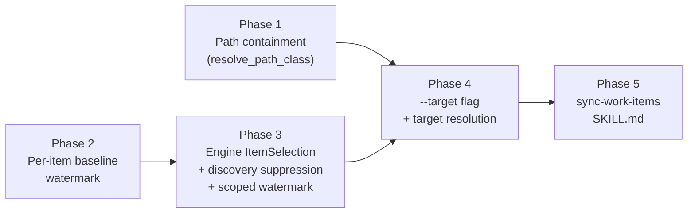

# Sync Specific Work Items Implementation Plan

## Overview

Add a repeatable `--target` option to `accelerator work sync` that reconciles
only named work items — by local id, remote `external_id`, or path — reusing
every per-item full-sync behaviour unchanged and suppressing untracked-remote
discovery. The engine owns the target set; the skill only parses, gates, and
renders.

The change is a set-construction concern at the CLI boundary, not a change to
the sync state machine. The engine already iterates `request.items` for
classification, planning, blast-radius bounds, and every apply loop, so
narrowing that slice scopes the whole per-item pipeline. Three couplings resist
a blanket narrowing and are handled explicitly:

- **Discovery** — its "untracked = remote − local" definition inverts when the
  local set is narrowed. A single `ItemSelection` value drives both the item
  slice and the discovery skip so the two cannot desync.
- **The corpus-wide double-binding guard** (`corpus_carries`) — it must see
  *every* local item's `external_id`, not just the targeted ones, or a targeted
  create-from-local recovery could bind two files to one remote issue. It keeps
  reading the full discovered set.
- **The change-detection watermark** — today a single global baseline timestamp
  gates the mtime short-circuit for the whole corpus, so any run advancing it
  buries the edits of items it did not reconcile. The watermark moves per-item
  so a narrowed run only advances the items it actually reconciled.

## Current State Analysis

- **The working set is always the whole work directory.** `discover_items`
  (`cli/work-cli/src/sync.rs:96-132`) reads every `*.md`, builds
  `Vec<LocalItem>`, and flows it unfiltered into `SyncRequest.items`
  (`sync.rs:466-467`). There is no subset notion anywhere. `SyncArgs`
  (`cli/work-cli/src/cli.rs:254-283`) has no target field.
- **The engine is already parameterised on `request.items`.** `fetch::gather`,
  `plan_inputs`, the blast-radius gate (`run.rs:741-752`), `ItemIndex`, and all
  three apply loops read exactly that slice. A smaller slice scopes them with no
  domain change.
- **Discovery inverts under a narrowed set.** `discover_untracked`
  (`run.rs:415-436`) keeps remote ids not present among the local items'
  `external_id`s. Shrinking `items` without gating discovery re-imports every
  non-targeted item as untracked. Discovery is a separable step: `PushOnly`
  already skips it at `run.rs:707-709` and returns `SkippedPushOnly`.
- **The change-detection watermark is global.** `finalise_run`
  (`baseline_store.rs:92-111`) advances a single document-level `timestamp` to
  the run-start epoch on every run; `classify` short-circuits a file as
  unchanged when `mtime <= baseline_timestamp` (`classify.rs:69-70`), fed from
  `loaded_baseline.timestamp()` (`run.rs:692`). A run that advances this shared
  watermark buries the mtime of any item it did not reconcile, so a later run
  classifies that item's edit as absent. The `Entry` (`baseline.rs:12-17`)
  carries only remote/local hashes and a remote stamp — no per-item mtime
  watermark.
- **`corpus_carries` is a second whole-corpus read.** It scans `request.items`
  (`run.rs:831-836`) to stop a recovered `Created` marker binding two local
  files to one remote issue. Narrowing this read to the targeted subset makes an
  `external_id` carried by a non-targeted file invisible to the guard.
- **Resolution is an in-process call, not a subprocess.** `run_sync` and
  `resolve::run` (`cli/work-cli/src/resolve.rs:42-46`) live in the same crate;
  `run_sync` calls `resolve::run` directly. `run` resolves one `input` at a time
  and returns `RunOutcome::{Resolved, Ambiguous, NotFound, Invalid}`.
- **The Path resolve class trusts any existing file.** `resolve_path_class`
  (`resolve.rs:31-37`) joins the input onto the cwd, canonicalises, and accepts
  any `is_file`, with no work-directory containment check and no negative test.
- **`run_sync` resolves the tracker client before building the item set.**
  `registry.resolve(&integration)` (`sync.rs:393-410`) can exit 74 (missing
  credentials) before `discover_items` runs, so any validation placed after it
  is unreachable on a credential-less machine.

### Key Discoveries

- The reusable flag model is `--tag` → `Vec<String>` (`cli.rs:140-141`); the
  fail-fast validation model is `parse_resolutions` (`sync.rs:134-157`).
- The canonical match key for `external_id` is `canonical_external_key`
  (`cli/work-adapters/src/sync/create.rs:114-120`): whitespace-stripped,
  upper-cased, so `" eng - 12 "` and `"ENG-12"` fold together.
- Input classification is `classify_input` (`cli/work/src/resolve.rs:171-198`)
  → `Path` / `FullId` / `BareNumber` / `Invalid`. Under a `{project}-{number}`
  scheme a remote id like `PP-787` classifies as `FullId`; under a numeric
  scheme it classifies as `Invalid`. Both cases must reach the `external_id`
  lookup, which is why local resolution falling to `NotFound`/`Invalid` cascades
  to the remote lookup while `Ambiguous` does not.
- The discovery report line is emitted by `discovery_line` (`sync.rs:178-190`)
  from `DiscoveryStatus` (`run.rs:134-144`). The golden fixture is
  `cli/work-cli/tests/fixtures/sync-report.golden` (uses `Ran`, so the new
  targeted arm does not touch it).
- The three `resolve::run` callers that branch on exit codes are
  `create-work-item` (`SKILL.md:98`), `update-work-item` (`SKILL.md:60`), and
  `review-work-item` (`SKILL.md:62`), each handling Exit 3 by offering
  `/list-work-items`.
- `SyncRequest` is constructed at one production site (`sync.rs:466`) and four
  test sites (`sync_run.rs:256` via a `request()` builder, `sync_create.rs` ×2,
  `sync_run_real_client.rs` ×1).
- Neither `work-adapters` nor `work-cli` has a `public-api.txt` snapshot, so
  adding `ItemSelection` and changing `resolve_path_class`'s signature needs no
  public-api regen. The `work` domain resolver signatures do not change.

## Desired End State

`accelerator work sync --target <id|external-id|path>` (repeatable) reconciles
exactly the named items, bidirectionally by default, with per-item report lines
and write set byte-identical to a full sync over the same fixture (run-level
lines excepted). Untracked discovery does not run; the report's discovery line
reads `#\tdiscovery\tskipped\ttargeted`. A targeted run advances the
change-detection watermark only for the items it reconciled, so a non-targeted
item edited beforehand is still detected as locally changed by a later full
sync. A token that fails to resolve across both the local-id and remote-id
spaces exits 3 (`RESOLVE_NOT_FOUND`); a path outside the work directory exits 6
(`RESOLVE_OUTSIDE_WORKDIR`); a genuinely malformed invocation exits 2 (`USAGE`).
Every such failure aborts the run before any side effect, naming every offender,
with zero writes. A token that is both a valid local-id shape and a match for
some `external_id` resolves to the local item and reports the remote match as
suppressed. With no `--target`, behaviour is unchanged.

Verify by: the full `mise run` default task exits 0; the new fake-tracker lib
tests prove narrowing and discovery suppression; the new CLI integration tests
prove credential-independent aborts; a manual `--target` run against the
configured Linear tracker reconciles only the named item.

## What We're NOT Doing

- Not pulling brand-new remote-only issues by target. A targeted pull reaches
  only items already tracked locally; a remote-only issue with no local
  counterpart remains the job of a full sync (discovery is suppressed).
- Not changing the domain decision logic (`classify` / `decide` / `plan`) or any
  per-item behaviour (conflict dossiers, dirty guard, bounds, create-from-local
  write-back). These are reused unchanged. The one deliberate exception is the
  change-detection *watermark*: it moves from a single global timestamp to a
  per-item value (Phase 2) so a narrowed run can advance only the items it
  reconciled (Phase 3). The decision semantics are unchanged — only which
  watermark gates each item.
- Not changing full-sync (no-target) reconciliation behaviour, its report, or its
  item write set. The baseline document gains an additive per-item
  `local_synced_at` field, but a full sync advances every entry's watermark
  together, so its gating is identical to the global scheme.
- Not adding a batch resolve entry point to the `work` domain crate. The
  collect-all loop lives in `work-cli`; the domain crate is touched only if a
  reason to unit-test that loop inside `work` emerges (it does not here).
- Not adding `--target` to any other subcommand.
- Not special-casing unlinked or remote-absent targets: the existing full-sync
  semantics handle them.

## Implementation Approach

Five independently mergeable phases, each leaving `main` green:



Phases 1 and 2 are independent of each other and each merges alone with no
user-visible feature. Phase 1 hardens the resolver. Phase 2 moves the
change-detection watermark from a single global timestamp to a per-item value
and is behaviour-preserving: a full sync advances every present item's watermark
to the run-start epoch, exactly as the global timestamp did, so it merges alone
with no observable change. Phase 3's engine accepts a selection that `run_sync`
always sets to `All`, and scopes the watermark advance to the selection — under
`All` that is still every item, so it too merges alone. Phase 4 is the
integrative feature; Phase 5 is the thin skill surface. Each phase is
test-driven: red (failing test) → green (minimum code) → refactor.

---

## Phase 1: Work-directory containment for the Path resolve class

### Overview

Reject a path target that resolves outside the work directory, with a distinct
outcome and exit code, so the containment is structural for every `resolve::run`
caller. This is a standalone hardening change; the three skill callers gain a
branch for the new code.

### Changes Required

#### 1. A distinct out-of-directory outcome

**File**: `cli/work-cli/src/resolve.rs`
**Changes**: Add a `RunOutcome::OutsideWorkDir` variant; thread the work
directory into `resolve_path_class`; canonicalise both sides and reject a
candidate that does not live under the work directory before the `is_file`
check. A work directory that cannot itself be canonicalised is an environment
fault, not a missing item, so `run` surfaces it through the `Result` `Err`
channel (exit 1, internal error) — **not** as `NotFound`/exit 3, which
`create-work-item` treats as "interpret the argument as a topic string" and would
act on. Update the `RunOutcome` doc comment to name every variant and its
exit-code mapping, including `OutsideWorkDir → 6`.

```rust
pub enum RunOutcome {
    Resolved(PathBuf),
    Ambiguous(Vec<TaggedCandidate>),
    NotFound(String),
    Invalid(String),
    OutsideWorkDir(String),
}

// root is the already-canonicalised work directory (run resolved it once).
fn resolve_path_class(root: &Path, start: &Path, input: &str) -> RunOutcome {
    let candidate = start.join(input);
    let Ok(resolved) = candidate.canonicalize() else {
        return RunOutcome::NotFound(format!("no work item at path '{input}'"));
    };
    if !resolved.starts_with(root) {
        return RunOutcome::OutsideWorkDir(format!(
            "path '{input}' is outside the work directory {}",
            root.display()
        ));
    }
    if resolved.is_file() {
        RunOutcome::Resolved(resolved)
    } else {
        RunOutcome::NotFound(format!("no work item at path '{input}'"))
    }
}
```

`run` computes `work_dir` once ahead of the `classify_input` match, canonicalises
it, and maps a canonicalisation failure to `Err(kernel::Error)` (exit 1) before
dispatching — so both the `Path` and the `FullId`/`BareNumber` arms share one
canonical root. The canonicalised `resolved` path becomes the `Resolved` payload,
so Phase 4 can match it against the equally-canonicalised managed-item set.

#### 2. Exit-code taxonomy

**File**: `cli/work-cli/src/exit_codes.rs`
**Changes**: Add `RESOLVE_OUTSIDE_WORKDIR = 6` (the next free process-band code)
with a doc line stating the file exists but lies outside the managed work
directory. Widen the module doc's band header from "Process and selection codes
(`0`–`5`)" to "(`0`–`6`)" and add the `6 RESOLVE_OUTSIDE_WORKDIR` bullet inside
that band's list, so the authoritative taxonomy does not misrepresent its own
range.

#### 3. Binary mapping

**File**: `cli/work-cli/src/main.rs`
**Changes**: Map `RunOutcome::OutsideWorkDir(message)` in `run_resolve` to
`eprintln!("E_RESOLVE_OUTSIDE_WORKDIR: {message}")` and
`ExitCode::from(exit_codes::RESOLVE_OUTSIDE_WORKDIR)`.

#### 4. Skill callers

**Files**: `skills/work/create-work-item/SKILL.md`,
`skills/work/update-work-item/SKILL.md`,
`skills/work/review-work-item/SKILL.md`
**Changes**: Add an **Exit 6** branch beside each existing Exit 3 branch,
stating the referenced file is outside the work directory. The three callers do
**not** share one Exit-3 treatment, so specify the Exit-6 wording per skill
rather than blanket-mirroring Exit 3: `update-work-item` (`SKILL.md:60`) and
`review-work-item` (`SKILL.md:62`) stop and offer `/list-work-items`, so their
Exit-6 branch does the same; `create-work-item` (`SKILL.md:98`) treats Exit 3 as
"interpret the argument as a topic string" and proceeds — for Exit 6 it must
instead **stop** (a real path outside the work directory is not a topic string)
and offer `/list-work-items`. Confirm the two stop-and-offer callers before
assuming symmetry.

### Success Criteria

#### Automated Verification

- [ ] New negative test — a real `.md` outside `meta/work` resolves to exit 6
      with `E_RESOLVE_OUTSIDE_WORKDIR` on stderr:
      `cargo test -p work-cli --test cli_resolve`
- [ ] New negative test — a traversal path (`meta/work/../secret.md`) pointing
      outside the work dir exits 6.
- [ ] Existing Path/FullId/BareNumber/Invalid resolve tests still pass
      unchanged: `cargo test -p work-cli --test cli_resolve`
- [ ] `cli` component check passes: `mise run cli:check`
- [ ] Skills lint passes: `mise run check`

#### Manual Verification

- [ ] `accelerator work resolve ../README.md` from `meta/work` prints a clear
      "outside the work directory" error and exits 6.
- [ ] A `create-work-item`/`update-work-item`/`review-work-item` invocation with
      an out-of-dir path prints the new message and offers `/list-work-items`.

---

## Phase 2: Per-item baseline watermark

### Overview

Move the change-detection watermark from a single document-level timestamp to a
per-item value, so a run can advance the watermark only for the items it
reconciled without burying the edits of items it did not. This phase is
behaviour-preserving — a full sync advances every present item's watermark to the
run-start epoch, exactly as the global timestamp did — so it merges alone with no
observable change. It is the prerequisite that makes targeting safe; Phase 3
scopes the advance to the selection.

### Changes Required

#### 1. A per-item watermark on the baseline entry

**File**: `cli/work-adapters/src/sync/baseline.rs`
**Changes**: Add `local_synced_at: u64` to `Entry`. Serialise it in
`render_entry` and read it in `parse_entry`. A missing **or non-integer** field
reads as the document-level `timestamp`, not `0` and never a raw untrusted value,
so an old baseline written before this phase gates each existing entry exactly as
it did before (the read-time backfill) and a corrupt or future-written value
cannot bury an edit — mirroring the existing `timestamp` tolerance
(`baseline.rs:122-123`). The document `timestamp` is retained as the fallback
watermark for items that have no entry yet.

The document `timestamp` is parsed before `items` (`baseline.rs:122-137`), so it
is available to backfill each entry as the items map is built. The hand-built
`render` (compact, `timestamp` before `items`, no `serde_json::Value`) gains the
new field inside each entry object; the ordering constraint that `project_remote`
depends on is unaffected because entries are rendered by hand.

#### 2. Per-item gating in `classify`

**Files**: `cli/work/src/sync/classify.rs`, `cli/work-adapters/src/sync/fetch.rs`
**Changes**: The mtime short-circuit (`classify.rs:69-70`) compares against the
item's own watermark: an item with a baseline entry uses that entry's
`local_synced_at`; an item with no entry falls back to the document `timestamp`.
`fetch::gather` (`fetch.rs:80-113`) sources the per-item watermark from the
loaded baseline rather than passing one global `baseline_timestamp` for every
subject.

#### 3. Advancing the watermark on finalise

**File**: `cli/work-adapters/src/sync/baseline_store.rs`
**Changes**: `finalise_run` sets `local_synced_at = run_start_epoch` on every
present entry (behaviour-preserving: a full sync advances all of them together),
and continues to advance the document `timestamp`. The blank-conflict step is
unchanged. Phase 3 narrows both advances to the selection.

### Success Criteria

#### Automated Verification

- [ ] New unit test — an `Entry` round-trips its `local_synced_at` through
      `render`/`read`: `cargo test -p work-adapters --lib`
- [ ] New unit test — an old baseline (entry with no `local_synced_at`) backfills
      each entry's watermark from the document `timestamp` on read, so gating is
      unchanged.
- [ ] New unit test — a present-but-non-integer `local_synced_at` reads back as
      the document `timestamp`, never a raw value, so a corrupt watermark cannot
      bury an edit.
- [ ] New unit test — a no-entry item falls back to the document `timestamp` for
      its mtime gate.
- [ ] New lib test — after a full sync, every present entry's `local_synced_at`
      equals the run-start epoch (behaviour parity with the old global advance):
      `cargo test -p work-adapters --test sync_run`
- [ ] `sync-report.golden` is unchanged; the golden test passes.
- [ ] Component check passes: `mise run cli:check`

#### Manual Verification

- [ ] A full-sync run against the configured tracker produces the same report and
      the same re-hash behaviour as before this phase.

---

## Phase 3: Engine `ItemSelection` and discovery suppression

### Overview

Give the engine a single value that both scopes the item slice and gates
discovery, so a narrowed set can never re-import non-targeted items. It also
scopes the watermark advance to the selection and keeps the `corpus_carries`
double-binding guard reading the full corpus. `run_sync` continues to pass the
whole set (`All`), so this phase ships no user-visible change and merges alone.

### Changes Required

#### 1. The selection enum and its use in the request

**File**: `cli/work-adapters/src/sync/run.rs`
**Changes**: Add `ItemSelection`; replace `SyncRequest.items` with a `selection`
plus a full-corpus slice; route reconciliation reads through
`request.reconciled()` while whole-corpus reads keep `request.corpus`.

```rust
pub enum ItemSelection<'a> {
    All,
    Targeted(&'a [LocalItem]),
}
```

`SyncRequest.items: &'a [LocalItem]` becomes two fields: `corpus: &'a
[LocalItem]` (the full discovered set, always) and `selection: ItemSelection<'a>`
(the reconciliation scope). `ItemSelection::All` is **payload-free** so `corpus`
is the single source of truth — a construction site cannot desync the two — and
the invariant `reconciled() ⊆ corpus` is structural rather than hand-upheld. The
request exposes two accessors:

```rust
impl<'a> SyncRequest<'a> {
    fn reconciled(&self) -> &'a [LocalItem] {
        match self.selection {
            ItemSelection::All => self.corpus,
            ItemSelection::Targeted(items) => items,
        }
    }
    fn discovery_suppressed(&self) -> bool {
        matches!(self.selection, ItemSelection::Targeted(_))
    }
}
```

- **Reconciliation reads** — `fetch::gather`, the `digests` map, `plan_inputs`,
  `ItemIndex::build`, `validate_pushes`, the `Vec::with_capacity`, the apply
  loops, and **`unsynced_creates`** (`run.rs:735-736`, the create-from-local
  feed) — read `request.reconciled()`. `unsynced_creates` must narrow, or a
  non-targeted unsynced draft would be issued as a brand-new remote issue outside
  the named target set.
- **Whole-corpus reads** — `corpus_carries` (`run.rs:831-836`), the double-
  binding guard that stops a recovered `Created` marker binding two files to one
  remote issue, and `discover_untracked` (`run.rs:717`, which computes "untracked
  = remote − local `external_id`s" and needs the full local set) — read
  `request.corpus`. Narrowing either would break its whole-corpus contract;
  `discover_untracked`'s correctness then rests on reading `corpus`, not merely on
  being suppressed under `Targeted`.

#### 2. Discovery gate with targeted precedence

**File**: `cli/work-adapters/src/sync/run.rs`
**Changes**: Add `DiscoveryStatus::SkippedTargeted`; branch on the selection
before the direction, so `Targeted` beats `PushOnly`.

```rust
let (untracked, discovery) = if request.discovery_suppressed() {
    (Vec::new(), DiscoveryStatus::SkippedTargeted)
} else if matches!(request.direction, SyncDirection::PushOnly) {
    (Vec::new(), DiscoveryStatus::SkippedPushOnly)
} else {
    // unchanged: resolve_scope, discover_untracked, incomplete/failed handling
};
```

#### 3. The discovery report line

**File**: `cli/work-cli/src/sync.rs`
**Changes**: Add the `SkippedTargeted` arm to `discovery_line`:

```rust
DiscoveryStatus::SkippedTargeted => {
    "#\tdiscovery\tskipped\ttargeted".to_owned()
}
```

`run_sync` builds `ItemSelection::All` with `corpus: &items` (Phase 4 replaces
the selection).

#### 4. Selection-scoped watermark advance

**File**: `cli/work-adapters/src/sync/baseline_store.rs`, `run.rs`
**Changes**: The engine (`run.rs`), which owns the selection policy, computes the
set of ids to advance and passes them to a **selection-agnostic** `finalise_run`
so the persistence layer never learns the `All`/`Targeted` distinction. Its
signature becomes `finalise_run(blank, advance_ids, document_watermark:
Option<u64>)`: advance `local_synced_at` for exactly `advance_ids`, and advance
the document `timestamp` only when `document_watermark` is `Some` (`Some(epoch)`
under `All`, `None` under `Targeted`).

Advance a watermark only for an item that reached a **definitive reconciled
outcome** — `Synced`/`Applied` with a successful remote read — not for
`Indeterminate` or awaiting-human items. Today `finalise_run` advances every
present item unconditionally (a pre-existing hazard from the global scheme): when
a remote read fails, items are classified `Indeterminate` and left un-applied,
yet their watermark still moves, so a local edit predating the failed run is
buried on the next sync. The per-item redesign is the natural place to close
this. Under `Targeted`, `advance_ids` is therefore the reconciled subset of
`request.reconciled()`, and a non-targeted item's per-item watermark and the
document fallback are both left where the last full sync set them, so a later
full sync still detects its local edit.

#### 5. Construction sites

**Files**: `cli/work-cli/src/sync.rs` (production),
`cli/work-adapters/tests/sync_run.rs`,
`cli/work-adapters/tests/sync_create.rs`,
`cli/work-adapters/tests/sync_run_real_client.rs`
**Changes**: Every `SyncRequest { items, .. }` becomes `selection: ..` plus
`corpus: ..`. The `request()` builder in `sync_run.rs` gains a `selection`
parameter and a `corpus` parameter (or a paired `targeted_request()` that sets
`corpus` to the full fixture set and `selection` to the targeted subset).

#### 6. Test-harness prerequisites

**Files**: `cli/work-adapters/tests/sync_run.rs`, `sync_create.rs`
**Changes**: The watermark tests need capabilities the shared helpers lack.
Parameterise the fixed clock **per run** (today `execute`/`run_sync` hardcode
`FixedClock(1_700_000_000)`) and reuse one persistent `Spy`/baseline across
sequential `run()` calls, so a "run at epoch E1, then E2, then E3 against one
baseline" sequence is expressible. Control item mtimes explicitly via `filetime`
(already a transitive dependency) rather than wall-clock `fs::write`, and seed
baseline entries already carrying `local_synced_at` so an untouched entry's
re-rendered bytes match the seed.

### Success Criteria

#### Automated Verification

- [ ] New lib test — `Targeted([B])` over items `[A, B, C]` reports only `B`;
      the spy's write log contains no entry for `A.md`/`C.md`, and the written
      baseline's `A`/`C` entries equal their loaded-then-rendered form (seed
      entries with `local_synced_at` so the additive field does not spuriously
      byte-differ): `cargo test -p work-adapters --test sync_run`
- [ ] New lib test — `Targeted` bidirectional makes no `search` call
      (`tracker.calls()` contains no `Call::Search`) and reports
      `DiscoveryStatus::SkippedTargeted`.
- [ ] New lib test — `Targeted` + `PushOnly` reports `SkippedTargeted`, not
      `SkippedPushOnly`.
- [ ] New lib test — `B`'s reconciliation result under `Targeted([B])` equals its
      result under `All` over the same fixture. `ReportedItem`/`ItemOutcome`
      derive no `PartialEq` today, so compare through a projection helper
      returning `(id, action, state, rendered outcome)` (or add
      `#[derive(PartialEq, Eq)]` where the wrapped `ApplyError` allows it).
- [ ] New lib test (the watermark regression) — with **deterministic** epochs and
      mtime (`full_sync_epoch < mtime_A <= targeted_epoch`, set via `filetime`, so
      the short-circuit provably fires in the buggy path and not the fixed one): a
      full sync, then a local edit to non-targeted `A`, then a `Targeted([B])`
      sync, then a full sync — the final sync still classifies `A` as locally
      changed.
- [ ] New lib test (read-failure watermark) — a run whose remote read fails leaves
      `Indeterminate` items' watermark unadvanced, so a later full sync still
      detects a pre-existing local edit to such an item.
- [ ] New lib test — a `Targeted([B])` run makes no create-from-local `tracker`
      call for a non-targeted unsynced draft `A` (`tracker.calls()` has no create
      for `A`), proving `unsynced_creates` narrowed.
- [ ] New lib test (the double-binding guard, in `sync_create.rs` — it has the
      `RecordingAuthor` and `Created`-marker seeding `sync_run.rs` lacks) — a
      `Targeted([B])` create-from-local for `B` still sees a non-targeted file
      `A`'s matching `external_id` via `corpus_carries`, so it does not
      double-bind.
- [ ] New render test — `discovery_line(SkippedTargeted)` emits
      `#\tdiscovery\tskipped\ttargeted`: `cargo test -p work-cli --lib`
- [ ] `sync-report.golden` is unchanged (uses `Ran`); the golden test passes.
- [ ] Component checks pass: `mise run cli:check`, `mise run server:check`
      (whichever the workspace-wide `cli` check covers).

#### Manual Verification

- [ ] A full-sync run (no target) against the configured tracker produces the
      same report as before this phase.

---

## Phase 4: `--target` flag and target resolution in `run_sync`

### Overview

Parse the repeatable `--target`, resolve each token to a local item (local-id
and path via `resolve::run`, remote id via an `external_id` index), enforce
local-id-wins precedence and collect-all abort, and build
`ItemSelection::Targeted`. Move target validation ahead of the tracker-client
build so an abort is credential-independent and testable. Target-resolution
failures map onto the resolve process band — no-match exits 3, out-of-dir exits
6 — reserving `USAGE` (2) for genuine flag misuse.

### Changes Required

#### 1. The flag

**File**: `cli/work-cli/src/cli.rs`
**Changes**: Add to `SyncArgs`. Phrase the help around user-facing vocabulary
with concrete examples, keeping `external_id` as a parenthetical:

```rust
/// Reconcile only this work item; repeatable. Accepts a local id
/// (0257), a remote tracker key / external_id (PP-787), or a file
/// path. Naming any target suppresses untracked-remote discovery.
#[arg(long = "target")]
pub targets: Vec<String>,
```

#### 2. Target resolution

**File**: `cli/work-cli/src/sync.rs`
**Changes**: Add `resolve_targets`, returning a named `ResolvedTargets { items,
suppressed }` or a collect-all `Vec<TargetResolutionFailure>`. Model both types
explicitly, mirroring `SelectionError`:

```rust
struct ResolvedTargets {
    items: Vec<LocalItem>,
    suppressed: Vec<Suppressed>,
}

enum TargetResolutionFailure {
    Malformed(String),
    NoMatch(String),
    Unmanaged(String),
    OutsideWorkDir(String),
    AmbiguousLocal(String),
    AmbiguousExternal(String),
}

impl TargetResolutionFailure {
    fn message(&self) -> String { /* names the offending token */ }
    fn exit_code(&self) -> u8 { /* the single source of the code mapping */ }
}
```

`exit_code()` is the sole owner of the code mapping: `Malformed`,
`AmbiguousLocal`, and `AmbiguousExternal` → `USAGE` (2); `NoMatch` and
`Unmanaged` → `RESOLVE_NOT_FOUND` (3); `OutsideWorkDir` →
`RESOLVE_OUTSIDE_WORKDIR` (6). `Malformed` covers an empty or whitespace-only
token: guard for it **before** `classify_input` (which folds `""` to `Invalid`
and would otherwise cascade to a `NoMatch` exit 3, contradicting the "malformed
invocation exits 2" contract).

Precedence and cascade. Build the `external_id` index once as a
`BTreeMap<String, Vec<&LocalItem>>` keyed by
`canonical_external_key(&ExternalId::new(external_id))` over `corpus`
(`canonical_external_key` takes `&ExternalId`, not a raw `&str`, so the token is
wrapped identically at lookup time).

- For each token, `classify_input(token, &scheme)`:
  - `Path` / `FullId` / `BareNumber` → the resolver closure (see below):
    - `Resolved(path)` → match the **canonicalised** `path` to a `LocalItem` by
      comparing against `item.path.canonicalize()` (both sides canonicalised, so a
      symlinked work root such as macOS `/tmp`→`/private/tmp` folds correctly). If
      the token also keys a *different* item in the index, record
      `Suppressed { token, local_id, remote_id }`. A resolved path not among the
      managed items is `Unmanaged` (exit 3).
    - `Ambiguous(_)` → `AmbiguousLocal`; no cascade.
    - `OutsideWorkDir(_)` → `OutsideWorkDir`; no cascade.
    - `NotFound` / `Invalid` → cascade to the remote lookup.
  - `Invalid` → remote lookup only.
- Remote lookup: `canonical_external_key(&ExternalId::new(token))` against the
  index — exactly one → target; zero → `NoMatch` (exit 3); more than one →
  `AmbiguousExternal` (exit 2). The `NoMatch` message for a remote-shaped token
  states the cause plainly — "no local item and no remote-tracked match for
  <token>; untracked remote issues are imported only by a full (untargeted)
  sync" — so a user who sees the id in their tracker is not told it simply "does
  not exist".
- **De-duplicate by resolved `LocalItem` id**, not by raw token: two distinct
  tokens (`0257` and its `external_id` `PP-787`, or a local id plus its own path)
  can resolve to one item, and a duplicate slice entry would plan and apply that
  item twice — including a non-idempotent create-from-local. Collapse after
  resolution on the item id.
- Accumulate all failures; return `Err(failures)` if any (collect-all, unlike
  `parse_resolutions`' first-error return). When several classes coexist, the
  caller exits with the highest-precedence code, ordered `USAGE` (2) > `OUTSIDE`
  (6) > `NOT_FOUND` (3): a malformed or ambiguous invocation is the most
  fundamental thing to fix, so it dominates the summary code, matching the CLI
  convention that usage errors outrank resolution outcomes. Every offender is
  still named on stderr regardless of which code is returned.

Extract the precedence/cascade decision behind a resolver closure
(`Fn(&str) -> RunOutcome`) plus the pre-built index, so the pure logic is
unit-testable without composing a config; the config-backed `resolve::run` path
is covered by the subprocess tests. `resolve::run` is fallible
(`Result<RunOutcome, kernel::Error>`) because it re-reads config, so resolve the
scheme and work directory **once** up front — handling that single `kernel::Error`
as an internal error (exit 1) — and have the closure call an infallible
resolution over the pre-resolved config. The closure's total `Fn(&str) ->
RunOutcome` contract is then honest and a config fault cannot be mistaken for a
per-token resolution failure.

#### 3. `run_sync` ordering and wiring

**File**: `cli/work-cli/src/sync.rs`
**Changes**: Two ordering moves, plus an extracted helper so `run_sync` does not
grow past its existing `#[allow(clippy::too_many_lines)]`.

1. **Relocate the directory resolution.** Today `registry.resolve` (the
   credential check, `sync.rs:393-410`) runs *before* `root`/`work_dir`/
   `integrations_root` are resolved (`sync.rs:412-426`), and `discover_items`
   depends on `work_dir`. Move the `discover_root`/`resolve_work_dir`/
   `integrations_dir` block **above** `registry.resolve`, so `discover_items` and
   target validation can run before any credential contact. A `resolve_work_dir`
   error then surfaces (exit 1) earlier than before — intentional and acceptable.
2. **Validate targets before the credential check**, so an abort is
   credential-independent and testable. On failure, print every offender to
   stderr and return the highest-precedence exit code among the failures (2 > 6 >
   3) — zero writes, before any tracker contact.
3. **Extend the `Sync` variant doc comment** (`cli.rs:96-110`, the runtime-
   discoverable `sync --help` exit-code list) with `3 RESOLVE_NOT_FOUND` and `6
   RESOLVE_OUTSIDE_WORKDIR`, matching the `exit_codes.rs` band widening from Phase
   1 so `--help` names every code the run can return.

Extract the item-set construction into one helper, `build_selection`, returning a
single owned value the `run_sync` scope holds so a `Targeted` borrow outlives
`request` (it cannot live inside a match arm that drops it). `build_selection`
wraps the pure `resolve_targets` resolver: it returns `SelectedTargets { scope,
items, suppressed }` on success — `scope` is `Scope::All` (with empty `items`)
when no `--target` is given, else `Scope::Targeted` with the resolved slice — and
on failure prints every offender and returns the `ExitCode`:

```rust
enum Scope { All, Targeted }
struct SelectedTargets {
    scope: Scope,
    items: Vec<LocalItem>,      // the targeted slice; empty under All
    suppressed: Vec<Suppressed>,
}

let full_items = discover_items(&work_dir);
let selected = match build_selection(&full_items, &args.targets, /* resolver */) {
    Ok(selected) => selected,   // owns items + suppressed; outlives request
    Err(code) => return code,
};
let selection = match selected.scope {
    Scope::All => ItemSelection::All,
    Scope::Targeted => ItemSelection::Targeted(&selected.items),
};
```

`selected.suppressed` feeds the report renderer (see §4); `request` carries
`corpus: &full_items` and `selection`. `registry.resolve(&integration)` and
everything downstream stay as they are.

#### 4. One renderer owns the suppression line

**File**: `cli/work-cli/src/sync.rs`
**Changes**: `discovery_line` and the report rendering already live in the CLI
layer alongside `resolve_targets`, so the suppression notes are in hand here — no
engine `RunReport` change is needed. Thread the notes through the same rendering
path rather than emitting them by a raw `println!` ahead of it. Add a pure
formatter (like `discovery_line`) that renders one
`#\ttarget\tsuppressed\t<token>\tlocal=<id>\tremote=<key>` record, passing
`token` and `local_id` through `single_line()` so an embedded tab or newline
cannot forge a fabricated report record (the `remote` key is already whitespace-
stripped by `canonical_external_key`). This keeps all report vocabulary in one
place and gives the line unit-test coverage without a live tracker.

### Success Criteria

#### Automated Verification

- [ ] New subprocess test — `--target 9999` (no local or remote match) exits 3
      (`RESOLVE_NOT_FOUND`), names `9999` on stderr, and writes nothing under
      `meta/work` **or** the integrations root (baseline byte-unchanged or
      absent): `cargo test -p work-cli --test cli_sync_targets`
- [ ] New subprocess test — `--target <path outside work dir>` (a real file)
      exits 6 (`RESOLVE_OUTSIDE_WORKDIR`), names the path, zero writes.
- [ ] New subprocess test — a real `.md` inside the work dir that is not a
      discovered work item exits 3 (`Unmanaged`), zero writes.
- [ ] New subprocess test — an empty `--target ''` token is rejected as a clear
      usage error (exit 2), not a panic.
- [ ] New subprocess test — a no-match token and an out-of-dir path together exit
      6 (the highest-precedence code), stderr names both offenders (collect-all).
- [ ] New subprocess test — a valid `--target` on a credential-less machine
      reaches the tracker phase (exits 74 for `jira`, not a resolution code),
      proving resolution succeeded before the credential check, and the baseline
      is byte-unchanged.
- [ ] New unit tests for the resolution closure — every arm of the
      precedence/cascade table: local-id-wins with a suppression note; ambiguous
      local id fails without cascading; `OutsideWorkDir` fails without cascading;
      a remote-id token matches via the index; a dual-shape token records
      suppression; a no-match token fails; two tokens naming one item de-duplicate
      to a single slice entry; collect-all accumulates every failure:
      `cargo test -p work-cli --lib`
- [ ] New unit test — the suppression-line formatter emits
      `#\ttarget\tsuppressed\t<token>\tlocal=<id>\tremote=<key>` and collapses a
      tab/newline in `token`/`local_id` via `single_line()`.
- [ ] `sync --help` names every exit code, now including 3 and 6:
      `cargo test -p work-cli --test cli_sync`
- [ ] Component check passes: `mise run cli:check`

#### Manual Verification

- [ ] `accelerator work sync --target 0257` against the configured Linear
      tracker reconciles only 0257; the report's discovery line reads
      `skipped\ttargeted`.
- [ ] `--target PP-787` (a remote id) reconciles the item whose `external_id`
      is `PP-787`.
- [ ] `--target PP-999` (a real remote issue with no local counterpart) aborts
      with a message that names the "untracked locally — run a full sync to
      import it" cause, not a bare "no match".
- [ ] A dual-shape token prints a `#\ttarget\tsuppressed` line and reconciles
      the local-id item.

---

## Phase 5: `sync-work-items` skill surface

### Overview

Expose `--target` through the skill as a parsing and rendering change only; the
engine owns the set. No new skill logic.

### Changes Required

#### 1. Argument hint and parsing

**File**: `skills/work/sync-work-items/SKILL.md`
**Changes**: Add `[--target <id|external-id|path>]…` to `argument-hint`.
Document `--target` under Step 1: repeatable; accepts a local id, a remote
`external_id`, or a path; local-id-wins on a dual-shape token; naming any target
suppresses discovery. Abort exit codes and their recovery:

- **3** (`RESOLVE_NOT_FOUND`) — a token matched no local id, path, or
  `external_id`. Offer `/list-work-items` to find the right value.
- **6** (`RESOLVE_OUTSIDE_WORKDIR`) — a path outside the work directory. Offer
  `/list-work-items`.
- **2** (`USAGE`) — a malformed token (empty/blank) **or an ambiguous match**.
  For ambiguity, mirror the sibling resolve callers: list the candidates and ask
  the user to re-run with a full id or path, rather than treating it as a flat
  "malformed invocation".

Every abort names its offenders and writes nothing.

#### 2. Rendering notes

**File**: `skills/work/sync-work-items/SKILL.md`
**Changes**: Under Step 2, note the `#\tdiscovery\tskipped\ttargeted` line as a
fourth discovery outcome (Step 2 currently enumerates only ran / skipped-push-
only / failed), and add codes 3/6/2 to the Step 2 "Exit codes:" list (or point it
at the Step 1 target-abort codes) so the skill's two exit-code surfaces do not
disagree. Under Step 5, add named rows to the summary template with exact human
phrasing so the machine TSV tokens never leak verbatim:

- Targeted discovery: "Discovery skipped: targeted run over N item(s)".
- Suppressed remote match: "Suppressed remote match: <token> resolved to local
  <id>; remote <key> ignored".

Pass both through; do not reinterpret.

### Success Criteria

#### Automated Verification

- [ ] Skills lint and the full read-only set pass: `mise run check`
- [ ] The `argument-hint` and body parse cleanly (frontmatter valid).

#### Manual Verification

- [ ] `/sync-work-items --target 0257` invokes the engine with the flag and
      renders the targeted report, including the discovery-skipped line.
- [ ] `/sync-work-items --target <bad>` surfaces the abort and offenders without
      any write.

---

## Testing Strategy

### Unit Tests

- The resolution closure (Phase 4): every arm of the precedence/cascade table —
  local-id-wins, dual-shape suppression, ambiguous-local-no-cascade,
  `OutsideWorkDir`-no-cascade, remote-id match, no-match failure, empty/blank
  token → `Malformed` (exit 2), resolve-by-two-shapes de-dup, collect-all
  accumulation with the `USAGE` > `OUTSIDE` > `NOT_FOUND` precedence.
- The suppression-line formatter and `discovery_line(SkippedTargeted)` rendering
  (Phase 4 / Phase 3).
- Per-item watermark (Phase 2): `Entry` round-trips `local_synced_at`; an old
  baseline backfills each entry's watermark from the document `timestamp`; a
  no-entry item falls back to the document `timestamp`.
- `resolve_path_class` containment (Phase 1) — exercised at the CLI boundary in
  `cli_resolve.rs` (adapter/binary boundary, per the suite's convention).

### Integration Tests

- Fake-tracker lib tests (Phase 3): narrowing, discovery suppression,
  targeted-beats-push-only, per-item result parity with a full sync, untouched
  non-targeted baseline, the **watermark regression** (deterministic epochs/mtime
  via `filetime`), the **read-failure watermark** (an `Indeterminate` item's
  watermark stays put), and `unsynced_creates` narrowing live in `sync_run.rs`.
  The **double-binding guard** lives in `sync_create.rs`, which already has the
  `RecordingAuthor` and `Created`-marker seeding the scenario needs. This is where
  the "only that item reconciled" and "identical to a full sync" acceptance
  criteria are proven, because the subprocess suite cannot inject a tracker. The
  shared harness first gains a per-run clock and a persistent baseline across
  sequential runs (Phase 3 §6).
- Subprocess CLI tests (`cli_sync_targets.rs`, Phase 4): credential-independent
  aborts with the correct resolution exit codes (3/6/2), and the "resolution
  precedes the credential check" ordering.

### Per-item comparison

For each "as in a full sync" acceptance criterion, assert the targeted run's
per-item result equals the full-sync run's over the same fixture, excluding
run-level lines (notably the discovery line, which legitimately reads `skipped`
for a targeted run). `ReportedItem`/`ItemOutcome` derive no `PartialEq` today, so
compare through a projection helper returning `(id, action, state, rendered
outcome)`, or add the derive where the wrapped `ApplyError` permits it — Phase 3
schedules whichever is chosen.

### Manual Testing Steps

1. `accelerator work sync --preview --target 0257` — plan shown, no writes.
2. `--target 0257 --push-only` — only the push direction applies to 0257.
3. `--target <remote-id>` — the matching local item reconciles.
4. A dual-shape token — local item reconciles, suppression line printed.
5. An unresolvable target (exit 3) and an out-of-dir path (exit 6) — both abort,
   zero writes.
6. Full sync → edit a non-targeted item → targeted sync of another → full sync —
   the non-targeted edit is still detected (the watermark regression, by hand).

## Performance Considerations

Targeting shrinks the working set, so a targeted run does strictly less work
than a full sync: fewer remote reads, no discovery `search`, and blast-radius
bounds that naturally see only the named items (`--max-pulls`/`--max-pushes`
stay applicable but are small). The `external_id` index is one pass over the
already-read local items.

## Migration Notes

The baseline document gains a per-item `local_synced_at` field on each entry
(Phase 2). The change is **forward- and backward-compatible without a migration
step**: an old baseline written before this phase has no per-item field, and the
read backfills each entry's watermark from the existing document-level
`timestamp`, preserving its exact gating; new writes emit the per-item field. A
baseline written by the new code and then read by an older binary degrades
safely — the unknown field is ignored and the document `timestamp` still gates —
so no destructive migration and no `migrate` step is required. The new exit codes
3/6 for target failures and the new discovery and target-suppression report lines
are additive. Full-sync behaviour is unchanged.

## References

- Work item: `meta/work/0257-sync-specific-work-items.md`
- Research: `meta/research/codebase/2026-09-06-0257-sync-specific-work-items.md`
- Sync engine plan (byte-identical target): `meta/plans/2026-08-13-0194-tracker-crate-and-remote-sync-engine.md`
- Item-set seam: `cli/work-cli/src/sync.rs:96-132`, `:362-477`
- Discovery gate: `cli/work-adapters/src/sync/run.rs:707-734`
- Change-detection watermark: `cli/work-adapters/src/sync/baseline.rs:12-17`,
  `baseline_store.rs:92-111`, `cli/work/src/sync/classify.rs:69-70`,
  `cli/work-adapters/src/sync/run.rs:692`
- Double-binding guard: `cli/work-adapters/src/sync/run.rs:831-836`
- Path containment gap: `cli/work-cli/src/resolve.rs:31-37`
- Repeatable-flag / key-value models: `cli/work-cli/src/cli.rs:113-118`, `:140-141`, `:267-271`
- Canonical external key: `cli/work-adapters/src/sync/create.rs:114-120`
