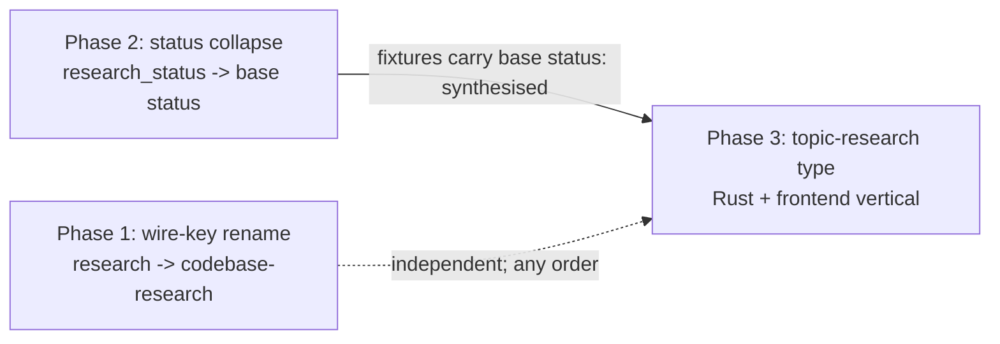

# Topic-Research Visualiser Doc Type and Indexer Implementation Plan

## Overview

Register an umbrella `topic-research` document type in the visualiser so each
research set under `meta/research/topics/<slug>/` surfaces as one library card
that opens to its `manifest.md`; rename the existing `research` doc type's wire
token to `codebase-research`; and collapse the manifest's `research_status`
field onto its base `status` so the card reports real lifecycle progress. The
work lands as three independently-mergeable phases that co-land with the 0277
engine so the vertical demo — build a set, browse it — arrives whole.

## Current State Analysis

The three pillars each map onto a proven precedent, verified against the working
tree at revision `68707d33`:

- **New umbrella type.** `DesignInventories` is a working nested-manifest doc
  type: `nested_manifest_filename() → Some("inventory.md")` (`doc_type.rs:162`)
  alone flips both the `file_driver.rs` `list` enumeration (`243-322`) and the
  `indexer.rs` `build_entry` slug/title derivation (`1247-1371`). 0277 has
  already landed the scaffolding — `paths.research_topics`
  (`catalogue.rs:64-67`), the five `topic-research-*` template keys, and five
  `(topic-research, kind)` schema rows (`schema.rs:189-239`).
- **Wire-key rename.** `Research` already carries
  `linkage_type_name() → "codebase-research"` (`doc_type.rs:78`) and
  `config_path_key() → "research_codebase"` (`doc_type.rs:53`); only
  `wire_str() → "research"` (`doc_type.rs:173`) still holds the bare token. The
  `m0004` migration moved everything else, so the rename persists nothing.
- **Status collapse.** The server reads only the literal `status` key
  (`indexer.rs:78-84`); nothing reads `research_status`. The manifest schema row
  pins `status_vocab: &["complete"]` and lists `research_status` in `extras`
  (`schema.rs:189-203`), so a manifest is `complete` from birth — every card
  would read "complete" until the collapse.

Two facts reshape the naive edit list. The `humanise_slug` fallback title-cases
every hyphen segment (`slug.rs:160-167`, pinned at `:415`), so AC-6's
sentence-case expectation is wrong and is corrected here. And the new type's
subject directories (`model-context-protocol/`) are not date-prefixed, so the
existing `strip_prefix_date_and_optional_id` slug arm returns `None` — the type
needs its own identity arm.

## Desired End State

After all three phases land and `mise run` exits 0 end-to-end:

- The library's Discover phase lists **Topic research** (new) and **Codebase
  research** (renamed from "Research"), each with its glyph and framed
  background. A topic-research card opens its `manifest.md` through the shared
  `LibraryDocView`.
- Each `meta/research/topics/<slug>/` directory yields exactly one card keyed on
  `manifest.md`; sub-documents (`findings/`, `reports/`) and dot-prefixed
  in-flight directories are not indexed. The card's status chip shows the base
  `status` lifecycle value (e.g. `synthesised`), not "complete".
- The `research` doc type's wire token is `codebase-research` end-to-end. The
  route `/library/codebase-research/<slug>` resolves; `/library/research/...`
  no longer validates. The Rust variant identifier stays `Research`, so the
  **rename** shifts no `cargo-public-api` entry. Adding the `TopicResearch` variant
  (Phase 3) does shift it — `DocTypeKey::all()` becomes 15 and the golden is
  regenerated.
- No `accelerator migrate` migration ships. On-disk `type: codebase-research`
  documents, the `meta/research/codebase/` directory, and the config key
  `research_codebase` are untouched. A one-shot `localStorage` rewrite carries
  each viewer's last-seen state across the rename.

### Key Discoveries

- **Count arithmetic** — `DocTypeKey::all()` is `[Self; 14]` and its
  exhaustiveness test asserts 14 (`doc_type.rs:28,244`); `DOC_TYPES` is 13
  (`catalogue.rs:275`); `api_types.rs` asserts 14. The new variant takes these
  to 15/15/14. The work item's "unchanged (14)" is scoped to the rename alone.
- **Predicate mirror** — `TopicResearch` mirrors every `DesignInventories`
  boolean: `in_lifecycle` true; `carries_target_frontmatter`,
  `participates_in_lifecycle`, `in_kanban`, `is_virtual` all false
  (`doc_type.rs:120-165`). Only `nested_manifest_filename()` differs →
  `Some("manifest.md")`.
- **Slug identity arm** — nested manifests derive their slug from
  `<parent-dir>.md` (`indexer.rs:1260-1267`), then `slug::derive`. The new type
  needs an arm returning the directory name verbatim; the date-stripping arm
  yields `None` for a bare subject name.
- **Chip fills** — stock variants fill at `color-mix(accent 8%, --ac-bg)`
  (`Chip.module.css:33-52`), **except** `indigo`, which fills from the named
  `--ac-accent-faint` token; `statusToVariant` never emits `violet` today (its
  `__SETS_FOR_TEST` is `[GREEN, INDIGO, AMBER, RED]`) and is doc-type-agnostic
  (the card renderer `LibraryTypeView.tsx:286` calls it with only the status
  word). So the lifecycle chips use a dedicated ordinal scale on a **non-green**
  hue with its own graded fill tokens (Phase 3, change 6), selected by a
  doc-type-aware branch so no other doc type's chips change — not a raise of the
  shared mix (which would miss `indigo`) and not a green ramp (which would collide
  with the app-wide `green` = done tone).
- **`research_status` surface is five files** — `schema.rs:195`,
  `templates-schema.tsv:15`,
  `skills/research/research-topic/SKILL.md:67,68,100,117,159,174`,
  `cli/corpus-cli/tests/fixtures/topic-research-set/manifest.md:11`, and
  `templates/topic-research-manifest.md:11` (the template's lines 8/35 are the
  base `status` value and the body "Research status" line — related edits, not the
  `research_status` literal).
- **Nine work-item gaps** the research names all fold in below:
  `templates-schema.tsv`, `NON_CANONICAL_PER_KIND`, `slug.rs`,
  `DevDesignSystem.tsx`, the `global.test.ts` ref-counts and `stageKeys`,
  `Glyph.module.css` selector, and the VR `-visual-regression` filename suffix.

## What We're NOT Doing

- **No `primary`-pointer resolution and no set-level navigation** — the card
  opens `manifest.md` flat through `LibraryDocView`; sub-document navigation is
  0284.
- **No `report` schema row** — deferred to 0281. The fixture's `reports/<slug>.md`
  is indexed-invisible (only `manifest.md` is walked) and no validation gate
  runs over the visualiser fixtures, so it is harmless.
- **No re-derivation of the `research` accent** — the rename keeps hue 28 and
  only moves the token's key. The gap analysis's `rgb(188,107,36)` re-colour is
  separate token-convergence work.
- **No `accelerator migrate` migration, directory move, or frontmatter rewrite**
  — the rename is a wire-token change only.
- **No prototype-label realignment** — the schema vocab `researching`/`complete`
  is kept over the prototype's `gathering`/`monitoring`.
- **No top-bar chrome, global search, external-edit toast, kanban reshape,
  lifecycle hexchain, typed-doc-viewer, or routing convergence** — each is a
  separate design-convergence work item.

## Implementation Approach

Three phases, each green on `mise run` alone. They share edit sites
(`doc_type.rs`, `types.ts`, `tokens.ts`, `parity.rs`, `global.css`), so they are
sequenced, not developed in parallel.



⚠️ Phase 3 must land after Phase 2, but the enforcing fixtures are the
schema-validated ones — the corpus-cli fixture and any real
`meta/research/topics/` set the dangling-reference check needs — which carry
`status: synthesised` that the pre-collapse `status_vocab: &["complete"]`
rejects. The visualiser server fixtures are **not** schema-validated
(`this_repositorys_own_corpus_is_clean` walks `<repo-root>/meta/`, not the
fixtures dir), so their `status: synthesised` is not what enforces the order —
and a `kind: report` sub-document is harmless only there, never in a validated
corpus set. Phase 1 is independent of both. Phase 3 is one cohesive vertical — a
half-registered type (server serves it, frontend cannot render it) breaks the
running visualiser once 0277's sets exist on disk, so Rust registration and
frontend registration land together.

Each phase follows red-green-refactor: the count/parity/coverage tests are
written or bumped to their target first (red), then the production edit makes
them pass (green).

---

## Phase 1: Wire-key rename `research` → `codebase-research`

### Overview

Move the one API/URL surface still carrying the bare token `research` to
`codebase-research`, in lockstep across Rust, the pipeline vocabulary, the
frontend registry and every `Record<DocTypeKey, …>` map key, the key-derived CSS
tokens, the `localStorage` last-seen rewrite, and the 10 renamed VR baselines.
Touches no topic-research code. The Rust variant identifier `Research` stays, so
no call site and no `cargo-public-api` snapshot moves.

### Changes Required

#### 1. Rust wire token and parity pin

**File**: `cli/corpus/src/doc_type.rs`

```rust
Self::Research => "codebase-research",
```

in the `wire_str` match arm (`:173`). `from_wire_str` derives from `wire_str`
and auto-follows. The variant identifier, `config_path_key` (`research_codebase`),
and `linkage_type_name` (`codebase-research`) are unchanged.

**File**: `cli/visualiser/server/tests/parity.rs`

The `doc_type_wire_and_config_keys_are_pinned` row (`:61`) becomes:

```rust
(DocTypeKey::Research, "codebase-research", Some("research_codebase")),
```

Only the wire field moves; the config key stays.

#### 2. Pipeline `completeness.present` vocabulary — lockstep

**File**: `cli/corpus/src/cluster.rs`

`STAGE_PUSH_ORDER` (`:137`) — the present token moves, the completeness closure
stays:

```rust
(|c| c.has_research, "codebase-research"),
```

**File**: `cli/visualiser/server/src/clusters.rs` — the present-order test mirror
(`:502`) moves its `"research".to_string()` to `"codebase-research".to_string()`.

**File**: `cli/visualiser/frontend/src/api/pipeline-step-parity.test.ts` — the
`CANONICAL_PRESENT_ORDER` literal (`:15`) moves `research` → `codebase-research`.
`LIFECYCLE_PIPELINE_STEPS[…].docType` is a `DocTypeKey`, so the two sides of the
`toEqual` move together.

**File**: `cli/visualiser/frontend/src/components/DevDesignSystem/DevDesignSystem.tsx`
— the `hasResearch: has("research")` present-token check (`:732`) moves its
argument to `has("codebase-research")`; the camelCase `hasResearch` field name
stays. Three further sites hard-code `"research"` as a `present`/stage token and
must move too — `dotRow([…, "research", …], …)` (`:757`), `present: [… "research"
…]` (`:964`), and the `completenessFromPresent([…])` call (`:996`). Only `:732` is
compiler-guarded (via `has()`); `:757/:964/:996` are `string[]` and fail silently,
drifting the VR showcases from their baselines if missed.

**File**: `cli/visualiser/frontend/src/routes/lifecycle/cluster-via-label.ts` —
the `case "research":` arm (`:18`) of the switch over `entry.type: DocTypeKey`
moves to `case "codebase-research":`. Left unmoved it is a compile error once the
union changes (TS2678) and, if forced, drops `codebase-research` to the `default`
branch — the wrong lifecycle-cluster attribution, since `Research`
`participates_in_lifecycle`. Its fixture `cluster-via-label.test.ts` (`:14`) moves
its literal `"research"` in lockstep.

#### 3. Frontend registry and every total map key

**File**: `cli/visualiser/frontend/src/api/types.ts`

- `DocTypeKey` union (`:8`): `"research"` → `"codebase-research"`.
- `DOC_TYPE_KEYS` (`:28`): same.
- `DOC_TYPE_LABELS` (`:74`): `research: "Research"` →
  `"codebase-research": "Codebase research"`.
- `DOC_TYPE_LABELS_SINGULAR` (`:94`): `research: "Research"` →
  `"codebase-research": "Codebase research"`.
- `LIFECYCLE_PIPELINE_STEPS` (`:308`): the `hasResearch` step's
  `docType: "research"` → `"codebase-research"`. The `key: "hasResearch"` and
  the `PipelineStepKey` member stay.

**Files**: the remaining total `Record<DocTypeKey, …>` (and
`Record<GlyphDocType, …>`) maps move their `research` key to `codebase-research`,
value unchanged:

| Map | File:line |
|---|---|
| `DOC_TYPE_HUE` (value stays 28) | `styles/tokens.ts:16` |
| `TYPE_COPY` | `routes/library/empty-descriptions.ts:18` |
| `EMPTY_TYPE_PLURALS` | `routes/library/empty-descriptions.ts:94` |
| `DOC_TYPE_TOKEN_KEY` | `components/Glyph/Glyph.constants.ts:30` |
| `DOC_TYPE_COLOR_VAR` | `components/Glyph/Glyph.constants.ts:49` |
| `ICON_COMPONENTS` (component stays) | `components/Glyph/Glyph.tsx:25` |
| `BIG_GLYPHS` (render fn stays) | `components/BigGlyph/BigGlyph.tsx:28` |
| `DETAIL_ROUTE_SLUGS` (slug value stays) | `tests/lib/detail-route-slugs.ts:20` |
| `DETAIL_ROUTE_RENDERS_ARTICLE` | `tests/lib/detail-route-slugs.ts:43` |
| `NON_CANONICAL_PER_KIND` | `components/FrontmatterChips/FrontmatterChips.test.tsx:437` |

In `DOC_TYPE_TOKEN_KEY` and `DOC_TYPE_COLOR_VAR` the token-key *value* also moves
(`ac-doc-research` → `ac-doc-codebase-research`), tracking the CSS token rename in
change 5.

**File**: `cli/visualiser/frontend/src/routes/library/template-tier.ts` —
`STEM_TO_GLYPH` (`:40`) maps a template stem to a `GlyphDocType` *value*. The
*stem key* `research` stays (a separate namespace), but the *glyph value* moves
`research` → `codebase-research`, or `glyphKeyForTemplate("codebase-research")`
resolves to a non-existent glyph (a compile error today, since
`GlyphDocType === DocTypeKey`). `LibraryTemplatesIndex.test.tsx` (`:77,84`) moves
its asserted return value in lockstep. This value-side move is the one the "every
map *key*" sweep misses.

**Value-side references** — two map bodies read a `research` value via dot-access,
so the table's "value unchanged" note is inaccurate for them and both break the
compile (TS2339) on the key rename:

- `routes/library/empty-descriptions.ts:42` — `TYPE_COPY`'s `hue:
  DOC_TYPE_HUE.research` → `DOC_TYPE_HUE["codebase-research"]`.
- `components/Glyph/Glyph.constants.ts:49` — `DOC_TYPE_COLOR_VAR`'s
  `research: var(--${DOC_TYPE_TOKEN_KEY.research})` interpolation →
  `DOC_TYPE_TOKEN_KEY["codebase-research"]`.

#### 4. `localStorage` last-seen continuity

**File**: `cli/visualiser/frontend/src/api/use-unseen-doc-types.ts`

Mirror the `prs → pr-descriptions` one-shot rewrite (`:45-48`), placed in
`parseStored()` before the `isDocTypeKey` filter:

```ts
if ("research" in parsedObj && !("codebase-research" in parsedObj)) {
  parsedObj["codebase-research"] = parsedObj.research;
  delete parsedObj.research;
}
```

Without it the renamed type reads as all-unseen once.

**File**: `cli/visualiser/frontend/src/api/use-unseen-doc-types.test.ts` — add a
`parseStored migration` case mirroring the `prs → pr-descriptions` precedent
already tested here: a stored `research` timestamp survives under the
`codebase-research` key and the old key is deleted; plus an idempotency/no-clobber
case where a store already carrying `codebase-research` is left untouched even
when a stale `research` key is also present. The rename ships with the same
automated coverage as its precedent, not manual verification alone.

#### 5. CSS tokens and selectors

**File**: `cli/visualiser/frontend/src/styles/tokens.ts` — rename the three token
keys across `LIGHT_COLOR_TOKENS` and `DARK_COLOR_TOKENS`, values unchanged:
`ac-doc-research` → `ac-doc-codebase-research`,
`ac-doc-bg-research` → `ac-doc-bg-codebase-research`,
`ac-stage-research` → `ac-stage-codebase-research`.

**File**: `cli/visualiser/frontend/src/styles/global.css` — rename the same three
custom properties in all three theme blocks (`:root`, `[data-theme="dark"]`,
`@media (prefers-color-scheme: dark)`). The `data-doc-type`/`data-stage`
attribute values are the key itself, so `[data-doc-type="research"]` becomes
`[data-doc-type="codebase-research"]`.

**File**: `cli/visualiser/frontend/src/components/Glyph/Glyph.module.css` — the
`.frame[data-doc-type="research"]` selector (`:18`) → `codebase-research`, or the
framed background tint silently drops.

**File**: `cli/visualiser/frontend/src/styles/global.test.ts` — the hard-coded
`stageKeys` list (`:405`) moves its literal `"research"` → `"codebase-research"`.
The `var(--atomic-*)` ref-counts (`:325-327`) are unchanged by a rename (values
identical).

#### 6. Frontend test-fixture sweep for the stage/docType token

Beyond `global.test.ts`, several frontend tests hard-code `research` as a
`data-stage`/`docType` token and break on the rename (runtime
element-not-found, or a compile error where `present` is `DocTypeKey[]`). Sweep
the frontend test tree and move each in lockstep with the wire key:
`Pipeline.test.tsx` (`:50,128,140,171`), `PipelineMini.test.tsx` (`:42`),
`WorkItemCard.test.tsx` (`:117`), `Sidebar.test.tsx`,
`SearchResultsPanel.test.tsx` (the `/library/research/third` path),
`LibraryOverviewHub.test.tsx` (`/library/research`),
`use-unseen-doc-types.test.ts`, and `components/Glyph/Glyph.test.tsx` — which
renders `<Glyph docType="research" …>` (`:64,72`, a TS2322 once the union drops
`research`) and asserts `svg.style.color === "var(--ac-doc-research)"` (`:74`,
which the change-5 token rename breaks). These are distinct from the
deliberately-untouched namespaces (the `research` template stem, the camelCase
`hasResearch` serde field, and the `DETAIL_ROUTE_SLUGS` slug *value*).

#### 7. Visual-regression baselines

Rename the 10 `research-*-visual-regression.png` baselines under
`frontend/tests/visual-regression/__screenshots__/{spec}-snapshots/` to
`codebase-research-*-visual-regression.png` (8 glyph = 4 sizes × 2 themes, 2
big-glyph × themes). Pixels are identical — the specs name files from
`DOC_TYPE_KEYS`. Verify with the pinned Docker harness. Add a cheap in-loop test
that the set of baseline filename stems matches
`DOC_TYPE_KEYS.filter(isPhysicalDocTypeKey)` (virtual keys have no glyph/baseline),
so a stale/missing rename (or a new type's absent baselines) is caught by `mise
run check` rather than only by the out-of-loop Docker VR lane.

### Success Criteria

#### Automated Verification

- [x] Rust workspace check passes: `mise run cli:check`
- [x] Server check passes: `mise run server:check`
- [x] Frontend check passes: `mise run frontend:check`
- [x] The wire round-trip and parity tests pass: `cargo test -p corpus doc_type`
      and `cargo test -p accelerator-visualiser --test parity`
- [x] The cross-language pipeline parity test passes (its `research` token moved
      in lockstep): the `pipeline-step-parity` vitest spec is green under
      `mise run frontend:check`
- [x] Every `research`-token consumer moved — the registry maps,
      `cluster-via-label.ts`, the `template-tier.ts` glyph value, and the swept
      test fixtures — compiles and passes: `mise run frontend:check`
- [x] The `localStorage` `parseStored migration` and idempotency/no-clobber tests
      pass: `mise run frontend:check`
- [x] The baseline-filename↔`DOC_TYPE_KEYS` in-loop assertion passes:
      `mise run check` (pinned to the full `DOC_TYPE_KEYS`, not the physical
      subset — the glyph/big-glyph VR specs iterate every key, `templates`
      included)
- [x] `cargo public-api` shows no diff (variant identifier unchanged): covered by
      `mise run cli:check`
- [x] Full read-only mirror passes: `mise run check`
- [ ] Docker VR compare passes with the renamed baselines:
      `mise run test:e2e:visualiser:docker` (out-of-loop Docker/Linux lane, not
      run locally; baselines renamed with identical pixels)

#### Manual Verification

- [ ] `/library/codebase-research/<slug>` and its detail route resolve; visiting
      `/library/research/...` redirects to `/library` (no longer validates). The
      redirect **drops the slug** — it lands on the library root, not the
      equivalent `codebase-research` document — a deliberate, recorded trade-off
      acceptable for a localhost dev tool with effectively one consumer; no
      slug-preserving alias ships.
- [ ] The Discover sidebar labels the type "Codebase research"; its glyph and
      hue-28 colour are visually unchanged.
- [ ] A viewer whose stored last-seen set contained a `research` entry does not
      see the renamed type surface as newly-unseen after the app reloads.

---

## Phase 2: Collapse `research_status` → base `status`

### Overview

Retire the manifest's separate `research_status` field onto its base `status`,
so the library card (which reads base `status`) reports the real lifecycle value
rather than the from-birth "complete". A schema/producer change only; the
visualiser already reads base `status` generically. Prerequisite for Phase 3's
lifecycle-status fixtures.

### Changes Required

#### 1. Schema row and its TSV mirror

**File**: `cli/corpus/src/frontmatter_validation/schema.rs`

The `(topic-research, manifest)` row (`:189-203`):

```rust
SchemaRow {
    linkage_type: "topic-research",
    kind: "manifest",
    code_state_anchored: false,
    extras: &["slug", "round_count", "finding_count", "primary"],
    status_vocab: &[
        "briefed",
        "outlined",
        "researching",
        "synthesised",
        "complete",
    ],
    forbidden_own_id_keys: &[],
    typed_linkage_keys: &["parent", "relates_to"],
},
```

`research_status` drops from `extras`; `status_vocab` gains the five lifecycle
states. Add `research_status` to `OBSOLETE_LEGACY_KEYS` (`schema.rs:316`,
currently `["ticket", "ticket_id"]`) so a manifest still carrying the retired key
raises `OBSOLETE-LEGACY-KEY` rather than being silently ignored — the validator
has no generic unknown-key check, so without this the collapse is unenforced (a
leftover `research_status` would validate clean). This makes the field's removal a
hard, corpus-wide migration guard. Regenerate the `cargo-public-api` golden
`cli/corpus/tests/fixtures/public-api.txt` (the `OBSOLETE_LEGACY_KEYS: [&str; 2]`
line becomes `[&str; 3]`), or `cli:check` diffs.

**File**: `cli/corpus/src/frontmatter_validation/templates-schema.tsv`

Row 15 must agree column-for-column or `every_row_matches_templates_schema_tsv`
(`schema.rs:405-454`) fails:

```diff
-topic-research-manifest.md	topic-research	manifest	no	slug research_status round_count finding_count primary	complete	-	parent relates_to
+topic-research-manifest.md	topic-research	manifest	no	slug round_count finding_count primary	briefed | outlined | researching | synthesised | complete	-	parent relates_to
```

#### 2. Template

**File**: `templates/topic-research-manifest.md`

- `id: "{filename-stem}"` (`:3`) → the subject slug, so the corpus `(type, id)`
  index keys the manifest as `topic-research:<slug>` (matching the
  `relates_to: ["topic-research:<slug>"]` linkage convention). For a
  `<slug>/manifest.md` path, `{filename-stem}` is always the literal `"manifest"`,
  so every set would otherwise key as `topic-research:manifest` — real cross-set
  references dangle and two real sets collide as `DuplicateId`. 0277's manifest
  writer sets the same `id: <slug>` (tracked as a co-land checkbox in Migration
  Notes). Update the line's trailing `# filename without .md` comment to
  `# the set directory slug` so it matches the new value.
- `status: "complete"` (`:8`) → `status: "briefed"`, and replace the trailing
  `# complete` comment with the full five-state vocab hint
  `# briefed | outlined | researching | synthesised | complete` (the template
  already carries vocab-hint comments, so replacing — not dropping — is the
  consistent choice).
- Remove the `research_status:` line (`:11`); the `status` line above now carries
  the full five-state vocab hint (previous bullet), so no separate hint remains.
- Remove the body "Research status" line (`:35`). The `## Status` section then
  shows Rounds/Findings/Primary only and the lifecycle lives in frontmatter (the
  visualiser card surfaces base `status`) — keep it that way rather than re-adding
  a body lifecycle line.
- Update the `relates_to` hint comment (`:17`) from `["topic-research:NNNN", ...]`
  to `["topic-research:<slug>", ...]`, matching the slug-keyed `(type, id)` index.

#### 3. Skill verbs and preconditions

**File**: `skills/research/research-topic/SKILL.md`

Every `research_status` read and write moves to the **manifest's** base `status`.
Keep the reference explicit at each site — every document in a set carries its own
base `status` (the skill writes `brief.md`'s `status` too), so a bare "requires
`status: outlined`" would be ambiguous:

- `outline` precondition (`:67`): requires the manifest's `status: briefed`.
- `conduct` precondition (`:68`): requires the manifest's `status: outlined`.
- `brief` write (`:100`): writes the manifest's `status: briefed`.
- `outline` write (`:117`): writes the manifest's `status: outlined`.
- `conduct` write (`:159`): writes the manifest's `status: researching`.
- `synthesise` write (`:174`): writes the manifest's `status: synthesised`.

`complete` is written by 0279's `finalise`, not here.

#### 4. Corpus-cli fixture

**File**: `cli/corpus-cli/tests/fixtures/topic-research-set/manifest.md`

Base `status` carries a lifecycle value, `research_status` is removed, and `id:`
becomes the set slug (so the fixture matches the template's identity scheme and
the `(type, id)` index keys it as `topic-research:example-subject`):

```diff
-id: "manifest"
+id: "example-subject"
```
```diff
-status: "complete"
+status: "synthesised"
```
```diff
-research_status: "synthesised"
```

Re-key the set's sub-documents to the set-scoped scheme — `brief.md`
`id: "example-subject-brief"`, `outline.md` `id: "example-subject-outline"`,
`synthesis.md` `id: "example-subject-synthesis"` — and add a **second** validated
set (`another-subject/` with its own manifest + set-scoped sub-document ids), so
the whole-corpus (no `--file`) `DuplicateId` guard is concretely constructed: the
two-set fixture validates clean, and a constant-id regression (two sets both using
`id: "brief"`) trips `DuplicateId`.

### Success Criteria

#### Automated Verification

- [ ] Schema/TSV parity holds: `cargo test -p corpus frontmatter_validation`
- [ ] Rust workspace check passes: `mise run cli:check`
- [ ] A manifest with base `status: briefed` validates:
      `accelerator corpus frontmatter validate --file <manifest>`
- [ ] A manifest with base `status: synthesised` validates (same command)
- [ ] A manifest still carrying a `research_status` key is **rejected** with
      `OBSOLETE-LEGACY-KEY` (via the `OBSOLETE_LEGACY_KEYS` addition), and an
      out-of-vocab base `status` is rejected with `BAD-STATUS`, confirming the
      field was retired rather than silently ignored:
      `accelerator corpus frontmatter validate --file <manifest>`
- [ ] Full read-only mirror passes: `mise run check`
- [ ] Full suite passes: `mise run test`

#### Manual Verification

- [ ] Following the `research-topic` skill end-to-end, the manifest's base
      `status` advances `briefed → outlined → researching → synthesised` and no
      `research_status` key is written.
- [ ] The co-land contract reconciliation checkboxes in Migration Notes (0277,
      0279, epic 0121) are satisfied. Epic 0121's contract already reflects the
      collapse (`0121:101-112,214`); its residual is only the historical
      `research_status` mentions in its append-only notes (`0121:204,209`), and the
      "never infer set progress" rule lives in 0277 (`0277:219`), not 0121.

---

## Phase 3: Register the `topic-research` doc type

### Overview

Register the umbrella type as one cohesive vertical: the Rust registry and slug
arm, server indexing (driven entirely by `nested_manifest_filename`), the
frontend registry, glyph/big-glyph/colour, the status-chip lifecycle mapping,
the checked-in fixtures, and the regenerated VR baselines. Atomic because a
half-registered type breaks the running visualiser.

### Changes Required

#### 1. Rust registry

**File**: `cli/corpus/src/doc_type.rs`

Add the `TopicResearch` variant to the enum (`:9-24`) and to `all()`, taking the
array to `[Self; 15]`. Add one arm to each of the five exhaustive methods —
`config_path_key` → `Some("research_topics")`, `linkage_type_name` →
`Some("topic-research")`, `label` → `"Topic research"`, `nested_manifest_filename`
→ `Some("manifest.md")`, and `wire_str` → `"topic-research"`:

```rust
Self::TopicResearch => Some("research_topics"),
Self::TopicResearch => Some("topic-research"),
Self::TopicResearch => "Topic research",
Self::TopicResearch => Some("manifest.md"),
Self::TopicResearch => "topic-research",
```

The five boolean predicates need no `TopicResearch` arm beyond the existing
`matches!` sets — it is not virtual, not in kanban, not
`carries_target_frontmatter`, not `participates_in_lifecycle`, and `in_lifecycle`
by default (`in_lifecycle` true with `participates_in_lifecycle` false is the
`DesignInventories` profile, not an oversight). Extend the predicate-mirror test
to assert `TopicResearch`'s full boolean profile — all five predicates — equals
`DesignInventories`', so the divergence is pinned rather than inferred. Bump the
exhaustiveness assertion (`:244`) to `15` and rename the test to a count-free
name (e.g. `all_returns_every_variant_exactly_once`); the `assert_eq!` still pins
the number.

**File**: `cli/corpus/src/slug.rs`

Add an identity arm to `derive` (`:17-37`) — the subject directory name is the
slug verbatim:

```rust
DocTypeKey::TopicResearch => {
    Some(stem.to_owned()).filter(|slug| !slug.is_empty())
}
```

Add unit tests asserting `derive(TopicResearch, "model-context-protocol.md", …)`
→ `Some("model-context-protocol")` and that the empty-stem guard holds —
`derive(TopicResearch, ".md", …)` → `None` — so removing the
`.filter(|slug| !slug.is_empty())` fails a test rather than silently returning
`Some("")`.

**File**: `cli/config/src/catalogue.rs`

Add a `DOC_TYPES` row (`:70-84`) and bump the count assertion (`:275`) to 14:

```rust
("topic-research", "research_topics"),
```

`topic-research` is linkage-bearing, so `doc_type_single_source.rs` is
auto-covered. `paths.research_topics` already exists.

**Files**: the `DOC_TYPES` row also flows through `config::paths::doc_type_dirs`
into the launcher `config path --doc-types` command, so three more sites break and
must move in lockstep — the count list is not exhaustive without them:

- `cli/launcher/tests/fixtures/baseline/doctypes.golden` — append the 14th row
  (`topic-research\tmeta/research/topics`), keyed 1:1 to `DOC_TYPES`.
- `cli/launcher/tests/config_read.rs` — the `== 13` line-count assertions at
  `:743` (`paths_doc_types_matches_the_tsv_golden`) and `:773`
  (`paths_doc_types_coerces_a_blank_key_to_thirteen_rows`) → 14; the latter's name
  moves off "thirteen".
- Stale "13 doc types" comments at `cli/visualiser/server/src/compose.rs:122`,
  `cli/launcher/src/config_command/core/paths.rs:1`, and
  `cli/launcher/src/launch/inbound/cli.rs:217` → 14.

Regenerate the `cargo-public-api` golden `cli/corpus/tests/fixtures/public-api.txt`
— `all() -> [Self; 14]` becomes `[Self; 15]` and the new `DocTypeKey::TopicResearch`
variant appears in both re-export blocks — or `cli:check` diffs.

**File**: `cli/visualiser/server/tests/parity.rs`

Add a row to `doc_type_wire_and_config_keys_are_pinned` (`:57-92`):

```rust
(DocTypeKey::TopicResearch, "topic-research", Some("research_topics")),
```

**File**: `cli/visualiser/server/tests/api_types.rs`

Bump the `arr.len() == 14` assertion (`:32`) to 15.

**Files**: two further server integration tests hard-code the count and must be
bumped, or `server:check`/`test` fails — the enumerated count list is not
exhaustive without them:

- `cli/visualiser/server/tests/api_smoke.rs` — the `/api/types` length assertion
  (`:85`, `== 14`) → 15.
- `cli/visualiser/server/tests/compose_contract.rs` — the expected `doc_paths`
  key list (`:48`, built from `DOC_TYPES`) gains `research_topics`, and the test
  `resolves_all_thirteen_doc_paths_…` is renamed off "thirteen".

#### 2. Server indexing

No production code beyond registration — `nested_manifest_filename() →
Some("manifest.md")` drives `list` (`file_driver.rs:290-309`) and `build_entry`
(`indexer.rs:1260-1267`). Title uses the three-layer cascade
(`frontmatter::title_from`): frontmatter `title` → first body H1 →
`humanise_slug(dir)`.

Add an indexer test mirroring
`design_inventories_indexed_from_nested_directories` (`indexer.rs:1955-2012`) at
the same strength as its precedent — which uses **two** real set directories (to
prove one-entry-*per-set* multiplicity, `len` matches the set count, not merely
"exactly one") and a directory with no `manifest.md` (to prove the
missing-manifest skip). Point it at a fixture corpus with at least two real sets
and assert one entry per set keyed on `manifest.md`, the dot-prefixed sibling
skipped, a manifest-less set directory skipped, and `findings/`/`reports/`
sub-documents absent from the index.

#### 3. Frontend registry

**File**: `cli/visualiser/frontend/src/api/types.ts` — add `"topic-research"` to
the `DocTypeKey` union (`:4-18`) and `DOC_TYPE_KEYS` (`:24-39`);
`DOC_TYPE_LABELS`/`_SINGULAR` gain `"topic-research": "Topic research"`.
`topic-research` is not a pipeline stage, so `LIFECYCLE_PIPELINE_STEPS` is
untouched.

**File**: `cli/visualiser/server/src/api/library.rs` — add `TopicResearch` to the
Discover phase (`:87-91`), placed **adjacent to** `Research` so the two research
types read as a pair (the prototype's "beside research"):

```rust
&[
    DocTypeKey::DesignInventories,
    DocTypeKey::DesignGaps,
    DocTypeKey::TopicResearch,
    DocTypeKey::Research,
],
```

Add every compiler-enforced total-map entry: `TYPE_COPY` and
`EMPTY_TYPE_PLURALS` (`empty-descriptions.ts`), `DOC_TYPE_TOKEN_KEY` and
`DOC_TYPE_COLOR_VAR` (`Glyph.constants.ts`), `ICON_COMPONENTS` (`Glyph.tsx`),
`BIG_GLYPHS` (`BigGlyph.tsx`), `DETAIL_ROUTE_SLUGS` and
`DETAIL_ROUTE_RENDERS_ARTICLE` (`tests/lib/detail-route-slugs.ts`), and
`NON_CANONICAL_PER_KIND` (`FrontmatterChips.test.tsx`).

Also register the new type's templates in `STEM_TO_GLYPH` (`template-tier.ts`).
`glyphKeyForTemplate` matches **end-anchored suffixes**, so a prefix stem
`"topic-research"` never matches `topic-research-manifest` (its candidate stems are
`manifest`/`research-manifest`/`topic-research-manifest`). Register each full
template name as an exact key — `"topic-research-manifest"` … `"-synthesis"` →
`"topic-research"` — or the doc-kind suffix stems; otherwise the rows render no
glyph (or, via the rightmost `research` stem, the `codebase-research` glyph).
`STEM_TO_GLYPH` is keyed by arbitrary `string`, so the compiler cannot enforce
this. Assert `glyphKeyForTemplate("topic-research-manifest") === "topic-research"`
in `LibraryTemplatesIndex.test.tsx`. Update any server/frontend test that asserts
the exact Discover doc-type list/order (the `library.rs` array changed) alongside
the array.

The `TYPE_COPY` entry uses the pinned prototype strings, asserted by test:

- purpose: `Subject dossiers — brief, outline, findings and synthesis accreted
  into one citable set.`
- when: `Open one when an external subject will be researched iteratively and
  cited from later work.`
- examples: `Model Context Protocol`, `Prompt caching economics`.

#### 4. Colour tokens

**File**: `cli/visualiser/frontend/src/styles/tokens.ts`

- `DOC_TYPE_HUE` (`:11-26`): `"topic-research": 132`.
- `LIGHT_COLOR_TOKENS`: `ac-doc-topic-research: "#1c9233"` (rgb(28,146,51), hue
  132, l≈34%) and a hue-132 background tint `ac-doc-bg-topic-research` (a
  very-light low-saturation green, e.g. `#dcf1e0`, tuned to match the tint family
  of its neighbours).
- `DARK_COLOR_TOKENS`: `ac-doc-topic-research: "#ffffff"` and
  `ac-doc-bg-topic-research: "#1d2030"` (the standard monochrome dark
  treatment).

No `ac-stage-topic-research` token — the type is not a pipeline stage, matching
`design-inventories`.

**File**: `cli/visualiser/frontend/src/styles/global.css` — mirror the same
tokens across all three theme blocks and add the framed-background rule
`.frame[data-doc-type="topic-research"]`.

**File**: `cli/visualiser/frontend/src/styles/global.test.ts` — the dark blocks
gain two `var(--atomic-white)`/tint references, so bump the `var(--atomic-*)`
ref-counts (`:325-327`) to match. The per-key contrast block auto-covers the new
`isPhysicalDocTypeKey`; confirm `#1c9233` clears ≥3:1 against `--ac-bg`
(`#fbfcfe`) — darken within hue 132 if the assertion fails.

⚠️ No test enforces the ≥15° inter-type hue separation; AC-13's 104°/53°/37°
margins against `codebase-research` (28), `design-inventories` (185), and
`design-gaps` (95) hold by construction.

#### 5. Glyphs

**File**: `cli/visualiser/frontend/src/components/Glyph/` — add a
`TopicResearchIcon.tsx` (24×24 `viewBox`, `<g fill="none" stroke="currentColor"
strokeWidth="1.25">`, coloured via `color: var(--ac-doc-topic-research)`), porting
the path geometry from the prototype's `TYPE_ICONS['topic-research']`
(`src/ui.jsx`) — layered sheets under a dossier cover, strands converging into
one node. Register it in `ICON_COMPONENTS` (`Glyph.tsx:25-40`).

**File**: `cli/visualiser/frontend/src/components/BigGlyph/BigGlyph.tsx` — add the
gathered-dossier hero render function `(p: BigPalette) => ReactElement` (80×80
`viewBox`, coloured from `bigPalette(132)`), porting from the prototype's
`big-glyphs.jsx`. Register it in `BIG_GLYPHS` (`:28-43`). `BigGlyph.test.tsx:69`
asserts `Object.keys(BIG_GLYPHS).length === 14` ("exactly 14 entries, one per
DocTypeKey") — bump it to 15 and update the title; it is a hard-coded literal,
unlike the dynamic `DOC_TYPE_KEYS.length` assertions elsewhere.

No short-code label ships (the prototype's `TRS` is metadata the current app's
glyph does not render).

#### 6. Status-chip lifecycle mapping

A dedicated ordinal lifecycle scale, decoupled from the `ChipVariant`
ok/warn/err tones and selected by a doc-type-aware branch. The five states render
as a single-hue sequential ramp on a **non-green** ordinal hue — off the semantic
`green` (done), `red` (error) and `amber` (warning) tones and clearly distinct
from the `indigo`/`violet` `ChipVariant`s. Pick a **distinct, adequately-chromatic**
non-grey hue with saturation comfortably above the bare ≥15% floor — **not** a
near-grey slate, which reads as disabled/muted beside other types' saturated
chips; the exact hue is confirmed at the chip sign-off. Green is avoided
deliberately: an ordinal ramp on
the topic-research accent hue (132, green) would read as the app-wide `green` =
done tone for its mid-flight steps. Lightness carries the progression, so the ramp
stays distinguishable under colour-vision deficiency (it varies by lightness, not
hue).

**Dispatch — one centralised selector.** `statusToVariant(value)`
(`status-variant.ts`) is doc-type-agnostic and its callers pass only the status
word; `complete` is already a member of the shared `GREEN` set, so a value-only
lifecycle map cannot route topic-research without recolouring every type's
`complete` chip. Add a single selector `chipVariantFor(type, status)` in
`status-variant.ts` that dispatches on a total `Record<DocTypeKey, "lifecycle" |
"semantic">` (topic-research → `"lifecycle"`, every other type → `"semantic"`), so
the "which types use the lifecycle scale" decision lives in one map, not a
per-site `type === "topic-research"` conditional, and 0280/0281 onboard by one map
entry. `chipVariantFor` returns `lifecycleToVariant(status)` for lifecycle types
(`complete` → `lifecycle-complete`) and `statusToVariant(status)` otherwise;
`statusToVariant` and the shared lexicon are untouched.

**File**: `cli/visualiser/frontend/src/api/status-variant.ts` — add
`lifecycleToVariant`, the `Record<DocTypeKey, "lifecycle" | "semantic">`
classifier, and `chipVariantFor(type, status)`. Give `lifecycleToVariant` the same
shape as its sibling `statusToVariant` — `normaliseValue` the input and fall back
to `neutral` for an off-vocab status (visualiser fixtures are not schema-validated,
so malformed input can reach it) — rather than a bare `Record` lookup that returns
`undefined`. The existing `statusToVariant` sets and their `__SETS_FOR_TEST` export
are unchanged.

**File**: `cli/visualiser/frontend/src/components/Chip/Chip.tsx` — add the five
`lifecycle-briefed` … `lifecycle-complete` members to the shared `ChipVariant`
union (an additive change; every `*ToVariant` producer keeps its `neutral`
fallback and no exhaustive `Record<ChipVariant, …>` exists to break).

**Files** — route **every** status-chip site through the central selector, not
just the card: `LibraryTypeView.tsx:286` (card), the detail path `LibraryDocView`
→ `FrontmatterChips` → `StatusBadge.tsx:22`, and `FilterPill.tsx:160` (status-facet
chips). To keep the three generic presenters (`StatusBadge`, `FrontmatterChips`,
`FilterPill`) doc-type-agnostic, have the type-aware parent (which holds the
route's `type`) resolve the variant via `chipVariantFor(type, status)` and pass a
**resolved `variant?: ChipVariant`** override down — `StatusBadge` falls back to
`statusToVariant(value)` when the override is absent — rather than threading the
raw `DocTypeKey` through the presenters. Pin that override contract so it does not
straddle the `DocTypeKey`/`"semantic"` domains, and record that `FilterPill`'s
single-`type` assumption holds only because it renders inside `LibraryTypeView`'s
single-type scope. Without all three, the detail-view manifest chip and the status
facets render grey/green while the card shows the `lifecycle-*` tone.

**Files**: `cli/visualiser/frontend/src/styles/tokens.ts` +
`cli/visualiser/frontend/src/styles/global.css` — define five graded `lifecycle-*`
fill tokens (plain hex, light and dark blocks) on the chosen non-green hue, a
sequential ramp whose adjacent steps differ in lightness by a **generous** margin
(well beyond the bare minimum — a lone chip is read with no reference ramp beside
it). `briefed` is the lightest step but carries enough chroma/lightness to read as
an *active, just-created* state, not an inactive grey; every step's fill clears
≥15% HSL saturation and ≥3:1 text contrast. Pin the concrete values and verify
numerically that each step satisfies both bounds at once (a deeper fill raises
saturation but can cut text contrast).

**File**: `cli/visualiser/frontend/src/components/Chip/Chip.module.css` — add
fills for the five `lifecycle-*` variants from those tokens. No change to the
shared `8%` mix or any existing variant fill.

**Rust↔TS lifecycle-vocab drift.** The five TS lifecycle states must stay in step
with the Rust manifest `status_vocab`. A hand-copied TS mirror (as
`pipeline-step-parity.test.ts` does) is **not** a real cross-language guard — it
compares two TS literals linked to Rust only by a comment, so a `status_vocab`
rename would leave it green while real statuses fall to `neutral`/grey. Make it
genuine: have the Rust side emit the manifest `status_vocab` into a committed
fixture (a small test-only dump, guarded by a Rust test that fails if it diverges
from `schema.rs`) that the TS test reads. The `frontmatter print-schema` emit path
already exists, so this is feasible and is the committed mechanism (the Success
Criteria require it) — a hand-copied TS mirror is not an acceptable substitute.

**Tests**:

- `status-variant.test.ts` (pure TS): each lifecycle state maps to a distinct
  `lifecycle-*` variant via `lifecycleToVariant`, `chipVariantFor` routes
  topic-research to it and every other type to `statusToVariant`, and
  `statusToVariant` is unaffected for every status word (including
  `complete` → `green`).
- Render-level tests at each dispatch site: a topic-research entry renders the
  matching `lifecycle-*` chip on the card (`LibraryTypeView`), on the detail view
  (`FrontmatterChips`/`StatusBadge` given the topic-research type), and in the
  status facet (`FilterPill`) — so a missing thread at any site fails a test rather
  than silently rendering grey. `LibraryTypeView.test.tsx` already asserts per-row
  `[data-variant=…]`, a direct precedent.
- A CSS-resolution test alongside `global.test.ts` (which parses the CSS and
  resolves token hex): each of the five resolved fills clears ≥15% HSL saturation
  and ≥3:1 text contrast, and adjacent steps differ in lightness by the pinned
  margin. The lifecycle fills are plain hex tokens (no `color-mix`), so this needs
  only an sRGB→HSL/saturation helper, not a `color-mix` resolver — add
  golden-value unit tests for that helper (a known hex → pinned H/S/L), since the
  whole accessibility gate rests on it.

This replaces the earlier "reuse the five existing variants" approach and is a
deliberate deviation from the prototype's `StatusBadge` tones, carried to design
sign-off with its own acceptance bar (see Manual Verification).

#### 7. Fixtures

Add the checked-in server fixture sets under
`cli/visualiser/server/tests/fixtures/meta/research/topics/` — at least two real
sets, so the indexer test proves per-set multiplicity rather than a vacuous
`len == 1`:

- `<slug-1>/manifest.md` — base `status: synthesised`, `title: <X>`, so the card
  chip is a real in-flight value and the title-present branch is covered.
- `<slug-1>/findings/<nn>-<slug>.md` and `<slug-1>/reports/<slug>.md` —
  sub-documents the indexer must not separately index. The `reports/` document
  carries `kind: report` (no schema row yet); it is harmless **only because these
  visualiser fixtures are never schema-validated** — keep any `kind: report`
  document out of any real corpus set walked by the whole-corpus validator, which
  would reject it UNKNOWN-KIND.
- `<slug-2>/manifest.md` with no `title` but a leading `# <H1>` (asserts the H1
  fallback), and `<slug-3>/manifest.md` with neither `title` nor an H1 (asserts
  `humanise_slug`: `model-context-protocol` → "Model Context Protocol"). These
  are full fixture sets, not `build_entry`-only cases, so they also count toward
  the multiplicity assertion.
- `<slug-empty>/` — a set directory with **no** `manifest.md`, which the walk must
  skip (mirrors the precedent's missing-manifest case).
- `.<dot-slug>.tmp/manifest.md` — a dot-prefixed in-flight sibling the walk must
  skip.

For the whole-corpus dangling-reference check, the reference resolves against the
`(type, id)` corpus index (`build_index`/`resolve_own_type_id`), where a
document's id is its `id:`/filename-stem — **not** its `slug:` field and **not**
the visualiser indexer. So:

- The referenced set's `manifest.md` keys as `topic-research:<slug>` because the
  Phase 2 template change sets `id: <slug>` (the corpus-cli fixture keys as
  `topic-research:example-subject`); distinct per-set ids avoid the `DuplicateId` a
  constant `id: "manifest"` would trip.
- Verify resolution with a **whole-corpus** test (mirroring
  `a_clean_whole_corpus_default_run_exits_0`), **not** the `--file` golden: the
  `--file` path (`the_committed_topic_research_set_validates_clean`) builds its
  reference index from the invocation root — an empty tempdir — so a `relates_to`
  there resolves against nothing and would flag DANGLING, turning "validates
  clean" red. Stage the set (`<root>/meta/research/topics/<slug>/manifest.md` with
  `id: <slug>`) and the referencing document under one root and run `validate` with
  **no** `--file`, so `build_index` actually indexes the manifest and the reference
  resolves.
- A negative control stages the referencing document **without** the target set
  and asserts it is flagged dangling, so resolution-on-index is genuinely exercised
  rather than passing vacuously.

Wire the primary set into `DETAIL_ROUTE_SLUGS`/`DETAIL_ROUTE_RENDERS_ARTICLE` so
`fixture-coverage.spec.ts` (which iterates `DOC_TYPE_KEYS` and navigates
`/library/topic-research` and `/library/topic-research/<slug>`) passes.

#### 8. Visual-regression baselines

Regenerate and commit 10 topic-research baselines (8 glyph = 4 sizes × 2 themes,
2 big-glyph × themes) via `mise run test:e2e:visualiser:docker:update`. The
`DevDesignSystem.tsx` glyph and big-glyph showcases render per-`data-testid` cells
the specs capture.

### Success Criteria

#### Automated Verification

- [ ] Rust registry compiles with count/parity bumped:
      `cargo test -p corpus doc_type` and `cargo test -p config catalogue`
- [ ] The regenerated `cargo-public-api` golden (`all()` → `[Self; 15]`, new
      `TopicResearch` variant) shows no unexpected diff: `mise run cli:check`
- [ ] The identity slug arm is pinned: `cargo test -p corpus slug`
- [ ] The indexer emits exactly one entry per set, skips the dot-dir, and omits
      sub-documents: `cargo test -p accelerator-visualiser indexer`
- [ ] `api_types` reports 15: `cargo test -p accelerator-visualiser --test api_types`
- [ ] The frontend `Record<DocTypeKey, …>` maps are complete (compile) and the
      status-chip tests pass — the `chipVariantFor`/`lifecycleToVariant`
      distinctness test, the render-level tests at all three dispatch sites (card
      `LibraryTypeView`, detail `FrontmatterChips`/`StatusBadge`, facet
      `FilterPill`), the CSS-resolution accessibility test with its sRGB→HSL helper
      golden tests, and the lifecycle-vocab drift check: `mise run frontend:check`
- [ ] `TYPE_COPY` strings match the pinned values (test): green under
      `mise run frontend:check`
- [ ] `fixture-coverage.spec.ts` passes for `/library/topic-research` and its
      detail route: `mise run test:frontend:visualiser` (or the resolved-styles
      spec via the native Playwright config)
- [ ] The `relates_to: ["topic-research:<slug>"]` reference resolves under the
      whole-corpus dangling-reference check
- [ ] Full read-only mirror passes: `mise run check`
- [ ] Full suite passes: `mise run test`
- [ ] Docker VR compare passes with the 10 new baselines committed:
      `mise run test:e2e:visualiser:docker`

#### Manual Verification

- [ ] The library's Discover phase shows a **Topic research** card with its glyph
      and framed background, adjacent to **Codebase research** and reading
      unambiguously against it (the label is prototype-pinned; `TYPE_COPY` carries
      the "subject dossiers" distinction on hover/empty-state); clicking it opens
      `manifest.md` through `LibraryDocView` with no set-level navigation.
- [ ] The `synthesised` fixture card's status chip reads "synthesised", not
      "complete", with a distinct non-grey tone.
- [ ] A human design reviewer signs off the glyph, big-glyph, and colour against
      the `2026-09-10-174311` prototype, recorded as a PR approval or a work-item
      note naming the reviewer.
- [ ] The status-chip lifecycle scale is signed off against its **own** acceptance
      bar (it deliberately deviates from the prototype's `StatusBadge`, so the
      prototype is not the reference): the five fills form a legible ordinal
      progression on a distinct, adequately-chromatic non-green hue (no healthy
      state on an error/warning tone, no green that reads as "done", and no
      near-grey slate that reads as disabled — **all five** states read as
      first-class); reviewed both as a five-swatch strip and — critically — as a
      **single chip on a real card with no reference ramp**, where `briefed` reads
      as active/new rather than inactive; and adjacent steps stay distinguishable
      under a deuteranopia/protanopia simulation.

---

## Testing Strategy

### Unit Tests

- **Rust registry** — `all()` exhaustiveness at 15 (test renamed count-free),
  wire round-trip, the `DesignInventories` full-boolean-profile predicate mirror,
  the identity slug arm (happy path **and** the empty-stem `→ None` guard), and
  the parity/count row additions (`parity.rs`, `api_types.rs`, `api_smoke.rs`,
  `compose_contract.rs`). Count assertions are bumped to their target first (red);
  the behavioural tests that name `DocTypeKey::TopicResearch` are compile-coupled
  and co-land with the variant (they cannot fail an assertion before it exists) —
  sequence the variant plus a failing behavioural body first, then flesh out each
  assertion.
- **Schema collapse** — `every_row_matches_templates_schema_tsv` guards the
  schema.rs↔TSV agreement; add `accelerator corpus frontmatter validate` cases
  for base `status: briefed` and `synthesised`, a negative case that a leftover
  `research_status` key raises `OBSOLETE-LEGACY-KEY` (via the `OBSOLETE_LEGACY_KEYS`
  addition), and one that an out-of-vocab base `status` raises `BAD-STATUS`.
- **Status chips** — a pure-TS `chipVariantFor`/`lifecycleToVariant` distinctness
  test in `status-variant.test.ts`; render-level tests at all three dispatch sites
  (card, detail `FrontmatterChips`/`StatusBadge`, facet `FilterPill`) so a missing
  thread anywhere fails; the load-bearing CSS-resolution accessibility test
  alongside `global.test.ts` (≥15% saturation, ≥3:1 contrast, generous
  adjacent-step lightness delta) with an sRGB→HSL helper (plain-hex fills, no
  `color-mix` resolver) and its own golden-value tests; and a genuine
  lifecycle-vocab drift check (Rust emits `status_vocab` into a committed fixture
  the TS reads — a hand-copied TS mirror does not guard Rust drift).
- **Title fallback** — the three fixture sets cover the `title` → H1 →
  `humanise_slug` cascade, asserting the title-cased humanisation.
- **localStorage rewrite** — a `parseStored migration` test plus an
  idempotency/no-clobber test, mirroring the `prs → pr-descriptions` precedent.

### Integration Tests

- **Indexer** — a fixture corpus with ≥2 real sets proves one-entry-*per-set*
  multiplicity (`len` matches the set count, not `== 1`), plus dot-dir skipping, a
  manifest-less set directory skipped, and sub-document exclusion — matching the
  `design_inventories` precedent's strength rather than passing vacuously.
- **Coverage spec** — `fixture-coverage.spec.ts` navigates the listing and detail
  routes for `topic-research`, exercising the server fixture and the
  `DETAIL_ROUTE_SLUGS` entry end-to-end.
- **Dangling references** — a whole-corpus test (no `--file`, mirroring
  `a_clean_whole_corpus_default_run_exits_0`) stages the `id: <slug>` set and a
  referencing `relates_to: ["topic-research:<slug>"]` document under one root, so
  `build_index` indexes the manifest and the reference resolves against the
  `(type, id)` index; a negative control stages the reference without the set and
  asserts it dangles (the verification 0277 defers here). The `--file` golden
  cannot do this — its reference index is built from an empty invocation root.
- **Set-scoped ids** — a ≥2-set validated corpus-cli fixture guards that
  sub-document ids are set-scoped (e.g. `<slug>-brief`), so two real sets do not
  collide as `topic-research:brief` under the whole-corpus `DuplicateId` check.

### Manual Testing Steps

1. Load the library; confirm Discover lists "Topic research" and "Codebase
   research" with correct glyphs and framed backgrounds.
2. Click the topic-research card; confirm `manifest.md` opens flat and the status
   chip reads the fixture's lifecycle value.
3. Visit `/library/research/<slug>`; confirm it no longer resolves. Visit
   `/library/codebase-research/<slug>`; confirm it does.
4. With a pre-rename `research` last-seen entry in `localStorage`, reload; confirm
   the renamed type is not flagged unseen.

## Performance Considerations

None material. Indexing adds one directory walk per `meta/research/topics/`
directory, bounded by the number of research sets and identical in shape to the
existing `design-inventories` walk. No new network or compute paths.

## Migration Notes

No `accelerator migrate` migration ships. The wire-key rename persists nothing —
`type:` frontmatter, the `meta/research/codebase/` directory, the config key
`research_codebase`, and all typed-linkage references already read
`codebase-research` (via the historical `m0004` migration). Viewer continuity is
handled entirely by the one-shot `localStorage` rewrite in Phase 1, a
frontend-storage concern, not a corpus migration.

Co-land reconciliation with 0277 (coordinated out-of-band — a shared merge train
or mutual PR link — since the block graph cannot express the simultaneity without
a cycle, and so permits 0277 to merge without 0278). The reconciliation is tracked
as checkbox tasks with file/line references, so a reviewer cannot close 0278 with
contradictory contracts still on disk:

- [ ] 0277's acceptance criteria and artifact-shape spec move `research_status` →
      base `status` (`meta/work/0277-single-round-web-research-engine.md:88,93,98,103`),
      the "never infer set progress from base `status`" rule (`:219`) is retired,
      and the "manifest.md is complete once the file exists" claim (`:224`) is
      corrected to the `briefed`-at-birth lifecycle. 0277's writer sets the manifest
      `id: <slug>` and **scopes sub-document ids to the set** (e.g. `<slug>-brief`,
      `<slug>-outline`, `<slug>-synthesis`), so two real sets do not collide as
      `topic-research:brief` under the whole-corpus `DuplicateId` check; the `id:
      <slug>` manifest scheme and set-scoped sub-document ids are recorded in the
      0121 contract.
- [ ] 0279's assertions move `research_status` → base `status`
      (`meta/work/0279-iterative-accretion-and-finalise.md:32,52,57,73`).
- [ ] Epic 0121: its live contract already reflects the status collapse
      (`:101-112`, drafting note `:214`); residuals are the historical
      `research_status` mentions in its append-only notes (`:204,209`) **and**
      recording the manifest `id: <slug>` scheme + set-scoped sub-document ids in
      the manifest contract row. The "never infer set progress" rule lives in 0277
      (`:219`), not 0121.

⚠️ This keeps the current out-of-band coordination; the block graph still permits
0277 to merge alone, so the co-land rests on the merge-train discipline holding.
Optionally back it with a merge-train CI check that `research_status` no longer
appears in the co-landed corpus/spec files.

Follow-up to land **before 0280/0281 start** (they consume this same
registration): capture a reusable "registering a doc type" checklist — the ~15
map/count/CSS/VR/`localStorage` sites, flagging which are compiler/test-guarded
versus which fail silently — alongside the `tasks/README.md` registration
checklists. Include that a lifecycle-classified type must pass its resolved chip
`variant` to every status-chip render site: the presenter override defaults to the
semantic scale, so a missed new site degrades silently for a future type.

## References

- Work item: `meta/work/0278-topic-research-visualiser-doc-type.md`
- Research:
  `meta/research/codebase/2026-09-10-0278-topic-research-visualiser-doc-type-indexer.md`
- Parent epic: `meta/work/0121-topic-research-skillset.md` (Slice 1, visualiser
  half); engine sibling: `meta/work/0277-single-round-web-research-engine.md`
- Prototype:
  `meta/research/design-inventories/2026-09-10-174311-claude-design-prototype/prototype-full`
- Design gap:
  `meta/research/design-gaps/2026-09-10-current-app-vs-claude-design-prototype.md`
- Precedents: `DesignInventories` nested-manifest indexer
  (`cli/visualiser/server/src/indexer.rs:1955-2012`); the `prs → pr-descriptions`
  localStorage rewrite (`cli/visualiser/frontend/src/api/use-unseen-doc-types.ts:45-48`);
  the `m0004` research restructure (`cli/migrate/src/migrations/m0004.rs`)
- Decisions: `meta/decisions/ADR-0067-kind-discriminated-corpus-schema-and-templates.md`,
  `meta/decisions/ADR-0068-general-slug-resolution-in-the-corpus-cli.md`
