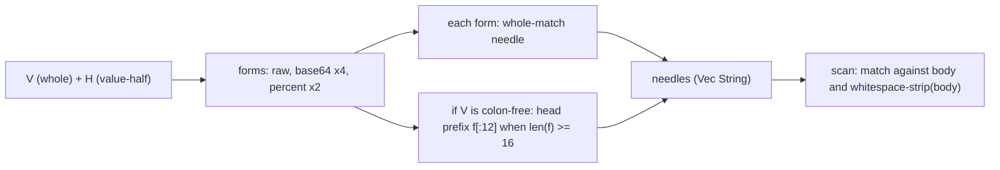

# Detect Encoded Credentials In Scrubbed Artefacts Implementation Plan

## Overview

Extend the `accelerator design scrub-secrets` credential-leak scanner so a
configured `ACCELERATOR_BROWSER_*` value is caught when a model base64-encoded
it, percent-encoded it, reflowed it across a line wrap, or truncated it after
its head. Matching is literal-substring today; a transcribed secret in any of
these shapes slips past it.

The scanner is pure and well-seamed (`cli/design/src/leaked_credentials.rs`, no
I/O, no error type). The change lands on the two seams the module already
separates: **`needles()`** derives *what to search for* (gains encodings and
head-prefixes); **`scan()`** decides *where* (gains a whitespace-stripped copy
of the haystack). A one-line reword in `commands.rs` keeps the rejection message
truthful once a non-literal form is what matched.

## Current State Analysis

The match surface is four functions across three crates, unchanged from the
research (revision moved to `pre.65`; the target files are identical):

- **`NamedSecret::needles()`** (`leaked_credentials.rs:25-34`) — private, returns
  `Vec<&str>`. Two forms today: the whole value, and the trimmed value-half of a
  `Name: value` header via `split_once(':')`. This first-colon split is the
  fixed contract 0207 consumes; it lives here, not in `environment.rs`.
- **`scan()`** (`leaked_credentials.rs:40-49`) — literal `body.contains(needle)`,
  no normalisation. An empty-value guard (line 43) sits in `scan`, so any new
  needle form still runs behind it.
- **`scrub_secrets()`** (`commands.rs:83-97`) — reads the file, scans, and on the
  first offending name returns `Report::rejected` with a message reading "the
  literal value of {name}…". The binary never writes an artefact; exit 1 with no
  content is the whole guarantee.
- **`CREDENTIAL_VARIABLES`** (`environment.rs:16-17`) — the fixed four-variable
  vocabulary (`AUTH_HEADER`, `USERNAME`, `PASSWORD`, `LOGIN_URL`); `LOCATION`
  excluded. Unchanged by 0207.

The `design` crate depends only on `kernel` (`design/Cargo.toml:12-13`). `base64`
0.22.1 and `percent-encoding` 2.3.2 are already in `cli/Cargo.lock`
transitively, so a direct declaration pulls no new package. cargo-deny admits
both (verified green in research: dual MIT/Apache-2.0, crates.io, not
deny-listed).

## Desired End State

`scan()` rejects a body containing any configured value in literal, base64
(standard, URL-safe, and their no-padding variants), or percent-encoded form
(upper- and lower-case hex); any of those reflowed across a line wrap; or the
leading 12 characters of any form (raw or encoded) that is 16 characters or
longer — but only for a value whose head is high-entropy. A value containing a
colon (`AUTH_HEADER`, `LOGIN_URL`) has a structural head in every form
(`Authorizatio`, `QXV0aG9yaXph`, `https://exam`, `aHR0cHM6Ly9l`), so it is never
head-prefixed; a colon-free value is — but only `PASSWORD` reliably has a
high-entropy head; a long, low-entropy `USERNAME` is prefixed too (an accepted
false-positive residual, see below). Every match is a
hard refusal (exit 1, no artefact written), and the report names only the
variable — never the value — for every form. Mid-token and tail truncation, head
truncation of a colon-bearing value, and the encoding forms enumerated in "What
We're NOT Doing", stay out of scope.

The final needle-derivation pipeline, per named value `V` (whole) and its header
value-half `H` where present:



### Key Discoveries

- **Needle-vs-haystack separation is load-bearing.** Encodings and prefixes are
  needles (`needles()`); the whitespace-strip is a haystack transform (`scan()`),
  because a configured value has no interior whitespace, so
  `whitespace_strip(V) == V` would catch nothing new (`leaked_credentials.rs:25-49`).
  The invariant for the next contributor: needle transforms widen *what* is
  searched for; haystack transforms widen *where*.
- **`needles()` widens to `Vec<String>`.** Derived encodings are owned; the raw
  value comes along as an owned `String` too, keeping all derivation in one
  place. Private method, so no external API break. Research resolved this.
- **The reject message loses "literal" (Phase 1), then names the shape (Phase
  4).** Phase 1 drops "literal" so the base wording is truthful across every match
  kind; Phase 4 branches it into a literal vs a transcribed (encoded/reflowed/
  truncated) subject to make a false-positive refusal diagnosable, still without
  printing the value. No existing test asserts the message text, so Phase 1 needs
  no test change; Phase 4 adds its own shape-phrasing assertions.
- **⚠️ Head-prefixes are derived only for colon-free values, from raw and
  encoded forms alike.** A value's head is a sound needle only when it is
  high-entropy; the two colon-bearing variables (`AUTH_HEADER`, `LOGIN_URL`) have
  a structural head in *every* form — raw `Authorizatio`/`https://exam`, base64
  (a fixed head, e.g. `QXV0aG9yaXph` = base64 of the `Authoriza` prefix), percent
  `Authorizatio` (percent never escapes alphanumerics) — so prefixing any of them
  false-positives on ordinary prose or on unrelated base64'd headers/URLs.
  `self.value.contains(':')` gates prefixing off, decided once per secret so the
  value-half (`Bearer <token>` — colon-free but structural) is excluded too.
- **⚠️ The colon is a *coarse* proxy that errs in both directions; both errors
  are accepted, not eliminated.** Colon-free does not guarantee a high-entropy
  head: a long, low-entropy `USERNAME` (`serviceaccount-prod` → head
  `serviceaccou`) is head-prefixed and can false-positive on prose — an
  unrecoverable refusal, accepted as the safe (leak-preventing) direction like
  the Phase 2 residual. Colon-bearing does not guarantee a structural head: a
  bare-key `AUTH_HEADER` (`X-API-Key: <key>`) or a colon-containing password has
  a high-entropy value-half head that the gate nonetheless suppresses — an
  accepted *missed leak*, not a structural-head avoidance. A precise
  entropy/character-class heuristic is out of scope; the colon proxy is the
  pragmatic, domain-local choice for the fixed four-variable vocabulary.
- **⚠️ Length and slicing count characters, not bytes.** `head_prefix` slices raw
  values (for colon-free secrets), which may be multi-byte, so
  `f.chars().count() >= 16` and `f.chars().take(12)`, never `f.len()` or `f[..12]`
  — a non-char-boundary byte slice would panic. Encoded forms are ASCII; the raw
  value need not be.
- **The binary never writes.** "Artefact not written" is satisfied by exit 1 with
  no content; the caller keys suppression on the exit code (`main.rs:93-104`).
  The widened detection is only as strong as that caller-side contract (exit 1 ⇒
  the artefact must not be promoted or written), which is unchanged and relied on.

## What We're NOT Doing

- Case folding, Unicode normalisation, or homoglyph handling.
- URL *form* encoding (`form_urlencoded`, space → `+`) — the wrong tool; only
  RFC 3986 percent-encoding of the unreserved set is derived.
- Hex encoding of the value (lower-, upper-, or mixed-case). base64 and
  percent-encoding are derived; hex is not.
- Partial percent-encoding that leaves reserved delimiters literal (e.g.
  `a%20b/c`). Only the maximal unreserved-set encoding — in both hex casings —
  is derived; a rendering between verbatim and maximal is not.
- HTML-entity (`&#104;…`) and JSON `\u`-escape forms.
- Double- or nested-encoding (base64 of a percent-encoded value, and the like);
  each encoding is derived at a single level only.
- Head truncation of a colon-bearing value (`AUTH_HEADER`, `LOGIN_URL`, or a
  colon-containing password). Head-prefixes are derived only for colon-free
  values. For `AUTH_HEADER`/`LOGIN_URL` this avoids a structural-head false
  positive (the head is structural in every form). For a bare-key header
  (`X-API-Key: <key>`) or a colon-containing password the head is *high-entropy*,
  so suppressing it forfeits a sound needle — an accepted missed leak, the coarse
  side of the colon proxy, not a structural-head avoidance.
- Head-prefix false positives from a colon-free but low-entropy value — a long
  `USERNAME` (`serviceaccount-prod` → head `serviceaccou`). The colon proxy does
  not guarantee a high-entropy head; this residual is accepted as the safe
  (leak-preventing) direction, like the Phase 2 whitespace residual. A precise
  entropy heuristic is out of scope.
- Head truncation of a form 12–15 characters long. The 16-character
  `MINIMUM_FORM_LENGTH` floor means a form in that band is matched whole only;
  its 12-character head is not derived.
- A credential embedded inside a larger base64 payload (a data URI, a base64'd
  request/JSON). base64 is 3-byte-group aligned, so an embedded value encodes to
  a shifted, non-substring output; only a standalone encoding is matched.
- Reflow of a needle that itself carries interior whitespace — notably the header
  value-half `Bearer <token>`. The whitespace-strip is a haystack transform only,
  so a space-bearing needle never matches the stripped copy; encoded forms (no
  interior whitespace) still reconstitute.
- Detecting mid-token or tail truncation (head removed). A needle short enough to
  catch a dropped head reintroduces the false-positive risk `P`/`M` exists to
  avoid. Pinned by a test.
- An override or `--force` flag — refusal stays unrecoverable.
- Changing `CREDENTIAL_VARIABLES`, the exit-code contract (0/1/2), the
  `AUTH_HEADER` value-half split location, or name deduplication.

## Implementation Approach

Four phases, each independently mergeable and each leaving `mise run` green,
built red-green-refactor from the domain-unit layer up. Ordered by dependency:
Phase 1 widens `needles()` to owned strings and adds its first external deps;
Phases 2 and 3 extend the same two functions. Phase 2 (haystack whitespace) is
logically orthogonal to encodings, but its `scan` still consumes Phase 1's
owned-`String` needles (`needle.as_str()`), so it must land after Phase 1; it
sits second so Phase 3's prefix work composes onto the encoding forms Phase 1
introduces. Phase 4 (name the match
shape in the rejection) touches only the command layer plus one domain predicate,
and is independent of Phases 2–3.

Each phase asserts its headline behaviour end-to-end through the binary
(`subcommands.rs`) and pins the exhaustive boundary and false-positive cases at
the fast domain-unit layer (`leaked_credentials.rs`), mirroring the existing
behaviour-sentence test names.

---

## Phase 1: Encoding derivation and form-agnostic reporting

### Overview

Derive base64 and percent-encoding of each value (and the header value-half),
widen `needles()` to `Vec<String>`, and reword the rejection message. No prefix
or whitespace handling yet.

### Changes Required

#### 1. Declare the encoding crates

**File**: `cli/Cargo.toml` (`[workspace.dependencies]`)
**Changes**: Add both crates. Caret bounds resolve to the versions already in
the lock (0.22.1, 2.3.2), so no package is added and no duplicate-version
warning fires under `multiple-versions = "warn"`.

```toml
# Already resolved transitively (reqwest, url, octocrab, …); a direct
# declaration adds no package to the graph.
base64 = "0.22"
percent-encoding = "2"
```

**File**: `cli/design/Cargo.toml`
**Changes**: Consume both via the workspace table — the crate's first external
dependencies. Admitting external crates into the previously `kernel`-only
functional core is a conscious boundary decision (encoding derivation is genuine
domain logic; both crates are pure and no-I/O), so further additions warrant the
same scrutiny.

```toml
[dependencies]
kernel = { path = "../kernel" }
base64 = { workspace = true }
percent-encoding = { workspace = true }
```

#### 2. Derive candidate forms in `needles()`

**File**: `cli/design/src/leaked_credentials.rs`
**Changes**: Split the value-set out to `values()`; derive the raw value plus its
encodings (four base64 engines, both percent-hex casings) via
`needles_for()`/`encodings()`; return owned `String`s. Relocate the value-half
rationale onto the new `header_value_half()`. Drop "verbatim" from the one-line
summary (line 1) so it reads "repeats a configured credential", and replace the
literal-substring paragraph (lines 6-9) with:

```rust
//! A credential is matched not only verbatim but in the encoded shapes a model
//! is likely to transcribe it into: base64 (standard and URL-safe, padded or
//! not) and maximal percent-encoding (unreserved set, either hex casing). Case
//! folding, hex, partial percent-encoding, HTML/JSON escapes and nested
//! encodings are out of scope.
```

(Phases 2 and 3 extend this paragraph with reflow and head-truncation as they
land, so each phase's doc-comment describes only what it delivers.)

```rust
use base64::engine::general_purpose::STANDARD;
use base64::engine::general_purpose::STANDARD_NO_PAD;
use base64::engine::general_purpose::URL_SAFE;
use base64::engine::general_purpose::URL_SAFE_NO_PAD;
use base64::Engine as _;
use percent_encoding::percent_encode;
use percent_encoding::AsciiSet;
use percent_encoding::NON_ALPHANUMERIC;

const PERCENT_ESCAPE_SET: &AsciiSet = &NON_ALPHANUMERIC
    .remove(b'-')
    .remove(b'.')
    .remove(b'_')
    .remove(b'~');

impl NamedSecret {
    fn needles(&self) -> Vec<String> {
        self.values()
            .iter()
            .flat_map(|value| needles_for(value))
            .collect()
    }

    fn values(&self) -> Vec<String> {
        let mut values = vec![self.value.clone()];
        if let Some(half) = self.header_value_half() {
            values.push(half.to_owned());
        }
        values
    }

    /// `ACCELERATOR_BROWSER_AUTH_HEADER` holds a whole `Name: value` pair, and
    /// the daemon splits it on the first colon — so the value half is a needle
    /// of its own. Without it, an artefact rendering just the bearer token,
    /// the likely leakage shape, would match nothing.
    fn header_value_half(&self) -> Option<&str> {
        let (_, half) = self.value.split_once(':')?;
        let half = half.trim();
        (!half.is_empty()).then_some(half)
    }
}

fn needles_for(value: &str) -> Vec<String> {
    let mut needles = vec![value.to_owned()];
    needles.extend(encodings(value));
    needles
}

fn encodings(value: &str) -> Vec<String> {
    let mut encodings: Vec<String> =
        [STANDARD, STANDARD_NO_PAD, URL_SAFE, URL_SAFE_NO_PAD]
            .iter()
            .map(|engine| engine.encode(value))
            .collect();
    encodings.extend(percent_forms(value));
    encodings
}

fn percent_forms(value: &str) -> Vec<String> {
    let upper =
        percent_encode(value.as_bytes(), PERCENT_ESCAPE_SET).to_string();
    let lower = lowercase_percent_triplets(&upper);
    if lower == upper {
        vec![upper]
    } else {
        vec![upper, lower]
    }
}

fn lowercase_percent_triplets(encoded: &str) -> String {
    let mut lowered = String::with_capacity(encoded.len());
    let mut chars = encoded.chars();
    while let Some(character) = chars.next() {
        lowered.push(character);
        if character == '%' {
            let hex = chars.by_ref().take(2);
            lowered.extend(hex.map(|h| h.to_ascii_lowercase()));
        }
    }
    lowered
}
```

#### 3. Match against owned needles in `scan()`

**File**: `cli/design/src/leaked_credentials.rs`
**Changes**: One line — needles are now `String`.

```diff
-            secret.needles().iter().any(|needle| body.contains(needle))
+            secret
+                .needles()
+                .iter()
+                .any(|needle| body.contains(needle.as_str()))
```

#### 4. Reword the rejection message

**File**: `cli/design-cli/src/commands.rs`
**Changes**: Drop "literal " so the message stays truthful across encodings.

```diff
-        "the literal value of {name} appears in the generated inventory body. \
+        "the value of {name} appears in the generated inventory body. \
          The artifact was not written. Check your content for accidental \
          secret leakage."
```

#### 5. Tests

**File**: `cli/design/src/leaked_credentials.rs` (domain unit) — new siblings.
Each encoding case uses a value whose encoded form differs from the raw value.

```rust
#[test]
fn a_base64_encoded_value_names_its_variable() {
    let secrets = [secret("ACCELERATOR_BROWSER_PASSWORD", "s3cr3t-token")];
    let encoded =
        base64::engine::general_purpose::STANDARD.encode("s3cr3t-token");
    assert_eq!(
        scan(&format!("the header read {encoded}"), &secrets),
        vec!["ACCELERATOR_BROWSER_PASSWORD"]
    );
}

#[test]
fn a_percent_encoded_value_names_its_variable() {
    let secrets = [secret("ACCELERATOR_BROWSER_LOGIN_URL", "a b/c")];
    assert_eq!(
        scan("the link was a%20b%2Fc", &secrets),
        vec!["ACCELERATOR_BROWSER_LOGIN_URL"]
    );
}
```

Plus: `a_base64_encoded_header_value_half_names_its_variable` and
`a_percent_encoded_header_value_half_names_its_variable` (the encoding derived
from the trimmed value-half of `Authorization: Bearer …`); and a reassertion
that `the_report_never_carries_the_value` holds for an encoded match.

Plus, for the widened encoding set — each case keeps its encoded form under 16
characters (so Phase 3 derives no head-prefix, and the shared leading-12 of the
padded/no-pad and standard/URL-safe variants cannot mask a missing derivation),
and asserts the distinctness it relies on *before* asserting the scan, so a
mis-chosen fixture fails loudly rather than passing via a sibling needle:
`a_url_safe_base64_encoded_value_names_its_variable` (a value whose STANDARD form
contains `+`/`/`; `assert_ne!(url_safe, standard)`),
`an_unpadded_base64_encoded_value_names_its_variable` (a value whose STANDARD form
ends in `=`; `assert!(standard.ends_with('='))`), and
`a_lowercase_percent_encoded_value_names_its_variable` (a value with a letter-hex
escape; `assert_ne!(lower, upper)`; the artefact renders the triplet lower-case,
e.g. `a%2fc`).

Plus `a_value_whose_percent_form_needs_no_lowercasing_is_still_caught` — a value
whose percent form has only digit-hex or no escapes (e.g. a space → `%20`),
pinning the `lower == upper` dedup branch of `percent_forms`.

**File**: `cli/design-cli/tests/subcommands.rs` (integration) —
`a_base64_encoded_value_is_caught_end_to_end`: inject `PASSWORD` via env, write a
file containing its base64, assert exit 1, stderr contains the variable name and
not the value.

#### 6. Update the shipped command reference

**File**: `docs-site/src/content/docs/design.md`
**Changes**: The `scrub-secrets` description (line 146) states it refuses "the
literal value" of a variable; drop "literal" and note it now also catches base64
and percent-encoded forms, mirroring the Phase 1 module-doc reword. (Phase 3
extends this line with the reflowed and colon-free head-truncated forms, matching
the doc-comment; do not claim head-truncation coverage for the colon-bearing
`AUTH_HEADER`/`LOGIN_URL`.)

### Success Criteria

#### Automated Verification

- [ ] Domain tests pass: `cargo test --manifest-path cli/Cargo.toml -p design leaked_credentials`
- [ ] Integration tests pass: `cargo test --manifest-path cli/Cargo.toml -p design-cli --test subcommands`
- [ ] Rust format + clippy clean: `mise run cli:check`
- [ ] cargo-deny admits the new direct deps: `mise run deny:check`
- [ ] Docs build clean (outside the aggregate `check`): `mise run docs:check`
- [ ] Full local CI mirror green: `mise run`

#### Manual Verification

- [ ] `ACCELERATOR_BROWSER_PASSWORD=s3cr3t-token accelerator design scrub-secrets <file>` where `<file>` contains only `base64("s3cr3t-token")` exits 1 and prints the variable name, not the value.

---

## Phase 2: Whitespace-reflow reconstitution

### Overview

Strip all ASCII whitespace from a copy of the haystack and match every needle
against both the raw body and the stripped copy, reconstituting a token a line
wrap split.

⚠️ Residual: collapsing whitespace across the whole body can reconstitute a
short, common value across word boundaries — a configured `USERNAME=admin` would
match the stripped `loadminimum` from "load minimum". Whole-value needles have no
minimum-length floor (only head-prefixes do), so this is a false-positive surface
for short low-entropy values. Refusal is the safe direction for leak *prevention*,
but a false positive here is an unrecoverable block on a legitimate artefact (no
`--force`) — the availability cost is accepted, not mitigated. Not addressed
further.

### Changes Required

#### 1. Add the stripped haystack in `scan()`

**File**: `cli/design/src/leaked_credentials.rs`
**Changes**: Build the stripped haystack once, outside the secret loop; test each
needle against the raw body and the stripped copy. Extend the module doc-comment
to add "; any of those reflowed across a line wrap" after the encodings clause.

```rust
#[must_use]
pub fn scan(body: &str, secrets: &[NamedSecret]) -> Vec<String> {
    let stripped = strip_whitespace(body);
    secrets
        .iter()
        .filter(|secret| !secret.value.is_empty())
        .filter(|secret| {
            secret.needles().iter().any(|needle| {
                body.contains(needle.as_str())
                    || stripped.contains(needle.as_str())
            })
        })
        .map(|secret| secret.name.clone())
        .collect()
}

fn strip_whitespace(body: &str) -> String {
    body.chars().filter(|c| !c.is_ascii_whitespace()).collect()
}
```

#### 2. Tests

**File**: `cli/design/src/leaked_credentials.rs` (domain unit) —
`a_value_reflowed_across_a_line_wrap_names_its_variable`: a value with no interior
whitespace, rendered in the artefact with a newline inserted mid-token; `scan`
names it. Because the stripped haystack is tested against *every* needle, a
reflowed base64 form is covered by the same transform — add
`a_reflowed_base64_form_is_still_caught` to pin the compound shape. Add
`a_reflowed_interior_whitespace_needle_is_not_reconstituted` to pin the
documented boundary: a body rendering the header value-half space-collapsed
(`…Bearerabc123…`) is not flagged via the space-bearing raw value-half, while its
whitespace-free encoded form still is.

**File**: `cli/design-cli/tests/subcommands.rs` (integration) —
`a_reflowed_value_is_caught_end_to_end`.

### Success Criteria

#### Automated Verification

- [ ] Domain tests pass: `cargo test --manifest-path cli/Cargo.toml -p design leaked_credentials`
- [ ] Integration tests pass: `cargo test --manifest-path cli/Cargo.toml -p design-cli --test subcommands`
- [ ] Rust format + clippy clean: `mise run cli:check`
- [ ] Full local CI mirror green: `mise run`

#### Manual Verification

- [ ] A file rendering a configured value with a newline inserted mid-token is rejected (exit 1), while the same file with the token intact and no configured value present is accepted (exit 0).

---

## Phase 3: Minimum-length head-prefix matching

### Overview

For any form (raw or encoded) of 16 characters or more (`M`), derive its leading
12 characters (`P`) as an additional needle, so a token clipped after its head is
caught — but only for a colon-free value (the colon proxy for a high-entropy
head; see the coarse-proxy caveat in Key Discoveries). A colon-bearing value
(`AUTH_HEADER`, `LOGIN_URL`) has a structural head in every form and is never
head-prefixed. A form shorter than 16 gains no prefix and is matched whole only.

### Changes Required

#### 1. Add prefix derivation to the pipeline

**File**: `cli/design/src/leaked_credentials.rs`
**Changes**: Compute head-prefixability once per secret (`head_prefixable()` —
true when `self.value` has no colon), then thread it into `needles_for()` so each
form contributes its head-prefix only for a colon-free secret. Deciding it from
`self.value` — not per derived value — excludes the value-half (`Bearer <token>`,
colon-free but structural) from prefixing too. `head_prefix` now slices raw
values, so it stays character-based to avoid a multi-byte panic. Extend the
module doc-comment to add "; and, for a colon-free value, the leading characters
of any form long enough to survive head truncation", and add "and head truncation
of a colon-bearing value" to its out-of-scope sentence.

```rust
const MINIMUM_FORM_LENGTH: usize = 16;
const PREFIX_LENGTH: usize = 12;

impl NamedSecret {
    fn needles(&self) -> Vec<String> {
        let prefixable = self.head_prefixable();
        self.values()
            .iter()
            .flat_map(|value| needles_for(value, prefixable))
            .collect()
    }

    fn head_prefixable(&self) -> bool {
        !self.value.contains(':')
    }
}

fn needles_for(value: &str, prefixable: bool) -> Vec<String> {
    let mut needles = vec![value.to_owned()];
    if prefixable {
        needles.extend(head_prefix(value));
    }
    for encoding in encodings(value) {
        if prefixable {
            needles.extend(head_prefix(&encoding));
        }
        needles.push(encoding);
    }
    needles
}

fn head_prefix(form: &str) -> Option<String> {
    (form.chars().count() >= MINIMUM_FORM_LENGTH)
        .then(|| form.chars().take(PREFIX_LENGTH).collect())
}
```

#### 2. Tests

**File**: `cli/design/src/leaked_credentials.rs` (domain unit) — one test per
acceptance criterion:

All positive cases use a colon-free `PASSWORD` value (so it is head-prefixable):

- `a_raw_value_truncated_after_its_head_names_its_variable` — a colon-free value
  ≥16, artefact holds only its leading 12 (the raw head).
- `a_truncated_base64_head_names_its_variable` — the base64 form ≥16, artefact
  holds only its leading 12; the whole base64 is absent.
- `a_truncated_percent_encoded_head_names_its_variable` — a colon-free value with
  enough escaped bytes that its percent form is ≥16, artefact holds only its
  leading 12. (Uses `PASSWORD`, not `LOGIN_URL`, which is colon-bearing.)
- `a_short_value_gains_a_prefix_through_its_longer_base64` — raw value <16 but its
  base64 ≥16; the body holds only the leading 12 of the base64 (the whole base64
  absent), so the head-prefix path — not the whole-encoding needle — is what
  matches. base64 inflates length by ~4/3.
- `a_multibyte_value_truncated_after_its_head_names_its_variable` — a colon-free
  value ≥16 whose byte offset 12 falls inside a multi-byte codepoint (e.g. 11
  ASCII characters then a 3-byte codepoint); the raw leading-12-character prefix
  is derived and matched without a panic. Guards the char-vs-byte invariant now
  that raw values are sliced; a mutation to `f[..12]` would panic here.
- `a_short_multibyte_value_gains_no_prefix` — a colon-free value of fewer than 16
  *characters* but 16 or more *bytes* (e.g. 13 three-byte codepoints); its
  leading 12 characters, present alone in the body, are not flagged. Pins the
  threshold to characters, so a `chars().count()` → `len()` mutation fails.
- `a_structured_value_head_is_not_flagged_in_any_form` — for `AUTH_HEADER` and
  `LOGIN_URL`, the body carries the *actual* leading-12 of each derived form —
  computed in the test (not hard-coded) and asserted to be exactly 12 characters
  — for raw, base64 and percent; none is flagged, because a colon-bearing value
  is never head-prefixed. Because the body holds the genuine 12-char head, a
  `head_prefixable`-always-true regression would flag it, flipping the test red.
  Reinforces `the_header_name_alone_does_not_false_positive`.
- `a_colon_bearing_password_is_not_head_prefixed` — a `PASSWORD` containing a
  colon and ≥16 characters, rendered as only its leading 12, is not flagged.
  The ≥16 length matters: below it no head-prefix would be derived even under a
  regression, so the test would pass for the wrong reason. Documents the
  colon-proxy limitation.
- `the_prefix_boundary_holds_at_exactly_twelve_characters` — a body sharing the
  leading 11 (`P−1`) is not flagged; sharing the leading 12 (`P`) is.
- `head_prefix_gains_nothing_at_fifteen_and_a_head_at_sixteen` — `head_prefix` on
  a 15-character form returns `None`, on a 16-character form returns its leading
  12; pins `MINIMUM_FORM_LENGTH` at its edge from both sides (tests the free
  function directly).
- `a_form_shorter_than_sixteen_gains_no_prefix` — a form <16 is matched whole only.
- `a_value_truncated_in_its_middle_or_tail_is_not_flagged` — a form ≥16 with its
  head removed is not a needle.
- `a_high_entropy_but_legitimate_substring_is_not_flagged` — a long random-looking
  substring sharing fewer than 12 leading characters with any form is not
  flagged.

**File**: `cli/design-cli/tests/subcommands.rs` (integration) —
`a_truncated_head_is_caught_end_to_end`: inject `PASSWORD`, write a file holding
only the leading 12 characters of its raw value (≥16), assert exit 1, name in
stderr, value absent. Plus the colon-proxy negative
`a_colon_bearing_head_is_accepted_end_to_end`: inject `AUTH_HEADER`, write a file
holding only the leading 12 of its value, assert exit 0 — the binary-level mirror
of the domain negative, so a regression that head-prefixes colon-bearing values
fails CI rather than only a manual check.

### Success Criteria

#### Automated Verification

- [ ] Domain tests pass: `cargo test --manifest-path cli/Cargo.toml -p design leaked_credentials`
- [ ] Integration tests pass: `cargo test --manifest-path cli/Cargo.toml -p design-cli --test subcommands`
- [ ] Rust format + clippy clean: `mise run cli:check`
- [ ] Full local CI mirror green: `mise run`

#### Manual Verification

- [ ] A file holding only the leading 12 characters of a colon-free configured value (≥16 characters, e.g. `PASSWORD`) is rejected (exit 1); a file holding only the leading 12 characters of a colon-bearing value (`AUTH_HEADER`, `LOGIN_URL`) is accepted (exit 0).

---

## Phase 4: Name the match shape in the rejection

### Overview

Distinguish a literal leak from a transcribed one (encoded, reflowed, or
truncated) in the rejection message, so a false-positive refusal is diagnosable
without an override — the operator learns whether to look for the value verbatim
or in a derived form. The value is still never printed; only the shape class and
the variable name are. `scan`'s signature is unchanged, so the domain's public
surface gains only one predicate.

### Changes Required

#### 1. Classify the leak in the domain

**File**: `cli/design/src/leaked_credentials.rs`
**Changes**: Add a pure predicate reporting whether the leak is literal — the raw
value or its raw value-half occurs verbatim in the unstripped body. Every other
match (an encoding, a head-prefix, or a value reflowed across a line wrap, which
matches only the stripped copy) is transcribed.

```rust
#[must_use]
pub fn leak_is_literal(body: &str, secret: &NamedSecret) -> bool {
    body.contains(&secret.value)
        || secret
            .header_value_half()
            .is_some_and(|half| body.contains(half))
}
```

#### 2. Branch the rejection message

**File**: `cli/design-cli/src/commands.rs`
**Changes**: For the first offending name, resolve its secret and pick the
message by `leak_is_literal`. The literal branch keeps today's wording; the
transcribed branch names the shape class. Neither prints the value.

```diff
-    Ok(Report::rejected(&format!(
-        "the value of {name} appears in the generated inventory body. \
-         The artifact was not written. Check your content for accidental \
-         secret leakage."
-    )))
+    let literal = secrets
+        .iter()
+        .find(|secret| &secret.name == name)
+        .is_some_and(|secret| {
+            leaked_credentials::leak_is_literal(&body, secret)
+        });
+    let subject = if literal {
+        "the value"
+    } else {
+        "a transcribed form (encoded, reflowed, or truncated) of the value"
+    };
+    Ok(Report::rejected(&format!(
+        "{subject} of {name} appears in the generated inventory body. \
+         The artifact was not written. Check your content for accidental \
+         secret leakage."
+    )))
```

#### 3. Tests

**File**: `cli/design/src/leaked_credentials.rs` (domain unit) —
`a_verbatim_value_is_classified_literal`,
`a_verbatim_header_value_half_is_classified_literal`, and
`an_encoded_value_is_classified_transcribed` /
`a_reflowed_value_is_classified_transcribed` exercise `leak_is_literal` directly.

**File**: `cli/design-cli/src/commands.rs` (unit) —
`a_literal_leak_names_the_value` and `an_encoded_leak_names_a_transcribed_form`:
each asserts the message carries the expected shape phrasing and the variable
name, and never the value. Because `the value of {name}` is a substring of the
transcribed message, the literal case also asserts the message does *not* contain
`transcribed` — so a regression collapsing both branches onto one wording fails.

**File**: `cli/design-cli/tests/subcommands.rs` (integration) —
`an_encoded_leak_reports_a_transcribed_shape_end_to_end`.

### Success Criteria

#### Automated Verification

- [ ] Domain + command tests pass: `cargo test --manifest-path cli/Cargo.toml -p design -p design-cli`
- [ ] Integration tests pass: `cargo test --manifest-path cli/Cargo.toml -p design-cli --test subcommands`
- [ ] Rust format + clippy clean: `mise run cli:check`
- [ ] `scan`'s public signature is unchanged; `leak_is_literal` is a new public item — accept the addition by refreshing the `design` crate baseline (`cli/design/tests/fixtures/public-api.txt`) with `mise run public-api:update`, then confirm the one-line additive diff. `public-api:check` runs on the nightly lane, so a stable-only `mise run` may not flag a stale baseline — run the update explicitly.
- [ ] Full local CI mirror green: `mise run`

#### Manual Verification

- [ ] A file containing a configured value verbatim is rejected with "the value of {name}…"; a file containing only its base64 form is rejected with "a transcribed form (encoded, reflowed, or truncated) of the value of {name}…"; neither prints the value.

---

## Testing Strategy

### Unit Tests

- Domain layer (`leaked_credentials.rs`), where TDD starts: encoding detection
  (base64 standard/URL-safe/no-pad, percent in both hex casings, plus the
  no-lowercasing dedup branch), reflow reconstitution, prefix boundary at `P` and
  `P−1`, form-length threshold at 15 and 16 (and a character-not-byte
  threshold via a short multi-byte value), too-short-no-prefix, colon-free values
  head-prefixed in raw and encoded forms (including a multi-byte raw prefix
  without panic), colon-bearing values never prefixed — the structured-head
  negatives carry the *actual* computed leading-12 of each form so a regression
  flips them red — interior-whitespace needle not reconstituted,
  mid/tail-truncation out of scope, false-positive candidate. Phase 4 adds
  `leak_is_literal` classification (verbatim value, verbatim value-half, encoded,
  reflowed) and the command-layer message branches (literal vs transcribed, the
  literal case asserting the message omits `transcribed`).
- The name-only invariant is pinned once per encoding family
  (`the_report_never_carries_the_value`) and at every integration case
  (`report.contains(name)` with `!report.contains(value)`); the domain cases
  assert the exact name vector, since `scan()` returns names by construction.

### Integration Tests

- Binary layer (`subcommands.rs`) via the `run(args, env)` harness, which
  `env_clear()`s so a developer's own `ACCELERATOR_BROWSER_*` cannot leak in. One
  end-to-end case per phase: the headline positive asserts exit 1, name in stderr,
  value absent; Phase 3 also asserts a colon-bearing head is accepted (exit 0);
  Phase 4 asserts the transcribed-shape phrasing.

### Manual Testing Steps

1. Export a configured credential and run `scrub-secrets` on a file rendering it
   base64-encoded → exit 1, variable named, value absent.
2. Repeat with the value reflowed across a newline → exit 1.
3. Repeat with only the leading 12 characters of a colon-free value (`PASSWORD`,
   ≥16) → exit 1; with only the leading 12 of a colon-bearing value → exit 0.

## Performance Considerations

⏱️ Negligible. `needles()` runs once per secret (≤4) per scan, behind a file
read; `scan()` builds one stripped haystack once. No hot path.

## Migration Notes

None. The change is internal to the scanner — no data, schema, or config
migration, and no change to the environment-read or exit-code contracts.

Pre-existing limitation, unchanged and out of scope: the scanner fails open when
the `ACCELERATOR_BROWSER_*` variables are unset — no configured secret means no
needles, so every artefact is accepted. The widened detection provides zero
protection in that state; a variable rename or dropped export silently disables
it. Validating that the expected credential variables are present when scrubbing
is meant to be active is a candidate for a future work item.

## References

- Original work item: `meta/work/0207-detect-encoded-credentials-in-scrubbed-artefacts.md`
- Research: `meta/research/codebase/2026-09-10-0207-detect-encoded-credentials-in-scrubbed-artefacts.md`
- Scanner core: `cli/design/src/leaked_credentials.rs:25-49`
- Value-half source of truth: `cli/design-adapters/src/environment.rs:16-47`
- Reject message and exit mapping: `cli/design-cli/src/commands.rs:83-97`, `cli/design-cli/src/main.rs:93-104`
- Derived from: `plan:2026-08-11-0196-design-cli-migration` (introduced the header value-half split)
