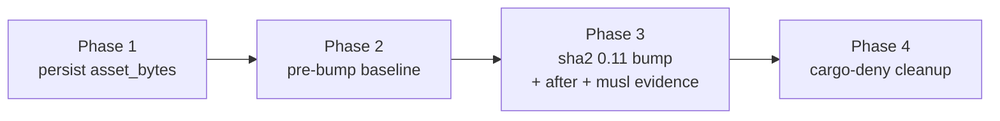

# Close the sha2 hardware-intrinsics gap Implementation Plan

## Overview

Enable the ARMv8 SHA-2 hardware backend by bumping the workspace `sha2`
dependency to 0.11, whose runtime-detected `aarch64-sha2` backend needs no
features, no RUSTFLAGS, and is musl-safe under `crt-static`. The bump is
crate-global: it reaches every first-party consumer at once, so the launcher's
`verifier::sha256_hex` and six other SHA-256 sites all pick up the intrinsics
path. It is not, however, a manifest-only change: 0.11 is a major RustCrypto
bump that moves the digest output type from `generic-array` to `hybrid-array`,
which no longer implements `LowerHex`, so three first-party
`format!("{:x}", …)` sites need a small source migration to `hex::encode`. The
work is bracketed by a before/after throughput measurement on darwin-arm64 and
closed out with a workspace-wide cargo-deny no-duplicates cleanup for which the
`sha2` collapse is the first step.

The measurement plumbing must land first so the "before" figure is a recorded
quantity, not a hand-division. The four phases are strictly ordered — each leaves
the tree green and is a self-contained mergeable increment in that sequence,
though Phase 4's skip-list is derived from Phase 3's resolved graph and must be
re-derived if the bump changes — because the cargo-deny duplicate inventory can
only be enumerated after the bump has collapsed `sha2` and shifted the RustCrypto
substack.

| AC | Gate | Phase |
|---|---|---|
| AC 1 | darwin `verifier::sha256_hex` median ≤ 1.79 ms | 1, 2, 3 |
| AC 2 | four targets build; per-target warning baseline held | 2, 3 |
| AC 3 | aarch64-musl runtime-detected backend, by inspection | 3 |
| AC 4 | vendor-shim marker unmoved; duplication effect recorded | 3 |
| AC 5 | `deny:check` exits 0 under `multiple-versions = "deny"` | 4 |
| AC 6 | before/after throughput recorded from persisted `asset_bytes` | 1, 2, 3 |
| AC 7 | fallback on musl build/link failure or soft-backend selection | 3, (0217) |

## Current State Analysis

`sha2 = "0.10"` is pinned with no features in two independent places, so the
portable `soft` backend compiles and `sha2-asm` is absent from the lockfile:

- `cli/Cargo.toml:76` — the `[workspace.dependencies]` pin, inherited by
  `launcher`, `work-adapters`, `jira-client`, `design-adapters`, and
  `remote-projection` via `sha2 = { workspace = true }`.
- `cli/visualiser/server/Cargo.toml:49` — the server's own literal `sha2 =
  "0.10"`, which a workspace bump alone would not move.

`verify_binary` (`cli/launcher/src/launch/outbound/resolve/verifier.rs:29`)
pairs a cheap SHA-256 corruption gate (`sha256_hex`, `verifier.rs:14`) with the
real security boundary, minisign over a BLAKE2b prehash. The soft backend runs
`sha256_hex` at ~555–575 MB/s on this chip — a 3.1× shortfall against openssl
and, notably, 2.6× slower than minisign's own BLAKE2b over the same bytes.

The measurement stack reports latency, not throughput. `warm_terms.rs:139-143`
times `verifier::sha256_hex` in isolation over the cached `vcs` sub-binary and
emits a `median_ms`; `warm_terms.rs:151` emits a trailing `{"asset_bytes":<len>}`
line. But `parse_term_report` (`tasks/measure.py:2650`) filters to lines
containing `"term"`, so the `asset_bytes` line is dropped and no measurement
JSON records the asset size. MB/s is a manual division against a size obtained
separately.

cargo-deny runs lenient today: `[bans] multiple-versions = "warn"`
(`cli/deny.toml:110`), zero `skip` entries, and a graph of **five** triples —
the four shipped plus `x86_64-unknown-linux-gnu` (`cli/deny.toml:11-17`). The
lockfile already carries `sha2 0.10.9` (six first-party crates) alongside
`sha2 0.11.0` (transitive, via `rust-embed-utils`), so bumping both first-party
declarations to 0.11 collapses onto the version `rust-embed` already pulls.

### Key Discoveries:

- The switch is crate-global but only `sha256_hex` is AC-gated
  (`verifier.rs:14`); the other six `sha2` sites ride the same backend for free.
- The 0.11 output type is `hybrid-array::Array`, which drops the `LowerHex`
  impl `generic-array` carried, so `format!("{:x}", hasher.finalize())` fails to
  compile at `cli/work-adapters/tests/corpus_hashes.rs:27`,
  `cli/work-adapters/tests/bash_parity_baseline.rs:98`, and
  `cli/jira-client/tests/adf_oracle_manifest.rs:33`. `hex` is a dependency of
  the server only, not of `work-adapters` or `jira-client`. The `.into()`,
  `hex::encode`, and byte-iteration digest sites remain drop-in.
- The vendor-shim marker hashes `cli/verify` source plus the `minisign-verify`
  pin and its lockfile closure only — never `sha2` (`tasks/build.py:538-582`) —
  so a `sha2` bump should leave it unmoved.
- `[profile.release]` sets `strip = true` (`cli/Cargo.toml:217`), so AC 3's
  `nm`/`strings` symbol evidence must come from the `sha2` `.rlib` or a
  `strip = false` build, not the stripped release binary.
- No `.cargo/config.toml`, no `rust-toolchain.toml`, and no RUSTFLAGS /
  `target-feature` / `target-cpu` exist anywhere in the tree, so AC 3's "nothing
  forces `+sha2`" is trivially true and both must stay true after the bump.
- `deny:check` is a **separate** top-level task, not part of `cli:check`; it
  sits in the aggregate `check` and the `default` run (`mise.toml:587,663,667`).
- The 0.10/0.11 RustCrypto substack straddles (`digest`, `crypto-common`,
  `block-buffer`, `cpufeatures`) pre-exist the bump: the 0.10 side is pulled by
  `sha1`, `sha1-checked`, `hmac`, `blake2`, and `jj-lib`, not first-party
  `sha2`. The bump repoints first-party consumers onto the already-resolved 0.11
  substack and leaves those pre-existing straddles in place, to be dispositioned
  in Phase 4 — it adds no new straddle.

## Desired End State

The workspace is on `sha2` 0.11 with a single source of truth for backend
selection; `verifier::sha256_hex` on darwin-arm64 runs at ≥ 1,390 MB/s
(median ≤ 1.79 ms over the 2,493,792-byte `vcs` sub-binary); all four shipped
targets build clean with no new warnings; the aarch64-musl runtime-detected
backend is evidenced by inspection; the vendor-shim marker is unmoved; the
before/after throughput is recorded as a committed measurements artefact derived
from a persisted `asset_bytes`; and `deny:check` exits 0 under
`multiple-versions = "deny"` with every duplicate resolved or justified.

Verify by: `mise run cli:check`, `mise run build:cli-cross-compile`,
`mise run lint:vendor-shims:check`, `mise run deny:check`, and
`mise run test:integration:deny` all exit 0; the "after" measurements JSON shows
`verifier::sha256_hex` median ≤ 1.79 ms; `sha2` is absent from `cargo tree -d`
(no duplicate remains) and `cargo tree -i sha2` shows the single `sha2 0.11.0`.

## What We're NOT Doing

- Not measuring aarch64-musl throughput here — that is 0217's scope; this plan
  confirms 0217 carries the reciprocal `work-item:0216` edge before closing.
- Not executing on an aarch64 CPU lacking the SHA-2 extension — an accepted
  limitation resting on the upstream-tested 0.11 runtime-detection path.
- Not the `asm` feature (removed in 0.11), a crate swap, or a vendored assembly
  path — rejected alternatives, not fallbacks.
- Not pursuing 0215 — the fallback fires only on a reproducible musl
  build/link failure or a runtime soft-backend selection (AC 7), not as an
  optional route. The soft-backend-selection trigger cannot be closed within
  0216's inspection-only musl scope and stays open pending 0217's throughput.
- Not adding an MB/s field to the per-term measurement schema — persist the raw
  `asset_bytes` and derive MB/s in prose, preserving the latency contract.
- Not proving byte-identical binary rebuilds — the cross-compiled binaries are
  not byte-reproducible by design.
- Not re-measuring the six non-gated `sha2` sites individually — they inherit
  the crate-global backend for free. This is distinct from the 0.11 API
  migration: the `hybrid-array` output-type change does require editing the
  three `format!("{:x}", …)` digest-formatting sites (Phase 3, Section 4).

## Implementation Approach

Order the work so the "before" state stays recoverable and the cargo-deny
inventory is enumerable against reality:



Phase 1 is a pure plumbing change with a unit-test seam and no dependency on the
bump. Phase 2 records the soft-backend baseline as a committed artefact so it
cannot be lost when Phase 3 lands. Phase 3 is the substantive backend switch,
measured against the Phase 2 baseline. Phase 4 must follow Phase 3 because the
bump both removes the first-party `sha2` straddle and shifts the RustCrypto
substack, so only a post-bump `cargo deny check bans` yields the authoritative
duplicate list.

## Phase 1: Persist `asset_bytes` in the measurement plumbing

### Overview

Teach `tasks/measure.py` to carry the harness's trailing `asset_bytes` line into
the warm-dispatch record JSON, and document the throughput derivation in prose.
This is the prerequisite 0217 also inherits for its aarch64-musl figure.

### Changes Required:

#### 1. Parse and thread `asset_bytes`

**File**: `tasks/measure.py`
**Changes**: Add an `asset_bytes` parser, return it alongside the terms from
`decompose_terms`, and record it in the report dict `close_the_budget` returns
(which is assigned to `record["terms"]`), alongside `cache_root_bytes`, so it
resolves to `record["terms"].asset_bytes`.

```python
@dataclass(frozen=True)
class LauncherTerms:
    terms: dict[str, Interval]
    asset_bytes: int | None


def decompose_terms(
    plugin_root: Path, *, version: str, subbinary: str = "vcs"
) -> LauncherTerms:
    # ... unchanged subprocess run ...
    return LauncherTerms(
        terms=parse_term_report(completed.stdout),
        asset_bytes=parse_asset_bytes(completed.stdout),
    )


def parse_asset_bytes(stdout: str) -> int | None:
    """The dispatched sub-binary's size from the harness's trailing line."""
    for line in stdout.splitlines():
        stripped = line.strip()
        if stripped.startswith("{") and '"asset_bytes"' in stripped:
            return int(json.loads(stripped)["asset_bytes"])
    return None
```

The caller in `close_the_budget` (`measure.py:1858`, invoked at `:1697`) unpacks
the new shape and records the size:

```python
    launcher_terms = decompose_terms(plugin_root, version=version)
    # ...
    terms = {**launcher_terms.terms, **shell_terms}
    # ...
    report: dict[str, object] = {
        "terms": {name: asdict(term) for name, term in terms.items()},
        # ... unchanged ...
        "asset_bytes": launcher_terms.asset_bytes,
    }
```

#### 2. Document the derivation

**File**: `tasks/README.md`
**Changes**: In the warm-dispatch measurement subsection, record the formula so
the throughput is a documented quantity, not folklore:

```text
verifier::sha256_hex throughput (decimal MB/s) =
    asset_bytes / (median_ms * 1000)
```

### Test-Driven Development

Write the failing tests first in `tests/unit/tasks/test_measure.py`. Reuse the
committed captured-stdout fixture rather than introducing a second byte-count
literal — its value is a test double for the parser and need not equal the
canonical asset size (2,493,792) the AC gate uses. Separately, commit a real
captured-stdout golden from the `#[ignore]`d harness and assert `parse_asset_bytes`
against it, so the Rust-emits/Python-parses contract at `warm_terms.rs:151` is
pinned rather than only a hand-written string:

- `parse_asset_bytes` returns the integer from a stdout fixture whose trailing
  line is `{"asset_bytes":<n>}`.
- `parse_asset_bytes` returns `None` when the line is absent.
- `parse_asset_bytes` raises on a malformed line — non-JSON, or a non-numeric
  `asset_bytes` value (`int()` truncates a float rather than raising, so the case
  must be genuinely non-numeric) — matching `parse_term_report`'s existing
  unguarded contract.
- `parse_asset_bytes` returns the first value when more than one `asset_bytes`
  line is present, pinning the early-return contract.
- The report dict assembled by `close_the_budget` carries `asset_bytes`
  alongside `cache_root_bytes`, including the `None` case. Extract the report
  assembly into a pure function over `LauncherTerms` plus the shell terms if
  needed, so this is unit-testable without standing up the harness — this closes
  the AC 6 gap where the field's persistence was otherwise only manually checked.

The existing `test_non_term_lines_are_ignored_rather_than_parsed`
(`test_measure.py:1892`) already asserts `parse_term_report` ignores the new
line; no new test duplicates it.

Then implement the minimum to pass, then refactor.

### Success Criteria:

#### Automated Verification:

- [ ] New unit tests pass: `uv run pytest tests/unit/tasks/test_measure.py -k
      asset_bytes`
- [ ] Build-system checks pass: `mise run build-system:check`
- [ ] Full test suite passes: `mise run test`

#### Manual Verification:

- [ ] A warm-dispatch record JSON produced by `mise run measure:warm-dispatch`
      now carries `asset_bytes` under `record["terms"]` (alongside
      `cache_root_bytes`) with the `vcs` sub-binary size.

---

## Phase 2: Capture the pre-bump (soft 0.10) baseline

### Overview

Record the soft-backend `verifier::sha256_hex` median and `asset_bytes` on
darwin-arm64, plus each shipped target's warning set from a clean cross-build, as
the recoverable "before". No product-code change — the deliverable is committed
evidence.

### Changes Required:

#### 1. Throughput baseline

**File**: `meta/measurements/2026-09-11-0216-sha256-hex-before.json`
**Changes**: Commit the warm-dispatch record produced on the current soft-backend
tree, on a quiet darwin-arm64 host. Expect `verifier::sha256_hex` median ≈ 4.3 ms
(≈ 575 MB/s), matching the recorded `warm-dispatch-3/-4` band — a soft sanity
band, not a calibrated reference: those baselines carry `calibration.holds:
false`, which bears on the shell-floor terms, not the in-process `sha256_hex`
timing. Record the exact CPU model in the committed JSON; the ~4.3 ms band and
the fixed 1.79 ms gate are meaningful only on an M4-Max-class quiet host. A median
already near ~1.25–1.79 ms would mean the hardware path is somehow already active
and the baseline is invalid.

Run:

```bash
mise run measure:warm-dispatch
```

#### 2. Per-target warning baseline

**File**: `meta/measurements/2026-09-11-0216-cross-build-warnings-before.txt`
**Changes**: Commit each of the four targets' warning set from a clean
soft-backend cross-build, so AC 2's "no new warnings beyond the baseline" has a
concrete referent.

Run and capture stderr per target:

```bash
mise run build:cli-cross-compile
```

#### 3. Advisories/licenses/sources baseline

**File**: `meta/measurements/2026-09-11-0216-deny-surface-before.txt`
**Changes**: Commit the pre-bump `cargo deny check advisories licenses sources`
output so Phase 4's before/after comparison has a committed referent, rather than
resting on a checkout of the pre-Phase-3 tree.

Run from `cli/`:

```bash
cargo deny check advisories licenses sources
```

### Success Criteria:

#### Automated Verification:

- [ ] `mise run build:cli-cross-compile` exits 0 on the soft-backend tree.
- [ ] The baseline JSON contains both `asset_bytes` and a `verifier::sha256_hex`
      term (Phase 1 landed).

#### Manual Verification:

- [ ] The recorded `verifier::sha256_hex` median is in the soft-backend band
      (~4.3 ms), confirming a valid "before".
- [ ] The warning baseline file records the per-target warning set for all four
      shipped triples.

---

## Phase 3: The `sha2` 0.11 bump, after-measurement, and musl evidence

### Overview

Move both `sha2` declarations to 0.11 with a single source of truth, re-measure
darwin-arm64, cross-build all four targets against the Phase 2 warning baseline,
evidence the aarch64-musl runtime-detected backend, and confirm the reproducibility
artefacts are intact.

### Changes Required:

#### 1. Bump the workspace pin

**File**: `cli/Cargo.toml`
**Changes**: `sha2 = "0.10"` → `sha2 = "0.11"` (line 76).

```diff
-sha2 = "0.10"
+sha2 = "0.11"
```

#### 2. Collapse the server literal onto the workspace pin

**File**: `cli/visualiser/server/Cargo.toml`
**Changes**: `sha2 = "0.10"` → `sha2 = { workspace = true }` (line 49), so
backend selection has one source of truth.

```diff
-sha2 = "0.10"
+sha2 = { workspace = true }
```

#### 3. Update the lockfile minimally

**File**: `cli/Cargo.lock`
**Changes**: Refresh only the `sha2` closure. Clippy runs `--locked`, so the lock
must be in sync.

```bash
cargo update --manifest-path cli/Cargo.toml \
    --package sha2@0.10.9 --precise 0.11.0
```

The `sha2@0.10.9` spec is required: the lockfile still carries both `0.10.9` and
`0.11.0` at this point, so the bare `sha2` spec is ambiguous and the command
errors. Equivalently, edit the manifests first and let a plain `cargo check`
re-resolve. Then assert the lock reconciled — `sha2` absent from `cargo tree -d`
and `cargo tree -i sha2` showing the single `0.11.0`. The pre-existing 0.10/0.11
substack straddles are untouched here and dispositioned in Phase 4.

#### 4. Migrate the digest-formatting sites to the 0.11 output type

**Files**: `cli/work-adapters/tests/corpus_hashes.rs:27`,
`cli/work-adapters/tests/bash_parity_baseline.rs:98`,
`cli/jira-client/tests/adf_oracle_manifest.rs:33`;
`cli/Cargo.toml`, `cli/work-adapters/Cargo.toml`, `cli/jira-client/Cargo.toml`,
`cli/visualiser/server/Cargo.toml`
**Changes**: 0.11's `hybrid-array::Array` output drops the `LowerHex` impl
`generic-array` carried, so `format!("{:x}", hasher.finalize())` no longer
compiles. Replace each with `hex::encode(hasher.finalize())` — the pattern the
server already uses (`file_driver.rs:511`, `templates.rs:112`). `hex` is
declared only as the server's literal `hex = "0.4"` today; hoist it to
`[workspace.dependencies]` (`hex = "0.4"`) and reference it via
`hex = { workspace = true }` from the server and as a dev-dependency of
`work-adapters` and `jira-client`, so a single `hex` version resolves and no new
straddle appears under Phase 4's stricter gate — the same single-source-of-truth
move this phase makes for `sha2`.

```diff
-format!("{:x}", hasher.finalize())
+hex::encode(hasher.finalize())
```

Before landing the bump, audit every `sha2` consumer against the 0.11 API:
run `cargo check --all-targets -p <crate>` for each of the six consumers —
`launcher`, `work-adapters`, `jira-client`, `design-adapters`,
`remote-projection`, and `server` (whose literal Section 2 repoints onto the
workspace pin) — and record the migration. The `.into()`→`[u8; 32]`,
`hex::encode`, and byte-iteration digest sites are drop-in and need no change;
the three `{:x}` sites above are the only breakage found.

### Measurement, evidence, and reproducibility

1. **After throughput (AC 1, AC 6).** Re-run the harness on the same quiet host;
   commit `meta/measurements/2026-09-11-0216-sha256-hex-after.json`. The ≤ 1.79 ms
   latency gate equals the ≥ 1,390 MB/s floor only when `asset_bytes` is the
   canonical 2,493,792, so gate on the derived
   `MB/s = asset_bytes / (median_ms * 1000)` and assert both committed records
   carry that same `asset_bytes` — otherwise the ms threshold and the MB/s floor
   diverge. Gate additionally on the `sha256_hex` term's own after-run p97.5
   (`p97_5_ms`) clearing the floor, so a regressed tail cannot hide behind a
   passing median. (`analysis.validity` derives from dispatch-budget drift, not
   this isolated in-process term, so it is a run-sanity note, not part of the
   AC 1 gate.) Expectation ~1.25 ms (~2,000 MB/s).
2. **Four-target build (AC 2).** `mise run build:cli-cross-compile`; diff each
   target's warning set against the Phase 2 baseline — no new warnings. Run
   `mise run cli:check` for the non-shipped consumer crates.
3. **musl backend availability (AC 3a).** Confirm by inspection that no
   `-C target-feature=+sha2` is forced (`grep -r "target-feature" .` finds
   nothing; no `.cargo/config.toml`) and the workspace is on 0.11. Record the
   effective musl version behind the zig toolchain (the `ziglang` pin in
   `pyproject.toml`) and note the getauxval floor — musl ≥ 1.1.21 — that
   `cpufeatures`' aarch64-linux runtime detection requires, since the static
   links zig's bundled musl, not a system one.
4. **musl backend compiled in (AC 3b).** `nm`/`strings` the `sha2` `.rlib` under
   `cli/target/aarch64-unknown-linux-musl/release/deps/` for the `aarch64-sha2`
   backend symbols — the `.rlib`, not the stripped release binary
   (`strip = true`). This evidences the backend is *compiled in*; the soft
   backend is compiled into the same `.rlib`, so this alone does not prove which
   backend is *selected* at runtime — step 5 and the AC 7 failure condition
   carry that.
5. **Runtime selection (AC 3c) — corroborating only on darwin.** A one-off
   throwaway printing the SHA-2 detection result on darwin-arm64 is corroborating
   evidence, not a conclusive musl check: darwin resolves the feature via macOS
   `sysctlbyname`, a different mechanism from the Linux getauxval/HWCAP path a
   `crt-static` musl binary uses, and `std::arch`'s `is_aarch64_feature_detected!`
   is a different implementation from the `cpufeatures` selector `sha2` 0.11
   ships. Query `cpufeatures` itself (or observe the measured throughput delta)
   rather than `std::arch`, from an out-of-tree scratch crate (not a committed
   workspace member) so nothing has to police its removal, and delete it after
   recording. Conclusive aarch64-musl runtime selection is deferred to 0217 and
   bounded here by the AC 7 failure condition below.
6. **Vendor-shim marker (AC 4).** `mise run lint:vendor-shims:check` should pass
   unchanged, since the marker never hashes `sha2`. If it trips unexpectedly, run
   `mise run build:vendor-verify-shims` and commit the refreshed shims + marker,
   recording that it moved.
7. **Duplication effect (AC 4).** Record that the bump removes `sha2 0.10.9`,
   leaving a single `sha2 0.11.0`, and note any newly-straddled RustCrypto
   substack crates for Phase 4.
8. **0217 hand-off.** Confirm `meta/work/0217` carries the reciprocal
   `work-item:0216` edge, its SHA-extension-keyed `verifier::sha256_hex`
   criterion, and the inherited `measure.py` `asset_bytes` prerequisite; restore
   them if reverted. This edge is unverified by tooling (the repo has no
   cross-item referential check), and 0217 is the only conclusive net for the
   aarch64-musl path, so treat it as a hard close-out gate: 0216's musl AC and
   the AC 7 soft-backend trigger it backstops stay open until 0217 is scheduled
   and carries these.

### Fallback (AC 7)

The committed outcome is hardware enablement. The fallback fires on either of two
recorded, reproducible failures on `aarch64-unknown-linux-musl` — not mere
difficulty:

- a build or link failure of the default 0.11 runtime-detection path under
  `crt-static` with no forced `-C target-feature=+sha2`; or
- runtime detection selecting the soft backend on that target — `cpufeatures`
  returning `false` under the static musl binary. This is the more likely musl
  failure mode and, since it builds and links clean, does not surface in a
  build/link check, so it is a first-class trigger. 0216 cannot rule it out
  conclusively under its inspection-only musl scope; the aarch64-musl throughput
  0217 measures is the backstop — a result in the ~555 MB/s soft band there
  retroactively fires this fallback.

In either case: record the blocker with evidence, name 0215 as the chosen route,
and capture the decision to accept the gap. 0215 must carry forward its own
integrity criterion — a cache entry whose `{name}-{version}` filename disagrees
with its content is still rejected, since minisign signs bytes only, not the name
or version — so that binding is not lost when the cache-hit SHA-256 is removed;
minisign verification is unchanged in every path. The darwin-arm64 path still
lands (0.11 is adopted), so AC 1, AC 2's darwin targets, AC 4, AC 6, and AC 5
remain binding; only AC 3's musl backend + throughput confirmation is waived for
the failing target.

### Test-Driven Development

The bump carries source edits (Section 4), not only a manifest change, so the
existing suite is the first net: the three migrated `hex::encode` sites are
themselves compile-and-assert coverage, and the crate-global backend switch is
regression-covered by existing multi-block known-answer digest tests (e.g.
`cli/work-adapters/tests/corpus_hashes.rs`) that `mise run test` exercises.

Strengthen the AC-gated function's own coverage first (red before green): the
existing `sha256_hex_matches_a_known_vector` (`verifier.rs:74`) tests only the
empty input, which never drives the multi-block compression loop the intrinsic
backend replaces. Add known-answer vectors alongside it — the `"abc"` digest, a
>64-byte multi-block input, and a 55/56-byte padding-boundary input — plus a
streaming-vs-one-shot equivalence assertion, so the gated `sha256_hex` pins the
intrinsic path directly rather than resting on distant coverage. No permanent
test asserts runtime backend selection — the detection print is a throwaway, and
selection correctness rests on the upstream-tested 0.11 path plus the AC 7
failure condition.

### Success Criteria:

#### Automated Verification:

- [ ] Workspace checks pass: `mise run cli:check`
- [ ] All six `sha2` consumers compile against 0.11: `cargo check
      --all-targets -p <crate>` for launcher, work-adapters, jira-client,
      design-adapters, remote-projection, server
- [ ] All four targets build: `mise run build:cli-cross-compile`
- [ ] Vendor-shim guard passes: `mise run lint:vendor-shims:check`
- [ ] No `sha2` duplicate remains: `cargo tree -d --manifest-path
      cli/Cargo.toml` does not list `sha2`
- [ ] Single `sha2` version resolves: `cargo tree --manifest-path
      cli/Cargo.toml -i sha2` (no `-d`) shows `sha2 v0.11.0`
- [ ] The 0.11 substack surfaces no advisory/license/source break:
      `mise run deny:check` exits 0 (bans stays `warn` until Phase 4, so this
      gates advisories/licenses/sources where the substack actually lands); if
      the licence closure shifts, regenerate `cli/licence-audit/new-trees.txt`
      and re-run `mise run test:integration:deny`
- [ ] Full test suite passes: `mise run test`

#### Manual Verification:

- [ ] "After" `verifier::sha256_hex` median ≤ 1.79 ms (≥ 1,390 MB/s) in the
      committed JSON; MB/s derived from persisted `asset_bytes`.
- [ ] Per-target warning diff vs the Phase 2 baseline shows no new warnings.
- [ ] The `sha2` `.rlib` `nm`/`strings` shows the `aarch64-sha2` backend symbols;
      no `-C target-feature=+sha2` anywhere in the tree.
- [ ] The one-off `cpufeatures` detection print shows aarch64 SHA-2 `true` on
      darwin (corroborating only; conclusive musl selection deferred to 0217).
- [ ] The lockfile duplication effect is recorded on the work item.
- [ ] 0217 carries the reciprocal `work-item:0216` edge and its criteria.

---

## Phase 4: cargo-deny no-duplicates cleanup

### Overview

Flip `[bans] multiple-versions` to `deny`, enumerate the actual straddles under
the five-target graph, give each a resolve-or-justified-skip disposition, and land
`deny:check` at 0 with the six-file deny integration suite still green.

### Changes Required:

#### 1. Flip the policy and skip the transitive straddles

**File**: `cli/deny.toml`
**Changes**: `multiple-versions = "warn"` → `"deny"` (line 110), then add a
`skip` entry per remaining duplicate. The authoritative list comes from running
`cargo deny check bans` after the Phase 3 bump — reconcile it against the work
item's enumerated set (`digest`, `crypto-common`, `block-buffer`, `cpufeatures`,
`getrandom`, `hashbrown`, `rand`, `rand_chacha`, `rand_core`, `itertools`, `syn`,
`serde_spanned`, `toml_datetime`, `toml_edit`, `winnow`, `tower-http`,
`untrusted`; `sha2` is already collapsed by Phase 3).

```diff
 [bans]
-multiple-versions = "warn"
+multiple-versions = "deny"
 wildcards = "deny"
 allow-wildcard-paths = true
```

```toml
skip = [
    { crate = "digest@0.10.7", reason = "transitive major-version straddle (RustCrypto 0.10/0.11 split); no first-party change collapses it" },
    # ... one entry per straddle confirmed by `cargo deny check bans` ...
]
```

Prefer a versioned `skip` (e.g. `digest@0.10.7`) over `skip-tree` so the mask is
as narrow as possible and a future *new* duplicate still trips the gate. Reserve
`skip-tree` for a subtree that genuinely straddles wholesale (the
`rand`/`getrandom` and `syn` 1/2 ecosystems); where it is unavoidable, bound it
with the minimal `depth` and pin the crate version rather than leaving it
unbounded, so it masks only the known straddle and not the whole subtree
indefinitely. Each `reason` records that the duplicate is a transitive
major-version straddle no first-party change can collapse. Following the work
item, these carry no `review-by:` date — unlike the advisory ignores, the
straddles have no upstream fix ETA to re-check against; the narrow skips are what
keep the carve-out set honest instead.

The enumerated set above is a host-derived lower bound. `cargo deny check bans`
evaluates all five `deny.toml` targets (the four shipped plus
`x86_64-unknown-linux-gnu`), so target-specific duplicates can appear beyond the
list; the authoritative disposition list is that command's output, not the
enumeration.

#### 2. Re-vet the advisories, licenses, and sources surface

**File**: none — a verification step recorded on the work item.
**Changes**: The bump repoints first-party consumers onto the new 0.11 RustCrypto
substack (`digest 0.11`, `crypto-common 0.2`, `cpufeatures 0.3`, `hybrid-array`),
which reaches the publicly distributed signed binary. Phase 3 already gated this
surface via `deny:check`; here, diff the after-bump `cargo deny check advisories
licenses sources` against the Phase 2 `deny-surface-before.txt` baseline and
record that the new substack introduces no advisory (`advisories.unmaintained =
"all"` fails on any newly-flagged crate) and no license outside the current
allow-list — `[licenses].allow` is pruned to exactly the closure and warns on an
unused allowance, so a substack license change trips it in either direction; add
the allowance with a justified reason if one appears. A vulnerability-class
advisory takes the escalation path (upgrade/patch/vendor), never an `ignore`, per
the `deny.toml` policy.

### Test-Driven Development

The gate is the driver itself: `deny:check` must exit 0 under the stricter
config, and `test:integration:deny` must stay green. Run both, adjust the skip
set until clean, and confirm no deny test asserts the old `warn` posture or a
specific skip structure. Update the now-stale rationale in
`tests/integration/deny/test_vcs_library_graph.py` (which cites the "warn-level"
policy) to reflect the `deny` posture, keeping its still-valid reason — the
direct-lockfile check pins a specific gix version the whole-graph ban cannot
express.

### Success Criteria:

#### Automated Verification:

- [ ] cargo-deny passes under the stricter config: `mise run deny:check`
- [ ] The deny integration suite passes: `mise run test:integration:deny`
- [ ] No un-skipped duplicate remains: `cargo deny check bans` (from `cli/`)
      exits 0.
- [ ] The new substack surfaces no advisory/license/source break: `cargo deny
      check advisories licenses sources` (from `cli/`) exits 0.

#### Manual Verification:

- [ ] Every skip's `reason` records the transitive-straddle justification.
- [ ] No first-party-collapsible duplicate was skipped rather than resolved
      (`sha2` is collapsed by Phase 3, never skipped).
- [ ] Each `skip-tree` is depth-bounded and version-pinned, not unbounded.
- [ ] The before/after advisories/licenses/sources diff is recorded, showing no
      new advisory and no license outside the allow-list from the 0.11 substack.

---

## Testing Strategy

### Unit Tests:

- `parse_asset_bytes` present/absent cases and `parse_term_report`
  unchanged-behaviour, in `tests/unit/tasks/test_measure.py` (Phase 1).
- The existing `sha256_hex_matches_a_known_vector` vector test remains the
  correctness net for the backend switch (Phase 3).

### Integration Tests:

- `mise run test:integration:deny` — the six-file suite must stay green under the
  flipped cargo-deny policy (Phase 4).

### Manual Testing Steps:

1. On a quiet darwin-arm64 host, `mise run measure:warm-dispatch` before and
   after the bump; confirm the median drops from ~4.3 ms to ≤ 1.79 ms.
2. `mise run build:cli-cross-compile`; diff per-target warnings against the
   Phase 2 baseline.
3. `nm`/`strings` the aarch64-musl `sha2` `.rlib` for the backend symbols; run
   the one-off runtime-detection print.

## Performance Considerations

The gate is a floor (≥ 2.5× the ~555 MB/s soft baseline), not openssl parity. The
0.11 hardware path is expected around 2,000+ MB/s, overshooting openssl's 1,708
MB/s; trailing openssl by 10–30% (intrinsics scheduling vs interleaved multi-block
assembly) is an accepted residual, not a trigger. A result still in the ~500 MB/s
band means the soft backend is still selected.

## Migration Notes

The bump collapses first-party `sha2` onto the single `0.11.0` the lockfile
already carries via `rust-embed-utils`. A future `rust-embed` move off `0.11.0`
would reintroduce the duplicate under the stricter Phase 4 policy. That policy is
an ongoing downstream coupling: any later work adding a version-straddling crate
must add a justified skip or fail the cargo-deny gate.

## References

- Work item: `meta/work/0216-close-the-sha2-hardware-intrinsics-gap.md`
- Research: `meta/research/codebase/2026-09-10-0216-close-the-sha2-hardware-intrinsics-gap.md`
- `cli/launcher/src/launch/outbound/resolve/verifier.rs:14` — `sha256_hex`
- `cli/launcher/tests/warm_terms.rs:139-151` — the timed term and `asset_bytes`
- `tasks/measure.py:2606-2658` — `decompose_terms` and `parse_term_report`
- `tasks/measure.py:1858` — `close_the_budget` report assembly (invoked at
  `:1697`, where its return is assigned to `record["terms"]`)
- `cli/Cargo.toml:76` — the workspace `sha2` pin
- `cli/visualiser/server/Cargo.toml:49` — the server `sha2` literal
- `cli/deny.toml:11-17,110` — the five-target graph and the `bans` posture
- `tasks/build.py:538` — `vendor_shim_marker_digest`
- `tasks/lint/vendor_shims.py` — the vendor-shim drift guard
- 0217 (`meta/work/0217-measure-warm-dispatch-on-linux.md`) — the aarch64-musl
  throughput hand-off
- 0215 (`meta/work/0215-remove-the-cache-hit-sha256-from-warm-dispatch.md`) — the
  fallback route
- RustCrypto `hashes` PR #490 and the `sha2` 0.11.0 CHANGELOG — the
  runtime-detected `aarch64-sha2` backend
