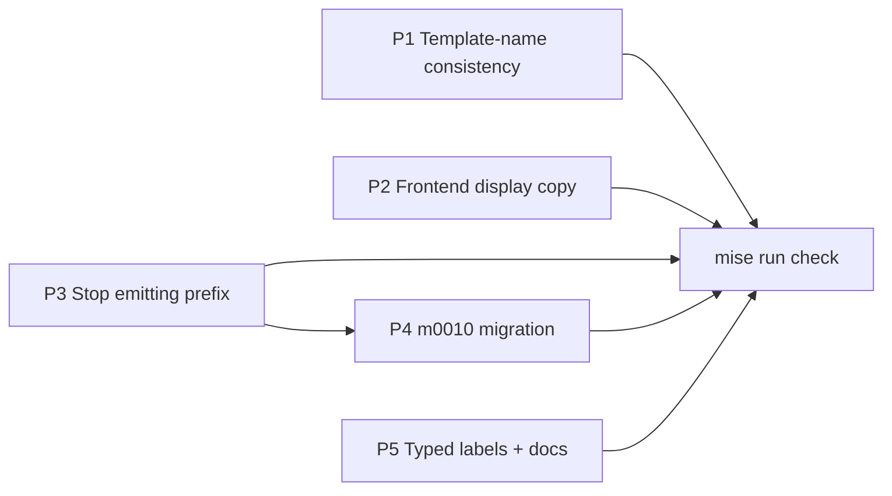

# Complete the Codebase-Research Rename Implementation Plan

## Overview

Finish the "bare `research` → `codebase-research`" doc-type rename by fixing the
non-enforced residue the earlier work left behind. Every compiler- or
test-enforced surface (the Rust registry, frontend key maps, CSS tokens, routes,
parity tables) already reads `codebase-research`; what remains is display copy, a
factual error, template-name consistency in tests/fixtures, a set of typed
doc-type labels, and — the substantive piece — stripping the `Research: ` title
prefix from both what the skill emits and what already exists on disk (a new
`m0010` migration).

## Current State Analysis

The rename is code-only for wire tokens: `m0004` set `type:` frontmatter to
`codebase-research` from birth, so no data migration is owed for the wire key.
The title decision reverses that for titles specifically — stripping the
`Research: ` prefix from ~177 existing corpus documents requires a new migration.

Five namespaces share the word `research`; only the first moves:

| Namespace | Example | Verdict |
|---|---|---|
| Codebase-research doc type | title prefix, template stem, display labels | Move / strip |
| `meta/research/` umbrella dir | `research_codebase`, `research_topics` config keys | Stay |
| `skills/research/` skill namespace | parent of `research-codebase`, `research-topic` | Stay |
| Sibling corpora | `research_issues`, `research_design_*` | Out of scope |
| Generic agents | `researcher`, `web-search-researcher` | Stay |

### Key Discoveries

- **Docs-site skill mirrors are gitignored generated artefacts**, regenerated by
  `mise run docs:generate` from each `SKILL.md`. They never enter a diff — edit
  the `SKILL.md` source only; never hand-edit or commit a mirror.
- **`m0006` is the closest migration precedent** (`cli/migrate/src/migrations/m0006.rs`):
  a frontmatter-value + pre-first-`## ` body-label rewrite over
  `research_codebase`, with all quote-aware and body-anchoring helpers defined
  **inline and module-private** — it does not use `migrations/text.rs`.
- **A tenth migration is cross-cutting.** ~13 `migrate-cli` test files pre-seed
  the applied-ledger with every migration except the one under test, plus
  `applied:`/`pending:` counts; all must gain the `0010-…` id. The
  `cli/migrate/tests/fixtures/public-api.txt` snapshot lists every migration
  struct and must be regenerated.
- **`STEM_TO_GLYPH` resolves by dash-token match** (`template-tier.ts:40`), so a
  key of `codebase-research` still resolves by whole-name match — the rename is a
  clarity fix, not a functional one.
- **Frontmatter-only line-number corrections** from verification: the lifecycle
  test lives at `cli/visualiser/frontend/src/routes/lifecycle/LifecycleClusterView.test.tsx`;
  the visualise/extract-adrs/extract-work-items skills live under nested
  directories (`skills/visualisation/visualise/`, `skills/decisions/extract-adrs/`,
  `skills/work/extract-work-items/`); `configure/SKILL.md:396` is already
  `research_codebase` (not a target).

## Desired End State

New codebase-research documents are titled `{topic}` (no `Research: ` prefix),
existing corpus documents have had the prefix stripped by `m0010`, the
`configure/SKILL.md` template-key error is corrected, template names read
`codebase-research` consistently across tests and fixtures, the frontend shows no
bare "Research" display copy, and typed doc-type / template-type enumerations name
the codebase-research type. `mise run check` and the bare default task exit 0.

Verification: `mise run check` green; `mise run migrate` applies `m0010` and a
second run reports no pending migrations; a freshly generated codebase-research
doc has no `Research: ` prefix; `grep -rn 'title: "Research: ' meta/research/codebase/`
and `grep -rn '^# Research: ' meta/research/codebase/` return nothing after
migration (the broad `Research: ` string still matches the three embedded
template examples the migration deliberately leaves).

## What We're NOT Doing

- **Not renaming the wire token or `DocTypeKey::Research`** — enforced surfaces
  are already migrated; renaming the Rust variant would shift `public-api.txt` and
  every call site for no behavioural gain (0278 decision).
- **Not touching `## Related Research`** — parser-coupled in
  `cli/corpus/src/linkage.rs:52,364`, umbrella over codebase + issue research.
- **Not touching `hasResearch` / `has_research`** — deliberately kept per 0278;
  spans cluster/server/frontend layers and the public-API snapshot.
- **Not rewriting the `research-codebase` skill's own generic "research
  document" nouns** (`SKILL.md` lines 4, 110, 123, 164, 170, 192, 205-206, 210,
  224, 226, 227) — generic self-description, left per scope decision.
- **Not touching the config keys, `meta/research/` dir, `skills/research/`
  namespace, glyph component identifiers, migrations history, or
  `OBSOLETE_LEGACY_KEYS`** — the boundary that must stay.
- **Not folding in sibling work items** (0279/0281/0282) or the epic-0121
  contract reconciliation — tracked separately.
- **Not hand-editing docs-site skill mirrors** — regenerated by `docs:generate`.
- **Not renaming `research-issue/SKILL.md:23`'s `**Research directory**` label**
  — it resolves `research_issues` (the sibling issue-research corpus), deferred
  to that separate work; one bare `**Research directory**` label remains by
  design after this plan.

## Implementation Approach

Five phases, ordered low-risk-first, each leaving `mise run check` green on its
own. Test-driven throughout: where a test encodes the expectation (display copy,
template names, migration behaviour), the test changes first and fails, then the
source change makes it pass. Phase 4 (the migration) is isolated because
registering a tenth migration turns many ledger-seeded tests red until they are
updated in lockstep.

Phase dependencies:



Each phase leaves `mise run check` green on its own, so all five pass CI
independently. That independence is CI-scoped and assumes **sequential**
application: Phase 1 and Phase 5 both edit `skills/config/configure/SKILL.md`
(different lines), so parallel branches would conflict textually. Phase 3
(template stops emitting the prefix) must land **before or with** Phase 4
(migration strips existing docs): `m0010` is applied once, so if it runs before
Phase 3 the template keeps minting `Research: `-prefixed docs the one-shot
migration will never revisit, leaving a permanently split corpus. So P4 must not
be merged or applied to a live repo before P3 lands — the P3-before-P4 numbering
satisfies this, and landing both in one commit (per Migration Notes) removes the
ordering risk entirely.

---

## Phase 1: Template-name consistency (Tier 0 + Tier 2)

### Overview

Correct the one factual error and make every template-name reference in tests,
fixtures, and the frontend map read `codebase-research`. Production already
resolves correctly; this removes the naming lag.

### Changes Required

#### 1. Configure skill — factual key error + filename example

**File**: `skills/config/configure/SKILL.md`
**Changes**: Line 930 lists the template key as `research`; it is
`codebase-research` (contradicts `:396` and `configuration.md:82`). Line 877 is a
template-filename example naming the wrong file.

```diff
- Available template keys: `plan`, `research`, `adr`, `validation`, `pr-description`, `work-item`.
+ Available template keys: `plan`, `codebase-research`, `adr`, `validation`, `pr-description`, `work-item`.
```

```diff
-  research.md        # Custom research template
+  codebase-research.md   # Custom codebase-research template
```

`configure/SKILL.md` has a generated docs-site mirror; regenerate it after
editing: `mise run docs:generate` (gitignored output — do not commit it).

#### 2. Frontend glyph map key

**File**: `cli/visualiser/frontend/src/routes/library/template-tier.ts`
**Changes**: Rename the exact-name shortcut key from `research` to
`codebase-research` (whole-name match still resolves).

```diff
-  research: "codebase-research",
+  "codebase-research": "codebase-research",
```

Two comments in the same file describe resolution in terms of the old `research`
stem and must move with the key, or they misdescribe how `codebase-research` now
resolves (via the exact-name branch, not the token loop):

- In the `STEM_TO_GLYPH` doc comment, drop the `codebase-research ⇒
  codebase-research, because research is a known stem` clause — the adjacent
  `something-plan-review → plan-reviews` example already illustrates the
  rightmost-token rule.
- In `glyphKeyForTemplate`, replace the `codebase-research is a kind of research`
  inline example with a genuinely compound name that still resolves through the
  token loop (e.g. `something-plan-review`).

#### 3. Server synthetic-template test seeds

**Files**: `cli/visualiser/server/src/templates.rs` (lines 442, 446),
`cli/visualiser/server/tests/common/mod.rs:56`,
`cli/visualiser/server/tests/api_related.rs:37`,
`cli/visualiser/server/tests/api_work_item_pattern.rs:42,197`
**Changes**: Replace the bare `research` template name in each seed array /
assertion with `codebase-research`, preserving alphabetical ordering where the
test asserts it (`templates.rs:446` asserts `vec!["adr", "plan", "research"]` →
`vec!["adr", "codebase-research", "plan"]`).

#### 4. Server fixture rename

**File**: `cli/visualiser/server/tests/fixtures/templates/research.md` →
`codebase-research.md`
**Changes**: Rename the fixture. `api_smoke.rs` counts the `.md` files in the
fixture directory at runtime and asserts only that count — it references no bare
`research` template name, so the rename keeps it green with no assertion to
update. Name-level coverage of the rename lives in items 3 and 5, not here.

#### 5. Frontend template-index assertions

**File**: `cli/visualiser/frontend/src/routes/library/LibraryTemplatesIndex.test.tsx`
**Changes**: Update the mock entry (`:53`), the `glyphKeyForTemplate` argument
(`:77`), the name loop (`:197`), and the `stateFor` assertions (`:267-269`) from
`research` to `codebase-research`.

### Success Criteria

#### Automated Verification

- [x] Rust workspace lint/format/types: `mise run cli:check`
- [x] Server checks and tests: `mise run server:check`
- [x] Frontend checks and tests: `mise run frontend:check`
- [x] Server smoke test still green after fixture rename (count-based, not name-level): `cargo test -p accelerator-visualiser-server --test api_smoke` (from `cli/`)
- [x] Docs generation succeeds after the `configure/SKILL.md` edit: `mise run docs:generate`
- [x] Aggregate read-only set: `mise run check`

#### Manual Verification

- [ ] The library templates view still renders the codebase-research glyph.

---

## Phase 2: Frontend display copy (Tier 3)

### Overview

Remove the last bare "Research" strings the UI renders. Canonical labels already
read "Codebase research"; these three are the stragglers.

### Changes Required

#### 1. Lifecycle pipeline step caption + placeholder

**File**: `cli/visualiser/frontend/src/api/types.ts` (lines 313-314)
**Changes**: The step's `docType` is already `codebase-research`; only the display
strings lag.

```diff
-    label: "Research",
-    placeholder: "no research yet",
+    label: "Codebase research",
+    placeholder: "no codebase research yet",
```

#### 2. Lifecycle placeholder test (change first — TDD)

**File**: `cli/visualiser/frontend/src/routes/lifecycle/LifecycleClusterView.test.tsx:155`

```diff
-    expect(screen.getByText(/^No research yet$/i)).toBeInTheDocument();
+    expect(screen.getByText(/^No codebase research yet$/i)).toBeInTheDocument();
```

#### 3. Empty-state plural

**File**: `cli/visualiser/frontend/src/routes/library/empty-descriptions.ts:104`

```diff
-  "codebase-research": "research notes",
+  "codebase-research": "codebase research notes",
```

Add (test-first) an assertion in `empty-descriptions.test.ts` that
`EMPTY_TYPE_PLURALS["codebase-research"]` equals `"codebase research notes"` — the
existing suite covers `TYPE_COPY` but not this map, so the string is otherwise
unpinned and could silently regress.

### Success Criteria

#### Automated Verification

- [x] Frontend checks and tests: `mise run frontend:check`
- [x] Aggregate read-only set: `mise run check`

#### Manual Verification

- [ ] The lifecycle cluster view shows "Codebase research" as the step caption
      and "no codebase research yet" when the step is empty.
- [ ] The library empty state reads "codebase research notes".

---

## Phase 3: Artifact identity — stop emitting the prefix (Tier 1, code side)

### Overview

Make new codebase-research documents born without the `Research: ` title prefix.
This changes only what is generated going forward; existing docs are handled by
Phase 4.

### Changes Required

#### 1. Template title + H1

**File**: `templates/codebase-research.md` (lines 4, 22)

```diff
- title: "Research: {User's Question/Topic}"
+ title: "{User's Question/Topic}"
```

```diff
-# Research: [User's Question/Topic]
+# [User's Question/Topic]
```

Line 58 (`## Related Research`) and line 59 prose are **kept** — do not touch.

#### 2. Skill title-setting line

**File**: `skills/research/research-codebase/SKILL.md:137`

```diff
- - `title:` ← `Research: {User's Question/Topic}`
+ - `title:` ← `{User's Question/Topic}`
```

Regenerate mirrors after editing: `mise run docs:generate` (do not commit the
generated output; it is gitignored).

#### 3. Regression guard for the stripped prefix (write first — TDD)

**File**: a template-shape test co-located with the existing template checks
**Changes**: Assert `templates/codebase-research.md`'s frontmatter `title:` and
H1 begin with the placeholder (`{`/`[`), not `Research: `, so a future edit
cannot silently reintroduce the prefix — the most visible leak this plan removes.

### Success Criteria

#### Automated Verification

- [x] Skill invocation and permission guards: `mise run check`
- [x] Regression guard: the template-prefix assertion is red before the edit, green after
- [x] Docs generation succeeds: `mise run docs:generate`

#### Manual Verification

- [ ] Invoking `research-codebase` produces a document whose frontmatter `title:`
      and H1 have no `Research: ` prefix.

---

## Phase 4: `m0010` migration — strip the prefix from existing docs (Tier 1, data side)

### Overview

Add a mechanical migration that strips the `Research: ` prefix from the
frontmatter `title:` and body H1 of every existing document under
`paths.research_codebase`. Modelled on `m0006`; idempotent by construction.
Registering a tenth migration turns many ledger-seeded tests red — this phase
updates them in lockstep.

### Changes Required

#### 1. New migration module

**File**: `cli/migrate/src/migrations/m0010.rs` (new)
**Changes**: `struct Migration0010` implementing `MigrationMeta`
(`id` = `"0010-strip-research-title-prefix"`, `description`) and `Migration`
(`apply`). Select files via `ctx.config_value("paths.research_codebase")` +
`ctx.dir_exists` + `ctx.list_md_files`; per file `ctx.read` → the transform →
`ctx.write` only when the content changed. Return
`ApplyOutcome::Applied` **even when the corpus directory is absent**, so the
ledger still advances — the property `full_registry_e2e` and `migration_0008`
rely on. Express the resolve/guard/walk/rewrite flow through named helpers
(mirroring `m0006`); do not carry step-listing comments into the code.

Guard the resolved path with `m0006`'s `is_dangerous_path` refusal (reject
empty, `/`, absolute, and `../`-traversal values) before walking, and emit
`m0006`'s operator diagnostics — a `0010: rewrote N file(s)` summary and a
missing-directory warning. The dirty-tree preflight scans a fixed
`meta/`/`.accelerator/` scope and does not follow a corpus configured elsewhere,
and `is_dangerous_path` only rejects *escaping* values (empty, absolute, `../`) —
a wrong-but-in-repo override (e.g. `research_codebase` set to `meta` or the repo
root) passes both. What bounds that case is the content pre-gate below (only
files whose title or H1 literally begins with `Research: ` are rewritten) plus
VCS reversibility, not the path guard.

The rewrite lives in a pure, module-private
`strip_research_title_prefix(content: &str) -> String` (the transform) so its
branches are unit-testable without a filesystem `MigrationContext`. `m0006`'s
quote-aware helpers (`is_double_quoted`, `semantic_inner`, `normalise_value`,
`refuses`) and body-anchoring (`extract_pre_h2` / `saw_first_h2`) are duplicated
inline rather than promoted to `migrations/text.rs`: applied migrations are
immutable history and `text.rs` is a public-API-tracked surface, so sharing
helpers that later evolve would risk silently changing a past migration's
byte-stable behaviour or shifting the public-API snapshot.

The transform applies a **content pre-gate** first: if neither the frontmatter
`title:` nor the pre-first-`## ` H1 carries the `Research: ` prefix, return the
input unchanged (no reconstruction, no write), so prefix-free files stay
byte-identical and line endings are never normalised. The pre-gate computes that
check from the same in-frontmatter `title:` and `!in_frontmatter` positional scan
the rewrite uses, so the "touch this file" and "which lines to strip" decisions
cannot drift. When the prefix is present:

- **Frontmatter**: within the `---`…`---` block only, on a `title:` line whose
  value (after quote-aware unwrapping via `semantic_inner`) begins with
  `Research: `, strip that prefix inside the quotes and re-normalise. Handle
  double-quoted, single-quoted, and unquoted single-line values; carry `m0006`'s
  `refuses` guard so an unquoted value containing `#` or `"` is left
  byte-identical rather than promoting an inline `#` comment into title text.
  Leave block-scalar (`|`/`>`) and continuation-line titles byte-identical (none
  exist today — the intentional, tested no-op for unsupported shapes).
- **Body H1**: guarded by an `!in_frontmatter` check (so a `#`-prefixed
  frontmatter comment can never match) and anchored to the pre-first-`## `
  region via `saw_first_h2` — a **positional** guard, not fence detection —
  rewrite a column-0 line that is exactly `# Research: X` to `# X`. Any
  `# Research:` after the first `## `, or a fenced lookalike in that later
  region, is left alone. A column-0 `# Research:` inside a fence *before* the
  first `## ` would be rewritten; the pre-`## ` region is assumed fence-free by
  the codebase-research template convention (metadata block, then
  `## Research Question`), and a unit test pins that accepted behaviour.
- **Idempotent**: a stripped title no longer begins with `Research: `, so a
  second application of the transform is byte-stable.

#### 2. Registration

**File**: `cli/migrate/src/migrations/mod.rs`
**Changes**: Add `pub mod m0010;` after `pub mod m0009;`. The module doc comment
on lines 1-2 already understates the count ("0001-0006"); rewrite it to describe
the module without enumerating a stale range.

**File**: `cli/migrate/src/registry.rs`
**Changes**: Add `use crate::migrations::m0010::Migration0010;` after the
`Migration0009` import, and `MigrationEntry::Mechanical(Box::new(Migration0010)),`
as the trailing entry in `registry()`.

#### 3. Public-API snapshot

**File**: `cli/migrate/tests/fixtures/public-api.txt`
**Changes**: Regenerate via `mise run public-api:update`; the `Migration0010`
struct and its trait impls appear. Commit the regenerated snapshot.

#### 4. New migration tests (write first — TDD)

**File**: `cli/migrate/src/migrations/m0010.rs` — co-located `#[cfg(test)]` unit
tests over the pure `strip_research_title_prefix`, mirroring `m0006`'s ~20 cases:
a double-quoted `Research: X` title strips to `X`; single-quoted and unquoted
prefixed titles strip (single-quoted re-normalises consistently); an unquoted
title containing `#` or `"` is left byte-identical (`refuses` guard); a
block-scalar / continuation title is byte-identical; near-miss values
(`Researchers: …`, an H2 `## Research:`) never match; a `# Research: X` H1 before
the first `## ` strips while one after it — and a `#`-comment inside the
frontmatter — are left alone; a pre-`## ` fenced `# Research:` lookalike locks the
fence-free-region assumption; a prefix-free document is byte-identical (pre-gate).

**File**: `cli/migrate-cli/tests/migration_0010.rs` (new) — integration cases
over the compiled migration:

- Apply strips both a frontmatter title and a body H1 (combined doc).
- Frontmatter-title-only and body-H1-only docs each strip independently.
- A `# Research:` heading after the first `## ` is left unchanged.
- A repo with no `paths.research_codebase` directory still records `0010` as
  applied (matches `migration_0001`'s empty-repo case and the aggregate suite).
- A dangerous `paths.research_codebase` value (absolute / `../`) is refused, not
  walked.
- Idempotency: apply, drop `0010` from the ledger, re-apply, assert the corpus
  files are byte-identical — drop the ledger entry so `apply` re-executes rather
  than testing the ledger gate, as `m0006`'s byte-stability test does.

#### 5. Cross-cutting ledger + count updates

**Files**: the `cli/migrate-cli/tests/` suite. Each per-migration test seeds the
applied-ledger with every migration except the one under test; a tenth migration
must appear in those seeds, and the aggregate counts shift.

| File | Change |
|---|---|
| `migration_0001.rs` … `migration_0006.rs` | Add `0010-…` to every ledger list — including inline per-test seeds and assertions (see note below the table) |
| `migration_0007.rs` | Add `0010-…` to the two seed lists (interactive; no count) |
| `migration_0008.rs` | Add `0010-…` to `already_applied_except_0008()`; guard `a_second_run_reports_no_pending` |
| `migration_0009.rs` | Add `0010-…` to `LEDGER_THROUGH_0008` |
| `skip_unskip_unapply.rs` | Add `0010-…` to the `0002-0009` seeds; `applied: 1` stays correct |
| `no_pending_and_help.rs` | Add `0010-…` to `fully_applied_project()` full ledger |
| `dirty_tree_preflight.rs` | Add `0010-…` to `mark_all_migrations_applied()` + the inline seed |
| `full_registry_e2e.rs` | Add `0010-…` to the expected-ids list; `applied: 8` → `applied: 9` (line 59); refresh the stale `//! …7-migration registry` doc comment (line 1) without a hard-coded count |

The `0001`–`0006` row is not one helper per file: `migration_0002.rs` seeds the
ledger inline in six tests and `migration_0006.rs` in three, and
`migration_0001.rs`'s `matches_the_golden_byte_for_byte` asserts the resulting
ledger **byte-for-byte** — `0010-…` must appear there in application order, not
only in `already_applied*` seeds. `migration_0002.rs`'s
`no_project_token_in_pattern_is_a_no_op_pending` asserts an exact `applied: 0;
pending (no-op): 1.` count that breaks if `0010` leaks into pending from a missed
seed. Follow-up (out of scope here): derive these seeds from `registry()` via a
shared all-ids-except-target helper so future migrations become a one-line
change.

Three files need no seed change but should be confirmed green rather than
assumed. `cli/migrate-cli/tests/list_and_decisions_file.rs` and the exact-match
`--list` test in `skill_doc_worked_example.rs` both stay green because a
mechanical migration never surfaces in `--list`. The second test in
`skill_doc_worked_example.rs` — which applies every remaining pending migration
end-to-end — stays green because `0010` is a no-op without a
`meta/research/codebase/` dir and its assertions are substring-based.
`discoverability_hook.rs` seeds no ledger and makes no count or id assertion. No
new `fixtures/0010/` tree (retired bash-golden provenance the Rust tests do not
replay). No visualiser-fixture edits (those fixtures carry no `Research: `
prefix).

### Success Criteria

#### Automated Verification

- [x] New migration test passes: `cargo test -p migrate-cli --test migration_0010` (from `cli/`)
- [x] Full migrate suite passes: `cargo test -p migrate-cli` (from `cli/`)
- [x] Public-API snapshot matches: `mise run public-api:check`
- [x] Rust workspace checks: `mise run cli:check`
- [x] Aggregate read-only set: `mise run check`

#### Manual Verification

- [ ] `mise run migrate` applies `0010-strip-research-title-prefix`; a second run
      reports no pending migrations.
- [ ] ⚠️ After applying on the live repo the working tree is dirty (real corpus
      files rewritten, including this plan's source research doc) — that is the
      migration working, not a preflight fault.
- [ ] Review the full `jj diff meta/research/codebase/` before committing and
      confirm only intended `Research: ` prefixes were stripped — the run is a
      de-facto dry-run only because it is idempotent and VCS-reversible; do not
      use `ACCELERATOR_MIGRATE_FORCE` for m0010.
- [ ] `grep -rn 'title: "Research: ' meta/research/codebase/` returns nothing.

---

## Phase 5: Typed doc-type labels + enumerations (Tier 4)

### Overview

Rename the labels that name the codebase-research type in a typed slot: the
`**Research directory**` skill labels, the template cross-references, and the
typed doc-type / template-type enumerations. Leave generic verb and
self-description prose. The rule separating the two: any slot that names the
codebase-research **doc type** — a typed reader/template slot, or a
comma-separated doc-type enumeration list — moves to `codebase research`; only
umbrella `meta/research/` directory references, the `research → plan → implement`
phase spine, and verb usage ("research the codebase") stay. §4 lists the
doc-type enumerations that move and, beside them, the umbrella and
generic-source `research` lines that deliberately stay, so the site cannot end up
saying "codebase research" on one page and bare "research" on another for the
same type.

### Changes Required

#### 1. "Research directory" labels

**Files**: `skills/research/research-codebase/SKILL.md:24`,
`skills/config/init/SKILL.md:22`,
`skills/visualisation/visualise/SKILL.md:16`,
`skills/decisions/extract-adrs/SKILL.md:27`,
`skills/work/extract-work-items/SKILL.md:28`
**Changes**: Each sits beside `**Plans directory**` / `**Decisions directory**`
and now names one of two research directories.

```diff
- **Research directory**: !`accelerator config path research_codebase --fail-safe`
+ **Codebase research directory**: !`accelerator config path research_codebase --fail-safe`
```

#### 2. Template cross-reference labels

**Files**: `templates/plan.md:124`, `templates/work-item.md:84`,
`templates/adr.md:62`
**Changes**: The path already commits to `meta/research/codebase/`; align the
label.

```diff
- - Related research: `meta/research/codebase/[relevant].md`
+ - Related codebase research: `meta/research/codebase/[relevant].md`
```

```diff
- - Research: `meta/research/codebase/YYYY-MM-DD-topic.md`
+ - Codebase research: `meta/research/codebase/YYYY-MM-DD-topic.md`
```

```diff
- - `meta/research/codebase/YYYY-MM-DD-topic.md` — Related research
+ - `meta/research/codebase/YYYY-MM-DD-topic.md` — Related codebase research
```

#### 3. Template-type enumerations (template stem form)

**File**: `skills/config/configure/SKILL.md` (lines 100, 884)
**Changes**: These name templates in a typed list; use the template stem.

```diff
-   templates (plan, ADR, research, validation formats), and per-skill
+   templates (plan, ADR, codebase-research, validation formats), and per-skill
```

```diff
- All templates — both skill structure templates (plan, ADR, research,
+ All templates — both skill structure templates (plan, ADR, codebase-research,
```

#### 4. Doc-type enumerations (label form)

**Files**: `docs-site/src/content/docs/configuration.md:70`,
`docs-site/src/content/docs/visualiser.md:13`,
`docs-site/src/content/docs/visualiser.md:22`,
`docs-site/src/content/docs/index.mdx:45` (the home-page visualiser doc-type
list), `docs-site/src/content/docs/getting-started.mdx:148` (the
visualiser-rendered doc types), `docs-site/src/content/docs/meta-directory.mdx:116`
(whose line 24 already reads "codebase research documents", so the page
contradicts itself), and `cli/visualiser/frontend/README.md:3`.
**Changes**: Each names the codebase-research doc type in a comma-separated prose
list; change the bare `research` item to the label form "codebase research".
These are the enumerations of the visualiser's browsable doc types; move them
together so the site cannot say "codebase research" on one page and bare
"research" on another for the same type. For `meta-directory.mdx:116`, first
confirm the issue-research documents' lifecycle is stated elsewhere on the page
(its `research/` tree also holds `issues/`), so narrowing the line to "codebase
research documents" does not drop the only lifecycle statement covering them.

Leave these bare `research` references — they name the umbrella corpus or generic
source, not the doc type: `getting-started.mdx:43` (the `meta/research/` tree
`/init` scaffolds), `skills/adrs.md:25` and `skills/work-items.md:33` (the
extract-* skills mine the whole research corpus and generic source material such
as specs and PRDs), and the artefact-trail lists in `case-study.md` and
`philosophy.md`. Do not point any docs-site edit into `reference/skills/` — that
tree is the gitignored generated mirror.

```diff
- ... research, validation reports, PR descriptions). ...
+ ... codebase research, validation reports, PR descriptions). ...
```

```diff
- | **Library**   | Markdown reader for every doc type (plans, research, ADRs, work items …)   |
+ | **Library**   | Markdown reader for every doc type (plans, codebase research, ADRs, work items …)   |
```

```diff
- ... a meta-directory inspector (research, plans, decisions, work items, etc.) ...
+ ... a meta-directory inspector (codebase research, plans, decisions, work items, etc.) ...
```

```diff
- ... every document type in `meta/` — plans, research, ADRs, work items, ...
+ ... every document type in `meta/` — plans, codebase research, ADRs, work items, ...
```

```diff
- ... Research documents, reviews, validations, and PR descriptions ...
+ ... Codebase research documents, reviews, validations, and PR descriptions ...
```

After editing, rewrap `configuration.md:70` to stay under 80 columns and re-pad
the `visualiser.md:13` table cell and its separator row so the columns stay
aligned — no markdown formatter guards line width here.

The §1–3 `SKILL.md` edits each need `mise run docs:generate` afterwards
(gitignored mirror output — do not commit it); §4's `docs-site/` and README edits
are committed source, gated by `docs:check`.

### Success Criteria

#### Automated Verification

- [ ] Skill guards (bare-invocation, permissions): `mise run check`
- [ ] Docs generation succeeds: `mise run docs:generate`
- [ ] Docs gate (when touching `docs-site/`): `mise run docs:check`

#### Manual Verification

- [ ] Each affected skill's context block reads "Codebase research directory".
- [ ] The visualiser and configuration docs list "codebase research" among doc
      types; no bare "research" doc-type label remains in the touched lines.

---

## Testing Strategy

### Unit / component tests

- **Migration** (unit tests in `m0010.rs` + integration in `migration_0010.rs`):
  the pure `strip_research_title_prefix` covers quote variants (double / single /
  unquoted, plus the `refuses` guard for unsafe unquoted values), the
  block-scalar no-op, near-miss prefixes, and positional pre-`## ` H1 anchoring;
  integration covers title-only / H1-only / combined strips, a missing corpus
  directory still recording `Applied`, a dangerous path refused, and
  ledger-drop idempotency (byte-stable re-apply).
- **Frontend** (`LibraryTemplatesIndex.test.tsx`, `LifecycleClusterView.test.tsx`):
  updated expectations are the spec — change the assertion, watch it fail, then
  change the source.
- **Server** (`templates.rs`, `api_smoke.rs`, `api_related.rs`,
  `api_work_item_pattern.rs`): template-name seeds and the renamed fixture drive
  the assertions.

### Integration tests

- **Full registry** (`full_registry_e2e.rs`): the whole chain from a pristine
  repo now applies ten migrations (`applied: 9; pending (no-op): 1`, 0002 remains
  the sole no-op-pending).
- **Preflight / ledger** (`dirty_tree_preflight.rs`, `no_pending_and_help.rs`,
  `skip_unskip_unapply.rs`): a fully-applied ledger includes `0010-…`.

### Manual testing steps

1. Generate a codebase-research doc via `research-codebase`; confirm no
   `Research: ` prefix in title or H1.
2. Run `mise run migrate`; confirm `0010-…` applies and a second run is a no-op.
3. Open the visualiser library and lifecycle views; confirm "Codebase research"
   labels and empty-state copy.

## Migration Notes

`m0010` is destructive on the live repo: it rewrites ~177 corpus files (all
double-quoted, uniform `title: "Research: …"`), including this plan's source
research document. It is idempotent and refuses to run on a dirty tree
(preflight). After running, `mise run` will show a dirty tree — expected. The
three on-disk exceptions to the title pattern are embedded template examples in
doc bodies, which the migration never touches (it rewrites only the document's own
frontmatter and pre-`## ` H1).

Recovery: a mid-walk failure leaves each file fully-old or fully-new (atomic
per-file writes) and the migration pending (the ledger advances only on success).
The sanctioned recovery is to discard the partial rewrite (`jj restore
meta/research/codebase/`, or `git restore meta/research/codebase/`) and re-run on
a clean tree; the migration is idempotent, so the re-run redoes the whole corpus
safely. Do not rely on an in-place manifest resume: the preflight gates
resumption on the recorded run-id matching the current revision, and under jj the
working-copy revision can shift once the partial edits are snapshotted, flipping
the guard to a dirty-tree refusal — and `ACCELERATOR_MIGRATE_FORCE` is not the
recovery path for m0010 (see Manual Verification). Keep the apply and the
resulting corpus rewrite in a single, clearly-labelled commit so the before/after
is auditable in one place — this plan's own driving research document is rewritten
by the run, so its original title then survives only in VCS history.

## References

- Original work item: `meta/work/0278-*.md`
- Driving research: `meta/research/codebase/2026-09-12-0278-complete-codebase-research-rename.md`
- Migration precedent: `cli/migrate/src/migrations/m0006.rs`
- Migration context API: `cli/migrate/src/ports.rs:69-272`
- Registry insertion points: `cli/migrate/src/registry.rs:70-82`, `cli/migrate/src/migrations/mod.rs:4-13`
- Public-API snapshot: `cli/migrate/tests/fixtures/public-api.txt`; regen `tasks/public_api.py`
