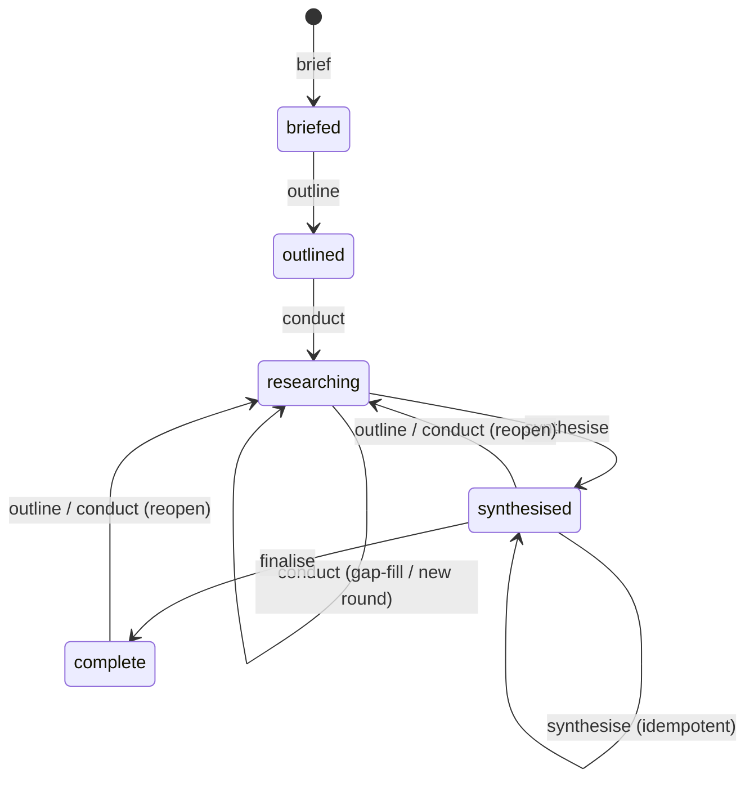

# Iterative Accretion and Finalise Implementation Plan

## Overview

Grow a topic-research subject's knowledgebase across multiple rounds without
clobbering earlier findings, and close it off once researched. This is Slice 2
of the topic-research skillset (0121), extending the single-round engine shipped
in 0277. It adds next-round outline appending, gap-detection `conduct`
re-invocation, wholesale multi-round synthesis under anti-changelog discipline,
the full five-state `status` lifecycle with reopen regression, and a new
`finalise` verb.

The whole slice is a **prose change to one file**,
`skills/research/research-topic/SKILL.md`, plus a committed multi-round test
fixture and its golden. The frontmatter contract already admits every state and
field this slice writes — it landed with 0278 — so no Rust, schema, or template
change is required.

## Current State Analysis

`skills/research/research-topic/SKILL.md` is the entire engine: one skill, four
verbs (`brief`, `outline`, `conduct`, `synthesise`) dispatched on argument,
breadth 8 / depth 1 hardcoded. It runs a strict linear state machine —
`briefed → outlined → researching → synthesised` — with tight preconditions and
no way to re-enter a state or reach `complete`.

Where each verb stands today, and what 0279 changes:

| Verb | Today (0277) | 0279 change |
|---|---|---|
| `outline` | Writes `## Round 1`; precond `status: briefed` | Append `## Round N+1` when highest round conducted, else revise in place; widen precond; reopen-regress |
| `conduct` | Injects constant `round 1`, hardcodes `round_count: 1`; precond `status: outlined` | Inject real round N; derive `round_count` from findings; gap-fill across rounds; widen precond; reopen-regress |
| `synthesise` | Sets `synthesised`, flips `primary` | Wholesale rewrite over all rounds; stamp `rounds_covered = round_count`; keep `primary` on reopen |
| `finalise` | Absent | New verb: refuse unless `synthesised` (naming current status), else set `complete` |

The governing discipline every transition must preserve
(`SKILL.md:204-217`): write and validate content **first**, edit `manifest.md`
as the **final step**, re-validate the manifest after each in-place edit, and
reconcile counts to what is actually on disk.

### Desired End State

The engine runs an iterative loop and closes it:



Verified when: a subject can be briefed, outlined, conducted, re-outlined into a
second round, conducted again, synthesised into one standalone dossier, and
finalised; a later `outline` or `conduct` reopens the finalised set to
`researching`; and the committed multi-round fixture validates clean under
`accelerator corpus frontmatter validate`.

### Key Discoveries

- **The schema already admits all five states.** The `(topic-research,
  manifest)` `status_vocab` is
  `["briefed", "outlined", "researching", "synthesised", "complete"]`
  (`cli/corpus/src/frontmatter_validation/schema.rs:194-200`); `rounds_covered`
  and `round` already exist on their rows (`schema.rs:226,235`). 0279 writes
  values the contract accepts.
- **Extras are presence-checked only.** No numeric or cross-field check exists
  on `round_count`, `finding_count`, `round`, or `rounds_covered`
  (`cli/corpus/src/frontmatter_validation/mod.rs:371-386`). The validator cannot
  catch a count that disagrees with the findings on disk — correctness is the
  skill's responsibility, and a count-mismatch negative test would pass
  misleadingly.
- **No CLI mutates a manifest.** The `accelerator corpus` surface is read-only
  (`cli/corpus-cli/src/cli.rs:17-51`); `finalise` and reopen-regression are the
  skill hand-editing `manifest.md`, then validating.
- **`SKILL.md` has real convention guards.** `lint:bare-invocation:check`,
  `lint:skill-permissions:check`, `lint:dispatch-coherence:check`, and
  `test:integration:skill-invocation` run over `skills/**/SKILL.md`. They check
  invocation conventions, not behaviour, but give a green/red signal per phase.
- **`finalise` needs no new tools.** It reuses `corpus resolve`,
  `metadata derive`, and `frontmatter validate`, all already in `allowed-tools`
  (`SKILL.md:9-13`), so it adds no `!`-preprocessor invocation and no dispatched
  sub-binary — the permission and dispatch-coherence lints stay green.
- **0277 parked the re-invocation tests here.** Finding immutability and
  gap-detection were asserted but not exercised in Slice 1
  (`meta/work/0277-single-round-web-research-engine.md:230-232`); 0279 owns
  them.

## What We're NOT Doing

- **No schema, template, or Rust change.** Not touching
  `cli/corpus/src/frontmatter_validation/schema.rs`, `templates-schema.tsv`, the
  five `templates/topic-research-*.md` files, or the frontend status-vocab
  fixture `cli/corpus/tests/fixtures/topic-research-status-vocab.json`. The
  vocab is unchanged, so none needs regeneration.
- **No stored staleness field.** Staleness is derived from the `status`
  lifecycle. Adding a `stale` field would reintroduce the dual source of truth
  the 0278 manifest-status collapse removed.
- **No recursion.** The loop stays at depth 1 (one researcher per focus area).
  Intra-finding recursion at `depth > 1` is the separate child 0283. Two
  invariants keep the `round_count` derivation and the `outline` append/revise
  decision well-defined once 0283 nests findings within a focus area: every
  finding, at any depth, carries a `round` stamp; and every finding stays
  enumerable by the derivation's finding scan — if 0283 nests findings under a
  subdirectory rather than the flat `findings/<nn>-*.md` layout, that scan needs
  a layout-agnostic restatement.
- **No override flags.** Depth/breadth tunability is 0282, which wires flags
  into this loop later.
- **No automated behavioural eval suite.** No `research-topic` eval suite exists
  today; authoring one is owned by 0161 (roll out Inspect evals across the
  remaining skills), itself blocked by the 0160 Inspect tier. 0161 is a
  catalogue-wide hardening that lands after the topic-research epic (0121) is
  complete — it gates nothing in this epic, and 0279 does not depend on it.
  Behavioural criteria are verified manually within 0279 (see Testing Strategy);
  the eval suite retroactively automates them later.
- **No `conduct` write-scope assertion.** The deferred hardening at
  `SKILL.md:219-226` stays deferred; the compensating control remains human
  commit review of a VCS-tracked tree.

## Implementation Approach

The phases are sequentially mergeable in a fixed order, each leaving the skill
internally consistent and the full suite green. Because the executor of these
verbs is the model running prose against live web — not compiled code — the
phases are ordered so no intermediate can *corrupt* a set (lose a finding,
freeze a count, or stamp an immutable `round` wrong), even though the
user-facing feature is incomplete until all five land.

Two ordering constraints are load-bearing:

1. **`conduct` before `outline`-append.** `conduct` must inject the real round
   and derive `round_count` *before* `outline` can append a second round;
   otherwise a conducted new round would be stamped `round: 1` with a frozen
   `round_count`, corrupting the immutable ledger.
2. **Reopen and `finalise` last.** Both depend on the widened verbs and the
   multi-round synthesis already being in place, so they close the loop in the
   final phase.

One intermediate is deliberately tolerated as non-corrupting: between Phase 3
and Phase 4, synthesising a two-round set stamps `rounds_covered: 1` (the
template default) rather than `2`. This is reader-facing provenance, not data
loss, and the next `synthesise` after Phase 4 corrects it.

Phase-to-criterion coverage:

| Phase | Acceptance criteria |
|---|---|
| 1 — Multi-round fixture | Contract guard for AC5, AC6 outputs |
| 2 — `conduct` accretion | AC3, AC4; AC7 (`conduct` transition) |
| 3 — `outline` accretion | AC1 (append), AC2 (revise); AC7 (`outline` transition) |
| 4 — `synthesise` multi-round | AC5, AC6; AC7 (`synthesise` transition) |
| 5 — Reopen + `finalise` | AC1/AC2 (status), AC7 (`finalise`), AC8, AC9, AC10, AC11 |

---

## Phase 1: Multi-round contract fixture and golden

### Overview

Land the committed multi-round reference set first: a two-round topic-research
set and a golden asserting it validates clean. This is a test-only change,
independent of `SKILL.md`. Its value is a canonical multi-round example and the
co-landing anchor for Phase 4's `rounds_covered: 2` output — not behavioural
coverage: extras are presence-checked only (`mod.rs:371-386`), so the golden
proves the multi-round shapes are individually valid, not that any count is
correct. Per the fixture-location decision, it is a **sibling** set — the
single-round `topic-research-set/` and its ~10 negative-case goldens are left
untouched.

### Changes Required

#### 1. New multi-round fixture set

**Files**: `cli/corpus-cli/tests/fixtures/topic-research-multiround-set/`

Author a complete two-round set mirroring the shapes of the existing
single-round fixture:

- `manifest.md` — `status: synthesised`, `round_count: 2`, `finding_count: 3`,
  `primary: synthesis.md`, `id`/`slug` `example-multiround-subject`.
- `brief.md` — `status: complete`, `source_profiles: ["web"]`.
- `outline.md` — a `## Round 1` section with two `- [x]` focus areas and a
  `## Round 2` section with one, so `finding_count` (3) and `round_count` (2)
  deliberately diverge — a shape where the count cross-check can tell a
  `max(round)` derivation from a file count.
- `findings/01-first-focus.md` — `round: 1`.
- `findings/02-second-focus.md` — `round: 1`.
- `findings/03-third-focus.md` — `round: 2`.
- `synthesis.md` — `rounds_covered: 2`, standalone prose drawing on all three
  findings, no per-round headings and no round-sequencing language.

The synthesis and finding bodies must read as one current dossier: no "in the
first round", no "Round 2 added" (AC6). The `round` frontmatter stamp is the
only round ledger.

#### 2. Golden asserting clean validation

**File**: `cli/corpus-cli/tests/frontmatter_goldens.rs`
**Changes**: Add a `topic_research_multiround_set()` path helper alongside the
existing `topic_research_set()` (`:408-411`), and a test named exactly
`the_committed_topic_research_multiround_set_validates_clean` — matching the
helper and fixture-directory word order — mirroring
`the_committed_topic_research_set_validates_clean` (`:430-452`), that validates
all six members via explicit `frontmatter validate --file`.

```rust
fn topic_research_multiround_set() -> PathBuf {
    PathBuf::from(env!("CARGO_MANIFEST_DIR"))
        .join("tests/fixtures/topic-research-multiround-set")
}
```

Clean validation proves shape, not count correctness — the validator
presence-checks extras only (`mod.rs:371-386`). Add a second, deterministic
cross-check test, `the_committed_topic_research_multiround_set_counts_agree_with_disk`,
that parses the fixture frontmatter and asserts the derivation rule directly:
`round_count` equals the highest `round` stamped across the finding files (`2`),
`finding_count` equals the number of finding files on disk (`3`), and
`synthesis.md`'s `rounds_covered` equals `round_count`. Because the fixture is
shaped so the file count (3) and the highest round (2) differ, this test
distinguishes a `max(round)` derivation from a file count — a degenerate fixture
where all three were equal could not.

Add a third fixture and cross-check for the drift-prone quarantine-exclusion arm,
`a_quarantined_invalid_finding_is_excluded_from_round_count`: a sibling set whose
highest valid finding is `round: 2` but which also carries a dot-prefixed
`.<nn>-<slug>.md.invalid` marker stamped `round: 3`, asserting the derived
`round_count` is `2`, not `3`. The gap-fill (round_count unchanged) and empty-set
(`round_count: 0`) arms are behavioural — what `conduct` writes — so they stay in
manual verification, not the static cross-check. Together the two cross-checks
lock the exemplar's terminal counts and the `.invalid` exclusion against drift —
the automated guards available under the no-harness constraint; they cannot
exercise `SKILL.md` execution. Factor the round scan both share —
`highest_round(dir, exclude_invalid)` — into one helper alongside
`topic_research_multiround_set()`, so the two drift-guards derive from the same
code.

Add a positive `complete`-status golden, `a_manifest_at_the_complete_lifecycle_end_validates`.
0279 is the first slice to write `status: complete` to a real manifest, but the
corpus suite pins a positive validation test only for `briefed` (mirror
`a_manifest_at_the_briefed_lifecycle_start_validates`). Flip the fixture manifest
to `status: "complete"` and assert clean validation, so the enum value 0279 newly
writes has a positive contract anchor on the validator side.

### Success Criteria

#### Automated Verification

- [x] Whole golden suite green, including the new multi-round validation, the two count cross-checks (counts-agree-with-disk and quarantine-exclusion), and the `complete`-status test: `cargo test -p accelerator-corpus --test frontmatter_goldens` — confirm the reported test count rose by four, since a name-filtered `cargo test` exits 0 even when it matches nothing.
- [x] Existing single-round goldens unchanged and green (same run).
- [x] Rust workspace check passes: `mise run cli:check`
- [x] Full read-only check passes: `mise run check`

#### Manual Verification

- [x] Reading `synthesis.md` and all three findings, no per-round headings or
      round-sequencing language appears (AC6) — including the cross-round
      `03-third-focus`, the one most tempted toward round-sequencing prose.
      (Count/round agreement with disk is now locked by the deterministic
      cross-check tests above, not verified by hand.)

---

## Phase 2: `conduct` gap-fill, real round injection, and count derivation

### Overview

Make `conduct` multi-round-aware: research only outstanding focus areas across
every round, inject each focus area's real round number, and derive
`round_count` from the findings on disk instead of hardcoding `1`. Widen its
precondition to accept a set already `researching` so a second `conduct` works.
Reopen-regression from `synthesised`/`complete` is deferred to Phase 5.

### Changes Required

#### 1. Widen the `conduct` precondition

**File**: `skills/research/research-topic/SKILL.md`
**Changes**: In the Shared Preamble precondition list (`:63-73`), accept
`researching` as well as `outlined`.

```diff
-- `conduct` requires the manifest's `status: outlined` and an `outline.md`
-  with at least one focus area.
+- `conduct` requires the manifest's `status: outlined` or `researching`, and
+  an `outline.md` with at least one focus area.
```

#### 2. Inject the real round number

**File**: `skills/research/research-topic/SKILL.md`
**Changes**: In the `conduct` section (`:134-141`), replace the constant round
with the focus area's own round — the `## Round N` heading it sits under.

```diff
-- the focus question, the round number (`1`), the derived timestamp and author
+- the focus question, the round number of the `## Round N` heading the focus
+  area sits under, the derived timestamp and author
```

#### 3. Gap-fill across all rounds and derive `round_count`

**File**: `skills/research/research-topic/SKILL.md`
**Changes**: Extend the reconcile-first loop (`:122-131`) so it scans checkboxes
and findings across every `## Round N` section rather than a single round — the
current wording is already round-agnostic, so this is added behavioural intent,
not a text substitution. In the final manifest edit (`:159-164`), derive
`round_count` as the highest `round` stamped on any retained, validated finding
on disk, and keep `finding_count` as the count of retained, validated findings.

```diff
-Then edit `manifest.md` as the final step to base `status: researching`,
-`round_count: 1`, and `finding_count` set to the count of **retained,
-validated** findings — never the raw focus-area count. Each finding carries
-`kind: finding`, `round: 1`, its focus area's `question`, and `source_profile:
-web`.
+Then edit `manifest.md` as the final step to base `status: researching`;
+`round_count` set to the highest `round` stamped on any **retained, validated**
+finding on disk (the visible `<nn>-*.md` files, excluding any dot-prefixed
+`.invalid` quarantine marker, which still carries a `round:` stamp); and
+`finding_count` set to the count of those same retained, validated findings —
+never the raw focus-area count. When no finding is on disk, leave `round_count`
+at the brief-time default `0`. A gap-fill within an existing round leaves
+`round_count` unchanged; conducting a newly appended round raises it. Each
+finding carries `kind: finding`, its focus area's injected `round` (not a
+constant `1`), its focus area's `question`, and `source_profile: web`.
```

#### 4. State the count-derivation rule once, canonically

**File**: `skills/research/research-topic/SKILL.md`
**Changes**: Extend the **Validate every write** section (`:204-217`), which today
reconciles only `finding_count`, to carry the full disk-derivation rule as the
single source of truth: `finding_count` is the count of visible `<nn>-*.md` files
(excluding dot-prefixed `.invalid` markers); `round_count` is the highest `round`
stamped across those same files, or `0` when none. `conduct` and `synthesise`
apply this rule to **write** the counts on their final manifest edit; `finalise`
applies the same rule as a **read-only compare before** its edit (its freshness
gate — it writes only `status`/`last_updated`, never the counts). Stating the
rule once keeps these sites from drifting.

### Success Criteria

#### Automated Verification

- [x] Skill-permission census passes (no new invocation added): `mise run lint:skill-permissions:check`
- [x] Bare-invocation guard passes: `mise run lint:bare-invocation:check`
- [x] Skill `!`-site commands still bootstrap: `mise run test:integration:skill-invocation`
- [x] Full read-only check passes: `mise run check`

#### Manual Verification

- [ ] On a pre-seeded scratch set (seeded from the committed multi-round
      fixture) where some focus areas already have findings and others do not,
      `conduct` writes findings only for the outstanding areas and leaves every
      existing finding file byte-identical — confirmed by a clean VCS diff over
      the pre-existing finding paths (AC3).
- [ ] A reconcile-only `conduct` (all findings pre-seeded, so it spawns no
      researcher) leaves every finding byte-identical and only reconciles
      checkboxes and counts, proving immutability deterministically without live
      web.
- [ ] After that run, each focus area with a validating finding shows `- [x]`,
      `finding_count` equals the finding files on disk, `round_count` equals the
      highest `round` stamped, and base `status` is `researching` (AC4, AC7).
- [ ] A gap-fill `conduct` within Round 1 leaves `round_count` unchanged; a
      `conduct` of a Round 2 that has findings raises it to `2` (AC4).
- [ ] An attended live-web `conduct` stamps the injected round into each new
      finding's `round:` slot.

---

## Phase 3: `outline` next-round appending and pending-round revision

### Overview

Make `outline` accrete rounds: append a `## Round N+1` checklist when the
highest round has been conducted, and revise the highest round in place when it
is still pending. Widen its precondition to re-outline an `outlined` or
`researching` set. Update the skill's framing from single-round to iterative.
Reopen-regression from `synthesised`/`complete` is deferred to Phase 5.

### Changes Required

#### 1. Widen the `outline` precondition

**File**: `skills/research/research-topic/SKILL.md`
**Changes**: In the Shared Preamble (`:63-73`), accept `outlined` and
`researching` as well as `briefed`.

```diff
-- `outline` requires the manifest's `status: briefed`.
+- `outline` requires the manifest's `status: briefed`, `outlined`, or
+  `researching`.
```

#### 2. Append vs revise

**File**: `skills/research/research-topic/SKILL.md`
**Changes**: Rewrite the `outline` section (`:109-118`) so it branches on the
highest round's state.

```markdown
Determine whether the highest `## Round N` has been conducted by reading the
`round:` frontmatter stamp on each **retained, validated** finding —
finding-existence is ground truth, never the outline checkbox (a checkbox can
lie after a reopen or a hand edit), and a dot-prefixed `.invalid` quarantine
marker does not count as a conducted finding:

- On a `briefed` set there is no `outline.md` yet: write a fresh `## Round 1`
  checklist. There is nothing to append to or revise.
- If at least one retained, validated finding on disk is stamped `round: N` (a
  conducted round), append a new `## Round N+1` checklist of outstanding focus
  areas below it — even if Round N still has unresearched focus areas, since a
  later gap-fill `conduct` sweeps stragglers across all rounds. Leave every
  earlier round's heading and items unchanged.
- If no finding is stamped `round: N` (a pending round not yet conducted),
  revise that round's checklist in place. Append no new round — never append
  past the highest pending round.

Report the outcome taken — `wrote Round 1`, `appended Round N+1`, or `revised
Round N in place` — so the branch that fired is observable from the invocation.

Scale each round's focus areas to the subject under the breadth ceiling of 8 —
never write a ninth focus area in a single round. The ceiling is per round, so
an accreting set may exceed eight focus areas across rounds.
```

Status on the final manifest edit: `briefed → outlined` on the first outline;
otherwise leave `status` unchanged (`outlined` stays `outlined`, `researching`
stays `researching`). `outline` never advances `round_count`.

#### 3. Iterative framing

**File**: `skills/research/research-topic/SKILL.md`
**Changes**: Update the engine description (`:44`) from "single-round topic
research" to "iterative topic research", and rewrite the breadth framing (`:48`)
from "at most eight focus areas, ever" to "at most eight focus areas per round"
so the ceiling is unambiguous once rounds accrete. Leave depth 1 unchanged
(recursion is 0283).

### Success Criteria

#### Automated Verification

- [x] Skill-permission census passes: `mise run lint:skill-permissions:check`
- [x] Bare-invocation guard passes: `mise run lint:bare-invocation:check`
- [x] Skill `!`-site commands still bootstrap: `mise run test:integration:skill-invocation`
- [x] Full read-only check passes: `mise run check`

#### Manual Verification

- [ ] Given the highest `## Round N` has ≥1 finding, `outline` appends a
      `## Round N+1` checklist, leaves earlier rounds unchanged, and leaves
      `status` at `researching` (AC1).
- [ ] Given the highest `## Round N` has no findings, `outline` revises Round N
      in place, appends no new round, and leaves `status` unchanged —
      `outlined` if the set was `outlined` (AC2).
- [ ] The first `outline` on a `briefed` set lands base `status: outlined` (AC7).
- [ ] `outline` reports the branch it took (`wrote Round 1` / `appended Round
      N+1` / `revised Round N in place`).
- [ ] A brief→outline→conduct→outline→conduct→synthesise loop produces a
      two-round set end to end on a pre-seeded scratch set.

---

## Phase 4: `synthesise` multi-round wholesale rewrite

### Overview

Make `synthesise` rewrite `synthesis.md` wholesale over all findings across
rounds, stamp `rounds_covered` equal to `round_count`, and be idempotent. Widen
its precondition to allow an idempotent re-synthesise of an already
`synthesised` set.

### Changes Required

#### 1. Widen the `synthesise` precondition

**File**: `skills/research/research-topic/SKILL.md`
**Changes**: In the Shared Preamble (`:63-73`), state the state requirement
alongside the finding requirement.

```diff
-- `synthesise` requires at least one finding under `findings/`.
+- `synthesise` requires the manifest's `status: researching` or `synthesised`
+  (an idempotent re-synthesise) and at least one finding under `findings/`.
```

This adds a status gate to 0277's findings-only precondition — a deliberate
narrowing, not a widening: a `complete` set carrying findings can no longer be
synthesised directly but must first be reopened to `researching` by an
`outline`/`conduct`. No normal workflow produces a findings-bearing set outside
`researching`/`synthesised` (a `conduct` always lands `researching`), so the
practical break surface is nil. The one edge is a set left findings-bearing under
a still-`outlined` manifest by a mid-`conduct` crash: the new precondition
refuses a direct `synthesise`, but `conduct`'s reconcile-first step repairs the
manifest to `researching` on its next run — so the refusal is self-healing and
arguably safer than proceeding.

#### 2. Wholesale rewrite and `rounds_covered` stamp

**File**: `skills/research/research-topic/SKILL.md`
**Changes**: In the `synthesise` section (`:166-177`), state that the rewrite
spans all findings across every round, and stamp `rounds_covered` on the final
manifest edit.

```diff
-Anti-changelog discipline: standalone prose, no round narration (`outline.md`
-remains the exempt working log). Write and validate `synthesis.md` first, then
-as the final step edit `manifest.md` to base `status: synthesised` and flip
-`primary` to `synthesis.md`, so a failure before the flip leaves the prior
-consistent state.
+Rewrite `synthesis.md` wholesale over every finding across all rounds — the
+dossier reads as one current answer, never a round-by-round log. Anti-changelog
+discipline: standalone prose, no round narration and no per-round headings
+(`outline.md` remains the exempt working log). Stamp `rounds_covered` equal to
+`manifest.md`'s `round_count`. Write and validate `synthesis.md` first, then as
+the final step edit `manifest.md` to base `status: synthesised`, reconcile
+`round_count`/`finding_count` to disk (the shared disk-derivation from **Validate
+every write** — `synthesise` adds no findings, so this re-affirms `conduct`'s
+counts rather than owning them), and flip `primary` to
+`synthesis.md`
+(already `synthesis.md` on a re-run), so a failure before the flip leaves the
+prior consistent state.
```

### Success Criteria

#### Automated Verification

- [x] Multi-round fixture golden still passes: `cargo test -p accelerator-corpus --test frontmatter_goldens`
- [x] Skill-permission census passes: `mise run lint:skill-permissions:check`
- [x] Full read-only check passes: `mise run check`

#### Manual Verification

- [ ] Given findings spanning two rounds, `synthesise` rewrites `synthesis.md`
      over all findings and stamps `rounds_covered: 2` (AC5).
- [ ] A second `synthesise` with no intervening findings leaves `rounds_covered`
      unchanged and reproduces the same cited findings and sources; section
      structure stays broadly stable, prose need not be byte-identical (AC5).
- [ ] `synthesis.md` carries no per-round headings or round-sequencing language
      (AC6).
- [ ] After the run, `manifest.md`'s base `status` is `synthesised` (AC7).

---

## Phase 5: Reopen regression, `finalise`, and the `primary` invariant

### Overview

Close the lifecycle. Add reopen-regression to `outline` and `conduct`
(`synthesised`/`complete` → `researching`), add the `finalise` verb (refuse any
non-`synthesised` set naming its status, else set `complete`), and hold
`primary` on `synthesis.md` through both. Extend the skill's framing to five
verbs. This phase depends on Phases 2–4 and lands last.

### Changes Required

#### 1. Final precondition set and reopen edges

**File**: `skills/research/research-topic/SKILL.md`
**Changes**: In the Shared Preamble (`:63-73`), state the full precondition set
and the reopen behaviour, and update the state-machine sentence (`:64-65`) to
name `complete` and the reopen edges.

```markdown
- `outline` requires `briefed`, `outlined`, `researching`, `synthesised`, or
  `complete`. On a `synthesised` or `complete` set it appends or revises, and
  regresses `status` to `researching` — the reopen — as part of its final
  manifest edit (§2), never a separate first step.
- `conduct` requires `outlined`, `researching`, `synthesised`, or `complete`,
  and an `outline.md` with at least one focus area. On a `synthesised` or
  `complete` set it likewise lands `researching` on its final manifest edit.
- `synthesise` requires `researching` or `synthesised`, and at least one
  finding under `findings/`.
- `finalise` requires `synthesised` **and** a manifest consistent with disk —
  see the finalise section for the corroborating freshness gate that can refuse
  even a `synthesised` set.
```

Also rewrite the generic refusal sentence (`SKILL.md:72-73`) so it enumerates
every accepted prior state for the failing verb rather than a single one:

```diff
-If the precondition fails, refuse with a message naming the expected prior
-state, and stop.
+If the precondition fails, refuse with a message naming every accepted prior
+state for that verb, and stop. `finalise` is the exception: its refusal is
+owned by the `finalise` section below and names the set's current status, so
+the generic refusal does not apply to it.
```

#### 2. Reopen-regression in `outline` and `conduct`

**File**: `skills/research/research-topic/SKILL.md`
**Changes**: A `synthesised` or `complete` set regresses to `researching`, with
`primary` left on `synthesis.md`. Fold this regression into each verb's **final**
manifest edit rather than a separate first step, preserving the content-first /
manifest-last discipline (`SKILL.md:204-217`): the reopen is simply the `status`
value the verb writes when it edits `manifest.md` last, so a crash before that
edit leaves the prior consistent state. Like every manifest edit, the reopen
advances `last_updated`/`last_updated_by` per **Populate frontmatter**.

`conduct` regresses for free — its final edit always writes `status:
researching` (Phase 2), so a `synthesised`/`complete` conduct lands `researching`
with no extra step. The reopen is unconditional: even a `conduct` that spawns
nothing (no outstanding areas, no new round) regresses the set, because the gate
is the set's lifecycle position, not whether work was done — matching AC8/AC10.
`outline` needs its status rule widened; rewrite the sentence Phase 3 added so it
names the reopen edge instead of leaving a `synthesised`/`complete` set
unchanged:

```diff
-Status on the final manifest edit: `briefed → outlined` on the first outline;
-otherwise leave `status` unchanged (`outlined` stays `outlined`, `researching`
-stays `researching`). `outline` never advances `round_count`.
+Status on the final manifest edit: `briefed → outlined` on the first outline;
+`outlined` and `researching` stay unchanged; a `synthesised` or `complete` set
+regresses to `researching` (the reopen). `outline` never advances `round_count`.
```

When either verb regresses a `synthesised`/`complete` set, report the reopen
explicitly and name the verb-appropriate next step: after an `outline` that
appended a round, point to `conduct SLUG` (the new round has no findings yet);
after a `conduct`, point to `synthesise SLUG` to refresh the dossier. For
example, an `outline` reopen prints "this set was complete; appending a round
reopened it to researching — run conduct SLUG, then synthesise SLUG". The sole
staleness signal is thus visible, with an accurate recovery path, at the moment
it happens.

Both reopen windows are self-healing. A mid-`conduct` crash that lands findings
under a still-`synthesised` manifest is absorbed by `conduct`'s reconcile-first
step (`SKILL.md:122-124`), which repairs the stale manifest on the next run. A
mid-`outline` crash that appends `## Round N+1` before its status edit leaves a
pending round under a still-`synthesised` manifest; the next `outline` sees N+1
as the highest pending round and revises it in place rather than re-appending,
and a following `conduct` conducts it — so no duplicate round is created. A
`finalise` run in that same window is acceptable rather than harmful: the dossier
is current with respect to every finding on disk (the freshness gate passes), and
the leftover `## Round N+1` is a planned round, not a conducted one — `finalise`
asserts currency over findings, not exhaustion of planned outline rounds; a later
`outline`/`conduct` reopens the `complete` set and conducts it. (An in-place
manifest edit is itself non-atomic: a crash mid-write can leave torn YAML as the
aggregate root, a pre-existing 0277 window whose recovery is a VCS revert; 0279
adds more such edits but no new class of failure.)

#### 3. The `finalise` verb

**File**: `skills/research/research-topic/SKILL.md`
**Changes**: Add a `### finalise — close the subject` section after
`synthesise` (`:177`), before **Populate frontmatter**. It resolves the slug via
the Shared Preamble, reads `status`, and applies a guarded transition modelled
on `skills/decisions/review-adr/SKILL.md:75-102`.

```markdown
### finalise — close the subject

Resolve the SLUG to the set root per the **Shared Preamble**. Read
`manifest.md`'s base `status`. This section is the single authority for
`finalise`'s refusal (the Shared Preamble defers to it).

If it is not `synthesised`, refuse: exit non-zero with a message naming the
current status and the recovery path — `finalise` requires `synthesised`,
reached by running `synthesise SLUG` first — and mutate nothing. This gate
covers both an absent synthesis (never reached `synthesised`) and a stale one
(regressed to `researching`).

Then apply a corroborating freshness gate before mutating — a read-only check
that writes nothing (not the write-to-repair sense of "reconcile" used elsewhere
in this file). Compute `finding_count` from the visible `<nn>-*.md` files on disk
(excluding dot-prefixed `.invalid` markers) and `round_count` as the highest
`round` stamped across those same files, and compare both against the manifest's
stored values without repairing them. If either disagrees, or that highest
`round` exceeds `synthesis.md`'s `rounds_covered`, the set is stale — the
signature of a crash between a `conduct` that landed findings and its manifest
edit — so refuse: exit non-zero naming the mismatch and the recovery path (reopen
with `outline`/`conduct`, then `synthesise SLUG` to refresh the dossier), and
mutate nothing. `finalise` never repairs a stale manifest; a stale set is
reopened and re-synthesised, not finalised.

Otherwise derive metadata per **Derive Metadata**, then edit `manifest.md` as
the only mutation: set base `status: complete`, advance `last_updated` /
`last_updated_by` to the derived values, and leave `primary` on `synthesis.md`
and every other field untouched. Re-validate `manifest.md`. `finalise` writes no
content and spawns nothing.
```

#### 4. Five-verb framing

**File**: `skills/research/research-topic/SKILL.md`
**Changes**: Add `| finalise SLUG` to `argument-hint` (`:8`); update the
`description` (`:3-7`) from "four verbs" to "five verbs", add "finalise (close
the subject)", and extend it to convey the loop — `outline`/`conduct` repeat to
grow a subject across rounds, `synthesise` then `finalise` closes it, and a
later `outline`/`conduct` reopens a closed subject — so the growth-and-closure
model is discoverable from the skill surface, not only from the engine body. Add
`finalise SLUG` to the dispatch sentence (`:44-46`). No new `allowed-tools`
entry — `finalise` reuses `corpus resolve`, `corpus metadata derive`, and
`corpus frontmatter validate`, all already granted (`:9-13`).

### Success Criteria

#### Automated Verification

- [ ] Skill-permission census passes (no new tool grant): `mise run lint:skill-permissions:check`
- [ ] Dispatch-coherence passes: `mise run lint:dispatch-coherence:check`
- [ ] Bare-invocation guard passes: `mise run lint:bare-invocation:check`
- [ ] Skill `!`-site commands still bootstrap: `mise run test:integration:skill-invocation`
- [ ] Full default task passes end to end: `mise run`

#### Manual Verification

- [ ] `finalise` on a non-`synthesised` set exits non-zero, names the current
      status, and mutates nothing (AC9).
- [ ] `finalise` on a `synthesised` set sets `status: complete` and a subsequent
      `outline` or `conduct` returns it to `researching` (AC10).
- [ ] `finalise` advances `manifest.md`'s `last_updated`/`last_updated_by` to the
      derived values while leaving `primary` and every other field untouched.
- [ ] On a crash-simulated stale set — a finding landed under a still-`synthesised`
      manifest whose counts and `rounds_covered` are frozen behind disk —
      `finalise`'s freshness gate refuses rather than certifying `complete`.
- [ ] `outline` or `conduct` on a `synthesised`/`complete` set regresses
      `status` to `researching`, and no `stale`/`staleness` field appears on
      `manifest.md`, `outline.md`, `synthesis.md`, or any finding (AC8).
- [ ] A reopen of a `synthesised`/`complete` set prints the reopen notice with a
      verb-appropriate recovery action (`conduct` after an `outline` append,
      `synthesise` after a `conduct`).
- [ ] `primary` stays `synthesis.md` through a reopen and through `finalise`
      (AC11).
- [ ] The `argument-hint` and skill `description` list all five verbs.

---

## Testing Strategy

Two surfaces, matching the split between contract and behaviour.

### Automated: contract and conventions

- **Multi-round fixture golden and count cross-check** (Phase 1) lock that a
  two-round set is frontmatter-valid and that the fixture's own
  `round_count`/`finding_count`/`rounds_covered` obey the derivation rule. They
  cannot test verb behaviour — only the model executes the prose — but the
  cross-check pins the exemplar and encodes the count rule as executable
  documentation.
- **Skill convention lints** (`lint:skill-permissions:check`,
  `lint:bare-invocation:check`, `lint:dispatch-coherence:check`,
  `test:integration:skill-invocation`) run over the edited `SKILL.md` each
  phase, guarding invocation conventions and the `allowed-tools` contract.

⚠️ No automated test exercises reopen regression, the `finalise` gate, or count
derivation — the only executor is the model running the prose, and the repo has
no eval harness for skill behaviour. A count that disagrees with disk validates
clean, so those criteria are manual. This is a deliberate carve-out from the
repo's test-first rule: the production artifact is `SKILL.md` prose with no
harness that can host a failing test, so Phase 2–5 behaviour is verified
manually (below) until the deferred `research-topic` eval suite lands. It is an
accepted risk of this slice, recorded here rather than left unremarked.

### Manual: behaviour, mostly web-free

Most behavioural criteria are verifiable without live web by pre-seeding a
scratch set under a temp directory, because only `conduct` spawns researchers:

- **Web-free**: `outline` append/revise, `synthesise` wholesale/idempotence,
  `finalise` gate and completion, reopen regression, and `conduct`'s
  reconcile-first step (pre-seed all findings so `conduct` spawns nothing and
  only reconciles counts and checkboxes).
- **Attended live-web**: a genuine gap-fill `conduct` that actually researches
  outstanding areas, run attended per the deferred-hardening constraint at
  `SKILL.md:219-226` — never unattended.

The eval suite that would automate the finalise-refusal and reopen criteria is
out of 0279's scope; authoring it for `research-topic` is owned by 0161 (blocked
by the 0160 Inspect tier), a catalogue-wide hardening that lands after the
topic-research epic (0121) completes. It gates no slice, so until then the
behavioural criteria stay manually verified within each slice.

## Migration Notes

Existing topic-research sets need no migration. A set left `synthesised` by 0277
is a valid starting state for `finalise`; a set mid-loop keeps its `status`,
counts, and `primary`. The vocab and templates are unchanged, so no
`accelerator:migrate` step is required.

## Performance Considerations

None. The change is prose and one test fixture; runtime cost is unchanged. The
loop's cost is dominated by researcher spawns in `conduct`, which 0279 does not
alter.

## References

- Work item: `meta/work/0279-iterative-accretion-and-finalise.md`
- Research: `meta/research/codebase/2026-09-19-0279-iterative-accretion-and-finalise.md`
- Engine changed: `skills/research/research-topic/SKILL.md` (preconditions
  `:63-73`, transitions `:98-177`, validate-every-write `:204-217`, deferred
  hazards `:219-226`)
- Round injection: `skills/research/outputters/finding-outputter/SKILL.md:22-37`
- Contract: `cli/corpus/src/frontmatter_validation/schema.rs:189-239`;
  presence-only extras `cli/corpus/src/frontmatter_validation/mod.rs:371-386`
- Test surface: `cli/corpus-cli/tests/frontmatter_goldens.rs:406-452`;
  `cli/corpus-cli/tests/fixtures/topic-research-set/`
- Patterns: guarded transition `skills/decisions/review-adr/SKILL.md:75-102`;
  in-place status-only edit `skills/decisions/create-adr/SKILL.md:193-201`;
  idempotent supersede sweep `skills/design/inventory-design/SKILL.md:321-326`
- Slice 1 test strategy to mirror:
  `meta/plans/2026-09-09-0277-single-round-web-research-engine.md:1077-1119`
- Parent epic: `meta/work/0121-topic-research-skillset.md`
- Deferred eval-suite owner:
  `meta/work/0161-roll-out-inspect-evals-across-remaining-skills.md` (authors the
  `research-topic` Inspect suite post-epic; gates no slice)
