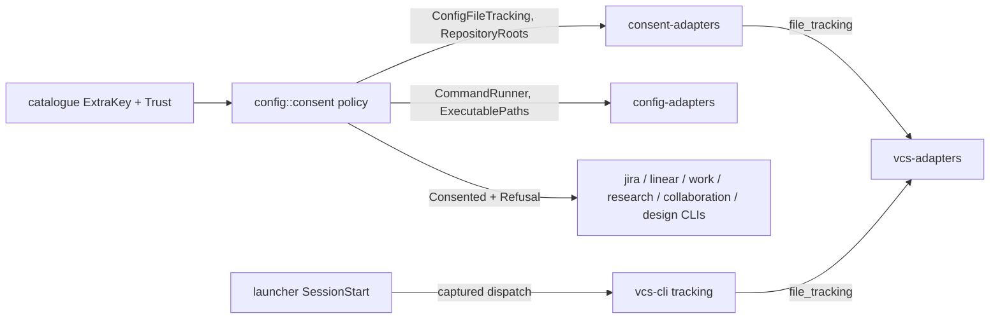
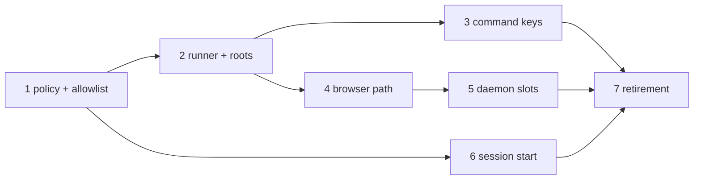

# Unify the Trust Barrier for Consent Config Keys Implementation Plan

## Overview

Six config keys hold values only the user may supply: `jira.allowed_sites`,
`jira.token_cmd`, `linear.token_cmd`, `github.token_cmd`,
`openalex.api_key_cmd` and `design.browser_path`. Each is guarded by its own
barrier, and the barriers disagree with one another. This plan replaces them
with one policy in `cli/config`, which a key opts into by declaring a trust
attribute on its catalogue descriptor.

The policy has three parts:

- one set of provenance checks, which fail closed;
- one set of value checks for executable paths;
- one hardened command runner.

It returns structured refusals that each consumer renders as a warning or a
fatal error. The `SessionStart` hook surfaces team-level and tracked-file
refusals to the user.

Delivery takes seven phases. Each is test-first and can be merged on its own,
and each deletes the bespoke barrier of the keys it migrates.

## Current State Analysis

The barriers exist as 0226's Context table describes. The research at
`meta/research/codebase/2026-09-24-0226-unify-the-trust-barrier-for-consent-config-keys.md`
verifies every reference. The findings that shape this plan:

- **Catalogue.** `EXTRA_KEYS` (`cli/config/src/catalogue.rs:134-153`) is a
  flat `&[&str]` with no per-key attribute. Three places iterate it:
  `dump.rs:77`, `help.rs:65` and the catalogue tests (`:342-418`).
- **Credential ladder.**
  - `resolve_token` (`cli/config/src/credentials.rs:294-353`) reads the team
    level only when `config.local.md` is absent.
  - It refuses a shared `*_cmd` as `E_TOKEN_CMD_FROM_SHARED_CONFIG` and a
    tracked personal `*_cmd` as `E_TOKEN_CMD_FROM_TRACKED_FILE`.
  - Every refusal is an `Err`. No consumer has a path that succeeds while
    still reporting a refusal.
- **Provenance.** `Provenance::is_tracked` returns `bool` (`:104-106`). It is
  implemented four times:
  - `jira-cli/src/context.rs:86-110`;
  - `linear-cli/src/context.rs:67-91`;
  - `work-cli/src/tracker_registry.rs:78-110`;
  - `research-cli/src/provenance.rs:12-35`.

  Every copy reads the VCS kind at the config root alone, and every copy
  fails open.
- **Runner.** `BashTokenCommandRunner`
  (`cli/config-adapters/src/credentials.rs:120-198`) behaves as follows:
  - it kills only `bash` on timeout, then joins the stdout reader
    unconditionally;
  - it truncates stdout at the cap and accepts the result;
  - it discards stderr;
  - it runs with the config root as its cwd.
- **`jira.allowed_sites`** (`cli/jira-client/src/auth.rs:158-181`).
  - A team-level value is fatal, as `AllowlistFromSharedConfig`, which exits
    1.
  - A tracked personal value is refused under the misnamed
    `E_TOKEN_CMD_FROM_TRACKED_FILE`.
- **`github.token_cmd`** (`cli/collaboration-cli/src/auth.rs:43-160`) has its
  own ladder and a bare `bash -c`: inherited env and cwd, no timeout, no cap,
  and no tracked-file check.
- **`design.browser_path`.**
  - `resolve_browser_hatch` (`cli/design-cli/src/config.rs:51-82`) masks the
    team warning behind any personal value.
  - `vet` (`cli/design/src/runtime/browser_path.rs:33-90`) returns the raw
    value, admits relative paths, and knows only the workspace root.
  - The daemon learns its browser only at spawn, through
    `ACCELERATOR_DESIGN_BROWSER_EXECUTABLE`. `server-info.json` does not
    record it, and the executor has no path that stops a running daemon.
- **`SessionStart`.** `config summary` runs in-process in the launcher.
  - The launcher has no VCS dependency.
  - Its warnings go to stderr through `render::emit`
    (`cli/launcher/src/config_command/render/mod.rs:43-48`).
  - `kernel::hooks::session_start(context, Some(message))`
    (`cli/kernel/src/hooks.rs:9-23`) already emits both fields.
- **Crate graph.**
  - `config-adapters` has no VCS dependency, and 14 crates depend on it,
    including the launcher and the visualiser server.
  - `pup.ron:56` bars `config` from `std::{fs,process,env}`.
  - `design` may not import `config` (`pup.ron:487-503`).

## Desired End State

- `cli/config/src/catalogue.rs` declares every extra key through an
  `ExtraKey` descriptor that carries a `Trust`. The six consent keys are the
  only non-`Open` entries.
- `cli/config/src/consent.rs` owns the following:
  - the refusal vocabulary: Requirement 8's seven codes, plus the surviving
    `E_TOKEN_CMD_FAILED`, `E_TOKEN_FROM_TRACKED_FILE`, `E_TOKEN_MALFORMED`
    and `E_LOCAL_PERMS_INSECURE`;
  - the precedence rule and the severity helper `or_fallback`;
  - `audit`, the whole-config consent check;
  - provenance checks;
  - path value checks;
  - the command-runner port, its policy, and `resolve_command`, the only
    route to it.

  Nothing else in the workspace implements a consent barrier.
- A new `cli/consent-adapters` crate owns the two VCS-backed adapters, and
  every composition root that resolves a consent key wires them:
  - `VcsConfigFileTracking`, which translates `vcs_adapters::file_tracking`,
    the fail-closed walk, onto `Tracking`;
  - `repository_roots`, which adds the config root to
    `vcs_adapters::repository_roots` to give the three roots of
    Requirement 3.
- `SystemExecutablePaths` lives in `config-adapters`, because it needs no VCS.
- `BashCommandRunner` in `config-adapters` behaves as follows:
  - it resolves `bash` through a `PATH` filtered of empty, relative and
    in-repository entries;
  - it runs each command in its own process group, kills the group on every
    exit path, and returns by its deadline even when a descendant holds a
    pipe;
  - it refuses output past 65,536 combined bytes;
  - it runs in a fresh temporary directory outside the repository, which is
    removed afterwards;
  - it admits only the environment variables the key's descriptor names.
- Every consumer prints non-fatal refusals as `warning: <refusal>` on stderr.
  It fails only when no usable value remains.
- `compose` probes `config.local.md` once, and every reader, the policy
  included, consults that one `PersonalFile` fact. Reads ignore an insecure
  file with one `E_LOCAL_PERMS_INSECURE` warning instead of failing.
  Commands that write, whether to the project tree or to a tracker, still
  refuse. The store never
  reads the file and refuses writes to it.
- The Playwright daemon's state directory is keyed by the vetted browser, so
  a changed browser gets its own daemon and the previous one idles out.
- `accelerator config summary --format=hook` carries consent warnings in both
  `systemMessage` and `additionalContext`. It learns whether
  `config.local.md` is tracked from the dispatched `accelerator vcs tracking`,
  so the launcher stays free of VCS libraries, per ADR-0054.
- The following are gone from `cli/`, `skills/` and `docs-site/`:
  - `E_TOKEN_CMD_FROM_SHARED_CONFIG`;
  - `E_TOKEN_CMD_FROM_TRACKED_FILE`;
  - `E_ALLOWED_SITES_FROM_SHARED_CONFIG`;
  - `AllowlistFromSharedConfig`;
  - `ACCELERATOR_ALLOW_INSECURE_LOCAL`;
  - `allow-insecure-local`.

Verify with `mise run` exiting 0 and this search returning nothing:

```bash
rg --no-require-git -l 'E_TOKEN_CMD_FROM_SHARED_CONFIG|E_TOKEN_CMD_FROM_TRACKED_FILE|E_ALLOWED_SITES_FROM_SHARED_CONFIG|AllowlistFromSharedConfig|ACCELERATOR_ALLOW_INSECURE_LOCAL|allow-insecure-local' cli skills docs-site
```

### Key Discoveries

- `ConfigAccess::get(key, Some(level))` (`cli/config/src/service.rs:361-365`)
  is the raw per-level probe. `effective_nonempty` hides a blank personal
  value, so the policy must not use it.
- `vcs_adapters::facts(start)` (`cli/vcs-adapters/src/lib.rs:22-24`) walks up
  to the nearest `.jj` or `.git`. `InProcessProbe::is_tracked` already
  returns `Result<bool, Error>` (`library.rs:442-453`).
- `facts` is unfit for fail-closed tracking. `.jj` beats `.git`
  (`markers.rs:42-50`), and git lets a repository commit a `.jj` directory.
  `facts` also returns `None` for a detected repository whose root name is
  not UTF-8. The tracking adapter therefore walks the markers itself.
- Two root lookups need care:
  - `RepoRoot::repository_root` gives jj's main repository, but for a git
    linked worktree it returns the worktree itself. Git needs
    `InProcessProbe::worktree(..).main_worktree_root` (`library.rs:232-258`).
  - Canonicalise both sides before `strip_prefix`, because on macOS `/var`
    resolves to `/private/var`.
- `CommandExt::process_group(0)` is stable std, and the workspace `rustix`
  enables `process`, so a group kill needs no new crate.
  `tempfile = "3"` is already a workspace dependency.
- `RecordedDaemon`/`RecordedState` are `Copy` and pinned in
  `cli/design/tests/fixtures/public-api.txt`. The recorded browser therefore
  travels as a separate `StateStore` read rather than as a field on those
  types.
- `vcs-test-support::Hermetic` together with research-cli's
  `Project::under_git` and `track_personal_config`
  (`cli/research-cli/tests/support/mod.rs:52-107`) is the pattern for
  tracked-file tests. `git add` is enough, because staged files count as
  tracked.

## What We're NOT Doing

- `visualiser.editor` and other browser-built links (documented as exempt
  only), and `$VISUAL`/`$EDITOR` fallbacks.
- Provenance checks on `ACCELERATOR_*` environment overrides.
- Moving plaintext credentials (`*.token`, `openalex.api_key`) into the
  consent policy. They keep the ladder's tracked-file refusal, which does now
  fail closed on an unknown tracking status.
- migrate-cli's `vcs_kind` detection gap.
- Binaries in an outer repository enclosing a nested checkout.
- Parsing `token_cmd` shell for paths.
- Removing `visualiser.binary`.
- Replacing `dump`'s `CREDENTIAL_LEAVES`. Secret classification is a
  different property from consent, since `jira.allowed_sites` is consent but
  not secret.
- Sequencing the SessionStart hooks. They stay separate entries, which may
  fetch the `vcs` sub-binary twice in the first session after an upgrade.
  0298 consolidates them behind `accelerator hooks session-start`.
- Migrating existing `.accelerator/allow-insecure-local` markers. They become
  inert, and the docs say they can be deleted.

## Implementation Approach

The domain model lives in `config::consent`. It is pure, with every
environment value, filesystem fact, VCS answer and process run arriving
through ports. The adapters that need VCS go in the new `consent-adapters`
crate (`config` + `config-adapters` + `vcs` + `vcs-adapters`). That keeps
`gix` and `jj-lib` out of `config-adapters`, and so out of the visualiser.



The policy applies one precedence rule to every consent key: the
highest-precedence source that passes every check wins, and every refusal met
on the way is reported. The environment comes first, then the personal
level. A team-level value is always refused. A source refused by a value
check or a failed command falls through to the next source.

The policy's output is `Consented<T>`: the admitted value, if any, every
`Refusal` in precedence order with the team-level refusal last,
and a `Notice` when a consent key was admitted from the environment. A
consumer calls `or_fallback(fallback)` to decide severity, and `or_fallback`
is the only place that rule lives:

- a usable value, admitted or fallback, carries every refusal as a warning;
- with no usable value, the refusal from the highest-precedence source tried
  is fatal, and the rest are still printed as warnings. Both travel as one
  `Rejection { fatal, warnings }`, the single payload of every consent
  error.

Consumers with several rungs of their own, the credential ladder and GitHub,
assemble their `Consented` through the policy's `Ladder`, so they order
refusals and pick the winner by the same rule. Consumers only map `Usable`
onto their own types.

The refusals render from `Refusal`'s `Display` as Requirement 8's seven codes
plus the surviving `E_TOKEN_CMD_FAILED`, `E_TOKEN_FROM_TRACKED_FILE`,
`E_TOKEN_MALFORMED` and `E_LOCAL_PERMS_INSECURE`. Jira and Linear each map
them onto their exit codes through one exhaustive `for_refusal`.

No consumer passes an environment value to the policy. Each key's override
variables are declared once in the catalogue, and the policy reads them
through the `Environment` port on its context. `github.token_cmd` declares
none.

The code sketches below show shape, not final text. Every name in them is
open to refinement during TDD. None of them carries comments, and the
implementation keeps it that way unless a constraint cannot be expressed in
code.

---

## Phase 1: Consent Policy, Fail-Closed Tracking, and `jira.allowed_sites`

### Overview

This phase introduces the catalogue attribute, the full refusal vocabulary,
the provenance checks, the tri-state tracking port and the `consent-adapters`
crate. It migrates `jira.allowed_sites` onto them. It unblocks 0227 and
closes the fail-open tracking gap for the allowlist.

### Changes Required

#### 1. Catalogue trust attribute

**File**: `cli/config/src/catalogue.rs`

**Changes**: turn `EXTRA_KEYS` into descriptors, and add lookups.

```rust
#[derive(Debug, Clone, Copy, PartialEq, Eq)]
pub enum Trust {
    Open,
    Consent,
    PathConsent,
    CommandConsent { admitted_environment: &'static [&'static str] },
}

pub struct ExtraKey {
    pub name: &'static str,
    pub trust: Trust,
    pub overrides: &'static [&'static str],
    pub recovery: Option<&'static str>,
}

pub const BASE_COMMAND_ENVIRONMENT: &[&str] = &[
    "PATH",
    "HOME",
    "TERM",
    "XDG_CONFIG_HOME",
    "XDG_RUNTIME_DIR",
    "DBUS_SESSION_BUS_ADDRESS",
];

pub const EXTRA_KEYS: &[ExtraKey] = &[
    ExtraKey {
        name: "jira.allowed_sites",
        trust: Trust::Consent,
        overrides: &["ACCELERATOR_JIRA_ALLOWED_SITES"],
        recovery: None,
    },
    ExtraKey {
        name: "jira.token",
        trust: Trust::Open,
        overrides: &["ACCELERATOR_JIRA_TOKEN"],
        recovery: None,
    },
    ExtraKey {
        name: "jira.token_cmd",
        trust: Trust::CommandConsent { admitted_environment: &[] },
        overrides: &["ACCELERATOR_JIRA_TOKEN_CMD"],
        recovery: None,
    },
    // ... every existing key, in the existing order
    ExtraKey {
        name: "github.token",
        trust: Trust::Open,
        overrides: &["GH_TOKEN", "GITHUB_TOKEN"],
        recovery: None,
    },
    ExtraKey {
        name: "github.token_cmd",
        trust: Trust::CommandConsent {
            admitted_environment: &["GH_HOST", "GH_CONFIG_DIR"],
        },
        overrides: &[],
        recovery: Some("GH_TOKEN"),
    },
    ExtraKey {
        name: "design.browser_path",
        trust: Trust::PathConsent,
        overrides: &["ACCELERATOR_DESIGN_BROWSER_PATH"],
        recovery: None,
    },
];

#[must_use]
pub fn declared(name: &str) -> Option<&'static ExtraKey> { /* .. */ }

pub fn consent_keys() -> impl Iterator<Item = &'static ExtraKey> { /* .. */ }
```

The other three command keys use `admitted_environment: &[]`, since the base
set is implicit. The catalogue is the single source of every override name:

- `overrides` lists the variables that override a key's value, in
  precedence order. It is distinct from `admitted_environment`, which lists
  the variables passed through to a command's process.
  The policy and the credential ladder read exactly these, and nothing else
  in the workspace names them. The plaintext credential keys declare theirs
  too, although they are `Open`.
- `recovery` is set only where the route out of a refusal is not the key's
  own override. For `github.token_cmd`, which has none, it is `GH_TOKEN`, a
  different credential that wins first.

A key's recovery hint is `recovery` if set, and otherwise the first entry of
`overrides`. `declared` is the catalogue's one lookup by name, and the key
constructors are built on it. Update `dump.rs:77`, `help.rs:65`,
`launcher/tests/config_help.rs`,
`config/tests/extra_keys_mirror.rs` and the catalogue membership tests to map
`.name`.

#### 2. Refusal vocabulary and provenance policy

**File**: `cli/config/src/consent.rs` (new; `pub mod consent;` in `lib.rs`)

```rust
pub enum Tracking { Untracked, Tracked, Unknown }

pub enum Distrust { Tracked, Unknown }

impl Tracking {
    pub const fn distrust(self) -> Option<Distrust>;
}

pub trait ConfigFileTracking {
    fn tracking(&self, path: &Path) -> Tracking;
    fn check(&self, path: &Path) -> TrackingCheck {
        TrackingCheck::Known(self.tracking(path))
    }
}

pub enum TrackingCheck { Known(Tracking), Unchecked }

#[derive(Clone, PartialEq, Eq)]
pub enum Refusal {
    TeamLevel { key: &'static ExtraKey },
    UntrustedPersonalFile { key: &'static ExtraKey, path: PathBuf, distrust: Distrust },
    InsecurePersonalFile { path: PathBuf, mode: u32 },
}

pub enum RefusalReason { Provenance, PersonalFile }

impl Refusal {
    pub fn key(&self) -> Option<&'static ExtraKey>;
    pub const fn reason(&self) -> RefusalReason;
}

pub struct ConsentKey(&'static ExtraKey);
pub struct CommandKey(ConsentKey);
pub struct ExecutablePathKey(ConsentKey);

impl ConsentKey {
    pub fn declared(name: &str) -> Result<Self, ConfigError>;
    #[cfg(feature = "test-support")]
    pub fn for_test(name: &str) -> Self;
}

impl CommandKey {
    pub fn declared(name: &str) -> Result<Self, ConfigError>;
    #[cfg(feature = "test-support")]
    pub fn for_test(name: &str, admitted_environment: &'static [&'static str]) -> Self;
}

impl ExecutablePathKey {
    pub fn declared(name: &str) -> Result<Self, ConfigError>;
    #[cfg(feature = "test-support")]
    pub fn for_test(name: &str) -> Self;
}

pub struct Notice { /* key, variable, and the value for non-secret keys */ }

pub struct Consented<T> {
    pub admitted: Option<T>,
    pub refusals: Vec<Refusal>,
    pub notice: Option<Notice>,
}

pub struct Rejection {
    pub fatal: Refusal,
    pub warnings: Vec<Refusal>,
}

impl Rejection {
    pub fn alone(fatal: Refusal) -> Self;
}

pub enum Usable<T> {
    Value { value: T, warnings: Vec<Refusal>, notice: Option<Notice> },
    Refused(Rejection),
    Absent,
}

impl<T> Consented<T> {
    pub(crate) fn from_candidates(
        admitted: Option<T>,
        candidate_refusals: Vec<Refusal>,
        team_refusals: Vec<Refusal>,
    ) -> Self;
    pub fn map<U>(self, f: impl FnOnce(T) -> U) -> Consented<U>;
    pub fn or_fallback(self, fallback: Option<T>) -> Usable<T>;
}

pub struct Aborted {
    pub error: ConfigError,
    pub warnings: Vec<Refusal>,
}

pub enum AuditFinding {
    Key(Refusal),
    PersonalFile(Distrust),
    PersonalFileUnchecked,
    PersonalFileIgnored(Refusal),
}

pub struct ProvenanceContext<'a> {
    pub config: &'a dyn ConfigAccess,
    pub tracking: &'a dyn ConfigFileTracking,
    pub environment: &'a dyn Environment,
    pub personal_config: PathBuf,
}

pub fn resolve(
    context: &ProvenanceContext<'_>,
    key: &ConsentKey,
) -> Result<Consented<String>, Aborted>;

pub fn audit(context: &ProvenanceContext<'_>) -> Result<Vec<AuditFinding>, ConfigError>;
```

`ConsentKey::declared` accepts only a `Trust::Consent` key, and is the only
production constructor, so `resolve` can never return an unvetted path or an
unrun command. `ConsentKey::for_test` builds only a `Trust::Consent`
descriptor, so even a test build cannot get an unvetted value from
`resolve`. Path and command descriptors come only from
`ExecutablePathKey::for_test` and `CommandKey::for_test`. Every `for_test`
constructor, and Phase 2's `CommandPolicy::for_test`, sits behind a
`test-support` feature. Only `config` and `config-adapters` may enable it,
and only as dev-dependencies, so consumer tests use real keys. A `tasks/`
lint over `cargo metadata`, run in `cli:check`, fails when any other crate
enables `config/test-support`, or when any crate enables it in a non-dev
dependency. It also scans every workspace package's `[features]` table, so
a crate cannot forward `config/test-support` or `config?/test-support`
through a feature of its own. It gets a red step like the pup rules. The
kind-specific constructors fail unless the catalogue declares the name with
that kind, so passing the wrong kind of key does not compile, and a misspelt
or mis-kinded name fails in one place.

`Distrust` names the two states of a personal file that must not be trusted.
Its `Display` owns the `E_CONSENT_KEY_TRACKED` and
`E_CONSENT_KEY_TRACKING_UNKNOWN` strings, so the summary and the ladder render
through it rather than repeating codes.

The policy considers candidates in precedence order, and reads a level only
when it is needed:

1. It always reads `Level::Team` raw. A non-blank value pushes `TeamLevel`.
   The store never refuses the team file on mode grounds, so a team-level
   value is reported on every call.
2. The first non-blank variable in the key's catalogue `overrides`, read
   through `context.environment`, is the environment candidate.
3. Only when no environment candidate was admitted does it consult the
   personal level. For `config.personal_file()` `Ignored` it pushes
   `InsecurePersonalFile` and reads nothing. For `Absent` it reads nothing.
   For `Readable` it reads `Level::Personal` raw, and checks a non-blank
   value against `tracking.tracking(personal_config)`:
   - `Tracked` or `Unknown` pushes `UntrustedPersonalFile` with its
     `Distrust`;
   - `Untracked` makes it the personal candidate.

Reading the personal level lazily means an environment winner never touches
it, and never reports an ignored file itself: the composition root has
already printed that warning (§7). Any `ConfigError` from a personal read
propagates as today. When the environment wins, a tracked
`config.local.md` goes unreported by that consumer. The `SessionStart`
`PersonalFile` warning still reports it, and Requirement 7 requires only that
team-level values are always reported.

`resolve` admits the first candidate, since a plain consent key has no value
checks. Phase 4's `resolve_executable_path` admits the first candidate that
passes the path checks, consulting the personal level only when the
environment candidate is absent or refused. Phase 3's `resolve_command`
hands its candidates to the caller as opaque commands, reading the personal
one lazily. Blank means empty or whitespace-only after
trimming, which reuses the semantics of `precedence::non_blank`.

`or_fallback` returns `Value` for an admitted value, or else for a `Some`
fallback, carrying the notice. It returns `Refused` with a `Rejection` whose
`fatal` is the first refusal when refusals exist and there is no usable
value, and `Absent` when there is neither. `map` transforms an admitted
value, such as splitting the allowlist, and keeps the refusals and notice.

`Consented::from_candidates` is the one owner of refusal ordering: the
refusals of the candidates tried, in precedence order, then the team-level
refusals last. `resolve`, Phase 4's `resolve_executable_path` and Phase 3's
`Ladder::finish` all build their result through it, so `or_fallback`'s
"first refusal is fatal" rule cannot drift between key kinds.

When a personal read fails with a `ConfigError`, the resolvers and the `Ladder` return
`Aborted { error, warnings }` instead of dropping what they have gathered.
`warnings` holds every refusal found so far, the eagerly read `TeamLevel`
included, and consumers print them before the error. A team-level value is
therefore reported even when the command fails for another reason.

`Refusal` and `RefusalReason` gain their other variants in the phases whose
tests first need them:
- Phase 2 adds `CommandFailed`, `CommandTimedOut`, `CommandOutputExceeded`
  and `RefusalReason::Command`;
- Phase 3 adds `PlaintextFromUntrustedFile`;
- Phase 4 adds `PathRelative`, `PathInsideRepository` and
  `RefusalReason::Value`.

`jira-cli`'s `for_refusal` gains an arm with each.

`config::consent` deliberately owns the one ordered refusal channel for
every credential rung, plaintext included, so its module docs say so. The
consent-key policy is the part of it that only consent keys reach.

`PlaintextFromUntrustedFile` is the refusal of a plaintext credential read
from an untrustworthy `config.local.md`. It renders the surviving
`E_TOKEN_FROM_TRACKED_FILE` code and has reason `Provenance`. Plaintext keys
are not consent keys, but their refusals travel in the same ordered channel.

`audit` reports, for every `catalogue::consent_keys()` entry, a
`Key(TeamLevel)` finding when the raw team value is non-blank. It adds one
`PersonalFile` finding when `config.local.md` exists and its tracking is
`Tracked` or `Unknown`, whatever keys the file sets. It learns whether the
file exists from `config.personal_file()`. `Absent` is skipped without a
tracking query. `Readable` and `Ignored` are both checked for tracking,
because git checks a committed file out as 0644, so the commonest tracked
file is also an insecure one. `Ignored` also gives
`PersonalFileIgnored(InsecurePersonalFile)`, and `audit` is the summary's
only source for that warning. `audit` asks through
`check`, and a `TrackingCheck::Unchecked` answer gives
`PersonalFileUnchecked` instead. Only the launcher's dispatched adapter
ever answers `Unchecked`, when it could not reach the `vcs` sub-binary at
all. Its `tracking` answers `Unknown` in that case, so the policy fails
closed. Only `audit` calls `check`, to tell an unreachable sub-binary apart
from an unknown answer. Every other adapter keeps the default, `Known`. It is the single entry
point for whole-config consent checks: the `SessionStart` summary and 0227's
`config validate`.

`Display` renders each refusal as `E_<CODE>: <key> …`, reading every fact it
needs from the refusal's descriptor, so nothing is looked up by name.
`UntrustedPersonalFile` renders its code through its `Distrust`. The
team-level text names `.accelerator/config.local.md` as the route. The texts
for `Distrust::Unknown`, on `UntrustedPersonalFile` and on
`PlaintextFromUntrustedFile`, end with the key's recovery hint: "set `<hint>`
in the environment". Paths and values are rendered with control characters
escaped (`escape_debug`), so a crafted path cannot forge or hide output
lines. `Debug` stays redacting in
the same style as `CredentialError`. `ConsentKey::for_test` leaks a
`&'static ExtraKey` for its test-only descriptor.

The policy sets `notice` only when it admits a consent key from the
environment candidate. A consumer prints it as
`notice: <key> taken from <variable>`, naming the variable actually read. For the non-secret keys,
`jira.allowed_sites` and `design.browser_path`, it appends the value, and for
command keys it never does. A plaintext value from the environment, such as
`ACCELERATOR_JIRA_TOKEN`, gets no notice, because it is not a consent key.

#### 3. `consent-adapters` crate

**Files**: `cli/consent-adapters/{Cargo.toml,src/lib.rs,src/tracking.rs}`, the
workspace `members`, and a `pup.ron` rule denying `std::process` crate-wide.
The crate goes through `tasks/README.md`'s plain-library-crate checklist
(cargo-deny, licence audit, public-API fixture). Its crate docs and that
checklist entry state the placement rule: an adapter belongs here only when
it needs VCS. VCS-free adapters, the runner included, stay in
`config-adapters`, which keeps `gix` and `jj-lib` out of its 14 dependents.

The fail-closed walk is a VCS question, so it lives in `vcs-adapters`, and
the adapter here only translates its answer:

```rust
pub struct VcsConfigFileTracking;

impl ConfigFileTracking for VcsConfigFileTracking {
    fn tracking(&self, path: &Path) -> Tracking {
        match vcs_adapters::file_tracking(path) {
            FileTracking::Untracked => Tracking::Untracked,
            FileTracking::Tracked => Tracking::Tracked,
            FileTracking::Unknown => Tracking::Unknown,
        }
    }
}
```

`vcs_adapters::file_tracking(path) -> FileTracking` (new, in
`cli/vcs-adapters/src/tracking.rs`, with `FileTracking` in `vcs`) owns:

- canonicalising `path`, where a failure gives `Unknown`;
- `enclosing_repositories`, which walks the markers itself rather than
  calling `facts`. It finds the nearest `.jj` and the nearest `.git`
  independently and yields each one that encloses the file. A marker that
  exists but cannot be used, because of a non-UTF-8 root name or a stat
  permission error, yields an error. It takes an injectable marker probe, so
  the error branch is unit-tested without platform tricks;
- the query against each repository's root through
  `InProcessProbe::is_tracked`, matching case-insensitively for git when
  `core.ignorecase` is true;
- `FileTracking::combine`, a fold over the precedence
  `Tracked` > `Unknown` > `Untracked`, so the empty set gives `Untracked`
  and a `Tracked` answer from any repository wins over an error from another;
- the tripwire: a `.jj` directory with any file in the enclosing git
  repository's index gives `Unknown`. `is_tracked` matches exact file
  entries, so this uses a new `pub(crate)`
  `InProcessProbe::tracks_any_under(root, prefix)` prefix query. A real jj store is never tracked by git, even when
  colocated.

The adapter canonicalises `path` itself. An absent file is never asked about,
because the policy reads a personal value only when the store found the file.

#### 4. Wire tracking into credential contexts

**Files**:
- `cli/config/src/credentials.rs`: `CredentialContext` gains
  `tracking: &dyn ConfigFileTracking`. Phase 2 reshapes it into one context
  that every credential consumer shares, GitHub included:

  ```rust
  pub struct CredentialContext<'a> {
      pub provenance: ProvenanceContext<'a>,
      pub execution: CommandExecution<'a>,
  }

  pub struct CommandExecution<'a> {
      pub runner: &'a Runner,
      pub timeout: Duration,
  }
  ```

  Phase 2 replaces today's `commands: &dyn TokenCommandRunner` and
  `command: CommandPolicy` with `execution`, because
  `CommandPolicy::for_key` is `pub(crate)`.
- `cli/config-adapters/src/credentials.rs`: `CredentialPorts` gains
  `tracking: Box<dyn ConfigFileTracking>`, and `system(provenance, tracking)`
  takes it.
- jira-cli, linear-cli, work-cli and research-cli call
  `CredentialPorts::system(Box::new(VcsProvenance), Box::new(VcsConfigFileTracking))`
  directly, passing their existing `VcsProvenance`. The legacy `bool`
  `Provenance` stays in this phase and phase 2.
- Phase 3 deletes `Provenance` and introduces
  `consent_adapters::credential_ports(config_root, cwd)`, which builds the
  system ports, the tracking adapter and the runner's roots in one place.

#### 5. Migrate `jira.allowed_sites`

**Files**: `cli/jira-client/src/auth.rs`, `cli/jira-client/src/error.rs`,
`cli/jira-client/src/client.rs`

- `allowed_sites` becomes
  `consent::resolve(&provenance_context, &ConsentKey::declared("jira.allowed_sites")?)`,
  followed by `.map(split)` into a `Consented<Vec<String>>`. The policy reads
  `ACCELERATOR_JIRA_ALLOWED_SITES` from the key's catalogue declaration
  through the context's `Environment` port. As with every environment
  override, it skips the provenance checks.
- `base_url` calls `or_fallback`, with an empty allowlist as the fallback
  when the host is admitted by the default `*.atlassian.net` rule:
  - `Value` admits the host when the default rule or the allowlist admits it,
    and otherwise fails with today's not-admissible error. Either way, its
    warnings are kept;
  - `Refused(rejection)` fails as `ClientError::Consent(rejection)`;
  - `Absent` fails with today's not-admissible error.
- `JiraCredentials` carries `refusals: Vec<Refusal>` and the
  `Option<Notice>` from `Usable::Value`. `JiraClient::refusals()` and
  `JiraClient::notice()` expose them. A construction failure carries its
  warnings too, so the consumer prints them before exiting.
- Delete `ClientError::AllowlistFromSharedConfig`.

#### 6. Report and map in jira-cli and work-cli

- `cli/jira-cli/src/exit_codes.rs`: add
  `pub const fn for_refusal(&Refusal) -> u8`. It matches exhaustively:
  provenance and path reasons map to `NO_TOKEN`, command reasons to
  `TOKEN_CMD_FAILED`, and the personal-file reason to
  `LOCAL_PERMS_INSECURE`. `for_client` maps `ClientError::Consent(rejection)`
  through `for_refusal(&rejection.fatal)`.
- `cli/jira-cli/src/main.rs` and `context.rs`: after building the client,
  print `client.notice()` if present, then `warning: {refusal}` for each
  entry in `client.refusals()`. On `ClientError::Consent(rejection)` they
  print `rejection.warnings` before the fatal line.
- `cli/work-cli/src/tracker_registry.rs`: the same stderr prints after
  `JiraClient::from_config`.

#### 7. Ignore an insecure personal file

**Files**: `cli/config-adapters/src/{store.rs,compose.rs}`,
`cli/config/src/service.rs`, `cli/config/src/consent.rs`,
`cli/config/src/credentials.rs`, `cli/migrate-adapters/src/context.rs`,
`cli/launcher/src/config_command/`, `cli/visualiser/server/`, and every
composition root listed below

Requirement 2, as amended, makes a refused personal file ignored rather than
fatal for reads. Commands that write to the project tree still fail closed,
because their writes persist after the user runs `chmod 600`. The store
never reads the file and refuses writes to it.

The fact that the file is ignored is established once, when the ports are
composed, and every reader consults that one fact:

```rust
pub enum PersonalFile {
    Absent,
    Readable,
    Ignored { path: PathBuf, mode: u32 },
}

pub trait ConfigAccess {
    // ... existing methods
    fn personal_file(&self) -> &PersonalFile;
}
```

- `store.rs`: `to_config_error` maps the insecure-permissions and symlink
  refusals to a new `ConfigError::InsecurePersonalFile { path, mode }` rather
  than `ConfigError::Invalid`. `ConfigError::is_refusal` classifies it as a
  refusal, as `Invalid` was, so `--fail-safe` never absorbs it.
  `FileConfigStore::probe_personal_file() -> Result<PersonalFile, ConfigError>`
  runs the existing `require_secure_personal_file` check without reading the
  file's contents. `FileConfigStore::write` now runs the same check for
  `Level::Personal` before writing. Today the only refusal of such a write is
  `ConfigService::set`'s preceding read (`service.rs:503`). `atomic_write`
  itself clamps an existing 0644 file to 0600 and replaces it.
- `compose.rs`: `compose` probes the personal file once and wraps the store
  in a `ScreenedStore`, which implements `ReadConfigLevel` and `ReadContent`.
  For `PersonalFile::Ignored` it answers `None` for the personal level and
  never calls the store for it. Otherwise it delegates. `Composed` hands the
  `ScreenedStore` to both the service and the launcher's block views
  (`summary.rs:45,127`, `dump.rs:51`, `agents.rs:69`, `context.rs:28`), so
  both read paths tolerate the file in the same way. A file that turns
  insecure after the probe still fails closed, because the store checks the
  file on every read. `Composed::personal_file()` exposes the fact.
  `Composed` becomes
  `{ service: ConfigService<ScreenedStore, FileConfigStore>, store: FileConfigStore, screened: ScreenedStore }`.
  The service reads through the screen and writes through the checked store.
  `store` keeps serving the non-level ports (`with_plugin_root`, lenses,
  templates, scaffold, `template_names`). The launcher's `compose_stack`
  (`main.rs:246-257`) takes its `levels` and `content` ports from `screened`,
  which gains a `with_plugin_root` of its own. Handing those ports the raw
  `store` would reopen the bypass, so a launcher test pins it.
  `Composed::require_readable_personal_file()` returns
  `ConfigError::InsecurePersonalFile` for `Ignored`, so writers can refuse.
- `service.rs`: `ConfigService::with_personal_file(reader, writer, fact)`
  carries the fact from `compose`, and `ConfigService::new` keeps its
  signature, answering `Readable`, so its ~20 call sites and the concrete
  `ConfigService<FileConfigStore, FileConfigStore>` type names are
  unchanged. `ConfigAccess::personal_file` has a default returning a static
  `Readable`, so the 17 test fakes across 12 crates compile unchanged, and
  only fakes testing the ignored case override it. Every `ConfigError` from the reader
  propagates as today. The screen, not the service, is what tolerates the
  file.
- `consent.rs`: `Refusal::InsecurePersonalFile { path, mode }` is built from
  `PersonalFile::Ignored`, with a new `RefusalReason::PersonalFile`. It renders
  `E_LOCAL_PERMS_INSECURE: <path> is mode <mode>; ignored`. The text names
  the routes out: `chmod 600`, or on a filesystem that cannot honour file
  modes, team values in `config.md` and secrets in the `ACCELERATOR_*`
  overrides. `Refusal::key()` becomes `Option<&'static ExtraKey>`, since this
  refusal belongs to no key.
- The policy and the `Ladder` push this refusal once, at the personal
  level's precedence position, when they reach that position and
  `personal_file()` is `Ignored`. When nothing usable remains it is the fatal
  refusal. Otherwise consumers drop it from the warnings they print, because
  their composition root has already printed the fact.
- `credentials.rs`: `personal_config_exists` is replaced by
  `config.personal_file()`. The personal rungs run only for `Readable`. The
  team plaintext rung runs only for `Absent`, so a committed team token is
  never used while a personal file exists, secure or not. This makes the
  insecure-local override inert. Phase 7 deletes it. Until Phase 3 gives the
  ladder a refusal channel, an `Ignored` file with no environment value fails
  as today with `CredentialError::LocalPermsInsecure`, which keeps every
  consumer's current exit code.
- Composition roots: each binary prints `warning: {refusal}` once per
  process when `personal_file()` is `Ignored`, through one
  `kernel::render::personal_file_warning` helper with a process-wide
  once-guard. Binaries that compose more than once, such as jira-cli
  `search` (`context.rs:153` and `resolve_fields.rs:174`) and the
  visualiser (`compose.rs:42` and `orchestration/mod.rs:44`), still print it
  once. The visualiser server uses `tracing::warn!` behind the same guard. The roots are the launcher, the visualiser server,
  jira-cli, linear-cli, work-cli, research-cli, collaboration-cli,
  design-cli, corpus-cli and migrate-cli. `migrate-adapters/src/context.rs`,
  which builds its own `ConfigService` today, composes through the same
  `ScreenedStore`. migrate-cli has no `compose` call, so it prints the
  warning when `FileMigrationContext` is built, which only `--list` and the
  default run do.
- Writers: these call `require_readable_personal_file()` and fail with
  `E_LOCAL_PERMS_INSECURE`, exiting as a config read error does today:
  - migrate-cli's default run (`run_default`) only.
    `--discoverability-hook`, which SessionStart runs with `--fail-safe`,
    `--list`, `--skip`, `--unskip` and `--unapply` are unaffected;
  - work-cli `create`, `update` and `sync` (push and pull);
  - jira-cli and linear-cli `create`, `update`, `comment add`/`edit`/
    `delete`, `transition`, `attach` and `init`, and jira-cli
    `resolve-fields` when it falls back to config for the project. Their
    routing keys (`jira.site`, `jira.project_key`, `linear.team_id`) would
    otherwise silently come from the team file. Today
    `resolve_fields.rs:172-187` gives `E_RESOLVE_NO_PROJECT` here;
  - the launcher's `config set --personal`, which the store's write check
    refuses in any case, and `config templates eject --force` and
    `config templates reset --confirm`, which resolve `paths.templates`
    and would overwrite or delete a template.

  Read-only commands (`show`, `search`, `comment list`, `fields`) proceed
  with the warning. The route out for a writer on a filesystem that cannot
  honour file modes is to move `config.local.md` aside, which makes it
  `Absent`. The `ACCELERATOR_*` overrides still supply credentials.
- collaboration-cli: `resolve_github_token` reads `github.token` through
  `ConfigAccess` at any level (`auth.rs:60`), so behind the screen a
  committed team token would win beside an ignored file. In this phase it
  reads the config value only when `personal_file()` is `Absent` or
  `Readable`. For `Ignored`, with no `GH_TOKEN`/`GITHUB_TOKEN`, it refuses
  with `E_LOCAL_PERMS_INSECURE` as `kernel::Error::Refusal`, exiting 2 where
  it exits 1 today. Phase 3 replaces this with the shared ladder.
- `jira-cli`: `for_refusal` maps `InsecurePersonalFile` to
  `LOCAL_PERMS_INSECURE` (29). Linear gains its own `for_refusal` in
  Phase 3.
- Launcher: the read commands (`config get`, `dump`, `agents`, `context`,
  `summary`) exit 0 with the warning on stderr. The `SessionStart` summary
  no longer fails. It emits `E_LOCAL_PERMS_INSECURE` for
  `.accelerator/config.local.md` in both `systemMessage` and
  `additionalContext` through `kernel::hooks::session_start`, and Phase 6
  folds this into `audit`.
- Visualiser server: serves team values after the warning.

#### 8. Docs and CHANGELOG

- `skills/config/configure/SKILL.md`: move `allowed_sites` from the Jira
  team-shared table (`:739-742`) into the personal-settings table, and fix
  the "One key belongs in team-shared config.md" heading. State that the
  allowlist lives in an untracked `config.local.md` or in
  `ACCELERATOR_JIRA_ALLOWED_SITES`, with an example of two hosts
  (`ACCELERATOR_JIRA_ALLOWED_SITES="jira.example.com, jira.example.org"`,
  split on commas and whitespace). State that trusting a repository's
  `mise.toml` or `.envrc` extends consent to that variable, and that mise
  trusts a file by path unless paranoid mode is on, so later edits to a
  trusted file are not re-prompted. Describe the `notice:` line, which names
  the variable and the allowlist's value.
- `CHANGELOG.md` `[Unreleased]`:
  - Security: a failed tracking query now refuses a personal
    `jira.allowed_sites`;
  - Changed: a team-level allowlist warns with `E_CONSENT_KEY_TEAM_LEVEL`
    for `*.atlassian.net` sites, and fails with exit 24 instead of 1 for any
    other site;
  - Added: the `ACCELERATOR_JIRA_ALLOWED_SITES` override;
  - Added: the `notice:` line when a consent key is taken from the
    environment. It names the variable, and for the allowlist its value;
  - Changed: the allowlist's refusal codes are renamed.
    `E_TOKEN_CMD_FROM_TRACKED_FILE` becomes `E_CONSENT_KEY_TRACKED` or
    `E_CONSENT_KEY_TRACKING_UNKNOWN`, and
    `E_ALLOWED_SITES_FROM_SHARED_CONFIG` becomes `E_CONSENT_KEY_TEAM_LEVEL`.
    A tracked personal allowlist with an `*.atlassian.net` site now warns,
    where it used to fail;
  - Changed: an insecure `config.local.md` is ignored with an
    `E_LOCAL_PERMS_INSECURE` warning, where it used to fail every command
    and the `SessionStart` hook. Its values are not used. `migrate`, work
    `create`/`update`/`sync`, jira and linear commands that write to the
    tracker or to config, `config set --personal` and
    `config templates eject --force`/`reset --confirm` still refuse, and
    collaboration-cli exits 2 instead of 1 when nothing else is usable;
  - Security: a committed team plaintext token is no longer used while
    `config.local.md` exists, even when that file is ignored as insecure.
- `docs-site/src/content/docs/configuration.md` (`:21-30`): the
  insecure-file rule now reads "ignored with a warning", with the routes
  out: `chmod 600`, or team values in `config.md` and secrets in the
  `ACCELERATOR_*` overrides on a filesystem that cannot honour file modes.
- The same insecure-file wording ("ignored with an `E_LOCAL_PERMS_INSECURE`
  warning; writers refuse; fatal only when nothing usable remains") replaces
  the old fatal wording in `collaboration.md:62-65`,
  `guides/configuration-cookbook.md:143-145`, `skills/issue-trackers.mdx:91`,
  `research.md:190` and `skills/config/configure/SKILL.md:780,890,947`.
  Phases 3 and 7 rewrite the rest of those passages.

### Tests (written first)

- `cli/config-adapters/tests/`, over the real `FileConfigStore`:
  - a 0644 or symlinked personal file makes a personal read return
    `ConfigError::InsecurePersonalFile`, and `probe_personal_file` answers
    `Ignored`, and `Absent` or `Readable` otherwise;
  - `FileConfigStore::write` to a 0644 personal file fails and leaves the
    file byte-identical, and so does `ConfigService::set` through `compose`,
    which pins `a_personal_write_against_an_insecure_preexisting_file_is_refused`
    (`store.rs:1080`) against the screened path;
  - through `compose`, with a 0644 personal file, `get(key, None)` answers
    from the team level, `get(key, Some(Level::Personal))` and the
    `effective*` helpers answer absent, the block-view `read` and
    `config_body` answer `None` for the personal level, and
    `personal_file()` is `Ignored`;
  - a personal file made insecure after `compose` makes a later read fail
    with `InsecurePersonalFile`;
  - `require_readable_personal_file` fails only for `Ignored`.
- `cli/config/src/service.rs` unit tests: `ConfigError::is_refusal` is true
  for `InsecurePersonalFile`.
- `cli/config/tests/consent.rs`, with `FixedConfig` answering
  `personal_file()` as `Ignored`:
  - `resolve` pushes `InsecurePersonalFile` once, at the personal position,
    and never reads the personal level;
  - it is the fatal refusal when nothing usable remains, and a warning
    beside a team refusal otherwise;
  - an environment winner gives no `InsecurePersonalFile`;
  - it renders `E_LOCAL_PERMS_INSECURE` with its routes out;
  - `audit` gives both `PersonalFileIgnored` and `PersonalFile(Tracked)` for
    an ignored, tracked file.
- `cli/jira-cli` exit-code test: `InsecurePersonalFile` maps to 29.
- `cli/config/tests/credentials.rs`, pinning the interim ladder until
  Phase 3: an `Ignored` file beside a team plaintext token, with no
  environment value, fails with `CredentialError::LocalPermsInsecure` and
  never uses the team token, and with `ACCELERATOR_JIRA_TOKEN` resolves the
  environment token.
- Rewritten to the new semantics as part of this red step, so Phase 1 is
  green on its own:
  - `cli/config/tests/credentials.rs:430-440`, `:465-487` and `:500-512`;
  - `cli/config-adapters/tests/credentials.rs:260-341`;
  - `cli/research-cli/tests/fetch_openalex.rs:659-666`.

  Each now asserts the ignore-or-refuse outcome above rather than
  `LocalPermsInsecure` from the mode gate.
- `cli/launcher/tests/config_read.rs`: with a 0644 `config.local.md`:
  - `config summary --format=hook` exits 0 with `E_LOCAL_PERMS_INSECURE` in
    both fields;
  - `config get`, `dump`, `agents` and `context` exit 0, print team values,
    and print the warning on stderr exactly once;
  - `config set --personal` fails with its current exit code.
- Writers, one binary-level case each with a 0644 `config.local.md`: the
  migrate-cli default run; work-cli `create`, `update` and `sync`; jira-cli
  `create`, `comment add` and `resolve-fields` beside a team
  `jira.project_key`; linear-cli `create` beside a team `linear.team_id`;
  and `config templates eject --force` and `reset --confirm`. Each fails
  with `E_LOCAL_PERMS_INSECURE` and its current config-error exit code, and
  writes nothing, locally or to the scripted tracker.
- `accelerator migrate --discoverability-hook --format=hook --fail-safe` and
  `migrate --list` exit 0 beside a 0644 `config.local.md`.
- collaboration-cli beside a 0644 `config.local.md` and a team
  `github.token`, with no `GH_TOKEN`: the team token is not used, and it
  exits 2 with `E_LOCAL_PERMS_INSECURE`. With `GH_TOKEN` it succeeds with
  one warning.
- Readers: design-cli, corpus-cli, jira-cli `show` and `search`, and the
  visualiser server each run over a 0644 `config.local.md` on team values,
  with exactly one warning. jira-cli `search`, which composes twice, and
  the visualiser lifecycle pin the once-guard. The visualiser server's
  warning goes through `tracing`.
- `cli/launcher` unit test: `compose_stack`'s `levels` and `content` ports
  answer `None` for an ignored personal level, which pins them to the
  screened store.

- `cli/config/tests/consent.rs` (new), with an in-memory
  `FixedConfig`/`FixedTracking`, covering:
  - a team value alone refuses with `TeamLevel`, and its text names the key
    and `.accelerator/config.local.md`;
  - a team value with an empty or whitespace personal value still reports
    `TeamLevel`;
  - a team value with a usable personal value gives the personal value plus
    `TeamLevel`;
  - a tracked personal value refuses with `UntrustedPersonalFile` and
    `Distrust::Tracked`, and an unknown one with `Distrust::Unknown`;
  - a tracked personal file with an environment value gives the environment
    value;
  - with an environment value, a `FixedConfig` whose personal read errors is
    never asked for the personal level, and a team value still gives
    `TeamLevel`;
  - with no environment value, the same personal-read error gives
    `Aborted`;
  - refusals come in precedence order with `TeamLevel` last, and
    `or_fallback` makes the highest-precedence one fatal while returning the
    rest as warnings;
  - `or_fallback` with a fallback and refusals gives `Value` with every
    refusal as a warning, and with neither gives `Absent`;
  - `audit` reports each team-level consent key and, separately, a tracked or
    unknown personal file that sets no consent key;
  - `audit` reports no `PersonalFile` finding for an untracked file, and never
    asks a recording `FixedTracking` about an absent file;
  - a `ConsentKey::for_test` key is refused at team level, tracked and
    unknown;
  - `ConsentKey::for_test` builds only a `Trust::Consent` descriptor;
  - every `Refusal` renders its code, and `Debug` redacts paths but not the
    key;
  - `UntrustedPersonalFile` with `Distrust::Unknown` renders each consent
    key's recovery hint, naming
    `GH_TOKEN` for `github.token_cmd`;
  - `or_fallback` carries the notice for an environment winner and none for
    a fallback;
  - `map` transforms an admitted value and keeps the refusals and notice;
  - a personal read that fails with a `ConfigError` gives `Aborted`, whose `warnings` hold a team value's
    `TeamLevel`;
  - `audit` reports `PersonalFile` for an existing, tracked `config.local.md`
    that sets no keys at all;
  - `notice` names the variable, includes the value for `jira.allowed_sites`
    and `design.browser_path`, and never includes it for a command key;
  - a notice or refusal whose value or path contains `\r`, `\x1b[` or
    `\n` renders them escaped;
  - `Distrust` renders `E_CONSENT_KEY_TRACKED` and
    `E_CONSENT_KEY_TRACKING_UNKNOWN`, and `Tracking::distrust` maps
    `Untracked` to `None`;
  - `CommandKey::declared` and `ExecutablePathKey::declared` refuse a name
    declared with another kind, or not declared.
- `cli/config/src/consent.rs` `#[cfg(test)]` module, since
  `from_candidates` is `pub(crate)`: it orders candidate refusals before
  team-level ones, whatever order they are passed in. The integration tests
  add a mixed-order case through each public entry point.
- `cli/config/src/catalogue.rs` unit tests:
  - `consent_keys()` yields exactly the six keys;
  - `github.token_cmd` admits `GH_HOST` and `GH_CONFIG_DIR`;
  - every key's `overrides` and `recovery` are pinned as literals,
    including the plaintext credential keys;
  - `visualiser.editor` is `Open`.
- `cli/vcs-adapters/tests/file_tracking.rs`, with `Hermetic` and real repos:
  - git untracked, git staged, and jj committed files;
  - no VCS gives `Untracked`;
  - `.accelerator/` in a subdirectory of a git checkout, with a tracked
    `config.local.md`, gives `Tracked`, and the same for jj;
  - a corrupted `.git/index` gives `Unknown`;
  - a crafted `.jj` committed at the root of a git repository, or inside
    `.accelerator/`, leaves a git-tracked `config.local.md` `Tracked`;
  - a `.jj` directory with any file in git's index gives `Unknown`, through
    `tracks_any_under`;
  - with `core.ignorecase` true, an index entry differing only in case gives
    `Tracked`;
  - a colocated `jj git init --colocate` checkout where only jj tracks the
    file gives `Tracked`;
  - an ignored `config.local.md` gives `Untracked` in a pure jj repository
    and in a `jj git init --colocate` checkout, which proves the `.jj`
    tripwire stays silent on a genuine store.
- `cli/vcs-adapters/src/tracking.rs` unit tests:
  - `FileTracking::combine` over every combination of answers, including the
    empty set;
  - an injected marker probe that errors gives `Unknown`.
- `cli/vcs-adapters` unit tests: `tracks_any_under` answers for a prefix with
  and without index entries beneath it.
- `cli/consent-adapters` unit test: `VcsConfigFileTracking` maps each
  `FileTracking` to its `Tracking`.
- `cli/jira-client/tests/auth.rs`, rewriting `:240-314`:
  - a team allowlist with an Atlassian site succeeds with a `TeamLevel`
    refusal;
  - a team allowlist with an outside site fails with
    `E_CONSENT_KEY_TEAM_LEVEL`;
  - a tracked personal allowlist with an outside site fails with
    `E_CONSENT_KEY_TRACKED`;
  - an unknown-tracking allowlist with an outside site fails with
    `E_CONSENT_KEY_TRACKING_UNKNOWN`;
  - a tracked or unknown-tracking personal allowlist with an Atlassian site
    succeeds, with the refusal as a warning;
  - an untracked personal allowlist widens the host set;
  - `ACCELERATOR_JIRA_ALLOWED_SITES` widens the host set;
  - `ACCELERATOR_JIRA_ALLOWED_SITES` beside a tracked personal file admits
    its host with no failure, and without reading the personal level;
  - `ACCELERATOR_JIRA_ALLOWED_SITES` beside a 0644 `config.local.md`
    succeeds, with `jira.site` and `jira.email` in the team `config.md` and
    an `E_LOCAL_PERMS_INSECURE` warning;
- `cli/jira-cli/src/exit_codes.rs`: a table-driven `for_refusal` test with a
  row per variant: `TeamLevel` and `UntrustedPersonalFile` give 24, and
  `InsecurePersonalFile` gives 29. `exit_codes_parity.rs` passes unchanged.
  Each later phase extends the table as its red step: Phase 2 adds the three
  command variants at 25, Phase 3 adds `PlaintextFromUntrustedFile` and
  `MalformedToken` at 24, and Phase 4 adds the two path variants at 24.
  Phase 3 gives linear-cli its own table.
- `cli/jira-cli/tests/` integration:
  - a team `jira.allowed_sites` with an `*.atlassian.net` site exits 0, and
    stderr carries `warning: E_CONSENT_KEY_TEAM_LEVEL: jira.allowed_sites`;
  - a team `jira.allowed_sites` with an outside site exits 24, pinning the
    change from 1 through `for_client`;
  - `ACCELERATOR_JIRA_ALLOWED_SITES` prints
    `notice: jira.allowed_sites taken from ACCELERATOR_JIRA_ALLOWED_SITES`
    with its value, and a personal allowlist prints no notice.
- `cli/config/src/catalogue.rs` unit tests pin, as literals, the admitted
  environment of every `CommandConsent` key. `jira.token_cmd`,
  `linear.token_cmd` and `openalex.api_key_cmd` admit nothing beyond the
  base set.
- `cli/config/tests/consent.rs` starts the "one policy" parameterised test
  over the `ConsentKey::for_test` descriptor and `jira.allowed_sites`,
  through `resolve`. It asserts that every provenance refusal carries the
  same code for a given reason, differing only in the key. Phase 3 adds the
  command descriptors through `resolve_command`, and Phase 4 the path
  descriptors through `resolve_executable_path`, each through its own entry
  point, as that phase's red step.
- `tasks/` lint for `config/test-support`: a red step in which a consumer
  crate enabling the feature, or `config-adapters` enabling it in a non-dev
  dependency, fails `mise run cli:check`.

### Success Criteria

#### Automated Verification

- [x] Consent policy tests pass: `cargo nextest run -p config --test consent`
- [x] Tracking tests pass: `cargo nextest run -p vcs -p vcs-adapters -p consent-adapters`
- [x] Jira auth and exit-code tests pass: `cargo nextest run -p jira-client -p jira-cli`
- [x] Architecture rules hold: `mise run cli:check` (cargo-pup, clippy, rustfmt)
- [x] Public API fixtures regenerated and committed for `config`, `consent-adapters` and `vcs` (which gains `FileTracking`)
- [x] Full local CI mirror passes: `mise run`

#### Manual Verification

- [x] `CHANGELOG.md` `[Unreleased]` carries this phase's entries, and every doc listed under "Docs and CHANGELOG" describes the behaviour this phase ships
- [ ] In a scratch git repo with a team `jira.allowed_sites` and an `*.atlassian.net` site, `accelerator jira search …` runs and prints `warning: E_CONSENT_KEY_TEAM_LEVEL: jira.allowed_sites …`

### Implementation Notes

Phase 1 landed with these deviations and additions. Later phases build on
them.

- **Warnings on Jira failures.** `ClientError::WithWarnings { error,
  warnings }`, with `cause()` and `warnings()`, carries the allowlist's
  warnings on any failure after it, since `from_config`'s signature is
  unchanged. `for_client` maps through `cause()` and is no longer `const`, nor
  is `for_surface`. Phase 3's `Consent(rejection)` routing already exists.
- **Writer intent.** jira-cli and linear-cli `build_client(Intent)` and
  work-cli's `composed_here(Intent)` report the ignored file, and refuse for
  `Intent::Write`. jira-cli `search` and bare `init`'s prompt check read the
  default project tolerantly; `resolve-fields` refuses and exits 108, the code
  that path gave before.
- **Shared composition pieces.** `Composed::over(store)` composes over an
  already-rooted store, which migrate uses. `Composed::report_ignored_personal_file`
  prints through `kernel::render::personal_file_warning`, and the visualiser
  logs through `kernel::render::report_personal_file_once`. The writer check
  lives on `PersonalFile::require_readable`, which `Composed` and the launcher
  share. `FileMigrationContext::new` is fallible.
- **Consent helpers.** `consent::reportable` drops `InsecurePersonalFile` from
  the warnings a consumer prints. `Refusal::for_personal_file` builds that
  refusal from the fact. `Environment` moved to `consent`, and `credentials`
  re-exports it. `Notice`'s `Display` includes the `notice:` prefix.
- **Summary.** `SummaryWarnings { operator, session }` exists; Phase 6 adds
  `context_notes`. The plain `config summary` output leaves session warnings
  out, since the composition root already printed the ignored file on stderr.
- **Names.** The lint is `tasks/lint/config_test_support.py`
  (`lint:config-test-support:check`), because a `test_`-prefixed module reads
  as a test file. The launcher's cases are in
  `launcher/tests/config_personal_file.rs`, not `config_read.rs`.
- **Override docs.** `ACCELERATOR_ALLOW_INSECURE_LOCAL` became inert, so its
  mentions in the configure skill were removed in this phase, and the
  CHANGELOG says it has no effect. Phase 7 keeps the code deletion and the
  Removed entry.
- **Stale-wording check.** Phase 1's insecure-file wording, "ignored with an
  `E_LOCAL_PERMS_INSECURE` warning", sits within 200 characters of `_cmd` in
  `skills/config/configure/SKILL.md`, `research.md`, `collaboration.md` and
  `skills/issue-trackers.mdx`. The check in Phases 3 and 7 therefore matches
  it. Phase 3 rewords those passages (for example "is not read") or narrows
  the pattern to team-level command keys.
- **Test order.** The jira-cli, work-cli, launcher and migrate binary tests
  were written after the code. A mutation of jira-cli's writer gate was
  caught; the others were not mutation-checked.
- **Public API.** `kernel`'s fixture also changed, for `kernel::render`.

---

## Phase 2: Hardened Command Runner

### Overview

This phase makes the runner meet Requirement 5 without changing which keys
reach it. It introduces the repository definition of Requirement 3, which the
runner uses to filter `PATH` and place its working directory, and which
Phase 4 reuses for path checks. It also introduces the two command refusal
codes and retires the timeout form of `E_TOKEN_CMD_FAILED`.

### Changes Required

#### 1. Runner port moves to the policy

**File**: `cli/config/src/consent.rs` (moved from `credentials.rs`)

```rust
pub enum Refusal {
    // ... Phase 1 variants
    CommandFailed { key: &'static ExtraKey, cause: FailureCause },
    CommandTimedOut { key: &'static ExtraKey, after: Duration },
    CommandOutputExceeded { key: &'static ExtraKey, limit: usize },
}

pub enum RefusalReason { Provenance, Command }

pub enum FailureCause {
    CouldNotStart(StartFailure),
    Exited(i32),
}

pub enum StartFailure { NoBashOnPath, SpawnFailed }

pub struct RepositoryRoots { /* roots and completeness: private */ }

impl RepositoryRoots {
    pub fn complete(roots: Vec<PathBuf>) -> Self;
    pub fn incomplete(known: Vec<PathBuf>) -> Self;
    pub fn contains(&self, canonical: &Path) -> bool;
    pub const fn is_complete(&self) -> bool;
}

pub struct CommandPolicy {
    timeout: Duration,
    admitted_environment: Vec<&'static str>,
}

impl CommandPolicy {
    pub const OUTPUT_LIMIT: usize = 65_536;
    pub const DEFAULT_TIMEOUT: Duration = Duration::from_secs(30);

    pub(crate) fn for_key(key: &CommandKey, timeout: Duration) -> Self;
    #[cfg(feature = "test-support")]
    pub fn for_test(timeout: Duration, admitted_environment: &[&'static str]) -> Self;
    pub const fn timeout(&self) -> Duration;
    pub fn admitted_environment(&self) -> &[&'static str];
}

pub enum CommandFailure {
    Failed(FailureCause),
    TimedOut,
    OutputExceeded,
}

pub trait CommandRunner {
    fn run(&self, command: &str, policy: &CommandPolicy) -> Result<String, CommandFailure>;
}

pub struct Runner(Box<dyn CommandRunner>);

impl Runner {
    pub fn new(runner: Box<dyn CommandRunner>) -> Self;
}
```

`working_directory` disappears from the policy. `for_key` joins
`BASE_COMMAND_ENVIRONMENT` with the descriptor's `admitted_environment`, and
is the policy's only production constructor. It is `pub(crate)`, so only the
policy builds policies. The runner adapter reads a policy through its
accessors, and the runner tests build one with `for_test`.

Consumers never hold a `CommandRunner`. They hold a `Runner`, an opaque handle
with a public constructor and no method that runs anything. `CredentialPorts`
carries a `Runner` from this phase on. Only the policy unwraps it, when it
runs a command it has resolved, so the types guarantee that no consumer can
run a command outside the policy. As a second line of defence, a `pup.ron`
rule denies importing `CommandRunner` or `BashCommandRunner` outside
`config`, `config-adapters` and `consent-adapters`. Test targets are exempt,
so scripted runner fakes stay legal. In
the ladder, each runner failure becomes
`CredentialError::Consent(Rejection::alone(refusal))`, using the shape the
consent error keeps from here on. `TimedOut` gives `CommandTimedOut`,
`OutputExceeded` gives `CommandOutputExceeded`, and `Failed(cause)` gives
`CommandFailed` with the same `FailureCause`, which renders
`E_TOKEN_CMD_FAILED` with its cause: "could not start: no bash on the
filtered PATH", "could not start", or "exited with status N". A leader
killed by a signal reports `128 + signal`, the shell's convention. The port
carries only structured causes, so stderr never reaches a refusal. `TokenCmdTimedOut` and `TokenCmdFailed`
are deleted.

#### 2. Repository roots and executable paths

**Files**: `cli/vcs-adapters/src/roots.rs`, `cli/consent-adapters/src/roots.rs`

The discovery is a VCS question, so it lives beside `file_tracking` and
reuses its enclosing-repository walk, which resists a crafted `.jj`.
`vcs_adapters::repository_roots(cwd) -> RootsAnswer` returns the VCS roots
and whether each could be determined.
`consent_adapters::repository_roots(config_root, cwd) -> RepositoryRoots`
only adds the canonical config root and maps the answer onto
`RepositoryRoots::complete` or `RepositoryRoots::incomplete`. The union
covers every VCS found:

- the canonical config root;
- for jj, the workspace root and the repository root via
  `RepoRoot::repository_root`;
- for git, the gix-discovered worktree root and
  `InProcessProbe.worktree(cwd)?.main_worktree_root`.

A crafted `.jj` therefore cannot narrow the set. With no VCS, the result is
the config root alone. When a VCS is detected but one of its roots cannot be
determined or canonicalised, `RepositoryRoots` is marked incomplete:

- path keys refuse every value while the roots are incomplete;
- the runner's `PATH` filter uses the roots it has, which is the documented
  limit of that filter.

A crafted `.jj` whose repository root cannot be determined therefore marks
the roots incomplete, and `design.browser_path` then falls back to the
bundled browser. This is accepted and documented: it fails closed, and a
repository can at most deny its users their own custom browser.

#### 3. `BashCommandRunner`

**File**: `cli/config-adapters/src/credentials.rs` (renamed from
`BashTokenCommandRunner`). New dependencies: `tempfile`, `rustix`, `libc`
(already in the workspace at 0.2.189, for the read-only `sigaction`) and
`signal-hook`, pinned in the workspace as
`{ version = "0.4", default-features = false }` to match the optional
`signal-hook` 0.4 that gix declares, so `multiple-versions = "deny"` holds.
Before the red step, confirm that 0.4 provides
`flag::register_conditional_default` and
`low_level::emulate_default_handler`. The `event` feature is added to
`config-adapters`' own `rustix` dependency for `poll`. The workspace declaration enables only `process` and `fs`.

`BashCommandRunner::new(roots: RepositoryRoots, parent: Box<dyn Environment>, temp_base: PathBuf)`
takes the repository roots, the parent environment through the existing
`Environment` port (so the ladder and the runner share one port and one set
of fakes), and the base directory for its temporary working directories.

Consumers never build it. `consent_adapters::command_runner(config_root, cwd) -> Runner`
(new in this phase) builds the roots, the system `Environment` and
`std::env::temp_dir()` as the base, and returns the opaque handle. Each
composition root passes that `Runner` to
`CredentialPorts::system(provenance, tracking, runner)`, so no consumer crate
names `BashCommandRunner` or `CommandRunner`, and the pup rule holds from
this phase on. Phase 3's `credential_ports` calls the same factory. `TokenKeys.command` becomes a `CommandKey`
here, built with `CommandKey::declared`, because the ladder needs one to
build a `CommandPolicy`.

- **Shell.** `PATH` is admitted only after filtering. An entry is dropped when
  it is empty, relative, cannot be canonicalised, or lies inside the roots,
  judged both on its canonical form and lexically on the raw entry. `bash` is
  resolved through the filtered `PATH`, as the launcher's
  `#!/usr/bin/env bash` does, and a missing `bash` is
  `Failed(CouldNotStart(NoBashOnPath))`.
- **Locator variables.** `XDG_CONFIG_HOME`, `XDG_RUNTIME_DIR` and
  `GH_CONFIG_DIR` are dropped when their value lies inside the roots, by the
  same rule as `PATH` entries. `HOME` is always admitted.
- **Working directory.** It is a fresh
  `tempfile::Builder::new().prefix("accelerator-cmd-").tempdir_in(&temp_base)`.
  When its canonical path falls inside the roots, it is recreated under
  `/tmp`. It is dropped on every exit path.
- **Environment.** `env_clear()`, then each admitted name the parent
  `Environment` answers, after the filters above.
- **Process.** stdin is `Stdio::null()`, and the child gets
  `.process_group(0)`.
- **Output.** stdout and stderr are both piped and read on the runner's own
  thread with `rustix::event::poll`, against one byte counter. Once the total
  passes `OUTPUT_LIMIT`, further bytes are discarded and the group is killed
  early. Reading on one thread lets the pipe fds be dropped deterministically,
  with no fd closed under a blocked reader.
- **Sequence.** The runner loops on `poll` with a bounded tick of 10–50ms,
  capped at the remaining deadline. On each tick it checks the leader with
  `waitid(WEXITED | WNOWAIT | WNOHANG)`, which observes an exit without
  reaping it or blocking. A pipe is treated as closed on `POLLERR`,
  `POLLNVAL` or a zero-byte `read`. On `POLLHUP` it is drained first, then
  dropped. Once no pipes remain, the loop sleeps for the tick. `poll`
  returning `EINTR` counts as a tick.
  1. When the leader exits, the runner sends `SIGTERM` to the process group
     while the leader is still unreaped, so the pgid cannot yet be reused.
     It then reaps the leader. A pgid stays reserved while any member of the
     group remains, and on Linux a zombie leader would otherwise keep
     `kill(-pgid, 0)` succeeding until it was reaped.
  2. The grace period follows, capped at `min(1s, deadline − now)` so `run`
     never returns after its deadline. Whatever started it, whether the
     leader's own exit or an interrupt, the runner reaps the leader as soon
     as `waitid(WNOWAIT)` observes its exit. The runner keeps draining the pipes,
     and the grace period ends early once `kill(-pgid, 0)` returns `ESRCH`,
     polled on each tick, because the group has no members left. Once
     `ESRCH` is seen, the runner sends nothing more to the pgid. Pipe state
     does not end the grace period, so a caching agent that has closed its
     stdio still gets its time. When the cap is reached, the runner sends
     `SIGKILL` to whatever remains of the group. The only reuse exposure is
     the one tick between the last probe and that `SIGKILL`, and it matters
     only if the pid space wraps within that tick.
  3. If the deadline passes first, it sends `SIGKILL` to the group, drops
     the pipes, and reaps.

  Bytes read during the grace period stay in the returned value. They cannot
  be told apart from output the helper wrote before exiting that was still
  buffered in the pipe.
- **Interrupts.** The helper's own process group no longer receives a
  terminal Ctrl-C, so the runner forwards interrupts itself, through
  `signal-hook`. That is a new dependency, which goes through the cargo-deny
  and licence-audit checks. The handlers are installed once per process, on
  the first `run`, and never unregistered. `signal-hook`'s `unregister` does
  not restore the previous disposition, so per-run registration would leave
  the CLI ignoring these signals once the first helper had run.
  - Installation covers `SIGINT`, `SIGTERM` and `SIGHUP`. Any signal whose
    inherited disposition, read with a null-action `libc::sigaction`, is
    `SIG_IGN` is skipped, so a CLI under `nohup` or in a background job
    keeps ignoring it.
  - While no run is active, the handler emulates the default action. It
    uses `signal_hook::flag::register_conditional_default` over a
    process-wide "idle" flag, so the CLI behaves as though no handler were
    installed. While a run is active, it records the signal instead.
  - A process-wide lock serialises `run`, so at most one helper group is
    live and the run that re-raises tears down the only group.
  - An `ActiveRun` guard owns the active state. It is created before the
    child is spawned. Creating it clears any recorded signal and marks the
    run active. Its `Drop`, which runs on every exit path including a spawn
    failure, a setup error, `TimedOut`, `OutputExceeded` and unwinding,
    marks the run idle first, then swaps the recorded signal to none
    (`SeqCst` throughout), and emulates the default for a signal it finds.
    A signal that lands after the loop's last check is therefore acted on,
    never swallowed, and never carried into the next run.
  - The poll loop checks the recorded signal on each tick. When one is set,
    the runner sends `SIGTERM` to the group, runs the same bounded grace
    period, sends `SIGKILL` unless `ESRCH` has been seen, and removes the
    temporary directory. Dropping the guard then re-raises the signal with
    `signal_hook::low_level::emulate_default_handler`, so the CLI ends as it
    would have without the runner.

  A supervisor's `SIGKILL` cannot be forwarded, so it leaves the helper's
  group running. That is a documented limit, like `setsid`.

  A descendant that called `setsid` escapes the group kill and is not reaped.
  That is the documented limit of containment. It can cost at most the
  capped grace period, never the full timeout. A helper's caching agent that stays in the
  group gets `SIGTERM`, and the grace period to finish its writes, before
  `SIGKILL`.
- **Verdict.** `TimedOut` when the deadline passed before the leader exited,
  `OutputExceeded` when the counter passed the limit, otherwise the leader's
  exit status and the bytes read. A zero exit whose pipes stayed open only
  because of an escaped descendant succeeds. On success it returns stdout
  trimmed of surrounding whitespace, as `github.token_cmd` does today, since
  no valid credential starts or ends with whitespace. stderr counts towards
  the cap but is never surfaced in an error.
- **Interactive helpers.** The command's own process group has no
  controlling terminal in the foreground, so a helper that prompts on
  `/dev/tty` fails or times out rather than prompting. Interactive helpers
  are unsupported, and the docs point to agent or desktop integrations.

`project_credential_context` drops the root-derived cwd. OpenAlex keeps
passing `deadline.remaining(..)`, and the trackers pass
`CommandPolicy::DEFAULT_TIMEOUT`.

#### 4. Jira and research mapping

- The `for_credential` arm for `Consent(rejection)` delegates to
  `for_refusal(&rejection.fatal)`.
  Timeout and output-exceeded therefore exit 25.
- research-cli already exits 1 for any non-`NoToken` error. It needs no
  change beyond the rewritten test.

#### 5. Docs and CHANGELOG

- `skills/config/configure/SKILL.md`: add a "Command runner" section covering
  the fresh temporary cwd, the admitted environment per key and the filtering
  of `PATH` and locator variables, null stdin, the timeout per consumer, the
  65,536-byte combined cap, whitespace trimming, the lack of support for
  interactive helpers, the handling of caching agents left in the command's
  process group (`SIGTERM`, then a grace period, then `SIGKILL`), and the
  forwarding of interrupts to the helper. Its GitHub note says that `github.token_cmd` does
  not yet run under the runner, until Phase 3 replaces it. Link it
  from each chain's `*_CMD` step. Correct the password-manager paragraph
  (`~:838-841`) and give three workarounds:
  - `env VAR=… cmd`, for static values;
  - an absolute-path wrapper script;
  - for values that exist only in the session (`SSH_AUTH_SOCK`,
    `OP_SESSION_*`, `OP_SERVICE_ACCOUNT_TOKEN`, STS credentials), exporting
    the resolved credential itself as `ACCELERATOR_JIRA_TOKEN`,
    `ACCELERATOR_LINEAR_TOKEN`, `ACCELERATOR_OPENALEX_API_KEY` or `GH_TOKEN`.
- `docs-site/src/content/docs/research.md`:
  - the `E_TOKEN_CMD_FAILED` row at `:191` is narrowed to "a key command that
    could not start or exited non-zero", with an `E_COMMAND_TIMED_OUT` row
    and an `E_COMMAND_OUTPUT_EXCEEDED` row beside it;
  - the exit-code table row at `:103` names the `E_COMMAND_*` codes beside
    `E_TOKEN_*`;
  - ladder step 2 names the runner constraints.
- `CHANGELOG.md` `[Unreleased]` Breaking: the cwd move, the admitted
  environment and the session-only workaround, stderr counting towards the
  cap, interactive helpers, killed caching agents, and a timeout reporting
  `E_COMMAND_TIMED_OUT` instead of `E_TOKEN_CMD_FAILED`. It also lists that:
  - output over 65,536 combined bytes is refused, where it used to be
    truncated and accepted;
  - `PATH` entries that are relative, empty or inside the repository are
    dropped, so call the helper by an absolute path outside the repository;
  - trimming now strips all surrounding whitespace, so a token ending in `\r`
    is accepted where it used to be malformed;
  - on Ctrl-C, `SIGTERM` or `SIGHUP` during a helper's run, the helper's
    process group receives `SIGTERM`, then `SIGKILL` after the grace period,
    and never receives `SIGINT` directly, so a helper that traps `INT` to
    clean up should trap `TERM`.

### Tests (written first)

`cli/vcs-adapters/tests/roots.rs` (new), exercising
`vcs_adapters::repository_roots` directly. `RootsAnswer` lives in `vcs`
beside `FileTracking`:

- a git linked worktree yields the worktree and the main worktree;
- a jj secondary workspace yields the workspace and the repository;
- `.accelerator/` in a subdirectory yields that directory plus the VCS roots;
- no VCS yields the config root alone;
- a crafted `.jj` committed inside a git checkout still yields the git
  worktree root, and the roots are incomplete;
- a genuine `jj git init --colocate` checkout yields complete roots;
- a VCS whose main root cannot be determined yields incomplete roots.

`cli/consent-adapters/tests/roots.rs` (new): `repository_roots` adds the
canonical config root, and maps a complete answer to
`RepositoryRoots::complete` and an incomplete one to
`RepositoryRoots::incomplete`.

`cli/config/src/consent.rs` doctest: a `compile_fail` example shows that a
`Runner` offers no way to run a string, and that `CommandPolicy::for_key` is
not reachable from outside `config`.

`cli/pup.ron`: the new rule gets a red step. A deliberately violating import
of `CommandRunner` in a consumer crate makes `mise run cli:check` fail, and
the PR records the check.

`cli/config-adapters/tests/runner.rs` (new) exercises the real
`BashCommandRunner` with policies from `CommandPolicy::for_test`, and with
the parent environment passed as a fixed map:

- `pwd` run twice prints two different directories, neither of which exists
  afterwards. The same holds for runs that time out or exceed the cap.
- The cwd is neither `$HOME` nor inside the test's repository, including
  when `$HOME` is a git root, and when the temporary base points inside the
  repository. The test passes an injected `temp_base` rather than mutating
  `TMPDIR`, and asserts that when the base is inside the roots, the cwd lies
  outside both the roots and the base.
- Containment tests write pids to an absolute path in a test-owned temporary
  directory outside the repository, embedded in the command. The background
  child writes its pid before the leader continues, for example
  `(echo $BASHPID > /abs/pid; exec sleep 60) & while [ ! -s /abs/pid ]; do :; done; …`.
  A missing pidfile fails the test, and survival is polled against a bounded
  deadline until the pid is gone or a zombie.
- Under a 1s policy, that background child followed by `wait` returns
  `TimedOut` within 5s, and the child is gone.
- That background child followed by `echo ok` returns `ok` within 5s, and the
  child is gone. The test runs on macOS as well as Linux.
- A descendant detached with
  `perl -e 'use POSIX; setsid; exec @ARGV' sleep 60 &`, followed by
  `echo ok`, returns `ok` within 5s on every Unix. Its pid is recorded, and
  teardown kills it.
- `PATH` entries that are relative (`bin`), empty (a leading `:`), or inside
  the repository but not yet existing, each ahead of a fake `bash` in the
  test's repository, are dropped: the fake never runs and the entry is absent
  from the command's `PATH`.
- A `PATH` containing no `bash` returns
  `Failed(CouldNotStart(NoBashOnPath))`.
- A table over `XDG_CONFIG_HOME`, `XDG_RUNTIME_DIR` and `GH_CONFIG_DIR`:
  each is absent from the command's environment when it points inside the
  repository, and passed through when it points outside.
- Exactly 65,536 combined bytes are accepted. 65,537 bytes on stdout alone,
  on stderr alone, and split 32,768 and 32,769 each return `OutputExceeded`.
  So does a helper that writes 1 MiB and exits.
- A helper that starts a background child, recording its pid as above,
  writes past the cap, and runs `sleep 60`, returns `OutputExceeded` within
  10s under a 30s policy, and the child is gone.
- A helper that writes past the cap and then runs `sleep 60` returns
  `OutputExceeded` within 10s under a 30s policy.
- `env` under a parent map with `PATH`, `HOME`, `TERM`, `XDG_CONFIG_HOME`,
  `XDG_RUNTIME_DIR`, `DBUS_SESSION_BUS_ADDRESS`, `GH_HOST`, `GH_CONFIG_DIR`,
  `GH_TOKEN`, `AWS_SECRET_ACCESS_KEY` and `UNRELATED` prints exactly the six
  base names for a base policy, and adds `GH_HOST`/`GH_CONFIG_DIR` with the
  parent's values for a GitHub policy. A parent without `TERM` yields no
  `TERM`. Only `PWD`, `SHLVL` and `_`,
  which `bash` itself sets, are filtered from the assertion.
- A `PATH` with a repository `bin/` prepended, holding a fake `bash` and a
  fake `gh`, runs neither, and `PATH` as the command sees it omits that
  entry.
- `cat` reads end-of-file immediately.
- `printf 'tok\r\n'` and `printf '  tok  '` both return `tok`.
- A helper that reads `/dev/tty`, under a 1s policy, returns
  `CommandFailure::Failed` or `CommandFailure::TimedOut` within 5s.
- A leader that exits 0 just before a 1s deadline, beside an in-group child
  holding stdout, returns no later than the deadline plus one tick.
- An in-group child that traps `TERM`, closes its stdio, and writes a file
  about 200ms later: after `run` returns, the file exists.
- `printf tok`, with no descendants, returns its complete output in under
  300ms on macOS and on Linux, which pins end-of-file handling and the early
  end of the grace period on both platforms.
- Interrupt forwarding runs through a harness that is the integration-test
  binary itself, re-executed with an environment switch, so no shipped
  target is added. Parameterised over `SIGINT`, `SIGTERM` and `SIGHUP`:
  - sent during a long helper's run, the signal ends the harness with that
    signal's default disposition, the recorded helper pid is gone, and no
    `accelerator-cmd-*` directory remains under the injected temp base;
  - sent after a `run` has returned normally, it still ends the harness with
    the default disposition;
  - with the signal set to `SIG_IGN` before the first `run`, it is still
    ignored during and after a run.
  - after a spawn failure, and after a run that returns `TimedOut` or
    `OutputExceeded`, the signal still ends the harness with its default
    disposition;
  - a trivial helper interrupted mid-run ends the harness in under 300ms on
    macOS and on Linux.

Delete `a_hanging_helper_is_abandoned_at_the_timeout` and
`an_unbounded_helper_is_truncated_rather_than_buffered_without_limit` from
`config-adapters/tests/credentials.rs`, since the runner tests supersede
them. `cli/config/tests/credentials.rs:567-588` is rewritten to assert
`E_COMMAND_TIMED_OUT: jira.token_cmd`.

research-cli gains an integration test in `fetch_openalex.rs`: an
`openalex.api_key_cmd` of `sleep 60 & wait`, with a deadline that has 5s
left, exits 1 with `E_COMMAND_TIMED_OUT` within 10s, and the mock records 0
hits. Its unit tests at `fetch_command.rs:607-650` keep pinning the budget
arithmetic.

### Success Criteria

#### Automated Verification

- [x] Roots and runner tests pass: `cargo nextest run -p vcs -p vcs-adapters -p consent-adapters -p config-adapters`
- [x] Ladder and research tests pass: `cargo nextest run -p config -p research-cli --features test-loopback`
- [x] Jira exit-code parity passes with no new constant: `cargo nextest run -p jira-cli --test exit_codes_parity`
- [x] Public API fixtures for `config`, `vcs` (`RootsAnswer`) and `consent-adapters` (`command_runner`, `repository_roots`) regenerated and committed
- [x] Full local CI mirror passes: `mise run`

#### Manual Verification

- [x] `CHANGELOG.md` `[Unreleased]` carries this phase's entries, and every doc listed under "Docs and CHANGELOG" describes the behaviour this phase ships
- [ ] A personal `jira.token_cmd: op read op://…` still yields a token through 1Password's CLI (with the 1Password desktop-app integration, it needs `HOME` and `PATH` only)
- [ ] On a Linux desktop with `gh` storing its token in the Secret Service keyring, a personal `github.token_cmd: gh auth token` yields a token

### Implementation Notes

Phase 2 landed with these deviations and additions. Later phases build on
them.

- **Credential context.** `CredentialContext` swapped `commands` and
  `command` for `execution: CommandExecution` only. It keeps its other fields,
  the legacy `Provenance` included, so the `{ provenance, execution }` reshape
  moves to Phase 3, which deletes `Provenance`.
- **Where the runner lives.** `BashCommandRunner` is in
  `config-adapters/src/command_runner.rs`, with its signal handling in
  `command_runner/interrupts.rs`, and `credentials` re-exports it.
  `CommandExecution::run(key, command)` is the `pub(crate)` step that builds
  the policy and maps each `CommandFailure` to its `Refusal`, which Phase 3's
  `ConsentedCommand::run` can wrap. `CommandKey` passes by value, as clippy
  asks of a `Copy` type.
- **Runner details the plan left open.** stdout that is not valid UTF-8 is
  decoded lossily rather than refused, since `FailureCause` has no variant for
  it. A leader with no exit status reports `CouldNotStart(SpawnFailed)`.
  Locator variables are judged by the full `PATH` rule, so a missing
  directory is dropped too.
- **Composition roots.** work-cli and research-cli pass the config root as the
  runner's `cwd`, having no separate working directory to hand. jira-cli and
  linear-cli pass the process's working directory.
- **Roots tests.** A crafted `.jj` with a plausible store layout resolves its
  own repository root, so it cannot mark the roots incomplete. The crafted-marker
  case is split in two: every crafted layout keeps the git root, and a `.jj`
  with no loadable repository marks the roots incomplete.
- **Research timeout test.** The deadline with 5 s left comes from
  `ACCELERATOR_RESEARCH_TEST_CALL_BUDGET_MS`, a new `test-loopback`-only seam
  beside the test clock. The package is `accelerator-research`, so the
  criterion's `-p research-cli` reads `-p accelerator-research`.
- **Superseded tests.** Beside the two the plan named, three more
  config-adapters runner tests were deleted: the parent-environment scrub, the
  project-root working directory (now inverted), and trailing-newline trimming.
  `runner.rs` covers each.
- **Pup rule.** `only_the_consent_policy_names_the_command_runner` lists every
  other crate in one regex, on a line wider than 80 columns, because a RON
  string cannot split and the regex cannot negate. Its red step failed
  `pup:check` on a deliberate import of `CommandRunner` in research-cli.
- **Docs link.** The configure reference renders its settings inside a code
  fence, so the page has no heading anchors. `research.md` links to the page,
  not to `#command-runner`.
- **Notices.** `signal-hook` 0.4.4 adds a licence entry to
  `licenses/accelerator-third-party-notices.txt`.
- **Leak marker.** Under full-suite concurrency, nextest now and then marks
  `a_helper_that_prompts_on_the_terminal_fails_rather_than_prompting` leaky.
  Leaky tests pass under this repo's nextest profile, and the cause was not
  found.

---

## Phase 3: Command-Valued Keys on the Policy

### Overview

This phase routes `jira.token_cmd`, `linear.token_cmd`,
`openalex.api_key_cmd` and `github.token_cmd` through `consent::resolve` and
the shared runner, with severity kept per consumer. It replaces the four
`Provenance` copies with the fail-closed adapter, and extends that
fail-closed behaviour to plaintext credentials.

### Changes Required

#### 1. Ladder over the policy

**Files**: `cli/config/src/consent.rs`, `cli/config/src/credentials.rs`

The policy gains the command step:

```rust
pub enum Refusal {
    // ... Phase 1 and 2 variants
    PlaintextFromUntrustedFile { key: &'static ExtraKey, path: PathBuf, distrust: Distrust },
    MalformedToken { key: &'static ExtraKey },
}

pub enum Rung<T> {
    Absent,
    Candidate(T),
    Refused(Refusal),
}

pub struct ConsentedCommand { /* key, command text, whether from the environment: private */ }

impl ConsentedCommand {
    pub fn run(&self, execution: &CommandExecution<'_>) -> Result<String, Refusal>;
}

pub struct CommandCandidates<'a> { /* context, key: private */ }

impl CommandCandidates<'_> {
    pub fn environment(&self) -> Rung<ConsentedCommand>;
    pub fn personal(&self) -> Result<Rung<ConsentedCommand>, ConfigError>;
    pub fn team_level_refusals(&self) -> &[Refusal];
}

pub fn resolve_command<'a>(
    context: &'a ProvenanceContext<'a>,
    key: &CommandKey,
) -> Result<CommandCandidates<'a>, Aborted>;
```

A `ConsentedCommand` can only be built by `resolve_command`, and `run` is the
only way to execute it. `run` applies `CommandPolicy::for_key` and maps each
`CommandFailure` to its `Refusal`, so no consumer can reach the runner
without the policy. The environment candidate carries no provenance checks,
per Requirement 6. `resolve_command` reads the team level eagerly, so
`team_level_refusals()` always holds any `TeamLevel`. `personal()` reads the personal
level only when called. It returns `Rung::Absent` for a blank value, a
`Candidate` for an untracked file, or `Refused(UntrustedPersonalFile)`.

Rungs are assembled through a policy-owned accumulator:

```rust
pub struct Ladder<T> { /* private */ }

impl<T> Ladder<T> {
    pub fn new(team_level: Vec<Refusal>) -> Self;
    pub fn offer(
        &mut self,
        rung: impl FnOnce() -> Result<Rung<T>, ConfigError>,
    ) -> Result<(), Aborted>;
    pub fn attempt(
        &mut self,
        rung: impl FnOnce() -> Result<Rung<ConsentedCommand>, ConfigError>,
        execution: &CommandExecution<'_>,
    ) -> Result<(), Aborted>
    where
        T: From<String>;
    pub fn finish(self) -> Consented<T>;
}
```

- The first rung to yield a value is admitted. Once a value is admitted,
  later rungs' closures are never called, so no personal level is read and
  no command runs. A rung that yields `Rung::Refused` records the refusal
  and falls through.
- `attempt` sets the notice when it admits an environment command.
- `finish` builds through `Consented::from_candidates`: the rung refusals in
  order, then the team-level refusals passed to `new`.
- A rung closure's `ConfigError` becomes `Aborted`, carrying every refusal
  gathered so far.
- A candidate value containing a control character is refused as
  `MalformedToken`, which renders the surviving `E_TOKEN_MALFORMED` code, and
  the ladder falls through to the next rung. This replaces `accept`'s fatal
  check, so a malformed value follows the same rule as a failed command. If
  nothing usable remains, it is the fatal refusal: Jira keeps exit 24 through
  `for_refusal`, and Linear moves from 24 to `TOKEN_MALFORMED` (27) through
  its own `for_refusal` (§3). Today `accept` (`credentials.rs:398-402`)
  refuses a control character as `CredentialError::MalformedToken` before
  linear-client's `validate_token` runs, and linear-cli maps that to 24. Only
  the control-character branch of `validate_token` (`auth.rs:155-159`), which
  is unreachable in production today, moves to the ladder. Its double-quote
  and backslash checks, which are Linear-specific, stay with their rustdoc,
  and still give `ClientError::MalformedToken`. GitHub gains the check
  through its `Ladder`.

The credential ladder becomes a list of calls on one `Ladder`, seeded with
`candidates.team_level_refusals()`:

1. `offer` the environment value.
2. `attempt` `candidates.environment()`.
3. `offer` the personal plaintext value. For `config.personal_file()`
   `Ignored` the closure yields `InsecurePersonalFile`. For `Readable` it
   reads the personal level, and yields `PlaintextFromUntrustedFile` when the
   file's tracking has a `Distrust`.
4. `attempt` `candidates.personal()`, only for `Readable`. Rung 3 has
   already recorded an ignored file, so it is recorded once.
5. `offer` the team plaintext value, only for `Absent`.

An environment winner therefore never consults the personal file.

It ends with `finish().or_fallback(None)`, then maps `Usable`:

- `Value` gives `ResolvedToken { token, refusals, notice }`;
- `Refused(rejection)` gives `CredentialError::Consent(rejection)`;
- `Absent` gives `NoToken`.
- `Aborted { error, warnings }` prints `warnings`, then fails with `error`
  as today.

The ladder holds no severity rule of its own. Several things are deleted:
`TokenCmdFromSharedConfig`, `TokenCmdFromTrackedFile`, `TokenFromTrackedFile`,
`refuse_tracked_source` and the `Provenance` trait. The plaintext refusal
renders its recovery hint from its descriptor, so its `Distrust::Unknown`
text names `ACCELERATOR_JIRA_TOKEN` and the like.

`TokenKeys` keeps only the two keys it names, `plaintext: &'static ExtraKey`
and `command: CommandKey`. Its `env` and `env_command` fields, and the
literals in `jira-client/src/auth.rs:51-52`, `linear-client/src/auth.rs:47-48`
and `research-cli/src/fetch_command.rs:192-198`, are deleted. The ladder
reads the plaintext key's declared variables through the context's
`Environment` port. GitHub's `GH_TOKEN`/`GITHUB_TOKEN` offer comes from
`github.token`'s declaration in the same way.

#### 2. Delete the `VcsProvenance` copies

Delete `jira-cli/src/context.rs:86-110`, `linear-cli/src/context.rs:67-91`,
`work-cli/src/tracker_registry.rs:78-110` and `research-cli/src/provenance.rs`.
`consent_adapters::credential_ports(config_root, cwd)` is introduced here,
building the system ports and `VcsConfigFileTracking`, with Phase 2's
`command_runner` for the runner. Every composition root calls it. `CredentialPorts` loses `provenance`.

#### 3. Consumers print refusals

- jira-cli, linear-cli and work-cli print `warning: {refusal}` for
  `resolved.refusals`, surfaced through `JiraClient::refusals()` and
  `LinearClient::refusals()`. On `CredentialError::Consent(rejection)` they
  print `rejection.warnings` before the fatal line.
- research-cli prints them before the fetch.
- Every consumer prints the `notice` it receives with `Usable::Value`. For
  command keys it names the variable and never the value.
- `cli/linear-cli/src/exit_codes.rs` gains `for_refusal`, matching
  exhaustively as Jira's does:
  - provenance and path reasons give `NO_TOKEN` (24);
  - command reasons give `TOKEN_CMD_FAILED` (25);
  - `MalformedToken` gives `TOKEN_MALFORMED` (27);
  - the personal-file reason gives `LOCAL_PERMS_INSECURE` (29).

  `for_client` routes a credential error carrying a `Rejection` through
  `for_refusal(&rejection.fatal)`. Every other credential error stays
  `NO_TOKEN`. This moves three of Linear's exit codes, recorded as Breaking
  in the CHANGELOG. A failed, timed-out or oversized command goes from 24 to
  25. A token containing a control character, with nothing else usable,
  goes from 24 to 27. An insecure `config.local.md` with nothing usable goes
  from 24 to 29. work-cli is unaffected, because it maps every
  `LinearClient` construction error to `SelectionError::Unconfigured`
  (`tracker_registry.rs:196-202`).

#### 4. `github.token_cmd`

**File**: `cli/collaboration-cli/src/auth.rs`, `main.rs`

- `resolve_github_token` takes the shared `CredentialContext`, the same
  shape the trackers use. `main.rs` builds it from
  `FileConfigStore::discover_root` and `consent_adapters::credential_ports`.
  The personal rungs are gated on `config.personal_file()`, as the tracker
  ladder's are.
- It calls
  `consent::resolve_command(.., &CommandKey::declared("github.token_cmd")?)`
  on every run, whatever rung later wins, and seeds a `Ladder` with its
  refusals.
- The order matches the tracker ladder, as `Ladder` calls:
  1. `offer` `GH_TOKEN`, then `GITHUB_TOKEN`, from `github.token`'s
     catalogue `overrides`;
  2. `offer` the personal `github.token`, gated like the tracker ladder's
     personal plaintext rung. A tracked or tracking-unknown file yields
     `PlaintextFromUntrustedFile`, which is new for GitHub;
  3. `attempt` `candidates.personal()` with `DEFAULT_TIMEOUT`;
  4. `offer` the team `github.token`, only when `config.personal_file()` is
     `Absent`.

  Today a team `github.token` wins over a personal `github.token_cmd`. A
  plaintext key is `Open`, so it wins silently, and a committed team token
  could make `collaboration` act under an account the repository chose.
  Moving the team token last, with the trackers' gate, closes that.
- `finish().or_fallback(None)` decides. `Value` prints its warnings and
  notice. `Refused(rejection)` prints `rejection.warnings` and returns
  `kernel::Error::Refusal(rejection.fatal.to_string())`, which exits 2 as
  today.
- `run_token_cmd` is deleted, and `resolve_github_token`'s rustdoc
  (`auth.rs:27-42`), which states the old precedence and the shared-config
  ban, is cut to what the signature does not say.

#### 5. Exit-code fixture comment

Correct `cli/jira-cli/tests/fixtures/capture-exit-codes.sh:12-13`, which
still describes the retired code 26. The corrected comment drops the retired
`E_TOKEN_CMD_FROM_SHARED_CONFIG` identifier, so the Phase 7 retirement
search stays clean.

#### 6. Docs and CHANGELOG

- `skills/config/configure/SKILL.md`: replace every "ignored" (`:764-768`,
  `:827-831`, `:909-912`) with the refusal-and-report behaviour and the
  command-key refusal codes. After Phase 1 the stale-wording check below
  matches this file's command-key paragraphs (`:764-768`, `:827-831`,
  `:909-912`, `:965-977`) and Phase 1's insecure-file wording in this file,
  `research.md`, `collaboration.md` and `skills/issue-trackers.mdx`, which
  this phase rewords (see Phase 1's Implementation Notes). Describe the `notice:` line
  and state that it never prints a command. Replace the Command runner
  section's GitHub note with the runner guarantees for `github.token_cmd`
  and the GitHub ladder.
- `collaboration.md:42-65`: replace the four-step list with the ladder's
  order: `GH_TOKEN`, `GITHUB_TOKEN`, personal `github.token`, personal
  `github.token_cmd`, then team `github.token` only without a personal file.
  Replace "via `bash -c`" with the runner, linking to the Command runner
  section. Add the new tracked-file and malformed-token refusals, with
  `GH_TOKEN` as the recovery hint, and note that `GH_TOKEN` works beside an
  insecure `config.local.md`.
- `guides/configuration-cookbook.md:142-153`,
  `guides/sync-work-items.mdx:51-73`, `skills/issue-trackers.mdx:41-91`:
  align wording and codes.
- `docs-site/src/content/docs/research.md:103`: the exit-code table row
  names the `E_CONSENT_KEY_*` codes too.
- `docs-site/src/content/docs/research.md:167-197` and the configure skill's
  OpenAlex section (`:965-977`):
  - rewrite the refusal table;
  - replace "leaves the call keyless" with the rule that a team
    `api_key_cmd` beside a personal file without a key now fails;
  - note that `E_TOKEN_FROM_TRACKED_FILE` also covers an undeterminable
    tracking status.
- `skills/research/research-topic/SKILL.md:150-152`: the same keyless caveat.
- Fall-through: reword the chain headers at configure `:818`, `:901` and
  `:955` and research.md `:173` from "first non-empty wins" to "the first
  rung that yields a usable value wins; a failed command or refused value is
  reported as a `warning:` and the chain continues". Rewrite research.md's
  "each exiting 1" lead-in (`:182-183`) to match.
- `CHANGELOG.md` `[Unreleased]`:
  - Breaking: a mapping from each retired code to its new code; OpenAlex no
    longer going keyless beside a team `api_key_cmd`; `github.token_cmd`
    under the runner; a personal `github.token_cmd` or `github.token` from a
    tracked or tracking-unknown `config.local.md` is now refused, where GitHub
    had no tracked-file check before; a personal `github.token_cmd` now wins
    over a team `github.token`, which is used only when `config.local.md` is
    absent;
  - Changed: an `Unknown` tracking status refusing personal credentials,
    with each key's recovery hint (`GH_TOKEN` for GitHub);
  - Changed: the `notice:` line now also covers command keys, naming the
    variable and never the command;
  - Changed: a GitHub personal `token_cmd` beside a team `token_cmd` now
    runs, with a warning. It used to exit 2;
  - Breaking: linear-cli exits 25 for a failed, timed-out or oversized
    token command, 27 for a token containing a control character, and 29
    for an insecure `config.local.md`, each with nothing else usable, where
    all three used to exit 24;
  - Changed: a failing `ACCELERATOR_*_TOKEN_CMD`, a refused command, or a
    token containing a control character, now falls through to the next
    credential with a warning instead of failing. GitHub now rejects such a
    token too.

### Tests (written first)

- `cli/config/tests/credentials.rs`: replace `:298-311`, `:327-343`,
  `:403-428`, `:589-621` and add:
  - a team `token_cmd` with a present personal file and no other credential
    fails with `E_CONSENT_KEY_TEAM_LEVEL: jira.token_cmd`;
  - a team `token_cmd` with a personal plaintext `token` resolves the token,
    with a `TeamLevel` refusal;
  - a team `token_cmd` with a team plaintext `token` and no personal file
    resolves the team token, with a `TeamLevel` refusal;
  - a tracked personal `token_cmd` fails with `E_CONSENT_KEY_TRACKED` before
    the runner is called;
  - an unknown-tracking personal command fails with
    `E_CONSENT_KEY_TRACKING_UNKNOWN`;
  - an unknown-tracking personal plaintext token fails with
    `E_TOKEN_FROM_TRACKED_FILE`, as `PlaintextFromUntrustedFile`;
  - a tracked personal file holding a plaintext `token` and a team
    `token_cmd` fails with `E_TOKEN_FROM_TRACKED_FILE` as `fatal` and
    `TeamLevel` among the warnings;
  - an environment command skips the provenance checks but runs through the
    runner policy;
  - a team `token_cmd` beside a personal `token_cmd` that times out fails
    with `E_COMMAND_TIMED_OUT` as `fatal` and `TeamLevel` among the warnings;
  - an environment command that exits non-zero, beside a personal plaintext
    token, resolves the token with an `E_TOKEN_CMD_FAILED` refusal.
- `cli/config/tests/consent.rs`: a `ConsentedCommand` from `resolve_command`
  reaches a recording runner, wrapped in a `Runner`, with
  `CommandPolicy::for_key` and the given
  timeout, and maps each `CommandFailure` to its refusal.
- `cli/research-cli/tests/fetch_openalex.rs:601-675`, re-pinned:
  - a team `api_key_cmd` exits 1 with `E_CONSENT_KEY_TEAM_LEVEL`, with 0
    hits;
  - a tracked personal file gives `E_TOKEN_FROM_TRACKED_FILE` and
    `E_CONSENT_KEY_TRACKED`;
  - a personal file without a key, beside a team `api_key_cmd`, now fails
    instead of going keyless. `:587-594` is rewritten to assert this.
- `cli/collaboration-cli/src/auth.rs` tests:
  - a team `token_cmd` beside a team `github.token`, with no
    `config.local.md`, uses the token and warns;
  - a personal `token_cmd` beside a team `github.token` runs the command,
    and the team token is not used;
  - a team `github.token` beside a present `config.local.md` that yields no
    credential is not used, and the command fails with exit 2;
  - a team `token_cmd` alone refuses with `E_CONSENT_KEY_TEAM_LEVEL`;
  - a tracked personal `token_cmd` refuses with `E_CONSENT_KEY_TRACKED`;
  - a personal command reaches a recording `CommandRunner` with a
    `CommandPolicy` admitting the base set plus `GH_HOST` and
    `GH_CONFIG_DIR`, and `DEFAULT_TIMEOUT`.
- `cli/jira-cli/tests/flow_init.rs`: a team `jira.token_cmd` with no usable
  value exits 24 with `E_CONSENT_KEY_TEAM_LEVEL`. Beside a personal
  `jira.token`, it exits 0 with a `warning:` line on stderr. With
  `ACCELERATOR_JIRA_TOKEN_CMD` it prints
  `notice: jira.token_cmd taken from ACCELERATOR_JIRA_TOKEN_CMD`, and stderr
  does not contain the command.
- One binary-level test per consumer with a 0644 `config.local.md`, and each
  consumer's ordinary keys (`jira.site`, `jira.email`, `linear.team_id` and
  so on) in the team `config.md`:
  - with `ACCELERATOR_JIRA_TOKEN`, `ACCELERATOR_JIRA_TOKEN_CMD`,
    `ACCELERATOR_LINEAR_TOKEN`, `ACCELERATOR_OPENALEX_API_KEY` or `GH_TOKEN`
    set, the command succeeds with a `warning: E_LOCAL_PERMS_INSECURE` line;
  - with no override and nothing usable, it fails with
    `E_LOCAL_PERMS_INSECURE`, exiting 29 for jira-cli and linear-cli, 1 for
    research-cli and 2 for collaboration-cli.
- `cli/research-cli/tests/`: a team `api_key_cmd` beside a personal plaintext
  key exits 0 with
  `warning: E_CONSENT_KEY_TEAM_LEVEL: openalex.api_key_cmd` on stderr.
- `cli/collaboration-cli/tests/`, for the reordered ladder:
  - a tracked personal `github.token` fails with `E_TOKEN_FROM_TRACKED_FILE`
    and a `GH_TOKEN` hint, and exits 2;
  - a team `github.token` beside a 0644 `config.local.md`, with no
    `GH_TOKEN`, is not used, and the command exits 2 with
    `E_LOCAL_PERMS_INSECURE`;
  - `cli/config/tests/credentials.rs` pins the same "not used beside an
    ignored file" row for the tracker ladder's team plaintext rung.
- `cli/collaboration-cli/tests/`: a team `token_cmd` beside `GH_TOKEN` exits
  0 with the warning on stderr, and a team `token_cmd` alone exits 2 with
  `E_CONSENT_KEY_TEAM_LEVEL: github.token_cmd` on stderr.
- One binary-level case per consumer for a fatal refusal with warnings: a
  tracked personal `token_cmd` beside a team `token_cmd`, with no environment
  override. Stderr carries both `warning: E_CONSENT_KEY_TEAM_LEVEL …` and the
  fatal `E_CONSENT_KEY_TRACKED …`. The exits are 24 for jira-cli, `NO_TOKEN`
  for linear-cli, work-cli's mapping for each tracker path, and 2 for
  collaboration-cli.
- `cli/jira-client` and `cli/linear-client` test support assert that the
  scripted runner receives `CommandPolicy::DEFAULT_TIMEOUT`.
- `cli/linear-cli/tests/`: a team `linear.token_cmd` alone exits `NO_TOKEN`
  with `E_CONSENT_KEY_TEAM_LEVEL: linear.token_cmd` on stderr. Beside a
  personal `linear.token`, it exits 0 with a `warning:` line.
- `cli/work-cli/tests/`: the same pair of cases through the Jira and Linear
  tracker paths.
- `cli/config/tests/credentials.rs`: a table-driven severity test over a
  scripted `CommandRunner`, one row for each refusal code × {usable value
  remains, none}. With a value it asserts `ResolvedToken.refusals`, and
  without one `CredentialError::Consent(rejection)`.
- `cli/linear-cli/src/exit_codes.rs`: a table-driven `for_refusal` test
  with a row per variant: 24 for `TeamLevel`, `UntrustedPersonalFile`,
  `PlaintextFromUntrustedFile` and the path variants; 25 for the three
  command variants; 27 for `MalformedToken`; and 29 for
  `InsecurePersonalFile`. A `for_client` row pins a non-consent credential
  error at `NO_TOKEN`, and another pins linear-client's quote and backslash
  `ClientError::MalformedToken` at 27.
- `cli/linear-cli/tests/`: a binary test expects 27 for
  `ACCELERATOR_LINEAR_TOKEN` containing `\x01` with nothing else usable. It
  fails at today's 24 as the red step. `linear-client/tests/auth.rs:190-207`
  (`a_malformed_token_is_refused`) keeps only its quote and backslash rows,
  and the tab and newline rows move to the ladder tests.
- Malformed tokens: a helper printing `tok\x01` gives `E_TOKEN_MALFORMED`,
  with exit 24 for jira-cli, `TOKEN_MALFORMED` for linear-cli and exit 2 for
  collaboration-cli. A malformed environment token beside a valid personal
  one uses the personal one and warns with `E_TOKEN_MALFORMED`.
- `cli/config/tests/credentials.rs`: a team `token_cmd` beside a personal
  read that fails for a reason other than the insecure file gives `Aborted`,
  and the consumer's stderr carries `warning: E_CONSENT_KEY_TEAM_LEVEL`
  before the error.
- `cli/config/tests/consent.rs`, for `Ladder`:
  - the first offered value wins, and later offers are ignored;
  - `attempt` does not call the runner once a value is admitted, and no
    later rung's closure is called at all;
  - a failed `attempt` records its refusal and falls through;
  - `finish` orders rung refusals before the seeded provenance refusals,
    with `TeamLevel` last;
  - an environment command admitted by `attempt` carries a notice, and an
    offered plaintext environment value carries none;
  - a `PlaintextFromUntrustedFile` refusal renders
    `E_TOKEN_FROM_TRACKED_FILE` and its key's recovery hint.
- One binary-level test per command consumer (jira-cli, linear-cli,
  research-cli, collaboration-cli) sets a `token_cmd` that writes `pwd` to a
  file. It asserts the recorded directory is outside the project and no
  longer exists, which proves the real runner is wired in.
- `cli/config/tests/consent.rs`: the "one policy" table gains the four
  command keys and a `CommandKey::for_test` descriptor. It asserts that each
  is refused at team level, tracked and unknown by the same code path, and
  that each reaches the runner through `resolve_command` and
  `Ladder::attempt` with `CommandPolicy::for_key`.
- The rewritten `jira-client`/`linear-client` test support in
  `tests/support/mod.rs` compiles against the new ports.

### Success Criteria

#### Automated Verification

- [x] `cargo nextest run -p config -p jira-client -p jira-cli -p linear-client -p linear-cli -p work-cli -p collaboration-cli`
- [x] `cargo nextest run -p research-cli --features test-loopback`
- [x] `InProcessProbe::is_tracked` becomes `pub(crate)` once the four copies are deleted, beside `tracks_any_under`, so a call from any other crate fails to compile. `vcs-adapters/tests/tracked.rs` becomes unit tests inside the crate or goes through `file_tracking`. Visibility replaces a pup rule, which could not see a fully qualified method call
- [x] Public API fixtures for `config` and `consent-adapters` (`credential_ports`) regenerated and committed
- [x] Override names live only in the catalogue: `rg --no-require-git -n '"(ACCELERATOR_(JIRA|LINEAR)_TOKEN(_CMD)?|ACCELERATOR_OPENALEX_API_KEY(_CMD)?|ACCELERATOR_JIRA_ALLOWED_SITES|ACCELERATOR_DESIGN_BROWSER_PATH|GH_TOKEN|GITHUB_TOKEN)"' cli --glob '!cli/config/src/catalogue.rs' --glob '!**/tests/**'` matches only inside `#[cfg(test)]` modules and, until Phase 4, at `design-cli/src/config.rs:74`. On 2026-09-26 its non-test matches were exactly the literals this phase deletes: `collaboration-cli/src/auth.rs:46,53`, `jira-client/src/auth.rs:51-52`, `linear-client/src/auth.rs:47-48`, `research-cli/src/fetch_command.rs:192-193`, and `design-cli/src/config.rs:74`, which Phase 4 removes
- [x] No doc calls a team-level command key ignored: `rg --no-require-git -U -i --pcre2 '_cmd[\s\S]{0,200}?(\bignored\b|never\**\s+(honoured|consumed))|(\bignored\b|never\**\s+(honoured|consumed))[\s\S]{0,200}?_cmd' skills docs-site` prints nothing. It fails before this phase's rewording and passes after it
- [x] Full local CI mirror passes: `mise run`

#### Manual Verification

- [x] `CHANGELOG.md` `[Unreleased]` carries this phase's entries, and every doc listed under "Docs and CHANGELOG" describes the behaviour this phase ships
- [ ] A personal `github.token_cmd: gh auth token`, with `gh` authenticated through its config under `$HOME`, lets `accelerator collaboration …` reach GitHub
- [ ] A team-level `jira.token_cmd` with a personal `jira.token` prints the warning and succeeds

### Implementation Notes

Phase 3 landed with these deviations and additions. Later phases build on
them.

- **Ladder shape.** `Ladder<S>` is keyed by a source label, and `finish`
  returns `Consented<Admitted<S>>` with `Admitted { source, value }`, so the
  credential ladder keeps `TokenSource`. `offer` takes the rung's key, which
  `MalformedToken` names. `Rung<T>` is public and generic.
- **Malformed reason.** `MalformedToken` has its own `RefusalReason::Malformed`,
  which Jira maps to 24 and Linear to 27, so neither `for_refusal` matches on
  variants.
- **Credential types.** `CredentialError` is now `NoToken`, `Consent` and
  `ConfigUnreadable(Aborted)`, with `warnings()`. `ResolvedToken` keeps
  `source`, which research's key source reads, beside `refusals` and
  `notice`. `TokenKeys { plaintext, command }` is built by
  `TokenKeys::declared`.
- **Context shape.** `CredentialContext` is
  `{ provenance, execution, files, insecure_marker }`. `files` and
  `insecure_marker` stay until Phase 7 deletes the override.
- **GitHub.** `resolve_github_token` calls the shared `resolve_token` with
  `github.token` and `github.token_cmd`. `github.token_cmd` declares no
  overrides, so the shared ladder is exactly the order this phase specifies.
  collaboration-cli's own `TokenSource` is deleted.
- **Jira notices.** The allowlist and the token command can each notice, so
  `Credentials` and `JiraClient` carry `notices: Vec<Notice>`. A token
  `Consent` error becomes `ClientError::Consent`, with the allowlist's
  warnings before the token's.
- **Linear warnings.** `LinearClient` gains `reporting`, `refusals()` and
  `notice()`. A failure after the token resolves, such as `NoTeam`, does not
  carry the token's warnings.
- **work-cli tests.** work-cli has no loopback seam, so a fully resolved
  client would reach the real tracker. Its warning case stops at Jira's
  offline `E_NO_PROJECT`, and the Linear path pins the fatal case only.
- **Tests not written.** The jira-client and linear-client supports keep the
  real runner; `config`'s tests pin that the context's timeout reaches the
  runner. There is no binary-level `Aborted` case, because no personal read
  fails at binary level except the insecure file; `config`'s test covers it.
  The Jira `init` cases live in `flow_consent.rs`, and use `show` wherever
  `init`'s writer gate would refuse first.
- **Test order.** The `config` tests were red first. The binary tests,
  Linear's `\x01` case among them, were written after the code and not
  mutation-checked.
- **Tracked probe.** `vcs-adapters/tests/tracked.rs` is deleted, since
  `file_tracking.rs` covers each case. `is_tracked` became an associated
  function, like `tracks_any_under`, because clippy flags an unused `self` on
  a `pub(crate)` method.
- **Doc wording.** The insecure-file wording beside `_cmd` now reads "is not
  read", so the stale-wording check passes without narrowing its pattern.

---

## Phase 4: Path-Valued `design.browser_path`

### Overview

This phase adds the path value checks to the policy and the `ExecutablePaths`
adapter, and replaces `resolve_browser_hatch` and `vet`.

### Changes Required

#### 1. Path value checks

**File**: `cli/config/src/consent.rs`

```rust
pub trait ExecutablePaths {
    fn canonicalise(&self, existing: &Path) -> Option<PathBuf>;
    fn link_target(&self, path: &Path) -> Option<PathBuf>;
    fn exists(&self, path: &Path) -> bool;
}

pub const SYMLINK_HOP_LIMIT: usize = 40;

pub enum Refusal {
    // ... Phase 1 to 3 variants
    PathRelative { key: &'static ExtraKey },
    PathInsideRepository { key: &'static ExtraKey, path: PathBuf },
}

pub enum RefusalReason { Provenance, Command, Value }

pub fn vet_executable_path(
    key: &ExecutablePathKey,
    value: &str,
    roots: &RepositoryRoots,
    paths: &dyn ExecutablePaths,
) -> Result<PathBuf, Refusal>;

pub fn resolve_executable_path(
    context: &ProvenanceContext<'_>,
    key: &ExecutablePathKey,
    roots: &RepositoryRoots,
    paths: &dyn ExecutablePaths,
) -> Result<Consented<PathBuf>, Aborted>;
```

`vet_executable_path` checks the value in order:

1. A relative value refuses with `PathRelative`. This applies only to the
   value the user supplied, never to a symlink's target.
2. Incomplete roots refuse with `PathInsideRepository`.
3. A final component that is a symlink, per `link_target`, is followed. A
   relative target is joined onto the link's parent directory, and the
   result is vetted again from step 3. After 40 hops, Linux's `MAXSYMLINKS`,
   the value refuses with `PathInsideRepository`. A dangling link into the
   repository is refused, because steps 4 and 5 run on the resolved target.
4. Otherwise it walks up to the nearest ancestor that exists, judged with
   `symlink_metadata` so that a dangling intermediate symlink counts as
   existing. It canonicalises that ancestor and joins the remaining
   components back on. An intermediate symlink is followed under the same
   hop count, and its target is vetted again from step 3. A remainder that
   contains `..` refuses, and so does a `None` from `canonicalise`.
5. A canonical path under any root refuses with `PathInsideRepository`.
6. Otherwise it returns the canonical path.

Every case where the value cannot be shown to lie outside the repository
refuses with `PathInsideRepository`, whose text reads "is inside, or cannot
be shown to be outside, the repository". Requirement 8's list of codes stays
fixed.

`resolve_executable_path` admits the first candidate, in precedence order,
that passes the value checks. Each refused candidate's refusal is kept at
that candidate's precedence position, and the next candidate is tried, so an
invalid environment value falls through to a valid personal one. The result
orders refusals as environment, then personal, then `TeamLevel` last,
through Phase 1's `Consented::from_candidates`.

#### 2. Adapter

**File**: `cli/config-adapters/src/paths.rs`

`SystemExecutablePaths` wraps `dunce::canonicalize`,
`std::fs::symlink_metadata` with `read_link`, and `Path::exists`.
`link_target` returns the target exactly as stored, relative or absolute,
and the in-memory fake in the policy tests follows the same contract. It needs no
VCS, so it lives in `config-adapters` under the placement rule. The ancestor
walk lives in the policy. The roots come from Phase 2's `repository_roots`.

#### 3. Design CLI

**Files**: `cli/design-cli/src/config.rs`, `executor.rs`,
`cli/design/src/runtime/browser_path.rs`

- `resolve_browser_hatch` calls
  `resolve_executable_path(..)?.or_fallback(None)`, which reads
  `ACCELERATOR_DESIGN_BROWSER_PATH` from the catalogue, and maps the `Usable` onto
  `HatchDecision { browser: Option<PathBuf>, warnings: Vec<String>, notice: Option<String> }`.
  The new `notice` field changes `design`'s public-API fixture, and the
  executor prints it as `notice:`, apart from the `warning:` lines:
  - `Value` gives that browser, its rendered warnings, and its notice;
  - `Refused(rejection)` gives no browser, so the bundled one is used, with
    `fatal` and every warning rendered as warnings;
  - `Absent` gives no browser and no warnings.
- `browser` holds the canonical path only.
- The team-level refusal is never masked, because `resolve` reads the team
  level raw.
- `executor.rs` passes `resolved.cwd` and the discovered config root.
- Delete `vet`, `resolves_inside` and their tests from `design`. Keep
  `HatchDecision` there as the config-agnostic hand-off type, and regenerate
  `design`'s public-API fixture.

#### 4. Docs and CHANGELOG

- `docs-site/src/content/docs/design.md:221-227`: the value must be an
  absolute path outside the repository. Add `ACCELERATOR_DESIGN_BROWSER_PATH`
  to the environment table, noting that it skips provenance checks but not
  path checks, and that a refused environment value falls through to the
  personal value with a warning. Describe the `notice:` line, the fallback
  to the bundled browser with a warning when every value is refused, and
  the incomplete-roots caveat.
- `skills/design/inventory-design/PROTOCOL.md:628`: the remediation reads
  "set `design.browser_path` to an absolute path outside the repository".
- `CHANGELOG.md` `[Unreleased]` Security: path checks on
  `design.browser_path`, the team-level warning no longer masked, and, with
  Phase 5 in the same release, a daemon bound to the vetted browser.

### Tests (written first)

- `cli/config/tests/consent.rs`:
  - a relative value such as `./tools/chromium`, or a bare `chromium`,
    refuses with `PathRelative`;
  - an absolute path inside each of the three roots refuses with
    `PathInsideRepository`, whether directly, via an outside symlink
    pointing in, or as a nonexistent file whose parent is inside;
  - an absolute outside symlink resolves to its canonical target;
  - with only a config root, a path inside it is refused;
  - a two-level nonexistent path inside a root, a dangling outside symlink
    pointing inside, a remainder containing `..`, a `None` from
    `canonicalise`, and incomplete roots each refuse with
    `PathInsideRepository`;
  - an `ExecutablePathKey::for_test` descriptor is covered by the same cases
    through `vet_executable_path` and `resolve_executable_path`: refused when
    relative or inside a root, and yielding its canonical path when
    accepted.
- `cli/design-cli/tests/browser_path.rs` (new), through the seam
  `resolve_browser_hatch(provenance, roots, paths)`, taking a
  `ProvenanceContext`, over a
  real temporary project:
  - a team-only value warns with `E_CONSENT_KEY_TEAM_LEVEL`, and the bundled
    browser is used;
  - a team value with an empty personal value still warns;
  - an environment relative path warns with `E_EXECUTABLE_PATH_RELATIVE`;
  - an environment relative path beside a valid personal path launches the
    personal path and warns with `E_EXECUTABLE_PATH_RELATIVE`;
  - a tracked `config.local.md` warns with `E_CONSENT_KEY_TRACKED`;
  - a personal absolute path inside a git linked worktree's main checkout
    warns with `E_EXECUTABLE_PATH_INSIDE_REPOSITORY`;
  - a personal relative value warns with `E_EXECUTABLE_PATH_RELATIVE`;
  - `ACCELERATOR_DESIGN_BROWSER_PATH` beside a 0644 `config.local.md` is
    used, without reading the personal level;
  - a personal `design.browser_path` in a 0644 `config.local.md` is ignored,
    and the bundled browser is used with an `E_LOCAL_PERMS_INSECURE`
    warning;
  - each `Usable` maps to its `HatchDecision`: `Value` to the browser, and
    `Refused` or `Absent` to no browser.
- `cli/config/tests/consent.rs`: the "one policy" table gains
  `design.browser_path`, and asserts the same value-refusal codes across
  every `PathConsent` key.
- `cli/config-adapters/tests/paths.rs` (new): `SystemExecutablePaths` reports
  a dangling symlink's target through `link_target` exactly as stored, and
  canonicalises a file under a symlinked parent to its real location.
- `cli/design-cli/tests/browser_path.rs`, on the real filesystem through the
  seam:
  - an outside symlink with a relative target, such as
    `bin/chromium -> ../Caskroom/chromium/chromium`, is admitted with its
    canonical target;
  - a relative-target symlink pointing into the repository refuses with
    `E_EXECUTABLE_PATH_INSIDE_REPOSITORY`;
  - a two-hop chain outside the repository is admitted with the final
    canonical target;
  - a self-referencing link and a two-link cycle each refuse with
    `E_EXECUTABLE_PATH_INSIDE_REPOSITORY` within the hop limit.
- `cli/design-cli/tests/browser_path.rs`: an environment value prints
  `notice: design.browser_path taken from ACCELERATOR_DESIGN_BROWSER_PATH`
  with the path, and a personal value prints no notice.

### Success Criteria

#### Automated Verification

- [x] `cargo nextest run -p config -p config-adapters -p design -p design-cli`
- [x] Public API fixtures for `design` and `config` are regenerated
- [ ] Full local CI mirror passes: `mise run`

#### Manual Verification

- [x] `CHANGELOG.md` `[Unreleased]` carries this phase's entries, and every doc listed under "Docs and CHANGELOG" describes the behaviour this phase ships
- [ ] With `design.browser_path` set personally to an absolute Chrome outside the repository, `inventory-design` crawls with that browser
- [ ] With `design.browser_path: ./chromium`, the executor warns `E_EXECUTABLE_PATH_RELATIVE` and crawls with the bundled browser

### Implementation Notes

Phase 4 landed with these deviations and additions. Later phases build on
them.

- **Seam location.** design-cli is binary-only, so the
  `resolve_browser_hatch(provenance, roots, paths)` cases run as unit tests
  inside `design-cli/src/config.rs`, over a real git project.
  `design-cli/tests/browser_path.rs` drives the binary and pins what it
  prints: the `notice:` line, no notice for a personal value, the relative
  warning, and a single `E_LOCAL_PERMS_INSECURE`.
- **Production entry.** `browser_hatch(cwd)` composes the config, builds the
  `ProvenanceContext`, and calls the seam. `executor.rs` passes only
  `resolved.cwd`. The config root is found from it, and `Resolved` loses
  `repository_root`.
- **One resolution path.** `resolve` and `resolve_executable_path` share
  `resolve_checked`, which runs a value check on each candidate. A plain
  consent key's check always admits.
- **Refusal reason.** Both path refusals are `RefusalReason::Value`. Jira and
  Linear never see one, and map it to `NO_TOKEN` to keep `for_refusal`
  exhaustive.
- **Ignored file.** The hatch renders warnings through `reportable`, so an
  insecure `config.local.md` is reported once, by the composition root.
- **`exists`.** `SystemExecutablePaths::exists` uses `symlink_metadata`, so a
  dangling link exists, as step 4 requires.
- **A link inside the repository pointing out** is now admitted as its
  outside target, where `vet` refused it on the containing directory. The
  canonical target is what is launched.
- **Test order.** The `config` and `config-adapters` tests were red first.
  The design-cli seam and binary tests were written before the code but
  first compiled against it. The `reportable` filter was mutation-checked.
- **Package name.** design-cli's package is `accelerator-design`, so the
  first criterion runs as `cargo nextest run -p config -p config-adapters
  -p design -p accelerator-design`.
- **CHANGELOG.** The Security entries cover the path checks and the unmasked
  team-level warning. The daemon bound to the vetted browser waits for
  Phase 5's entry.
- **Verification status.** On 2026-09-27, `mise run check`,
  `mise run test:unit:cli` (3,943 passed) and `mise run docs:check` passed.
  `mise run` did not. Its last two runs failed only in the visualiser lanes,
  a different test each time, while another workspace's visualiser server
  ran on the same machine and held the default e2e health port 19087:
  `test:e2e:visualiser` could not find its `.e2e-port`, and with
  `E2E_HEALTH_PORT=19187` `test_cross_workspace_concurrency` timed out on
  readiness. `test:integration:dev` passed 17 of 17 run alone. The
  `mise run` criterion stays unticked until a run on an idle machine passes.
  The two manual crawls have not been done.

---

## Phase 5: One Daemon per Browser

### Overview

This phase keys the Playwright daemon's state directory by the vetted
browser. When the vetted browser changes, the executor finds no daemon in
that browser's slot and spawns one. The daemon on the previous browser
serves nothing further and exits on its own idle timeout. No executor ever
signals or stops a daemon on a browser change.

### Changes Required

#### 1. Browser slot

**Files**: `cli/design/src/executor/`, `cli/design-adapters/src/paths.rs`,
`cli/design-cli/src/executor.rs`

```rust
pub enum DaemonBrowser { Bundled, Custom(PathBuf) }
```

- `DaemonBrowser` is the domain fact in `design`. The directory naming is a
  storage detail, so it stays in `design-adapters`:
  `HostPaths::state_dir_for(root, tmp, &DaemonBrowser)` joins the slot
  directory beneath the existing leaf.
- `Bundled` maps to the slot `bundled`.
- `Custom(path)` maps to `custom-` followed by the first 16 hex digits of the
  SHA-256 of the canonical path's bytes. `sha2` is already a
  `design-adapters` dependency. The digest must be stable across releases,
  so `std`'s `DefaultHasher` is ruled out.
- The directories the executor owns, the `inventory-design-playwright` leaf
  and the slot, must not be symlinks. `symlink_metadata` checks the last two
  components of the joined state path before use. That is well defined
  whether `paths.tmp` is relative, absolute or contains `..`, and an
  absolute `paths.tmp` keeps working as today. A symlinked leaf or slot
  fails the launch with a message that names it and says it is safe to
  remove when no crawl is running, so a committed symlink cannot alias one
  browser's slot to another's. A symlinked tmp base, such as `.accelerator/tmp`
  redirected to a scratch volume, is the user's choice and is allowed: it
  moves every slot together, so it cannot alias one to another. State files a repository commits as regular
  files, such as a `server-info.json` naming a live pid, are out of scope.
  That hazard predates this plan, the reuse identity check still applies,
  and exploiting it needs a local listener. The plan records it rather than
  closing it.
- `resolve` in `executor.rs` takes the hatch decision, builds the
  `DaemonBrowser`, and derives the state directory from its slot. The
  launcher lock, sticky-failure markers, reuse evaluation and recovery then
  work unchanged per slot, because they all live in the state directory.
- `ACCELERATOR_DESIGN_BROWSER_EXECUTABLE` keeps carrying the executable for
  both kinds of browser. The daemon takes its state directory from
  `--state-dir`, so it needs no change.
- State files that an earlier version wrote directly under the leaf are never
  read. Their daemon idles out.

#### 2. Protocol reference

**File**: `skills/design/inventory-design/PROTOCOL.md`

Document per-browser state slots and the slot naming, add
`ACCELERATOR_DESIGN_BROWSER_EXECUTABLE` to the environment table, and state
that a browser change leaves the previous daemon to idle out. Mark
`ACCELERATOR_DESIGN_BROWSER_EXECUTABLE` "Set by `accelerator design
executor`; callers should not set it directly", as the table does for its
siblings. Revise the `ACCELERATOR_PLAYWRIGHT_STATE_DIR` row (`:677`) to
"per-project, per-browser slot". State that slot directories, and state
files an earlier version left directly under the leaf, can be deleted
whenever no crawl is running. State that the leaf and slot directories must
not be symlinks, and that a symlinked tmp base or an absolute `paths.tmp`
is supported.

#### 3. Docs and CHANGELOG

- `docs-site/src/content/docs/design.md`: one daemon per browser, with the
  previous daemon idling out.
- `CHANGELOG.md` `[Unreleased]` Changed: daemon state slots keyed by
  browser. A symlinked `inventory-design-playwright` leaf or slot now fails
  the launch, naming the path. It can be removed when no crawl is running,
  and a symlinked tmp base is still supported.

### Tests (written first)

- `cli/design-adapters/src/paths.rs` unit tests:
  - the bundled and custom slots differ, and two custom paths give two slots;
  - a fixed canonical path yields a pinned literal slot, so the digest stays
    stable across releases;
  - `state_dir_for` places the slot beneath the leaf;
  - a slot directory or leaf that is a symlink fails with a message naming
    it;
  - a symlinked tmp base launches normally;
  - an absolute `paths.tmp` launches normally, and still refuses a symlinked
    slot beneath it.
- `cli/design/src/executor/launch.rs` harness, parameterised over bundled to
  custom, custom to bundled, and one custom path to another: a warm daemon in
  the first browser's slot is invisible to an executor whose vetted browser
  is the second. That executor spawns into its own slot, and `terminate` is
  never called.
- `cli/design-cli/tests/`: two executors with different hatch decisions
  resolve different state directories, and two with the same decision
  resolve the same one.
- `cli/design-cli/tests/`, with a recording `DaemonSpawner`:
  - an outside-symlink hatch spawns with the canonical target in
    `ACCELERATOR_DESIGN_BROWSER_EXECUTABLE`, in a `custom-…` slot;
  - a refused hatch spawns with the bundled executable, in the `bundled`
    slot.

### Success Criteria

#### Automated Verification

- [ ] `cargo nextest run -p design -p design-adapters -p design-cli`
- [ ] Public API fixture for `design` regenerated and committed
- [ ] Full local CI mirror passes: `mise run`

#### Manual Verification

- [ ] `CHANGELOG.md` `[Unreleased]` carries this phase's entries, and every doc listed under "Docs and CHANGELOG" describes the behaviour this phase ships
- [ ] Crawl with the bundled browser, set a personal `design.browser_path`, crawl again: a new daemon pid serves the crawl from the `custom-…` slot, and the bundled daemon exits within `ACCELERATOR_PLAYWRIGHT_IDLE_MS`
- [ ] Crawl twice with the same custom browser: the daemon pid is unchanged
- [ ] Unset the key within the idle window: the next crawl reuses the still-running bundled daemon

---

## Phase 6: Consent Warnings at Session Start

### Overview

This phase emits consent warnings in both hook fields from
`accelerator config summary --format=hook`. The launcher stays free of VCS
libraries, as ADR-0054 requires. It resolves the `vcs` sub-binary as dispatch
does and runs `vcs tracking` as a captured child, so a failure, hang or panic
in the VCS code stays in the child process and fails closed as `Unknown`.

### Changes Required

#### 1. `vcs tracking` subcommand

**Files**: `cli/vcs-cli/src/`, `cli/pup.ron`

- `accelerator vcs tracking --path <file>` prints `tracked` or `untracked`
  and exits 0. It exits non-zero when `vcs_adapters::file_tracking` answers
  `Unknown`. Both tokens come from a shared `kernel::TrackingAnswer`, with
  `Display` and `FromStr`, which `vcs-cli` renders and the launcher parses.
  `kernel` already sits under both and carries no VCS libraries, so
  ADR-0054 holds.
- `vcs-cli` keeps depending on `vcs` and `vcs-adapters` only. A new pup rule
  bars `^config` from `accelerator_vcs`, so the VCS context stays free of
  config.
- `tasks/README.md` has checklists for a new dispatched sub-binary and a new
  library crate, but none for a subcommand of an existing one. This phase
  adds a short "Adding a subcommand to an existing sub-binary" section,
  covering dispatch coherence, the public-API fixture and any Bash
  permission rules. It also covers the pattern for output the launcher
  captures: a shared type in `kernel` and a contract test. `vcs tracking`
  follows it.

#### 2. Launcher wiring

**Files**: `cli/launcher/src/main.rs`,
`cli/launcher/src/config_command/core/mod.rs`, `cli/launcher/Cargo.toml`
(`vcs-test-support` as a dev-dependency)

- `ConfigStack` gains a `tracking: Box<dyn ConfigFileTracking>` port and a
  `personal_config: PathBuf`.
- Launch core gains a driven port beside `ExecBinary`:
  ```rust
  pub trait CaptureBinary {
      fn capture(&self, program: &Path, args: &[OsString], deadline: Duration)
          -> Result<Captured, CaptureFailure>;
  }
  ```
  Its adapter spawns the binary in its own process group, with a null stdin
  and a null stderr, and captures at most 4 KiB of stdout. It reads stdout
  with `poll` against the deadline, so a leader that exits while another
  process holds stdout open cannot block the read past the deadline. It
  sends `SIGKILL` to the group before it reaps the child, on every exit path,
  not only on timeout, so it never signals a pgid whose leader is already
  reaped. Output beyond the cap maps to `Unknown`. `vcs tracking` has no
  deadline of its own, so a hook that Claude Code kills mid-capture can
  leave a stalled child. That is a documented limit.
- `compose_stack` builds `personal_config` from
  `FileConfigStore::discover_root(&start)` and wires `DispatchedTracking`.
  This adapter lives in the launcher's composition root, outside
  `config_command`. It resolves `vcs` through the same fetch-and-verify
  resolver as dispatch, but with the short budget the launcher already uses
  for its help listing (`Fetcher::for_help`: one attempt, a 3s connect
  timeout and a 5s total per request). A blackholed link fails at the first
  request after ≈3s, and a slow one is bounded at ≈15s over the three
  requests a cache miss makes. It then captures `vcs tracking --path <file>`
  with a 2s deadline on the child run and maps the outcome:
  - exit 0 with stdout parsing as `TrackingAnswer::Tracked` gives `Tracked`;
  - exit 0 with stdout parsing as `TrackingAnswer::Untracked` gives
    `Untracked`;
  - a resolution failure gives `Unchecked` from `check`. This happens when
    the download of the `vcs` binary does not fit the help budget, or the
    network is unavailable, in the first session after an upgrade;
  - anything else gives `Unknown`: a non-zero exit, a timeout, a spawn
    failure, or a child that panicked.
- A concurrent fetch of the same binary by the `vcs detect` hook is safe,
  because `cache::store` writes to a temporary file and renames it.
- `ACCELERATOR_VCS_BIN` stays honoured without verification, as for every
  dispatch. An environment that sets it could suppress the SessionStart
  tracked-file warning, though not the consumers' own in-process refusals,
  and the same environment could already set `ACCELERATOR_*_CMD`. This is a
  documented limit.
- The launcher gains no dependency on `consent-adapters`, `vcs` or
  `vcs-adapters`, so `config_command`'s pup rule is unchanged.

#### 3. Summary assembly and rendering

**Files**: `core/summary.rs`, `render/summary.rs`, `inbound/cli.rs`

```rust
pub struct SummaryWarnings {
    pub operator: Vec<String>,
    pub session: Vec<String>,
    pub context_notes: Vec<String>,
}

pub fn assemble(
    config: &dyn ConfigAccess,
    levels: &dyn ReadConfigLevel,
    content: &dyn ReadContent,
    enumeration: &dyn ReadLensCatalogue,
    consent: &ProvenanceContext<'_>,
) -> Result<(Summary, SummaryWarnings), ConfigError>;
```

- `session` renders `consent::audit`'s findings. A `Key` finding renders its
  `TeamLevel` refusal. A `PersonalFile` finding names
  `.accelerator/config.local.md` and renders its `Distrust`, which carries
  `E_CONSENT_KEY_TRACKED` or `E_CONSENT_KEY_TRACKING_UNKNOWN`. The summary
  applies no consent rule and holds no code strings of its own.
- An `Err` from `audit` never propagates out of `assemble`. It becomes one
  fixed `session` warning, "consent keys could not be checked in
  `.accelerator/config.local.md`", so no text from the repository's files
  reaches `additionalContext`. The error's detail goes to `operator` on
  stderr, and the rest of the summary is still emitted.
- `audit`'s `PersonalFileIgnored` finding becomes one of the `session`
  warnings, replacing the direct emission Phase 1 added, so the summary
  reports it once.
- A `PersonalFileUnchecked` finding becomes one fixed `context_notes` entry
  with no error code: "tracking of `.accelerator/config.local.md` was not
  checked this session". It goes into `additionalContext` only, never into
  `systemMessage`, so a download problem raises no alarm. The next session
  checks normally, and consumers still check tracking on every run.
- `operator` keeps the unknown-skill warning on stderr.
- `hook_envelope(text, &warnings)` appends the session warnings and the
  context notes to the context text. It passes only the session warnings,
  newline-joined and prefixed `[accelerator]`, as `systemMessage`.
- With no session warnings and no context notes, the envelope stays
  byte-identical to today.

#### 4. SessionStart wall-time

Measure the `config summary --format=hook` wall-time, before and after, in
this repository and in a large repository. Record both in the PR
description.

#### 5. Docs and CHANGELOG

- `docs-site/src/content/docs/configuration.md` "How It Works": session
  start surfaces consent-key warnings. In the first session after an
  upgrade, when the `vcs` sub-binary is not yet available because the link
  is slow or offline, the tracking check is noted as skipped rather than
  warned about. It runs from the next session. Consumers still check
  tracking themselves on every run.
  `ACCELERATOR_VCS_BIN` bypasses verification of the session-start check.
- `CHANGELOG.md` `[Unreleased]` Added: SessionStart consent warnings.

### Tests (written first)

- `cli/vcs-cli/tests/`, over real repositories: `vcs tracking` prints
  `tracked` for a staged file and `untracked` for an untracked one, and
  exits non-zero for a corrupted index. A contract test feeds the real
  subcommand's stdout through `TrackingAnswer::from_str`, so a renamed token
  fails here, not silently at session start. `accelerator-fixture` renders
  its answers through the same type.
- `cli/launcher/src/` unit tests for `DispatchedTracking`'s mapping, over a
  fake `ResolveBinary` and `CaptureBinary`: `tracked` and `untracked`; a
  resolution error, which gives `TrackingCheck::Unchecked`; and a non-zero
  exit, a timeout, a spawn failure and unexpected stdout, which each give
  `Unknown`.
- `core/summary.rs` and `render/summary.rs` unit tests: a
  `PersonalFileUnchecked` finding lands in `additionalContext` only, and
  `systemMessage` is absent when it is the only finding.
- `cli/config/tests/consent.rs`: `audit` over a tracking port whose `check`
  answers `Unchecked` gives `PersonalFileUnchecked`, and the default `check`
  wraps `tracking` in `Known`.
- `cli/launcher/src/` tests for the `CaptureBinary` adapter: a child that
  outlives the deadline, and a grandchild it started that records its pid,
  are both gone after the group kill and reap. Stdout is captured, output
  past 4 KiB maps to `Unknown`, and the child's stdin reads end-of-file. A
  leader that prints `untracked`, exits 0 and leaves a background child
  holding stdout returns within the deadline, and the child is gone.
- `cli/launcher/src/` unit tests:
  - `DispatchedTracking` builds its resolver with the help-listing fetch
    budget, not dispatch's;
  - with an injected resolver that fails, `check` gives `Unchecked`, and a
    spawn failure through an injected `CaptureBinary` gives `Unknown`;
  - the summary composed over that failing resolver and rendered through the
    real hook renderer puts the "not checked" note into `additionalContext`
    only, with no `systemMessage` and the summary still present. This is
    the only route to `Unchecked`, because every binary-level run points
    `ACCELERATOR_VCS_BIN` at the fixture.
- `accelerator-fixture` learns to impersonate `vcs tracking`. It reads its
  answer from `ACCELERATOR_FIXTURE_VCS_TRACKING` (`tracked`, `untracked`,
  `fail` or `hang`), defaulting to `untracked`. Every `config_read.rs`
  invocation, whether hook format or plain, and including tests that build
  their own `Command`, points `ACCELERATOR_VCS_BIN` at it. No summary test
  then reaches `LazyProductionResolver` or the network.
- `cli/launcher/tests/config_read.rs`:
  - `Fixture::new` and `workspace()` switch from an empty `.git` directory to
    `Hermetic` plus `git init`.
  - Cases:
    - a team consent key, such as `jira.token_cmd`, puts the key and
      `.accelerator/config.local.md` into both `systemMessage` and
      `additionalContext`;
    - the fixture answering `tracked` puts `E_CONSENT_KEY_TRACKED` into both
      fields;
    - the fixture exiting non-zero, or hanging past the deadline, puts
      `E_CONSENT_KEY_TRACKING_UNKNOWN` into both fields;
    - an `ACCELERATOR_VCS_BIN` naming a missing file resolves unverified
      and fails at spawn, so it puts `E_CONSENT_KEY_TRACKING_UNKNOWN` into
      both fields. A broken `vcs` binary must not silence the alarm;
    - no team consent key and an untracked local file leave neither field
      carrying a consent warning, with the hook golden unchanged;
    - consent warnings together with an unknown skill directory give exit 0,
      exactly one JSON line on stdout carrying both fields, and the skill
      warning on stderr only;
    - an insecure `config.local.md` gives exit 0, with
      `E_LOCAL_PERMS_INSECURE` in both fields beside any consent warnings.
- `core/summary.rs` unit test: an `audit` error whose detail contains
  arbitrary text yields exactly the fixed session warning, the detail only
  in `operator`, and a complete summary.
- `render/summary.rs` unit tests pin the envelope with and without session
  warnings.

### Success Criteria

#### Automated Verification

- [ ] `cargo nextest run -p accelerator -p vcs-cli -p kernel`
- [ ] Public API fixture for `kernel` (`TrackingAnswer`) regenerated and committed
- [ ] Architecture rules hold, and the launcher has no `vcs`, `vcs-adapters` or `consent-adapters` dependency: `mise run cli:check`
- [ ] `file_tracking` is called only by its permitted crates: `rg --no-require-git -n 'file_tracking' cli --glob '!**/tests/**' --glob '!cli/vcs-adapters/**' --glob '!cli/consent-adapters/**' --glob '!cli/vcs-cli/**'` prints nothing. On 2026-09-26, before Phase 1, `file_tracking` did not exist anywhere in `cli/`
- [ ] Full local CI mirror passes: `mise run`

#### Manual Verification

- [ ] `CHANGELOG.md` `[Unreleased]` carries this phase's entries, and every doc listed under "Docs and CHANGELOG" describes the behaviour this phase ships
- [ ] In a Claude Code session on a repo whose `config.md` sets `github.token_cmd`, the start-of-session system message names the key and the personal route
- [ ] The SessionStart wall-time delta is recorded and acceptable

---

## Phase 7: Retirement and Documentation

### Overview

This phase deletes the insecure-local override, consolidates the refusal
codes into one Consent keys reference, and runs the final retirement checks.
Each earlier phase has already documented its own behaviour.

### Changes Required

#### 1. Override removal

**Files**: `cli/config/src/credentials.rs`, `cli/config-adapters/src/credentials.rs`,
`cli/config-adapters/src/store.rs`

- Delete `INSECURE_MARKER_RELATIVE`, `CredentialContext::insecure_marker`,
  and, since Phase 3 left no reader of them, `CredentialContext::files`,
  `CredentialPorts::files`, `FileFacts`, `FileState` and `SystemFileFacts`.
  `CredentialContext` is then `{ provenance, execution }`, the shape Phase 3
  planned. `insecure_override_allowed` no longer exists.
- The override has been inert since Phase 1 replaced `personal_config_exists`
  with `config.personal_file()`, so removing it removes no route.
- In `cli/config/tests/credentials.rs`, delete
  `the_insecure_override_no_longer_unlocks_an_ignored_file` (`:667`),
  `the_marker_path_lives_under_accelerator` (`:681`), the `MARKER` const
  (`:27`), the `insecure_marker` and `files` fields of the test ladder
  (`:233`), and `RecordingFiles` with the `file` helper and the
  `inspected` assertion in
  `an_environment_token_never_consults_a_tracked_personal_file`.
- In `cli/config-adapters/tests/credentials.rs`, remove the `marker()` helper
  (`:113`) and the marker from
  `the_context_reads_the_projects_personal_config_and_marker` (`:219`, its
  assertion at `:240`), which is renamed to match, and the `SystemFileFacts`
  tests that go with the port.
- Written first, turn
  `the_insecure_override_does_not_unlock_an_ignored_personal_config`
  (`config-adapters/tests/credentials.rs:328`) into a regression test over
  the real `FileConfigStore`: a 0640 personal file, with the variable set and
  the marker present, is still ignored with `E_LOCAL_PERMS_INSECURE`, and
  its values are never used. Add cases for 0400 accepted and 0604 ignored
  unless the store tests already cover them.
- Remove the override and the marker from the test support that still names
  them, as of Phase 3:
  - `cli/work-cli/tests/common/mod.rs:29` and `cli_sync.rs:180`, whose
    scrubbed-set count drops from 5 to 4;
  - `cli/jira-client/tests/auth.rs:533`;
  - `cli/jira-client/tests/support/mod.rs:194` and
    `cli/linear-client/tests/support/mod.rs:166`;
  - `cli/jira-client/tests/contract.rs:121-122` and
    `cli/linear-client/tests/contract.rs:140-141`;
  - `cli/research-cli/tests/support/mod.rs:211`;
  - `cli/collaboration-cli/src/auth.rs:248`, in its test context.

  Comments that describe the marker without naming a searched identifier are
  updated too, among them `work-cli/tests/common/mod.rs:14-17`. The compiler
  and the retirement search enforce completeness.
- Regenerate `config`'s public-API fixture.

#### 2. Docs and CHANGELOG

- `skills/config/configure/SKILL.md`:
  - Phase 1 already removed the override's mentions. Say that "the old
    insecure-local marker file" can be deleted, without naming its path, so
    the retirement search stays clean;
  - state that an insecure `config.local.md` is ignored with a warning, and
    the routes out for a filesystem that cannot honour file modes;
  - add a "Consent keys" section listing the six keys and their kinds, with
    one table giving each of the eleven codes in the refusal channel, its
    meaning and its remedy. `E_TOKEN_MALFORMED` is a fall-through refusal
    whose remedy is to fix the helper's output. `E_TOKEN_FROM_TRACKED_FILE` carries both its
    meanings, tracked or undeterminable, and each key's override variable as
    its remedy. The per-integration sections link to it instead of repeating
    codes;
  - state that `visualiser.editor` is not a consent key, because it is a
    browser-side link that is never spawned (`:714-732`).
- `docs-site/src/content/docs/configuration.md`: add the consent-key rule
  next to the insecure-file rule (`:21-30`) that Phase 1 rewrote, linking to
  the Consent keys table. Qualify "local settings override team settings" (`:18`) with the
  consent-key exception.
- `research.md` and `collaboration.md`: link their code lists to the Consent
  keys table.
- `visualiser.md:123-126`: the `visualiser.editor` exemption.
- The docs-site mirror of `SKILL.md` is generated and is rebuilt by
  `docs:check`.
- `CHANGELOG.md` `[Unreleased]` Removed: `ACCELERATOR_ALLOW_INSECURE_LOCAL`
  and the `.accelerator/allow-insecure-local` marker. Existing markers are
  inert and can be deleted. On a filesystem that cannot honour file modes,
  supply personal values through the `ACCELERATOR_*` environment overrides.
  `CHANGELOG.md` is outside the retirement search, so it can name the file.

### Success Criteria

#### Automated Verification

- [ ] Consent keys are read only through the policy: `rg --no-require-git --pcre2 -n '(?<!ConsentKey::declared\(|CommandKey::declared\(|ExecutablePathKey::declared\()"(jira\.allowed_sites|jira\.token_cmd|linear\.token_cmd|github\.token_cmd|openalex\.api_key_cmd|design\.browser_path)"' cli --glob '!cli/config/src/catalogue.rs' --glob '!**/tests/**'` matches only inside `#[cfg(test)]` modules. On 2026-09-27 its other matches were exactly the sites Phases 1–4 migrate: `jira-client/src/auth.rs:54,161,172`, `linear-client/src/auth.rs:50`, `research-cli/src/fetch_command.rs:200,402`, `collaboration-cli/src/auth.rs:67,77`, `design-cli/src/config.rs:64`, and `jira-cli/src/exit_codes.rs:276`, whose test fixture Phase 1 rewrites. After Phase 3 the non-test matches are the four `TokenKeys::declared` calls (`jira-client/src/auth.rs:61`, `linear-client/src/auth.rs:51`, `research-cli/src/fetch_command.rs:212`, `collaboration-cli/src/auth.rs:26`), which the lookbehind cannot exempt because their first argument varies in length; `jira-client/src/auth.rs:41`, the `ALLOWED_SITES` constant `ConsentKey::declared` reads; and `design-cli/src/config.rs:66`, which Phase 4 migrates. Phase 7 either exempts `TokenKeys::declared` with a second pattern or accepts those four sites by name This is a text check, not a type guarantee
- [ ] Retired identifiers are gone: `rg --no-require-git -l 'E_TOKEN_CMD_FROM_SHARED_CONFIG|E_TOKEN_CMD_FROM_TRACKED_FILE|E_ALLOWED_SITES_FROM_SHARED_CONFIG|AllowlistFromSharedConfig|ACCELERATOR_ALLOW_INSECURE_LOCAL|allow-insecure-local' cli skills docs-site` prints nothing
- [ ] No doc calls a team-level command key ignored: `rg --no-require-git -U -i --pcre2 '_cmd[\s\S]{0,200}?(\bignored\b|never\**\s+(honoured|consumed))|(\bignored\b|never\**\s+(honoured|consumed))[\s\S]{0,200}?_cmd' skills docs-site` prints nothing
- [ ] Docs build and link-check: `mise run docs:check`
- [ ] Full local CI mirror passes: `mise run`

#### Manual Verification

- [ ] `/accelerator:configure` explains the consent keys and the `visualiser.editor` exemption coherently
- [ ] Every `*_cmd` paragraph in `skills/` and `docs-site/` matches the severity matrix

---

## Testing Strategy

### Unit Tests

- Policy behaviour runs in `cli/config/tests/consent.rs` over in-memory
  ports. It covers every provenance case, every path case, the severity
  helper, and the rendering of every code.
- Ladder severity runs in `cli/config/tests/credentials.rs`, one test per
  severity-matrix row that a tracker can meet.
- Browser slot derivation runs in `design-adapters` unit tests, and slot
  isolation in `launch.rs`'s existing harness.
- The Jira exit mapping is an exhaustive unit test over `Refusal`.

Each new `pup.ron` rule gets a red step in the phase that adds it: a
deliberately violating import makes `mise run cli:check` fail, and the PR
records the check. That covers three rules: `std::process` in
`consent-adapters`, the `CommandRunner` imports, and `^config` in `vcs-cli`.
The tracking primitives are guarded by visibility instead, and
`file_tracking` by an `rg` check.

The work item's acceptance criterion, that no crate other than `cli/config`
and its adapters queries the tracking status of `config.local.md`, maps onto
the implementation as follows:
- `vcs-adapters` holds the primitive, and `consent-adapters` is config's
  adapter onto it.
- `vcs-cli` and the launcher's `DispatchedTracking` are the SessionStart
  route. The launcher only asks through the dispatched `vcs tracking`
  subcommand.
- Nothing else queries tracking.

### Integration Tests

- Real git and jj repositories through `Hermetic`:
  - tracking, including the subdirectory `.accelerator/` case;
  - repository roots;
  - the launcher's session-start warnings.
- The real `BashCommandRunner` runs under timeouts, the byte cap, the
  environment scrub, and the lifecycle of its temporary directory.
- research-cli's loopback suite covers the OpenAlex budget timeout and the
  refusal codes.

### Manual Testing Steps

1. `gh auth token` works through a personal `github.token_cmd`.
2. A team `jira.token_cmd` shows a session-start system message and a
   `warning:` line on `accelerator jira …`.
3. Changing `design.browser_path` spawns a daemon in the new browser's
   slot, and leaving it unchanged reuses the existing one.
4. A committed `config.local.md` produces the session-start warning with
   `E_CONSENT_KEY_TRACKED`.

## Performance Considerations

- ⏱️ **SessionStart.** Phase 6 adds one `vcs tracking` dispatch to
  `config summary`. The child run is bounded at 2s. On a cache miss, which is
  the first session after an upgrade, resolution adds at most ≈3s when the
  network is unreachable and ≈15s when it is slow, using the help-listing
  fetch budget. A download that does not fit the budget leaves the check
  unchecked for that session, with a note rather than a warning. `vcs guard` already fetches the same binary on the
  `PreToolUse` path. The launcher's size and its hot `PreToolUse` path
  are unchanged. The wall-time delta is measured in phase 6 and recorded in
  the PR.
- **Command runs.** The runner adds one temporary-directory create and
  remove per command run, which is negligible beside a `bash` spawn.
- **Browser change.** A change costs one daemon start, around a few
  seconds. Two Chromium instances can then be alive together until the
  previous daemon's idle timeout, 10 minutes by default.

## Migration Notes

These are the accepted behavioural changes. The per-phase CHANGELOG
entries list every change, and these are the ones a user may need to act
on:

- Refusal codes are renamed. `E_TOKEN_CMD_FROM_TRACKED_FILE` becomes
  `E_CONSENT_KEY_TRACKED` or `E_CONSENT_KEY_TRACKING_UNKNOWN`, and
  `E_TOKEN_CMD_FROM_SHARED_CONFIG` and `E_ALLOWED_SITES_FROM_SHARED_CONFIG`
  become `E_CONSENT_KEY_TEAM_LEVEL`. A timeout reports `E_COMMAND_TIMED_OUT`
  instead of `E_TOKEN_CMD_FAILED`. Scripts that match stderr need
  updating.
- A tracked personal allowlist with an `*.atlassian.net` site now warns
  where it used to fail, and a GitHub personal `token_cmd` beside a team
  `token_cmd` now runs with a warning.
- A symlinked `inventory-design-playwright` leaf or slot now fails the
  launch.

- A team-level `*_cmd` is now reported even when `config.local.md` exists.
  It is fatal when no other credential remains.
- A `token_cmd` that relies on a repo-relative script fails, because its cwd
  is now an empty temporary directory.
- `github.token_cmd` runs with a scrubbed environment, a 30s timeout and a
  byte cap.
- Every command key admits only `PATH`, `HOME`, `TERM`, `XDG_CONFIG_HOME`,
  `XDG_RUNTIME_DIR` and `DBUS_SESSION_BUS_ADDRESS`, plus `GH_HOST` and
  `GH_CONFIG_DIR` for GitHub. A helper that needs anything else, such as
  `AWS_PROFILE` or `PASSWORD_STORE_DIR`, sets it inline with `env VAR=…` or
  runs through a wrapper script at an absolute path. A value that exists only
  in the session, such as `SSH_AUTH_SOCK` or `OP_SESSION_*`, cannot be passed
  that way, so the workaround is to export the resolved credential itself as
  the key's own override variable.
- A personal `github.token_cmd` now takes precedence over a team
  `github.token`, which is used only when `config.local.md` is absent or
  ignored, as for the tracker tokens.
- A personal `github.token` or `github.token_cmd` read from a tracked or
  tracking-unknown `config.local.md` is now refused. GitHub had no
  tracked-file check before.
- stderr counts towards the 65,536-byte cap, so a helper with over 64 KiB of
  trace output (under `set -x`, for example) now fails. Output over the cap
  used to be truncated and accepted, and is now refused.
- `PATH` entries that are relative, empty or inside the repository are
  dropped for command keys, so a helper found only through a project `bin/`
  must be called by an absolute path outside the repository.
- Command output is trimmed of all surrounding whitespace, so a token ending
  in `\r` is now accepted.
- A relative `design.browser_path`, or one inside the main checkout of a
  linked worktree or secondary workspace, now falls back to the bundled
  browser with a warning. Today a relative value is launched raw, and the
  main checkout is not treated as inside the repository.
- A helper that prompts on `/dev/tty` fails or times out instead of
  prompting.
- A repository whose format the pinned gix or jj-lib cannot read (reftable
  refs, sha256 objects, a newer jj store) gets `Unknown` tracking. Personal
  credentials there are refused, and the refusal names each key's recovery
  hint (`GH_TOKEN` for GitHub).
- A crafted `.jj` whose repository root cannot be determined marks the
  repository roots incomplete, so `design.browser_path` falls back to the
  bundled browser in that repository.
- A helper's caching agent that stays in the command's process group is
  killed with it after each run.
- An insecure `config.local.md` (a symlink, or a mode granting group or other
  access) is now ignored with an `E_LOCAL_PERMS_INSECURE` warning, where it
  used to fail every command and the `SessionStart` hook. Its values are not
  used. Team values in `config.md` and the `ACCELERATOR_*` overrides still
  resolve, and a command fails with that code only when nothing usable
  remains. Commands that write (`migrate`, work `create`/`update`/`sync`,
  jira and linear commands that write to the tracker or to config,
  `config set --personal`, `config templates eject --force`/`reset
  --confirm`) still refuse. On a filesystem that cannot honour modes, move
  `config.local.md` aside to use them. A
  committed team plaintext token is not used while the file exists, so the
  recovery route for a credential is its `ACCELERATOR_*` or `GH_TOKEN`
  override.
- A token helper interrupted by Ctrl-C, `SIGTERM` or `SIGHUP` receives
  `SIGTERM` and then `SIGKILL`, never `SIGINT`, so cleanup trapped on `INT`
  should move to `TERM`.
- linear-cli exits 25 for a failed, timed-out or oversized token command,
  27 for a token containing a control character, and 29 for an insecure
  `config.local.md`, each with nothing else usable. All three used to exit
  24. From Phase 1, collaboration-cli exits 2 for the insecure file with
  nothing else usable, where it used to exit 1.
- A personal file with no OpenAlex key, beside a team `api_key_cmd`, now
  fails instead of fetching keyless.
- A failed tracking query now refuses plaintext and consent values read from
  `config.local.md`.
- A failing `ACCELERATOR_*_TOKEN_CMD`, a token containing a control
  character, or a refused environment `design.browser_path`, now falls
  through to the next source with a warning. Today the first two are fatal.
  GitHub now rejects a token with a control character too.
- A team-level `jira.allowed_sites` with an Atlassian site now warns instead
  of failing. With any other site it exits 24 instead of 1.
- A daemon started by an earlier version lives in the unkeyed state
  directory. The first crawl after upgrading spawns a fresh daemon in its
  browser's slot, and the old one idles out.

Existing `.accelerator/allow-insecure-local` markers become inert, and
nothing removes them.

The phases depend on one another as follows:



Each phase merges on its own. Revert in reverse dependency order. Phases 4
and 5 must reach users in the same release. Without Phase 5, a browser that
Phase 4 now refuses can keep serving from a warm, unkeyed daemon until it
idles out. Phases 2
and 3 carry most of the breaking changes. Until phase 3 lands, the command
keys still use the legacy `Provenance` check, which treats an unknown
tracking status as untracked. Only `jira.allowed_sites` fails closed in that
window.

## References

- Original work item: `meta/work/0226-unify-the-trust-barrier-for-consent-config-keys.md`
- Codebase research: `meta/research/codebase/2026-09-24-0226-unify-the-trust-barrier-for-consent-config-keys.md`
- Credential ladder precedent: `meta/plans/2026-09-23-0280-academic-source-profiles.md` (Phase 2)
- Runner follow-up: `meta/validations/2026-09-23-0280-academic-source-profiles-validation.md:129-135`
- Daemon handoff origin: `meta/plans/2026-08-11-0196-design-vendored-runtime-distribution.md`
- Tracked-file test pattern: `cli/research-cli/tests/support/mod.rs:52-107`
