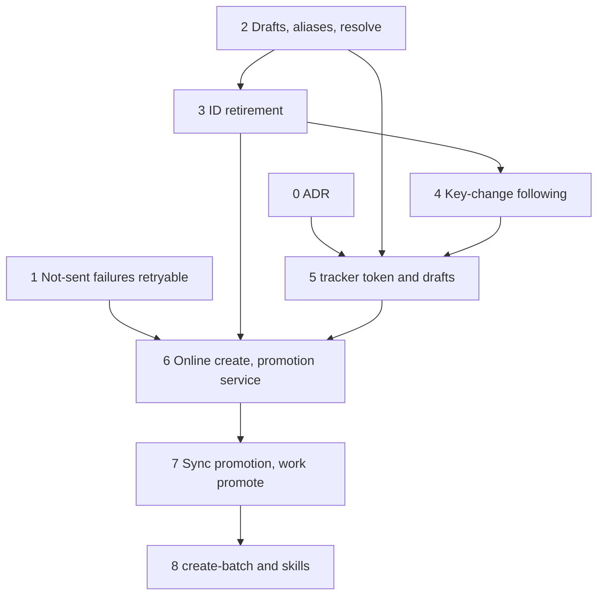

# Tracker-Owned Work Item ID Generation Implementation Plan

## Overview

Under `work.id_pattern: "{tracker}"` the Jira or Linear key becomes a work
item's `id`. `work create --push` creates the remote issue first and adopts
its key. Every creation that confirms no issue writes a `draft-` item into
`meta/work/drafts/`, which `work sync` (or `work promote`) later promotes.
The plan builds the identity foundations first — drafts visible to every
reader, `aliases`, resolution by alias and `external_id`, ID retirement,
following tracker-side key changes — then layers `{tracker}` creation,
promotion, a batch-create command, and the skill changes on top. Each phase
leaves `mise run` green and merges on its own.

## Current State Analysis

The codebase today mints every `id` locally and joins remote identity on
`external_id` (ADR-0044, accepted, which explicitly rejected using the
remote key as `id`).

- `{tracker}` fails the pattern grammar. `compile()` returns
  `UnknownToken` (`cli/corpus-adapters/src/work_item_pattern.rs:212`), so
  `work next-number`, `work create`, sync's pull-side `allocate_id`, and the
  visualiser's boot (`cli/visualiser/server/src/compose.rs:197`) all fail.
  `resolve_scheme` (`cli/work-cli/src/config.rs:52-79`) is the only shared
  configuration seam and does no grammar validation.
- A connect or DNS failure on create classifies as `Terminal`. Both clients
  flatten `reqwest` send errors into `ClientError::Transport { detail }`
  (`cli/jira-client/src/transport.rs:193-196`,
  `cli/linear-client/src/transport.rs:188-197`), and `Outcome::Transport`
  is never "provably unapplied" (`cli/jira-client/src/classify.rs:47-62`,
  `cli/linear-client/src/classify.rs:127-159`). `is_connect()` is consulted
  only for message text.
- `work create --push` allocates the local id, substitutes it into the body
  (`resolve_body`, `cli/work-cli/src/create.rs:241-258`), names the
  `pending_push` marker by `slugify(title)` (`create.rs:479`), and on
  `LocalSave` / `LoudTerminal` still writes a local file. A local write
  failure after a successful create is exit 1 and never retried. No
  baseline entry is recorded (bug 0296 Defect 1).
- Sync cannot observe a key change. `RemoteIssue` has no key
  (`cli/tracker/src/lib.rs:107-132`); Jira `show_op` never reads
  `payload["key"]` (`cli/jira-client/src/client.rs:430-441`); both
  `fetch_all` implementations match the requested key exactly and mark a
  moved issue `absent`. A moved issue is `RemoteAbsent` (exit 4) and
  untracked discovery imports its new key as a second file.
- Five readers scan `meta/work/` flat: `FilesystemLister`
  (`cli/work-adapters/src/filesystem.rs:16-39`), `corpus_carries_external_id`
  (`cli/work-cli/src/create.rs:260-288`), `discover_items`
  (`cli/work-cli/src/sync.rs:101-137`), `list::scan`
  (`cli/work-cli/src/list.rs:109-147`), and the visualiser's
  `LocalFileDriver::list`. Frontmatter validation already recurses.
- `work resolve` matches filename prefixes case-sensitively
  (`cli/work/src/resolve.rs:229-255`) and knows nothing of `external_id` or
  `aliases`.
- No multi-file transaction exists. `store::atomic_write` is per file
  (`cli/store/src/lib.rs:92-104`); migration `m0002`'s rename-and-rewrite
  helpers are private and non-transactional; pup forbids `work` from
  importing `migrate` (`cli/pup.ron:98-115`).
- `last-sync.json` is keyed by local `id` with no rename operation
  (`cli/work-adapters/src/sync/baseline.rs:44-47`,
  `cli/work-adapters/src/sync/baseline_store.rs`).
- `work list` shows the Sync column whenever `work.integration` is set
  (`classify_labels`, `cli/work-cli/src/list.rs:652-675`), contradicting
  the skill text and 0230's acceptance criteria.
- `extract-work-items` allocates with `work next-number --count N` and writes
  files with the Write tool; it has no push offer and no intra-batch parent
  linking.

## Desired End State

With `work.id_pattern: "{tracker}"` and `work.integration` of `jira` or
`linear`:

- `work create --push` against a reachable tracker writes
  `meta/work/<KEY>-<slug>.md` whose `id`, filename prefix, H1 and
  `external_id` all equal the tracker key, records a sync baseline, and the
  remote description carries the same H1.
- Every creation that confirms no issue writes
  `meta/work/drafts/draft-xxxxxx-<slug>.md`; `work sync` promotes drafts by
  default, `work promote` promotes one, and promotion retires the draft ID
  into `aliases` and rewrites it across `meta/`.
- `work sync` follows tracker-side key changes under every pattern, and
  retires the old key under `{tracker}`.
- `work resolve` matches `id`, `aliases` and `external_id`
  case-insensitively.
- `extract-work-items` creates its batch through `work create-batch`.

Legacy items keep their IDs. Verification: every acceptance criterion in
`meta/work/0230-tracker-owned-work-item-id-generation.md` maps to at least
one automated test named in the phase that delivers it, and `mise run`
exits 0.

### Key Discoveries:

- The hexagonal split holds the change: decisions are pure functions in
  `cli/work` and `cli/corpus` (`push_decide`, `push_precondition`,
  `resolve`, sync `classify`/`decide`); adapters live in `work-adapters`,
  composition in `work-cli`. `work` may import only std, `kernel::Error`,
  `config`, `corpus`, `tracker` (`cli/pup.ron:98-115`).
- `work`, `corpus`, `store`, `tracker` are pinned public-API crates
  (`tasks/public_api.py:15-28`); new `pub` items need
  `mise run public-api:update`.
- `accelerator-work` is bin-only; `ConfiguredTrackers` test seams are
  `#[cfg(test)] pub(crate)` (`cli/work-cli/src/tracker_registry.rs:171-186`).
  End-to-end create tests therefore run as unit tests inside `work-cli`
  against `RecordingTracker` through `FixedRegistry`
  (`cli/work-cli/src/create.rs:851-866`), and real-client behaviour is tested
  in the client crates against `cli/http-test-support`.
- The CLI surface is pinned by `cli/work-cli/tests/cli_surface.rs:12-24` and
  `cli/work-cli/tests/fixtures/cli_surface.golden`.
- `RecordingTracker` (`cli/tracker-test-support/src/lib.rs`) matches ids
  exactly and has no notion of a moved key; it gains builders here.
- Whole-token matching without lookaround follows the hand-rolled boundary
  idiom of `cli/migrate/src/migrations/m0002.rs:500-526`.
- Hierarchy walking (`cyclic_members`, `child_index`) is private to
  `cli/work-cli/src/list.rs:374-429` and moves into `work` for batch
  ordering and for 0291.

## What We're NOT Doing

- Setting remote parent-child links (0291); pushing `blocks`, `blocked_by`,
  `relates_to`.
- Trackers other than Jira and Linear under `{tracker}`.
- `aliases` on any artifact type other than work items.
- Showing drafts in the visualiser; it only has to boot and index normally
  under `{tracker}`.
- Re-keying existing IDs or a `work rekey` command (0302). ID retirement is
  built as a reusable unit but has no direct CLI entry point here.
- Bug 0296 Defects 2 and 3 (projected title line on pull, dossier noise).
  Defect 1 — baseline on `work create --push` — is absorbed.
- `accelerator config validate` itself (0227). This plan puts the
  `{tracker}` rules in a pure validator 0227 will call.
- Adding `aliases` to `work update`'s `LIST_FIELDS`; only ID retirement
  writes aliases.
- Changing `extract-work-items` for non-`{tracker}` patterns; its
  `next-number` + Write flow stays for legacy patterns.
- Refactoring `refine-work-item` beyond steering it onto `work create` under
  `{tracker}`.

## Implementation Approach

Identity foundations land before anything configures `{tracker}`, so each
earlier phase is useful under every pattern and later phases only compose
them. The order is:



Every phase is test-first. Each "Changes Required" section lists the failing
tests to write first, then the production changes that turn them green.
Test names below are behaviour descriptions; implementers may adjust
wording to local conventions.

The user-decided design points:

- ADR-0044 is superseded by a new ADR in Phase 0.
- After a `{tracker}` create, a follow-up `update` rewrites the remote H1
  to the tracker key; when it fails, the baseline's local digest is taken
  over the draft-ID content so the next sync pushes the correction.
- `work next-number` under `{tracker}` returns fresh draft IDs.
- 0296 Defect 1 is fixed here for every pattern.
- Batch extraction goes through a new `work create-batch` subcommand.

---

## Phase 0: Superseding ADR

### Overview

Record the decision that the tracker owns `id` under `{tracker}`, superseding
ADR-0044, before any code changes land.

### Changes Required:

#### 1. New ADR

**File**: `meta/decisions/ADR-0070-tracker-owned-work-item-identity.md`
**Changes**: Create through `/accelerator:create-adr`, then accept through
`/accelerator:review-adr`. Content:

> Implementation note: written directly from this content and committed as
> `accepted`, rather than through the interactive skills.

- Context: the two-identifier cost (294 items carrying `NNNN` and `PP-NNN`),
  ADR-0044's rejection of option 2 and why its objections no longer hold
  when the behaviour is opt-in per `id_pattern` and restricted to Jira and
  Linear.
- Decision:
  - Under `{tracker}`, `id` equals `external_id` and is set by the
    tracker.
  - Unconfirmed creations are `draft-` items with a provisional ID.
  - An `id` changes only by promotion, tracker-side key change, or
    explicit re-key, each through ID retirement recording `aliases`.
  - Presence-based sync classification is unchanged.
- Consequences: file renames and `meta/`-wide reference rewrites on
  retirement; accepted ADRs' typed links are rewritten because a typed
  link is a reference, not decision content; legacy IDs are kept.
- Frontmatter: `supersedes: ["adr:ADR-0044"]`,
  `relates_to: ["adr:ADR-0034", "adr:ADR-0033"]`, `parent: "work-item:0230"`.

#### 2. ADR-0044 status

**File**: `meta/decisions/ADR-0044-remote-work-item-identity-in-external-id.md`
**Changes**: Transition `status` to `superseded` through
`/accelerator:review-adr` (the only permitted edit to an accepted ADR).

### Success Criteria:

#### Automated Verification:

- [x] Frontmatter validates:
      `accelerator corpus frontmatter validate --file meta/decisions/ADR-0070-tracker-owned-work-item-identity.md`
- [x] Whole corpus still clean: `mise run test:unit:cli` (includes
      `this_repositorys_own_corpus_is_clean`)

#### Manual Verification:

- [x] ADR-0070 is `accepted` and ADR-0044 is `superseded`.
- [ ] The ADR's decision matches the work item's Requirements section.

---

## Phase 1: Not-Sent Failures Are Retryable

### Overview

Distinguish a request that provably never left the client from one whose
effect is unknown. A not-sent create becomes `Retryable`, so `push_decide`
retries once and then yields `local-save`. This makes "tracker unreachable →
`local-save`" true for connection refused, DNS failure, and connect
timeout, under every pattern.

### Changes Required:

#### 1. Failing tests first

**File**: `cli/jira-client/src/classify.rs` (unit tests)

- `a_create_that_was_never_sent_is_retryable`
- `a_create_whose_transport_failed_after_sending_is_terminal` (existing
  behaviour pinned)

- `a_body_that_cannot_be_converted_is_rejected_and_names_its_cause`
- `a_bad_path_is_rejected`

**File**: `cli/linear-client/src/classify.rs` (unit tests): the first two,
and `a_payload_that_cannot_be_serialised_is_rejected`.

> Implementation note: the classification tests live in the existing
> `cli/jira-client/tests/classify.rs` and `cli/linear-client/tests/classify.rs`,
> alongside `an_invalid_request_is_rejected_on_both_mutations` (Jira) and new
> status-table rows for `NotSent` and `RequestInvalid`.
> `a_body_that_cannot_be_converted_is_rejected_and_names_its_cause` and
> `a_bad_path_is_rejected` exercise the client through the port, so they live
> in `cli/jira-client/tests/port.rs`. Linear's serialisation failure cannot be
> induced through the client, so its test classifies `RequestInvalid`
> directly. Both transports' existing "a transport failure makes exactly one
> attempt" tests became
> `a_refused_connection_is_not_sent_and_makes_exactly_one_attempt`, now
> asserting `ClientError::NotSent`.

**File**: `cli/jira-client/tests/` and `cli/linear-client/tests/` (the
existing transport integration test files)

- `create_against_a_refused_connection_is_retryable`: bind a
  `std::net::TcpListener` on `127.0.0.1:0`, read its port, drop it, point
  the transport at `http://127.0.0.1:<port>`, call `create`, assert
  `TrackerError::Retryable`. If the probe finds the port reused, it
  redraws a port, up to three times.
- `create_that_stalls_after_sending_is_terminal`: `Route::Stall` from
  `http-test-support`, assert `TrackerError::Terminal`.
- `a_503_then_a_refused_connection_is_terminal`: over a new
  `http-test-support` route, `Route::StatusThenShutdown(503)`, which serves
  one response and stops accepting. The route counts accepted connections
  before closing; the transport exposes its attempt count to tests. Assert
  `TrackerError::Terminal`, one accepted request, two transport attempts,
  and a connect failure in the error detail, so the test cannot pass
  without the refused retry.
- `an_update_against_a_refused_connection_is_retryable`

> Implementation note: no attempt count is exposed on the transport. The
> tests assert the second attempt through the `RecordingSleeper`'s single
> recorded backoff, and one accepted request through the mock's hit count.
> The refused-port probe is shared as `http_test_support::refused_base_url()`,
> and both helpers are pinned in `cli/http-test-support/tests/server.rs`.

**File**: `cli/work-adapters/tests/sync_create.rs`

- `an_unreachable_tracker_leaves_no_marker_for_a_local_create`:
  `RecordingTracker::failing_create(TrackerError::Retryable { .. })`,
  assert no marker remains and the item's report row is a retryable
  failure.
- `a_rejected_create_leaves_no_marker_and_reports_its_cause`

**File**: `cli/work-cli/src/create.rs` (unit tests)

- `a_rejected_push_is_rejected_exits_75_and_leaves_no_marker`
- `a_rejected_create_from_local_renders_a_rejected_failed_row`
- `a_rejected_legacy_create_still_writes_the_unsynced_file_and_prints_its_path`

> Implementation note: `a_rejected_create_from_local_renders_a_rejected_failed_row`
> lives in `cli/work-cli/src/sync.rs`, beside `render_report`. `create.rs`
> also gains `a_rejected_create_is_never_retried`. The create exit code moved
> onto `work::sync::PushOutcome::exit_code()` so the frozen
> `keyword_exit_codes.rs` oracle can reach it from the bin-only crate.

**File**: `cli/work-cli/src/update.rs` (unit tests)

- `an_update_whose_request_is_invalid_exits_75_and_keeps_the_baseline`

**File**: `cli/work-cli/src/sync.rs` (unit tests)

- `sync_exit_code_ranks_rejected_between_awaiting_human_and_unconfigured`

**File**: `cli/work-cli/tests/keyword_exit_codes.rs` (new, frozen oracle)

- `every_keyword_maps_to_its_frozen_exit_code`: literal `(keyword, code)`
  pairs checked against `PushOutcome::keyword()` and the exit mapping.
  Phases 6–8 add their keywords to the same frozen list.

#### 2. Transport error shape

**Files**: `cli/jira-client/src/transport.rs`,
`cli/linear-client/src/transport.rs`
**Changes**: Split `ClientError::Transport` into `ClientError::NotSent` and
`ClientError::Transport`. `send()` maps a `reqwest::Error` with
`is_connect()` to `NotSent` only on the first attempt of its retry loop; a
connect failure after an earlier attempt received a response (e.g. a 503)
stays `Transport`, because that earlier request may have been applied.
Everything else stays `Transport`.

Client-side pre-send failures are provably unapplied. `BadPath` keeps its
own variant, with its `path` and `reason` fields and its `E_REQ_BAD_PATH`
message. Payload serialisation and Jira's ADF conversion
(`cli/jira-client/src/mutation.rs:88-95`) map to a new
`ClientError::RequestInvalid { detail }`. Both classify through
`Outcome::RequestInvalid`. They are provably unapplied but
deterministic, so a retry cannot clear them.

#### 3. Outcome and classification

**Files**: `cli/jira-client/src/failure.rs`, `cli/jira-client/src/mutation.rs`,
`cli/jira-client/src/classify.rs`, `cli/linear-client/src/client.rs`
(`call_op`, `:357-375`), `cli/linear-client/src/classify.rs`
**Changes**: Add `Outcome::NotSent` and `Outcome::RequestInvalid`, mapped
from the matching `ClientError`s at the create/update call sites.

```rust
let provably_unapplied = match outcome {
    Outcome::NotSent | Outcome::RequestInvalid => true,
    Outcome::Status(400 | 401 | 403 | 404 | 410 | 429) => true,
    Outcome::Status(_) | Outcome::NonJsonBody | Outcome::Transport => false,
};
```

`NotSent` classifies as `TrackerError::Retryable`. `RequestInvalid`
classifies as `TrackerError::Rejected { detail }`, a new class that is
provably unapplied but not retryable.

#### 3a. Rejected creates

**Files**: every `TrackerError` match site:

- `cli/tracker/src/lib.rs` (the class table);
- `cli/work-cli/src/exit_codes.rs` (`for_tracker_error`);
- `cli/work-cli/src/create.rs`, `update.rs` and `sync.rs`;
- `cli/work-adapters/src/sync/apply.rs` (`FailureClass`);
- `cli/jira-client/src/classify.rs` and `cli/linear-client/src/classify.rs`;
- `cli/tracker-test-support/src/lib.rs` and `contract.rs`;
- `cli/tracker/tests/errors.rs`;
- `cli/work/src/sync/push_decide.rs`;
- `cli/jira-cli/src/exit_codes.rs` and `cli/linear-cli/src/exit_codes.rs`,
  whose codes and `E_REQ_*` messages are unchanged for existing failures:
  `NotSent` keeps `REQ_CONNECT`/`CONNECT` (21) and `E_REQ_CONNECT`;
  `BadPath` keeps `REQ_BAD_PATH` (17); the new `RequestInvalid` maps to
  the existing `REQ_BAD_REQUEST`/`BAD_REQUEST` (34). The pinned
  `cli/jira-cli/tests/fixtures/captured-exit-codes.txt` gains the
  `RequestInvalid` row.

> Implementation note: the fixture maps constant names to integers, and
> `RequestInvalid` reuses the existing `REQ_BAD_REQUEST` (34), so no row was
> added and the fixture is unchanged. The new mappings are pinned in the
> `jira-cli` and `linear-cli` `exit_codes.rs` unit tests. In `contract.rs`,
> the read property now also rules out `Rejected`.

**Changes**: Add `REJECTED: u8 = 75` to `exit_codes.rs`, documented as
"provably unapplied; the request itself must change". It sits outside
`TERMINAL` (71), whose meaning stays "a remote issue may already exist",
and the precedence becomes `71 > 4 > 75 > 74 > 70` everywhere.

- `PushOutcome::Rejected`, keyword `rejected`, exit 75, removes the
  marker, because no issue can exist; the cause goes to stderr.
- `FailureClass::Rejected` renders a failed row's detail as `rejected`.
- The same code and the same keyword, `rejected`, apply on every path:
  `work create --push`, `create-batch`, sync's create-from-local, and
  promotion's `NotPromoted::RequestRejected`. The domain term throughout
  is "rejected": provably unapplied because the request itself is invalid
  (client-side, before sending); server 4xx responses keep their existing
  classes.
- `work update --push` reports `E_PUSH_REJECTED` and keeps its baseline
  entry, because nothing was applied.
- Contract pins updated in this phase:
  - the golden row `75|1|0|rejected` (and the `rejected` keyword in its
    header vocabulary) in `cli/work/tests/fixtures/work-item-push-decide.golden`,
    and its hash in `cli/work-adapters/tests/fixtures/bash-parity-baseline.txt`;
  - `("REJECTED", 75)` in `FROZEN_DISPATCH_CODES`
    (`cli/work-cli/tests/exit_codes_parity.rs`);
  - the `exit_codes.rs` band doc, which now names 70, 71 and 75 as the
    tracker-error classes.
- Under a legacy pattern, `rejected` still writes the unsynced local file
  and prints its path on line 1, as `loud-terminal` does today.

#### 4. Skill wording

**File**: `skills/work/create-work-item/SKILL.md` (outcome table,
`:563-567`)
**Changes**: `local-save` row now also covers "tracker unreachable". A
new `rejected` row (exit 75): no issue exists and the request must change;
relay the cause from stderr.

**File**: `skills/work/sync-work-items/SKILL.md` (exit codes and failed-row
details, `:183-203`)
**Changes**: Add exit 75, the precedence `71 > 4 > 75 > 74 > 70`, and the
`rejected` failed-row detail.

### Success Criteria:

#### Automated Verification:

- [x] New client tests pass:
      `cd cli && cargo test -p jira-client -p linear-client`
- [x] Sync create test passes:
      `cd cli && cargo test -p work-adapters --test sync_create`
- [ ] Tracker contract suite passes: `mise run test:integration:tracker-contract`
- [x] `mise run public-api:update && mise run public-api:check`
- [x] `cd cli && cargo test -p work --test sync_push_decide && cargo test -p work-adapters --test bash_parity_baseline && cargo test -p accelerator-work --test exit_codes_parity --test keyword_exit_codes`
- [x] `cd cli && cargo test -p http-test-support`
- [x] `cd cli && cargo test -p jira-cli -p linear-cli` (captured exit codes unchanged)
- [x] `mise run check` exits 0
- [x] `mise run` exits 0

> Implementation note: verified by Phase 2's full run, which includes this
> phase's code.

#### Manual Verification:

- [x] With networking disabled, `accelerator work create "T" task low --push`
      under a configured Jira reports `local-save` and exits 0.
      Observed 2026-09-29 in a scratch repo with placeholder Jira
      credentials, network denied by `sandbox-exec`: `local-save`, exit 0,
      the file written without `external_id`, no marker left. The same
      run's `--dry-run` failed with `E_REQ_CONNECT` (exit 70), and without
      credentials with `E_AUTH_NO_EMAIL` (exit 74), so the save followed
      a connection failure, not missing configuration.

---

## Phase 2: Draft-Aware Discovery, `aliases`, and Identity Resolution

### Overview

Introduce one discovery port that sees `meta/work/drafts/`, the `aliases`
field, `work resolve` over `id` / `aliases` / `external_id`, and the
draft-aware Sync column. Nothing creates drafts yet; tests place draft files
directly. All of this is pattern-independent.

### Changes Required:

#### 1. Failing tests first

**File**: `cli/work/src/identity.rs` (new, unit tests)

- `a_draft_id_has_the_draft_prefix_and_six_crockford_characters`
- `an_all_digit_draft_suffix_is_not_a_draft_id`
- `a_token_resolves_by_id_alias_or_external_id_ignoring_case`
- `a_token_matching_one_item_through_several_fields_resolves_to_it`
- `a_token_matching_different_items_through_different_fields_is_ambiguous_naming_each_field`
  (item A `external_id: "ENG-42"`, item B `aliases: ["ENG-42"]`)
- `resolving_pp_760_finds_legacy_item_0230_by_external_id`
- `a_key_already_carried_as_another_items_external_id_is_linked`
  (case-insensitive; legacy `0230` with `external_id: "PP-760"`)

**File**: `cli/work/src/resolve.rs` (unit tests)

- `a_draft_id_is_not_classified_invalid_under_a_numeric_pattern`
- `bare_number_candidates_never_include_drafts`

**File**: `cli/work-adapters/tests/work_item_files.rs` (new)

- `discovery_includes_markdown_files_in_the_drafts_directory`
- `discovery_ignores_non_markdown_and_nested_directories_below_drafts`
- `canonical_files_exclude_the_drafts_directory`
- `a_missing_drafts_directory_yields_only_canonical_items`

**File**: `cli/work-cli/src/resolve.rs` (unit tests, temp-dir corpus)

- `work_resolve_returns_a_draft_path` (AC: `work resolve draft-k7mq3x`)
- `work_resolve_matches_an_alias_case_insensitively` (`DRAFT-K7MQ3X`)
- `work_resolve_pp_900_and_lowercase_resolve_an_item_whose_id_and_external_id_agree`
- `an_unknown_tracker_key_under_tracker_is_not_found`
- `a_bare_legacy_number_under_tracker_resolves_the_padded_item`
- `work_resolve_exits_ambiguous_naming_both_items_and_fields`

**File**: `cli/work-cli/src/sync.rs` (unit tests, through the real
`resolve_with` over a temp corpus)

- `a_target_that_is_one_items_id_and_anothers_external_id_is_a_local_collision`
- `a_target_that_is_several_items_external_id_is_ambiguous_external`
- `a_target_matching_an_alias_names_the_retiring_item`
- `a_lowercase_key_target_resolves_its_item`

**File**: `cli/work-cli/src/list.rs` (unit tests)

- `the_sync_column_reads_draft_for_a_draft_only`
- `with_no_baseline_and_no_draft_the_sync_column_is_absent`
- `with_a_baseline_the_sync_column_is_present`

**File**: `cli/work-cli/src/sync.rs` (unit tests) and
`cli/work-cli/src/create.rs` (unit tests)

- `sync_discovery_includes_drafts`
- `the_push_duplicate_check_sees_external_ids_in_drafts`

**File**: `cli/corpus/src/frontmatter_validation/mod.rs` and
`cli/corpus-cli/tests/frontmatter_goldens.rs`

- `a_work_item_with_aliases_validates`
- `a_typed_link_to_a_draft_id_resolves_when_the_draft_exists`
  (`parent: "work-item:draft-k7mq3x"`)
- `work_create_accepts_a_template_declaring_aliases` (drift guard)

**File**: `cli/work/src/work_item_files.rs` (unit tests, `identities`)

- `aliases_are_read_from_an_inline_list`
- `aliases_are_read_from_a_block_list`
- `quoted_and_unquoted_values_are_read_alike`
- `an_empty_aliases_list_yields_none`
- `id_falls_back_to_work_item_id`

#### 2. Identity domain

**File**: `cli/work/src/identity.rs` (new; `pub mod identity` in
`cli/work/src/lib.rs`)
**Changes**: A read model of each item's identifying fields and a pure
resolver over it. `IdentityMatch` records which field matched.

`DraftId` lives in `cli/work/src/draft_id.rs` (new in this phase;
Phase 5 adds minting beside it):

```rust
pub struct DraftId(String);

impl DraftId {
    pub const PREFIX: &'static str = "draft-";
    pub fn parse(raw: &str) -> Option<Self>;
    pub fn as_str(&self) -> &str;
}
```

The identity read model in `cli/work/src/identity.rs`:

```rust
pub struct ItemIdentity {
    pub path: PathBuf,
    pub id: String,
    pub aliases: Vec<String>,
    pub external_id: Option<String>,
}

pub enum IdentityField { Id, Alias, ExternalId }

pub struct IdentityMatch<'a> {
    pub item: &'a ItemIdentity,
    pub field: IdentityField,
}

pub enum IdentityResolution<'a> {
    Unique(&'a ItemIdentity),
    Conflicting(Vec<IdentityMatch<'a>>),
    Unmatched,
}

pub fn resolve_identity<'a>(
    token: &str,
    items: &'a [ItemIdentity],
) -> IdentityResolution<'a>;

pub fn holder_of(candidate: &str, items: &[ItemIdentity]) -> Option<IdentityMatch<'_>>;

pub fn linker_of<'a>(key: &str, items: &'a [ItemIdentity]) -> Option<&'a ItemIdentity>;
```

`own_identity::own_identity_alias` is renamed
`own_identity_fallback_field`, so "alias" means only a retired ID in
`work`.

`DraftId::parse` accepts `^draft-[0-9a-hjkmnp-tv-z]{6}$` (case-insensitive
input, canonical lowercase) with at least one letter in the suffix.
`holder_of` checks `id` and `aliases` case-insensitively; retirement and
draft minting reuse it. `linker_of` checks `external_id`
case-insensitively; every path that binds a key to an item calls it.

> Implementation note: `corpus::is_tracker_key` (Phase 3 §2) and
> `corpus::TRACKER_TOKEN` (Phase 5 §2) landed here, because
> `an_unknown_tracker_key_under_tracker_is_not_found` needs
> `classify_input` to read `ENG-999` as a `FullId` under `{tracker}`.
> `classify_input` also returns `FullId` for any `DraftId`, and bare-number
> search skips `draft-`-prefixed filenames. `IdentityField::frontmatter_key`
> names each field for diagnostics.

#### 3. Discovery port and adapter

**File**: `cli/work/src/work_item_files.rs` (new; named so it does not
shadow the `corpus` crate)

```rust
pub struct WorkItemFile {
    pub path: PathBuf,
    pub content: String,
}

pub trait WorkItemFiles {
    fn files(&self) -> Result<Vec<WorkItemFile>, kernel::Error>;

    fn canonical(&self) -> Result<Vec<WorkItemFile>, kernel::Error>;
}

pub fn identities(files: &[WorkItemFile]) -> Vec<ItemIdentity>;
```

`identities` parses `id` (falling back to `work_item_id`), `aliases` and
`external_id` with the line-level frontmatter reading `work` already uses
(no `document` dependency, which pup forbids in `work`).

**File**: `cli/work-adapters/src/filesystem.rs`, beside `FilesystemLister`
and under its existing `work_adapters_filesystem_reads_in_process` pup rule
(with a probe pair added to `tests/integration/pup/test_import_rule.py`:
a module importing a denied crate as the violation, one importing
`kernel::Error` as the compliant control),
whose `allowed_only` list in `cli/pup.ron` gains `^kernel::Error(::|$)`
for the port's error type
**Changes**: `FilesystemWorkItemFiles { work_dir }` lists `*.md` in
`work_dir` and `work_dir/drafts`, sorted by path, reading each file;
`canonical()` lists `work_dir` alone.
`drafts_dir(work_dir) -> PathBuf` is the single definition of the drafts
location.

> Implementation note: the domain also exposes `identity_of(&WorkItemFile)`,
> which `identities` maps over, so `list` and `sync` build one item per file.
> A missing directory yields no files; any other listing failure is an
> error, which `sync` exits 1 on and `list` reports as `Failed`.

#### 4. Readers moved onto the port

**Files and changes**:

- `cli/work-cli/src/sync.rs` `discover_items`: iterate
  `FilesystemWorkItemFiles`, building each `LocalItem` from its
  `ItemIdentity`.
- `cli/work-cli/src/create.rs` `corpus_carries_external_id`: compare via
  `identities`, case-insensitively.
- `cli/work-cli/src/list.rs` `scan`: iterate `FilesystemWorkItemFiles`,
  building each `ScannedItem` from its `ItemIdentity`.
- `identities` is the only parse of `id`, `work_item_id`, `external_id`
  and `aliases`, so quote stripping and the `work_item_id` fallback agree
  across `list`, `sync`, `create` and `resolve`.
- `cli/work-cli/src/resolve.rs` `resolve_with`: first
  `resolve_identity(token, &identities)`. `Unique` → `Resolved`,
  `Conflicting` → `Ambiguous` with tags `id` / `aliases` / `external_id`,
  `Unmatched` → the existing filename-based `classify_input` path over
  canonical-directory filenames only. `E_RESOLVE_INVALID` is returned only
  when the identity lookup is unmatched and the token fails
  `classify_input`.
- `cli/work-cli/src/sync.rs` `resolve_targets`: `work sync --target`
  resolves through the same `resolve_with`, so its diagnostics are kept by
  mapping a `Conflicting` result by `IdentityField`:
  - `Id` against `ExternalId` → `LocalCollision`, naming both files and
    the remedy, as today;
  - several `ExternalId` matches → `AmbiguousExternal`;
  - a `Alias` match → a new message naming the alias and the item
    that retired it.
- `FilesystemLister` reads through `WorkItemFiles::canonical()` for
  `allocate_id` and `next-number`, so the exclusion of drafts from
  numbering is explicit at the call site.

> Implementation note: `resolve_with` returns a new
> `RunOutcome::Conflicting(Vec<IdentityCandidate>)`, carrying a typed
> `IdentityField`, rather than `Ambiguous` with string tags, which a
> project-prefix tag could collide with. `main` renders it as
> `E_RESOLVE_AMBIGUOUS` with a `[id|aliases|external_id]` suffix, exit 2.
> In `sync`, the new failure is `TargetResolutionFailure::RetiredAlias`
> (exit 2); an `id`-against-`id` conflict maps to `AmbiguousLocal`.
> `external_id_index` and `colliding_file` were removed, since the
> identity lookup subsumes them, and the fake-resolver tests they backed
> were rewritten against a temp corpus. `allocate_id` and `next-number`
> still use `FilesystemLister`, which already lists only the canonical
> directory; they were not moved onto `canonical()`. The
> `cli_create_push` fixture item carrying `external_id` without `id` gained
> `id: "0001"`, since a file with no `id` is no longer a work item to the
> duplicate check.

#### 5. `aliases` in schema, template and create

**Files**:

- `templates/work-item.md`: add `aliases: []` after `external_id`, with a
  trailing comment in the file's existing style: `# retired IDs of this
  item; omit when empty`.
- `cli/corpus/src/frontmatter_validation/schema.rs` (work-item row extras)
  and `templates-schema.tsv` row 2: add `aliases`.
- `OPTIONAL_EXTRAS` (`schema.rs:305-312`): add `aliases`.
- `cli/work/src/create.rs` `KNOWN_FRONTMATTER_KEYS`: add `aliases`.
  `compose_frontmatter` omits it (always empty at create).

> Implementation note: `templates-schema.tsv` now lives at
> `cli/corpus/src/frontmatter_validation/templates-schema.tsv` as the
> fixture `every_row_matches_templates_schema_tsv` reads. The two
> draft-link goldens passed before any change, because the whole-corpus
> walk already recurses into `drafts/`, and are kept as characterisation
> tests.

#### 6. Sync column rule

**File**: `cli/work-cli/src/list.rs` `classify_labels`, `sync_column`,
`sync_label`
**Changes**: The column is rendered when a baseline file exists or any
scanned item's `id` parses as a `DraftId`. A draft's label is
`RenderableState::Draft`, `🟠 draft`, defined in `work::sync::label` with
the other coloured-circle labels (its doc notes that `Draft` comes from the
item's ID, not from a `SyncState`) and tested through
`sync_label_maps_every_state_to_the_skill_vocabulary`; it applies
regardless of any computed state. Without a baseline, non-draft items get
the presence label as today.

#### 7. Skill text

**File**: `skills/work/list-work-items/SKILL.md` (`:28-32`, `:146-153`,
`:195-198`)
**Changes**: Document the `🟠 draft` label, the column rule, and that items
in `meta/work/drafts/` are listed; state that a draft item (one with a
provisional ID) is unrelated to `status: draft`; replace "filename is authoritative" with
"frontmatter `id` is authoritative".

### Success Criteria:

#### Automated Verification:

- [x] Domain tests: `cd cli && cargo test -p work identity resolve`
- [x] Adapter tests: `cd cli && cargo test -p work-adapters --test work_item_files`
- [x] CLI unit tests: `cd cli && cargo test -p accelerator-work`
- [x] Frontmatter goldens and self-corpus check:
      `cd cli && cargo test -p accelerator-corpus --test frontmatter_goldens`
- [x] Public API snapshots updated deliberately:
      `mise run public-api:update && mise run public-api:check`
- [x] `mise run pup:check` exits 0
- [x] `mise run test:integration:pup`
- [x] `mise run` exits 0

> Implementation note: the full run's only failure was
> `test_cold_path_forks_the_backend_once_with_no_missing_input`, a
> bootstrap timeout in shell this phase does not touch; it passed on
> rerun.

#### Manual Verification:

- [x] `accelerator work resolve PP-760` returns
      `meta/work/0230-tracker-owned-work-item-id-generation.md` in this repo.
- [x] `accelerator work list` in this repo renders the Sync column only
      when `last-sync.json` exists.
      Present with this repo's Linear baseline. The absent case was
      observed 2026-09-29 on a scratch copy of this repo's `meta/work/`
      and shared config: no Sync column without `last-sync.json`, and the
      column back once this repo's `last-sync.json` was copied in (network
      denied, no credentials, nothing on stderr).

---

## Phase 3: ID Retirement

### Overview

The single operation that replaces an item's `id`: move the file, set `id`
and H1 (and optionally `external_id`), append the old ID to `aliases`,
rewrite references across the corpus, move the baseline entry — all or
nothing. It is exercised only by tests in this phase and gains callers in
Phases 4 and 7.

### Changes Required:

#### 1. Failing tests first

**File**: `cli/corpus/src/references.rs` (new, unit tests) for the
reference rewriting; `cli/work/src/retirement.rs` (new, unit tests) for
the rest.

- Reference rewriting:
  - `a_typed_link_to_the_old_id_is_rewritten`
  - `prose_whole_tokens_of_a_distinctive_id_are_rewritten`
  - `occurrences_adjacent_to_a_letter_digit_or_hyphen_are_left`
    (`draft-k7mq3x-notes`, `adraft-k7mq3x` unchanged; `(draft-k7mq3x)` →
    `(PP-900)`; `Draft-K7MQ3X` → `PP-900`)
  - `an_underscore_key_is_distinctive_and_rewritten_in_prose`
    (`MY_PROJ-12`)
  - `a_retired_key_that_prefixes_another_leaves_the_other_untouched`
    (`PP-76` → `ENG-42`; `PP-760` unchanged)
  - `a_bare_numeric_id_is_rewritten_only_in_typed_links`
    (`work-item:0230` → `work-item:PP-760`; prose `0230` unchanged)
  - `a_work_item_reviews_work_item_id_equal_to_the_old_id_is_rewritten`
    (`type: "work-item-review"`, `work_item_id: "0230"` →
    `work_item_id: "PP-760"`)
  - `aliases_entries_are_never_rewritten` (inline and block lists)
  - `a_path_reference_to_the_retired_file_is_rewritten`
  - `a_relative_drafts_link_is_rewritten_to_the_work_directory`
    (`meta/work/drafts/draft-k7mq3x-slug.md` → `meta/work/PP-900-slug.md`)
- The retired item's own file:
  - `the_retired_items_file_takes_the_new_ids_filename_id_and_h1`
  - `the_old_id_is_appended_to_aliases`
  - `a_draft_moves_from_the_drafts_directory_to_the_work_directory`
  - `a_new_external_id_is_set_when_given`
- Refusals:
  - `retirement_refuses_when_the_new_id_is_another_items_id`
  - `retirement_refuses_when_the_new_id_is_another_items_alias`
  - `retirement_refuses_when_the_new_external_id_is_linked_by_another_item`
  - `an_interrupted_target_is_exempt_from_the_collision_checks`
  - `retirement_refuses_when_the_target_path_exists`
  - `a_target_holding_the_new_id_without_the_old_alias_is_still_refused`
  - Each refusal names both items and produces no plan.
- Resumption:
  - `an_interrupted_retirement_is_completed_by_the_next_retirement`,
    parameterised over the corpus as left after the rewrites, after `to`
    was written, and after `from` was removed. The plan contains only the
    remaining steps.

**File**: `cli/corpus/src/work_item_id.rs` (unit tests)

- `an_underscore_jira_key_is_a_tracker_key`
- `a_linear_identifier_is_a_tracker_key`
- `a_digit_first_prefix_is_not_a_tracker_key`

**File**: `cli/work-adapters/tests/retirement.rs` (new)

- `applying_a_plan_writes_every_rewrite_and_moves_the_file`
- `applying_a_plan_moves_the_baseline_entry`
- `a_failure_at_any_step_restores_everything`, parameterised over every
  operation index: each rewrite, creating `to`, removing `from`, and the
  baseline write. A fault-injecting `AtomicWrite`/`RemoveFile` fake fails the chosen `write` or
  `remove`, and a faulting `AtomicWrite` under the `BaselineStore` fails
  the baseline step. Assert every file's bytes, the old path, the absent
  new path, and the baseline document equal their pre-retirement state.
- `a_failure_while_restoring_reports_both_failures`
- `an_uncommitted_file_touched_by_a_retirement_is_saved_for_recovery_before_the_first_write`
- `the_recovery_directory_is_removed_after_success_and_after_a_clean_first_rollback`
- `an_incomplete_restore_keeps_the_recovery_copies_of_unrestored_files`
  (the directory survives and each copy equals the pre-retirement bytes)
- `the_recovery_ignore_rule_is_written_before_the_first_copy`
- `plan_retirement_marks_dirty_and_unknown_paths_for_recovery_and_not_clean_ones`
- `a_freshly_written_untracked_draft_is_retired_in_a_git_repo` and
  `…_in_a_jj_repo`, over the real `VcsWorkingCopyStatus` in a temp repo
- `retirement_outside_any_vcs_succeeds` (every path `Unknown`)
- `files_outside_the_corpus_root_are_byte_identical`
- `a_retired_id_resolves_through_its_alias_after_rereading_the_corpus`
- `a_file_changed_after_the_snapshot_aborts_and_rolls_back`,
  parameterised over a rewrite target and `from`
- `an_edit_between_planning_and_applying_is_detected` (returns
  `ChangedSinceSnapshot`; `finish_retirement_replans_once_on_a_changed_file`
  asserts the re-plan)
- `an_existing_recovery_copy_is_never_overwritten`
- `a_rollback_of_a_resumed_retirement_keeps_the_recovery_directory`
- `an_incomplete_restore_marks_the_recovery_directory_restore_pending`
- `a_restore_pending_directory_survives_a_later_successful_retirement`
- `a_rollback_after_the_baseline_rename_keeps_a_concurrent_entry_for_another_item`
- `finish_retirement_removes_the_recovery_directory_on_success`
- `finish_retirement_retries_a_store_failure_once_then_succeeds`
- `finish_retirement_returns_a_planning_refusal`
- `a_crash_after_rewrites_before_to_is_planned_as_resumed`
- `a_restore_pending_marker_is_downgraded_when_the_retirement_completes`
- `a_held_update_lock_on_a_touched_file_blocks_the_retirement_write`
- `a_file_edited_after_the_retirement_wrote_it_is_not_rolled_back_over`
  (reported unrestored; recovery directory kept)
- `an_existing_target_created_after_planning_is_not_overwritten`
  (through the `ExclusiveCreate` fake)
- `a_held_retirement_lock_blocks_a_second_retirement`

**File**: `cli/work-cli/src/sync.rs` (unit tests)

- `an_incomplete_restore_names_both_ids_every_unrestored_path_the_recovery_directory_and_the_remedy`
  (keyword `retirement-incomplete`, exit 71)

**File**: `cli/work-adapters/src/sync/baseline_store.rs` (unit tests)

- `renaming_an_entry_moves_it_in_one_write`
- `renaming_an_absent_entry_is_a_no_op`

#### 2. Tracker key grammar

**File**: `cli/corpus/src/work_item_id.rs`
**Changes**: `pub fn is_tracker_key(token: &str) -> bool` matches
`[A-Za-z][A-Za-z0-9_]*-[0-9]+` case-insensitively, covering Jira's key
alphabet and Linear identifiers. `is_project_prefixed` is unchanged: it
validates legacy `{key}-{number}` IDs, which never contain `_`.

> Implementation note: already landed in Phase 2, with its tests, and
> re-exported as `corpus::is_tracker_key`.

#### 2a. Pure retirement plan

**File**: `cli/work/src/retirement.rs` (new)

```rust
pub struct Retirement<'a> {
    pub old_id: &'a str,
    pub new_id: &'a str,
    pub new_external_id: Option<&'a str>,
}

pub struct RetirementPlan {
    pub from: PathBuf,
    pub from_digest: Option<String>,
    pub to: PathBuf,
    pub retired_item_content: String,
    pub rewrites: Vec<FileRewrite>,
    pub baseline_rename: BaselineRename,
    pub recovery: Vec<PathBuf>,
    pub resumes: bool,
}

pub struct BaselineRename {
    pub from: String,
    pub to: String,
}

pub struct FileRewrite {
    pub path: PathBuf,
    pub expected_digest: String,
    pub content: String,
}

pub enum RetirementRefusal {
    IdTaken { holder: PathBuf, field: IdentityField },
    KeyLinked { holder: PathBuf },
    TargetExists(PathBuf),
    ItemNotFound(String),
}

pub fn plan_retirement(
    retirement: &Retirement<'_>,
    work_dir: &Path,
    items: &[ItemIdentity],
    corpus: &[CorpusFile],
) -> Result<RetirementPlan, RetirementRefusal>;
```

- `work::retirement::CorpusFile { path, content, dirtiness: Dirtiness }`
  is every `.md` under the corpus root; `Dirtiness` is the existing
  `work::sync::decide` type, moved to a shared `work` module.
  `plan_retirement` includes only files whose content changes, lists in
  `recovery` each touched path whose dirtiness is `Dirty` or `Unknown`,
  records `from`'s digest (`None` when a resumed plan finds `from`
  already removed), and sets `resumes` when it recognised an interrupted
  target or the `<old>--<new>` recovery directory already exists (a crash
  after some rewrites but before `to`). It never refuses on dirtiness: a freshly written draft is
  always untracked, and so always dirty.
- `plan_retirement` is the only collision authority for a retirement. It
  first recognises an interrupted retirement (below) and exempts that
  target, then refuses with `IdTaken` when `holder_of(new_id)` finds another
  item and with `KeyLinked` when `new_external_id` is given and
  `linker_of` finds another item. Callers do not pre-check.
- An existing target whose `id` is the new ID and whose `aliases` contain
  the old ID is an interrupted retirement of the same item. The plan then
  holds only the steps still outstanding:
  - the rewrites that still change a file;
  - removing `from`, if it exists;
  - the baseline rename, if the entry is still under the old ID.

  Any other existing target is `TargetExists`.
- Old-ID shape: `Distinctive` when `DraftId::parse` succeeds or
  `is_tracker_key` holds; otherwise `NumericOnly`.
- Token boundary: the characters on both sides of a match must not be ASCII
  alphanumeric or `-`. Matching is ASCII case-insensitive; the replacement
  is `new_id` verbatim.
- The whole `aliases` value is skipped in every file: the key line and,
  for a block list, its indented continuation lines.
- References to the retired file by path are rewritten as exact matches,
  longest first: the repo-relative path, the corpus-relative path, any
  relative path ending in `drafts/<basename>`, then the bare basename. The
  full filename is unambiguous, so no boundary rule applies.
- The typed-link, whole-token and path rewriting is
  `corpus::references::rewrite_references(content, old, new, shape)` in
  the `corpus` crate, reusable for other artifact types.
  `work::retirement` composes it with the work-item-specific edits.
- The retired item's file:
  1. Rewrite references in its body like any other file.
  2. Set `id`, `external_id` when given, and the H1 `# <new>: <title>`.
  3. Append the old ID to `aliases`.
  4. The target is `<work_dir>/<new>-<slug>.md`, where `slug` is the
     filename with the old-ID prefix removed.

#### 3. Transactional applier

**File**: `cli/corpus/src/store.rs`, `cli/corpus/src/lock.rs` (new)
**Changes**: Two new ports beside the existing `scan::CorpusWalker`,
`scan::FileReader` and `store::AtomicWrite`:

```rust
pub trait RemoveFile {
    fn remove(&self, path: &Path) -> Result<(), StoreError>;
}

pub struct HeldLock(Box<dyn Send>);

impl HeldLock {
    pub fn new(guard: impl Send + 'static) -> Self;
}

pub enum LockName {
    Retirement,
    ForFile(PathBuf),
}

pub trait ExclusiveLock {
    fn acquire(&self, name: &LockName) -> Result<HeldLock, StoreError>;
}

pub trait ExclusiveCreate {
    fn create_new(&self, path: &Path, bytes: &[u8]) -> Result<(), StoreError>;
}

pub trait RecoveryCopies {
    fn prepare(&self, dir: &Path) -> Result<(), StoreError>;
    fn write_once(&self, dir: &Path, rel: &Path, bytes: &[u8]) -> Result<(), StoreError>;
    fn remove_dir(&self, dir: &Path) -> Result<(), StoreError>;
}
```

The new ports return `StoreError`, like their sibling `AtomicWrite`, so a
lock timeout keeps its `StoreError::LockTimeout` classification.
`HeldLock` is an opaque release handle: dropping it releases the lock, and
`LockdirLock` puts its concrete lockdir guard inside it.

`LockName` is a domain value; the adapter resolves it to a lockdir. The
`.lockdir` suffix stays an adapter detail. Its doc states the one global
acquisition order, retirement → create → per-file: no holder of a later
lock ever takes an earlier one.

`RecoveryCopies` is a separate store because recovery copies live under
`.accelerator/state/`, outside the corpus root `FileCorpusStore` is bounded
to. `prepare` writes and verifies a `*` `.gitignore` before anything else.

**File**: `cli/corpus-adapters/src/store.rs`, `cli/corpus-adapters/src/lock.rs`
**Changes**:

- `FileCorpusStore` implements `RemoveFile` and `ExclusiveCreate` (write a
  temp file, then `link` it into place, which fails with `AlreadyExists`
  when the target exists, so creation is atomic).
- `LockdirLock` implements `ExclusiveLock` over the existing lockdir code,
  reclaiming from dead holders as today. `LockName::ForFile(p)` resolves
  through the existing private `lockdir(path)` in `store.rs`, which
  becomes the one definition of the per-file name, and `work update`
  (`update.rs:299-307`) switches to `LockdirLock` with
  `LockName::ForFile`. `LockName::Retirement` resolves to
  `<work_dir>/.accelerator-work-retire.lockdir`, a named constant beside
  `LOCK_FILE_NAME`.
- `FileRecoveryCopies`, rooted at `.accelerator/state/`, implements
  `RecoveryCopies` following `pending_push::prepare_dir`.

**File**: `cli/corpus-adapters/src/` (unit tests)

- `create_new_refuses_an_existing_target_and_leaves_its_bytes`
- `create_new_leaves_no_temp_file_on_refusal`
- `remove_of_a_missing_file_reports_it`
- `a_held_exclusive_lock_times_out_as_lock_timeout`
- `a_for_file_lock_name_resolves_to_the_store_s_own_lockdir`
- `recovery_copies_refuse_to_overwrite_an_existing_copy`
- `a_failed_ignore_rule_write_aborts_before_any_copy`

**File**: `cli/work/src/retirement.rs`
**Changes**: The failure types, pure so `work`'s promotion decisions can
refer to them:

```rust
pub enum RetirementFailure {
    RolledBack { cause: RetirementCause },
    RestoreIncomplete { cause: RetirementCause, unrestored: Vec<PathBuf> },
}

pub struct RetirementCause {
    pub path: PathBuf,
    pub kind: RetirementCauseKind,
}

pub enum RetirementCauseKind {
    Store(StoreError),
    ChangedSinceSnapshot,
    TargetAppeared,
}

```

**File**: `cli/work-adapters/src/retirement.rs` (new)

```rust
pub struct RetirementFiles<'a> {
    pub reader: &'a dyn FileReader,
    pub writer: &'a dyn AtomicWrite,
    pub creator: &'a dyn ExclusiveCreate,
    pub remover: &'a dyn RemoveFile,
    pub file_locks: &'a dyn ExclusiveLock,
    pub recovery: &'a dyn RecoveryCopies,
}

pub struct RetirementPorts<'a> {
    pub files: RetirementFiles<'a>,
    pub walker: &'a dyn CorpusWalker,
    pub status: &'a dyn WorkingCopyStatus,
    pub lock: &'a dyn ExclusiveLock,
    pub baseline: &'a BaselineStore<'a>,
}

pub struct RetirementLockGuard(HeldLock);

pub fn acquire_retirement_lock(
    lock: &dyn ExclusiveLock,
) -> Result<RetirementLockGuard, StoreError>;

pub fn apply_retirement(
    plan: &RetirementPlan,
    files: &RetirementFiles<'_>,
    baseline: &BaselineStore<'_>,
    lock: &RetirementLockGuard,
) -> Result<(), RetirementFailure>;

pub fn finish_retirement(
    retirement: &Retirement<'_>,
    recovery_dir: &Path,
    ports: &RetirementPorts<'_>,
    lock: &RetirementLockGuard,
) -> Result<(), FinishFailure>;

pub enum FinishFailure {
    Refused(RetirementRefusal),
    Failed(RetirementFailure),
}
```

`finish_retirement` is the one completion path: it plans (full, or only
the outstanding steps of an interrupted retirement), and makes at most two
apply attempts on any `RolledBack` or `ChangedSinceSnapshot`, re-planning
before the second. On success it removes the recovery directory. A
planning refusal returns `FinishFailure::Refused`, so callers can clear or
rewind their record. Key-change following, key-change reconciliation and
`finish_promotion` all call it, so Phase 3 is complete on its own and
later phases add no second tail. `RetirementPorts` lives in
`work-adapters` and carries the baseline store, so callers thread nothing
separately.

- `RetirementLockGuard` is obtained only through
  `acquire_retirement_lock`, which takes `LockName::Retirement` from the
  `ExclusiveLock` port, so `apply_retirement` cannot run unlocked.
  Exactly one layer acquires it per retirement: each `promote` call and
  each key-change retirement, never a whole pass.
- Snapshot every path the plan touches (including `to`, expected absent).
  The baseline is not snapshotted: its rename is the last write, and a
  rollback after it reverses it with `baseline.rename(new, old)`, which
  re-reads, so concurrent entries for other items survive.
- Before the first write, save through `RecoveryCopies` the snapshot bytes
  of every path in `plan.recovery` under
  `.accelerator/state/retirement-recovery/<old>--<new>/`, mirroring its
  corpus-relative path, and fsync them. VCS cannot restore uncommitted
  content, so this copy is what makes it recoverable.
  - The directory is prepared fail-closed, like
    `pending_push::prepare_dir`: a `*` `.gitignore` is written and verified
    before the first copy.
  - Copies are write-once: an existing copy is never overwritten, so a
    resumed retirement keeps the pre-crash bytes.
  - A clean rollback of a first attempt (`!plan.resumes`) removes the
    directory. A rollback of a resumed retirement keeps it. Otherwise only
    `finish_retirement` removes it on success.
  - An incomplete restore writes `RESTORE-PENDING` into the directory,
    listing the unrestored paths. While it exists, no step removes the
    directory; each run reports it. It is cleared once every listed
    path's current bytes equal its recovery copy or the user deletes the
    file. If the same retirement later completes, the marker is downgraded
    to a one-time notice that the retirement has completed and the copies
    remain for reference, then removed on the next run. The remedy reads
    "compare each path with its recovery copy and merge", because an
    unrestored path carries edits made after the retirement wrote it.
- Acquire the per-file lock (`LockName::ForFile`) for every touched path,
  in sorted path order, and hold them for the whole apply, so writes are
  serialised with `work update`.
- Verify every touched file against the plan: each `FileRewrite`'s
  current bytes must still hash to its `expected_digest`, `from` to its
  planned digest, and `to` must be absent. A mismatch is
  `ChangedSinceSnapshot`, which the caller's single re-plan retry handles.
  Plan-time digests, not an apply-time snapshot, catch edits made between
  planning and applying, including across promotion's network calls.
- Write rewrites, create `to` through `ExclusiveCreate`, remove `from`,
  then `baseline.rename`.
- On the first failure, restore in reverse. Before restoring a path, its
  current bytes must still equal what the retirement wrote; a path that
  has changed since is left alone and reported unrestored
  (`RestoreIncomplete`), and the recovery directory is kept. Paths that
  were absent are removed. Otherwise return `RolledBack`.
- In production, `reader` is `corpus_adapters::fs::RealFs`; `writer`,
  `creator` and `remover` are the one `FileCorpusStore` rooted at the
  corpus root, so writes stay atomic per file and contained; `file_locks`
  is `LockdirLock`, so writes are serialised with `work update`;
  `recovery` is `FileRecoveryCopies`. Tests pass fault-injecting fakes of the same `corpus`
  ports.
- `RestoreIncomplete` is rendered with both IDs, every unrestored path,
  the recovery directory, and the remedy "restore these paths from version
  control, or from the recovery directory for files with uncommitted
  changes, then re-run".
  Its reason keyword is `retirement-incomplete`, and it exits 71, because
  the corpus state is not known to be consistent.

**File**: `cli/work-adapters/src/sync/baseline_store.rs`
**Changes**: `rename(&self, old: &str, new: &str)` — load once, move the
entry, write once, following `finalise_run`.

#### 4. Corpus-root enumeration

**File**: `cli/work-adapters/src/retirement.rs`
**Changes**:

```rust
pub fn corpus_files(
    walker: &dyn CorpusWalker,
    reader: &dyn FileReader,
    status: &dyn WorkingCopyStatus,
) -> Result<Vec<CorpusFile>, kernel::Error>;
```

It composes `CorpusFile`s from the `corpus` ports and the existing
`WorkingCopyStatus` port. `work-adapters` gains no crate dependency.

**File**: `cli/work-cli/src/sync.rs`
**Changes**: Wiring only (Phase 6 wires `create.rs` and Phase 7
`promote.rs` the same way). `work-cli` constructs the `corpus-adapters`
walker (the recursive walk in `cli/corpus-adapters/src/fs.rs:73-113`,
which `corpus frontmatter validate` also uses, so "within `meta/`" means
the same tree everywhere), `FileCorpusStore`, `LockdirLock` and
`VcsWorkingCopyStatus`, and `FileRecoveryCopies`, and places them in one
`RetirementPorts`, embedded in `SyncPorts` (and, from Phase 6, in
`PromotionPorts`, which also carries the tracker).

> Implementation notes:
>
> - `FileRewrite` carries the planned `original` bytes and the plan
>   `from_original`, rather than digests: `work` has no hashing dependency,
>   and comparing bytes is exact. `retired_item` is `Option<String>`, `None`
>   when an interrupted retirement already wrote `to`.
> - `Retirement::recovery_dir()` names the directory relative to the state
>   directory and the plan carries it, so `finish_retirement` takes no
>   `recovery_dir`. `RecoveryCopies` gained `exists`,
>   `mark_restore_pending`, `is_restore_pending` and `mark_completed`;
>   `write_once` takes the original's path and the adapter mirrors it
>   relative to the corpus root. `apply_retirement` treats an existing
>   recovery directory as a resumed retirement.
> - `RetirementPorts` gained `layout: CorpusLayout { roots, work_dir }`;
>   the item identities are read from the walked corpus.
> - `corpus::references::rewrite_references(content, &Renaming)` takes the
>   doc type, both IDs, the shape and the path spellings `work::retirement`
>   computes (`drafts/<old>` then `<old>` basenames). The `work-item-review`
>   `work_item_id` rewrite lives in `work::retirement`.
> - `StoreError` and `store::WriteError` gained `AlreadyExists`.
>   `FileCorpusStore::create_new` calls a new `store::atomic_create`
>   (stage, then `persist_noclobber`), since the store-duplication lint
>   keeps temp-file writes in `cli/store/`. No `LOCK_FILE_NAME` existed;
>   `LockdirLock::RETIREMENT_LOCKDIR` is the constant.
> - Deferred to Phase 4, which gives retirement its first caller: embedding
>   `RetirementPorts` in `SyncPorts`, mapping `RestoreIncomplete` to exit 71
>   (the rendering is `RetirementFailure::message` with the
>   `RETIREMENT_INCOMPLETE` keyword, in `work`), and the per-run report and
>   sweep of `RESTORE-PENDING` / `COMPLETED` directories.
> - `a_rollback_after_the_baseline_rename_keeps_a_concurrent_entry_for_another_item`
>   was not written: the rename is the last step, so no rollback follows
>   it. `renaming_an_entry_moves_it_in_one_write` covers re-reading.

### Success Criteria:

#### Automated Verification:

- [x] `cd cli && cargo test -p corpus references work_item_id`
- [x] `cd cli && cargo test -p work retirement`
- [x] `cd cli && cargo test -p work-adapters --test retirement`
- [x] `cd cli && cargo test -p corpus-adapters`
- [x] `mise run public-api:update && mise run public-api:check`
- [x] `mise run pup:check` exits 0
- [x] `mise run` exits 0

#### Manual Verification:

- [ ] Interrupt a scratch retirement with Ctrl-C mid-rewrite; the next
      retirement of the same item completes it.
      Phase 5 has since switched tracker ownership on, but `work sync`
      still reaches a retirement only through a key change or a draft
      promotion, both needing a live tracker. Resumption is covered by
      `an_interrupted_retirement_is_completed_by_the_next_retirement`.

---

## Phase 4: Following Tracker-Side Key Changes

### Overview

Sync detects that an item's remote issue now has another key, updates
`external_id` under every pattern, and — when the scheme is tracker-owned
and `id` equals the old `external_id` — retires the old key. An issue the
tracker cannot find under its stored key leaves the item unchanged with a
warning. Key changes are followed in a pass of their own that completes
before the engine plans anything, so the engine only ever sees the corpus
after every retirement has landed and never imports a new key twice.

### Changes Required:

#### 0. Carried over from Phase 3

Phase 3 left three pieces for the first caller of retirement:

- Embed `RetirementPorts` (with its `CorpusLayout`) in `SyncPorts`, and
  build it in `run_sync` from `RealFs`, `FileCorpusStore`,
  `LockdirLock`, `VcsWorkingCopyStatus` and `FileRecoveryCopies`.
- Map `RetirementFailure::RestoreIncomplete` to the
  `retirement-incomplete` reason keyword and exit 71, rendered through
  `RetirementFailure::message`. The
  `an_incomplete_restore_names_both_ids_every_unrestored_path_the_recovery_directory_and_the_remedy`
  test in `cli/work-cli/src/sync.rs` moves here from Phase 3.
- Report each `RESTORE-PENDING` recovery directory on every run; clear it
  once every listed path matches its copy or has been deleted; remove a
  `COMPLETED` directory on the next run.

#### 1. Failing tests first

**File**: `cli/jira-client/tests/` (port tests over `http-test-support`)

- `show_reports_the_key_the_tracker_returned` (GET `PP-76` answers
  `"key": "OPS-5"`, driven by a captured project-move fixture)
- `locate_reports_not_found_for_a_404`
- `locate_reports_an_error_for_a_401`

**File**: `cli/linear-client/tests/`

- `show_reports_the_identifier_the_tracker_returned`
- `locate_reports_not_found_for_an_unknown_identifier`, driven by a fixture
  captured from a real Linear "issue not found" response (see step 3).
- `locate_reports_not_found_for_a_null_issue`
- `locate_reports_an_error_for_a_non_not_found_graphql_error`
- `show_of_a_team_moved_identifier_reports_the_new_identifier`, driven by
  a captured moved-issue fixture.

**File**: `cli/work-adapters/tests/sync_run.rs`

- `a_moved_issue_updates_external_id_under_a_local_pattern`
  (`id` `0230`, `PP-760` → `ENG-42`; `id` still `0230`)
- `a_moved_issue_of_a_legacy_item_keeps_its_id_under_tracker_ownership`
- `a_moved_issue_retires_the_old_key_when_id_equals_external_id`
  (`PP-760` → `ENG-42`: file `ENG-42-<slug>.md`, `id`, `external_id`, H1,
  `aliases: ["PP-760"]`, typed link and prose in a `meta/` plan rewritten)
- `a_jira_project_move_retires_the_key` (`PP-76` → `OPS-5`)
- `a_moved_key_is_not_imported_again_by_discovery`
- `a_moved_issue_is_followed_under_per_item_reads`
- `a_show_returning_a_different_key_after_a_bulk_read_is_a_move`
- `a_show_returning_the_requested_key_in_another_case_is_not_a_move`
- `a_moved_key_colliding_with_another_items_alias_leaves_the_item_unchanged`
  (report names both items; exit non-zero)
- `a_moved_key_already_linked_by_another_item_leaves_both_unchanged`
  (under a local pattern too, where `FollowExternalId` would otherwise
  bind two items to one issue)
- `an_issue_missing_under_its_stored_key_is_unchanged_and_warned`
- `a_failed_locate_leaves_the_item_and_corpus_unchanged`
- `an_indeterminate_id_is_located_and_followed`
- `work_resolve_pp_760_returns_the_moved_path`
- `preview_reports_key_changes_without_writing`
- `a_key_change_retirement_killed_after_writing_to_resumes`
- `a_retirement_killed_after_removing_from_is_reconciled_on_the_next_sync`
  (baseline under the new ID, record gone, `resumed` row)
- `a_completed_retirement_is_not_reported_resumed`
- `reconciliation_waits_for_a_retirement_holding_the_lock`
- `preview_reports_reconciliation_without_writing`
- `a_rolled_back_key_change_leaves_no_retirement_record`
- `a_refused_key_change_leaves_no_retirement_record`
- `an_item_written_between_settlement_and_rediscovery_is_deferred_not_planned`
- `a_targeted_sync_still_reconciles_an_unrelated_interrupted_retirement`
- `reconciliation_does_not_consume_the_pull_budget` (with `--max-pulls 0`)
- `retirement_incomplete_stops_the_pass_and_the_engine`
- `key_changes_beyond_max_pulls_refuse_the_run_before_any_write`
- `check_ceilings_counts_decided_actions` (table test in `work-adapters`
  unit tests)
- `a_key_change_whose_retirement_rolled_back_is_not_imported_as_untracked`
- `promoted_and_key_changed_rows_survive_synced_row_suppression`
- `the_engine_gets_the_pull_budget_the_identity_pass_left`
- `a_refused_key_change_is_not_imported_as_untracked`
- `preview_does_not_offer_to_import_a_moved_key`
- `the_engine_sees_dirtiness_reprobed_after_the_pass`
- `each_id_appears_in_one_report_row`
- `a_refused_key_change_yields_one_row_and_no_remote_absent`
- `a_settled_run_reads_the_remote_once`
- `a_targeted_sync_follows_key_changes_only_for_targets`
- `a_misconfigured_discovery_refuses_before_any_identity_change`
- `an_engine_refusal_after_applied_key_changes_notes_them`

(`cli/work-adapters/tests/sync_run.rs` drives `run_settled` with a fake
`Discovery` backed by a temp corpus, so these exercise the real
composition.)
- `the_baseline_entry_follows_a_retired_key`
- `a_key_change_and_a_planned_pull_of_a_referencing_item_in_one_run_keep_the_rewrite`
  (the referencing item's pull does not restore the old key, and the moved
  item's baseline sits under its new id)

**File**: `cli/work/src/sync/key_change.rs` (unit tests)

- `local_ownership_always_follows_external_id`
- `tracker_ownership_retires_when_id_equals_the_old_key_in_any_case`
- `tracker_ownership_follows_external_id_when_id_differs_from_the_old_key`

**File**: `cli/work-cli/src/sync.rs` (unit tests)

- `a_key_change_row_renders_old_and_new_keys`
- `a_not_found_row_is_a_four_column_record`
- `a_key_change_collision_exits_unresolved`

#### 2. Port changes

**File**: `cli/tracker/src/lib.rs`
**Changes**:

```rust
pub struct RemoteIssue {
    pub key: ExternalId,
    pub updated: RemoteTimestamp,
    pub body: String,
}

pub enum Located {
    Found(RemoteIssue),
    NotFound,
}

fn locate(&self, id: &ExternalId) -> Result<Located, TrackerError>;
```

`show` keeps its contract; `locate` distinguishes a definitive not-found
from a failed read. The port docs restate `FetchOutcome.absent` as "not
found under the requested key" rather than deleted, and name `locate` as
the authority on moved versus missing.

The port change reaches all eight `RemoteTracker` implementors and every
`RemoteIssue` construction:

- `JiraClient` and `LinearClient`;
- `RecordingTracker` in `tracker-test-support`;
- `FixedTracker` in `tracker/tests/port.rs`;
- `Fake` in `work-adapters/tests/sync_apply.rs`;
- `MarkerObservingTracker` in `work-adapters/tests/sync_create.rs`;
- `FetchFailingTracker` and `SharedTracker` in `work-cli/src/sync.rs`.

Fakes that model no moves answer `locate` with `Found` whenever `show`
succeeds, and `NotFound` only when they model deletion.

**File**: the tracker contract suite (`mise run test:integration:tracker-contract`)
**Changes**: For both clients, add a `locate` case and assert that
`RemoteIssue.key` is populated.

**Files**: `cli/jira-client/src/client.rs` (`show_op`, new `locate`),
`cli/linear-client/src/client.rs` (`show_op` reads `/data/issue/identifier`,
new `locate`)
**Changes**: Populate `key` from the response. Jira `locate` maps 404 to
`NotFound`. Linear `locate` maps its not-found GraphQL error (classified from
the captured fixture) and a `null` issue to `NotFound`.

**File**: `cli/tracker-test-support/src/lib.rs`
**Changes**: `RemoteIssue.key` on held issues; builders
`.moving(old, new)` (`fetch_all` reports `old` absent; `show(old)` and
`locate(old)` return the issue under `new`, as Jira does), `.not_found(old)`
(`locate` → `NotFound`), and `.failing_locate(id, error)` (`locate` →
`Err(error)`).

#### 3. Captured fixtures

**Files**:

- `cli/linear-client/tests/fixtures/issue-not-found.golden.json`
- `cli/linear-client/tests/fixtures/issue-team-moved.golden.json`
- `cli/jira-client/tests/fixtures/issue-project-moved.golden.json`

**Changes**: Capture each response with `curl` against a real workspace:

- `SHOW` for a non-existent identifier;
- `SHOW` for an identifier whose issue moved team;
- `GET /issue/<old>` for an issue moved between projects.

Commit each one redacted. The Linear not-found classifier matches
structured fields (`extensions.code`, or a `null` `data.issue`), never
message text.

#### 4. Gathering and classification

**File**: `cli/work-adapters/src/sync/fetch.rs` `gather`
**Changes**:

- Wherever `show` or `locate` returns an issue, in both the `PerItem` and
  bulk branches, a `key` that differs case-insensitively from the
  requested one → `GatheredRemote::Moved { new_key, issue }`. Jira answers
  a moved key with the issue under its new key, so `show` alone cannot
  reveal a move.
- After the bulk read, call `locate` for each id in `absent` or
  `indeterminate`. `Found` is classified by the rule above; `NotFound` →
  `GatheredRemote::NotFound`; `Err` → unchanged.

**File**: `cli/work/src/sync/key_change.rs` (new)

```rust
pub enum KeyChange {
    FollowExternalId { item: String, old: ExternalId, new: ExternalId },
    RetireKey { item: String, old: ExternalId, new: ExternalId },
}

pub fn decide_key_change(
    ownership: IdOwnership,
    item_id: &str,
    old: &ExternalId,
    new: &ExternalId,
) -> KeyChange;
```

`RetireKey` iff `ownership == Tracker` and `item_id` equals `old`
case-insensitively. `IdOwnership { Local, Tracker }` is defined in
`cli/corpus/src/work_item_id.rs` in this phase, so Phase 5 only adds the
scheme method that derives it.

**File**: `cli/work-adapters/src/sync/identity_settlement.rs` (new)
**Changes**: The identity pre-pass, which runs to completion before the
engine plans. It reconciles interrupted retirements, then follows key
changes; Phase 7 adds draft promotion.

Reconciliation comes first, and is triggered only by durable records. A
key-change retirement writes a `RetirementRecord` before applying:

```rust
pub struct RetirementRecord {
    pub old: String,
    pub new: String,
    pub new_external_id: Option<ExternalId>,
    pub recovery_dir: PathBuf,
}
```

It is defined in `work::retirement`, stored as
`.accelerator/state/retirement-records/<old>--<new>.json` behind the same
fail-closed `*` `.gitignore`, and carries `"schema": 1`. It is removed
when `finish_retirement` succeeds, on a clean rollback, and on a
`FinishFailure::Refused` (reported as a `Failed` row naming both items),
so a leftover record always names a retirement genuinely in progress. The pass
takes the retirement lock, re-reads the record, calls `finish_retirement`
(the Phase 3 tail, the same one `finish_promotion` uses), removes the
record, and reports `<old>\tresumed\t<state>\t<old>-><new>`. Phase 6 adds promotion
records, finished the same way through `finish_promotion`. Under
`--preview` reconciliation only reports; it does not count toward the
budget. `work promote` runs the same reconciliation first.

A `RetirementIncomplete` stops the pass: remaining actions are skipped,
the engine does not run, and the run reports `retirement-incomplete` and
exits 71.

```rust
pub fn settle_identities(
    request: &SyncRequest<'_>,
    ports: &SyncPorts<'_>,
) -> Result<SettlementReport, RunError>;

pub struct IdentityPlan {
    pub key_changes: Vec<KeyChange>,
    pub promotions: Vec<DraftId>,
}

pub fn check_ceilings(plan: &IdentityPlan, limits: &Ceilings) -> Result<(), RunError>;
```

`settle_identities` composes named stages: `reconcile`,
`detect_identity_changes` (gathers and returns an `IdentityPlan` value),
the pure `check_ceilings`, and `apply_identity_plan`. Preview stops after
`check_ceilings`.

1. `gather` over the linked items.
2. `decide_key_change` for each `Moved`. Retirements are applied under the
   retirement lock.
3. Apply each decision:
   - `FollowExternalId` → `LocalAuthor::link_external_id`.
   - `RetireKey` → write the `RetirementRecord`, then `finish_retirement`
     with `new_external_id: Some(new)`.
   - A `RetirementRefusal` becomes a `Failed` row naming both items.
   - Each retirement acquires the retirement lock for its own duration.
4. Return the rows, including `NotFound` rows.

The pass decides every change before applying any, and checks every
ceiling before applying anything. The budget counts decided actions,
whether or not they then succeed. If the count exceeds `--max-pulls` (or,
from Phase 7, `--max-pushes`) it returns `RunError::Refused` and writes
nothing. Under `--preview` it reports and applies nothing.

The pass performs the run's only remote read. `SettlementReport` carries
the budget used, the gathered facts re-keyed so that applied changes
appear under their new key, and a settled view:

```rust
pub struct SettledView {
    pub followed_keys: BTreeSet<ExternalId>,
    pub unsettled_items: BTreeSet<String>,
    pub promoting_drafts: BTreeSet<DraftId>,
    pub promoted_keys: BTreeSet<ExternalId>,
}
```

`promoted_keys` (filled from Phase 7) holds the key of every draft this
run promoted. The engine excludes those items for this run: promotion has
already written their file and baseline, so the `promoted` row is their
only row, and any follow-up it left (an H1 correction push, a conflict
dossier) happens on the next sync, as that row's state says.

`unsettled_items` holds items whose detected move was not applied
(preview, refusal, failure); the engine excludes them, so the pass's row is
their only row.

Under `Scope::Targeted` the pass follows key changes only for targeted
linked items and (from Phase 7) promotes only targeted drafts.
Reconciliation stays corpus-wide: it finishes work already started.

`followed_keys` holds every detected moved key, applied or not, so an
unapplied key change (preview, refusal, failure) never leaves the new key
looking untracked. `run_settled` hands the view to the engine:
`untracked_to_import` and pull adoption treat `followed_keys` as tracked,
and the engine plans without `promoting_drafts`. Under `--preview` the
engine therefore plans over the projected post-settlement corpus.

If the engine then refuses its own plan, the applied identity changes
stand: each is a complete retirement, link or promotion, and a promotion's
remote issue exists either way. The report says so in a
`#\tnote\tidentity-applied-before-refusal\t<count>` line.

**File**: `cli/work-adapters/src/sync/settled_run.rs` (new)
**Changes**: The whole sequence is one function the engine suites can
drive:

```rust
pub trait Discovery {
    fn discover(&self) -> Result<Discovered, RunError>;
}

pub fn run_settled(
    request: &SyncRequest<'_>,
    ports: &SyncPorts<'_>,
    discovery: &dyn Discovery,
) -> Result<RunReport, RunError>;
```

1. The engine's configuration-only pre-flight checks
   (`DiscoveryUnconfigured` and the discovery-scope checks), so a
   misconfigured run refuses before anything is settled.
2. `settle_identities`.
3. `discovery.discover()` again, which re-reads the items, reloads the
   baseline and re-probes the working-copy status, so the engine plans
   over the settled corpus with fresh dirtiness.
4. The engine through a new `prepare_run_with(gathered)`, given the
   report's re-keyed facts, the remaining ceilings and the settled view.
   The engine no longer gathers itself, so `Moved` and `NotFound` never
   reach its classifier. It plans only re-discovered items that have a
   gathered fact; an item that appeared after the gather (written by
   another process meanwhile) is deferred to the next run and counted in
   `#\tnote\tdeferred-to-next-run\t<count>`, never reaching
   `plan_inputs` without a fact.
5. Merge the reports, with one row per id: for an id the pass reported
   (`not-found`, `key-changed`, or a failed identity row), the engine's row
   is suppressed.

**File**: `cli/work-cli/src/sync.rs` `run_sync`
**Changes**: Implements `Discovery` over `discover_items`, the baseline
store and `VcsWorkingCopyStatus`, builds the request, calls
`run_settled`, and maps exit codes.

**File**: `cli/work-adapters/src/sync/run.rs`
**Changes**:

- `SyncRequest` gains `ownership: IdOwnership` (`Local` from `work-cli`
  until Phase 5).
- `prepare_run_with(gathered, settled: &SettledView)` takes the view as an
  argument, not a `SyncRequest` field; `SettledView` has no public
  constructor and is obtained only from a `SettlementReport`. The engine
  honours it in `untracked_to_import`, pull adoption, draft filtering and
  the exclusion of `unsettled_items`. `prepare_run` becomes a thin wrapper
  that gathers and passes an empty view, for runs with nothing to settle. A moved item whose change was applied reaches the engine
  already carrying its new key, so it classifies as `Present`.
- Both new rows use the existing four-column record,
  `<id>\t<action>\t<state>\t<detail>`:
  - `Action::KeyChanged`, keyword `key-changed`, detail `<old>-><new>`
    (`0230\tkey-changed\tsynced\tPP-760->ENG-42`; for a `RetireKey` the
    row is `PP-760\tkey-changed\t…\tPP-760->ENG-42`).
  - Every identity row is keyed by the ID the item had when the run
    started; the new ID is always in the detail. This applies to
    `key-changed`, `resumed`, `promoted` and `not-promoted`.
  - `Action::NotFound`, keyword `not-found`, state `remote-absent`,
    detail the stored key (`PP-76\tnot-found\tremote-absent\tPP-76`).
    The item stays `RemoteAbsent`.
- A refusal counts as awaiting human (exit 4).

**File**: `skills/work/sync-work-items/SKILL.md` (Step 5)
**Changes**: Add `key-changed`, `not-found` and `resumed` (with the
`<old-id>\tresumed\t<state>\t<old>-><new>` shape) to the action-keyword
vocabulary and the summary, and the `retirement-incomplete` stop with its
remedy: restore the named paths from VCS or the named recovery directory,
then sync.

> Implementation notes:
>
> - The three fixtures are hand-authored from the documented response
>   shapes, not captured; replace them with redacted captures. The Linear
>   classifier matches `extensions.code` `ENTITY_NOT_FOUND`
>   (`linear_client::classify::NOT_FOUND_CODE`); if the real code differs,
>   `locate` degrades to a failed read and the item stays unchanged.
> - `GatheredRemote` stays a struct. `GatheredFacts.identity` holds an
>   `IdentityObservation::{Moved, NotFound}` per item, and a moved item's
>   `per_id` fact describes the issue under its new key. A failed per-item
>   `show` is followed by `locate`, so not-found is visible under
>   `--per-item-reads` too.
> - `RetirementPorts` is not embedded in `SyncPorts`. `run_settled` takes a
>   separate `SettlementPorts { retirement, records, ownership, state_dir }`,
>   so `ownership` lives there rather than on `SyncRequest`, and existing
>   `run` callers are untouched. `BaselineStore` holds only references, so
>   the retirement ports and the engine each hold one over the same file.
> - The pass's rows are `IdentityRow`s with an `IdentityOutcome`, keyworded
>   by `work::sync::IdentityAction` (`key-changed`, `not-found`, `resumed`),
>   rather than new `Action` variants. A refused or rolled-back change is a
>   `failed` row whose detail is the refusal message. A row's state column
>   is the engine's state for the item's settled id (`-` when the engine did
>   not plan it). The renderer suppresses that engine row.
> - `Discovery` is `CorpusDiscovery`, returning `DiscoveredCorpus { items,
>   status }`; the fresh status re-probes dirtiness into the pass's facts.
>   `run_with` takes the pass's facts and a `SettledView`. The engine plans a
>   new `ItemSelection::Settled { items }` (whole-corpus discovery and
>   watermark) or a remapped `Targeted`. Unsettled items are dropped before
>   the engine, so `SettledView` carries only the followed keys; the Phase 7
>   fields and `IdentityPlan.promotions` land with promotion.
> - An engine refusal after identity changes is a `SettledRunFailure {
>   error, identity_applied }`, from which `work-cli` prints the
>   `identity-applied-before-refusal` note.
> - Records live in `work-adapters::retirement_records`
>   (`RetirementRecords`, `FileRetirementRecords`). A record whose
>   retirement has no step left (`retirement_outstanding`) is removed
>   without a `resumed` row.
> - `RecoveryCopies` gained `kept` and `copy_settled`;
>   `sweep_recoveries` runs before each sync. It removes `COMPLETED`
>   directories and clears a `RESTORE-PENDING` one once each listed path
>   matches its copy or the copy has been deleted. `work-cli` warns about
>   the rest, and notes directories completed this run.
> - The state directory is `<root>/.accelerator/state`; the corpus roots are
>   `config::paths::doc_type_dirs`.
> - The contract suite gained `locate_finds_a_created_issue`, and
>   `create_then_show_round_trips` asserts `key`.
> - The `sync_run.rs` tests live in a new `work-adapters/tests/sync_settled.rs`.
>   The rendering tests (`each_id_appears_in_one_report_row`, the key-changed
>   half of `promoted_and_key_changed_rows_survive_synced_row_suppression`)
>   are `work-cli` unit tests.

### Success Criteria:

#### Automated Verification:

- [x] `cd cli && cargo test -p jira-client -p linear-client -p tracker-test-support`
- [x] `cd cli && cargo test -p work-adapters --test sync_settled --test sync_run --test sync_create --test sync_run_real_client`
- [ ] `mise run test:integration:tracker-contract`
      Needs live Jira and Linear tenants.
- [x] `mise run public-api:update && mise run public-api:check`
- [x] `cd cli && cargo test -p accelerator-work --test cli_surface`
- [x] `mise run` exits 0

#### Manual Verification:

- [ ] Move a scratch Linear issue between teams; `accelerator work sync
      --preview` reports `key-changed` with detail `PP-x->ENG-y`, and the applied run
      updates `external_id` of the linked scratch item.
- [ ] The same against a Jira project move.

---

## Phase 5: The `{tracker}` Token and Drafts

### Overview

Make `{tracker}` a valid, validated pattern; teach every pattern consumer to
tolerate it; mint draft IDs; write drafts from `work create` without
`--push`; return draft IDs from `next-number`; adopt `external_id` as `id`
on sync pull. `work create --push` under `{tracker}` refuses with a clear
error until Phase 6 replaces it.

### Changes Required:

#### 1. Failing tests first

**File**: `cli/corpus/src/work_item_id.rs` (unit tests)

- `tracker_alone_with_jira_or_linear_is_valid`
- `tracker_with_another_token_fails_naming_the_only_token_rule`
  (message: `` `{tracker}` must be the only token in `work.id_pattern` ``)
- `tracker_without_jira_or_linear_fails_naming_the_integration_rule` (unset,
  `trello`, `github-issues`; message:
  `` `{tracker}` requires `work.integration` to be `jira` or `linear` ``)
- `a_tracker_scheme_reports_tracker_ownership`

**File**: `cli/work-cli/src/config.rs` (unit tests)

- `resolve_scheme_rejects_an_invalid_tracker_pattern`

**File**: `cli/tracker/src/lib.rs` (unit tests)

- `only_jira_and_linear_support_tracker_owned_ids`
- `the_id_pattern_error_display_equals_resolve_schemes_message`, which is
  the message 0227's `config validate` will print

**File**: `cli/corpus-adapters/src/work_item_pattern.rs` (unit tests)

- `compile_rejects_tracker_embedded_in_a_longer_pattern`
- `compile_format_string_under_tracker_is_tracker_has_no_number`
- `pattern_max_number_under_tracker_is_tracker_has_no_number`
- `parse_full_id_under_tracker_is_tracker_has_no_number`
- `canonicalise_id_under_tracker_returns_the_token_unchanged`

(`PatternError::TrackerHasNoNumber` is new.)

**File**: `cli/work-cli/src/sync.rs` (unit tests)

- `a_conflict_dossier_is_written_for_a_tracker_keyed_item`
- `a_conflict_dossier_is_written_for_a_draft`

**File**: `cli/work/src/draft_id.rs` (unit tests)

- `an_all_digit_draw_is_redrawn` (draws `123456`, `k7mq3x` →
  `draft-k7mq3x`)
- `a_draw_colliding_with_an_alias_is_redrawn`
- `a_draw_colliding_with_an_existing_draft_is_redrawn`
- `fifteen_collisions_then_a_free_draw_succeeds`
- `sixteen_collisions_exhaust_after_exactly_sixteen_draws`
- `every_minted_suffix_uses_only_lowercase_crockford_characters`

**File**: `cli/work-cli/src/create.rs` (unit tests)

- `create_without_push_under_tracker_writes_a_draft` (path
  `drafts/<id>-<slug>.md`, H1 `# <id>: <title>`, `id` matches
  `^draft-[0-9a-hjkmnp-tv-z]{6}$`, no `external_id`, no marker)
- `create_with_push_under_tracker_refuses_until_supported` (pins the
  `E_TRACKER_PUSH_UNSUPPORTED` message: `` `--push` under `{tracker}` is
  not supported yet; omit `--push` to save a draft, which `work sync` will
  promote ``)

**File**: `cli/work-cli/src/next_number.rs` (unit tests)

- `next_number_under_tracker_returns_distinct_draft_ids`
- `next_number_with_project_under_tracker_is_e_pattern_key_unused`

**File**: `cli/work-cli/src/list.rs` (unit tests)

- `a_draft_in_the_canonical_directory_is_listed_as_a_draft`

**File**: `cli/corpus-cli/tests/frontmatter_goldens.rs`

- `a_legacy_corpus_validates_under_a_tracker_config`

**File**: `cli/work-cli/src/sync_author.rs` (unit tests) and
`cli/work-adapters/tests/sync_create.rs`

- `a_pulled_issue_takes_its_external_id_as_id_under_tracker`
- `a_pull_consumes_no_local_number` (the pulled file is `<KEY>-<slug>.md`
  and the corpus gains no file whose name starts with a number)
- `a_pulled_issue_outside_the_creation_home_keeps_its_own_key` (`OPS-7`)
- `a_pulled_issue_whose_key_matches_a_created_marker_removes_the_marker`
- `a_legacy_unsynced_item_pushed_under_tracker_keeps_its_id`
- `unpromoted_drafts_are_never_created_from_local`

**File**: `cli/visualiser/server/src/compose.rs` (unit tests)

- `the_visualiser_composes_under_a_tracker_pattern`

**File**: `cli/corpus-adapters/src/work_item_pattern.rs` (unit tests)

- `the_tracker_scan_regex_captures_an_underscore_key`
- `a_legacy_digit_prefixed_filename_does_not_scan_as_a_tracker_key`
  (`0296-2026-review.md`)

#### 2. Pattern rules and ownership

**File**: `cli/corpus/src/work_item_id.rs`
**Changes**:

```rust
pub const TRACKER_TOKEN: &str = "{tracker}";

pub enum IdPatternError {
    TrackerNotSoleToken,
    TrackerNeedsJiraOrLinear,
}

pub fn validate_id_pattern(
    pattern: &str,
    supports_tracker_ids: bool,
) -> Result<(), IdPatternError>;

// in cli/tracker/src/lib.rs
pub fn supports_tracker_owned_ids(integration: &str) -> bool;

impl WorkItemIdScheme {
    pub fn ownership(&self) -> IdOwnership;
}
```

`Display` for `IdPatternError`
carries the exact acceptance-criteria messages; 0227's
`config validate` calls the same function.

> Implementation note: `TRACKER_TOKEN` already landed in Phase 2 and is
> re-exported from `corpus`.

**File**: `cli/work-cli/src/config.rs` `resolve_scheme`
**Changes**: Read `work.integration`; ask
`tracker::supports_tracker_owned_ids` (true for `jira` and `linear`; 0227's
`config validate` calls the same function, so the rule lives once); call
`validate_id_pattern`; map the error to `E_WORK_ID_PATTERN_INVALID`.

**File**: `cli/corpus-adapters/src/work_item_pattern.rs`
**Changes**: `compile()` calls `validate_id_pattern`'s sole-token rule
rather than keeping a rule of its own, so `{tracker}` inside a longer
pattern fails with the one `IdPatternError::TrackerNotSoleToken`, wrapped
as `PatternError::Invalid(IdPatternError)`, whose `Display` delegates; `compile_scan_regex("{tracker}", _)`
returns a scan regex capturing `^([A-Za-z][A-Za-z0-9_]*-[0-9]+)-`, the
`is_tracker_key` grammar.

**File**: `cli/visualiser/server/src/compose.rs` (`:182-206`)
**Changes**: Under tracker ownership, skip numeric-width handling; identity
comes from frontmatter `id`, as the indexer already does
(`cli/visualiser/server/src/indexer.rs:1286-1306`).

**File**: `cli/work-cli/src/sync.rs`
**Changes**: `is_canonical_id_token` callers (`id_is_token_safe`, `:286`)
accept `is_tracker_key` tokens and draft IDs under tracker ownership, so conflict
dossiers keep working. `SettlementPorts.ownership` (Phase 4 placed
ownership there, not on `SyncRequest`) comes from `scheme.ownership()`,
replacing the `IdOwnership::Local` `run_sync` passes today.

#### 3. Draft minting

**File**: `cli/work/src/draft_id.rs` (beside `DraftId`)

```rust
pub trait SuffixDraws {
    fn draw(&mut self) -> [u8; 6];
}

pub fn mint_draft_id(
    draws: &mut dyn SuffixDraws,
    items: &[ItemIdentity],
) -> Result<DraftId, DraftIdExhausted>;
```

- `draw` returns indices into the 32-character lowercase Crockford
  alphabet `0123456789abcdefghjkmnpqrstvwxyz`.
- A candidate is rejected when every suffix character is a digit or when
  `holder_of` finds it.
- The attempt limit is 16.

**File**: `cli/work-adapters/src/draft_id.rs` (new)
**Changes**: `RandomSuffixDraws` over `rand::rng()`; add `rand` to
`work-adapters` from the workspace.

#### 4. Create and next-number

**File**: `cli/work-cli/src/create.rs` `try_run`
**Changes**: Branch on `scheme.ownership()`. `Tracker` without `--push`:
mint a draft ID over `identities(&files)` under the create lock, substitute
it for `NNNN`, target `drafts_dir(work_dir)/<id>-<slug>.md`. `Tracker` with
`--push`: `E_TRACKER_PUSH_UNSUPPORTED` with the remedy message above
(removed in Phase 6).

**File**: `cli/work-cli/src/next_number.rs`
**Changes**: `Tracker` → mint `--count` distinct draft IDs; `--project`
→ `E_PATTERN_KEY_UNUSED`. `next-number --help` says that under
`{tracker}` the IDs are provisional drafts to be written under
`meta/work/drafts/`, and that `work create` places them correctly.

#### 5. Pull adoption

**File**: `cli/work-cli/src/sync_author.rs` `author_from_remote`
**Changes**: `Tracker` → `id = issue.external_id`, target
`<work_dir>/<external_id>-<slug>.md`, refuse when `holder_of` or
`linker_of`. Afterwards,
remove any `created` `pending_push` marker in the integration's directory
whose `external_id` equals the adopted key (via
`pending_push::outstanding`).

#### 6. Documentation

None user-facing. `{tracker}` is accepted and validated from this phase
but documented only in Phase 8, once the skills support it, so no release
between Phases 5 and 8 advertises a configuration the skills mishandle.

#### 7. Drafts outside the drafts directory

**Files**: `cli/work/src/identity.rs`, `cli/work-cli/src/list.rs`,
`cli/work-adapters/src/promotion.rs` (Phase 6)
**Changes**: An item is a draft when its `id` parses as a `DraftId`,
wherever its file lives. The Sync column labels it a draft, and promotion
retires it to the key path as normal.

#### 8. Drafts are never created from local

**File**: `cli/work-adapters/src/sync/run.rs`
**Changes**: Drafts are filtered out of the `LocalItem`s handed to
`unsynced_creates`, from this phase on. Until Phase 7 wires promotion into
sync, a draft simply waits; it is never pushed without retiring its ID,
so no later promotion can duplicate it.

> Implementation notes:
>
> - `tracker` forbids inline test modules (`tracker/tests/structure.rs`), so
>   `only_jira_and_linear_support_tracker_owned_ids` lives in
>   `tracker/tests/tracker_owned_ids.rs`, and
>   `the_id_pattern_error_display_equals_resolve_schemes_message` is a
>   `work-cli` `config` unit test, where both the error and `resolve_scheme`
>   are in reach. `resolve_scheme` prints
>   `E_WORK_ID_PATTERN_INVALID: <IdPatternError>`.
> - `validate_id_pattern` is brace-aware, so an escaped `{{tracker}}` is a
>   literal. `compile` in `Scan` mode returns the tracker scan regex; in
>   `Format` mode, and in `pattern_max_number` and `parse_full_id`, it is
>   `TrackerHasNoNumber`. `canonicalise_id` under `{tracker}` returns its
>   (quote-stripped) input.
> - The visualiser needed no width change: it has no numeric handling beyond
>   the scan regex, so composing succeeds once `compile_scan_regex` accepts
>   `{tracker}`. `the_visualiser_composes_under_a_tracker_pattern` is in
>   `visualiser/server/tests/compose_contract.rs`, beside the other
>   `compose::load` contracts.
> - `work::draft_id` also has `mint_draft_ids(draws, items, count)`, which
>   `next-number --count` uses so a batch never repeats an ID;
>   `DraftIdExhausted { attempts }` renders as `E_DRAFT_ID_EXHAUSTED`.
> - `work create --project` under `{tracker}` is `E_PATTERN_KEY_UNUSED`, as
>   `next-number --project` is.
> - The pull-adoption tests are `work-cli` `sync_author` unit tests, since
>   the engine sees authoring only through the `LocalAuthor` port; they also
>   cover refusing a key another item holds (`holder_of`) or links
>   (`linker_of`). `unpromoted_drafts_are_never_created_from_local` is in
>   `work-adapters/tests/sync_create.rs`.
> - The `next-number --help` long text is the only user-facing mention of
>   `{tracker}`, as §4 asks.

### Success Criteria:

#### Automated Verification:

- [x] `cd cli && cargo test -p corpus -p corpus-adapters -p work -p work-adapters`
- [x] `cd cli && cargo test -p accelerator-work`
- [x] `mise run test:unit:visualiser`
- [x] `mise run public-api:update && mise run public-api:check`
- [x] `mise run` exits 0

> Implementation note: the full run's only failure was
> `test:e2e:visualiser`, which reused an orphaned `start-server.mjs` from
> another checkout holding the shared health port; it passed on rerun once
> that process was stopped.

#### Manual Verification:

- [x] In a scratch repo configured with `{tracker}` + Linear,
      `accelerator work create "T" task low` writes a draft and
      `accelerator visualiser` starts.
      The draft half is observed (`meta/work/drafts/draft-t3xgaz-t.md`, `id`
      and H1 agreeing). Both halves were observed again on 2026-09-29 with
      this branch's binaries: `draft-6pmchk-t.md` with `id` and H1 agreeing,
      then `accelerator-visualiser start` served `/` and `/api/types` with
      200, reported `running`, and stopped cleanly. The scratch repo was
      given `/accelerator:init`'s `.accelerator/tmp/.gitignore` sentinel,
      without which the visualiser refuses to start.

---

## Phase 6: Online Creation Under `{tracker}` and the Promotion Service

### Overview

`work create --push` under `{tracker}` writes a draft first and then
promotes it. The promotion service introduced here:

1. creates the remote issue;
2. rewrites the remote H1;
3. retires the draft ID to the tracker key, retrying once;
4. records a baseline from a read-back.

Every outcome that confirms no issue leaves the draft in place. Because the
draft exists before the create is sent, every `attempted` marker has an
owning draft, and an interrupted create is never invisible. Phase 7 points
`work sync` and `work promote` at the same service. Baseline-on-create
applies under every pattern (0296 Defect 1).

### Changes Required:

#### 0. Carried over from Phase 5

Where Phase 5 left the code this phase builds on:

- `work-cli/src/create.rs` `try_run` returns `E_TRACKER_PUSH_UNSUPPORTED`
  straight after `resolve_scheme`, before any lock or write. Remove it and
  its test, `create_with_push_under_tracker_refuses_until_supported`.
- `place_new_item` returns a `Placement { id, dir }`: the next number in
  the work directory, or a draft ID in `drafts_dir`, refusing `--project`
  under `{tracker}` with `E_PATTERN_KEY_UNUSED`. Drafts are minted by the
  private `mint_draft`, which hard-wires `RandomSuffixDraws`. §7's
  `save_draft` and `create_tracker_keyed_item` replace the `Tracker` arm
  and take `draws` as a parameter, so tests can script the suffix.
- `work-cli/src/sync_author.rs`: `adoptable` refuses a pulled key that
  `holder_of` or `linker_of` finds, and `spend_created_markers` removes
  every `created` marker naming the adopted key, whether or not its draft
  still exists. §6's "skips markers whose draft still exists" narrows that
  function.
- `next-number` under `{tracker}` mints through
  `work::draft_id::mint_draft_ids`, which keeps a batch distinct.

#### 1. Failing tests first

**File**: `cli/work/src/promotion.rs` (unit tests)

- `next_step_under_the_standard_mode`, table-driven: `Absent` →
  `CreateIssue`; `Unreadable` → `Stop(CreateOutcomeUnknown)`;
  `Attempted` → `Stop(EarlierAttemptUnconfirmed)`; `Created` →
  `RetitleRemote`; `RemoteRetitled` and `RemoteKept` → `Retire`;
  `Retiring` → `Finish`.
- `remote_untouched_by_hash_by_draft_match_and_neither`
- `intended_baseline_for_every_disposition_and_reason`, table-driven over
  `RemoteRetitled` and each `RemoteKeptReason`, with and without
  `read_back_matches_promoted`, including a kill between the H1 update
  and the `RemoteRetitled` write.
- `a_record_with_no_hash_and_no_draft_match_is_kept_as_no_hash`

**File**: `cli/work-adapters/src/sync/pending_push.rs` (unit tests)

- `a_created_marker_without_a_remote_hash_still_reads`
- `the_promotion_record_round_trips_at_every_stage`
- `the_content_digest_is_independent_of_the_substituted_id`
- `request_digest_is_unchanged_so_a_legacy_created_marker_still_reuses_its_id`
- `a_legacy_marker_and_every_promotion_stage_coexist_in_one_directory`
- `an_unreadable_marker_is_reported_and_the_others_still_enumerate`
- `attempted_and_created_promotion_records_read_as_legacy_markers_to_the_old_reader`

**File**: `cli/work-adapters/tests/promotion.rs` (new)

- `promotion_creates_the_issue_moves_the_file_and_rewrites_meta`
  (acceptance criterion: typed link and plan prose, `aliases`, no remaining
  whole-token occurrence)
- `a_created_marker_is_adopted_without_a_new_issue_even_after_edits`
- `a_promotion_killed_at_each_stage_boundary_finishes_on_the_next_sync_and_on_the_next_promote`,
  parameterised over the five stages: exactly one remote create, the file
  at the key path, the intended baseline, no record left
- `a_retiring_record_with_nothing_applied_is_retired_not_discarded`
  (killed after writing `Retiring`, before the first write)
- `two_clean_rollbacks_rewind_the_record_and_the_next_promotion_creates_no_new_issue`
- `a_promotion_killed_mid_rewrites_before_to_resumes_without_a_new_issue`
- `a_draft_edited_during_promotion_is_replanned_and_keeps_the_edit`
- `a_kill_between_the_h1_update_and_its_record_resumes_as_retitled_not_edited`
- `a_failed_read_back_leaves_the_record_at_created_and_reports_created_unwritten`
- `a_refused_retirement_rewinds_the_record_to_before`
- `an_already_promoted_draft_finishes_its_outstanding_record_first`
- `an_unreadable_record_blocks_a_matching_tracker_create`
- `a_vanished_draft_s_record_is_removed_and_its_key_imported`
- `the_pull_takes_the_retirement_lock_before_the_create_lock`
- `the_remote_update_carries_rewritten_self_references`
- `a_fresh_create_then_sync_reports_synced_under_tracker`
- `reconciliation_waits_for_a_live_promotion_holding_the_lock`
- `a_resumed_retirement_keeps_the_original_recovery_copies`
- `an_untouched_recorded_issue_gets_the_tracker_key_h1_on_adoption`
- `an_edited_recorded_issue_is_not_rewritten_and_the_next_sync_raises_a_conflict`
- `an_attempted_marker_stops_promotion_naming_the_possible_duplicate`
- `an_attempted_marker_survives_retitling_and_does_not_block_a_same_titled_draft`
- `a_local_save_leaves_the_draft_unchanged_with_no_marker`
- `a_tracker_error_leaves_the_draft_unchanged_with_an_attempted_marker`
- `a_rejected_request_leaves_the_draft_unchanged_with_no_marker_and_its_cause`
- `a_retirement_failure_rolls_back_and_leaves_a_promotion_record_holding_the_key`, then
  `the_next_promotion_adopts_it_without_a_new_issue`
- `a_collision_keeps_the_marker_and_reports_it`
- `a_created_key_already_linked_by_a_legacy_item_is_refused_naming_both`
- `promotion_writes_a_baseline_under_the_tracker_key`
- `a_draft_id_outside_meta_is_untouched` (AC: a file outside the corpus
  root is byte-identical)
- `two_promoters_of_one_draft_create_one_issue`, forced to contend by a
  `RecordingTracker::parking_create()` barrier hook that holds the first
  create until the second promoter has tried the lock (the same hook
  drives `reconciliation_waits_for_a_live_promotion_holding_the_lock`)
- `a_promotion_killed_after_writing_to_resumes_on_the_next_promotion`
- `a_promotion_killed_after_removing_from_is_reconciled_on_the_next_sync`
- `a_draft_promoted_by_a_concurrent_process_is_already_promoted`
- `a_created_key_outside_the_tracker_key_grammar_is_adopted_with_a_warning`
- `a_draft_in_the_canonical_directory_is_promoted_as_a_draft`
- `a_freshly_written_draft_is_promoted_over_the_real_working_copy_status`

**File**: `cli/work-cli/src/create.rs` (unit tests, `FixedRegistry` +
`RecordingTracker` + a fault-injecting writer)

- `a_reachable_tracker_create_writes_an_item_keyed_by_the_tracker`
  (for `jira` and `linear` registries: `id`, filename prefix, H1 and
  `external_id` equal the key; the draft is gone)
- `the_draft_exists_when_the_create_is_sent`
- `the_remote_description_is_updated_to_carry_the_tracker_key_h1`
- `a_failed_h1_update_records_a_baseline_that_makes_the_next_sync_push`
- `a_local_save_leaves_the_draft_and_no_marker`
- `a_tracker_error_leaves_the_draft_and_an_attempted_marker_named_after_it`
- `a_failed_retirement_is_retried_once_and_succeeds_as_write_once`
- `two_failed_retirements_leave_the_draft_and_a_promotion_record_holding_the_key`
  (stdout line 1 the draft path, line 2 `created-unwritten\tPP-900`,
  exit 71)
- `a_legacy_pattern_create_whose_local_write_fails_twice_is_created_unwritten`
- `a_create_killed_after_sending_leaves_a_draft_that_promotion_refuses_as_a_possible_duplicate`
- `rerunning_a_create_after_a_crash_leaves_the_first_draft_visible`
- `a_draft_promoted_by_a_concurrent_sync_is_reported_write_once_by_create`
- `every_not_promoted_reason_has_a_create_outcome`
- `a_collision_after_a_create_is_created_blocked_naming_the_holder`
- `a_legacy_created_unwritten_prints_an_empty_line_one`
- `a_rerun_matching_an_existing_draft_is_e_draft_exists`
- `an_attempted_record_for_a_different_request_does_not_block_a_tracker_create`
- `a_tracker_create_leaves_legacy_items_byte_identical` (`0042`,
  `ACC-0042`, `PP-760`)
- `rerunning_a_create_sends_no_second_create_at_any_record_stage`,
  parameterised over `Attempted`, `Created`, `RemoteKept` and `Retiring`:
  `E_PUSH_PENDING` with the stage's remedy, zero create calls
- `a_legacy_marker_blocks_a_same_titled_tracker_create`
- `a_vanished_draft_after_a_create_is_created_unwritten_with_an_empty_line_one`
- `an_incomplete_restore_prints_whichever_file_exists_on_line_one`
- `the_marker_is_named_after_the_draft_id_not_the_slug`
- `a_write_once_create_records_a_baseline_from_a_read_back` (every pattern)
- `a_create_then_sync_reports_synced` (0296 Defect 1 AC, under a numeric
  pattern: `create --push`, then the real `run_sync` over `SharedTracker`,
  asserting a `synced` row)
- `a_legacy_pattern_create_still_names_its_marker_by_slug`

**File**: `cli/work-adapters/tests/sync_create.rs`

- `untracked_discovery_skips_a_key_held_by_a_drafts_created_marker`
- `a_concurrent_pull_does_not_import_a_key_a_live_promotion_is_obtaining`
  (via `parking_create()`)
- `pull_cleanup_keeps_a_created_marker_whose_draft_still_exists`
(`a_create_then_sync_reports_synced`, the 0296 Defect 1 AC, lives in
`work-cli`, below.)

**Files**: `cli/linear-client/tests/`, `cli/jira-client/tests/`

- `create_targets_the_configured_linear_team` (`teamId` of team `ENG`)
- `create_targets_the_configured_jira_project` (`project.key` `OPS`)

#### 2. Shared per-item create

**File**: `cli/work-adapters/src/remote_create.rs` (new)
**Changes**: Extracted from `execute_push` and `drive_create_retry`
(`cli/work-cli/src/create.rs:416-607`).

```rust
pub struct CreateRequest<'a> {
    pub title: &'a str,
    pub body: &'a str,
    pub kind: &'a str,
}

pub enum RemoteCreate {
    Created(ExternalId),
    TrackerUnreachable,
    OutcomeUnknown { detail: String },
    Rejected { detail: String },
}

pub fn send_create(
    request: &CreateRequest<'_>,
    tracker: &dyn RemoteTracker,
) -> RemoteCreate;
```

`send_create` only sends the create and classifies the outcome; it writes
no marker. Each caller owns its marker: legacy `work create --push` keeps
its `pending_push` protocol around the call, sync's create-from-local keeps
its existing decision, and promotion writes its promotion record (§5).
Each marker state therefore has exactly one authority per caller.

**File**: `cli/work-adapters/src/sync/pending_push.rs`
**Changes**: `request_digest` is unchanged, so `push_precondition`'s
`ReuseId` still matches markers written by older binaries on sync's
create-from-local and legacy `work create --push`. A new
`content_digest(title, body, kind)` hashes the body with the item's ID
normalised back to the template placeholder, so two requests for the same
content digest alike whatever ID each was given. New markers and promotion
records store it in a `content_digest` field beside `digest`. Legacy
markers store no body or item kind, so the rerun guard (§7) can match
them by title only.

#### 3. Baseline after create

**File**: `cli/work-adapters/src/sync/apply.rs` (`link_and_baseline`,
`:459-496`) → `cli/work-adapters/src/sync/created_baseline.rs` (new)
**Changes**:

```rust
pub fn record_created_baseline(
    item_id: &str,
    intended: &IntendedBaseline,
    baseline: &BaselineStore<'_>,
) -> Result<(), kernel::Error>;
```

It writes the baseline entry from `intended` and makes no tracker call.
Sync's create-from-local builds its `IntendedBaseline` from the read-back
it already takes (`Known(remote_body(read_back))`, the local digest);
promotion builds it with `intended_baseline` (§5).

#### 4. Linked keys

Promotion refuses with `KeyLinked { holder }`, naming both items, when
`linker_of` finds another item already linking the key, after a create and
before an adopt. Pull adoption (Phase 5) and key-change following
(Phase 4) apply the same check.

#### 5. Promotion service and the promotion record

A promotion's state is held in one durable **promotion record**, the
`pending_push` marker named after the draft ID, rewritten atomically at
each stage. It always carries everything needed to finish the promotion
deterministically, whoever finishes it.

```text
stage            written after…                 adds
─────            ──────────────                 ────
Attempted        before send_create             draft_id, request, content_digest
Created          create + read-back (one write) key, created_remote_hash
RemoteRetitled   H1 update + read-back          remote_hash after update
RemoteKept       H1 skipped or failed           reason
Retiring         before apply_retirement        intended baseline, recovery dir
(rewound)        retirement rolled back         back to RemoteRetitled/RemoteKept
(removed)        finish_promotion done
```

**On-disk format.** `cli/work-adapters/src/sync/pending_push.rs` reads one
versioned type:

```rust
pub enum Marker {
    Legacy(PendingPush),
    Promotion(PromotionRecord),
}
```

- A promotion record carries `"schema": 2`; a file without `schema` is a
  legacy `PendingPush`.
- The `Attempted` and `Created` stages keep `kind: "attempted"` /
  `kind: "created"` and the legacy `title`, `digest`, `attempted_at`,
  `external_id` fields, adding `draft_id`, `content_digest` and
  `created_remote_hash` beside them, so an older binary still reads them
  as legacy markers. Later stages use `kind: "remote-retitled"`,
  `"remote-kept"` (with `reason` and `read_back_hash`) and `"retiring"`
  (with `baseline: {remote_hash: <hex> | null, local_hash}`,
  `recovery_dir` and `before`, the encoded prior stage). The round-trip
  test pins this encoding.
- `outstanding` returns every readable marker and reports each unreadable
  file separately (`Vec<Result<(PathBuf, Marker), UnreadableMarker>>`)
  rather than aborting, so one bad file blinds no guard or warning. Every
  caller surfaces unreadable entries as a warning naming the path, and
  every guard fails closed on them: records are named after their draft
  ID, so an unreadable `<draft-id>.json` counts as a pending promotion of
  that draft (the rerun guard refuses with `E_PUSH_PENDING` naming the
  path, `followed_keys` and the pull re-check treat the draft as holding
  an unknown key and import nothing that draft could own).

**File**: `cli/work/src/promotion.rs` (new)
**Changes**: The record, and pure decisions over it. Phase 7 adds the
`--adopt` and `--create` modes. `NotPromoted` wraps the retirement types
rather than mirroring them; each reason keyword derives from the wrapped
variant.

```rust
pub struct PromotionRecord {
    pub draft_id: DraftId,
    pub request: RequestFingerprint,
    pub content_digest: String,
    pub stage: PromotionStage,
}

pub enum PromotionStage {
    Attempted,
    Created { key: ExternalId, created_remote_hash: Option<String> },
    RemoteRetitled { key: ExternalId, remote_hash: String },
    RemoteKept { key: ExternalId, reason: RemoteKeptReason },
    Retiring {
        key: ExternalId,
        baseline: IntendedBaseline,
        recovery_dir: PathBuf,
        before: Box<PromotionStage>,
    },
}

pub enum RemoteKeptReason {
    Edited { read_back_hash: String },
    UserNamedAdopt { read_back_hash: String },
    UpdateFailed { read_back_hash: String },
    NoHash { read_back_hash: String },
}

pub struct IntendedBaseline {
    pub remote_hash: RemoteHash,
    pub local_hash: String,
}

pub enum RemoteHash { Known(String), Unknown }

pub enum RecordState<'a> {
    Absent,
    Unreadable,
    Present(&'a PromotionRecord),
}

pub enum PromotionMode {
    Standard,
}

pub enum PromotionStep {
    CreateIssue,
    RetitleRemote(ExternalId),
    Retire(ExternalId),
    Finish,
    Stop(NotPromoted),
}

pub enum NotPromoted {
    TrackerUnreachable,
    ReadBackFailed(ExternalId),
    CreateOutcomeUnknown,
    RequestRejected { detail: String },
    EarlierAttemptUnconfirmed,
    Refused(RetirementRefusal),
    RetirementFailed(RetirementFailure),
}

pub enum Promotion {
    Completed(ExternalId),
    AlreadyDone(ExternalId),
}

pub fn next_step(record: RecordState<'_>, mode: &PromotionMode) -> PromotionStep;

pub fn remote_untouched(
    created_remote_hash: Option<&str>,
    read_back_hash: &str,
    read_back_matches_draft: bool,
) -> bool;

pub fn intended_baseline(
    disposition: &PromotionStage,
    draft_digest: &str,
    promoted_digest: &str,
    read_back_matches_promoted: bool,
) -> IntendedBaseline;
```

- `RequestFingerprint` is the existing type (title, legacy `digest`,
  `attempted_at`, `failure`), so a promotion record and a legacy marker
  carry the same request fields. `content_digest` is the ID-independent
  digest (§2).
- `NotPromoted` variants keep their keywords: `CreateOutcomeUnknown` is
  `remote-may-exist` (this run's create had no confirmed outcome, or the
  record is unreadable); `EarlierAttemptUnconfirmed` is
  `possible-duplicate` (an earlier run left `Attempted`).
- `next_step` maps each record state to the step that resumes it:
  - `Absent` → `CreateIssue`;
  - `Unreadable` → `Stop(CreateOutcomeUnknown)`, never `CreateIssue`,
    because an unreadable record may be a crash mid-write of a create;
  - `Attempted` → `Stop(EarlierAttemptUnconfirmed)`;
  - `Created` → `RetitleRemote`;
  - `RemoteRetitled` or `RemoteKept` → `Retire`;
  - `Retiring` → `Finish`.
- `remote_untouched` is true when the read-back's `remote_body` digest
  equals `created_remote_hash`, or when `read_back_matches_draft`: the
  read-back body, with IDs normalised, equals the draft's content. The
  second clause covers a kill between the H1 update and the
  `RemoteRetitled` write, and a record with no hash, so the tool's own
  write is never mistaken for a user edit.
- `intended_baseline` is defined for `RemoteRetitled` and `RemoteKept`
  only (the Retire step's inputs); any other stage is a programming error
  the type-level test table pins:
  - `RemoteRetitled` → `Known(remote_hash)` with the promoted digest, so
    a fresh create next syncs as `synced`;
  - `RemoteKept { UpdateFailed }` → `Known(read_back_hash)` with the
    draft digest, so the next sync pushes the correction;
  - `RemoteKept { Edited | UserNamedAdopt | NoHash }` with
    `read_back_matches_promoted` (the read-back, IDs normalised, equals
    the promoted content) → `Known(read_back_hash)` with the draft
    digest, so the next sync pushes the key H1 over an otherwise
    identical body;
  - the same without a match → `Unknown` remote with the draft digest, so
    the next sync raises a conflict dossier;
  - `RemoteHash::Unknown` is a value the classifier treats as changed.

**File**: `cli/work-adapters/src/promotion.rs` (new)
**Changes**: `promote(draft, mode, ports) -> Result<Promotion, NotPromoted>`
runs under the retirement lock throughout.

1. Under the lock, re-resolve the draft ID. If it now matches only as an
   alias, finish any outstanding record for it through `finish_promotion`,
   then return `Promotion::AlreadyDone(key)`. Otherwise read the draft's
   record state and loop on `next_step` until `Finish` completes or a
   `Stop`.
2. `CreateIssue`:
   - write the record at `Attempted`;
   - `send_create`;
   - on `Created(key)`, `show(key)` and write `Created { key,
     created_remote_hash }` in one write (`None` if the read-back failed);
   - on `TrackerUnreachable` or `Rejected`, remove the record, because no
     issue can exist;
   - on `OutcomeUnknown`, leave the record at `Attempted`.
3. `RetitleRemote(key)`:
   - `show(key)`. If this read fails, stop with `ReadBackFailed(key)` and
     leave the record at `Created`; the next run retries. (An issue exists,
     so this is never reported as `TrackerUnreachable`.)
   - If `remote_untouched`, `update` the remote with the promoted body
     (the draft's body after `rewrite_references`, so self-references and
     the H1 both carry the key), then `show(key)` again and write
     `RemoteRetitled { remote_hash }`. If the update fails, write
     `RemoteKept { UpdateFailed { read_back_hash } }`. If the update
     succeeds but the second read fails, leave the record at `Created`
     and stop with `ReadBackFailed(key)`; on resume `remote_untouched`
     recognises the tool's own update.
   - Otherwise write `RemoteKept { Edited | NoHash { read_back_hash } }`.
   A key outside the `is_tracker_key` grammar is still adopted, with a
   warning that prose references to it will not be rewritten on a later
   retirement.
4. `Retire(key)`:
   - `show(key)` for the current read-back; a failed read stops with
     `ReadBackFailed(key)`, record unchanged. Then `plan_retirement` with
     `new_external_id: Some(key)`, reading dirtiness fresh. A refusal
     stops with the record left as it is.
   - Write `Retiring { key, baseline: intended_baseline(..),
     recovery_dir, before }`, where `before` is the current stage.
   - Apply through `finish_retirement`, which makes at most two attempts
     on any `RolledBack` or `ChangedSinceSnapshot`. Before the second
     attempt the record is rewritten with a fresh `intended_baseline`,
     keeping the original `before`.
   - On a second `RolledBack` or a `FinishFailure::Refused`, rewind the
     record to `before`, so no `Retiring` record ever stands for a
     retirement that is not in progress.
5. `Finish`: `finish_promotion(record)`.

**File**: `cli/work-adapters/src/promotion.rs`
**Changes**: `finish_promotion(record, ports, lock)` is the single tail
for every promotion, whoever runs it:

1. While the draft ID still resolves as an item's `id` (the draft file
   exists), plan and apply the retirement through `finish_retirement`
   (Phase 3): the full retirement if nothing was applied, or only the
   outstanding steps of an interrupted one, reusing the record's
   `recovery_dir`. A rollback or a refusal here rewinds the record as in
   step 4.
2. Only once the draft ID resolves solely as an alias of the key's item:
   `record_created_baseline` from the record's `IntendedBaseline`.
3. Remove the recovery directory (subject to the restore-pending rule,
   Phase 3), then the record.

Promotion, reconciliation (Phase 4 §4, extended here) and `work promote`
all call it, always under the retirement lock.

Failure handling: every refusal or failure after a key exists leaves the
record at a stage the next promotion or reconciliation resumes from, and
never at `Retiring` unless a retirement is genuinely in progress.

#### 5a. Test support

**File**: `cli/tracker-test-support/src/lib.rs`
**Changes**: `RecordingTracker::parking_create() -> ParkHandle`. The next
`create` parks until released; `ParkHandle::wait_parked()` blocks the test
until the create is parked, and `release()` lets it continue. Pinned by
`a_parked_create_blocks_until_released` in `tracker-test-support`.

#### 6. Created markers are tracked by their draft

**File**: `cli/work-adapters/src/sync/identity_settlement.rs`
**Changes**: `settle_identities` adds the key of every promotion record at
`Created` or later whose draft still exists to `SettledView.followed_keys`,
so untracked discovery does not import it and the draft's promotion
resumes onto it. The engine reads only the view, never records.

**File**: `cli/work-cli/src/sync_author.rs`
**Changes**:

- The Phase 5 pull-side marker cleanup skips markers whose draft still
  exists.
- `author_from_remote` takes the retirement lock before the create lock
  (the global order, Phase 3) and, under both, re-checks `outstanding`
  records whose draft still exists and `linker_of`. A live promotion
  therefore finishes first (a key it is still obtaining at `Attempted` is
  caught once it reaches `Created`), and the import is skipped as already
  tracked. A record whose draft has vanished does not block the import:
  the key is imported, and the orphaned record is removed and reported as
  `#\tnote\torphaned-record\t<key>`.

#### 7. `{tracker}` create flow

**File**: `cli/work-cli/src/create.rs`
**Changes**: `try_run` resolves its context, including the tracker, and
dispatches to one of three creation strategies returning a shared
`CreationOutcome`. Each takes only what it needs:

```rust
fn create_local_item(store: &dyn AtomicWrite, ..) -> CreationOutcome;
fn save_draft(
    store: &dyn AtomicWrite,
    draws: &mut dyn SuffixDraws,
    ..
) -> CreationOutcome;
fn create_tracker_keyed_item(
    store: &dyn AtomicWrite,
    draws: &mut dyn SuffixDraws,
    promotion: &PromotionPorts<'_>,
    ..
) -> CreationOutcome;
```

The fault-injecting writer in the tests is passed as `store`.
`create_tracker_keyed_item` handles `Tracker` + `--push`:

1. Under the create lock, mint the draft ID and write the draft to
   `drafts_dir(work_dir)`.
2. Release the create lock, then `promote(draft, PromotionMode::Standard)`.
3. Map the result onto the outcome keywords. Line 1 is always a file
   that exists; after an incomplete restore it is whichever of the draft
   or the target exists.

| Promotion result | Line 1 | Line 2 | Exit |
|---|---|---|---|
| `Completed(key)` or `AlreadyDone(key)` | `<work_dir>/<key>-<slug>.md` | `write-once\t<key>` | 0 |
| `TrackerUnreachable` | the draft | `local-save\t` | 0 |
| `CreateOutcomeUnknown` or `EarlierAttemptUnconfirmed` | the draft | `loud-terminal\t` | 71 |
| `RequestRejected` | the draft | `rejected\t` (cause on stderr) | 75 |
| `Refused(IdTaken \| KeyLinked \| TargetExists)` after a create | the draft | `created-blocked\t<key>` (holder and remedy on stderr) | 4 |
| `Refused(ItemNotFound)` after a create (the draft vanished) | empty | `created-unwritten\t<key>` | 71 |
| `ReadBackFailed(key)` | the draft | `created-unwritten\t<key>` | 71 |
| `RetirementFailed(RolledBack)` after a create | the draft | `created-unwritten\t<key>` | 71 |
| `RetirementFailed(RestoreIncomplete)` | the draft or the target, whichever exists | `retirement-incomplete\t<key>` (paths and recovery directory on stderr) | 71 |

`created-blocked` means an issue exists but a local collision needs a
person. stderr names the holder and gives a remedy for the refusal kind:

- `id-taken` / `key-linked`: "`<holder>` already carries `<key>`; if it is
  the same issue, delete the draft or merge it into `<holder>`, otherwise
  fix `<holder>`, then `work promote <draft>`";
- `target-exists`: "move `<path>` aside, then `work promote <draft>`". The record stays at its stage. Sync's
`not-promoted id-taken`/`key-linked` exits 4 likewise, so both commands
agree. `created-unwritten` remains for retirement failures, which the next
sync resolves on its own.

Before minting, `create_tracker_keyed_item` looks for any outstanding
promotion record, at any stage, whose `content_digest` (§2) equals the new
request's, or any legacy slug-named marker whose title equals it (legacy
markers store no body, so title is all they can match on). A match
refuses with `E_PUSH_PENDING`, naming the existing draft (or marker path)
and the recovery: at `Attempted`, `work promote <draft> --adopt <KEY>` or
`--create`; at `Created` or later, `work promote <draft>` or `work sync`;
for a legacy marker, "check the tracker for an issue titled `<title>`
first, then inspect or remove the named marker". So a rerun after a
tracker error, a kill, or a `created-unwritten`
cannot send a second create. The guard also matches an existing draft
with no record (a `local-save`, or a draft created without `--push`) whose
ID-independent digest equals the new request's, and refuses with
`E_DRAFT_EXISTS`, naming the draft and saying "run `work promote <draft>`
or `work sync`". Both refusals exit 4 (awaiting a person), the same as the
batch `pending` keyword.

**File**: `cli/work/src/sync/push_decide.rs`
**Changes**: `PushOutcome::CreatedUnwritten`, keyword `created-unwritten`,
exit 71, replaces "`LoudTerminal` with a key" under every pattern: an
issue exists and no local item carries it. Under a legacy pattern no file
exists, so line 1 is empty; the skill and `create-batch` treat an empty
path as exactly this case. `PushOutcome::CreatedBlocked`
(`created-blocked`, 4) and `PushOutcome::RetirementIncomplete`
(`retirement-incomplete`, 71) are added beside it. `LoudTerminal` then always
means the outcome is unknown. The golden row in
`cli/work/tests/fixtures/work-item-push-decide.golden` and its hash in
`cli/work-adapters/tests/fixtures/bash-parity-baseline.txt` are updated as
deliberate contract edits.
`write_failed = true` is passed after the retried write or retirement
fails.

#### 8. Skill

**File**: `skills/work/create-work-item/SKILL.md` (push gate and outcome
table, `:493-587`)
**Changes**:

- Inject ``!`accelerator config work id_pattern --fail-safe` ``, with the
  matching conformance updates (the new line carries `--fail-safe` and
  precedes the instructions injection).
- Under `{tracker}`, the confirmation reports the tracker key, or the draft
  path and why.
- The step text lists every keyword, not only `write-once`, `local-save`
  and `loud-terminal`, and the outcome table gains a row for each create
  outcome and refusal:

| Outcome | Exit | Skill tells the user |
|---|---|---|
| `write-once` | 0 | created; the key |
| `local-save` | 0 | saved as a draft (or unsynced); `work sync` pushes it; do not re-run create |
| `loud-terminal` | 71 | legacy: a remote issue may exist, reconcile by hand; `{tracker}`: `work promote <draft> --adopt <KEY>` if an issue exists, otherwise `--create` |
| `rejected` | 75 | nothing was sent; relay the cause from stderr and fix the input |
| `created-blocked` | 4 | the issue exists; relay the holder and remedy from stderr |
| `created-unwritten` | 71 | the issue exists; the next sync links it (under `{tracker}`, by promoting the draft onto it) |
| `retirement-incomplete` | 71 | relay the paths and recovery directory from stderr; restore them, then `work sync` |
| `E_PUSH_PENDING` | 4 | relay the named draft and the stage-specific recovery |
| `E_DRAFT_EXISTS` | 4 | the same draft already exists; `work promote <draft>` or `work sync` |

**File**: `skills/work/create-work-item/evals/evals.json`
**Changes**: `tracker_pattern_created_blocked_relays_holder_and_promote_remedy`,
`tracker_pattern_loud_terminal_offers_adopt_or_create`.

> Implementation notes:
>
> - Every recorded remote hash travels with the stamp read beside it, as
>   `work::promotion::ReadBack { hash, updated }`: `RemoteRetitled` holds a
>   `read_back`, each `RemoteKeptReason` holds one, and
>   `RemoteHash::Known(ReadBack)`. Without the stamp a promoted item's
>   baseline could never prove the issue unchanged, and every later sync
>   would `show` it. Records persist it as `<prefix>_updated_at`, reported
>   or `null`, as the baseline does.
> - `intended_baseline` returns `Option`, `None` for stages that have not
>   settled the remote side. `retitling(created_hash, read_back,
>   matches_draft)` decides `Retitle` or `Keep(Edited | NoHash)`.
>   `without_ids` is the ID normalisation `content_digest` and the
>   read-back comparisons share.
> - `NotPromoted::RecordUnwritable { key, detail }` (`record-unwritable`)
>   covers a record write that fails; with a key it maps to
>   `created-unwritten`.
> - The Retire step relies on `finish_retirement`'s own re-plan for its
>   second attempt rather than rewriting the record's baseline between
>   attempts: a draft edited mid-promotion keeps the edit in the promoted
>   file, and the next sync sees it as a local change and pushes it.
> - Records are read and written through
>   `work_adapters::promotion_records::{PromotionRecords,
>   FilePromotionRecords}`; `SettlementPorts` gained `promotions`.
>   Reconciliation finishes `Retiring` records; earlier stages wait for the
>   draft's next promotion. `outstanding` returns `MarkerEntry`s.
> - `work-cli` `create::run` delegates to `run_with(.., Seams { registry,
>   store_at, draws })`, the seam the fault-injecting store and the draws
>   enter through. `E_PUSH_PENDING` / `E_DRAFT_EXISTS` are
>   `RunOutcome::Pending`, exit 4. `SharedTracker` and `StubRegistry`
>   moved to `work-cli/src/test_support.rs`.
> - The pull records an orphaned record's removal as a stderr note, not a
>   `#\tnote` report line, since the author has no report to write to. An
>   unreadable record whose draft exists refuses every tracker-owned
>   import, because it may hold any key; the identity pass cannot express
>   that in `followed_keys`.
> - Sync's create-from-local keeps its own `link_and_baseline`; only
>   `work create --push` and promotion go through `record_created_baseline`.
> - `RecordingTracker` gained `failing_create_once` beside
>   `parking_create`; both are pinned in `tracker-test-support/tests/parking.rs`.
> - Test placement: `send_create`'s retry tests moved from `create.rs` to
>   `work-adapters/tests/remote_create.rs`. The reconciliation and
>   discovery tests planned for `sync_create.rs` are in `sync_settled.rs`,
>   whose harness carries the settlement ports. The pull-side tests
>   (`pull_cleanup_keeps_a_created_marker_whose_draft_still_exists`,
>   `a_vanished_draft_s_record_is_removed_and_its_key_imported`,
>   `the_pull_takes_the_retirement_lock_before_the_create_lock`) are
>   `work-cli` `sync_author` unit tests. `a_create_then_sync_reports_synced`
>   is a `work-cli` `sync` unit test, beside `drive_sync`.
> - The skill's `loud-terminal` row is split by ID pattern: under
>   `{tracker}` it names the draft by its ID and offers `work promote
>   --adopt` / `--create`, and never suggests setting `external_id` by
>   hand. The first run of `tracker_pattern_loud_terminal_offers_adopt_or_create`
>   failed on exactly that before the split. Both new evals are recorded
>   in `evals/benchmark.json` and `benchmark.md`; the tasks suite requires
>   a `with_skill` run for every eval ID.
> - Not written, with the covering test: the out-of-grammar key warning
>   (`RecordingTracker` mints only `REC-n`); the real-VCS draft promotion and
>   resumed recovery copies (Phase 3's retirement suite); the live-promotion
>   lock wait and concurrent-pull race (`the_pull_takes_the_retirement_lock_before_the_create_lock`,
>   `two_promoters_of_one_draft_create_one_issue`); the kill-after-`to` and
>   kill-per-stage variants (`a_promotion_killed_at_each_stage_boundary_finishes_on_the_next_promote`,
>   which kills at every store operation); `every_not_promoted_reason_has_a_create_outcome`
>   (the mapping is an exhaustive `match`); the vanished-draft, incomplete
>   restore and concurrent-sync create outcomes.
>   Three more are covered by existing tests rather than written:
>   `two_clean_rollbacks_rewind_the_record_and_the_next_promotion_creates_no_new_issue`
>   by `a_retirement_failure_rolls_back_and_leaves_a_promotion_record_holding_the_key`
>   (both attempts fail, the record is rewound, and the next promotion
>   creates nothing);
>   `a_promotion_killed_mid_rewrites_before_to_resumes_without_a_new_issue`
>   by `a_promotion_killed_at_each_stage_boundary_finishes_on_the_next_promote`,
>   which kills at every store operation; and
>   `a_create_killed_after_sending_leaves_a_draft_that_promotion_refuses_as_a_possible_duplicate`
>   by the same test's kill between the create and its recorded key, which
>   resumes as `possible-duplicate`.

### Success Criteria:

#### Automated Verification:

- [x] `cd cli && cargo test -p work promotion`
- [x] `cd cli && cargo test -p accelerator-work create`
- [x] `cd cli && cargo test -p work-adapters --test promotion --test sync_create`
- [x] `cd cli && cargo test -p jira-client -p linear-client`
- [x] `cd cli && cargo test -p accelerator-work --test cli_create_push`
- [x] `mise run public-api:update && mise run public-api:check`
- [x] `mise run test:unit:tasks`
- [x] `mise run test:integration:conformance`
- [x] `mise run` exits 0

> Implementation note: the first full run failed only in
> `test:unit:design-automation` (a request-token test timing out) and
> `test:integration:dev`, neither touched here; both passed on rerun, and a
> later full run passed end to end.

#### Manual Verification:

- [ ] Against a scratch Linear team, `accelerator work create "T" task low
      --push` writes `meta/work/<KEY>-t.md`, the Linear description's H1
      shows `<KEY>`, and `accelerator work sync --preview` reports it
      `synced`.
- [ ] The same against a scratch Jira project.

---

## Phase 7: Promotion Through Sync and `work promote`

### Overview

`work sync` promotes drafts by default, and `work promote <draft-id>` is a
thin entry point onto the Phase 6 promotion service. This phase adds the
`--adopt` and `--create` recovery modes. Unpromoted drafts are never sent
through sync's `create_from_local`.

### Changes Required:

#### 0. Carried over from Phase 6

Where Phase 6 left the code this phase builds on:

- The service is `work_adapters::promotion::promote(draft, &mode, &PromotionPorts
  { tracker, retirement, records })`, holding the retirement lock
  throughout; `finish_promotion(record, retirement_ports, records, lock)`
  is the shared tail. `work::promotion::next_step` destructures
  `PromotionMode::Standard` irrefutably, so adding modes turns that into a
  `match`.
- Records live behind `work_adapters::promotion_records::{PromotionRecords,
  FilePromotionRecords, StoredRecord}`; `StoredRecord::Present` boxes its
  record. `RemoteKeptReason::UserNamedAdopt { read_back }` already exists,
  and every recorded hash is a `ReadBack { hash, updated }`.
- `SettlementPorts.promotions` exists. The identity pass finishes only
  `Retiring` records (`reconcile_promotions`); a record at `Created`,
  `RemoteRetitled` or `RemoteKept` waits for its draft's next promotion,
  which this phase's sync promotion supplies
  (`a_promotion_record_left_by_failed_retirements_is_finished_by_the_next_sync`
  depends on it). Keys held by records whose draft exists already join
  `SettledView.followed_keys` through `SettledView::following`.
- `NotPromoted` also has `RecordUnwritable { key, detail }`
  (`record-unwritable`); the keyword table and `keyword_exit_codes` need
  its exit: 71 with a key, as `created-unwritten`, and 1 without.
- `work-cli/src/create.rs` builds its `RetirementPorts` and
  `FilePromotionRecords` inline in `create_tracker_keyed_item`, and maps
  results in `promotion_outcome`. `promote.rs` and `run_sync` need the
  same wiring, so extract it rather than copy it.
- `SharedTracker` and `StubRegistry` are in `work-cli/src/test_support.rs`.

#### 1. Failing tests first

**File**: `cli/work/src/promotion.rs` (unit tests)

- `next_step_under_adopt_and_create_modes`, table-driven over every
  record stage for each mode:
  - `Adopt(key)`: no record, `Unreadable` or `Attempted` →
    `VerifyThenAdopt(key)`, replacing the record; a
    record at `Created` or later resumes as in `Standard` when its key
    equals `key`, and stops with `AdoptConflictsWithRecordedKey`
    otherwise;
  - `CreateAcceptingDuplicate`: no record, `Unreadable` or `Attempted` →
    `CreateIssue`, replacing the record;
    a record at `Created` or later resumes as in `Standard`.

**File**: `cli/work-adapters/tests/promotion.rs`

- `adopting_a_named_key_verifies_it_then_retires_the_draft`
- `a_user_named_adopt_never_rewrites_and_the_next_sync_raises_a_conflict_when_bodies_differ`
- `a_user_named_adopt_differing_only_by_id_reports_local_changed_and_the_next_sync_pushes_the_key_h1`
- `adopting_a_key_linked_by_a_legacy_item_is_refused_naming_both`

**File**: `cli/work-adapters/tests/sync_create.rs`

- `sync_promotes_every_draft_and_continues_past_failures`
- `sync_with_no_promote_leaves_drafts_and_exits_zero`
- `a_legacy_unsynced_item_is_still_created_from_local_under_tracker`
- `a_promoted_item_gets_no_engine_row_in_the_same_run`
- `legacy_ids_are_unchanged_by_sync_under_tracker`
  (`0042`, `ACC-0042`, and synced `PP-760` whose key is unchanged)
- `promotions_count_towards_max_pushes`
- `promotions_beyond_max_pushes_refuse_the_run_before_any_create`
- `promotions_beyond_max_pushes_refuse_before_any_key_change_is_applied`
- `a_failed_promotion_still_consumes_push_budget`
- `the_engine_does_not_plan_drafts_being_promoted`
- `preview_lists_drafts_to_promote_and_creates_nothing`
- `pull_only_leaves_drafts_untouched`
- `a_targeted_sync_promotes_only_targeted_drafts`
- `a_promotion_record_left_by_failed_retirements_is_finished_by_the_next_sync`
  (AC: next sync writes `meta/work/PP-900-<slug>.md`, `id` `PP-900`, marker
  gone, one remote issue)
- `a_failed_promotion_retirement_then_sync_then_sync_creates_one_issue`

**File**: `cli/work-cli/src/promote.rs` (new, unit tests)

- `promote_one_draft_matches_a_sync_promotion`
- `adopt_an_existing_issue_without_creating_and_clears_the_marker`
- `adopt_a_missing_issue_exits_non_zero_and_changes_nothing`
- `adopt_a_key_held_by_a_local_item_names_both_and_suggests_removal`
- `create_accepts_the_duplicate_risk_and_clears_the_marker`
- `adopt_and_create_are_mutually_exclusive`
- `promoting_an_already_promoted_draft_reports_its_key_and_exits_zero`
- `promoting_a_non_draft_is_e_promote_not_a_draft`
- `adopt_replaces_an_unreadable_record`
- `work_promote_first_finishes_an_interrupted_key_change_retirement`

**File**: `cli/work-cli/src/sync.rs` (unit tests)

- `a_not_promoted_draft_is_reported_with_its_reason`
- `promotion_rows_are_four_column_records`
- `detail_lines_trail_the_report_and_carry_their_row_id`
- `an_adopt_that_will_conflict_reports_promoted_conflict_with_a_detail_line`
- `every_not_promoted_reason_has_a_keyword`
- `exit_code_reflects_not_promoted_drafts` (unreachable → 70; remote may
  exist, retirement failed after a create, or retirement incomplete → 71;
  rejected request → 75; possible duplicate, collision, linked key, or
  adopted issue missing, or adopt conflicting with the recorded key → 4; precedence 71 > 4 > 75 > 74 > 70)
- `each_outcome_exits_alike_from_every_command_or_is_documented`
- `each_not_promoted_row_is_followed_by_a_detail_line_naming_its_subject`
- `drafts_skipped_by_no_promote_do_not_affect_the_exit_code`
- `no_promote_maps_onto_the_sync_request`
- `no_promote_exits_zero_with_drafts_pending` (through `SharedTracker`,
  over the real `run_sync`)

**File**: `cli/work-cli/tests/cli_surface.rs` and
`tests/fixtures/cli_surface.golden`: updated for `promote` and
`--no-promote`.

**File**: `cli/work-cli/tests/cli_promote.rs` (new, black-box)

- `promoting_a_non_draft_prints_e_promote_not_a_draft`
- `adopt_with_create_is_a_usage_error`

#### 2. Recovery modes

**File**: `cli/work/src/promotion.rs`
**Changes**:

```rust
pub enum PromotionMode {
    Standard,
    Adopt(ExternalId),
    CreateAcceptingDuplicate,
}

```

`PromotionStep` gains `VerifyThenAdopt(ExternalId)`.

`NotPromoted` gains `AdoptedIssueMissing(ExternalId)` and
`AdoptConflictsWithRecordedKey { recorded: ExternalId }` (keyword
`adopt-conflicts-with-recorded-key`, exit 4).

**File**: `cli/work-adapters/src/promotion.rs`
**Changes**:

- `VerifyThenAdopt(key)` `locate`s the key. `NotFound` is
  `AdoptedIssueMissing`. `Found` writes the record at
  `RemoteKept { key, reason: UserNamedAdopt { read_back_hash } }`: the user named an existing
  issue, so promotion never rewrites it. When the read-back differs from
  the promoted content only by the ID, the intended baseline makes the
  next sync push the key H1, which overwrites nothing the user wrote; any
  other difference is left for the next sync's conflict dossier. Retirement planning then covers a key
  already held or linked locally with its `IdTaken` and `KeyLinked`
  refusals.
- `--adopt` and `--create` replace a record at `Attempted`, or an
  unreadable one, before proceeding.

#### 3. Sync integration

**File**: `cli/work-adapters/src/sync/identity_settlement.rs` `settle_identities`
**Changes**:

- After following key changes, when `settlement.ownership` is `Tracker`, the
  direction is not `PullOnly`, and `request.promote` is set, promote each
  draft in `id` order (under `Scope::Targeted`, only targeted drafts).
- Promotions are decided together with key changes and count toward
  `--max-pushes`; both ceilings are checked before anything is applied,
  and the engine gets the remaining push budget.
- Each promotion reads dirtiness fresh for the retirement it plans.
- `--preview` lists the drafts that would be promoted, without creating
  anything.

**File**: `cli/work-adapters/src/sync/run.rs`
**Changes**: `SyncRequest` gains `promote: bool`. (Drafts have been
filtered out of `unsynced_creates` since Phase 5.) Each promotion's key
joins `SettledView.promoted_keys`, a field this phase adds: Phase 4's view
carries only `followed_keys`, and drops unsettled items in `run_settled`
before the engine. `IdentityPlan` gains `promotions` here too.

**File**: `cli/work-cli/src/sync.rs` `run_sync`
**Changes**: Maps `--no-promote` onto `SyncRequest.promote`. The
re-discovery inside `run_settled` (Phase 4) sees promoted items under
their tracker keys; the engine skips them this run via `promoted_keys`.
- Promotion rows use the four-column record with a real state:
  `<draft-id>\tpromoted\tsynced\t<key>`,
  `<draft-id>\tpromoted\tconflict\t<key>` when the intended baseline
  forces a conflict (the bodies differ after an adopt),
  `<draft-id>\tpromoted\tlocal-changed\t<key>` when it forces a push on
  the next sync (`UpdateFailed`, or an adopt differing only by the ID),
  and
  `<draft-id>\tnot-promoted\tunsynced\t<reason>`. Synced-row suppression
  skips the `promoted`, `key-changed` and `resumed` actions.
- Every `#` line stays trailing, sorted by id, and is correlated to its
  row by the `<id>` field, never by position:
  - `#\tdetail\t<id>\t<source>\t<path>[\t<recovery-dir>]`, tab-separated,
    one line per path, where `<source>` is `holder`, `vcs`, `recovery`
    (with the directory as the fifth field) or `item` (the item a
    `promoted … conflict` row will raise a dossier for); emitted for each
    `not-promoted`, failed identity or `promoted … conflict` row;
  - `#\tnote\tidentity-applied-before-refusal\t<count>`.
- Every keyword comes from a `keyword()` method on `NotPromoted`,
  `RetirementRefusal` and `RetirementFailure`, so a new variant cannot
  compile without one. The exhaustive table:

| Keyword | Exit |
|---|---|
| `tracker-unreachable` | 70 |
| `remote-may-exist` | 71 |
| `rejected` | 75 |
| `possible-duplicate` | 4 |
| `id-taken` | 4 |
| `key-linked` | 4 |
| `target-exists` | 4 |
| `item-not-found` | 4 (71 after a create, as from `create`) |
| `adopted-issue-missing` | 4 |
| `adopt-conflicts-with-recorded-key` | 4 |
| `retirement-failed` | 71 |
| `read-back-failed` | 71 |
| `retirement-incomplete` | 71 |
- The exit code folds each `NotPromoted` into the precedence. A
  retirement failure after a create exits 71 here as it does from
  `create`: an issue exists and no item carries it. `exit_codes.rs`
  documents the one deliberate difference: an unreachable tracker is 0
  from `create` (the user's intent is saved as a draft) and 70 from
  `sync` and `promote`, whose job is to reconcile.

**File**: `cli/work-cli/src/cli.rs`
**Changes**:

- Add `#[arg(long)] no_promote: bool` to `SyncArgs`.
- Add a new `Promote(Box<PromoteArgs>)` variant whose arguments are
  `draft_id`, `--adopt <KEY>` and `--create`. `--adopt` and `--create`
  conflict with each other.
- Update the `Cli` doc comment's lifecycle list.

**File**: `cli/work-cli/src/promote.rs` (new), `cli/work-cli/src/main.rs`
**Changes**: `run_promote` resolves the draft with `resolve_identity`.
A draft ID that now matches only as an alias prints
`<draft-id>\talready-promoted\tsynced\t<key>` and exits 0. Anything else that
is not a draft ID gives `E_PROMOTE_NOT_A_DRAFT`. It then
calls `promote`, prints the same report line as sync, and exits with the
same code mapping.

#### 4. Skill

**File**: `skills/work/sync-work-items/SKILL.md`
**Changes**: Inject ``!`accelerator config work id_pattern --fail-safe` ``
(with the matching conformance updates; the new line carries
`--fail-safe` and precedes the instructions injection).
Explain promotion by default, `--no-promote`, and the
`promoted` / `not promoted (reason)` summary groups. Add a table mapping
each reason keyword to its recovery, e.g. `possible-duplicate` →
`work promote <id> --adopt <KEY>` or `--create`; `retirement-incomplete` →
restore the named paths from VCS or the named recovery directory, then
sync.

The skill also learns the `already-promoted` action, `promoted … conflict`,
and the `#\tdetail` and `#\tnote` lines, matched to rows by id.

**File**: `cli/work-cli/src/exit_codes.rs`, `cli/work-cli/tests/keyword_exit_codes.rs`
**Changes**: Document the `not-promoted` reasons' exit mapping, and add
each reason keyword to the frozen `keyword_exit_codes` oracle.
(`exit_codes_parity.rs` pins only the constants; no new constant here.)

> Implementation notes:
>
> - `Promotion::Completed(key, SyncState)` carries the state the next sync
>   finds the promoted item in, from `IntendedBaseline::next_sync`. The row's
>   state column uses the existing `SyncState` keywords, so the push case is
>   `locally-modified`, not `local-changed`.
> - `NotPromoted::exit_code(issue_exists)` lives in `work::promotion`, beside
>   `PushOutcome::exit_code`, so the black-box `keyword_exit_codes` oracle
>   can pin every reason. `1` (`record-unwritable` before a create) ranks
>   just below `71`; `exit_code_for_report` now folds every outcome through
>   one `severity` ranking.
> - `create_outcome_of` is the pure half of `promotion_outcome`.
>   `each_outcome_exits_alike_from_every_command_or_is_documented` compares
>   it with `NotPromoted::exit_code`; three reasons differ, each documented
>   in `exit_codes.rs`: `tracker-unreachable`, `possible-duplicate` and
>   `record-unwritable` before a create.
> - The adapter builds each row (`work_adapters::promotion::PromotionRow`)
>   with its `details`, since it holds the corpus and the recovery copies;
>   `work-cli/src/promotion_report.rs` only renders. An unrestored path is
>   `recovery` when the recovery directory holds an unsettled copy of it,
>   otherwise `vcs`. Detail lines follow the discovery line and precede the
>   notes and summary.
> - A promotion whose retirement cannot restore the corpus stops the sync as
>   a key change does (`RunError::RetirementIncomplete`), so only
>   `work promote` prints `vcs` and `recovery` detail lines. Failed identity
>   rows got no detail lines: their reason text already names both paths.
> - `--adopt` checks the retirement's refusals before writing the record, so
>   a refused or missing adopt changes nothing, and it adopts the key the
>   user named.
> - `SettlementPorts.probe_status` probes the working copy afresh for each
>   promotion (`each_promotion_reads_dirtiness_fresh`); `RetirementPorts`
>   and its parts are `Copy` so a promotion's ports differ only in status.
> - `work-cli/src/identity_workspace.rs` holds the wiring `create`, `sync`
>   and `promote` share. `E_PROMOTE_NOT_A_DRAFT` exits 2, and also covers a
>   draft ID no item holds. `work promote` finishes interrupted key-change
>   retirements first (`finish_interrupted_retirements`) and prints their
>   rows before its own.
> - Test placement: the sync-promotion tests are in `sync_settled.rs`, whose
>   harness carries the settlement ports. `every_not_promoted_reason_has_a_keyword`
>   is `every_not_promoted_reason_is_reported_under_its_keyword` plus the
>   frozen oracle; `adopt_and_create_are_mutually_exclusive` is a `cli.rs`
>   parse test. A preview's row is `<draft-id>\tpromote\tunsynced\t-`.

### Success Criteria:

#### Automated Verification:

- [x] `cd cli && cargo test -p work promotion`
- [x] `cd cli && cargo test -p work-adapters --test promotion --test sync_create --test sync_settled`
- [x] `cd cli && cargo test -p accelerator-work`
- [x] `cd cli && cargo test -p accelerator-work --test cli_surface`
- [x] `mise run public-api:update && mise run public-api:check`
- [x] `mise run test:unit:tasks`
- [x] `mise run test:integration:conformance`
- [x] `mise run` exits 0

#### Manual Verification:

- [ ] In a scratch `{tracker}` repo with two drafts, one referenced from a
      plan, `accelerator work sync` promotes both, rewrites the plan, and
      `accelerator work resolve <old-draft-id>` returns the promoted path.
- [ ] With networking disabled, the same run leaves both drafts untouched
      and exits 70.

---

## Phase 8: `work create-batch` and Skill Integration

### Overview

A `work create-batch` subcommand gives `extract-work-items` one
deterministic entry point. It orders the batch parents-first, stops on
cycles, reuses the per-item create, links each child's local `parent` to its
parent's resulting ID, and prints the five outcome strings. The work-item
skills are updated for `{tracker}`.

### Changes Required:

#### 0. Carried over from Phase 6

- The three strategies are `create_local_item(context, store, registry)`,
  `save_draft(context, store, draws)` and `create_tracker_keyed_item(context,
  store, draws, registry)` over a `CreationContext`, returning
  `CreationOutcome { path: Option<PathBuf>, push: Option<PushReport> }`
  (the keyword is `push.outcome`). `run_with(.., Seams { registry,
  store_at, draws })` is the test seam.
- The rerun guard's refusals are `CreateFailure::Pending(message)`,
  surfaced as `RunOutcome::Pending` (exit 4); `create-batch`'s `pending`
  keyword maps from it, and its message names the existing draft.

#### 0a. Carried over from Phase 7

- `Promotion::Completed(key, SyncState)` carries the state the next sync
  finds the promoted item in; match it as `Completed(key, _)` where only the
  key matters.
- `create::create_outcome_of(&NotPromoted) -> PushOutcome` is the pure map
  from a promotion's reason to the create keyword; `promotion_outcome` adds
  the path and stderr cause. `create-batch` can reuse both.
- `work_adapters::promotion::held_key(reason, draft, records)` names the key
  a draft left unpromoted already has.
- `work-cli/src/identity_workspace.rs` (`IdentityWorkspace::open`) builds the
  retirement ports, baseline and record stores that `create`, `sync` and
  `promote` share; `create-batch` takes its ports from it rather than
  wiring them again.
- `crate::sync::severity(code)` ranks exit codes (`71 > 1 > 4 > 75 > 74 >
  70 > 0`); fold the batch's per-item codes through it.

#### 1. Failing tests first

**File**: `cli/work/src/hierarchy.rs` (new, unit tests; moved from
`list.rs`)

- `parents_come_before_children`
- `a_cycle_is_reported_with_every_member`
- `a_parent_outside_the_batch_does_not_constrain_order`

**File**: `cli/work-cli/src/create_batch.rs` (new, unit tests)

- `push_declined_writes_every_item_as_a_draft_linked_to_parent_drafts`
  (each line's keyword is `declined`)
- `push_accepted_creates_all_three_and_links_children_to_the_epic_key`
  (no remote parent set)
- `a_cycle_stops_the_batch_before_any_create_naming_the_members`
- `a_local_save_parent_still_creates_its_children_linked_to_its_draft`,
  then `promoting_the_parent_rewrites_both_children`
- `a_write_failed_parent_links_children_to_its_tracker_key`
- `each_line_carries_the_outcome_keyword_and_key`: `write-once\tPP-901`,
  `local-save\t`, `loud-terminal\t`, `created-unwritten\tPP-904`
- `the_batch_exits_with_the_highest_precedence_item_code` (a mix of
  `local-save` and `created-unwritten` exits 71; `rejected` with
  `local-save` exits 75; `rejected` with `created-unwritten` exits 71;
  `created-blocked` with `rejected` exits 4; all `write-once` and
  `declined` exits 0)
- `a_retirement_incomplete_line_carries_its_key` (`retirement-incomplete\tPP-905`)
- `a_rerun_of_a_partial_batch_creates_only_the_unreached_entries`
  (killed between items; one remote create per entry overall)
- `a_regenerated_manifest_with_reworded_bodies_matches_journalled_entries_by_title`
- `a_reordered_manifest_resumes_identically`
- `children_of_a_journalled_parent_link_to_its_recorded_key`
- `a_batch_item_matching_a_pending_draft_is_pending_and_its_children_link_to_it`
- `blocked_and_incomplete_items_carry_trailing_detail_lines`
- Manifest rejections, each exiting 2 and writing nothing, naming the
  entry's `ref` and field: `a_duplicate_ref_is_rejected`,
  `a_parent_ref_naming_no_entry_is_rejected`,
  `a_missing_required_field_is_rejected`, `malformed_json_is_rejected`
- `a_parent_given_as_a_typed_reference_to_an_existing_item_is_kept`
- `a_numeric_pattern_batch_allocates_sequential_numbers`
- `legacy_items_named_as_parents_keep_their_ids` (AC: `0042`, `ACC-0042`,
  `PP-760` unchanged)

**File**: `cli/work-cli/src/list.rs`: existing hierarchy tests stay green
against the moved functions.

**Files**: `skills/work/create-work-item/evals/evals.json`,
`skills/work/extract-work-items/evals/evals.json`

- `tracker_pattern_push_gate_decline_reads_save_as_draft`
- `tracker_pattern_preview_failure_saves_a_draft`
- `extract_under_tracker_makes_one_push_offer_and_calls_create_batch`
- `extract_under_tracker_renders_the_four_0230_outcome_strings_in_order`
- `extract_under_tracker_renders_rejected_created_blocked_and_pending_from_detail_lines`
- Existing `next-number` assertions stay unchanged for numeric patterns.

#### 2. Hierarchy module

**File**: `cli/work/src/hierarchy.rs` (new)

```rust
pub struct HierarchyNode<'a> {
    pub key: &'a str,
    pub parent: Option<&'a str>,
}

pub enum BatchOrder<'a> {
    ParentsFirst(Vec<&'a str>),
    Cycle(Vec<&'a str>),
}

pub fn parents_first<'a>(nodes: &[HierarchyNode<'a>]) -> BatchOrder<'a>;
pub fn cyclic_members<'a>(nodes: &[HierarchyNode<'a>]) -> BTreeSet<&'a str>;
```

**File**: `cli/work-cli/src/list.rs`
**Changes**: `render_hierarchy` uses `work::hierarchy`; the private
copies are removed.

#### 3. `create-batch`

**File**: `cli/work-cli/src/create_batch.rs` (new), `cli/work-cli/src/cli.rs`,
`cli/work-cli/src/main.rs`
**Changes**:

- Manifest (JSON):
  - Each entry has `ref`, `title`, `kind`, `priority`, `status`,
    `body_file`, `tags`, `blocks`, `blocked_by`, `relates_to`,
    `derived_from` and `source`, mirroring `CreateArgs`.
  - Each entry also has a `parent`, which is either `{"ref": "<ref>"}` or
    a typed reference to an existing item.
- Flow:
  1. Validate the manifest. Each error names the entry's `ref` and field;
     any error exits 2 (`USAGE`) before anything is written.
  2. Run `parents_first` over the in-batch parents. A cycle prints its
     `ref`s and exits 2 before anything is written.
  3. Under `--push`, consult the per-entry batch journal,
     `.accelerator/state/batch-journal.json` (behind a fail-closed `*`
     `.gitignore`, `"schema": 1`). It maps each created entry's
     `content_digest` and title to its outcome, resulting ID or key, and
     the date. An entry matching a journalled one (by `content_digest`, or
     by title when the digest differs only because the model reworded the
     body) is not created again. It is reported from the journal as
     `write-once` with its recorded key, or as `pending` if its draft is
     still awaiting promotion, and its children link to the recorded ID.
     Matching is per entry, so reordering or regenerating the manifest
     changes nothing. Each entry is journalled as soon as its draft is
     written, and again with its outcome, so a batch killed between items
     resumes from the first unjournalled entry on rerun. Entries older
     than 30 days are pruned.
  4. Create each item in order through the same strategy dispatch
     `try_run` uses (`create_local_item`, `save_draft` or
     `create_tracker_keyed_item`, by ownership and `--push`), substituting
     the parent's resulting ID into the child's `parent` as
     `work-item:<id>`. A strategy refusal from the rerun guard
     (`E_PUSH_PENDING`, `E_DRAFT_EXISTS`) becomes the item keyword
     `pending`, and its children link to the existing draft's ID.
  5. Print one line per item:
     `<ref>\t<path>\t<keyword>\t<key or empty>`, where `<path>` is a file that
     exists (for `pending`, the existing draft), or empty exactly for a
     legacy-pattern `created-unwritten`. After the item lines, print
     trailing `#\tdetail\t<ref>\t<source>\t<path>[\t<recovery-dir>]`
     lines in the sync report's format, carrying each `created-blocked`
     item's holder and each `retirement-incomplete` item's unrestored
     paths and recovery directory.
- The strategies return
  `CreationOutcome { path: Option<PathBuf>, outcome: PushOutcome }`, so
  keywords are the `PushOutcome` keywords plus `declined` and `pending`,
  the only batch-specific ones. The
  extract-work-items skill renders work item 0230's outcome strings from
  them:

| Keyword | Rendered outcome |
|---|---|
| `write-once` | `created <KEY>` |
| `created-unwritten` | `created <KEY> — local write failed` |
| `declined` | `draft — push declined` |
| `local-save` | `draft — tracker unreachable` |
| `loud-terminal` | `draft — remote issue may exist` |
| `rejected` | `draft — request rejected` |
| `retirement-incomplete` | `created <KEY> — local write incomplete; restore from VCS or <recovery-dir>` |
| `created-blocked` | `created <KEY> — blocked by <holder>; resolve it, then promote` |
| `pending` | `draft — already pending as <draft>; run work sync` |

`<holder>` and `<recovery-dir>` come from the trailing `#\tdetail` lines,
matched by `ref`.

- The exit code is the item code with the greatest precedence under
  `71 > 4 > 75 > 74 > 70`, and 0 when every item's code is 0.
  `write-once`, `declined` and `local-save` are 0; `created-unwritten`,
  `loud-terminal` and `retirement-incomplete` are 71; `created-blocked`
  and `pending` are 4; `rejected` is 75.
- `exit_codes.rs`'s doc and the `keyword_exit_codes` oracle gain the
  batch mapping.
- Under non-`{tracker}` patterns, `create-batch` without `--push` allocates
  numbers exactly as `work create` does. It is available there, but the
  skill does not use it.

**Files**: `cli/work-cli/tests/cli_surface.rs`, `cli_surface.golden`
**Changes**: Add `create-batch`.

**File**: `cli/work-cli/tests/cli_create_batch.rs` (new, black-box)

- `a_declined_batch_prints_one_keyword_line_per_item_and_exits_zero`
- `a_cyclic_manifest_exits_two_and_writes_nothing`

#### 4. Skills

**File**: `skills/work/create-work-item/SKILL.md`
**Changes**:

- Under `{tracker}` (the `id_pattern` injection landed in Phase 6):
  - Step 5.1 skips the projected ID.
  - The decline option reads **No, save as draft**.
  - Every preview-failure fallback calls `work create` without `--push`.
  - The confirmation names the draft path or the tracker key.

**File**: `skills/work/extract-work-items/SKILL.md`
**Changes**: Inject ``!`accelerator config work id_pattern --fail-safe` ``
and ``!`accelerator config work integration --fail-safe` ``. Under
`{tracker}`, Step 4 is replaced as follows:

1. Build the manifest, with in-batch `parent` refs from the approved
   hierarchy.
2. Make one push offer for the whole batch.
3. Call `accelerator work create-batch --manifest <file> [--push]`.
4. Render each printed line as a row of the summary table,
   `| Item | Outcome | File |`, using the keyword-to-outcome mapping in
   §3.

Legacy patterns keep the existing flow.

> Implementation notes:
>
> - `cyclic_members` returns only nodes on a cycle, so `work list
>   --hierarchy` now nests an item beneath a cycle under its cyclic parent
>   instead of rendering it flat with `(cycle)`
>   (`an_item_beneath_a_cycle_nests_under_its_cyclic_parent`).
> - `BatchKeyword` lives in `work::create_batch`, beside `PushOutcome`, so
>   the black-box `keyword_exit_codes` oracle can pin `declined` (0) and
>   `pending` (4).
> - The journal is `.accelerator/state/batch-journal/journal.json`, with
>   its own `*` `.gitignore`: `.accelerator/state/integrations/` holds
>   committed catalogues, so a `*` `.gitignore` in `.accelerator/state/`
>   itself would hide them. An entry is claimed by request digest, then by
>   title, and read back from the corpus: a draft still held is `pending`,
>   an item under its key `write-once`, a key no item carries
>   `created-unwritten`; an entry naming nothing is forgotten and the entry
>   created again.
> - The manifest is a JSON array. `status` defaults to `draft`, `body_file`
>   is relative to the manifest, and an unreadable body file is a manifest
>   rejection. `create-batch` takes `--author` and `--producer` beside
>   `--push`.
> - The per-item seam is `create::create_item(.., drafted)`, `drafted`
>   firing as soon as a draft is on disk. `CreateFailure::Pending` carries
>   `existing_draft`, and `PushReport.details` carries the holder and
>   restore paths from `PromotionRow::of`, which `create_tracker_keyed_item`
>   now builds.
> - A `CreateFailure::Failed` entry stops the batch: the lines so far are
>   printed and it exits 1; a rerun resumes through the journal. A
>   `pending` refusal from a legacy marker has no draft, so its line's path
>   is empty and its children are created without a `parent`, each saying
>   so on stderr.
> - The skill renders a recovery per keyword. Eval
>   `extract_under_tracker_renders_rejected_created_blocked_and_pending_from_detail_lines`
>   first failed by telling the user to re-run the batch for a rejected
>   item; the rerun after adding the recovery table passed.
> - The frontmatter-population and conformance suites needed no new
>   expectations: both check every injection line generically.
> - The `docs-site/.../reference/skills/work/*` pages are generated from
>   each `SKILL.md` and untracked, so they change through the skill edits;
>   `list-work-items` already described drafts. The hand-written pages
>   changed are the sync guide, the cookbook, the work-items overview and
>   the configure skill.
> - Test placement: the manifest rejections are `batch_manifest.rs` unit
>   tests, and the journal's claiming, pruning and fail-closed
>   `.gitignore` are `batch_journal.rs` unit tests. Four planned names are
>   assertion labels inside a broader test:
>   `promoting_the_parent_rewrites_both_children` in
>   `a_local_save_parent_still_creates_its_children_linked_to_its_draft`,
>   `children_of_a_journalled_parent_link_to_its_recorded_key` in
>   `a_rerun_of_a_partial_batch_creates_only_the_unreached_entries`,
>   `a_retirement_incomplete_line_carries_its_key` in
>   `each_line_carries_the_outcome_keyword_and_key`, and
>   `legacy_items_named_as_parents_keep_their_ids` in
>   `a_parent_given_as_a_typed_reference_to_an_existing_item_is_kept`.
>   `blocked_and_incomplete_items_carry_trailing_detail_lines` drives a
>   real `created-blocked`; the incomplete case's rendering is
>   `an_incomplete_item_renders_its_paths_and_recovery_directory`, since
>   `RecordingTracker` cannot force an incomplete restore. The exit-code
>   and line tests are pure over `BatchItem`, because one
>   `RecordingTracker` cannot script a different outcome per create.
>   Added beyond the plan: `a_node_that_is_its_own_parent_is_a_cycle`,
>   `a_rejected_manifest_writes_nothing`,
>   `a_draft_journalled_before_its_create_finished_is_reported_from_the_corpus`
>   and `a_child_whose_parent_took_no_id_says_it_was_created_unlinked`.
>   Not written: a batch killed mid-promotion; the draft-written journal
>   entry covers it, but only the kill between items is exercised.

**File**: `skills/work/refine-work-item/SKILL.md` (`:177-189`)
**Changes**: Inject the same two lines. Under `{tracker}`, create
children with
`accelerator work create` (no `--push`) instead of `next-number` + Write, so
they become drafts.

**File**: `skills/work/sync-work-items/SKILL.md`
**Changes**: `pulled-untracked` reads "remote key → local id (equal under
`{tracker}`)".

**Files**: `tests/unit/tasks/test_skill_frontmatter_population.py` and
`tests/integration/conformance/test_conformance.py` expectations, for the
four new injection lines in this phase (two each in extract-work-items and
refine-work-item) and the prose changes. `tasks/lint/skill_permissions.py`
counts only context and instructions injections, so its census constants
do not change; each new `!` line must carry `--fail-safe`, be covered by
an existing `Bash(accelerator config *)` rule, and sit before the skill's
instructions injection.

#### 5. Documentation

**Files**: `docs-site/src/content/docs/reference/skills/work/create-work-item.md`,
`.../extract-work-items.md` (or its existing equivalent),
`.../list-work-items.md`, `docs-site/src/content/docs/guides/sync-work-items.mdx`
**Changes**: Describe drafts, promotion, `work promote`, `create-batch`, and
the batch outcomes.

**Files**: `docs-site/src/content/docs/guides/configuration-cookbook.md`,
`docs-site/src/content/docs/skills/work-items.md`,
`skills/config/configure/SKILL.md` (wherever `work.id_pattern` tokens are
listed), and the `id:` trailing comment in `templates/work-item.md`
**Changes**: Document `{tracker}`, its two rules, drafts, and that
`work.key` is unused under it. State the minimum plugin version that
supports it, and advise upgrading every teammate before switching a
shared config.

### Success Criteria:

#### Automated Verification:

- [x] `cd cli && cargo test -p work hierarchy`
- [x] `cd cli && cargo test -p accelerator-work`
- [x] `mise run public-api:update && mise run public-api:check`
- [x] `mise run pup:check` exits 0
- [x] `mise run test:unit:tasks`
- [x] `mise run test:integration:conformance`
- [x] `mise run test:integration:skill-invocation`
- [x] `mise run docs:check`
- [x] `mise run` exits 0

#### Manual Verification:

- [ ] `/accelerator:create-work-item` in a scratch `{tracker}` repo:
      declining offers **No, save as draft** and yields a draft; accepting
      yields a tracker-keyed item.
- [ ] `/accelerator:extract-work-items` over a document with an epic and two
      children: one push offer; with it accepted, all three are tracker
      items and the children's `parent` names the epic's key.
- [ ] The same with the push declined yields three linked drafts, and
      `/accelerator:sync-work-items` promotes them and rewrites the
      children's `parent`.

---

## Testing Strategy

### Unit Tests:

- Pure domain:
  - `identity`, `draft_id`, `retirement`, `sync::key_change`,
    `promotion`, `hierarchy` in `cli/work`.
  - `validate_id_pattern` in `cli/corpus`.
  - Classification in both clients.
- `work-cli` composition: `try_run` for `create`, `create_batch`,
  `promote`, `resolve`, `list` and `next_number`, over temp directories
  with `FixedRegistry` + `RecordingTracker` and fault-injecting writers.
- Edge cases:
  - all-digit and colliding draws;
  - case-insensitive matches across fields;
  - token boundaries next to `-`, digits and letters;
  - a numeric old ID;
  - `aliases` lines never rewritten;
  - rollback during baseline rename;
  - a write that fails twice;
  - a promotion killed at each record stage.

### Integration Tests:

- `work-adapters` engine suites (`sync_run.rs`, `sync_create.rs`,
  `promotion.rs`, `retirement.rs`) with the `Spy` store and
  `RecordingTracker` builders.
- Real clients over `http-test-support` for not-sent failures, returned
  keys, `locate`, and creation-home targeting.
- `mise run test:integration:tracker-contract` for the extended
  `RemoteTracker` port.
- Skill evals for `create-work-item` and `extract-work-items`.

### Acceptance-Criteria Traceability:

One row per acceptance criterion in 0230, in the work item's order.

| # | Criterion (abridged) | Phase | Test(s) |
|---|---|---|---|
| 1 | `{tracker}` create: `id`, filename, H1 = `external_id` (jira, linear) | 6 | `a_reachable_tracker_create_writes_an_item_keyed_by_the_tracker` |
| 2 | Created in Linear team `ENG` | 6 | `create_targets_the_configured_linear_team` |
| 3 | Created in Jira project `OPS` | 6 | `create_targets_the_configured_jira_project` |
| 4 | `{tracker}` + jira/linear validates | 5 | `tracker_alone_with_jira_or_linear_is_valid` |
| 5 | `{tracker}-{number:04d}` fails, only-token message | 5 | `tracker_with_another_token_fails_naming_the_only_token_rule`, `resolve_scheme_rejects_an_invalid_tracker_pattern` |
| 6 | `config validate` gives the same message | deferred to 0227 | `the_id_pattern_error_display_equals_resolve_schemes_message` pins the shared message here |
| 7 | `{tracker}` without jira/linear fails | 5 | `tracker_without_jira_or_linear_fails_naming_the_integration_rule` |
| 8 | Decline reads "No, save as draft" | 8 | eval `tracker_pattern_push_gate_decline_reads_save_as_draft` |
| 9 | Preview failure saves a draft | 8 | eval `tracker_pattern_preview_failure_saves_a_draft` |
| 10 | Draft shape; markers per outcome | 5, 6 | `create_without_push_under_tracker_writes_a_draft`, `a_local_save_leaves_the_draft_and_no_marker`, `a_tracker_error_leaves_the_draft_and_an_attempted_marker_named_after_it` |
| 11 | Created, both writes fail → `created` marker; next sync adopts (amended) | 6, 7 | `two_failed_retirements_leave_the_draft_and_a_promotion_record_holding_the_key`, `a_promotion_record_left_by_failed_retirements_is_finished_by_the_next_sync` |
| 12 | First write fails, retry succeeds → write-once | 6 | `a_failed_retirement_is_retried_once_and_succeeds_as_write_once` |
| 13 | All-digit draw redrawn | 5 | `an_all_digit_draw_is_redrawn` |
| 14 | Draw colliding with an alias redrawn | 5 | `a_draw_colliding_with_an_alias_is_redrawn` |
| 15 | Draw colliding with a draft redrawn | 5 | `a_draw_colliding_with_an_existing_draft_is_redrawn` |
| 16 | Typed link to a draft validates; resolve finds it | 2 | `a_typed_link_to_a_draft_id_resolves_when_the_draft_exists`, `work_resolve_returns_a_draft_path` |
| 17 | Sync column `draft`; absent without draft or baseline | 2 | `the_sync_column_reads_draft_for_a_draft_only`, `with_no_baseline_and_no_draft_the_sync_column_is_absent` |
| 18 | Sync promotes: file, `id`, H1, `aliases`, link and prose rewritten | 6, 7 | `promotion_creates_the_issue_moves_the_file_and_rewrites_meta`, `sync_promotes_every_draft_and_continues_past_failures` |
| 19 | Whole-token boundaries and case | 3 | `occurrences_adjacent_to_a_letter_digit_or_hyphen_are_left` |
| 20 | Outside `meta/` byte-identical | 3, 6 | `files_outside_the_corpus_root_are_byte_identical`, `a_draft_id_outside_meta_is_untouched` |
| 21 | `PP-76` → `ENG-42` leaves `PP-760` | 3, 4 | `a_retired_key_that_prefixes_another_leaves_the_other_untouched`, `a_moved_issue_retires_the_old_key_when_id_equals_external_id` |
| 22 | `--no-promote` leaves drafts, syncs the rest, exits 0 | 7 | `sync_with_no_promote_leaves_drafts_untouched`, `no_promote_exits_zero_with_drafts_pending` |
| 23 | `work promote` one draft = sync promotion | 7 | `promote_one_draft_matches_a_sync_promotion` |
| 24 | Edited draft with `created` marker adopted, no new issue | 6 | `a_created_marker_is_adopted_without_a_new_issue_even_after_edits` |
| 25 | Retitled `attempted` draft still stopped; same-titled draft promoted | 6 | `an_attempted_marker_survives_retitling_and_does_not_block_a_same_titled_draft` |
| 26 | `attempted` draft stopped as possible duplicate, exit non-zero | 6, 7 | `an_attempted_marker_stops_promotion_naming_the_possible_duplicate`, `exit_code_reflects_not_promoted_drafts` |
| 27 | `--adopt PP-900` and `--create` clear the marker | 7 | `adopt_an_existing_issue_without_creating_and_clears_the_marker`, `create_accepts_the_duplicate_risk_and_clears_the_marker` |
| 28 | `--adopt PP-999` missing → non-zero, unchanged | 7 | `adopt_a_missing_issue_exits_non_zero_and_changes_nothing` |
| 29 | Unreachable first create: unchanged, second promoted, non-zero | 6, 7 | `a_local_save_leaves_the_draft_unchanged_with_no_marker`, `sync_promotes_every_draft_and_continues_past_failures` |
| 30 | Promotion tracker error → `attempted` marker, non-zero | 6 | `a_tracker_error_leaves_the_draft_unchanged_with_an_attempted_marker` |
| 31 | Retirement failure rolls back; next promotion adopts | 3, 6 | `a_failure_at_any_step_restores_everything`, `a_retirement_failure_rolls_back_and_leaves_a_promotion_record_holding_the_key`, `the_next_promotion_adopts_it_without_a_new_issue` |
| 32 | `--adopt` onto an existing local `PP-900` refused | 7 | `adopt_a_key_held_by_a_local_item_names_both_and_suggests_removal` |
| 33 | Moved key colliding with an alias refused | 4 | `a_moved_key_colliding_with_another_items_alias_leaves_the_item_unchanged` |
| 34 | Former draft ID resolves to the promoted item | 2, 3 | `a_retired_id_resolves_through_its_alias_after_rereading_the_corpus` |
| 35 | `DRAFT-K7MQ3X` resolves | 2 | `work_resolve_matches_an_alias_case_insensitively` |
| 36 | `0230` → `PP-760`: typed link, prose, review `work_item_id` | 3 | `a_bare_numeric_id_is_rewritten_only_in_typed_links`, `a_work_item_reviews_work_item_id_equal_to_the_old_id_is_rewritten` |
| 37 | `work resolve PP-760` / `pp-760` finds legacy `0230` | 2 | `resolving_pp_760_finds_legacy_item_0230_by_external_id` |
| 38 | `PP-900` / `pp-900` resolves when `id` = `external_id` | 2 | `work_resolve_pp_900_and_lowercase_resolve_an_item_whose_id_and_external_id_agree` |
| 39 | `ENG-42` in two items' fields → ambiguous | 2 | `work_resolve_exits_ambiguous_naming_both_items_and_fields` |
| 40 | Legacy IDs unchanged by sync, create, extract | 6, 7, 8 | `legacy_ids_are_unchanged_by_sync_under_tracker`, `a_tracker_create_leaves_legacy_items_byte_identical`, `a_parent_given_as_a_typed_reference_to_an_existing_item_is_kept` (label `legacy_items_named_as_parents_keep_their_ids`) |
| 41 | Pushed legacy `0042` keeps its `id` | 5 | `a_legacy_unsynced_item_pushed_under_tracker_keeps_its_id` |
| 42 | Linear team move retires `PP-760` → `ENG-42`; resolve old | 4 | `a_moved_issue_retires_the_old_key_when_id_equals_external_id`, `work_resolve_pp_760_returns_the_moved_path` |
| 43 | Jira project move `PP-76` → `OPS-5` | 4 | `a_jira_project_move_retires_the_key` |
| 44 | Not found under stored key → unchanged, warned | 4 | `an_issue_missing_under_its_stored_key_is_unchanged_and_warned` |
| 45 | Numeric pattern follows `external_id`, keeps `id` | 4 | `a_moved_issue_updates_external_id_under_a_local_pattern` |
| 46 | `{tracker}` legacy item follows `external_id`, keeps `id` | 4 | `a_moved_issue_of_a_legacy_item_keeps_its_id_under_tracker_ownership` |
| 47 | Legacy corpus validates under `{tracker}` | 5 | `a_legacy_corpus_validates_under_a_tracker_config` |
| 48 | Pulled `OPS-7` keeps its own key | 5 | `a_pulled_issue_outside_the_creation_home_keeps_its_own_key` |
| 49 | Pulled `id` = `external_id`; no number consumed (amended) | 5 | `a_pulled_issue_takes_its_external_id_as_id_under_tracker`, `a_pull_consumes_no_local_number` |
| 50 | Batch accepted: three remote, children name epic key | 8 | `push_accepted_creates_all_three_and_links_children_to_the_epic_key` |
| 51 | Batch cycle: nothing created or written | 8 | `a_cycle_stops_the_batch_before_any_create_naming_the_members` |
| 52 | Batch declined: three linked drafts, `draft — push declined` | 8 | `push_declined_writes_every_item_as_a_draft_linked_to_parent_drafts`, eval `extract_under_tracker_makes_one_push_offer_and_calls_create_batch` |
| 53 | `local-save` epic: children link its draft; promotion rewrites | 8 | `a_local_save_parent_still_creates_its_children_linked_to_its_draft` (label `promoting_the_parent_rewrites_both_children`) |
| 54 | Four-outcome summary strings, in order | 8 | `each_line_carries_the_outcome_keyword_and_key`, eval `extract_under_tracker_renders_the_four_0230_outcome_strings_in_order` |

### Manual Testing Steps:

1. Configure a scratch repo with `work.id_pattern: "{tracker}"` and Linear.
   Create one item with `--push`, one without, and one with networking
   off.
2. Reference each draft from a plan's frontmatter and prose. Run
   `accelerator work sync` and confirm the promotions, the rewrites and
   `aliases`.
3. Move one promoted issue to another Linear team. Sync, and confirm the
   rename, the alias and the rewritten references.
4. Run `accelerator work resolve` on an old draft ID, an old key in
   another letter case, and an `external_id`.

## Performance Considerations

- ⏱️ A sync still reads the remote once: the identity pass gathers and
  hands its facts to the engine. Key-change detection adds one `locate`
  per `absent` or `indeterminate` id, zero on a healthy corpus and bounded
  by `--max-pulls`.
- ⏱️ Retirement reads every `.md` under the corpus root once per
  retirement, about 1,000 files in this repo. Promotion of N drafts in one
  sync reads the corpus N times; this is acceptable for realistic draft
  counts, and batching retirements is left to 0302.
- ⏱️ `work create --push` under `{tracker}` makes up to four tracker
  calls (create, read-back, update, read-back after the update) and about
  four small atomic writes of its promotion record. The create lock covers only minting
  and writing the draft. The network calls run under the retirement lock,
  so a slow tracker blocks other promotions and retirements, and a sync
  pull that must adopt an untracked key waits for them too (it takes the
  retirement lock before the create lock); plain creates are not
  blocked.
- ⏱️ Under `{tracker}`, every online create retires its draft, so each
  one reads the corpus once.

## Migration Notes

- No data migration. Legacy IDs stay. Switching a repo to `{tracker}` only
  changes how new items are identified.
- `aliases` is omitted when empty, so no existing file changes.
- ⚠️ `pending_push` markers created by `work create` before Phase 6 are
  named by slug. They are still honoured under numeric patterns. Under
  `{tracker}`, a slug-named `created` marker is adopted by the pull path's
  key-based marker cleanup (Phase 5). Any legacy slug-named marker,
  `attempted` or `created`, whose title equals a new `{tracker}` create's
  blocks it with `E_PUSH_PENDING` and the check-the-tracker remedy
  (Phase 6); legacy markers store no body, so title is all they match.
- Under legacy patterns, `work create --push` now prints
  `created-unwritten\t<key>` (exit 71) where it printed `loud-terminal`
  with a key, and a rejected request prints `rejected` (exit 75) where it
  printed `loud-terminal` (exit 71).
- ⚠️ From Phase 6, promotion records share the `pending-push/` directory
  with legacy markers. Records carry `"schema": 2`; their `Attempted` and
  `Created` stages keep the legacy `kind` values and fields, so an older
  binary reads them as legacy markers, and later stages are skipped and
  reported by the tolerant `outstanding` of this version. ⚠️ After a
  downgrade, an older binary's `outstanding` aborts on the first
  later-stage record, so it shows no pending-push warnings while such
  records exist; finishing those promotions with the newer binary, or
  running `work sync` before downgrading, clears them. `request_digest`
  is unchanged, so markers written before the upgrade keep matching;
  `content_digest` is additive.
- Rollback of any phase is a revert. No phase rewrites existing corpus
  files on deploy.

## References

- Original work item: `meta/work/0230-tracker-owned-work-item-id-generation.md`
- Codebase research:
  `meta/research/codebase/2026-09-26-0230-tracker-owned-work-item-id-generation.md`
- Work item review: `meta/reviews/work/0230-tracker-owned-work-item-id-generation-review-1.md`
- Superseded decision: `meta/decisions/ADR-0044-remote-work-item-identity-in-external-id.md`
- Absorbed defect: `meta/work/0296-sync-round-trip-defects-between-local-work-items-and-the-tracker.md`
  (Defect 1)
- Downstream: `meta/work/0302-work-item-re-key-command.md`,
  `meta/work/0291-parent-child-relationship-sync.md`,
  `meta/work/0227-accelerator-config-validate-command.md`
- Precedents: `cli/migrate/src/migrations/m0002.rs:58-572` (rename and
  rewrite), `cli/jira-client/src/multipart.rs:66-80` (redraw loop),
  `cli/work-cli/src/list.rs:374-429` (cycle detection)

## Required Work Item Amendment

Applied to 0230 on 2026-09-27:

- The `next-number` criterion now reads "…when `work sync` pulls it, then
  the local `id` equals its `external_id` and no local number is
  consumed."
- The write-failure criterion now reads "…whose ID retirement and its
  retry both fail…, then the draft is unchanged, a `pending_push` record
  holds `PP-900`…".
