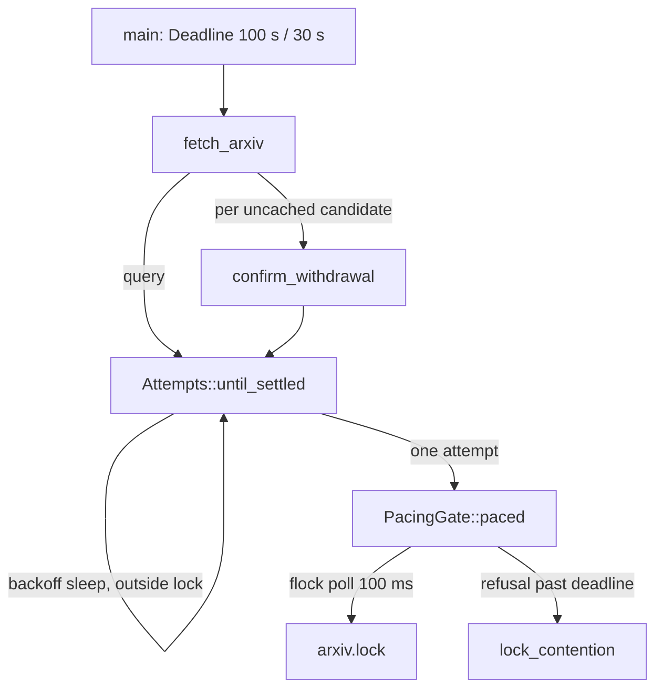

# Fair arXiv Fetch Queue Implementation Plan

## Overview

Today, arXiv fetches poll the per-project `arxiv.lock` in no fixed order, and
an invocation that misses its turn within the 100 s budget loses its node to
`lock_contention`. This plan replaces that with:

- **A FIFO ticket queue** that keeps a fetch request's place across
  invocations.
- **Whole-call admission**: one admitted invocation holds the serving lock
  for every request, attempt and backoff it makes.
- **A `waiting` outcome**, which the arXiv researcher re-presents until it
  settles.

After this change, `lock_contention` has two paths: a 900 s cap per ticket,
and a call that runs out of budget while the queue itself is unusable.

The whole plan merges as one change. The phases order the work so that each
one ends green under `mise run`.

## Current State Analysis

### Fetch call path



- **`PacingGate::paced` wraps one attempt.** It is defined at
  `cli/research/src/sources/fetch.rs:93-105`. `until_settled` calls it once
  per attempt and sleeps retry backoff outside it (`fetch.rs:402-409`), so
  other invocations' requests interleave between a call's requests and
  between its retries.
- **`FilePacingGate::hold` polls a non-FIFO `flock`.** It polls
  `NonBlockingLockExclusive` every 100 ms. Once the deadline cannot admit
  `POLL + per_request`, it logs `arxiv-contention.log` and returns
  `Unavailable::lock_contention()` (`cli/research-adapters/src/pacing.rs:79-110`).
- **Spacing runs only from `last_finish`** (`pacing.rs:189-198`). An
  invocation killed mid-call never writes it, so the next request can reach
  arXiv less than 3 s after the killed one.
- **Withdrawal confirmations are recalled outside the lock.** `fetch_arxiv`
  calls `ports.confirmations.recall` there (`fetch.rs:269`), so parallel
  callers duplicate OAI-PMH requests.
- **The CLI output has two documents.** `Document::{Ok, Unavailable}` is
  tagged by `status` (`cli/research-cli/src/render.rs:53-67`). `Command::Fetch`
  has no ticket argument (`cli/research-cli/src/cli.rs:37-48`).
- **The arXiv profile ends on every `unavailable`.** It caps a researcher at
  3 `search` and 5 `lookup` calls that reach the CLI
  (`skills/research/profiles/arxiv-profile/SKILL.md:40-41, 70-86`).
- **The `research-topic` reason row prescribes a lower `--concurrency`** as
  the remedy for `lock_contention`
  (`skills/research/research-topic/SKILL.md:446`). The docs mirror at
  `docs-site/src/content/docs/reference/skills/research/research-topic.md:445`
  is generated by `docs:generate`.

## Desired End State

### arXiv `fetch` behaviour

- An arXiv `fetch` joins a per-project FIFO queue of tickets under
  `<paths.tmp>/research/arxiv-queue/`.
- **Admission.** The front live ticket is admitted when the serving lock is
  free and its remaining budget covers a 33 s serving window.
- **Holding the lock.** Once admitted, the invocation holds `arxiv.lock`
  through every request, attempt and backoff, and checks
  `backoff + serving window` before each attempt.
- **When the budget runs short**, before or after admission, the invocation
  prints
  `{"status":"waiting","source":"arxiv","ticket":"<T>","position":<N>}` and
  exits 0.
- **Re-presenting** `--ticket <T>` with the same arguments:
  - within 300 s of the ticket's last invocation end, resumes its place;
  - after expiry, rejoins at the back with a fresh ticket;
  - more than 900 s after issue, unless the ticket has expired, returns
    `rate_limited` with `cause: lock_contention` and writes one
    `arxiv-contention.log` entry. A ticket whose last invocation ran out
    mid-retry returns `unavailable` with that retry's reason instead.
- **Rejections.** A ticket presented with different arguments exits 2 with
  `E_ARXIV_TICKET_MISMATCH` naming the arguments that differ. The call makes
  no request and leaves the queue unchanged.
- **Unaffected sources.** OpenAlex never queues and never returns `waiting`.

### Prompts and docs

- The arXiv profile re-presents a `waiting` ticket until any other status,
  and writes no note while waiting.
- Re-presentations do not count against the profile's call cap.
- The reason row names re-running `conduct` as the remedy.
- The 0283 plan and validation note the rescope.

### Verification

- `mise run` exits 0.
- `mise run test:integration:arxiv-queue-stress` passes.
- The attended researcher checks pass 3 of 3.
- The 0295 validation document records 0 nodes lost to `lock_contention`.

### Key Discoveries

- **Deadline arithmetic already fits the serving window.**
  `Deadline::admits_attempt_after(now, wait)` is
  `now + wait + per_request <= ends_at` (`cli/research/src/sources/schedule.rs:90-92`).
  The serving window is therefore `admits_attempt_after(now, backoff + spacing)`,
  with arXiv spacing 3 s and OpenAlex spacing 0.
- **The `flock` liveness probe exists.** It is
  `launcher/src/launch/outbound/resolve/tree/lease.rs:91-110`
  (`Free | Held | Unknown`, opened without `create`).
- **One-file-per-entry enumeration exists** in
  `launcher/.../tree/claims.rs:54-97`. `ScratchDir` has no list or remove
  helpers (`cli/research-adapters/src/scratch.rs`).
- **The loopback seams cover queue time travel without real waits.**
  `ACCELERATOR_RESEARCH_TEST_CALL_BUDGET_MS`,
  `ACCELERATOR_RESEARCH_TEST_CLOCK_LOG` and `_CLOCK_EPOCH` are in
  `cli/research-cli/src/loopback.rs`. Seeding a ticket record's
  `issued_ms` / `ended_ms` against the epoch does the rest.
- **`Route::Delayed` gives the stress test its 1 s latency.**
  `Route::Delayed { delay, route }` is in `cli/http-test-support/src/lib.rs:64-66`.
  The mock records `hit_instants` but only the last query per key, so FIFO
  tests need a per-hit query log.
- **The attended researcher check can stub `fetch` with a script.**
  `ACCELERATOR_RESEARCH_BIN` is not path-restricted
  (`cli/launcher/src/launch/core.rs:388-422`). The stub must hand `guard`
  through to the real binary, because the research guard hook dispatches
  through the same sub-binary (`hooks/hooks.json:51,60`).
- **Opt-in lanes have a pattern.** `test:integration:research-exhaustive` and
  `test:integration:tracker-contract` (`mise.toml:373-394`) stay out of the
  roll-up through `_NO_LAUNCHER_NEEDED` and the excluded-lane reasons in
  `tests/unit/tasks/test_mise.py:68-85, 180-205`.
- **Public API snapshot.** `cli/research/tests/fixtures/public-api.txt`
  changes with every new port and outcome. Regenerate it deliberately with
  `mise run public-api:update`.

## What We're NOT Doing

- No per-profile spawn cap in `conduct`, and no change to the default
  `concurrency` (24).
- No change to OpenAlex or web fetching beyond the reshaped gate port.
- No coordination across repositories on one machine. The queue stays
  per-project, as the lock is.
- No wait estimate in `waiting`. Skipping absent tickets makes position a
  poor predictor of wait.
- No change to `RetrySchedule`, the 100 s `CALL_BUDGET`, or the 30 s
  `REQUEST_BUDGET`.
- No pruning of `arxiv-requests.log`, `arxiv-contention.log` or the
  confirmation cache. Only queue records are pruned.
- No CI job for the stress lane. It is opt-in and run as a phase success
  criterion.
- No change to 0161's evals, which don't exist. The work item's dependency
  note is closed by this plan.

## Implementation Approach

Queue policy lives in the `research` domain crate; file and `flock`
mechanics live in `research-adapters`. Splitting it this way satisfies
cargo-pup (`cli/pup.ron`, ADR-0053).

### Ports

```rust
pub trait PacingGate {
    fn spacing(&self) -> Duration;
    fn try_serve(&self) -> Option<Box<dyn ServingTurn + '_>>;
}

pub trait ServingTurn {
    fn paced(
        &self,
        attempt: &mut dyn FnMut() -> Attempted,
        deadline: &Deadline,
    ) -> Result<(), WaitTooLong>;
}

pub struct WaitTooLong;

pub struct OutOfBudget { pub last_retryable: Option<Reason> }

pub trait ArxivQueue {
    fn join(
        &self,
        binding: &Binding,
        presented: Option<&Ticket>,
        deadline: &Deadline,
        spacing: Duration,
    ) -> Joining<'_>;
}

pub trait ContentionLog {
    fn record(&self, contention: Contention);
}
```

- **`PacingGate`** no longer blocks. `try_serve` returns a held turn, or
  `None` while another invocation holds the source. The domain owns the
  100 ms admission poll and the serving-window arithmetic.
- **`ServingTurn`** holds `arxiv.lock` for as long as it is alive. Every
  attempt and backoff of the whole call runs while the turn is held. Its
  only refusal is `WaitTooLong`: the invocation's budget cannot cover the
  stored wait. `until_settled` turns that refusal, or its own failed
  pre-attempt check, into `OutOfBudget { last_retryable }`, the one type
  the domain uses for a call that ran out of budget. Each field is filled
  by the one layer that knows it. `Unavailable` is kept for what the
  source answered. Spacing is read from `PacingGate` only, and `join`
  receives it from the domain.
- **`ArxivQueue`** is introduced in Phase 3:
  - It runs `Queue::present` (Phase 2) under a short-held bookkeeping lock.
  - It hands back a `Place` that holds the ticket's `flock` and answers
    `is_front` from a lock-free read of the tickets ahead of it.
  - A `Place` is consumed by `leave` or `step_aside`.
- **`ContentionLog`** is a domain port, introduced in Phase 1. Only
  `fetch_arxiv` calls it, at exactly the points where it returns
  `Unavailable::lock_contention()`, so the log and the outcome cannot
  disagree. `FileContentionLog` in `research-adapters` reports the
  diagnostic and appends the line.
- **Lock order.** There are three kinds of lock: `arxiv.lock`,
  `queue.lock`, and one lock per ticket.
  - `queue.lock` is never held while acquiring `arxiv.lock`: `is_front`
    takes no lock, and `try_serve` runs outside `bookkept`.
  - The turn is always dropped before `step_aside` or `leave`, which
    `serve_call` enforces by consuming the turn.
  - A ticket lock is taken exclusively only by `own`, only under
    `queue.lock`, and only on a ticket that `present` has just seen as new
    or not held. `step_aside` and `leave` take `queue.lock` while holding
    their own ticket lock. Nothing that holds `queue.lock` waits on a
    held ticket lock beyond `own`'s short bounded retry, so the order
    cannot deadlock.

### Admission loop in `fetch_arxiv` (Phase 4)

```text
join ──Rejected──────────▶ exit 2 (E_ARXIV_TICKET_*)
  │──OverCap─────────────▶ recorded reason, or lock_contention
  │──Unqueued────────────▶ admitted(ready = always) ──▶ serve_call
  │                          OutOfBudget ──▶ recorded reason,
  │                                          or lock_contention
  ▼ Queued(place)
admitted(ready = place.is_front):
      budget < spacing + per_request ──▶ OutOfBudget
      ready && gate.try_serve ──▶ Admitted(turn)
      sleep 100 ms
serve_call(turn): query + confirmations, backoff held, each attempt
      budget-checked; consumes and drops the turn
      ──▶ ServedCall::Settled(outcome) | ServedCall::OutOfBudget
settle, once:
      Settled(outcome) ──▶ place.leave ──▶ ok / unavailable / failed
      OutOfBudget ──▶ place.step_aside ──▶ waiting(position)
```

"Recorded reason, or `lock_contention`" means: with a `last_retryable`
reason, `unavailable` with that reason and no log entry; without one,
`rate_limited` with `cause: lock_contention` and one `ContentionLog`
entry.

- **The first attempt checks the clock again.** Admission and the first
  attempt's budget check read the clock separately. An invocation admitted
  at the edge of the window can therefore take `arxiv.lock`, fail its first
  check milliseconds later, and release the lock without a request. The
  guarantee is that an invocation that fails the check never *makes a
  request*, not that it never takes the lock.

### On-disk queue

All queue files live under `<paths.tmp>/research/arxiv-queue/`:

| File | Holds | Written | Locked |
|---|---|---|---|
| `queue.lock` | nothing | created once | exclusive `flock`, held only during `join`, `step_aside` and `leave` |
| `<n>-<nonce>.json` | `schema_version`, `issued_ms`, `presented_ms`, `ended_ms`, `last_retryable`, binding (`verb`, `query` or `id`, `limit`) | transient atomic replace (rename, no fsync) under `queue.lock` | — |
| `<n>-<nonce>.lock` | nothing | created at join | exclusive `flock` while the ticket is live; probes take a momentary shared one |

- **Ticket form.** A ticket is `<n>-<nonce>`: a decimal sequence number and
  six lowercase hex digits, for example `42-9f1c2a`. It is a plain word, so
  the research guard allows it.
- **Ordering.** `n` is one more than the largest number among the
  ticket-named records in the directory, live, absent, or of another
  schema version, so issue order is FIFO and no two records share a
  number.
- **Probing.** A liveness probe opens a ticket's `.lock` for reading and
  writing without `create`, as `lease.rs` does, so a lock path that is not
  a regular file fails to open and reads `Unknown`. It takes
  `LOCK_SH | LOCK_NB` and unlocks at once. Probers therefore never block
  each other, and only an owner's exclusive lock reads as `Held`. A probe
  does block an owner for that instant.
- **Owning.** An owner taking its exclusive lock retries `WOULDBLOCK` every
  1 ms for at most `OWN_PATIENCE` (500 ms), and never past `join`'s bound.
  Even a heavily descheduled prober releases within that time. A lock
  still held after it means a stuck process. `join` then returns
  `Unqueued` and releases `queue.lock` at once, so a stuck prober costs one
  call its place rather than holding up the queue. This is the queue's own
  probe; `lease.rs`'s exclusive probe would collide with owners.
- **The nonce** makes a ticket from a wiped or pruned queue unknown rather
  than mismatched. Ticket equality covers number and nonce.
- **End stamping.** A resumed or fresh ticket sets `presented_ms = now` and
  clears `ended_ms`. A clean end stamps it. A killed invocation's ticket is
  stamped by the next `join`, `step_aside` or `leave` that finds its lock
  free with no `ended_ms`, at `min(now, presented_ms + LONGEST_INVOCATION)`.
  No invocation outlives its 100 s budget, so the stamp is not earlier than
  the real end, apart from exit time, however late the stamping pass comes.
- **Pruning.** Housekeeping removes expired records and their lock files,
  ticket-named lock files that have no record and probe `Free`, and
  `.tmp-*` files older than `LONGEST_INVOCATION`, which a killed writer
  left behind.
- **Version skew.** `schema_version` lets a record from another plugin
  version be told apart from a corrupt one.

### Decided behaviours not spelled out in the work item

- **A deferral or `Retry-After` that the budget cannot cover returns
  `waiting`.** The invocation ran out of budget; its source was not
  unavailable.
- **Retries exhausted on throttling return `rate_limited` with no cause.**
- **A cap that fires after an upstream failure reports that failure.** A
  ticket that stepped aside mid-retry records its `last_retryable` reason.
  If the cap then fires for it, `fetch` returns `unavailable` with that
  reason (for example `upstream_error`), with no `lock_contention` cause
  and no contention-log entry. A persistently slow upstream is otherwise
  misreported as queue contention after 900 s. This departs from the work
  item's wording, which gives every cap firing `lock_contention`.
- **The same ticket presented by a second concurrent invocation exits 2**
  with `E_ARXIV_TICKET_LIVE`.
- **`--ticket` on an `openalex` call exits 2** with
  `E_RESEARCH_USAGE: --ticket applies only to arxiv fetches`.
- **A malformed ticket exits 2** with `E_ARXIV_TICKET_MALFORMED`.
- **An unusable queue degrades to unqueued admission**, with a
  diagnostic. This mirrors the gate's existing "pace without the lock".
  `join` returns `Joining::Unqueued` when `queue.lock` cannot be opened or
  locked in time, or when it cannot take its own ticket lock or write its
  own record. An unqueued invocation has no place to keep. When its budget
  runs out it returns its `last_retryable` reason if it has one, and
  otherwise `rate_limited` with `cause: lock_contention` and one
  contention-log entry, never `waiting`. The researcher's loop therefore
  stays bounded without a persisted cap. This is the one path to
  `lock_contention` besides the cap.
- **When `arxiv.lock` cannot be locked, pacing fails open, as it does
  today.** This happens on a filesystem without working `flock`, and on a
  per-call open or `flock` error (EMFILE, ENOLCK, EACCES). Concurrent
  unlocked turns then share the state file's unserialised read and write,
  so neither one connection at a time nor 3 s spacing is guaranteed. This
  is accepted: `.accelerator/tmp` is local, and failing closed would make
  arXiv unusable there. The diagnostic is the only record. The Pacing docs
  say all of this.
- **Liveness `Unknown` counts as live**, following `lease.rs`: an unknown
  lock is never treated as free. Like `lease.rs`, it is paired with an age
  backstop: a ticket issued more than `ABANDONED_AFTER` (the cap plus one
  100 s invocation, 1000 s) ago is absent whatever its probe says, because
  no healthy invocation can hold a ticket that long. When a ticket's
  record cannot be read, the record file's modification time stands in for
  its issue time, so an unreadable record has the same backstop.
- **Every `queue.lock` acquisition is bounded by the call's `Deadline`.**
  It tries `NonBlockingLockExclusive` at once and then every 10 ms.
  - `join` stops while a serving window (`spacing + per_request`) still
    remains, so an unqueued call can still be served.
  - `step_aside` and `leave` stop when the deadline's remaining time
    reaches zero.

  A stopped or hung holder therefore ends the call as `waiting` or
  unqueued, rather than as a Bash timeout.
- **Failures inside bookkeeping are reported and skipped.** A stamp,
  prune or removal that fails is reported and does not stop the pass. A
  failed own-record write in `step_aside` leaves the record for the next
  pass to stamp.
- **A queue directory that cannot be listed fails open.** `is_front`
  reports the problem once per place and answers `true`. `arxiv.lock`
  still serialises requests; only fairness is lost.
- **Wall-clock steps saturate.** A stored stamp later than `now` counts as
  zero elapsed time, so it neither expires nor passes the cap. After a
  backward step of D, the backstop and the cap are delayed by D. A forward
  step, or host sleep (wall time advances while the monotonic call budget
  does not), can do the opposite. A live ticket can then read as abandoned
  and lose its place, and a waiting ticket can pass the cap early and end
  in `lock_contention`. `arxiv.lock` still gates every request, so only
  fairness and the occasional node are at risk. Both directions are
  accepted as rare, and the Pacing docs say so.

---

## Phase 1: Whole-Call Admission Under the Serving Lock

### Overview

Reshape the gate port so one admitted invocation holds `arxiv.lock` across
all its requests, attempts and backoffs. Admission and per-attempt checks
use the serving window. Spacing also runs from the last *sent* request. No
queue exists yet, so a contended invocation still ends in `lock_contention`.

### Changes Required

#### 1. Domain gate port and admission

**File**: `cli/research/src/sources/fetch.rs`

- Replace `PacingGate::paced` with `spacing()` and `try_serve()`, and add the
  `ServingTurn` trait and `OutOfBudget`, as shown in Implementation
  Approach.
- Add the `ContentionLog` port and `pub enum Contention { LockHeldPastDeadline }`.
  `ArxivPorts` gains `contention: &'a dyn ContentionLog`. Phase 4 replaces
  the variant with the queue's two, and replaces `Admission` with
  `Result<Box<dyn ServingTurn>, OutOfBudget>` once nothing reads
  `contended`.
- `Attempts` swaps `gate` for `turn: &dyn ServingTurn` and
  `spacing: Duration`, which `serve_call` takes from `gate.spacing()`. The
  gate is the one source of spacing.
- `until_settled` returns `Result<Settled<T>, OutOfBudget>`, and
  `Settled<T>` keeps its four settled verdicts. Both the pre-attempt check,
  which becomes `admits_attempt_after(now, wait + spacing)`, and a
  `WaitTooLong` refusal from `paced` return
  `Err(OutOfBudget { last_retryable })`, with the reason `until_settled`
  last saw. The backoff
  sleep stays in the domain, but it now runs while the turn is alive,
  which is under the lock.
- Each family maps the `Err` in one place. OpenAlex, and arXiv until
  Phase 4, map it to `Unavailable::new(last_retryable.unwrap_or(RateLimited))`,
  which is today's behaviour.
- Add one admission function, used by both families:

```rust
const ADMISSION_POLL: Duration = Duration::from_millis(100);

enum Admission<'g> {
    Admitted(Box<dyn ServingTurn + 'g>),
    Exhausted { contended: bool },
}

fn admitted<'g>(
    gate: &'g dyn PacingGate,
    clock: &dyn Clock,
    deadline: &Deadline,
    ready: &dyn Fn() -> bool,
) -> Admission<'g> {
    let mut contended = false;
    loop {
        if !deadline.admits_attempt_after(clock.now(), gate.spacing()) {
            return Admission::Exhausted { contended };
        }
        if ready() {
            if let Some(turn) = gate.try_serve() {
                return Admission::Admitted(turn);
            }
        }
        contended = true;
        clock.sleep(ADMISSION_POLL);
    }
}
```

- **`fetch_arxiv`** is split into admission and
  `serve_call(turn, …) -> ServedCall`, where `ServedCall` is
  `Settled(FetchOutcome) | OutOfBudget(OutOfBudget)`, and each
  `until_settled` result inside it propagates with `?`. `serve_call`
  consumes the turn and runs today's query-plus-confirmations body,
  holding the turn throughout. Because the turn is held,
  `confirmations.recall` now runs under the lock, which closes 0280's
  duplicate-OAI gap. Until Phase 4, `ready` is `|| true`.
  `Exhausted { contended: true }` records
  `Contention::LockHeldPastDeadline` and returns `lock_contention`.
- **`fetch_openalex`** passes `|| true` and maps
  `Exhausted` to `rate_limited` with no cause. Its `NoPacing` has spacing
  0 and always serves, so OpenAlex behaviour is unchanged, including
  `a_key_command_that_leaves_no_room_for_an_attempt_is_rate_limited`. Two
  domain tests that script a `lock_contention` gate refusal change, as the
  table below says.

#### 2. File gate adapter

**File**: `cli/research-adapters/src/pacing.rs`

- **`NoPacing`.** `spacing()` returns `Duration::ZERO`, and `try_serve`
  returns a turn that runs the attempt once.
- **`FilePacingGate::try_serve`** opens `arxiv.lock` and tries
  `NonBlockingLockExclusive`:
  - `WOULDBLOCK` returns `None`.
  - Success returns `ArxivTurn { gate: self, _lock: Some(file) }`.
  - An open or `flock` error reports the problem and returns an unlocked
    turn (`_lock: None`), as `hold` does today.
- **`FileContentionLog`** implements `ContentionLog` in a new
  `cli/research-adapters/src/contention.rs`. It wraps the `research`
  scratch, owns the `arxiv-contention.log` name and line format, and
  reports the existing "lock contention" diagnostic text, moved from
  `hold`. Each line is `<wall ms> <kind>`, plus ` <ticket>` where there is
  one. The kinds are `lock_held_past_deadline` (Phase 1 only),
  `ticket_past_cap` and `queue_unusable`. Each event is one line, so
  counting lines counts events, and the kind tells the conditions apart.
  The gate no longer logs contention at all.
- **`store::replace_without_sync(path, bytes, bounds, mode)`** is a new,
  separately named function in `cli/store/src/lib.rs`.
  - It shares only `ensure_contained` and the `TEMP_PREFIX` staging name
    with `atomic_write`, and does not fsync the file or its directory.
  - `atomic_write`'s two fsyncs stay inline on its own code path, not
    behind a flag in a shared helper.
  - The `store` module doc is reworded to name both contracts. It scopes
    `replace_without_sync` to scratch state that can be rebuilt, so config
    and corpus writers keep using `atomic_write`.
- **`ScratchDir::replace_transient(name, bytes)`** calls it with the same
  bounds as `replace`. The pacing state uses it for every write. Its
  durability bought nothing: a killed process's write survives in the page
  cache, and an OS crash ends every call that could be spaced against it.
  Phase 3's queue records use it too.
- **`ArxivTurn::paced`** is today's `paced` body without `hold`, plus one
  addition: before running the attempt it stores `last_sent`. Its refusal,
  when the stored wait does not fit the budget, is `WaitTooLong`.
- **`PacingState`** gains `last_sent: Option<SystemTime>`, and
  `StoredState` gains `last_sent_ms`. `wait_at` spaces from the later of
  `last_finish` and `last_sent`. A state file without `last_sent_ms` still
  parses, because `serde` defaults the missing `Option` to `None`.

#### 3. Domain test doubles

**File**: `cli/research/tests/support/mod.rs`

- **`Timeline`**, a new shared event log. `RecordingClock` writes
  `Slept(d)` to it, and `RecordingGate` writes `Served`, `Attempt` and
  `Released`, with `Released` coming from the turn's `Drop`. Phase 4's
  `ScriptedQueue` writes `SteppedAside` and `Left` to it. A test builds
  both doubles over one `Timeline`, so ordering across them can be
  asserted.
- **`RecordingGate`** becomes a gate that:
  - reports a configurable spacing;
  - can be scripted to stay busy for N `try_serve` calls;
  - answers `is_serving()`, true from `Served` until `Released`. This
    replaces `is_inside()`, which meant inside one attempt.
  - Its `refusing_from(attempt)` scripts an in-turn `WaitTooLong`
    refusal, so it now takes only the attempt number.
- **`MemoryConfirmations`** records `is_serving()` on `recall` as well as
  on `record`, and `recorded_inside_pass` becomes `recorded_while_serving`.
- **`CountingGate`** in `cli/research-cli/src/fetch_command.rs` tests changes
  the same way.

### Tests (write first, red → green)

**Domain**: `cli/research/tests/arxiv_fetch.rs`

These tests use `RecordingClock` and the new `RecordingGate`, with spacing
3 s and a 30 s per-request budget.

- `a_whole_call_is_served_in_one_turn`: a search plus two uncached
  confirmations, where the first confirmation answers 503 and then 200. The
  gate serves exactly once. The timeline is `Served`, four `Attempt`s with a
  `Slept(3 s)` before the retry, then `Released`, and no `Released` comes
  before the last `Attempt`.
- `an_invocation_with_32_s_left_is_not_admitted` and
  `an_invocation_with_33_s_left_is_admitted`: 0 and 1 attempts. The 32 s
  outcome is `rate_limited` with no cause, because the gate was free.
- `a_6_s_backoff_with_38_s_left_ends_the_call` and
  `a_6_s_backoff_with_39_s_left_retries_under_the_turn`. The first
  response is a 503 with `Retry-After: 6`, so one attempt leaves a 6 s
  wait pending. The first backoff is otherwise 3 s.
  - 38 s left: 1 attempt, then `Released`, and the call is unavailable.
  - 39 s left: `Slept(6 s)` comes before `Released`, followed by a second
    attempt.
- `a_later_request_needs_a_full_serving_window`: the query succeeds with
  32 s left. No confirmation attempt is made.
- `a_gate_busy_past_the_window_ends_in_lock_contention`: the gate stays
  busy. The call returns `lock_contention`, a `RecordingContention` double
  records `LockHeldPastDeadline` once, and every sleep is 100 ms.
- `a_free_gate_out_of_budget_records_no_contention`.
- In `cli/store`: `a_write_without_sync_is_whole_and_contained`, beside
  the existing `atomic_write` tests.
- `a_cached_confirmation_is_recalled_inside_the_turn`: `recall` is
  observed while the gate's `is_serving()` is true.

**Adapter**: `cli/research-adapters/tests/pacing.rs`

The existing tests are ported to `try_serve` + `paced`, as the table
below says. New tests:

- `try_serve_is_none_while_another_holder_has_the_lock`.
- `a_turn_holds_the_lock_between_attempts_until_dropped`: the lock is not
  free between two `paced` calls on one turn, and is free after the turn is
  dropped.
- `spacing_runs_from_a_send_whose_finish_was_never_recorded`: seed
  `last_sent_ms` at now − 1 s with an older `last_finish_ms`. The wait is
  2 s.
- `spacing_runs_from_the_last_finish_when_it_follows_the_last_send`: seed
  `last_sent_ms` at now − 10 s and `last_finish_ms` at now − 1 s. The wait
  is 2 s.
- `last_sent_is_stored_before_the_attempt_runs`: the attempt closure reads
  the state file and finds `last_sent_ms` at the current wall time.
- `dropping_a_turn_frees_the_lock_at_once`: `try_serve` from a second gate
  returns `Some` straight after the first turn drops, with no clock
  advance.
- In a new `cli/research-adapters/tests/contention.rs`:
  `recording_contention_appends_one_line_and_reports_it`.
- In a new `cli/research-adapters/tests/scratch.rs`:
  `a_transient_replace_is_whole_and_refuses_names_outside_the_directory`.

**Binary, real time**: `cli/research-cli/tests/arxiv_pacing.rs`

- `no_other_invocations_request_interleaves_with_a_served_call`:
  - Process A runs a lookup of the withdrawn fixture. The OAI route is
    `Sequence[Status(503), feed]`.
  - Process B, a search, is spawned once A's query hit arrives.
  - B's query hit arrives after A's second OAI hit.
  - Consecutive hits across both keys are at least 3 s apart.
- `a_killed_calls_request_still_spaces_the_next`:
  - A's query route stalls. Kill A after its hit, then spawn B.
  - B's hit is at least 3 s after A's hit, an exact lower bound.
  - B's hit comes within 3 s of the later of A's `waitpid` returning and
    A's hit plus 3 s. This loose bound is a smoke check; the prompt release
    is proven by `dropping_a_turn_frees_the_lock_at_once`.

**Existing tests**

| Test | File | Phase 1 change |
|---|---|---|
| `a_recalled_verdict_needs_no_gate_pass` | `research/tests/arxiv_fetch.rs` | renamed `a_recalled_verdict_needs_no_attempt`: served once, 1 attempt |
| `a_verdict_recalled_for_an_older_version_does_not_apply` | `research/tests/arxiv_fetch.rs` | `passes() == 2` becomes served once, 2 attempts |
| `a_confirmed_verdict_is_recorded_from_inside_its_gate_pass` | `research/tests/arxiv_fetch.rs` | renamed `…_while_serving`: recorded while `is_serving()` |
| `a_confirmation_inherits_what_remains_of_the_deadline` | `research/tests/arxiv_fetch.rs` | kept: 29 s left is still `rate_limited` through `OutOfBudget` |
| `arxiv_throttling_defers_other_callers` | `research/tests/arxiv_fetch.rs` | kept; the deferral is recorded through the turn |
| other `arxiv_fetch.rs` tests | `research/tests/arxiv_fetch.rs` | kept; the harness gate serves at once |
| `a_wait_the_deadline_cannot_admit_refuses_and_releases_the_lock` | `research-adapters/tests/pacing.rs` | renamed `…_refuses_without_running`: `Err(OutOfBudget)`; the lock frees when the turn drops |
| `a_lock_held_past_the_deadline_ends_in_lock_contention` | `research-adapters/tests/pacing.rs` | deleted; replaced by `try_serve_is_none_…`, `recording_contention_…` and domain `a_gate_busy_past_the_window_…` |
| `the_lock_is_held_for_as_long_as_the_attempt_runs` | `research-adapters/tests/pacing.rs` | deleted; replaced by `a_turn_holds_the_lock_between_attempts_until_dropped` |
| `a_failed_state_write_is_reported_and_the_attempt_still_runs` | `research-adapters/tests/pacing.rs` | rewritten: two diagnostics, one for the `last_sent` write and one for the `last_finish` write, and the attempt still runs |
| other `pacing.rs` tests | `research-adapters/tests/pacing.rs` | ported to `try_serve` + `paced`, assertions kept |
| `an_arxiv_lookup_confirms_its_withdrawal_through_the_gate_once` | `research-cli/src/fetch_command.rs` | renamed `…_in_one_turn`: `gate_passes` becomes turns served, 1 |
| `a_gate_refusal_ends_the_call_unavailable` | `research/tests/openalex_fetch.rs` | rewritten: `refusing_from(1)`; outcome `rate_limited` with no cause |
| `a_gate_refusal_after_a_retryable_attempt_reports_that_attempt` | `research/tests/openalex_fetch.rs` | rewritten: `refusing_from(2)`; outcome is that attempt's reason with no cause |
| `a_lock_held_past_the_deadline_reports_lock_contention` | `research-cli/tests/fetch_arxiv.rs` | kept until Phase 4; the log line now comes from `FileContentionLog` |
| `arxiv_pacing.rs` tests | `research-cli/tests/arxiv_pacing.rs` | kept unchanged |

### Success Criteria

#### Automated Verification

- [x] Domain tests pass: `cargo nextest run --manifest-path cli/Cargo.toml -p research`
- [x] Adapter tests pass: `cargo nextest run --manifest-path cli/Cargo.toml -p research-adapters`
- [x] Binary tests pass: `cargo nextest run --manifest-path cli/Cargo.toml -p accelerator-research --features test-loopback`
- [x] Public API snapshots of `research` and `store` updated deliberately, then checked: `mise run public-api:check`
- [x] Store tests pass: `cargo nextest run --manifest-path cli/Cargo.toml -p store`
- [x] Architecture rules hold: `mise run cli:check`
- [x] Full local CI mirror: `mise run`

#### Manual Verification

- [x] `jj diff` shows no comment that restates code and no reference to
      this plan or the work item.

---

## Phase 2: Queue Domain Model

### Overview

Add the pure queue policy as `research::sources::queue`. It covers tickets,
argument binding, the queue snapshot, presentation verdicts, positions,
front-of-queue, expiry, the cap, stamping and pruning candidates. Nothing is
wired into `fetch` yet.

### Changes Required

#### 1. New module

**File**: `cli/research/src/sources/queue.rs`. Register it in
`cli/research/src/sources/mod.rs`.

```rust
pub const EXPIRY: Duration = Duration::from_secs(300);
pub const CAP: Duration = Duration::from_secs(900);
pub const LONGEST_INVOCATION: Duration = Duration::from_secs(100);
pub const ABANDONED_AFTER: Duration = CAP.saturating_add(LONGEST_INVOCATION);

pub struct Ticket { number: u64, nonce: Nonce }
pub enum Binding { Search { query: ArxivQuery, limit: Limit }, Lookup(ArxivId) }
pub enum Argument { Verb, Query, Id, Limit }
pub enum Presence { Live, Absent { ended_at: Option<SystemTime> } }
pub struct Standing { pub ticket: Ticket, pub binding: Binding,
                      pub issued_at: SystemTime,
                      pub presented_at: SystemTime,
                      pub last_retryable: Option<Reason>,
                      pub presence: Presence }
pub struct Queue { standings: Vec<Standing>, unparsed: Vec<Ticket> }
pub struct Position(u32);
pub struct Contender { pub is_live: bool, pub issued_at: SystemTime }

pub enum TicketRejection {
    Mismatch { ticket: Ticket, issued: Binding, differing: Vec<Argument> },
    AlreadyLive(Ticket),
}

pub enum Presentation {
    Join,
    Resume(Ticket),
    Rejected(TicketRejection),
    OverCap { ticket: Ticket, last_retryable: Option<Reason> },
}
```

**`Ticket`**

- `Ticket::parse(&str) -> Result<Ticket, RequestError>`.
- `Display` renders `<n>-<nonce>`.
- `Eq` covers number and nonce. `Ticket` has no `Ord`; queue order is
  `is_ahead_of(&self, other) -> bool`, which compares numbers.
- `Ticket::issue(number, nonce)` is called by the adapter.
- `Nonce::from_hex(&str) -> Result<Nonce, RequestError>` validates six
  lowercase hex digits. `Ticket::parse` uses it, and so do the adapter's
  `random_nonce` and the tests' fixed sequences.

**`Binding`**

- `Binding::of(&ArxivRequest)` mirrors the request, so a lookup has no
  limit. The flat JSON form exists only in the adapter's record.
- `differing(&self, &Binding) -> Vec<Argument>`. A differing verb is
  reported alone. `Argument::code()` returns `verb`, `query`, `id` or
  `--limit`, the words the profile uses.
- `value_of(&self, Argument) -> String`, which the mismatch message uses to
  name each issued value.

**`Queue` methods** (`now: SystemTime` throughout)

- **Elapsed time saturates.** Every elapsed time is `now` minus a stored
  stamp, floored at zero, so a stamp later than `now` reads as just
  stamped.
- **Effective end.** An absent standing with no `ended_at` ends, for
  every rule below, at `min(now, presented_at + LONGEST_INVOCATION)`. This
  is the same instant housekeeping will stamp. `present` therefore
  judges a killed ticket's expiry correctly before any pass has stamped it.
- **Abandonment.** A standing issued more than `ABANDONED_AFTER` ago is
  treated as `Absent`, whatever its stored presence. Its end is the
  earlier of its stored or effective end and its issue plus
  `ABANDONED_AFTER`. Abandonment only ever caps an end, never moves it
  later. It is therefore expired, and pruned, by
  the same rules as any other absent ticket. `ABANDONED_AFTER` is the
  longest a healthy invocation can hold a ticket: re-presented at the cap,
  then live for one invocation.

- **`present(&self, presented: Option<&Ticket>, binding, now)`.** In this
  order:
  1. no ticket, a ticket not in the queue (matched on number and nonce),
     or an expired ticket → `Join`, whatever its binding;
  2. the binding differs → `Rejected(Mismatch)`, carrying the issued
     binding;
  3. the ticket is live → `Rejected(AlreadyLive)`;
  4. `now − issued_at > CAP` → `OverCap`, carrying the standing's
     `last_retryable`;
  5. else `Resume`.
- **`is_expired(standing, now)`**: absent, and `now` minus its end, or its
  effective end, `> EXPIRY`.
- **`position_of(&self, ticket, now) -> Position`**: 1 plus the number of
  unexpired standings with a lower number.
- **`is_front_given(ahead, now) -> bool`**, a free function, is the one
  home of the front rule. `ahead` is an iterator of the `Contender`s ahead
  of a ticket, in any order. It answers `false` at the first contender
  that is live and not abandoned, and stops there, so a lazy iterator
  reads no further. Only the adapter's lock-free `is_front` calls it,
  feeding contenders nearest the asking ticket first. Under load, the
  ticket directly ahead is usually a live waiter, so one probe settles the
  answer. `Queue` has no `is_front` of its own.
- **`next_number(&self) -> u64`**: 1 plus the largest number among all
  standings and `unparsed` tickets, or 1. `unparsed` holds the tickets of
  records the adapter could not read, including other schema versions, so
  they still take part in numbering.
- **`expired(&self, now) -> Vec<Ticket>`**.
- **`stamps(&self, now) -> Vec<(Ticket, SystemTime)>`**: one stamp for each
  absent standing with `ended_at: None`, at
  `min(now, presented_at + LONGEST_INVOCATION)`.

`is_abandoned(issued_at, now) -> bool` is also public, for housekeeping's
treatment of unreadable records.

**`RequestError`** in `request.rs` gains `TicketMalformed(String)` and
`TicketNotQueued(Family)`, with `E_ARXIV_TICKET_MALFORMED` and
`E_RESEARCH_USAGE: --ticket applies only to arxiv fetches` messages. It
also gains `pub fn parse_ticket(family: Family, raw: Option<&str>) -> Result<Option<Ticket>, RequestError>`.

### Tests (write first)

**File**: `cli/research/tests/queue.rs`. Times are fixed `SystemTime`s; no
clock is needed.

- `tickets_round_trip_through_their_text_form`, and
  `malformed_tickets_are_refused`: `42`, `42-XYZ`, `-1-abcdef`, an empty
  string, `42-abcdef;x`, `42-ABCDEF`, `42-abc`, `42-abcdef0`, `+42-abcdef`,
  and a number past `u64::MAX`.
- `a_ticket_on_an_openalex_call_is_not_queued`.
- `differing_names_each_mismatched_argument`: query and `--limit`
  together.
- `a_search_and_a_lookup_differ_only_by_verb`.
- `no_ticket_joins`, and `an_unknown_ticket_joins`.
- `a_ticket_whose_number_is_reissued_under_another_nonce_joins`: the queue
  holds `3-aaaaaa` with another binding, and `3-bbbbbb` is presented.
- `an_expired_ticket_with_other_arguments_joins_afresh`.
- `a_live_ticket_presented_again_is_already_live`.
- `a_mismatched_live_ticket_is_a_mismatch`,
  `a_mismatched_ticket_past_the_cap_is_a_mismatch`, and
  `a_live_ticket_past_the_cap_is_already_live`: one test per pairing of
  `present`'s verdicts.
- `a_ticket_ended_exactly_300_s_ago_resumes`, and
  `a_ticket_ended_301_s_ago_joins_afresh`.
- `a_ticket_issued_exactly_900_s_ago_resumes`, and
  `a_ticket_issued_901_s_ago_is_over_the_cap`.
- `an_over_cap_ticket_carries_its_last_retryable_reason`.
- `an_expired_ticket_past_the_cap_joins_rather_than_hitting_the_cap`: issued
  950 s ago, ended 400 s ago.
- `an_unstamped_ticket_is_judged_by_its_effective_end`: issued 950 s ago,
  presented 500 s ago and never stamped. `present` returns `Join`, not
  `OverCap`.
- `an_unstamped_ticket_is_stamped_no_later_than_one_invocation_after_its_presentation`:
  presented 500 s ago, so the stamp is 400 s ago and the ticket has
  expired.
- `an_unstamped_ticket_presented_moments_ago_is_stamped_now`.
- `position_counts_every_unexpired_ticket_ahead_live_or_absent`: expired A,
  absent B, live C ahead of D, so D is at position 3.
- `an_absent_ticket_ahead_does_not_hold_the_front`: absent A, live B, so B
  is front. Like every front test, this calls `is_front_given` with
  hand-built `Contender`s.
- `a_resumed_ticket_outranks_every_later_ticket`.
- `the_next_number_follows_the_largest_present`, and
  `the_next_number_follows_an_absent_highest_ticket`.
- `the_front_is_decided_by_the_first_live_unabandoned_contender`, and
  `is_front_given_reads_no_contender_past_the_first_that_blocks`: a
  counting iterator proves the short-circuit.
- `the_next_number_follows_an_unparsed_highest_ticket`.
- `a_live_ticket_issued_1000_s_ago_still_holds_the_front`, and
  `at_1001_s_it_is_abandoned_and_no_longer_holds_the_front`.
- `an_abandoned_ticket_expires_300_s_after_abandonment`.
- `a_ticket_issued_1050_s_ago_and_ended_400_s_ago_joins_afresh`:
  abandonment does not move its end later.
- `a_stamp_later_than_now_neither_expires_nor_passes_the_cap`.

### Success Criteria

#### Automated Verification

- [x] Queue tests pass: `cargo nextest run --manifest-path cli/Cargo.toml -p research --test queue`
- [x] Public API snapshot updated deliberately: `mise run public-api:check`
- [x] `mise run cli:check` passes (cargo-pup keeps the module free of I/O)
- [x] `mise run`

#### Manual Verification

- [x] Names read as the domain is spoken: ticket, binding, standing,
      presence, position, front, expiry and cap.

---

## Phase 3: File-Backed Queue Adapter

### Overview

Add the `ArxivQueue` port and `FileArxivQueue`. `FileArxivQueue` handles
records, ticket locks, the bookkeeping lock, liveness probes, end stamping
and pruning. It writes no contention log; `fetch_arxiv` does that through
`ContentionLog`. `fetch` still does not use the queue.

### Changes Required

#### 1. Domain port

**File**: `cli/research/src/sources/queue.rs`

```rust
pub trait ArxivQueue {
    fn join(
        &self,
        binding: &Binding,
        presented: Option<&Ticket>,
        deadline: &Deadline,
    ) -> Joining<'_>;
}

pub enum Joining<'q> {
    Queued(Box<dyn Place + 'q>),
    Unqueued,
    Rejected(TicketRejection),
    OverCap { ticket: Ticket, last_retryable: Option<Reason> },
}

pub trait Place {
    fn ticket(&self) -> &Ticket;
    fn is_front(&self) -> bool;
    fn step_aside(
        self: Box<Self>,
        last_retryable: Option<Reason>,
        deadline: &Deadline,
    ) -> Position;
    fn leave(self: Box<Self>, deadline: &Deadline);
}
```

- **`Joining::Unqueued`** says at `join` that the queue could not be used,
  so there is no place to keep. `fetch_arxiv` admits the call without one,
  and never turns it into `waiting`.
- **The deadline** bounds every `queue.lock` acquisition, in `join`,
  `step_aside` and `leave`. `is_front` takes no lock, so it needs none.

#### 2. Scratch directory helpers

**File**: `cli/research-adapters/src/scratch.rs`

- `nested(&self, name) -> ScratchDir`, contained within the same project
  root.
- `names(&self) -> Result<Vec<String>, String>`. A directory that does not
  exist yet has no names.
- `modified(&self, name) -> Option<SystemTime>`.
- `remove(&self, name) -> Result<(), String>`. A missing file counts as
  success. It checks `store::ensure_contained` with the same `WriteBounds`
  as `replace`, so a name that escapes the directory is refused.
- Queue records use Phase 1's `replace_transient`. Losing one only makes
  its ticket unknown, and that ticket joins again.

#### 3. Queue adapter

**File**: `cli/research-adapters/src/queue.rs`. Register it in
`cli/research-adapters/src/lib.rs`, and add `rand = { workspace = true }`
to `cli/research-adapters/Cargo.toml` for the nonce.

**Construction.** `FileArxivQueue::new(scratch: ScratchDir, clock: Rc<dyn Clock>, diagnostics: Rc<dyn Diagnostics>, nonces: Box<dyn Fn() -> Nonce>)`.
Production passes `random_nonce`, which draws from `rand`. Tests pass a
fixed sequence, so they can predict a new ticket's file names.

**Probing.** A private `presence_of(name)` opens the ticket's `.lock` for
reading and writing without `create`, as `lease.rs:93` does, and takes
`LOCK_SH | LOCK_NB`, then unlocks. Opening for writing is what makes a lock
path that is not a regular file, such as a directory, fail with `EISDIR`
and read `Unknown`. The probe's outcomes are:

- success, or a lock file that is not found, is `Free`;
- `WOULDBLOCK` is `Held`;
- any other error is `Unknown`.

A private `own(name, deadline, spacing)` takes the owner's exclusive lock:
`LOCK_EX | LOCK_NB`, retrying `WOULDBLOCK` every 1 ms on the injected clock
for at most `OWN_PATIENCE` (500 ms), and never past `join`'s bound. Probes
unlock at once, so in practice the first or second try succeeds. If `own`
gives up, `join` returns `Unqueued` and `queue.lock` is released straight
away.

**`bookkept(deadline, bound)`.** A private helper takes `queue.lock`. It
tries `NonBlockingLockExclusive` once, then every 10 ms while the bound
allows. `join` bounds it to leave a serving window,
`deadline.admits_attempt_after(now, spacing)`, with the `spacing` the domain
passes in from `gate.spacing()`. The queue adapter needs nothing from
`pacing.rs`. `step_aside` and
`leave` bound it to the deadline's remaining time. It returns `None` if the
lock never comes free. Once it holds the lock, it builds a `Queue`
snapshot without changing anything:

1. It reads every file whose name parses as `<ticket>.json` into a
   `Standing`, and ignores any other name. A record that does not parse,
   or carries another `schema_version`, is set aside for housekeeping,
   and its ticket goes into `Queue::unparsed`.
2. It probes each ticket with `presence_of`: `Held` or `Unknown` is
   `Live`, and `Free` is `Absent`. In `step_aside` and `leave`, the
   `Place`'s own ticket is `Live` without a probe. `join` probes the
   presented ticket like any other.
3. It runs the caller's closure on the snapshot.

**Housekeeping.** A private helper, called only from inside `bookkept`, and
only by a call that is going to write anyway. Each step's failure is
reported and skipped.

1. Write every `Queue::stamps` stamp into its record.
2. Remove every `Queue::expired` ticket's two files.
3. Remove each set-aside record and its lock file when that lock probes
   `Free`, or when `queue::is_abandoned` holds for the record's
   modification time. Otherwise report it and keep it.
4. Remove every ticket-named `.lock` that has no record and probes
   `Free`.
5. Remove every `.tmp-*` file older than `LONGEST_INVOCATION`.

**`join`.** Inside `bookkept`, it calls `Queue::present` on the snapshot,
then:

- `Join`: housekeeping. Then it takes `own` on a fresh `<ticket>.lock`,
  with `n = next_number()` and a nonce from the injected `nonces` source,
  and only then writes the record: `issued_ms = presented_ms = now`,
  `ended_ms: null`, `last_retryable: null`. It returns `Queued`.
- `Resume`: housekeeping. Then it takes `own` on the ticket's `.lock`,
  and only then rewrites the record with `presented_ms = now`,
  `ended_ms: null` and `last_retryable: null`. Clearing the reason means a
  later lost `step_aside` write ends in `lock_contention` rather than a
  stale reason. It returns `Queued`.
- **Own lock or record failure.** If `own` fails, or the record write
  fails, `join` releases what it took, reports the problem, and returns
  `Unqueued`.
- `Rejected`: returned with nothing written, removed or stamped.
- `OverCap`: housekeeping, then it removes the ticket's files and returns
  `OverCap` with the record's `last_retryable`.

**Degraded mode.** If `queue.lock` cannot be opened or locked, or
`bookkept` times out in `join`, `join` reports the problem and returns
`Unqueued`.

**The `Place`.** `FilePlace` holds its ticket `File`, the position its
`join` computed, and a cache of issue times by ticket.

- **`is_front`** takes no lock and writes nothing. It lists the
  directory's `<ticket>.json` names. If listing fails, it reports the
  problem once per place and answers `true`. Otherwise it passes
  `queue::is_front_given` a lazy iterator over the tickets ahead, nearest
  its own ticket first. Each contender is built as follows:
  - its liveness comes from `presence_of`, where `Free` is not live;
  - for a live contender, its issue time comes from the cache, then from
    its record, then from the record's modification time if the record
    cannot be read;
  - a record or lock that vanishes mid-read counts as not live.

  The domain stops at the first blocking contender, so nothing past it is
  probed or read.
- **Why the lock-free read is safe.** Probes take only a shared lock, so
  they never make an owner or another prober misread a ticket. A
  concurrent writer can only make `is_front` wrong in a harmless direction:
  - a lock file pruned mid-probe reads as absent, which is correct;
  - a ticket ahead that is resuming, between taking its lock and writing
    its record, reads from its old record for that instant. The resumer
    loses at most one turn.
- **`step_aside`**: inside `bookkept`, housekeeping, then it stamps its
  own `ended_ms = now`, records `last_retryable`, computes `position_of`,
  drops the ticket lock and returns the position. If `bookkept` times out
  or the write fails, it drops the lock with the record unwritten and
  returns the position from its `join`. The next `join`, `step_aside` or
  `leave` stamps the record.
- **`leave`**: inside `bookkept`, housekeeping, then it removes both files
  and drops the lock. If `bookkept` times out, it drops the lock and
  leaves the record to be stamped and to expire.
- **A missing own record.** `step_aside` and `leave` treat their own record
  having gone as already done.

#### 4. Test support

**File**: `cli/research-adapters/tests/support/mod.rs`

- `seed_ticket(ticket, binding_json, issued, presented, ended, last_retryable)`,
  which sets the record's modification time to `presented`.
- `seed_raw_record(name, bytes, modified)`, for corrupt and other-schema
  records.
- `seed_temp_file(name, modified)`.
- `age_file(name, modified)`, for tests that move a file's age on.
- `hold_ticket(ticket) -> File`, which simulates another live invocation.
- `queue_names()`.

### Tests (write first)

**File**: `cli/research-adapters/tests/queue.rs`. These use real `flock` on a
tempdir with `RecordingClock` (wall origin `UNIX_EPOCH + 1_800_000_000 s`)
and a fixed nonce sequence. Filesystem modification times are real wall
time, so every seeding helper sets each file's modification time from the
test clock's wall time with `File::set_modified`. Tests that need real
concurrency say so and use `SystemClock` instead.

- `joining_an_empty_queue_issues_ticket_one_and_holds_its_lock`.
- `successive_joins_issue_increasing_numbers`.
- `stepping_aside_stamps_the_end_and_releases_the_ticket_lock`.
- `leaving_removes_the_record_and_its_lock`.
- `a_resumed_ticket_keeps_its_number_and_clears_its_end`.
- `a_mismatch_leaves_every_queue_file_unchanged`: byte-for-byte, including
  file names. The queue also holds an unstamped absent ticket and an
  expired one, which a rejection must neither stamp nor prune.
- `an_already_live_rejection_leaves_every_queue_file_unchanged`, with the
  same neighbours.
- `a_ticket_held_elsewhere_is_already_live`.
- `a_dropped_place_is_stamped_by_the_next_join`: drop without
  `step_aside`, which simulates a kill. The next `join` stamps `ended_ms`
  at the clock's current wall time, which is within `LONGEST_INVOCATION`
  of its presentation.
- `asking_is_front_writes_nothing_and_takes_no_queue_lock`: the test holds
  `queue.lock`, and `is_front` still answers, leaving the bytes unchanged.
- `the_front_skips_a_live_ticket_ahead_once_it_is_abandoned`.
- `the_front_skips_an_absent_ticket_ahead`.
- `the_front_waits_for_a_live_ticket_ahead`: `hold_ticket` on a lower
  number.
- `a_ticket_ended_301_s_ago_is_pruned_and_rejoins_at_the_back`.
- `a_ticket_over_the_cap_is_removed_and_reported_over_cap`.
- `a_reason_recorded_by_step_aside_is_carried_by_a_later_over_cap`: join,
  step aside with `Some(UpstreamError)`, advance the clock past 900 s, and
  join again. The second join returns `OverCap` with that reason, and the
  files are gone.
- `a_resume_clears_the_last_retryable_reason`.
- `a_corrupt_record_whose_lock_is_free_is_reported_and_removed`.
- `a_corrupt_record_whose_lock_is_held_is_reported_and_kept`.
- `a_corrupt_record_behind_an_unprobeable_lock_is_abandoned_by_its_age`:
  put a directory where the `.lock` should be, and seed a raw corrupt
  record. It holds the front until its modification time is 1000 s old,
  and housekeeping then removes it.
- `an_unreadable_record_ahead_still_holds_the_front_until_abandoned`.
- `a_lock_that_vanishes_mid_probe_counts_as_absent`.
- `two_concurrent_probes_both_read_free`.
- `a_probe_that_has_unlocked_but_kept_its_file_open_does_not_block_own`.
- `own_succeeds_once_a_briefly_held_shared_lock_is_released` and
  `own_fails_when_a_shared_lock_outlasts_its_patience`, both on the resume
  path and on `SystemClock`. Each seeds an absent ticket, record and lock
  together. The record keeps housekeeping from pruning the lock as an
  orphan. A second thread holds `LOCK_SH` on that lock, and the test
  re-presents the ticket. `join`'s probe reads `Free` (absent), so `own`
  must retry.
  - In the first test, the shared lock is released after about 5 ms of
    real time, and `join` returns `Queued`.
  - In the second, the shared lock is held for longer than `OWN_PATIENCE`.
    `join` returns `Unqueued` within roughly `OWN_PATIENCE`, and
    `queue.lock` is free afterwards.
- `a_record_of_another_schema_version_is_not_parsed_as_this_one`.
- `a_file_whose_name_is_not_a_ticket_is_ignored`.
- `an_orphan_ticket_lock_that_probes_free_is_removed`.
- `a_ticket_whose_lock_cannot_be_probed_holds_the_front_until_abandoned`:
  put a directory where the ticket's `.lock` should be. The probe's
  read-write open fails, so the ticket reads `Unknown`. It holds the front
  at 1000 s and is no longer front at 1001 s.
- `stepping_aside_or_leaving_without_an_own_record_succeeds`.
- `an_unlockable_queue_joins_unqueued_with_a_diagnostic`: make
  `queue.lock` a directory.
- `a_failed_record_write_joins_unqueued_and_leaves_no_lock_held`, on the
  resume path. A ticket-named obstacle cannot be used here: it would be
  read as an unparsed ticket and push the new number past it.
  - Seed an absent ticket, record and lock, then make the queue directory
    read-only (`0555`), and re-present the ticket.
  - `own` opens the existing lock, but the rewrite cannot stage its
    temporary file.
  - `join` returns `Unqueued` with a diagnostic, the ticket lock probes
    `Free`, and the record bytes are unchanged.
  - The test first checks that it cannot create a file in the read-only
    directory. If it can, as when running as root, it fails with a message
    saying so, rather than passing for the wrong reason.
- `a_queue_lock_held_past_the_serving_window_joins_unqueued`: the test
  holds `queue.lock`. `join` returns `Unqueued` while a serving window
  still remains.
- `a_queue_lock_held_past_the_deadline_leaves_the_record_for_stamping`:
  the same for `leave`.
- `an_unlistable_queue_reports_once_and_is_front`.
- `a_failed_prune_is_reported_and_the_pass_continues`.
- `a_stale_temp_file_is_removed_and_a_fresh_one_kept`.
- `a_queue_lock_held_past_the_deadline_leaves_step_aside_unstamped`: the
  place keeps its join position, and the record is stamped by the next
  `join`.
- In a new `cli/research-adapters/tests/scratch.rs`:
  `removing_a_name_that_escapes_the_directory_is_refused`,
  `removing_a_missing_name_succeeds`,
  `names_of_a_directory_not_yet_created_is_empty`, and
  `a_nested_directory_refuses_writes_outside_the_project_root`.
- `concurrent_joins_issue_distinct_consecutive_numbers`: 8 threads each
  build their own `FileArxivQueue` over one tempdir, on `SystemClock` with
  a full 100 s deadline and `random_nonce`, and join at once. `flock`
  locks per open file description, so threads contend as processes do.
  Every join returns `Queued`, the tickets are distinct and numbered
  exactly 1 to 8, and there are 8 records.
- `a_live_ticket_crossing_900_s_survives_housekeeping`: resume a ticket
  issued 899 s ago and advance the clock to 950 s. Another place's `join`
  runs housekeeping. The first place is still front and both its files
  exist.
- `a_dropped_place_is_no_longer_ahead_at_once`: straight after the place
  ahead drops, the next place's `is_front` is true, with no clock advance.
- `three_places_are_front_in_issue_order_whichever_asks_first`: A, B and C
  are joined in order. C asks `is_front` first and gets false; A gets true.
  After A leaves, B is front.

### Success Criteria

#### Automated Verification

- [x] Adapter tests pass: `cargo nextest run --manifest-path cli/Cargo.toml -p research-adapters`
- [x] `mise run public-api:check`
- [x] `mise run cli:check`
- [x] `mise run`

#### Manual Verification

- [x] A `jj diff` read of `queue.rs` confirms every file write happens under
      `queue.lock`.

---

## Phase 4: `fetch` Queues arXiv Calls

### Overview

Wire the queue into `fetch_arxiv` and expose `--ticket`, `waiting` and the
rejections. This phase also:

- narrows `lock_contention` to the cap and an unusable queue;
- teaches the arXiv profile to re-present;
- updates the reason row, docs, help and CHANGELOG;
- adds the binary tests and the opt-in stress lane.

### Changes Required

#### 1. Domain workflow

**File**: `cli/research/src/sources/fetch.rs`

- **`ArxivFetch`** gains `presented: Option<&'a Ticket>`, and **`ArxivPorts`**
  gains `queue: &'a dyn ArxivQueue`.
- **`FetchOutcome`** gains `Waiting { ticket: Ticket, position: Position }`
  and `Rejected(TicketRejection)`, reusing the queue module's type.
- **`Contention`** loses `LockHeldPastDeadline` and gains
  `TicketPastCap(Ticket)` and `QueueUnusable`.
- **`fetch_arxiv`** has three layers, so the place is settled in exactly
  one match:
  1. **Join.** `join` is called with `gate.spacing()`.
     - `Rejected` passes straight through.
     - `OverCap` ends at once, through one private
       `upstream_reason_or_contention(last_retryable, contention)`. With a
       `last_retryable` reason it returns `Unavailable::new(reason)` and
       records nothing. Without one it records the contention and returns
       `Unavailable::lock_contention()`. This is the only place the domain
       records contention.
     - `Unqueued` does not end here. It goes on to admission with no place,
       and reaches `upstream_reason_or_contention(last_retryable,
       QueueUnusable)` only if it runs out of budget.
  2. **Admission.** `admitted(gate, clock, deadline, ready)`, with
     `ready` as `|| place.is_front()` for a queued call and `|| true` for an
     unqueued one.
  3. **`serve_call(turn, …)`** returns `ServedCall`.
  4. **Settle, once.** For a queued call:
     - `Settled(outcome)` calls `place.leave()` and returns the outcome.
     - `OutOfBudget` from admission or `serve_call` calls
       `place.step_aside(last_retryable, …)` and returns `Waiting` with
       the position.

     For an unqueued call, `Settled(outcome)` returns the outcome, and
     `OutOfBudget` goes through `upstream_reason_or_contention(last_retryable,
     QueueUnusable)`.
  5. Every `Place` call passes the invocation's `Deadline`.
- **Removals.** `Contention::LockHeldPastDeadline` and the `contended`
  field go, since nothing reads them. `admitted` then returns
  `Result<Box<dyn ServingTurn>, OutOfBudget>` with `last_retryable: None`,
  so admission and serving share one out-of-budget type.
  `fetch_openalex` keeps mapping `OutOfBudget` to `rate_limited` with no
  cause.

#### 2. Gate adapter

**File**: `cli/research-adapters/src/pacing.rs`

- No change. The gate stopped logging contention in Phase 1;
  `FileContentionLog` writes the log line when the domain records an event.

#### 3. CLI

**`cli/research-cli/src/cli.rs`**

- `Command::Fetch` gains `ticket: Option<String>` with `#[arg(long)]` and
  the doc comment `/// Re-present the ticket a waiting arXiv call printed,
  with the same arguments.`, so `-h` describes it too. clap stays strict: a
  repeated `--ticket` is a usage error.
- `FETCH_HELP` documents:
  - `--ticket`;
  - the `waiting` document and the instruction to re-present the same call
    with `--ticket`;
  - that a ticket exits 2 when presented with other arguments, or while
    another call presents it;
  - that a caller should treat a status other than `ok`, `unavailable` or
    `waiting` as `unavailable`, reporting the status verbatim as its
    reason.

**`cli/research-cli/src/main.rs`**

- Pass the ticket through `parse_ticket` after `FetchRequest::parse`. Both
  errors are usage errors (exit 2).
- `source_call` builds `FileArxivQueue` over
  `ScratchDir::new(root, scratch).nested("arxiv-queue")`, and passes the
  `FileContentionLog` built in Phase 1.

**`cli/research-cli/src/fetch_command.rs`**

- `ArxivAdapters` gains `queue: Box<dyn ArxivQueue>`.
- `run` passes `presented` through.

**`cli/research-cli/src/render.rs`**

- `Document::Waiting { source, ticket: String, position: u32 }` renders as
  `{"status":"waiting","source":"arxiv","ticket":"42-9f1c2a","position":3}`
  and exits 0.
- The summary line reads
  `research fetch: arxiv search waiting at position 3; re-present with --ticket 42-9f1c2a`,
  with no attempt count.
- `FetchOutcome::Rejected` prints one stderr line and exits 2:

  ```text
  E_ARXIV_TICKET_MISMATCH: ticket 42-9f1c2a was issued for query 'attention heads', --limit 10; re-present it with that call, or drop --ticket
  E_ARXIV_TICKET_LIVE: ticket 42-9f1c2a is already being presented by another call; use that call's output, or re-present it once that call has returned
  ```

  The mismatch line names the issued value of each differing argument. The
  query has already passed the guard, so echoing it is safe.

#### 4. Mock server per-hit queries

**File**: `cli/http-test-support/src/lib.rs`

- Add `pub fn queries(&self, key: &RequestKey) -> Vec<Option<String>>`, in
  arrival order, modelled on `bodies`.

#### 5. Prompts

**`skills/research/profiles/arxiv-profile/SKILL.md`**

- **Call budget.** Keep the existing sentence and its exemptions, and add
  re-presentation to them: "Make at most 3 `search` and 5 `lookup` calls
  that reach the CLI. A call the guard blocks, one that fails as a usage
  error, or one that re-presents a waiting ticket does not count."
- **Timeout.** Keep the 120000 ms Bash `timeout`. Reword the waiting
  sentence: a call that cannot be served within 100 s returns `waiting`.
- **One at a time.** "Run one fetch at a time."
- **Outcome.** Add a non-terminal case beside exit 2 and guard blocks:

  > **Waiting** — a call printed `"status":"waiting"`. Write nothing yet.
  > Re-run the same call at once with `--ticket` set to the `ticket` from
  > the latest `waiting` output, replacing any `--ticket` already there. The
  > call does the waiting itself. Repeat until the status is anything else,
  > then treat that output as the call's result and carry on as you would
  > have. Never change the query, ID or `--limit` while re-presenting.

  Follow it with a fenced example, so the guard differential collects it:

  ```bash
  accelerator research fetch arxiv search 'QUERY' --limit 10 --ticket 42-9f1c2a
  ```

- **`E_ARXIV_TICKET_LIVE`.** Beside the exit-2 sentence: "If it is
  `E_ARXIV_TICKET_LIVE`, you have another fetch with that ticket still
  running. Wait for it to return and use its output instead." The CLI's
  stderr line gives the same remedy.
- **Failed bullet.** It widens to "a call exited `1`, or exited `2` with
  `E_ARXIV_TICKET_LIVE` when you have no other fetch running". The only
  realistic cause is the researcher running two fetches at once, which the
  profile forbids. The existing failed-call reason row covers the verbatim
  line, so no outcome is invented.

- **Unavailable bullet.** `lock_contention` now means the ticket passed its
  900 s cap, or the queue was unusable. A ticket whose last call ran out
  of budget mid-retry instead reports that retry's reason. Either way it
  is terminal. The bullet gains: "Any other status counts as Unavailable,
  with the status as its reason."

**`skills/research/profiles/openalex-profile/SKILL.md`**

- **Unavailable bullet.** Gains the same sentence: "Any other status
  counts as Unavailable, with the status as its reason." The profiles are
  the CLI's real callers, so the forward-compatibility rule that
  `FETCH_HELP` gives scripts applies to them too.

**`agents/researcher.md`** stays source-agnostic. Step 2 gains: "Follow your
profile's outcomes exactly, including any that tell you to repeat a call
before ending."

**`skills/research/research-topic/SKILL.md:446`** becomes the first row
below, and the second row is added beside it:

```markdown
| `rate_limited` with `cause: lock_contention` | an arXiv fetch waited past its 900 s cap behind this and any concurrent `conduct` run's requests, or the arXiv queue was unusable; re-run `conduct`, which researches only the missing nodes; if it recurs, check `<paths.tmp>/research/arxiv-contention.log`, whose lines name `ticket_past_cap` or `queue_unusable`, and follow that kind's next step in the Pacing docs |
| `waiting` never re-presented | the researcher ended before its arXiv ticket was served; re-run `conduct`; a custom researcher must follow the profile's Waiting outcome |
```

#### 6. Docs and CHANGELOG

- **`docs-site/src/content/docs/research.md:80`.** The `rate_limited` row
  says `lock_contention` means a queued arXiv fetch passed its 900 s cap,
  or ran out of budget while the queue was unavailable. In either case, a
  call that ran out mid-retry reports that retry's reason instead.
- **`docs-site/src/content/docs/research.md` `## Pacing` (154-168).**
  Describe:
  - the FIFO ticket queue under `arxiv-queue/`;
  - whole-call admission and the 33 s serving window;
  - `waiting` and `--ticket` re-presentation;
  - 300 s expiry, the 900 s cap, and abandonment at 1000 s;
  - `arxiv-contention.log`, written only when a call ends in
    `lock_contention`: the cap, or an unusable queue, with no upstream
    failure behind it;
  - its line format, `<wall ms> <kind>[ <ticket>]`. A line with only a
    timestamp comes from an earlier release or an older session;
  - a next step for each kind. For `ticket_past_cap`, avoid overlapping
    `conduct` runs in one project, or re-run once the other run has
    finished. For `queue_unusable`, check that
    `<paths.tmp>/research/arxiv-queue/` is a writable directory on a
    filesystem with working `flock`. While no `conduct` run is active,
    remove it; it is rebuilt on demand;
  - that when `arxiv.lock` cannot be locked, on a filesystem without
    working `flock` or after a per-call lock error, pacing runs unlocked.
    Neither one connection at a time nor 3 s spacing is then guaranteed,
    and only the stderr diagnostic records it;
  - that wall-clock steps, and a host that sleeps mid-run, can delay or
    hasten expiry, abandonment and the cap, at the cost of fairness or
    an occasional node, never of spacing.
- **Generated mirror.** Regenerate
  `docs-site/src/content/docs/reference/skills/research/research-topic.md`
  with `mise run docs:generate`.
- **`CHANGELOG.md` `## [Unreleased]`.** Add an entry: "**arXiv fetches queue
  fairly and keep their place across calls.**" It names `waiting`,
  `--ticket`, whole-call admission, the narrowed `lock_contention`, and that
  `arxiv-contention.log` counts are not comparable with earlier releases.
  It also says that `fetch` callers must now handle a third status,
  `waiting`.
- **`research.md` Output and exit codes.**
  - In the Output section, beside the documents, add `waiting`. Say, in
    the same words as `FETCH_HELP`, that a caller should treat any other
    status as `unavailable`, reporting the status verbatim as its reason.
  - In the exit-code table (:92), exit 0 becomes "`ok`, `unavailable` or
    `waiting`".
  - In the error-code table, add rows for `E_ARXIV_TICKET_MALFORMED`,
    `E_ARXIV_TICKET_MISMATCH` and `E_ARXIV_TICKET_LIVE` (all exit 2), and
    `--ticket` on OpenAlex under `E_RESEARCH_USAGE`.
  - In Retries and deadlines (:110-114), say that an arXiv call returns
    `waiting` when the deadline would not admit the next wait, and an
    OpenAlex call returns `unavailable`.

#### 7. Opt-in stress lane

- **`cli/research-cli/tests/arxiv_queue_stress.rs`.** Gated with
  `#![cfg(feature = "test-loopback")]`, and the one test is
  `#[ignore = "real time, minutes: run with mise run test:integration:arxiv-queue-stress"]`.
- **`tasks/test/integration.py`.** Add `arxiv_queue_stress`:

  ```python
  @task
  def arxiv_queue_stress(context: Context) -> None:
      """Run 30 arXiv fetches through the queue in real time (minutes)."""
      context.run(
          f"cargo nextest run --manifest-path {CLI_WORKSPACE_CARGO_TOML} "
          "-p accelerator-research --features test-loopback "
          "--run-ignored only -E 'binary(=arxiv_queue_stress)'",
          pty=True,
      )
  ```

- **`mise.toml`.** Add `[tasks."test:integration:arxiv-queue-stress"]`,
  depending on `deps:install:rust-components`, and keep it out of the
  `test:integration` roll-up and `default`.
- **`tests/unit/tasks/test_mise.py`.** Add the lane to `_NO_LAUNCHER_NEEDED`
  ("cargo nextest builds accelerator-research itself") and to the
  excluded-lane reasons ("real-time 30-process run takes minutes; the
  default lane's queue tests are the enforcing route").
- **`tasks/README.md`.** Document the lane beside `research-exhaustive`.

### Tests (write first)

**Domain**: `cli/research/tests/arxiv_fetch.rs`

These use a `ScriptedQueue` fake with a scripted join verdict and
scripted `is_front` answers. It records `SteppedAside` and `Left` events
on the same timeline as the gate's `Served`, `Attempt` and `Released`, and a
`RecordingContention` double records contention. Its default joins and is
always front, so the existing domain tests keep their meaning.

- `a_front_invocation_with_32_s_left_waits_without_a_request`, at
  position 1, and `with_33_s_left_it_is_served`.
- `a_6_s_backoff_with_38_s_left_releases_and_waits`: the timeline shows
  `Released` before `step_aside`. With 39 s left, the call retries under the
  turn.
- `a_40_s_budget_behind_a_20_s_holder_waits_at_position_2`: the queue is
  not front for 20 virtual seconds, and the place reports position 2.
- `a_second_confirmation_the_budget_cannot_cover_waits_and_keeps_its_place`:
  the first confirmation's verdict is recorded and `step_aside` is called,
  not `leave`.
- `four_429s_are_rate_limited_without_a_cause_and_leave_the_queue`.
- `every_settled_outcome_leaves_exactly_once`: a table over records, none
  found, failed and unavailable. Each calls `leave` once, after
  `Released`, and `step_aside` never.
- `a_retry_after_past_the_budget_waits`: 429 with `Retry-After: 30` and
  60 s left.
- `a_deferral_the_turn_cannot_admit_waits`: the in-turn refusal returns
  `Waiting`.
- `a_503_then_an_exhausted_budget_steps_aside_with_its_reason`: the
  scripted `step_aside` receives `Some(UpstreamError)`.
- `an_over_cap_join_is_lock_contention_without_a_request`: one
  `TicketPastCap` is recorded.
- `an_over_cap_join_after_an_upstream_failure_reports_that_failure`: the
  join returns `OverCap` with `Some(UpstreamError)`. The outcome is
  `unavailable` with that reason and no cause, and nothing is recorded.
- `a_mismatch_is_rejected_without_a_request`.
- `a_ticket_crossing_900_s_while_waiting_is_still_served`: the cap is
  decided only at join, so a long wait in virtual time is still served.
- `an_unqueued_call_out_of_budget_is_lock_contention_not_waiting`: the
  join is `Unqueued`. Both before admission and after an in-turn refusal,
  the outcome is `lock_contention` with one `QueueUnusable` recorded.
- `an_unqueued_call_out_of_budget_after_a_503_reports_that_failure`, with
  nothing recorded.
- `an_unqueued_call_is_served_without_a_place`: the outcome is records.
- `an_openalex_fetch_never_waits`.

**Binary, virtual clock**: `cli/research-cli/tests/fetch_arxiv.rs`

These seed records under `.accelerator/tmp/research/arxiv-queue/` against
`ACCELERATOR_RESEARCH_TEST_CLOCK_EPOCH`. Replace
`a_lock_held_past_the_deadline_reports_lock_contention` with
`a_lock_held_past_the_window_waits_with_a_ticket`: the call returns
`waiting` at position 1, its ticket record exists, and the contention log is
empty. Then add:

- `a_40_s_budget_behind_a_live_ticket_waits_at_position_2`: the test holds
  `arxiv.lock` and one live ticket's lock, with budget 40000 ms.
- `a_re_presentation_after_mid_call_exhaustion_repeats_the_search_and_reuses_cached_confirmations`:
  - A new fixture, `search-2-withdrawal-candidates.xml`, has withdrawal
    comments on 2608.21129 and 2211.12792. The OAI route is a `Sequence`
    of their existing OAI fixtures.
  - The first call's budget covers the search and one confirmation, then
    returns `waiting`.
  - A later ticket is seeded live while the first is absent.
  - The re-presentation, with a full budget, is served before the later
    ticket. The search has 2 hits in total, and per-hit `queries` show one
    OAI request for 2608.21129.
- `a_waiting_document_carries_ticket_and_position`: budget 32000 ms.
- `a_re_presented_ticket_is_served_and_leaves_the_queue`.
- `a_ticket_with_another_query_exits_2_naming_it_and_changes_nothing`:
  stderr contains `E_ARXIV_TICKET_MISMATCH`, `query` and the issued query
  in quotes, the server has no hits, and the queue directory listing and
  bytes are unchanged. The seeded queue also holds an unstamped absent
  ticket and an expired one.
- `an_expired_ticket_with_another_query_rejoins_with_a_fresh_ticket`.
- `a_ticket_re_presented_300_s_after_its_end_keeps_its_number`, and
  `at_301_s_it_rejoins_with_a_fresh_ticket`. The second checks the JSON
  `ticket` differs, with a number greater than the seeded later ticket's.
- `a_ticket_re_presented_900_s_after_issue_is_queued`, and
  `at_901_s_it_is_lock_contention_with_one_log_entry`: this covers
  `rate_limited`, `cause`, no hits, and one line.
- `a_ticket_issued_950_s_ago_and_ended_400_s_ago_rejoins_afresh`.
- `a_position_counts_expired_absent_and_live_tickets_correctly`:
  - seed expired A, absent B, and C held by the test through `flock`;
  - hold `arxiv.lock`, with budget 33100 ms;
  - D waits at position 3.
- `a_malformed_ticket_is_a_usage_error`, and
  `a_ticket_on_openalex_is_a_usage_error`, whose stderr starts
  `E_RESEARCH_USAGE`.
- `a_repeated_ticket_flag_is_a_usage_error`.
- `a_ticket_presented_while_live_elsewhere_exits_2`: seed a record and hold
  its `.lock` from the test. Present it, and assert exit 2,
  `E_ARXIV_TICKET_LIVE` with its remedy on stderr, no hits, and unchanged
  queue bytes.
- `an_unusable_queue_ends_a_contended_call_in_lock_contention`: make
  `arxiv-queue/queue.lock` a directory, hold `arxiv.lock`, and use budget
  33100 ms. The call returns `rate_limited` with `cause: lock_contention`,
  writes one contention-log line, and makes no request.
- `a_ticket_over_the_cap_after_an_upstream_failure_is_unavailable_with_that_reason`:
  seed a record issued 901 s ago with `last_retryable: "upstream_error"`.
  The call prints `unavailable` with reason `upstream_error` and no
  `cause`. It makes no hits, and the contention log is empty.
- `an_openalex_fetch_ignores_a_held_arxiv_lock_and_queue`: `fetch_openalex.rs`
  holds `arxiv.lock` and seeds live tickets. The fetch returns ok and the
  queue bytes are unchanged.
- **Help test.**
  `help_documents_the_families_verbs_limit_range_and_deadline` in
  `fetch_openalex.rs` also expects `--ticket`, its argument description,
  and `waiting`.

**Binary, real time**: new `cli/research-cli/tests/arxiv_queue.rs`, in the
default lane. These use the per-hit `queries`.

- `live_tickets_are_served_in_issue_order`:
  - The test holds `arxiv.lock`, then spawns searches A, B and C, waiting
    for each one's ticket file before spawning the next.
  - On release, the query log order is A, B, C.
  - This also covers two `conduct` runs, which share the project queue.
- `an_absent_ticket_is_skipped_then_served_before_later_tickets`:
  - Seed absent unexpired A, and spawn B.
  - B is served at once.
  - Then hold the lock, spawn C, and re-present A.
  - Before releasing, wait until a probe of A's lock reads `Held` and C's
    ticket file exists. A re-presentation creates no new file, so the
    probe is its synchronisation point.
  - On release, A is served before C.
- `a_killed_waiter_frees_its_place_at_once`:
  - Kill a waiting invocation, then release `arxiv.lock` from the test.
  - The next live ticket's hit comes within 3 s of the release, a smoke
    bound. The prompt release is proven by
    `a_dropped_place_is_no_longer_ahead_at_once`.
  - Re-presenting the killed ticket within 300 s keeps its number ahead of
    later tickets. Before the next release, the test waits until a probe
    of the killed ticket's lock reads `Held` again.

Killing a served call is not repeated here. Phase 1's
`a_killed_calls_request_still_spaces_the_next` covers it, and from this
phase on its processes go through the queue.

**Stress**: `arxiv_queue_stress.rs`

`thirty_requests_re_presenting_until_settled_all_succeed`:

- **Setup.** `Route::Delayed { delay: 1 s, route: feed("search-3.xml") }`.
  The fixture has no withdrawal candidates; `a_search_returns_tier_two_records…`
  already asserts no OAI hits for it. The call budget is 40000 ms, so
  invocations hit `waiting`.
- **Driver.** 30 threads, each re-spawning its child with `--ticket` until
  the status is not `waiting`.
- **Assertions.**
  - all 30 return `ok`;
  - none returns `lock_contention`;
  - at least one returns `waiting`;
  - consecutive `hit_instants` are at least 4 s apart, which means no
    overlap and at least 3 s between requests;
  - no gap between consecutive hits exceeds 8 s, and all 30 complete
    within 30 × 4 s + 60 s. These loose upper bounds allow for re-spawn
    churn, but they catch a queue that leaves arXiv idle for seconds per
    turn.

**Planner guard**: `cli/research-cli/tests/topic_outstanding.rs`

The default lives in config, and `conduct` passes it to the binary as
`--limit {concurrency}`. The guard is therefore split where the two halves
live:

- `a_24_limit_offers_24_arxiv_spawns_and_counts_the_rest`: seed 25 pending
  arXiv nodes and run `outstanding --start --limit 24`. The batch has
  exactly 24 arXiv spawns and `remaining` 1, so no per-profile filter or
  cap drops arXiv nodes. This is modelled on
  `a_limited_plan_offers_the_first_spawns_and_counts_the_rest`.
- The existing catalogue assertion that `research.topic.concurrency`
  defaults to 24 (`cli/config/src/catalogue.rs:457`) is the other half. It
  stays unchanged.

**Existing tests**

| Test | File | Phase 4 change |
|---|---|---|
| `an_invocation_with_32_s_left_is_not_admitted` | `research/tests/arxiv_fetch.rs` | replaced by `a_front_invocation_with_32_s_left_waits_without_a_request` |
| `an_invocation_with_33_s_left_is_admitted` | `research/tests/arxiv_fetch.rs` | replaced by `with_33_s_left_it_is_served` |
| `a_6_s_backoff_with_38_s_left_ends_the_call` | `research/tests/arxiv_fetch.rs` | replaced by `a_6_s_backoff_with_38_s_left_releases_and_waits` |
| `a_later_request_needs_a_full_serving_window` | `research/tests/arxiv_fetch.rs` | rewritten: no confirmation attempt, `step_aside` called, outcome `waiting` |
| `a_gate_busy_past_the_window_ends_in_lock_contention` | `research/tests/arxiv_fetch.rs` | replaced by `a_40_s_budget_behind_a_20_s_holder_waits_at_position_2` |
| `a_confirmation_inherits_what_remains_of_the_deadline` | `research/tests/arxiv_fetch.rs` | rewritten: outcome `waiting`; `step_aside` gets `None` |
| `a_whole_call_is_served_in_one_turn`, `a_6_s_backoff_with_39_s_left_retries_under_the_turn` | `research/tests/arxiv_fetch.rs` | rewritten: the timeline ends `Released`, `Left` |
| `a_free_gate_out_of_budget_records_no_contention` | `research/tests/arxiv_fetch.rs` | rewritten: outcome `waiting`, still nothing recorded |
| other domain tests | `research/tests/arxiv_fetch.rs` | kept; `ScriptedQueue`'s default joins and is front |
| `a_lock_held_past_the_deadline_reports_lock_contention` | `research-cli/tests/fetch_arxiv.rs` | replaced by `a_lock_held_past_the_window_waits_with_a_ticket` |
| other `fetch_arxiv.rs` tests | `research-cli/tests/fetch_arxiv.rs` | kept; each call joins an empty queue and leaves it |
| `arxiv_pacing.rs` tests, including Phase 1's two | `research-cli/tests/arxiv_pacing.rs` | kept; each process now joins the queue first |
| `fetch_command.rs` tests | `research-cli/src/fetch_command.rs` | kept; `Call` gains an always-front queue double |

**Prompt structure**: `tests/unit/tasks/test_research_structure.py`

- `test_arxiv_profile_re_presents_a_waiting_ticket`: the profile names
  `"status":"waiting"`, `--ticket`, "latest", "replacing" and "carry on",
  says re-presentations do not count, and keeps the guard-block and
  usage-error exemptions.
- `test_arxiv_profile_runs_one_fetch_at_a_time_and_names_ticket_live`,
  including the widened Failed bullet.
- `test_profiles_treat_any_other_status_as_unavailable`, for both the
  arXiv and OpenAlex profiles.
- `test_lock_contention_row_names_re_running_conduct`: the row contains
  `re-run \`conduct\`` and `900 s`, and not `--concurrency`.
- `test_unrepresented_waiting_has_a_reason_row`.
- `test_researcher_stays_source_agnostic` remains green.
- **Guard differential.** `test_profile_invocations.py` collects fenced
  commands and single-quoted queries only. The profile's fenced `--ticket`
  example is what puts the re-presentation command through
  `mise run test:integration:research`.

### Success Criteria

#### Automated Verification

- [ ] Domain, adapter and binary tests pass: `cargo nextest run --manifest-path cli/Cargo.toml --workspace --exclude accelerator-visualiser --all-features`
- [ ] Prompt structure tests pass: `uv run pytest tests/unit/tasks/test_research_structure.py tests/unit/tasks/test_mise.py`
- [ ] Guard differential passes: `mise run test:integration:research`
- [ ] Generated docs current: `mise run docs:generate` leaves no diff
- [ ] `mise run public-api:check`
- [ ] Stress lane passes: `mise run test:integration:arxiv-queue-stress`
- [ ] Full local CI mirror: `mise run`

#### Manual Verification

- [ ] `accelerator research fetch --help` reads correctly.
- [ ] Hand-run a search with `ACCELERATOR_RESEARCH_TEST_CALL_BUDGET_MS=33000`
      against a debug build while another call holds the lock. The `waiting`
      JSON is printed, and re-presenting it succeeds.
- [ ] The CHANGELOG entry and the `research.md` Pacing section read
      correctly.

---

## Phase 5: Attended Checks, Validation Run and Annotations

### Overview

This phase proves three things end to end:

- the researcher's re-presentation loop works with a stubbed `fetch`;
- the planner regression guard still holds;
- the 0283 step 17 setup loses no nodes to `lock_contention`.

It also annotates 0283's documents.

### Changes Required

#### 1. Attended researcher checks (3 runs each)

- **Method.** Each run is a headless `claude -p` session with
  `--plugin-dir` on this tree, using the contributor launcher override, as
  in 0283's method
  (`meta/validations/2026-09-28-0283-recursive-finding-deepening-validation.md:26-44`).
- **Stub.** `ACCELERATOR_RESEARCH_BIN` points at a script in the scratch
  repository:
  - `guard` hands through (`exec`) to the real `accelerator-research`;
  - `fetch` answers from a call counter: `waiting` with ticket `7-a1b2c3`
    three times, then `ok` with one record;
  - a second variant answers `unavailable` with `cause: lock_contention`;
  - a third variant answers `waiting` with `7-a1b2c3` twice, then `waiting`
    with `8-d4e5f6`, then `ok`.
- **Pass, re-presentation variant.** The transcript shows 4 `fetch`
  invocations, the last 3 carrying `--ticket 7-a1b2c3` with unchanged
  arguments, and exactly one note is written.
- **Pass, contention variant.** No note is written.
- **Pass, changed-ticket variant.** The fourth invocation carries exactly
  one `--ticket`, `8-d4e5f6`, and exactly one note is written.
- **Regression guard, extra evidence.** A set with at least 24 pending
  arXiv nodes at default `concurrency` makes `outstanding --start` offer
  exactly 24. `a_24_limit_offers_24_arxiv_spawns_and_counts_the_rest`
  and the catalogue default assertion are the enforcing tests.

#### 2. Validation run

**File**: `meta/validations/2026-10-06-0295-fair-arxiv-fetch-queue-validation.md`

Re-run 0283 step 17 (3 `arxiv` pairs, depth 3, default concurrency, seeded
so the level-3 batch is 24 arXiv nodes). Start each run from fresh
sessions on this plugin version only, so no older binary shares the
project's `arxiv.lock`.

- **Record:**
  - wall-clock time;
  - median arXiv response time, from `arxiv-requests.log` and the transcript
    timings;
  - the count of `waiting` outcomes and re-presentations;
  - nodes lost to `lock_contention`;
  - other losses, with their outcome;
  - for information, not as pass or fail: arXiv idle time from
    `arxiv-requests.log` (the sum over consecutive requests of the gap
    minus response time minus 3 s), the number of repeated searches,
    re-presentations per node, and researcher token usage if the
    transcripts give it.
- **Rules, from the acceptance criterion:**
  - Apply the 3 s median threshold before reading the outcome.
  - A run with no `waiting` outcome and no re-presentation is not evidence.
  - Any node lost with an un-re-presented `waiting` ticket fails the run.
  - More than 2 of 24 other losses makes the run inconclusive.
  - Make at most 3 runs; if none is valid evidence, record the item as
    unvalidated.
- **Keep the host awake** for each run, and say so in the document. Host
  sleep can hasten the cap.
- **Note in the document** that `waiting` counts are not comparable with
  0283's contention-log entries.

#### 3. Annotations

Add a note at each place 0283's documents name the batch cap: "0295 was
rescoped from a per-profile batch cap to a fair arXiv fetch queue."

- `meta/plans/2026-09-26-0283-recursive-finding-deepening.md` at
  :168, :2500, :2515, :2649-2650 and :2692.
- `meta/validations/2026-09-28-0283-recursive-finding-deepening-validation.md`
  at :23, :77 and :120.

### Success Criteria

#### Automated Verification

- [ ] Validation frontmatter validates: `accelerator corpus frontmatter validate --file meta/validations/2026-10-06-0295-fair-arxiv-fetch-queue-validation.md`
- [ ] `mise run`

#### Manual Verification

- [ ] Attended re-presentation check passes 3 of 3.
- [ ] Attended `lock_contention` check passes 3 of 3.
- [ ] Attended changed-ticket check passes 3 of 3.
- [ ] The planner offers exactly 24 arXiv nodes.
- [ ] The validation run records 0 `lock_contention` losses, under the
      evidence rules above.
- [ ] The 0283 annotations read correctly in place.

---

## Testing Strategy

The tests are layered so most acceptance criteria run in virtual time.

| Layer | Clock | Covers |
|---|---|---|
| Domain (`research`) | `RecordingClock`, fake gate and queue | serving window, backoff under turn, `waiting` paths, cap timing |
| Queue policy (`research`) | fixed `SystemTime`s | FIFO, skipping absent tickets, expiry, cap, positions, binding |
| Adapters (`research-adapters`) | `RecordingClock`, real `flock` | files, liveness, stamping, pruning, contention log |
| Binary, virtual (`fetch_arxiv.rs`) | `LoggingClock` + epoch | JSON shapes, exit codes, 300/301 and 900/901 against seeded records |
| Binary, real time (`arxiv_pacing.rs`, `arxiv_queue.rs`) | real | cross-process order, kills, spacing |
| Stress (opt-in) | real | 30 concurrent requests |
| Attended | real model | researcher re-presentation, planner guard, step 17 |

### Acceptance criteria coverage

| Criterion | Test |
|---|---|
| A, B, C order | `live_tickets_are_served_in_issue_order`, `three_places_are_front_in_issue_order_whichever_asks_first` |
| Absent A skipped, then first | `an_absent_ticket_is_skipped_then_served_before_later_tickets` |
| Two `conduct` runs | `live_tickets_are_served_in_issue_order` (project-scoped queue) |
| Mismatch rejection | `a_ticket_with_another_query_exits_2_naming_it_and_changes_nothing` |
| Consecutive requests with retry | `a_whole_call_is_served_in_one_turn`, `no_other_invocations_request_interleaves_with_a_served_call` |
| 32 s / 33 s | `a_front_invocation_with_32_s_left_waits_without_a_request` |
| 38 s / 39 s | `a_6_s_backoff_with_38_s_left_releases_and_waits` |
| 40 s budget, position 2 | `a_40_s_budget_behind_a_20_s_holder_waits_at_position_2`, `a_40_s_budget_behind_a_live_ticket_waits_at_position_2` |
| Position 3 | `a_position_counts_expired_absent_and_live_tickets_correctly` |
| Mid-call exhaustion | `a_second_confirmation_the_budget_cannot_cover_waits_and_keeps_its_place`, `a_re_presentation_after_mid_call_exhaustion_repeats_the_search_and_reuses_cached_confirmations` |
| 300 s / 301 s | `a_ticket_re_presented_300_s_after_its_end_keeps_its_number` |
| 950 s / 400 s | `a_ticket_issued_950_s_ago_and_ended_400_s_ago_rejoins_afresh` |
| Killed mid-wait / mid-call | `a_killed_waiter_frees_its_place_at_once`, `a_killed_calls_request_still_spaces_the_next` |
| 900 s / 901 s | `a_ticket_re_presented_900_s_after_issue_is_queued` |
| Cap after an upstream failure | `a_ticket_over_the_cap_after_an_upstream_failure_is_unavailable_with_that_reason`, `an_over_cap_join_after_an_upstream_failure_reports_that_failure`, `a_reason_recorded_by_step_aside_is_carried_by_a_later_over_cap` |
| Unusable queue | `an_unusable_queue_ends_a_contended_call_in_lock_contention`, `an_unqueued_call_out_of_budget_is_lock_contention_not_waiting`, `an_unlockable_queue_joins_unqueued_with_a_diagnostic` |
| 429 exhaustion / `Retry-After` | `four_429s_are_rate_limited_without_a_cause_and_leave_the_queue`, `a_retry_after_past_the_budget_waits` |
| Crossing 900 s while waiting | `a_ticket_crossing_900_s_while_waiting_is_still_served`, `a_live_ticket_crossing_900_s_survives_housekeeping` |
| 30 concurrent | `thirty_requests_re_presenting_until_settled_all_succeed` |
| Attended researcher | Phase 5 §1 |
| OpenAlex unaffected | `an_openalex_fetch_ignores_a_held_arxiv_lock_and_queue`, `an_openalex_fetch_never_waits` |
| Planner guard | `a_24_limit_offers_24_arxiv_spawns_and_counts_the_rest` with the catalogue default assertion; Phase 5 §1 as extra evidence |
| Step 17 | Phase 5 §2 |
| Reason row | `test_lock_contention_row_names_re_running_conduct`, `test_unrepresented_waiting_has_a_reason_row` |
| 0283 annotations | Phase 5 §3 |

## Performance Considerations

- ⏱️ **Idle lock time.** Backoff held under the serving lock leaves arXiv
  idle during 5xx retries. So do repeated searches after mid-call exhaustion,
  and the ≤100 ms before a killed invocation is noticed. Wall-clock time may
  exceed 0283's 452 s; the work item accepts that.
- **Polling load.** Each waiter's `is_front` lists the directory every
  100 ms. It probes the tickets ahead of it nearest-first and stops at the
  first live one. Under load that is usually the ticket directly ahead,
  so most polls make one probe, however many absent tickets sit nearer
  the front. Each probe takes only a momentary shared lock. A held
  ticket's issue time is read once and then cached by the place. At 30
  waiters that is about 300 directory listings and 300 lock-file probes a
  second, none of them serialised.
- **Bookkeeping load.** `queue.lock` is taken only by `join`,
  `step_aside` and `leave`, a handful of times per invocation. Each hold
  reads every record, so it is O(N) but rare. Record writes skip fsync, so
  a hold costs no `F_FULLFSYNC` on macOS. The pacing state's per-attempt
  `last_sent` write skips it too, so no request waits on a storage flush
  while the serving lock is held. Records are pruned at expiry, so
  the directory stays bounded by live demand plus 300 s.
- ⏱️ **Re-presentation turns.** An invocation waits at most about 67 s of
  its 100 s budget before stepping aside. At 0283's baseline (110 requests
  over 452 s for 24 nodes), a fetch request typically sees 1–2 `waiting`
  outcomes, so a 24-node round costs roughly 100–200 extra researcher
  turns. This is accepted as the price of keeping each call inside the
  120 s Bash timeout. The validation run measures it.

## Migration Notes

- **Existing state files** carry no `last_sent_ms`; it parses as absent.
- **Schema bumps.** A later plugin version that changes the record's
  `schema_version` sets the other version's records aside. Their numbers
  still count for `next_number`, so tickets never collide. But their absent
  tickets lose their place once their lock is free, and rejoin at the back.
- **No queue directory** before first use; it is created on demand.
- **The contention log's meaning narrows.** Earlier entries in
  `arxiv-contention.log` count lock-wait timeouts; new ones count only cap
  firings and an unusable queue. The CHANGELOG says so.
- **Contention-log format.** Lines gain a kind and, for a cap, a
  ticket: `<wall ms> <kind>[ <ticket>]`. Earlier lines, and lines from an
  older session still running, are a bare timestamp.
- **Mixed versions.** The plugin is pinned per session, so an older
  session in the same project can still be running. Its fetches bypass the
  queue, take `arxiv.lock` once per attempt, and write old-meaning
  contention entries. Fairness and the narrowed log meaning hold once
  every session in the project runs the new plugin. The one-connection rule
  holds throughout, because both versions take `arxiv.lock`.
- **Rollback** is a revert. Stale `arxiv-queue/` files are inert once
  reverted.

## References

- Work item: `meta/work/0295-per-profile-batch-cap-for-arxiv-researchers.md`
- Research: `meta/research/codebase/2026-10-06-0295-fair-arxiv-fetch-queue.md`
- Gate design: `meta/plans/2026-09-23-0280-academic-source-profiles.md`
- 0283 step 17 and its baseline:
  - `meta/plans/2026-09-26-0283-recursive-finding-deepening.md:2481-2500`
  - `meta/validations/2026-09-28-0283-recursive-finding-deepening-validation.md`
- `flock` liveness: `cli/launcher/src/launch/outbound/resolve/tree/lease.rs:91-110`
- One file per entry: `cli/launcher/src/launch/outbound/resolve/tree/claims.rs:54-97`
- Opt-in lane pattern: `mise.toml:383-394`, `tests/unit/tasks/test_mise.py:68-85, 180-205`
