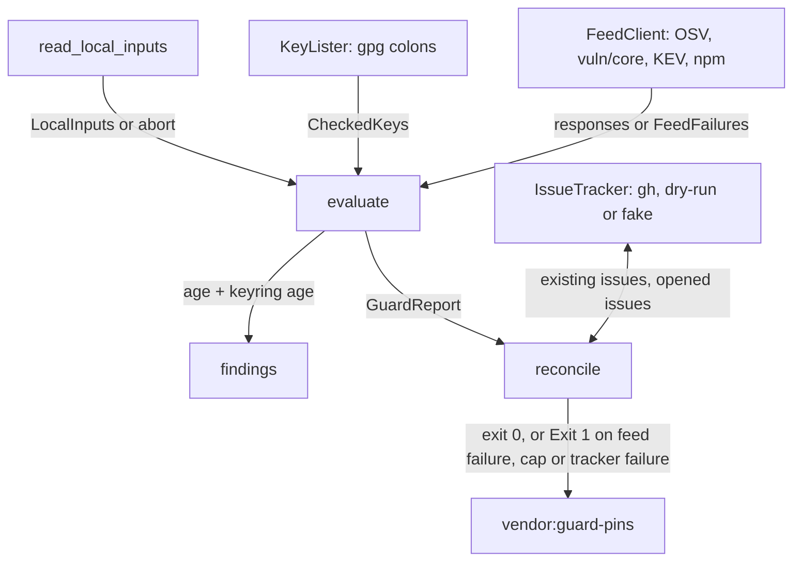

# Scheduled Advisory and Age Guards for the Vendored Runtime Pins Implementation Plan

## Overview

Build `vendor:guard-pins`, a networked invoke task that a daily
`runtime-pin-guard` workflow runs. It evaluates every check on the three
vendored runtime pins (`playwright-core`, Node, Chromium) and the trust-anchor
keyring — advisory matching, pin age, keyring age, Node release-key expiry —
then opens deduplicated, labelled, assigned GitHub issues for findings and feed
failures. The domain logic is pure Python under `tasks/shared/vendor/pin_guard/`,
driven test-first against recorded feed fixtures, an in-memory issue tracker
and recorded `gpg` output.

## Current State Analysis

None of the guard exists. What does:

- `pins.toml:28-38` holds `chromium.revision = "1193"` and
  `node.version = "22.22.2"`; the `playwright` pin (`1.55.1`) is in
  `skills/design/inventory-design/scripts/playwright/package.json`, read by
  `assemble.pinned_playwright_version` (`tasks/shared/vendor/assemble.py:99-112`).
  There are no bump dates, no `[playwright-core]` table and no `[keyring]`
  table. Every reader of `pins.toml` looks fields up by key, so new keys in
  `[chromium]`/`[node]` and new top-level tables are safe; nothing may go under
  `[assembled_sha256]` or `[chromium.sha256]`.
- `tasks/shared/vendor/fetch.py` is the only HTTP client: GET-only httpx
  wrappers that let `httpx` and `json` exceptions escape unwrapped.
- `tasks/shared/vendor/gpg.py` uses gpg only to verify signatures; nothing lists
  keys. gpg is not provisioned by `mise`; `ubuntu-latest` ships GnuPG 2.4.4.
- `browsers.json` is read only by `assemble.browser_revision`, which ignores
  `browserVersion`. Its two consumers, `chromium.verify_chromium` and
  `assemble.assert_version_pairing`, have no production callers, although the
  `chromium.py` docstrings claim the revision cross-check happens at assembly.
- `tasks/docs.py:42-83` with `tasks/shared/npm_audit.py` is the closest
  template: `today` as a task argument, frozen dataclasses, domain errors
  translated to `Exit(..., code=1)` at the task boundary.
- `.github/workflows/main.yml` is the only workflow. `tasks/lint/workflows.py:7`
  hard-codes `actionlint` to `main.yml`, and `tests/unit/tasks/test_workflows.py:29`
  loads only `main.yml`, so a second workflow file is unchecked today.
- `tests/unit/tasks/test_mise.py:240-295` keeps `measure:*` out of the
  transitive closure of `check` and `default`, keyed on the `run` string.
- `RELEASING.md:159-216` has the trust-anchor section; it names no owner, no
  maximum ages and no feeds, and still claims a fresh checkout carries
  placeholders. `trust_anchors.py:127-128` names a heading that does not exist.
- `tasks/shared/vendor/nodejs.py:24-26` cites a fingerprint-consistency test
  that does not exist.

Facts verified live during planning (2026-10-09):

- OSV `querybatch` returns `{}` for a query with no match (no `vulns` key):
  `{"results":[{},{"vulns":[{"id":"GHSA-7mvr-c777-76hp","modified":"…"}]}]}`.
- OSV `GET /v1/vulns/<unknown>` returns HTTP 404 with
  `{"code":5,"message":"Vulnerability not found"}`.
- Chromium CVE records carry `affected[0].database_specific.unresolved_ranges`
  as `[{"events":[{"introduced":"0"},{"fixed":"138.0.7204.96"}]},
  {"events":[{"introduced":"0"},{"fixed":"138.0.7204.92"}]}]` — several fixed
  versions per record, no `package` or `ranges`.
- `playwright-core@1.55.1`'s `browsers.json` gives `chromium-headless-shell`
  revision `"1193"`, `browserVersion` `"140.0.7339.186"`; `ffmpeg` and `winldd`
  entries carry no `browserVersion`.
- `vuln/core/index.json` is an object keyed `"1"`…`"194"`. Range syntax across
  every entry: `||`, `N.x`, `N.M.x`, `^X.Y.Z`, space-ANDed comparators (with an
  optional space after the operator, `>= 10.9.0`), a bare major after an
  operator (`<= 10`), bare exact versions, and leading whitespace. No `~`, `*`
  or hyphen ranges. Fourteen entries have no CVE; every entry has `patched`.
- KEV Google products include `Chromium*`, `Chrome*`, `Skia`, `Dawn` and
  `Pixel`.
- `gpg --homedir <tmp> --batch --show-keys --with-colons keys/nodejs-release.asc`
  lists 9 primaries matching `NODE_RELEASE_FINGERPRINTS` exactly. Against
  2026-10-09 it holds: primary `890C08DB8579162FEE0DF9DB8BEAB4DFCF555EF4`
  (`sc`) expired 2026-07-08; subkey `A6023530FC53461FEC91F99C04CD3F2FDE079578`
  (`esa`) expired 2025-06-01; signing subkey
  `86C8D74642E67846F8E120284DAA80D1E737BC9F` expires 2026-12-09 (61 days).

## Desired End State

- `mise run vendor:guard-pins` evaluates every check, aborts on a bad local
  input or pin inconsistency before opening any issue, opens at most one issue
  per finding across its lifecycle, opens a feed-failure issue only when no
  open one for that feed already covers the checks it skipped, and exits
  non-zero only for an abort, a feed failure, a tripped
  issue cap or a tracker failure. Without `--open-issues` it prints the drafts
  it would open and writes nothing.
- `.github/workflows/runtime-pin-guard.yml` runs it daily and on dispatch with
  `--open-issues`, `issues: write` and a `concurrency` group; a dispatch can
  raise the per-run issue cap through its `maximum-new-issues` input.
- `pins.toml` carries `playwright-core.bumped = 2026-05-18`,
  `chromium.bumped = 2026-05-18`, `node.bumped = 2026-08-24`,
  `keyring.bumped = 2026-08-24`.
- `RELEASING.md` carries `Owner: Toby Clemson (@tobyclemson)`, the maximum ages,
  the warning window, the bump-date instruction, the four feeds, the KEV
  filter, the blind spots, the owner's action per issue kind and schedule
  health checks.
- Every work item 0225 acceptance criterion holds, with the amendments
  recorded in the work item: the dry-run default and per-run issue cap
  (Phase 2), feed-failure identity including the skipped checks (Phase 5),
  and the widened KEV filter and Chromium fixed-version rule (Phase 7).

Verify with `mise run` (bare default) green, then the dispatched-run manual
checks in Phases 4–7.

### Key Discoveries:

- `tomllib` parses an unquoted TOML local date to `datetime.date`, and an
  offset datetime to `datetime.datetime` — a subclass of `date`, so the bump-date
  check must test `type(value) is dt.date`.
- Python 3.14's `tomllib.TOMLDecodeError` exposes `lineno`, so an invalid date
  such as `bumped = 2026-13-01` (a TOML syntax error) can be reported by
  quoting the offending line.
- `assemble.default_spec_builder` reads `extracted.playwright_core / "package"`
  (`assemble.py:437`); the real `browsers.json` is at
  `package/browsers.json` in the npm tarball.
- `semver>=3.0.4,<4` is already a dependency (`pyproject.toml:18`) and is used
  for plain version parsing (`tasks/github.py:35-40`); it has no npm-range
  support, hence a small range parser.
- `gpg.py`'s ephemeral-homedir pattern (`gpg.py:135-175`) is the model for the
  key lister.
- Test doubles live in `tests/unit/tasks/shared/doubles.py` and are imported as
  `tests.unit.tasks.shared.doubles`.
- `gh issue list` truncates at `--limit`; `gh api --paginate` over
  `repos/{owner}/{repo}/issues?labels=runtime-pin-guard&state=all` does not, so
  the adapter uses it. That endpoint also returns pull requests, and `body` is
  `null` for an empty body.
- `fetch.py` is documented as the one HTTP client and holds the timeouts; the
  guard's feed client delegates to it rather than configuring `httpx` again.
- `npm.assert_integrity_binds_tarball` (`tasks/shared/vendor/npm.py:120`)
  checks a tarball file against the packument's sha512 `integrity`; a bytes
  variant serves the guard's in-memory download.
- `pins.py` owns every `pins.toml` read; the guard reads through it.
- `tasks/docs.py:48-52` defaults `today` to `dt.datetime.now(tz=dt.UTC).date()`.

## What We're NOT Doing

- Auto-closing issues once a pin moves past a fix.
- Verifying the npm registry signature or SLSA provenance of the
  `playwright-core` tarball the guard reads `browsers.json` from; the guard
  checks its sha512 `integrity` against the packument only, since it ships
  nothing.
- A pin-age deferral: bumping the pin is the only way to clear a pin-age
  finding.
- An automated heartbeat for the schedule; `RELEASING.md` documents the manual
  health check.
- Matching non-KEV Chromium CVEs (NVD, Chrome Releases scraping).
- The trust-anchor second-approver gate and its work item.
- Annotating the 0196 plan.
- Pinning gpg through `mise`; a behavioural check on its output stands in.
- Watching `ffmpeg`, `winldd` or any non-Chromium `browsers.json` entry.

## Implementation Approach



Domain vocabulary maps one-to-one onto modules in
`tasks/shared/vendor/pin_guard/`:

| Module | Domain concept | Phase |
|---|---|---|
| `aborts.py` | `GuardAbort` | 2 |
| `local_inputs.py` | `Pin`, `Owner`, `LocalInputs`, `LocalInputError` | 2 |
| `markers.py` | `IssueMarker` | 2 |
| `findings.py` | `Finding`, `PinAgeFinding`, `KeyringAgeFinding`, `KeyExpiryFinding`, `AdvisoryFinding`, `IssueDraft` | 2, 3, 5 |
| `ages.py` | maximum ages, `pin_age_findings`, `keyring_age_findings` | 2 |
| `issues.py` | `IssueTracker`, `IssueTrackerError`, `ExistingIssue`, `IssuePolicy`, `reconcile`, `ReconcileOutcome`, `DryRunIssueTracker` | 2, 5 |
| `github_issues.py` | `GhIssueTracker`, `GhRunner` | 2 |
| `report.py` | `GuardReport` | 2, 5 |
| `guard.py` | `GuardPorts`, `GuardRun`, `evaluate`, `run_guard` | 2–7 |
| `wiring.py` | `real_ports` | 2–5 |
| `keyring.py` | `CheckedKey`, `KeyringError`, `KeyLister`, `key_expiry_findings` | 3 |
| `feeds.py` | `Feed`, `CheckName`, `FeedFailure`, `FeedUnreachableError`, `FeedDocumentError`, `FeedClient`, `FeedBudget`, `FeedSession` | 5 |
| `http_feeds.py` | `HttpFeedClient` | 5 |
| `checks.py` | `CheckOutcome` | 5 |
| `osv.py` | batch query, OSV records, npm fix selection | 5 |
| `npm_ranges.py` | `VersionRange` for the `vuln/core` range subset | 6 |
| `node_advisories.py` | `vuln/core` matching | 6 |
| `npm_registry.py` | `pinned_browser_build`, `PinInconsistencyError` | 7 |
| `chromium_versions.py` | `ChromiumVersion`, `ChromiumVersionError` | 7 |
| `chromium_advisories.py` | KEV filter, fixed-version rule | 7 |

Outside the package, `pins.py` gains the bump-date reader, `gpg.py` gains the
key listing, `fetch.py` gains `post_json` and `get_bytes`, and `npm.py` gains
an in-memory integrity check.

The names map as: task `vendor:guard-pins` → package
`tasks/shared/vendor/pin_guard/` → workflow, job and label `runtime-pin-guard`.
Tests are `tests/unit/tasks/test_vendor_pin_guard_*.py`, so `-k pin_guard`
selects them all; fixtures live under `tests/unit/tasks/fixtures/pin-guard/`.

Every abort derives from `GuardAbort`, which `guard_pins_with` translates to
`Exit(..., code=1)`. `run_guard` evaluates every check before it touches the
tracker, so an abort raised during evaluation still precedes any write.

Imports run one way, in this order: `aborts` → `markers` → `local_inputs` →
`findings` → `feeds` → `checks` → the check modules (`ages`, `keyring`,
`osv`, `node_advisories`, `npm_registry`, `chromium_advisories`) → `report` →
`issues` → `github_issues` → `http_feeds` → `guard` → `wiring`. Pure value parsers
(`npm_ranges`, `chromium_versions`, and `BrowsersManifest` outside the
package) sit below everything that imports them, raise their own
`ValueError` subclasses and know nothing of feeds; each check's `parse`
callable translates them to `FeedDocumentError`.

Every phase is red-green-refactor: each behaviour below lands as a failing test
first. Each phase merges on its own and leaves `mise run` green.

---

## Phase 1: One Browsers Manifest, Checked at Assembly

### Overview

Replace the two uncalled cross-checks with one `BrowsersManifest` domain type
that keeps `browserVersion`, and wire the revision cross-check into
`assemble_tree_artifacts`, where the `chromium.py` docstrings say it already
happens. The guard reuses the type in Phase 7.

### Changes Required:

#### 1. Browsers manifest

**File**: `tasks/shared/vendor/browsers.py` (new)

```python
HEADLESS_SHELL = "chromium-headless-shell"


class BrowsersManifestError(ValueError): ...


class UnpinnedRevisionError(Exception): ...


@dataclass(frozen=True, slots=True)
class BrowserBuild:
    name: str
    revision: str
    browser_version: str | None


@dataclass(frozen=True, slots=True)
class BrowsersManifest:
    builds: tuple[BrowserBuild, ...]

    @classmethod
    def parse(cls, document: object) -> Self: ...

    @classmethod
    def read(cls, path: Path) -> Self: ...

    def pinned_headless_shell(self, revision: str) -> BrowserBuild: ...
```

- `parse` raises `BrowsersManifestError` when `browsers` is missing, not a
  list, or empty, or when an entry lacks a string `name` or `revision`.
- `pinned_headless_shell` returns the `chromium-headless-shell` build whose
  revision equals `revision`, else raises `UnpinnedRevisionError` naming the
  revision. It is not a `ValueError`, so no handler for malformed documents
  can mistake a pin inconsistency for one.

#### 2. Assembly cross-check

**File**: `tasks/shared/vendor/assemble.py`
**Changes**: add `pins_path: Path = PINS_TOML` to `assemble_tree_artifacts`;
after extraction and before `spec_builder`, call
`BrowsersManifest.read(extracted.playwright_core / "package" / "browsers.json").pinned_headless_shell(pins.chromium_revision(pins_path))`.
Delete `browser_revision` and `assert_version_pairing`.

**File**: `tasks/shared/vendor/chromium.py`
**Changes**: delete `verify_chromium`; keep `assert_chromium_bytes`. Move
`_HEADLESS_SHELL` usage to `browsers.HEADLESS_SHELL`.

#### 3. Tests

**File**: `tests/unit/tasks/test_vendor_browsers.py` (new) — parse of the
recorded `tests/unit/tasks/fixtures/pin-guard/browsers-1.55.1.json`; missing,
non-list and empty `browsers`; entry without `revision`; pinned build found
with `browser_version == "140.0.7339.186"`; revision absent raises
`UnpinnedRevisionError`; a `chromium` entry sharing the revision is not
mistaken for `chromium-headless-shell`.

**File**: `tests/unit/tasks/test_vendor_assemble.py` — `_miniature_inputs`
and `_realistic_inputs` both write `package/browsers.json` into the
`playwright-core` tree, and the miniature specs read from `package/`. Every
test that calls `assemble_tree_artifacts` passes a `tmp_path` pins file naming
the fixture's revision, so a Chromium bump in the repository's `pins.toml`
cannot break them. New test: assembly with a pins file naming a different
revision fails before any archive is written. Delete the `browser_revision`
and `assert_version_pairing` tests.

**File**: `tests/unit/tasks/test_vendor_chromium.py` — replace the
`verify_chromium` tests with two direct tests of `assert_chromium_bytes`: a
matching digest passes, a mismatched digest fails. These are the only direct
tests of the wrong-bytes path, since `test_vendor_upstream.py` stubs it.

### Success Criteria:

#### Automated Verification:

- [ ] Browsers and assembly tests pass: `uv run pytest tests/unit/tasks/test_vendor_browsers.py tests/unit/tasks/test_vendor_assemble.py tests/unit/tasks/test_vendor_chromium.py`
- [ ] No references remain: `rg 'verify_chromium|assert_version_pairing|browser_revision' tasks tests` returns nothing
- [ ] Build-system checks pass: `mise run build-system:check`
- [ ] Full local CI mirror passes: `mise run`

#### Manual Verification:

- [ ] On the PR, the `assemble-runtime` job assembles successfully with the real `playwright-core` 1.55.1 tarball (revision 1193 matches)

---

## Phase 2: Local Inputs, Age Checks, Issue Reconciliation and the Task

### Overview

Deliver a working guard for pin age and keyring age end to end: bump dates in
`pins.toml`, the `Owner:` line, local-input aborts, the issue tracker port with
its `gh` adapter, dry-run wrapper and in-memory fake, the reconciler with its
issue cap, and the `vendor:guard-pins` task kept out of the CI mirror.

### Changes Required:

#### 1. Bump dates

**File**: `pins.toml`

```toml
[playwright-core]
bumped = 2026-05-18

[chromium]
revision = "1193"
bumped = 2026-05-18

[node]
version = "22.22.2"
bumped = 2026-08-24

[keyring]
bumped = 2026-08-24
```

`[playwright-core]` sits before `[chromium]` with its own one-line comment:
the `playwright-core` version itself is declared in the vendored
`package.json`. `bumped` sits directly under `revision`, before
`[chromium.sha256]`. The comment above `[chromium]` is rewritten: it names
`chromium.revision` and `node.version` (not `CHROMIUM_REVISION` and
`NODE version`), says the revision, digests and Node version follow a
Playwright pin bump under the trust-anchor procedure, and says each `bumped`
moves only with its own subject, pointing at the rule in `RELEASING.md`. Its
current closing sentence, "A Playwright pin bump refreshes all of them", would
otherwise read as covering the bump dates. The rule moves each bump date only
with its own subject: `chromium.bumped` changes only
when `chromium.revision` does, since a Playwright bump that keeps the revision
would otherwise refresh the date while the closed `pin-age chromium <revision>`
issue went on suppressing the next breach.

#### 2. Owner line and bump-date rule

**File**: `RELEASING.md`:

- add `## Vendored-runtime pin guard` after `### Refreshing the anchors`,
  opening with `Owner: Toby Clemson (@tobyclemson)` and one sentence saying the
  guard parses that line, so it must stay the only line of the form
  `Owner: Name (@login)`;
- in that section, the bump-date rule: bump dates live in `pins.toml`
  (`<table>.bumped`), are TOML local dates, and are updated in the same
  change that moves their own subject or refreshes the keyring (including
  re-verifying the keyring unchanged), never otherwise;
- `### Refreshing the anchors`, step 4: commit `pins.toml`, updating
  `playwright-core.bumped` when the `playwright` version moves,
  `chromium.bumped` only when `chromium.revision` changes, `node.bumped` only
  when `node.version` changes, and `keyring.bumped` only when step 1 replaced
  or re-verified the keys.

The rule ships with the dates it governs; the rest of the section lands in
Phase 4.

#### 3. Aborts and local inputs

**File**: `tasks/shared/vendor/pin_guard/aborts.py`

```python
class GuardAbort(Exception): ...
```

**File**: `tasks/shared/vendor/pins.py` — add

```python
def bump_date(subject: str, path: Path = PINS_TOML) -> object: ...
```

returning the raw `<subject>.bumped` value, or `None` when the table or key
is absent, so `pins.py` stays the single owner of the file's schema.
`read_local_inputs` reads through `bump_date`, `node_version` and
`chromium_revision`, and validates what they return. It maps a `None` bump
date, a `KeyError` from `node_version` or `chromium_revision`, and a
`TOMLDecodeError` from any of them to `LocalInputError` naming the field (or
the line, for a syntax error), so a missing input aborts like a malformed
one.

**File**: `tasks/shared/vendor/pin_guard/local_inputs.py`

```python
class LocalInputError(GuardAbort): ...


class PinName(StrEnum):
    PLAYWRIGHT_CORE = "playwright-core"
    NODE = "node"
    CHROMIUM = "chromium"


@dataclass(frozen=True, slots=True)
class Pin:
    name: PinName
    version: str
    bumped: dt.date


@dataclass(frozen=True, slots=True)
class Owner:
    name: str
    login: str

    @classmethod
    def from_releasing(cls, text: str) -> Self: ...


@dataclass(frozen=True, slots=True)
class LocalInputPaths:
    pins: Path
    package_json: Path
    releasing: Path
    node_keyring: Path

    @classmethod
    def repository(cls) -> Self: ...


@dataclass(frozen=True, slots=True)
class LocalInputs:
    playwright_core: Pin
    node: Pin
    chromium: Pin
    keyring_bumped: dt.date
    owner: Owner
    node_keyring: Path

    @property
    def pins(self) -> tuple[Pin, ...]: ...


def read_local_inputs(paths: LocalInputPaths, today: dt.date) -> LocalInputs: ...
```

Each failure raises `LocalInputError` naming the input:

| Input | Accepted | Error names |
|---|---|---|
| `pins.toml` syntax | parses | `pins.toml` line N and its text, from `TOMLDecodeError.lineno` |
| `<table>.bumped` | present, `type(v) is dt.date` and `v <= today` | `playwright-core.bumped` etc. |
| `node.version` | present and `^\d+\.\d+\.\d+$` | `node.version` |
| `chromium.revision` | present and `^\d+$` | `chromium.revision` |
| `playwright` in `package.json` | `assemble.pinned_playwright_version` succeeds | the `package.json` path |
| `Owner:` | exactly one line matching `^Owner: (.+) \(@([A-Za-z0-9-]+)\)$` | `RELEASING.md Owner: line` |
| `keys/nodejs-release.asc` | exists, non-empty | `keys/nodejs-release.asc` |

`LocalInputPaths.repository()` uses `PINS_TOML`, `PLAYWRIGHT_PACKAGE_JSON`
(moved from `tasks/vendor/commands.py` to `tasks/shared/paths.py`),
a new `RELEASING_MD`, and `KEYS_DIR / "nodejs-release.asc"`.

#### 4. Markers, findings and ages

**File**: `tasks/shared/vendor/pin_guard/markers.py`

```python
class MarkerKind(StrEnum):
    FINDING = "finding"
    FEED_FAILURE = "feed-failure"
    GUARD_TRIPPED = "guard-tripped"


@dataclass(frozen=True, order=True, slots=True)
class IssueMarker:
    kind: MarkerKind
    parts: tuple[str, ...]

    def render(self) -> str: ...

    @classmethod
    def of_body(cls, body: str) -> Self | None: ...
```

- `render` produces `<!-- <kind>: <part> <part> … -->`. Every draft body ends
  with its rendered marker as its last line.
- `of_body` splits the body with `splitlines()`, strips whitespace, and reads
  only the last non-empty line, returning its marker or `None`; CRLF endings
  from a web-UI edit and trailing blank lines are tolerated. An issue therefore carries exactly one marker, and text elsewhere in
  a body (a listing of would-be findings, an echoed feed value) can never
  suppress a finding.
- Construction raises `ValueError` when `parts` is empty or a part contains
  anything outside `[A-Za-z0-9._-]`, so a value carrying `-->` or whitespace
  can never produce or split a marker.

**File**: `tasks/shared/vendor/pin_guard/findings.py`

```python
RELEASING_GUARD_URL = (
    "https://github.com/atomicinnovation/accelerator/blob/main/"
    "RELEASING.md#vendored-runtime-pin-guard"
)


@dataclass(frozen=True, slots=True)
class IssueDraft:
    marker: IssueMarker
    title: str
    body: str


class Finding(Protocol):
    @property
    def marker(self) -> IssueMarker: ...

    def draft(self, owner: Owner) -> IssueDraft: ...


def code_span(text: str) -> str: ...


@dataclass(frozen=True, slots=True)
class PinAgeFinding:
    pin: Pin
    age_days: int

    @property
    def marker(self) -> IssueMarker:
        return IssueMarker(
            MarkerKind.FINDING, ("pin-age", self.pin.name, self.pin.version)
        )

    def draft(self, owner: Owner) -> IssueDraft: ...


@dataclass(frozen=True, slots=True)
class KeyringAgeFinding:
    bumped: dt.date
    age_days: int

    @property
    def marker(self) -> IssueMarker:
        return IssueMarker(
            MarkerKind.FINDING, ("keyring-age", self.bumped.isoformat())
        )

    def draft(self, owner: Owner) -> IssueDraft: ...
```

`draft()` bodies name the pin, its version, its age in days and the owner
(pin age), or the keyring, its age and the owner (keyring age), link to
`RELEASING_GUARD_URL` (absolute, since GitHub resolves a relative link in an
issue body against the issue's URL), and end with the rendered marker.
`code_span` strips backticks, `<` and `>` and wraps the text in one backtick
pair; every value not authored by the guard is rendered through it. New
finding kinds in later phases satisfy `Finding` without editing a union; the
owner is supplied once, at drafting.

**File**: `tasks/shared/vendor/pin_guard/ages.py`

```python
PIN_MAXIMUM_AGE_DAYS = 90
KEYRING_MAXIMUM_AGE_DAYS = 365


def pin_age_findings(inputs: LocalInputs, today: dt.date) -> list[PinAgeFinding]: ...


def keyring_age_findings(inputs: LocalInputs, today: dt.date) -> list[KeyringAgeFinding]: ...
```

A finding exists when `(today - bumped).days` is strictly greater than the
maximum.

#### 5. Issue tracker and reconciliation

**File**: `tasks/shared/vendor/pin_guard/issues.py`

```python
LABEL = "runtime-pin-guard"
MAXIMUM_NEW_ISSUES = 10


class IssueTrackerError(Exception): ...


@dataclass(frozen=True, slots=True)
class ExistingIssue:
    number: int
    is_open: bool
    author: str
    body: str


class IssueTracker(Protocol):
    def issues(self) -> list[ExistingIssue]: ...
    def ensure_label(self) -> None: ...
    def open_issue(self, draft: IssueDraft, assignee: str) -> int: ...


@dataclass(frozen=True, slots=True)
class FailedDraft:
    draft: IssueDraft
    error: IssueTrackerError


@dataclass(frozen=True, slots=True)
class IssuePolicy:
    trusted_author: str
    maximum_new_issues: int = MAXIMUM_NEW_ISSUES


@dataclass(frozen=True, slots=True)
class ReconcileOutcome:
    opened: tuple[int, ...]
    tripped: bool
    failed: tuple[FailedDraft, ...]


def reconcile(
    report: GuardReport, tracker: IssueTracker, owner: Owner, policy: IssuePolicy
) -> ReconcileOutcome: ...


class DryRunIssueTracker:
    def __init__(self, tracker: IssueTracker, out: TextIO) -> None: ...
```

- `reconcile` takes the marker of each issue whose `author` is
  `policy.trusted_author`, so a labelled issue someone else wrote cannot
  suppress a finding. It collapses findings sharing a marker, drafts each
  whose marker belongs to no trusted issue of any state, and orders drafts by
  marker so runs are deterministic.
- If any draft remains, it calls `ensure_label()` once before any write, on
  every branch. A failure from `issues()` or `ensure_label()` propagates, since
  nothing can be reconciled without them.
- When more than `policy.maximum_new_issues` finding drafts remain, it opens
  none of them. It instead drafts one `guard-tripped` issue whose marker parts
  are `(<digest>,)`, the digest being the first 12 hex digits
  of the SHA-256 of the would-be markers' rendered forms, sorted and joined by
  newlines. Its body lists each would-be finding's parts in a code span, never
  as a rendered marker, and says how many there are. It is suppressed only by
  an **open** trusted issue with the same marker, so an unchanged set adds
  nothing while a changed set opens a fresh tripped issue. `tripped` is then
  `True`.
- Every write is attempted, and each `IssueTrackerError` is collected into
  `failed` rather than stopping the run. Each draft is assigned to
  `owner.login`.
- `DryRunIssueTracker` delegates `issues()` to the wrapped tracker, and prints
  each label creation and draft (title, assignee, body) instead of writing.

**File**: `tasks/shared/vendor/pin_guard/github_issues.py`

```python
class GhRunner(Protocol):
    def __call__(self, argv: list[str], *, stdin: str | None = None) -> str: ...


def run_gh(argv: list[str], *, stdin: str | None = None) -> str: ...


class GhIssueTracker:
    def __init__(self, run: GhRunner = run_gh) -> None: ...
```

- `GhIssueTracker.issues()` runs
  `gh api --paginate repos/{owner}/{repo}/issues?labels=runtime-pin-guard&state=all&per_page=100 --jq '.[] | select(.pull_request == null) | {number, state, author: .user.login, body: (.body // "")}'`
  and parses JSON lines; `ensure_label()` runs `gh label list --json name
  --limit 1000` and, when absent, `gh label create runtime-pin-guard
  --description … --color …`; `open_issue()` runs `gh issue create --title …
  --body-file - --label runtime-pin-guard --assignee <login>` with the body on
  stdin and parses the issue URL for its number, raising `IssueTrackerError`
  when the output holds no issue URL.
- `run_gh` wraps `subprocess.run(check=True, capture_output=True, text=True,
  timeout=30)` and raises `issues.IssueTrackerError` naming the `gh`
  subcommand with its stripped stderr, for a non-zero exit or a timeout.

**File**: `tests/unit/tasks/shared/doubles.py` — add `FakeIssueTracker`: seeded
with open and closed `ExistingIssue`s, a `label_exists` flag and an optional
set of drafts whose `open_issue` raises `IssueTrackerError`; records
`opened: list[tuple[IssueDraft, str]]`, `labels_created` and every call.
Add `fake_ports(**overrides)`, which builds a `GuardPorts` from fakes only.
Its defaults describe a **clear but non-vacuous** world: every check runs
against valid, populated inputs and yields no finding and no feed failure.
Each later phase extends those defaults for the port it adds. Beside it,
`clear_repository(tmp_path, today)` writes one shared fixture repository —
`playwright` `1.55.1`, `chromium.revision` `1193`, `node.version` `22.22.2`,
fresh bump dates, a valid `Owner:` line and keyring — and the feed defaults
are derived from its values. Every `evaluate` and `guard_pins_with` test
builds on it, overriding only what it exercises, so a later phase's defaults
cannot disagree with an earlier phase's repository.

#### 6. Guard orchestration

**File**: `tasks/shared/vendor/pin_guard/report.py`

```python
@dataclass(frozen=True, slots=True)
class GuardReport:
    findings: tuple[Finding, ...]
```

It sits in its own module so `issues.reconcile` and `guard.evaluate` both
depend on it without `issues.py` importing the orchestrator.

**File**: `tasks/shared/vendor/pin_guard/guard.py`

```python
@dataclass(frozen=True, slots=True)
class GuardPorts:
    tracker: IssueTracker


@dataclass(frozen=True, slots=True)
class GuardRun:
    report: GuardReport
    outcome: ReconcileOutcome

    def failure_reasons(self) -> tuple[str, ...]: ...


def evaluate(inputs: LocalInputs, today: dt.date, ports: GuardPorts) -> GuardReport: ...


def run_guard(
    paths: LocalInputPaths, today: dt.date, ports: GuardPorts, policy: IssuePolicy
) -> GuardRun: ...
```

`GuardPorts` holds collaborators only and has no defaults. `run_guard` reads
local inputs, evaluates every check, and only then reconciles; a `GuardAbort`
escapes before any tracker call. `failure_reasons` lists every reason the run
must fail — a tripped cap, each failed draft, and (from Phase 5) each failed
feed — so one exit message names them all. Later phases add to `GuardPorts`,
`GuardReport` and `failure_reasons` without changing these signatures.

**File**: `tasks/shared/vendor/pin_guard/wiring.py`

```python
def real_ports(*, open_issues: bool) -> GuardPorts: ...
```

The one place production collaborators are wired: `GhIssueTracker`, wrapped
in `DryRunIssueTracker(…, sys.stdout)` unless `open_issues`. Keeping it out of
`guard.py` means importing the orchestrator pulls in no adapter.

#### 7. Task, leaf and CI-mirror guard

**File**: `tasks/shared/clock.py` — add

```python
def today_or_now(text: str | None) -> dt.date: ...
```

It parses an ISO date or returns `dt.datetime.now(tz=dt.UTC).date()`;
`docs.audit_check` switches to it.

**File**: `tasks/vendor/commands.py`

```python
GUARD_ISSUE_AUTHOR = "github-actions[bot]"


@task(name="guard-pins")
def guard_pins(
    context: Context,
    today: str | None = None,
    open_issues: bool = False,
    issue_author: str = GUARD_ISSUE_AUTHOR,
    maximum_new_issues: int = MAXIMUM_NEW_ISSUES,
) -> None:
    """Report runtime-pin-guard findings for the vendored-runtime pins and keyring."""
    if open_issues and today is not None:
        raise Exit("--today cannot be combined with --open-issues", code=1)
    if maximum_new_issues < 1:
        raise Exit("--maximum-new-issues must be at least 1", code=1)
    guard_pins_with(
        LocalInputPaths.repository(),
        today_or_now(today),
        real_ports(open_issues=open_issues),
        IssuePolicy(issue_author, maximum_new_issues),
    )


def guard_pins_with(
    paths: LocalInputPaths,
    today: dt.date,
    ports: GuardPorts,
    policy: IssuePolicy,
) -> None: ...
```

`guard_pins_with` translates `GuardAbort` and `IssueTrackerError` to
`Exit(str(error), code=1)`, and after reconciliation raises one
`Exit(code=1)` naming every entry of `GuardRun.failure_reasons()` when there
are any. Refusing `--today` with `--open-issues` stops a boundary experiment
from opening real issues early, whose closure would suppress the genuine ones
later. `--maximum-new-issues` is the release path for a genuine burst: after
reading the drafts, the owner dispatches the workflow with a higher cap.

**File**: `tasks/__init__.py` — `ns_vendor.add_task(vendor_commands.guard_pins)`.

**File**: `mise.toml`

```toml
[tasks."vendor:guard-pins"]
description = "Report runtime-pin-guard findings for the vendored-runtime pins and keyring (networked; prints drafts unless --open-issues)"
run = "invoke vendor.guard-pins"
```

**File**: `tests/unit/tasks/test_mise.py` — `_GUARD_INVOCATION =
"invoke vendor.guard-pins"`; an anti-vacuity test that `vendor:guard-pins`
reaches it; a test parametrised over `check` and `default` asserting no task
in `_transitive_depends(root)` reaches it.

**File**: `tasks/README.md` — a subsection beside "The measure namespace"
for `vendor:guard-pins`: it is networked; it prints drafts unless
`--open-issues`, which only `runtime-pin-guard.yml` passes; `--today` is for
dry runs only; only issues authored by `github-actions[bot]` count for
deduplication, so a change to the workflow's token identity needs
`--issue-author` to match; it is kept out of `check` and `default` by the
`test_mise.py` run-string guard; and it is tried safely with
`GH_REPO=<throwaway> mise run vendor:guard-pins -- --open-issues --issue-author <your-login>`.
It names the task → package → workflow/label mapping.

#### 8. Work item

**File**: `meta/work/0225-…md`:

- under Open Questions, record that the task is `vendor:guard-pins`, the owner
  login is `tobyclemson`, and key expiry is read with
  `gpg --show-keys --with-colons`;
- amend the Technical Notes dedup bullet in place: issues are listed with
  `gh api --paginate` (not `gh issue list`, which truncates), pull requests
  are filtered out, and only the trailing marker of an issue authored by
  `github-actions[bot]` counts;
- add a Requirement and a Drafting Note for the dry-run default
  (`--open-issues` writes, only the workflow passes it) and the per-run cap:
  above 10 new finding drafts the guard opens one `guard-tripped` issue keyed
  on the would-be set and exits non-zero, and `--maximum-new-issues` raises
  the cap for one dispatched run. The "findings exist and every feed
  responded → exits 0" criterion gains "and the cap was not exceeded".

#### 9. Tests

- `tests/unit/tasks/test_vendor_pin_guard_local_inputs.py` — every row of the
  table above, including a missing `[node]` table, a missing
  `chromium.revision`, and each missing `bumped` (a deleted `[keyring]` table
  among them), each aborting with `LocalInputError` naming the field;
  `2026-13-01` names the line; a bump date one day after `today`;
  a quoted string date; an offset datetime; `Owner: Jane Doe` rejected,
  `Owner: Jane Doe (@janedoe)` accepted; the repository's own inputs parse.
- `tests/unit/tasks/test_vendor_pin_guard_ages.py` — for each pin, 91 days
  opens a finding naming pin, version, age and owner, 90 does not; keyring
  366/365.
- `tests/unit/tasks/test_vendor_pin_guard_markers.py` — `of_body` returns the
  rendered marker on a body's last line, including with a trailing newline,
  several trailing blank lines, CRLF endings and trailing spaces; a marker
  earlier in the body, with a different last line, is ignored, so a line
  appended under the marker yields `None` as documented behaviour; a body
  with no marker yields `None`; `of_body(draft.body) == draft.marker` for
  every draft kind, including `guard-tripped`; empty
  `parts` and a part containing `-->`, a space or `@` raise.
- `tests/unit/tasks/test_vendor_pin_guard_findings.py` — `code_span` of a value
  containing backticks, `<!-- … -->` and `@user` yields one inert code span.
- `tests/unit/tasks/test_vendor_pin_guard_issues.py` — reconciliation against
  `FakeIssueTracker`:
  - label created when missing and carried by the issue; assignee is the
    owner;
  - an open or closed trusted issue with the marker suppresses; the same
    marker in an issue by another author does not; a marker that is not on a
    trusted issue's last line does not;
  - a closed pin-age issue for an earlier version does not suppress the
    current one; a closed keyring-age issue for an earlier bump date does not
    suppress;
  - two findings with one marker open one issue;
  - no findings → no tracker writes;
  - eleven new drafts open one `guard-tripped` issue listing all eleven and
    nothing else, after ensuring a missing label; ten drafts open normally;
    `maximum_new_issues=11` opens all eleven;
  - an open trusted `guard-tripped` issue for the same set suppresses a
    second; one for a different set does not; a closed one does not; an open
    one by another author does not;
  - after a tripped run whose issue is then closed, a run with ten or fewer
    drafts opens every finding the tripped issue listed;
  - a draft whose `open_issue` fails is reported in `failed` while the rest
    still open, and a failing `guard-tripped` open is reported the same way;
  - a parametrised test over one finding of each kind (growing with each
    phase) asserts the drafted body names the facts the work item requires,
    links to `RELEASING_GUARD_URL`, ends with its marker, and is assigned to
    `owner.login`;
  - `DryRunIssueTracker` reads the wrapped tracker's issues, prints each label
    creation and each draft, and the wrapped tracker records no write.
- `tests/unit/tasks/test_vendor_pin_guard_github_issues.py` — each argv pinned
  through a recording `GhRunner`, including `--label runtime-pin-guard`;
  recorded `gh api` JSON lines parse, including an entry with an empty body;
  `gh issue create` output without an issue URL, a non-zero exit and a
  timeout each raise `IssueTrackerError` carrying stderr.
- `tests/unit/tasks/shared/test_clock.py` — `today_or_now("2026-10-09")` parses;
  `today_or_now(None)` is the UTC date.
- `tests/unit/tasks/test_vendor_pin_guard_task.py`:
  - `evaluate` over `fake_ports()` yields no findings, so a default that
    drifts into producing one fails here first;
  - `guard_pins_with` over a `tmp_path` repository with `fake_ports()`: a
    local-input error raises `Exit` and the fake tracker saw no call; all
    clear → returns, nothing opened; findings → issues opened, returns; a
    tripped cap and a failed draft together raise one `Exit` naming both,
    after the other drafts open;
  - `guard_pins` with `--today` and `--open-issues`, or with
    `--maximum-new-issues 0`, raises `Exit` before reading any input;
  - `real_ports(open_issues=False).tracker` is a `DryRunIssueTracker` and
    `real_ports(open_issues=True).tracker` is not (constructing
    `GhIssueTracker` runs no `gh`); `guard_pins` passes `--issue-author` and
    `--maximum-new-issues` through to the `IssuePolicy` it reconciles with.

### Success Criteria:

#### Automated Verification:

- [ ] Guard tests pass: `uv run pytest tests/unit/tasks -k "pin_guard or clock"`
- [ ] Existing `pins.toml` readers still pass: `uv run pytest tests/unit/tasks/test_tree_artifact_pins.py tests/unit/tasks/test_vendor_trust_anchors.py`
- [ ] `docs:audit-check` behaviour unchanged: `uv run pytest tests/unit/tasks/test_docs_audit_check.py`
- [ ] `vendor:check-trust-anchors` still passes: `mise run vendor:check-trust-anchors`
- [ ] CI-mirror guard passes: `uv run pytest tests/unit/tasks/test_mise.py`
- [ ] Launcher still builds against the edited `pins.toml`: `mise run cli:check`
- [ ] Full local CI mirror passes: `mise run`

#### Manual Verification:

- [ ] `mise run vendor:guard-pins` from a checkout prints pin-age drafts for `playwright-core` (1.55.1) and Chromium (1193), each with its age on the run date, and opens nothing
- [ ] `GH_REPO=<throwaway> mise run vendor:guard-pins -- --open-issues --issue-author <your-login>` opens those two issues, labelled and assigned; a second run opens nothing

---

## Phase 3: Key Expiry

### Overview

List keys from `keys/nodejs-release.asc` through `gpg --show-keys
--with-colons` in the shared `gpg` module, select the checked keys, open
key-expiry findings within the 60-day window, and add the missing
fingerprint-consistency test, running the real parser against the runner's
gpg.

A missing or failing gpg aborts the whole run rather than skipping only key
expiry: the work item names the keyring as a local input, and an abort is
louder than a skipped check.

### Changes Required:

#### 1. Key listing in the shared gpg module

**File**: `tasks/shared/vendor/gpg.py` — add

```python
class KeyListingError(Exception): ...


@dataclass(frozen=True, slots=True)
class ListedKey:
    fingerprint: str
    is_primary: bool
    capabilities: str
    expires_at: dt.datetime | None


def listed_keys(colon_listing: Iterable[str]) -> tuple[ListedKey, ...]: ...


type GpgRunner = Callable[[list[str]], subprocess.CompletedProcess[str]]


def list_keys(
    keyring: Path,
    *,
    run: GpgRunner = _run_gpg_listing,
    which: Callable[[str], str | None] = shutil.which,
) -> tuple[ListedKey, ...]: ...
```

- `listed_keys` walks `pub`/`sub` records, taking the fingerprint from the
  following `fpr` record's field 10 and capabilities from field 12. Field 7 is
  empty (no expiry), epoch seconds, or ISO 8601 basic (`YYYYMMDDTHHMMSS`);
  both forms are parsed as aware UTC datetimes
  (`dt.datetime.fromtimestamp(…, tz=dt.UTC)`, `.replace(tzinfo=dt.UTC)`).
- `listed_keys` raises `KeyListingError` when the listing yields no `pub`, a
  record lacks its `fpr`, a fingerprint is not 40 hex digits, or field 7 is in
  another form. This is the behavioural check that stands in for pinning gpg.
- `list_keys` raises `KeyListingError` naming gpg when `which("gpg")` is
  absent; otherwise it runs `gpg --homedir <TemporaryDirectory> --batch
  --with-colons --fixed-list-mode --with-subkey-fingerprint --show-keys
  <keyring>` and raises `KeyListingError` with stderr on a non-zero exit.

Listing lives beside `_run_gpg` because it is a gpg capability the release
lane's fingerprint test also uses; only the guard's selection and expiry rule
live in `pin_guard`.

#### 2. Checked keys and expiry findings

**File**: `tasks/shared/vendor/pin_guard/keyring.py`

```python
KEY_EXPIRY_WARNING_DAYS = 60


class KeyringError(LocalInputError): ...


@dataclass(frozen=True, slots=True)
class CheckedKey:
    fingerprint: str
    expires_at: dt.datetime | None

    def days_to_expiry(self, today: dt.date) -> int | None: ...


def checked_keys(keys: Iterable[ListedKey]) -> tuple[CheckedKey, ...]: ...


def key_expiry_findings(
    keys: Iterable[CheckedKey], today: dt.date
) -> list[KeyExpiryFinding]: ...


type KeyLister = Callable[[Path], tuple[ListedKey, ...]]
```

- `checked_keys` keeps every primary and every subkey whose capabilities
  contain lowercase `s`.
- `days_to_expiry` is `expires_at.astimezone(dt.UTC).date() - today` in days;
  a finding exists when it is `<= KEY_EXPIRY_WARNING_DAYS`, including negative.

**File**: `tasks/shared/vendor/pin_guard/findings.py` — add

```python
@dataclass(frozen=True, slots=True)
class KeyExpiryFinding:
    fingerprint: str
    expires_on: dt.date
    days_to_expiry: int

    @property
    def marker(self) -> IssueMarker:
        return IssueMarker(
            MarkerKind.FINDING,
            ("key-expiry", self.fingerprint, self.expires_on.isoformat()),
        )

    def draft(self, owner: Owner) -> IssueDraft: ...
```

The body names the fingerprint and expiry date, says whether the key has
expired or expires in N days, and links to the guard section. One marker per
fingerprint and expiry date means nearing and then passing expiry is one
finding.

**File**: `tasks/shared/vendor/pin_guard/guard.py` — `GuardPorts` gains a
required `key_lister: KeyLister`, wired to `gpg.list_keys` in
`wiring.real_ports`;
`evaluate` adds
`key_expiry_findings(checked_keys(ports.key_lister(inputs.node_keyring)), today)`,
translating `KeyListingError` to `KeyringError` naming
`keys/nodejs-release.asc`.

#### 3. Fixtures and tests

- `tests/unit/tasks/fixtures/pin-guard/nodejs-release.colons` — the listing
  recorded during planning (GnuPG 2.5.24), and
  `tests/unit/tasks/fixtures/pin-guard/gpg-2.4-details.colons` — a GnuPG 2.4
  shape built from the DETAILS examples, including an ISO 8601 expiry.
- `tests/unit/tasks/fixtures/pin-guard/clear-keyring.colons` — a synthetic
  listing whose keys have no expiry or expire in 2099.
- `tests/unit/tasks/shared/doubles.py` — `fake_ports()` gains a `KeyLister`
  returning `clear-keyring.colons` parsed, keeping the default world clear;
  tests that want key-expiry findings pass the recorded listing.
- `tests/unit/tasks/test_vendor_gpg.py` — `listed_keys` over both fixtures; an
  empty listing, a `pub` without `fpr` and an unknown expiry form each raise
  `KeyListingError`; an ISO expiry at 23:30 UTC keeps its UTC date with `TZ`
  set to `Pacific/Auckland`; `list_keys` argv pinned through a recording
  runner (ephemeral `--homedir`, `--with-subkey-fingerprint`); `which`
  returning `None` and a non-zero exit each raise `KeyListingError`.
- `tests/unit/tasks/test_vendor_pin_guard_keyring.py`:
  - a key 60 days from expiry opens a finding naming fingerprint and date; 61
    does not; 23:59 UTC on day 61 does not;
  - expiring today and already expired both open;
  - a primary expiring in two years with a signing subkey expiring in 30 days
    opens one finding, for the subkey;
  - the same with an encryption-only subkey opens nothing; a key with no expiry
    opens nothing;
  - the recorded listing against 2026-10-09 yields exactly
    `890C08DB…CF555EF4` (2026-07-08) and `A6023530…DE079578` (2025-06-01), and
    against 2026-10-10 adds `86C8D746…E737BC9F` (2026-12-09).
- `tests/unit/tasks/test_vendor_pin_guard_issues.py` — a closed key-expiry
  issue for D1 does not suppress the re-signed key's D2 finding; a closed
  key-expiry issue opened during the window suppresses the same key after it
  expires; the per-kind body test gains key expiry.
- `tests/unit/tasks/test_vendor_nodejs.py` — the fingerprint-consistency test
  `nodejs.py:24-26` cites: `gpg.list_keys` over the committed keyring parses
  without `KeyListingError`, and its primary fingerprints equal
  `NODE_RELEASE_FINGERPRINTS`. It skips with a reason when gpg is absent;
  CI's `ubuntu-latest` has GnuPG 2.4.4, so CI runs the real parser against the
  runner's gpg on every PR.
- `tests/unit/tasks/test_vendor_pin_guard_task.py` — the existing tests use
  `fake_ports()`; a `KeyLister` raising `KeyListingError`, with stale bump
  dates in the fixture so age findings exist, exits non-zero naming the
  keyring and the fake tracker saw no call at all.

### Success Criteria:

#### Automated Verification:

- [ ] Key listing and keyring tests pass: `uv run pytest tests/unit/tasks -k "pin_guard or gpg or nodejs"`
- [ ] Full local CI mirror passes: `mise run`

#### Manual Verification:

- [ ] On the PR, CI's `test_vendor_nodejs.py` fingerprint-consistency test ran rather than skipped

---

## Phase 4: Workflow and Non-Advisory Documentation

### Overview

Schedule the guard, bring every workflow file under `actionlint`, document the
owner's side of age and expiry, and fix the trust-anchor drift. This completes
the work item's first change.

### Changes Required:

#### 1. Workflow

**File**: `.github/workflows/runtime-pin-guard.yml` (new)

```yaml
name: Runtime pin guard

on:
  schedule:
    - cron: "17 6 * * *"
  workflow_dispatch:
    inputs:
      maximum-new-issues:
        description: Most new finding issues this run may open
        type: number
        default: 10

permissions: {}

concurrency:
  group: runtime-pin-guard
  cancel-in-progress: false

jobs:
  guard-pins:
    name: Guard vendored runtime pins
    runs-on: ubuntu-latest
    timeout-minutes: 30
    permissions:
      contents: read
      issues: write

    steps:
      - name: Checkout code
        uses: actions/checkout@9c091bb21b7c1c1d1991bb908d89e4e9dddfe3e0
        with:
          persist-credentials: false

      - name: Install dependencies
        uses: jdx/mise-action@e6a8b3978addb5a52f2b4cd9d91eafa7f0ab959d
        with:
          install: true
          install_args: python uv gh
          cache: true
          experimental: true

      - name: Guard the vendored runtime pins
        run: >-
          mise run vendor:guard-pins --
          --open-issues
          --maximum-new-issues "$MAXIMUM_NEW_ISSUES"
        env:
          GH_TOKEN: ${{ secrets.GITHUB_TOKEN }}
          GH_REPO: ${{ github.repository }}
          MAXIMUM_NEW_ISSUES: ${{ inputs.maximum-new-issues || 10 }}
```

The input reaches the command through an environment variable, never by
interpolation into `run`, and a scheduled run (no inputs) gets 10. Only
`python`, `uv` and the mise-pinned `gh` the guard shells out to are
installed, since the guard needs neither the Rust nor the Node toolchain. The
implementer confirms against the pinned `mise-action` SHA's `action.yml`
that `install_args` exists, and that `mise run` does not then auto-install the
remaining tools; if it does, the restriction is dropped to match `main.yml`
and the setup estimate revised. The job budget is setup (about 5
minutes cold), evaluation (at most 12 minutes, Phase 5) and reconciliation (at
most 17 `gh` calls of 30 s at the default cap), inside 30 minutes.

#### 2. Workflow tests

**File**: `tests/unit/tasks/test_vendor_pin_guard_workflow.py` (new) — loads
the file with `yaml.safe_load` (trigger key `True`) and asserts:
- `schedule` holds one five-field cron whose day-of-month, month and
  day-of-week are `*`, and `workflow_dispatch` is present;
- workflow-level `permissions` is `{}`; the job's are exactly
  `{contents: read, issues: write}`;
- a `concurrency.group` is set and `cancel-in-progress` is false;
- `install_args` names `gh`, `python` and `uv`;
- the guard step runs `mise run vendor:guard-pins` with `--open-issues` and
  `--maximum-new-issues "$MAXIMUM_NEW_ISSUES"`, `GH_TOKEN` comes from
  `secrets.GITHUB_TOKEN`, `MAXIMUM_NEW_ISSUES` from the `maximum-new-issues`
  dispatch input defaulting to 10, no `${{` appears in any `run`, and
  `vendor:guard-pins` is a `mise.toml` task.

**File**: `tests/unit/tasks/test_workflows.py` — a test parametrised over every
`.github/workflows/*.yml` asserting each `uses:` is pinned to a 40-hex SHA, so
`main.yml` is held to the same rule.

#### 3. actionlint over every workflow

**File**: `tasks/lint/workflows.py` — drop `_WORKFLOW`; run
`actionlint -ignore <lag>` with no path so it discovers
`.github/workflows/*.yml`. A test in `tests/unit/tasks/test_lint.py` records
the command run through a recording `Context` and asserts it is exactly
`actionlint -ignore <lag>`, with no path argument.

#### 4. RELEASING.md

**File**: `RELEASING.md`

- `## Vendored-runtime pin guard`, after the `Owner:` line:
  - a table of the three pins and the keyring with their maximum ages (90 / 90
    / 90 / 365 days) and the 60-day key-expiry warning window;
  - the owner's action per issue kind: pin age (bump the pin under the refresh
    procedure, which is the only remedy, then close the issue once the bump
    merges), keyring age (re-verify or replace the keys out of band, update
    `keyring.bumped`), key expiry (fetch the extended key from
    `nodejs/release-keys`, verify out of band, replace
    `keys/nodejs-release.asc`, update `keyring.bumped`), and a
    `guard-tripped` issue;
  - a `guard-tripped` issue means more than 10 new findings arrived in one run,
    so none was opened and the run failed. Read the listed findings, or run
    the task locally to print their drafts, and look for a matcher defect
    first. If they are genuine, dispatch the workflow with
    `maximum-new-issues` above the count, then close the tripped issue. A
    changed set opens a fresh tripped issue, so close any it supersedes;
  - closing any guard issue permanently suppresses that finding, so close one
    only once it is resolved. Only issues authored by `github-actions[bot]`
    count: an issue opened or re-filed by hand suppresses nothing, and a
    change to the workflow's token identity needs `--issue-author` to match.
    Running the task locally prints drafts and writes nothing unless
    `--open-issues` is passed. Never edit a guard issue's body: the guard
    reads only the marker on its last line, so a line added beneath it makes
    the issue stop counting and the finding reopens. Record decisions as
    comments;
  - schedule health: `gh run list --workflow runtime-pin-guard.yml --limit 1`
    shows a run in the last 48 hours; `gh workflow view runtime-pin-guard.yml`
    shows it enabled; GitHub disables schedules after 60 days without
    repository activity, re-enabled with `gh workflow enable
    runtime-pin-guard.yml`.
- `## Vendored-runtime trust anchors` intro: replace "both are placeholders in
  a fresh checkout" with the anchors being committed and guarded against
  placeholder values.

**File**: `tasks/shared/vendor/trust_anchors.py` — module docstring stops
claiming a fresh checkout ships placeholders; the error message names the
`Refreshing the anchors` procedure; the `PUBLISHER_KEYS` comment ("Absent
until the refresh procedure adds them") is deleted.

**File**: `tasks/shared/vendor/nodejs.py` — the module docstring drops the
claim that populating the keyring is gated by second-person review, a gate
that was never built.

**File**: `tasks/README.md` — the `vendor:guard-pins` subsection added in
Phase 2 gains the `maximum-new-issues` dispatch input.

#### 5. Documentation tests

- `tests/unit/tasks/test_vendor_pin_guard_releasing.py` (new): `Owner.from_releasing`
  parses `RELEASING.md` as `tobyclemson`; the section states
  `PIN_MAXIMUM_AGE_DAYS`, `KEYRING_MAXIMUM_AGE_DAYS`,
  `KEY_EXPIRY_WARNING_DAYS` and `MAXIMUM_NEW_ISSUES` by value.
- `tests/unit/tasks/test_vendor_trust_anchors.py`: the heading the error
  message names exists in `RELEASING.md`.

### Success Criteria:

#### Automated Verification:

- [ ] Workflow and docs tests pass: `uv run pytest tests/unit/tasks -k "pin_guard or workflows or trust_anchors or lint"`
- [ ] actionlint covers both workflows: `mise run lint:workflows:check`
- [ ] Full local CI mirror passes: `mise run`

#### Manual Verification:

- [ ] After merge, a `workflow_dispatch` run on `main` concludes successfully, the `runtime-pin-guard` label exists, and the run opened the pin-age issues (`playwright-core`, Chromium) and key-expiry issues (`890C08DB…`, `A6023530…`, plus `86C8D746…` from 2026-10-10), each labelled and assigned to `@tobyclemson`
- [ ] A second dispatched run opens nothing
- [ ] Within 48 hours of merge, a `schedule`-triggered run appears in the workflow's history and meets the same condition

---

## Phase 5: Feed Failures and `playwright-core` Advisories

### Overview

Introduce the feed layer — attribution, an explicit failure taxonomy, bounded
retries and a run-wide time budget, per-check skipping, feed-failure issues
deduplicated against open issues only — with OSV matching for
`playwright-core` as its first check.

### Changes Required:

#### 1. HTTP primitives

**File**: `tasks/shared/vendor/fetch.py` — `get_json` gains keywords
`timeout` (defaulting to the current 60 s) and `client: httpx.Client | None`;
add `post_json(url, body, *, timeout, client=None)` and
`get_bytes(url, *, timeout, max_bytes, client=None)`. All three stream the
response and raise `httpx.TimeoutException` once `timeout` seconds of wall
clock have elapsed in total, since `httpx` timeouts apply per read and a
trickling body would otherwise outlast them. Each read's own `httpx.Timeout`
is set to the time remaining in that total, so a read blocked waiting for the
next chunk cannot overrun it either. `get_bytes` raises a new
`PayloadTooLargeError(ValueError)` once `max_bytes` is exceeded. The functions
take a `now` callable (the shared `Clock.now`) so tests drive the total with
`FakeClock`. It stays the one module that calls `httpx`, and the
`client` keyword is the seam tests fill with an `httpx.MockTransport`.

#### 2. Feeds

**File**: `tasks/shared/vendor/pin_guard/feeds.py`

```python
GUARD_FEED_DEADLINE_SECONDS = 600
REQUEST_TIMEOUT_SECONDS = 20
CONSECUTIVE_FAILURES_BEFORE_SKIP = 3


class Feed(StrEnum):
    OSV = "osv"
    VULN_CORE = "vuln-core"
    KEV = "kev"
    NPM_REGISTRY = "npm-registry"


class CheckName(StrEnum):
    PLAYWRIGHT_CORE_ADVISORIES = "playwright-core-advisories"
    NODE_ADVISORIES = "node-advisories"
    CHROMIUM_ADVISORIES = "chromium-advisories"


@dataclass(frozen=True, slots=True)
class FeedFailure:
    feed: Feed
    check: CheckName
    request: str
    reason: str


class FeedRequestError(Exception):
    def __init__(self, failure: FeedFailure) -> None: ...


class FeedUnreachableError(Exception): ...


class FeedDocumentError(ValueError):
    reason: str


class MissingFieldError(FeedDocumentError): ...


class FeedClient(Protocol):
    def get_json(self, url: str) -> object: ...
    def post_json(self, url: str, body: object) -> object: ...
    def get_bytes(self, url: str, max_bytes: int) -> bytes: ...


class FeedBudget:
    def __init__(self, deadline: float, clock: Clock) -> None: ...


class FeedSession:
    def __init__(self, client: FeedClient, budget: FeedBudget) -> None: ...

    def request[T](
        self,
        feed: Feed,
        check: CheckName,
        label: str,
        call: Callable[[FeedClient], object],
        parse: Callable[[object], T],
    ) -> T: ...


def field[T](document: object, key: str, kind: type[T]) -> T: ...
```

- `FeedClient` reports failure in domain terms only. `HttpFeedClient` raises
  `FeedUnreachableError`, carrying the status or transport detail, once its
  retries are spent (a wall-clock `httpx.TimeoutException` counts as a
  transport error); it raises `FeedDocumentError` with reason `unparseable`
  for a non-JSON body and with reason `payload over <n> bytes` for
  `PayloadTooLargeError`. `FakeFeeds` raises the same domain errors.
- `HttpFeedClient` lives in its own adapter module, `http_feeds.py`, imported
  only by `wiring.py`, so `feeds.py` imports no `httpx`.
- `FeedSession.request` translates exactly three error families, each into a
  `FeedRequestError` carrying a `FeedFailure` labelled with the URL or record
  ID: `FeedUnreachableError` to `unreachable`, and `FeedDocumentError` to its
  own `reason` (`missing field <name>`, `unparseable`, or
  `payload over <n> bytes`). A check's `parse` that decodes JSON itself
  translates `json.JSONDecodeError` to `FeedDocumentError`. Anything
  else propagates, so a domain abort or a programming error is never reported
  as a broken feed.
- Before each call it consults the budget: at or past the deadline, or after
  `CONSECUTIVE_FAILURES_BEFORE_SKIP` consecutive `unreachable` failures for
  that feed, it fails the request immediately as `skipped: deadline` or
  `skipped: <feed> unreachable`, without a client call. Only `unreachable`
  counts, a success resets the count, and each feed counts separately.
- `field` raises `MissingFieldError` when `document` is not a mapping, lacks
  `key`, or holds a value not of `kind`.
- `http_feeds.HttpFeedClient(clock: Clock, client: httpx.Client | None = None)`
  delegates to `fetch.py` with `REQUEST_TIMEOUT_SECONDS`. It retries a transport error, a 5xx or a 429 at most twice, waiting 2 s then
  8 s, or the response's `Retry-After` capped at 30 s, through `clock.sleep`;
  it never retries any other status or a parse failure.

The evaluation bound: no request starts at or after the 600 s deadline, and one
in-flight request costs at most three 20 s attempts plus two waits of at most
30 s, so 120 s. Evaluation therefore ends within 12 minutes. The timing seam
is the shared `tasks/shared/clock.Clock`, and tests drive it with the existing
`FakeClock`.

**File**: `tasks/shared/vendor/pin_guard/checks.py`

```python
@dataclass(frozen=True, slots=True)
class CheckOutcome:
    findings: tuple[AdvisoryFinding, ...] = ()
    failures: tuple[FeedFailure, ...] = ()

    def __post_init__(self) -> None: ...

    @classmethod
    def matched(cls, findings: Iterable[AdvisoryFinding]) -> Self: ...

    @classmethod
    def failed(cls, failures: Iterable[FeedFailure]) -> Self: ...
```

`__post_init__` rejects findings alongside failures, so no construction path
lets a failed check open an advisory issue. `checks.py` depends on `feeds.py`
and `findings.py` only; every check imports it and `guard.py` consumes it, so
no check depends on the orchestrator.

#### 3. Feed-failure reconciliation

**File**: `tasks/shared/vendor/pin_guard/report.py` — `GuardReport` gains
`feed_failures: tuple[FeedFailure, ...]`.

**File**: `tasks/shared/vendor/pin_guard/issues.py` — `reconcile` groups the
report's feed failures by feed and drafts one feed-failure issue per feed.
Its marker parts are the feed followed by the sorted names of the checks it
skipped, e.g. `("osv", "chromium-advisories", "playwright-core-advisories")`.
It is suppressed when an **open** trusted feed-failure issue for the same feed
covers every check it skipped. A narrower failure therefore adds nothing while
a broader issue stands, and an outage that starts blinding a further check
opens a fresh issue instead of hiding behind the standing one. The body names the feed, every failed request in
the run with its reason, and the checks skipped. Feed-failure drafts are
attempted first and open whether or not the cap trips, and they do not count
towards `maximum_new_issues`.

**File**: `tasks/shared/vendor/pin_guard/guard.py` — `GuardPorts` gains
required `feeds: FeedClient` and `clock: Clock`; `evaluate` builds one
`FeedSession` whose deadline is `clock.now() + GUARD_FEED_DEADLINE_SECONDS`,
and collects each check's `CheckOutcome`. `GuardRun.failure_reasons` gains one
entry per failed feed.

**File**: `tasks/shared/vendor/pin_guard/http_feeds.py` (new) — holds
`HttpFeedClient`.

**File**: `tasks/shared/vendor/pin_guard/wiring.py` — `real_ports` wires
`http_feeds.HttpFeedClient(Clock())` and `Clock()`.

#### 4. OSV and `playwright-core` matching

**File**: `tasks/shared/vendor/pin_guard/osv.py`

```python
OSV_API = "https://api.osv.dev/v1"
NPM_PACKAGES = ("playwright-core", "playwright")
GHSA_ID = re.compile(r"^GHSA(-[23456789cfghjmpqrvwx]{4}){3}$")


def batch_query(version: str) -> dict[str, object]: ...


def advisory_ids(response: object) -> frozenset[str]: ...


@dataclass(frozen=True, slots=True)
class NpmAdvisory:
    advisory_id: str
    ranges: tuple[tuple[RangeEvent, ...], ...]

    @classmethod
    def parse(cls, record: object) -> Self: ...

    def affects(self, version: semver.Version) -> bool: ...

    def lowest_fix_above(self, version: semver.Version) -> semver.Version | None: ...


def playwright_core_advisories(pin: Pin, session: FeedSession) -> CheckOutcome: ...
```

- `advisory_ids` requires `results` (a list); a result's absent `vulns` means
  no match; each vuln requires an `id` matching `GHSA_ID`, any other form
  being a `FeedDocumentError`; a `next_page_token` is a feed failure
  (truncation must not read as no findings).
- `NpmAdvisory.parse` requires `id` and `affected`, keeping `SEMVER`/`ECOSYSTEM`
  ranges from entries whose `package` is npm `playwright` or
  `playwright-core`. A record that keeps no such range is a missing field
  `affected[].ranges`: a record OSV returned for one of these packages must
  say how it affects them. `introduced: "0"` reads as `0.0.0`; an unparseable
  event version is a `FeedDocumentError`.
- `affects` follows OSV's evaluation: sort each range's events by version,
  walk them, and hold when the version is at or above the latest preceding
  `introduced` and either below the next `fixed`, at or below the next
  `last_affected`, or followed by no closing event.
- `playwright_core_advisories` posts one batch for both packages, dedups the
  IDs, fetches each record (`GET /v1/vulns/<id>`, a 404 being a failure), and
  continues past a failed fetch so every failed record ID is reported.

**File**: `tasks/shared/vendor/pin_guard/findings.py` — add

```python
@dataclass(frozen=True, slots=True)
class AdvisoryFinding:
    advisory_id: str
    pin: Pin
    fix: str | None
    cves: tuple[str, ...] = ()
    browser_version: str | None = None

    @property
    def marker(self) -> IssueMarker:
        return IssueMarker(
            MarkerKind.FINDING, ("advisory", self.advisory_id, self.pin.name)
        )

    def draft(self, owner: Owner) -> IssueDraft: ...
```

The body names the advisory ID, the pin and its version, and the fixed
version, or states that no fix is available, and links to the guard section.

#### 5. Fixtures and tests

- `tests/unit/tasks/fixtures/pin-guard/osv/` — recorded `querybatch` responses
  (empty `{}` result, match under `playwright` only, the same ID under both,
  a `next_page_token`, a non-GHSA ID), the `GHSA-7mvr-c777-76hp` record, a
  two-range record (one fix below, one above), a `last_affected`-only record,
  a record with no npm range, the 404 body, and per-feed unparseable
  (`not json`) and missing-field (`{"results": [{"vulns": [{}]}]}`) responses.
- `tests/unit/tasks/shared/doubles.py` — `FakeFeeds`: a `FeedClient` keyed by
  URL (and POST body) returning a recorded document or raising
  `FeedUnreachableError`, recording every call. `fake_ports()` gains it and a
  `Clock` built from the existing `FakeClock`; the default `FakeFeeds` answers
  the OSV batch with one empty result per package, keeping the world clear.
  Phases 6 and 7 extend these defaults so their anti-vacuity rules still see
  a populated, non-matching feed.
- `tests/unit/tasks/test_vendor_pin_guard_osv.py` — advisory only against
  `playwright`; one advisory under both packages is one issue; fix above the
  pin chosen; no fix; fix at or below the pin opens nothing; pin equal to
  `last_affected` is affected and one patch above is not; a version below
  `introduced` against a `last_affected` range is not affected; `introduced`
  with no closing event is affected; a `next_page_token`, a non-GHSA ID and a
  record with no npm range are each an OSV feed failure.
- `tests/unit/tasks/test_vendor_pin_guard_feeds.py`:
  - one fixture per failure kind for OSV, asserting the exact
    `FeedFailure.reason` (`unreachable`, `unparseable`, `missing field <name>`)
    and request label;
  - an error that is neither `FeedUnreachableError`, JSON nor
    `FeedDocumentError` propagates out of `FeedSession.request`;
  - three consecutive unreachable OSV requests make the fourth fail as
    skipped, and `FakeFeeds` records no fourth call;
  - unreachable, unreachable, success, unreachable → the next request is
    still attempted; three `unparseable` failures → the next is attempted;
    three unreachable OSV requests → a request to another feed is attempted;
  - a request made exactly at the deadline fails as skipped with no client
    call, and one made just before it is attempted;
  - batch succeeds but a record fetch fails → no `playwright-core` issue, one
    OSV feed-failure issue naming the skipped check, age issues still open,
    run fails;
  - open feed-failure issue → nothing more; closed only → new issue; an open
    OSV issue for `playwright-core-advisories` alone does not suppress one
    for `chromium-advisories` and `playwright-core-advisories`; an open issue
    for both suppresses a later failure skipping only one; failures reported
    in either check order produce the same marker; the failure-issue body
    names the failed request and the skipped checks;
  - with the label missing, a feed-failure-only run ensures the label first;
    a run with eleven finding drafts and one feed failure opens the
    feed-failure issue and the `guard-tripped` issue; ten finding drafts and
    one feed failure open eleven issues without tripping;
  - a failure reason holding a well-formed marker string, rendered into the
    body, is not read back as the issue's marker and produces no unquoted
    mention.
- `tests/unit/tasks/test_vendor_pin_guard_checks.py` — constructing
  `CheckOutcome` with both findings and failures raises.
- `tests/unit/tasks/test_vendor_fetch.py` (new) — through an `httpx.Client`
  on `httpx.MockTransport` and a `FakeClock` advanced per chunk: `post_json`
  sends the JSON body; `get_bytes` follows a redirect and raises
  `PayloadTooLargeError` past `max_bytes`; a body whose chunks reach the total
  `timeout` raises `httpx.TimeoutException`, and one finishing just inside it
  returns.
- `tests/unit/tasks/test_vendor_pin_guard_http_feeds.py` (new) —
  `HttpFeedClient` with a `MockTransport` client and a `FakeClock`: a 503 then
  200 returns the body with sleeps `[2]`; a transport error then 200 returns
  the body; three 503s raise `FeedUnreachableError` with sleeps `[2, 8]`;
  three transport errors raise `FeedUnreachableError` with sleeps `[2, 8]`;
  a body that overruns the wall-clock total, three times, raises
  `FeedUnreachableError`; a 429 then 200 sleeps `[2]`; a 429 with
  `Retry-After: 5` sleeps `[5]`, and with `Retry-After: 120` sleeps `[30]`; a
  404 raises `FeedUnreachableError` with no sleep; a 200 with a non-JSON body
  raises `FeedDocumentError` (`unparseable`) with no sleep; `get_bytes` past
  `max_bytes` raises `FeedDocumentError` (`payload over <n> bytes`) with no
  sleep. These are the only tests that see `httpx`; every other test uses
  `FakeFeeds`, which raises the same domain errors.
- `tests/unit/tasks/test_vendor_pin_guard_issues.py` — the per-kind body test
  gains an advisory finding and a feed failure.
- `tests/unit/tasks/test_vendor_pin_guard_task.py` — `evaluate` over
  `fake_ports()` still yields no findings and no feed failures; findings with
  every feed responding exit 0; a feed failure exits non-zero after opening
  the age issues; a feed failure and a failed draft raise one `Exit` naming
  both.

#### 6. RELEASING.md

Add a `### Feeds` subsection: OSV, what it covers (npm `playwright` and
`playwright-core`), its blind spots (advisories filed elsewhere; issues are
never auto-closed; bump dates are kept in step by hand, unenforced, and
forgetting one errs safe), the retry and time-budget behaviour, and the
owner's action for:

- an advisory issue: bump past the named fix, and close the issue once the
  bump merges. Closing it is a per-pin decision that silences that advisory
  for every later version of the pin, so close it early only as an explicit,
  commented risk acceptance;
- a feed-failure issue: check the failed URL from outside Actions, and close
  the issue once resolved, since a later failure opens a fresh one. A
  feed-failure issue is keyed on its feed and the checks it skipped, so a
  failure that blinds a further check opens a new issue.

Advisory and feed-failure bodies link to `RELEASING.md#feeds` by absolute
URL.

#### 7. Work item

**File**: `meta/work/0225-…md`:

- the Feed failure term and Requirements read: a feed failure is identified
  by its feed and the set of checks it skipped; while an open issue for that
  feed covers every check a later failure skips, the later failure adds
  nothing, and a failure that skips a further check opens a new one. The
  "open feed-failure issue for F, F fails again" criterion gains "skipping no
  check that issue does not cover". A Drafting Note records why;
- the Technical Notes dedup bullet's marker forms read
  `<!-- finding: <kind> <identity> -->`,
  `<!-- feed-failure: <feed> <check> … -->` and
  `<!-- guard-tripped: <digest> -->`, each on an issue body's last line.

### Success Criteria:

#### Automated Verification:

- [ ] Feed and OSV tests pass: `uv run pytest tests/unit/tasks -k "pin_guard or fetch"`
- [ ] Full local CI mirror passes: `mise run`

#### Manual Verification:

- [ ] After merge, a dispatched run reaches OSV and opens no feed-failure issue (if one opens, request the URL from outside Actions within an hour; re-dispatch unless that fails too)
- [ ] The run opens no `playwright-core` advisory issue for 1.55.1 (GHSA-7mvr-c777-76hp is fixed at 1.55.1)

---

## Phase 6: Node Advisories

### Overview

Match the Node pin against `vuln/core` with a range parser for exactly the
syntax the feed uses.

### Changes Required:

#### 1. Range parser

**File**: `tasks/shared/vendor/pin_guard/npm_ranges.py`

```python
class RangeSyntaxError(ValueError): ...


@dataclass(frozen=True, slots=True)
class VersionRange:
    alternatives: tuple[tuple[Comparator, ...], ...]

    @classmethod
    def parse(cls, text: str) -> Self: ...

    def contains(self, version: semver.Version) -> bool: ...
```

npm semantics for the forms the feed uses:

| Form | Meaning |
|---|---|
| `A \|\| B` | union |
| `>=X.Y.Z <X'.Y'.Z'` | intersection; optional space after the operator |
| `N.x`, `N.M.x`, `N`, `N.M` | X-range: `>=N.0.0 <N+1.0.0`, `>=N.M.0 <N.M+1.0` |
| `^X.Y.Z` | `>=X.Y.Z <X+1.0.0`; `^0.Y.Z` → `<0.Y+1.0`; `^0.0.Z` → `<0.0.Z+1` |
| `<=N` | `<N+1.0.0` |
| `X.Y.Z` | exactly |

Leading and trailing whitespace is ignored; any other token, including a
caret on an X-range such as `^0.x`, raises `RangeSyntaxError`. The parser
knows nothing of feeds; the Node check's `parse` translates the error to a
`FeedDocumentError`, reported as an unparseable `vuln/core` feed failure. The feed uses caret
only on full versions, so the parser supports nothing more.

#### 2. Matching

**File**: `tasks/shared/vendor/pin_guard/node_advisories.py`

```python
VULN_CORE_URL = "https://raw.githubusercontent.com/nodejs/security-wg/main/vuln/core/index.json"
SUPPORTED_ENVIRONMENTS = frozenset({"all", "darwin", "linux"})


@dataclass(frozen=True, slots=True)
class VulnCoreEntry:
    key: str
    cves: tuple[str, ...]
    vulnerable: VersionRange
    patched: VersionRange
    patched_text: str
    environments: frozenset[str]

    def affects(self, version: semver.Version) -> bool: ...


def node_advisories(pin: Pin, session: FeedSession) -> CheckOutcome: ...
```

`affects` holds when the version is in `vulnerable`, not in `patched`, and
`environments` meets `SUPPORTED_ENVIRONMENTS`. Entries require `vulnerable`,
`patched` (strings) and `affectedEnvironments` (a list of strings); `cve`
defaults to empty. An entry key that is not all digits, or a CVE not matching
`^CVE-\d{4}-\d{4,}$`, is a `FeedDocumentError`. A feed in which no entry's
environments meet `SUPPORTED_ENVIRONMENTS` is a missing field
`affectedEnvironments`, so a renamed environment cannot silently drop every
entry. Findings carry the entry key as the advisory ID, the CVEs and the
`patched` text as the fix.

**File**: `tasks/shared/vendor/pin_guard/guard.py` — `evaluate` runs
`node_advisories(inputs.node, session)` on the shared `FeedSession` and adds
its `CheckOutcome` to the report.

#### 3. Fixtures and tests

- `tests/unit/tasks/fixtures/pin-guard/vuln-core/index.json` — the full feed
  recorded during implementation, plus per-failure-kind fixtures and a
  drifted copy whose environments are all renamed (`linux-x64`).
- `tests/unit/tasks/shared/doubles.py` — the default `FakeFeeds` answers
  `VULN_CORE_URL` with one `linux` entry whose `vulnerable` range excludes the
  `clear_repository`'s Node version, so the default world stays clear without
  tripping the environment rule.
- `tests/unit/tasks/test_vendor_pin_guard_npm_ranges.py` — a table over every
  form above, including `>= 10.9.0`, `<= 10` and `" 12.x || 14.x"`, asserting
  the version just inside and just outside each derived bound (`10.99.99` in
  and `11.0.0` out for `<= 10`; `0.2.99` in and `0.3.0` out for `^0.2.3`;
  `0.0.3` in and `0.0.4` out for `^0.0.3`; `1.2.99` in and `1.3.0` out for
  `1.2.x`); `^0.x`, `~1.2.3` and `1.2.3 - 1.4.0` raise; every `vulnerable` and
  `patched` in the recorded feed parses.
- `tests/unit/tasks/test_vendor_pin_guard_node.py` — `affectedEnvironments` of `all`,
  `darwin` and `linux` each open an issue naming entry key, CVEs, pin, version
  and `patched` range; `win32` only opens nothing; inside both `vulnerable` and
  `patched` opens nothing; outside `vulnerable` opens nothing; an entry with no
  CVE and one with two each yield exactly one issue across two runs; an
  existing issue for advisory A plus a new match B opens only B; a closed issue
  for A suppresses A after a bump that is still affected; a non-numeric key,
  a malformed CVE and the drifted-environment feed are each a `vuln/core`
  feed failure.
- `tests/unit/tasks/test_vendor_pin_guard_feeds.py` — `vuln/core` per failure
  kind with exact reasons; `vuln/core` failing opens no Node issue while the
  `playwright-core` check still runs.
- `tests/unit/tasks/test_vendor_pin_guard_task.py` — `evaluate` over
  `fake_ports()` still yields nothing; a seeded `vuln/core` match opens a Node
  advisory issue through `guard_pins_with`, proving the check is wired.

#### 4. RELEASING.md

Add `vuln/core` to `### Feeds`: coverage (Node core), the environment filter,
the range-syntax constraint and the environment anti-vacuity rule (new
syntax or renamed environments show as a feed failure).

### Success Criteria:

#### Automated Verification:

- [ ] Node tests pass: `uv run pytest tests/unit/tasks -k pin_guard`
- [ ] Full local CI mirror passes: `mise run`

#### Manual Verification:

- [ ] After merge, a dispatched run reaches `vuln/core` without a feed-failure issue, and any Node advisory issue it opens matches a manual reading of the feed for 22.22.2

---

## Phase 7: Chromium Advisories

### Overview

Derive the Chromium browser version from the pinned `playwright-core`'s
`browsers.json`, read from an integrity-checked tarball; filter KEV to
Chromium components; take fixed versions from OSV; and compare four-part
versions numerically under an amended fixed-version rule. This completes the
work item's second change.

### Changes Required:

#### 1. Validate the KEV×OSV join first

Before writing any Chromium test, run a one-off, uncommitted scan of every
current KEV entry passing `is_chromium_component` against
`GET /v1/vulns/<cve>`, and record in the work item's Technical Notes:

- how many records carry no `unresolved_ranges[].events[].fixed`;
- how many carry only `last_affected` events or exact `versions`;
- how many carry a `fixed` value that is not a four-part Chromium version;
- how many carry several fixes in one major (platform splits such as
  `138.0.7204.92` and `138.0.7204.96`);
- whether `unresolved_ranges` entries expose a product or CPE discriminator.

If any record lacks a usable fixed version, settle with the owner whether the
whole-check skip still stands before proceeding; the default below treats it
as an OSV feed failure. If a discriminator exists, filter to Chrome ranges on
it, and add that to the fixed-version rule.

#### 2. npm registry

**File**: `tasks/shared/vendor/npm.py` — add
`assert_integrity_binds_bytes(*, integrity: str, payload: bytes) -> None`,
sharing the sha512 comparison with `assert_integrity_binds_tarball`.

**File**: `tasks/shared/vendor/pin_guard/chromium_versions.py`

```python
class ChromiumVersionError(ValueError): ...


@dataclass(frozen=True, order=True, slots=True)
class ChromiumVersion:
    parts: tuple[int, int, int, int]

    @classmethod
    def parse(cls, text: str) -> Self: ...

    @property
    def major(self) -> int: ...
```

A pure value type in a leaf module, imported by both `npm_registry` and
`chromium_advisories`, so neither imports the other's helpers.

**File**: `tasks/shared/vendor/pin_guard/npm_registry.py`

```python
NPM_REGISTRY_HOST = "registry.npmjs.org"
MAXIMUM_TARBALL_BYTES = 32 * 1024 * 1024
MAXIMUM_MANIFEST_BYTES = 1024 * 1024


class PinInconsistencyError(GuardAbort): ...


def pinned_browser_build(
    playwright_core: Pin, chromium: Pin, session: FeedSession
) -> PinnedBrowser: ...


@dataclass(frozen=True, slots=True)
class PinnedBrowser:
    revision: str
    browser_version: ChromiumVersion
```

- `pinned_browser_build` fetches the `playwright-core` packument and takes
  `versions[<pin>].dist.tarball` and `.integrity`; a tarball host other than
  `NPM_REGISTRY_HOST` is a `FeedDocumentError`. It downloads the tarball with
  `get_bytes` capped at `MAXIMUM_TARBALL_BYTES`, checks it with
  `assert_integrity_binds_bytes`, and reads only `package/browsers.json` with
  `tarfile.extractfile`, refusing a member over `MAXIMUM_MANIFEST_BYTES`.
- The npm-registry request's `parse` returns the whole `BrowsersManifest`,
  and requires every `chromium-headless-shell` build to carry a
  `browserVersion` that parses as a `ChromiumVersion`. It translates
  explicitly to `FeedDocumentError`: an integrity mismatch,
  `tarfile.TarError`, `KeyError` for a missing member, `OSError` from
  decompression, `BrowsersManifestError`, a headless-shell build without
  `browserVersion`, and `ChromiumVersionError`.
- `pinned_headless_shell` runs on the returned manifest, outside the session,
  so `UnpinnedRevisionError` becomes `PinInconsistencyError` naming
  `chromium.revision` and aborts the run.

#### 3. Chromium matching

**File**: `tasks/shared/vendor/pin_guard/chromium_advisories.py`

```python
KEV_URL = "https://www.cisa.gov/sites/default/files/feeds/known_exploited_vulnerabilities.json"
CHROMIUM_COMPONENT_PREFIXES = ("Chromium", "Chrome")
CHROMIUM_COMPONENTS = frozenset({"Skia", "Dawn"})
CVE_ID = re.compile(r"^CVE-\d{4}-\d{4,}$")


def is_chromium_component(vendor_project: str, product: str) -> bool: ...


def comparable_fix(
    fixes: Iterable[ChromiumVersion], browser: ChromiumVersion
) -> ChromiumVersion | None: ...


def chromium_advisories(
    playwright_core: Pin, chromium: Pin, session: FeedSession
) -> CheckOutcome: ...
```

- `is_chromium_component` holds for `vendorProject == "Google"` with a
  `product` that starts with a prefix in `CHROMIUM_COMPONENT_PREFIXES` or is in
  `CHROMIUM_COMPONENTS`.
- KEV yielding no Chromium component at all is a missing field
  `vulnerabilities[].product`, so a renamed vendor or product cannot silently
  empty the check. A `cveID` not matching `CVE_ID` is a `FeedDocumentError`.
- `comparable_fix` finds the lowest major at or above the browser's major
  among the fixes, and returns the highest fix in that major, or `None` when
  every fix's major is below the browser's. A pin is affected when the fix
  exists and is strictly higher than the browser version. This replaces the
  work item's "lowest in the same major, else lowest overall" rule, which
  reads a 137 browser as unaffected by fixes at 136 and 138, and a
  `138.0.7204.94` browser as fixed when one platform was fixed only at
  `138.0.7204.96`.
- `ChromiumVersion.parse` raises `ChromiumVersionError`; each check's `parse`
  translates it.
- For each KEV Chromium CVE, `GET /v1/vulns/<cve>`; fixes come from every
  `affected[].database_specific.unresolved_ranges[].events[].fixed`; none (or
  a 404) is an OSV feed failure, and a value that does not parse as a
  `ChromiumVersion` is a `FeedDocumentError` on OSV.
- An npm-registry failure skips the remaining Chromium requests.

**File**: `tasks/shared/vendor/pin_guard/guard.py` — `evaluate` runs the
Chromium check; a `PinInconsistencyError` escapes before reconciliation.

The Chromium `AdvisoryFinding` carries the CVE as its ID, the Chromium pin
(revision), `browser_version`, and the fix.

#### 4. Fixtures and tests

- `tests/unit/tasks/fixtures/pin-guard/` — the recorded packument (trimmed to
  1.55.1), a small `playwright-core` tarball built in the test from
  `browsers-1.55.1.json` with its `integrity` computed in the test, a trimmed
  KEV sample covering every Google product form found during planning, a KEV
  sample with no Chromium component, `CVE-2025-6554` and `CVE-2025-10585`
  records, and per-failure-kind fixtures for KEV and npm.
- `tests/unit/tasks/shared/doubles.py` — the default `FakeFeeds` answers the
  packument and tarball with the test-built 1.55.1 pair, and KEV with one
  Chromium CVE whose OSV record's fix is below `140.0.7339.186`, so the
  default world stays clear and populated; both are derived from
  `clear_repository`'s `playwright` version and revision.
- `tests/unit/tasks/test_vendor_npm.py` — `assert_integrity_binds_bytes`
  accepts matching bytes and refuses a mismatch and a non-sha512 integrity.
- `tests/unit/tasks/test_vendor_pin_guard_chromium.py`:
  - a fix higher than the browser version opens an issue naming CVE, revision,
    browser version and fix; equal opens nothing;
  - `120.0.6099.9` vs fix `120.0.6099.10` opens (numeric comparison);
  - fixes `120.0.6099.300` and `121.0.6167.85`: browser `121.0.6167.5` names
    `121.0.6167.85`; `122.0.6261.5` opens nothing; `119.0.6045.5` names
    `120.0.6099.300`;
  - fixes `136.0.7103.113` and `138.0.7204.96`: browser `137.0.7151.40` names
    `138.0.7204.96`; browser `139.0.7258.5` opens nothing;
  - fixes `138.0.7204.92` and `138.0.7204.96`: browser `138.0.7204.94` names
    `138.0.7204.96`; browser `138.0.7204.96` opens nothing;
  - a Chromium CVE not in KEV opens nothing;
  - `Google`/`Pixel` opens nothing; `Google`/`Chrome Blink`, `Google`/`Skia`
    and `Google`/`Dawn` are matched;
  - a populated `browsers.json` without the pinned `chromium-headless-shell`
    revision aborts naming the revision; the fixture's bump dates are stale,
    and the fake tracker saw no call at all.
- `tests/unit/tasks/test_vendor_pin_guard_npm_registry.py` — parametrised, each
  case an npm-registry feed failure with no abort and no Chromium issue:
  unreachable packument; packument without `versions[<pin>].dist.tarball`;
  tarball on another host; integrity mismatch; tarball over the cap; a
  tarball that is not gzip; a tarball without `package/browsers.json`; a
  `browsers.json` member over `MAXIMUM_MANIFEST_BYTES`; unparseable
  `browsers.json`; an empty `browsers` array; a headless-shell build with no
  `browserVersion`; one whose `browserVersion` is not four-part. Each case
  also asserts `FakeFeeds` recorded no KEV or OSV-record call after the npm
  failure.
- `tests/unit/tasks/test_vendor_pin_guard_feeds.py`:
  - parametrised over each failing feed request — OSV batch, an OSV
    `playwright-core` record, `vuln/core`, KEV, an OSV KEV-CVE record, npm —
    with every check otherwise holding a match: the failing check opens no
    advisory issue, every other check's advisory issue opens, the age issues
    open, and the run exits non-zero;
  - KEV per failure kind with exact reasons, plus the no-Chromium-component
    sample and a malformed `cveID`;
  - a KEV CVE with an OSV 404 or no fixed version, alongside a
    `playwright-core` advisory in OSV, exits non-zero, opens one OSV
    feed-failure issue and the `playwright-core` advisory issue, and no
    Chromium issue;
  - two OSV record failures in one run (one `playwright-core`, one KEV CVE)
    open exactly one OSV feed-failure issue naming both record IDs.
- `tests/unit/tasks/test_vendor_pin_guard_releasing.py` — every value in
  `CHROMIUM_COMPONENT_PREFIXES` and `CHROMIUM_COMPONENTS` appears in the
  `### Feeds` subsection.

#### 5. Work item and documentation

**File**: `meta/work/0225-…md`:

- the Chromium Requirement and the KEV-product acceptance criterion read:
  products starting `Chromium` or `Chrome`, or equal to `Skia` or `Dawn`; any
  other Google product (e.g. `Pixel`) opens nothing;
- the fixed-version Requirement reads: take the lowest major among the
  fixed versions that is at or above the browser version's major, and compare
  against the highest fixed version in that major; a pin is affected only
  when that fix exists and is strictly higher. The `122.0.6261.5` criterion's
  parenthesis becomes "(no fixed version has a major at or above 122)", and
  criteria for the 136/138-vs-137 case and the `.92`/`.96`-vs-`.94` case are
  added;
- Technical Notes gain the scan results from step 1;
- a Drafting Note records why both rules changed.

**File**: `RELEASING.md` — `### Feeds` gains KEV and the npm registry, the
Chromium filter, the fixed-version rule, the tarball integrity check, and the
blind spots: unexploited Chromium CVEs; OSV lagging a fresh KEV entry, during
which one open OSV feed-failure issue stands for the whole Chromium check
being dark, so no other KEV match is reported either; `unresolved_ranges`
being outside OSV's core schema.

### Success Criteria:

#### Automated Verification:

- [ ] Chromium tests pass: `uv run pytest tests/unit/tasks -k "pin_guard or browsers or npm"`
- [ ] Every guard test passes: `uv run pytest tests/unit/tasks -k pin_guard`
- [ ] Full local CI mirror passes: `mise run`

#### Manual Verification:

- [ ] The step 1 scan results are recorded in the work item before the Chromium tests are written
- [ ] After merge, a dispatched run reaches all four feeds and parses them without opening a feed-failure issue (on failure, re-request the URL from outside Actions within an hour; the criterion passes only if that also fails)
- [ ] Any Chromium advisory issue opened for `140.0.7339.186` is checked by hand against the KEV entry and its OSV record
- [ ] A second dispatched run opens nothing new

---

## Testing Strategy

### Unit Tests:

- Pure domain functions with `today: dt.date` for every age and expiry
  boundary (90/91, 365/366, 60/61, 23:59 UTC on day 61).
- Recorded feed fixtures per feed for success, unreachable (a
  `FeedUnreachableError` raised by `FakeFeeds`), unparseable and
  missing-field responses. `httpx` errors appear only in the `fetch.py` and
  `HttpFeedClient` tests, through `httpx.MockTransport`.
- Exact `FeedFailure.reason` and request label asserted for every failure
  kind, and anti-vacuity fixtures (renamed KEV products, renamed
  environments, OSV records without npm ranges) for every filter.
- `FakeIssueTracker` seeded with open and closed issues, trusted and
  untrusted authors, for every lifecycle criterion, the issue cap and
  per-draft tracker failures.
- `GhIssueTracker`, `gpg.list_keys` and `HttpFeedClient` pinned through
  injected runners, `httpx.MockTransport` and a recording `sleep`.
- `FakeClock` drives the feed deadline; every port in a test comes from
  `fake_ports()`, since `GuardPorts` has no production defaults.

### Integration Tests:

- `guard_pins_with` over a `tmp_path` repository with all fakes covers the
  abort-before-issues (with stale bump dates, so an abort during evaluation
  is distinguishable from reconciling early), exit-0-with-findings,
  exit-1-on-feed-failure, tripped-cap and failed-draft paths.
- The Phase 7 isolation test fails each feed request in turn and asserts
  every other check still reports.
- The fingerprint-consistency test runs real gpg and the real colon parser
  against the committed keyring on CI.

### Manual Testing Steps:

1. Run `mise run vendor:guard-pins` locally and read the printed drafts
   before each merge.
2. Dispatch `runtime-pin-guard.yml` on `main` after each phase from 4 on and
   inspect the opened issues' label, assignee and bodies.
3. Re-dispatch and confirm nothing new opens.
4. Close a feed-failure issue, force that feed to fail (e.g. a dispatched run
   during an outage, or locally against a fake), and confirm a new one opens.

## Performance Considerations

⏱️ The Chromium check issues one OSV `GET` per KEV Chromium CVE — on the
order of 100 sequential requests daily — plus one `playwright-core` tarball
download (a few MB, capped at 32 MiB). On a healthy day this takes well under
a minute. The worst case is bounded by the feed deadline: no request starts
at or after 600 s, and one in-flight request costs at most three 20 s
wall-clock attempts plus two retry waits of at most 30 s, so evaluation ends
within 12 minutes. Reconciliation at the default cap is at most about 17 `gh`
calls of 30 s, and setup about 5 minutes on a cold cache, so the job fits
inside `timeout-minutes: 30`; a dispatched run with a raised cap adds at most
30 s per extra draft. A feed that fails three times running is skipped for the
rest of the run. No concurrency is needed.

## Migration Notes

- `pins.toml` gains keys only; its existing readers ignore them.
- The first dispatched run after Phase 4 opens five issues (two pin age, three
  key expiry, the third once 2026-12-09 is within 60 days); these are the
  intended signal.
- `PLAYWRIGHT_PACKAGE_JSON` moves to `tasks/shared/paths.py`;
  `tasks/vendor/commands.py` imports it from there.
- `docs.audit_check` switches to the shared `today_or_now`, with unchanged
  behaviour.
- Running the task locally no longer writes issues unless `--open-issues` is
  passed; only the workflow passes it.
- `today_or_now` joins `tasks/shared/clock.py`; the guard's timing uses the
  existing `Clock` seam and the tests the existing `FakeClock`.

## References

- Original work item: `meta/work/0225-scheduled-advisory-and-age-guards-for-the-vendored-runtime-pins.md`
- Related codebase research: `meta/research/codebase/2026-10-09-0225-scheduled-advisory-and-age-guards.md`
- Design origin: `meta/plans/2026-08-11-0196-design-vendored-runtime-distribution.md`
- Task template: `tasks/docs.py:42-83`, `tasks/shared/npm_audit.py`
- gpg pattern: `tasks/shared/vendor/gpg.py:135-175`
- npm integrity binding: `tasks/shared/vendor/npm.py:120-135`
- Plan review: `meta/reviews/plans/2026-10-09-0225-scheduled-advisory-and-age-guards-review-1.md`
- CI-mirror guard: `tests/unit/tasks/test_mise.py:240-295`
- OSV API: https://google.github.io/osv.dev/post-v1-querybatch/
- GnuPG colon format: https://raw.githubusercontent.com/gpg/gnupg/master/doc/DETAILS
