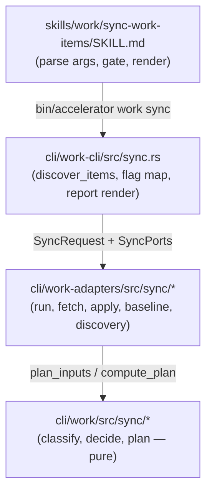

# Research: Targeted sync of specific work items (0257)

**Date**: 2026-09-06 15:00 UTC
**Author**: Toby Clemson
**Git Commit**: 7812c9bc7550459c601892d83324314c49698d04
**Branch**: ticket-management workspace (detached working copy)
**Repository**: accelerator

## Research Question

What does the codebase look like today, and where are the injection seams, for
story 0257 — adding a repeatable `--target` option to `accelerator work sync`
that reconciles only named work items (by local id, remote `external_id`, or
path), suppresses untracked-remote discovery, and reuses every per-item
full-sync behaviour unchanged?

## Summary

The change is a **narrow, well-supported extension**, not a new subsystem. Four
findings shape the plan:

1. **The engine already operates over exactly `request.items`.** Classification,
   planning, blast-radius bounds, and the per-item apply loops all iterate the
   `Vec<LocalItem>` in `SyncRequest`. Narrowing that slice scopes almost the
   whole run for free. The item set is assembled unfiltered by `discover_items`
   at `cli/work-cli/src/sync.rs:96-132`.

2. ⚠️ **Naive filtering breaks discovery.** Untracked-remote discovery
   (`run.rs:415-436`) keeps remote ids *not* present among the local items'
   `external_id`s. Shrinking `items` without gating discovery would make it
   re-import every non-targeted local item as an "untracked" remote. Targeting
   **must** suppress discovery — which the story already mandates and which maps
   cleanly onto the existing `PushOnly` skip branch at `run.rs:707-709`.

3. **The story wants the engine to own the target set; the skill only parses.**
   That points to a new `--target` field on the Rust `SyncArgs`
   (`cli/work-cli/src/cli.rs:254-283`), resolved inside the CLI wrapper before
   `SyncRequest` is built — not skill-side filtering. Every needed pattern
   already exists: repeatable flags (`--resolve`, `--tag`), fail-fast
   `<key>=<value>` validation (`parse_resolutions`), and an `external_id`
   index/canonical-key pair.

4. ⚠️ **Two reuse gaps to close.** Resolution is called **in-process** — the
   public `resolve::run` function (`cli/work-cli/src/resolve.rs:42-46`), not the
   `work resolve` subcommand or a subprocess. Its signature resolves one `input`
   at a time (loop it), and its **Path class does not enforce work-directory
   containment** (`cli/work-cli/src/resolve.rs:31-37`) — which 0257 explicitly
   requires (reject paths outside the work dir, abort with zero writes). Both
   are additive, not rewrites.

The recommended shape: add `--target` to `SyncArgs`; add a target-resolution
pass in `run_sync` (`cli/work-cli/src/sync.rs`) that resolves each token via an
in-process `resolve::run` call (local-id/path) or an `external_id` index
(remote-id), enforces local-id-wins precedence and work-dir containment, fails
fast naming offenders, filters `discover_items`' output, and passes a "targets
named" signal that suppresses discovery at `run.rs:707`.

## Detailed Findings

### Architecture: three-crate split

The sync feature is layered across the workspace's hexagonal structure
(ADR-0053, thin CLI over ports-and-adapters core):



- **Domain (`cli/work/src/sync/`)** — pure state machine: `classify` →
  `decide` → `plan`, no I/O.
- **Adapters (`cli/work-adapters/src/sync/`)** — orchestration: `run.rs` is the
  single public entry `run()`; `fetch`, `apply`, `create`, `baseline_store`
  do the I/O.
- **CLI (`cli/work-cli/src/sync.rs`)** — assembles inputs, maps flags, renders
  the TSV report; `main.rs:455` dispatches `Command::Sync`.

### The working set — the primary injection seam

**Today the set is always "all local `.md` in the work dir + discovered
remote."** There is no subset or filter notion anywhere. `SyncArgs` has no
positional/id field.

`discover_items(work_dir)` (`cli/work-cli/src/sync.rs:96-132`) reads every
`*.md`, splits frontmatter, and builds `LocalItem { id, path, external_id }`
(defined at `cli/work-adapters/src/sync/fetch.rs:25-29`), sorted by id. That
`Vec<LocalItem>` flows unfiltered into `SyncRequest.items` (`sync.rs:466-467`),
then into `fetch::gather` (`run.rs:668`) and `plan_inputs` (`run.rs:688`).

Because everything downstream — classification, `plan_inputs`, the blast-radius
gate, and all three apply loops — operates over exactly `request.items`, a
smaller slice naturally scopes the whole per-item pipeline **with zero domain
changes**.

### ⚠️ The discovery re-import trap

`discover_untracked()` (`run.rs:415-436`) computes the untracked set as *remote
ids found by `tracker.search(scope)`* minus *canonicalised local `external_id`s*
(`run.rs:421-431`):

```rust
let local: std::collections::BTreeSet<String> = items
    .iter()
    .filter_map(|item| item.external_id.as_ref())
    .map(canonical_external_key)
    .collect();
```

If `items` is narrowed to the targets but discovery still runs against the full
`scope`, every non-targeted local item's remote counterpart is no longer in
`local`, so discovery would classify it as untracked and pull it. This is the
one place a naive `items` filter is actively wrong.

The fix is already modelled: discovery is a **fully separable step**. When
`direction == PushOnly`, `prepare_run` skips the whole block and returns
`DiscoveryStatus::SkippedPushOnly` (`run.rs:707-709`). A targeted run adds a
parallel skip at the same branch, emitting a "skipped" discovery status.

### The per-item pipeline (reused unchanged)

Two enums drive per-item behaviour, both pure:

| Concern | Type / location | Key variants |
|---|---|---|
| Item state | `SyncState` (`cli/work/src/sync/state.rs:6-15`) | `Synced`, `Unsynced`, `LocallyModified`, `RemotelyModified`, `Conflict`, `RemoteAbsent`, `Indeterminate` |
| Chosen action | `Action` (`cli/work/src/sync/decide.rs:31-41`) | `Push`, `Pull`, `SkipConflict`, `SkipDirty`, `Prompt`, `Noop`, `CreateFromRemote`, `CreateFromLocal` |
| Dirtiness | `Dirtiness` (`decide.rs:16-21`) | `Clean`, `Dirty`, `Unknown` (Unknown ⇒ Dirty) |

- **Classify** (`classify.rs:105-129`): no `external_id` → `Unsynced`; else the
  `(local_changed, remote_changed)` pair maps to the four synced/modified/
  conflict states.
- **Decide** (`decide.rs:85-125`): the `(direction × state × dirty)` table.
  `LocallyModified`→`Push`; `RemotelyModified` clean→`Pull`, dirty→`Prompt`
  (bidir) or `SkipDirty`; `Conflict`→`Prompt` (bidir) or `SkipConflict`.
- **Resolution overlay** (`plan.rs:120-128`): a `--resolve` order overrides
  `Prompt` → `AcceptRemote=Pull`, `PushLocal=Push`, `Skip=Prompt`.

The two create paths (`CreateFromLocal` for unsynced push-back with
`external_id` write-back, `CreateFromRemote` for discovery) run in dedicated
loops in `run()` (`run.rs:842-874`), not the planned-action loop. The
"pushed-unsynced" write-back the story relies on is `create.rs` + the
pending-push marker for crash resumability (`apply.rs:356-388`).

### Guards, bounds, resumability (all engine-owned)

- **Blast-radius bounds** (`run.rs:741-752`): `pulls = plan.pull_count() +
  untracked.len()`, `pushes = plan.push_count() + creates_from_local.len()`;
  exceeding `max_pulls`/`max_pushes` returns `RunError::Refused` before any
  write, in **both** preview and apply. For a targeted run `untracked.len()` is
  zero (discovery skipped), so the bounds naturally see only the named items.
- **Dirty-overwrite guard**: `Dirtiness` sub-splits only `RemotelyModified`
  (`decide.rs:101-117`); probed via `WorkingCopyStatus::is_dirty`.
- **Conflict dossiers**: `build_dossiers` (`run.rs:302-315`) over `Prompt`
  items; persisted by `persist_conflict_dossiers` (`sync.rs:341-355`).
- **Baseline-last resumability**: baseline entries written last in each apply
  (`apply.rs:209-218`, `:240-249`); `finalise_run` blanks conflicted items and
  advances the timestamp atomically (`baseline_store.rs:92-111`).

None of these need changing — they already key off `request.items` and the
plan counts.

### Report rendering and the discovery line

`render_report()` (`sync.rs:192-229`) emits per-item TSV `id\taction\tstate\t
detail`, then appends the discovery line and summary. `discovery_line()`
(`sync.rs:178-190`) already emits the exact "skipped" form the story asks for:

```text
#	discovery	ran	found={n}
#	discovery	skipped	push-only
#	discovery	failed	{detail}
```

A targeted run needs a fourth detail (e.g. `#\tdiscovery\tskipped\ttargeted`)
so a targeted skip is distinguishable from the push-only skip. `DiscoveryStatus`
(`run.rs:134-144`) is the enum to extend. Golden fixture:
`cli/work-cli/tests/fixtures/sync-report.golden`.

### Resolution — call in-process, not via the subcommand

Resolution is a **public function call within the workspace, not a subprocess.**
`run_sync` lives in the `work-cli` crate, the same crate that wraps resolution,
so it calls `resolve::run` directly. The `work resolve` **binary** never enters
a sync run; the only process boundary is the tracker (Linear) API.

Two entry points, both public:

- **Adapter** `run()` (`cli/work-cli/src/resolve.rs:42-46`):
  `pub fn run(start: &Path, config: &dyn ConfigAccess, input: &str) ->
  Result<RunOutcome, kernel::Error>`, returning `RunOutcome::Resolved(PathBuf)`
  | `Ambiguous(..)` | `NotFound(..)` | `Invalid(..)`. It already resolves the
  work dir and scheme from config and handles the Path/Invalid classes
  (`resolve.rs:55-85`). **Prefer this.**
- **Domain** `resolve()` (`cli/work/src/resolve.rs:346-357`): classifies input
  via `classify_input` (`resolve.rs:171-198`) into `Path`/`FullId`/
  `BareNumber`/`Invalid`, then searches a `DirectoryLister`. Calling it directly
  means re-plumbing the scheme, classification and lister that the adapter `run`
  supplies — avoid unless the loop-and-collect logic must be unit-tested inside
  the `work` domain crate.

The subcommand path (`main.rs:455` → `run_resolve`, `main.rs:41-89`) only adds
argv parsing and stderr/exit-code rendering (`E_RESOLVE_AMBIGUOUS`=2,
`E_RESOLVE_NOT_FOUND`=3, `E_RESOLVE_INVALID`=1, `exit_codes.rs:53-64`) — none of
which sync wants, since it renders its own report and abort.

Two gaps for 0257:

- ❌ **One `input` per call — loop, don't shell out.** `run` takes a single
  `input: &str` and returns one `RunOutcome`. Resolving N targets is an
  N-iteration in-process loop collecting failures (to honour "name all
  offenders, zero writes"), not N subprocesses. A batch entry point is needed
  only if that loop-and-collect logic should itself be unit-tested in the `work`
  domain crate.
- ⚠️ **Path class skips containment.** `resolve_path_class`
  (`cli/work-cli/src/resolve.rs:31-37`) joins the input onto the cwd,
  canonicalises, and accepts any existing file — **no check it lives under the
  work dir**. There is no negative test. **Decision (D3):** fix this inside
  `resolve_path_class` itself so containment is structural for every caller —
  canonicalise, reject with `starts_with` against the work dir, then the
  `is_file` check. This threads `work_dir` (`resolve_work_dir`,
  `cli/work-cli/src/config.rs:55-71`) into the path class, which currently only
  receives `start` (cwd), and requires a caller audit plus new negative tests in
  `cli/work-cli/tests/cli_resolve.rs`. Search classes (FullId/BareNumber) are
  already structurally confined to the work dir.

### Reusable patterns for `--target` and `external_id` lookup

| Need | Model to copy | Location |
|---|---|---|
| Repeatable plain flag → `Vec<String>` | `--tag` → `tags` | `cli/work-cli/src/cli.rs:140-141` |
| Repeatable `<k>=<v>` flag | `--resolve` + `parse_key_value` | `cli.rs:267-271`, `:113-118` |
| Fail-fast validation naming offender | `parse_resolutions` (dup detection, pre-IO) | `sync.rs:134-157`, called `:376-382` |
| Validate-all-then-act ordering | `work update` key loops before lock | `update.rs:279-284` |
| Walk work dir + read `external_id` | `discover_items` (with blank-value guard) | `sync.rs:96-132` |
| Canonical match key | `canonical_external_key` (strip ws, uppercase) | `create.rs:114-120` |
| Membership index over local items | `BTreeSet` of canonical keys | `run.rs:421-425` |

For the `external_id`→file index, combine `discover_items`' walk with
`canonical_external_key` on both sides: `BTreeMap<canonical_key, PathBuf>`. For
local-id-wins precedence, attempt local-id/path resolution first; only fall to
the `external_id` index when the token is not a valid local-id shape, and report
the suppressed remote match.

### Skill-side changes (thin)

`skills/work/sync-work-items/SKILL.md` is a thin UX layer (its split is stated
at `SKILL.md:26-31`). It parses the user's request into flags (Step 1,
`:63-81`), invokes `bin/accelerator work sync` (`:85-90`), and renders the
report (Step 5). Adding `--target` is a parsing + argument-hint change plus a
render note; the engine owns everything else. The skill already reads the
`#\tdiscovery\t…` line (`:112-115`), so a targeted "skipped" reads through
without structural change.

## Code References

- `cli/work-cli/src/sync.rs:96-132` — `discover_items`, the item-set assembly seam to filter.
- `cli/work-cli/src/sync.rs:134-157` — `parse_resolutions`, the fail-fast validation model.
- `cli/work-cli/src/sync.rs:178-190` — `discovery_line`, extend for a targeted "skipped".
- `cli/work-cli/src/sync.rs:362-477` — `run_sync`, where flags map into `SyncRequest` (target resolution goes here).
- `cli/work-cli/src/cli.rs:254-283` — `SyncArgs`, add the `--target` field.
- `cli/work-cli/src/cli.rs:113-118`, `:140-141`, `:267-271` — repeatable-flag / key-value parsing models.
- `cli/work-adapters/src/sync/run.rs:415-436` — `discover_untracked`, the re-import trap.
- `cli/work-adapters/src/sync/run.rs:707-734` — discovery gate; add the targeted-skip branch here.
- `cli/work-adapters/src/sync/run.rs:741-752` — blast-radius bound over `request.items`.
- `cli/work-adapters/src/sync/run.rs:91-107` — `SyncRequest`; may carry a "targets named" flag.
- `cli/work-adapters/src/sync/fetch.rs:25-29` — `LocalItem`.
- `cli/work-adapters/src/sync/create.rs:114-120` — `canonical_external_key`.
- `cli/work-cli/src/resolve.rs:42-46` — `resolve::run`, the in-process entry point to call from `run_sync`.
- `cli/work/src/resolve.rs:171-198`, `:346-357` — domain classification and search (behind `run`).
- `cli/work-cli/src/resolve.rs:31-37` — Path class, the containment gap.
- `cli/work-cli/src/config.rs:55-71` — `resolve_work_dir` for containment checks.
- `skills/work/sync-work-items/SKILL.md:63-90` — flag parsing + invocation template.

## Architecture Insights

- **The seam is the item slice, not the state machine.** Because the engine is
  already parameterised on `request.items`, targeting is a set-construction
  concern at the CLI boundary, not a change to classify/decide/plan. This keeps
  the byte-identical-output acceptance criterion tractable: the per-item code
  path is literally unchanged.
- **Discovery is the only coupling that fights a smaller item set.** The story's
  discovery-suppression requirement is not incidental — it is load-bearing for
  correctness, because discovery's "untracked = remote minus local" definition
  inverts when `local` is narrowed. Suppression and targeting are the same
  concern.
- **Engine-owns-the-set vs skill-parses aligns with the existing division.**
  Safety-critical logic already lives in Rust; `--resolve` is the precedent for
  a repeatable, engine-consumed, id-scoped flag validated fail-fast at the CLI
  boundary. `--target` should mirror it.
- **Containment is a pre-existing latent gap** the story surfaces. The Path
  resolve class trusts any existing file. Fixing it at the target layer (rather
  than in `work resolve` broadly) avoids changing `work resolve`'s contract and
  its passing tests.

## Historical Context

- `meta/plans/2026-08-13-0194-tracker-crate-and-remote-sync-engine.md` — the
  plan that built the full-sync engine; holds the acceptance-test structure and
  golden-run fixtures 0257 must match byte-for-byte. Highest-priority prior art.
- `meta/work/0194-tracker-crate-and-remote-sync-engine.md` (done) — built the
  push/pull/discovery state machine over the `RemoteTracker` port.
- `meta/work/0146-work-item-sync-enhancements.md` (epic) — parent; the
  scope-and-configuration model bounding discovery/creation/pulls.
- `meta/work/0220-untracked-remote-discovery-never-runs-on-linear.md` (done) +
  its plan/research — directly relevant to discovery-path behaviour and the
  suppression 0257 needs.
- `meta/work/0213-conversational-conflict-resolution-flow.md` (done) —
  introduced the conflict dossier and `--resolve` that 0257 reuses.
- `meta/decisions/ADR-0044-remote-work-item-identity-in-external-id.md` — how
  remote identity lives in `external_id`; underpins remote-id targeting and the
  pushed-unsynced write-back.
- `meta/decisions/ADR-0053-thin-cli-over-a-hexagonal-ports-and-adapters-core.md`
  — the architecture the target-set injection must respect.
- `meta/work/0051-sync-work-items-skill.md` (done) — the original skill; the
  baseline behaviour 0257 narrows.
- `meta/notes/2026-06-23-further-ideas-backlog.md:49` — the source idea.

## Related Research

- `meta/research/codebase/2026-08-12-0194-tracker-crate-and-remote-sync-engine.md`
  — sync-engine design (push/pull/discovery/conflict).
- `meta/research/codebase/2026-08-30-0220-untracked-remote-discovery-never-runs-on-linear.md`
  — discovery-path RCA.
- `meta/research/codebase/2026-08-18-0213-conversational-conflict-resolution-flow.md`
  — conflict-resolution flow.

## Resolved Decisions

All four open questions were resolved on 2026-09-06.

- ✅ **D1 — Target-set representation.** `SyncRequest` carries a single
  `selection: ItemSelection { All, Targeted(Vec<LocalItem>) }` enum. One value
  drives both item-set narrowing and discovery suppression, so the two cannot
  desync — the re-import trap is structurally unreachable. Resolution happens in
  `run_sync` (forced by the crate constraint: `resolve::run` is a `work-cli`
  function and `work-adapters` does not depend on `work-cli`); the adapter
  matches on `selection` at both the item-set and the `run.rs:707` discovery
  branch, with `Targeted` taking precedence over `PushOnly` in that match.
- ✅ **D2 — Discovery-line token.** A targeted run emits
  `#\tdiscovery\tskipped\ttargeted`, symmetric with the existing
  `#\tdiscovery\tskipped\tpush-only`. When `--push-only` and `--target` are both
  given, `targeted` wins (the narrower scoping in effect). This string is report
  contract; update `DiscoveryStatus` (`run.rs:134-144`) and the golden fixture
  `cli/work-cli/tests/fixtures/sync-report.golden`.
- ✅ **D3 — Containment fix location.** Confine the Path class inside
  `resolve_path_class` (`cli/work-cli/src/resolve.rs:31-37`), not in the sync
  target loop — making `work resolve` and every caller reject out-of-work-dir
  paths. Consequences: thread `work_dir` into the path class (it currently sees
  only `start`/cwd), and add negative tests in
  `cli/work-cli/tests/cli_resolve.rs` plus a public-API snapshot regen if any
  exported signature shifts (`cli/work/tests/fixtures/public-api.txt`).
  **Blast radius — verified safe.** The only production caller in `cli/` is
  `run_resolve` (`main.rs:41-89`), which forwards the user string unchanged; no
  other command routes through resolution (`show`/`update`/`diff`/
  `link-external-id` take a `PathBuf` from clap directly). The three skill
  callers — `review-work-item`, `create-work-item`, `update-work-item` — all
  pass **work-item references** (argument-hints "[path to work item file]",
  "[work-item-ref]"), never an intentionally out-of-work-dir path, and each
  already handles the resolver's Exit 3 by offering `/list-work-items`, so the
  narrowing degrades cleanly. No existing test encodes out-of-work-dir Path
  resolution as intended.
  ❓ **Sub-question for planning:** the error kind/message for an out-of-dir
  path — reuse `NotFound` (`E_RESOLVE_NOT_FOUND`, exit 3, which the skills
  already handle), or add a distinct "outside work directory" reason, since the
  file exists but is out of scope.
- ✅ **D4 — Ambiguity and abort aggregation.** An ambiguous local-id target
  aborts like not-found/invalid — it does **not** fall through to the
  `external_id` lookup (local-id-wins keeps it in the local space). The run
  validates **every** target first, then aborts naming all offenders (with
  candidate lists for ambiguous ones), zero writes — honouring the story's
  plural "target(s)". This is a collect-all abort, unlike the existing
  first-error `parse_resolutions`; the target-resolution loop accumulates
  failures rather than returning on the first.

## Open Questions

- ❓ **D3 error kind** (carried from above) — `NotFound` reuse vs a distinct
  "outside work directory" reason and exit code. A planning-time detail, not a
  blocker.
