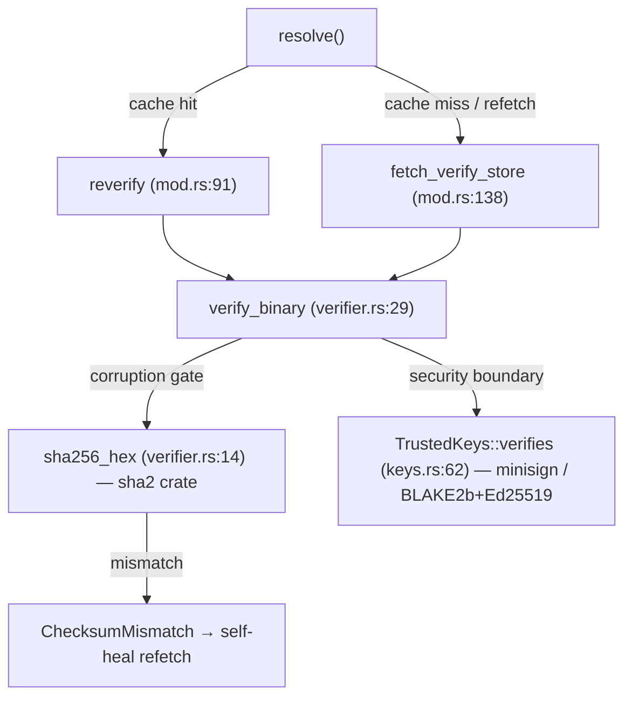

# Research: Close the sha2 hardware-intrinsics gap (0216)

**Date**: 2026-09-10T21:30:58+00:00
**Author**: Toby Clemson
**Git Commit**: ad7f27c964b9285c64b68079cb31c2de1448a002
**Branch**: HEAD (detached; jj working copy)
**Repository**: accelerator (workspace: `visualisation-system`)

## Research Question

Establish the live codebase state that work item 0216 acts on: how the launcher's
`verifier::sha256_hex` is implemented and reached, how the `sha2` dependency is pinned and
resolved, whether the committed measurement harness reports the term the acceptance criteria
gate on, and how the four shipped targets are built — so the enablement of the ARMv8 SHA-2
hardware backend can be planned against facts, not the assumptions in the brief.

## Summary

The brief is accurate on the core mechanism and understates the blast radius. `sha2 = "0.10"`
is pinned at the workspace level with **no features** (`cli/Cargo.toml:76`), so the portable
`soft` backend compiles; `sha2-asm` is absent from the lockfile. The 0.11 remedy is favoured by
the evidence — 0.11.0 is already resolved transitively, its MSRV (1.85) sits under the pinned
toolchain (1.90.0), and it is runtime-detected, so it needs no `-C target-feature=+sha2`.

Four findings change the shape of the work:

- **The backend switch is crate-global, not one call site.** Seven SHA-256 sites use the `sha2`
  crate on the launcher dispatch path (`sha256_hex` plus six streaming/`launcher_id` sites under
  `tree/` and `main.rs`), and the visualiser server is a second first-party consumer. All benefit
  at once; none is a separate opt-in.
- ⚠️ **The reproducibility acceptance criterion rests on a false premise.** `RELEASING.md:237-238`
  states the cross-compiled binaries are **not** byte-reproducible. AC 4 as written asks to prove a
  property the artefacts do not have. What the bump can actually perturb is `vendor_shim_marker_digest`
  — and that hashes `cli/verify`'s closure, which uses `minisign-verify` only, not `sha2`.
- ⚠️ **The harness reports latency, not throughput.** `warm_terms.rs` emits `verifier::sha256_hex`
  `median_ms`; `tasks/measure.py` never even ingests the `asset_bytes` line, and no measurement JSON
  records the asset size. AC 1's MB/s gate is a manual `asset_bytes ÷ median_ms` division against a
  size obtained separately.
- ⚠️ **The 0216→0217 measurement hand-off is one-directional.** 0217 carries no reference to 0216 and
  specifies a generic warm-dispatch calibration keyed on `(architecture, SHA-extension support, libc)`
  — not the sha2-backend before/after. The aarch64-musl throughput number could fall between the two items.

The committed harness the brief depends on (`cli/launcher/tests/warm_terms.rs`) **does exist** in the
live tree and reports the term separately — resolving the review's one residual concern, even though no
work item is recorded as having landed it.

## Detailed Findings

### The verifier and its call sites

`sha256_hex` is a one-shot hex encoder over the whole slice it is handed, using
`sha2::{Digest, Sha256}` (`verifier.rs:14-21`). Its only production caller is `verify_binary`
(`verifier.rs:29-50`), which computes the digest, compares it to the expected SHA, then runs the
minisign check — SHA-256 is the corruption gate, minisign (`TrustedKeys::verifies`) the security
boundary.

`verify_binary` is reached from both dispatch paths in `resolve/mod.rs`:

- **Warm cache-hit** — `reverify` (`mod.rs:91-110`) reads the cached bytes back and checks them
  against the SHA baked into the cache filename. Invoked on every hit (`mod.rs:199`); a mismatch
  triggers a self-healing refetch.
- **Cold resolve** — `fetch_verify_store` (`mod.rs:138-178`) checks freshly fetched bytes against
  the signature-verified manifest entry (`mod.rs:161`).

### The sha2 backend switch is crate-wide

`sha256_hex` is one of seven `sha2`-crate SHA-256 sites on the dispatch path. Because the crate
selects its backend globally at compile time, enabling the ARMv8 path accelerates all of them, plus
the off-path consumers.

| Site | Location | Shape | Path |
|---|---|---|---|
| `sha256_hex` | `verifier.rs:14` | one-shot | warm + cold binary check |
| `digest_file` | `tree/download.rs:78` | streaming 64 KiB | cold archive digest |
| `load_and_check_table` | `tree/resolver.rs:849` | one-shot | signed file-table check |
| per-member extract | `tree/extract.rs:335` | streaming | cold per-file check |
| `file_digest` | `tree/resolver.rs:1054` | one-shot | warm verify/repair walk |
| `launcher_id` | `main.rs:307` | one-shot (8-byte prefix) | per-install claim id |
| server etags | `server/file_driver.rs:508`, `templates.rs:110` | one-shot | visualiser responses |

No first-party BLAKE2b exists. It appears only inside `minisign-verify` (vendored `blake2b.rs`,
prehash for its signatures) and `jj-lib` (`blake2 0.10.6`, transitive). The launcher reaches BLAKE2b
only implicitly, through minisign's prehashed-signature mode (`keys.rs:74`, `verifies_stream`).

### The sha2 dependency graph

`sha2` is pinned `"0.10"` with default features only in two independent places, so the `asm`
feature is off everywhere and the `soft` backend compiles:

- `cli/Cargo.toml:76` — `[workspace.dependencies]`, inherited by six member crates via
  `sha2 = { workspace = true }` (launcher, work-adapters, jira-client, design-adapters,
  remote-projection).
- ⚠️ `cli/visualiser/server/Cargo.toml:49` — the **server declares its own literal** `sha2 = "0.10"`
  rather than inheriting the workspace pin. A workspace bump to 0.11 leaves the server on 0.10 unless
  this literal moves too.

The lockfile already carries both versions: `sha2 0.10.9` (six first-party crates,
`Cargo.lock:4328`) and `sha2 0.11.0` (transitive, only via `rust-embed-utils 8.12.0`,
`Cargo.lock:4339`). `sha2-asm` is absent entirely. A 0.11 bump of **both** the workspace pin and the
server literal collapses the first-party duplication onto the version `rust-embed` already pulls,
net-reducing duplication rather than adding it.

MSRV is `1.90.0` (`cli/Cargo.toml:48`), and the toolchain is pinned to `1.90.0` via `mise.toml:8`.
`sha2` 0.11's 1.85 MSRV clears both. No `rust-toolchain.toml` exists.

### The measurement harness reports latency

`cli/launcher/tests/warm_terms.rs` is an `#[ignore]`d libtest test (`warm_terms_are_reported`) that
times four terms over `SAMPLES = 200` iterations and prints one JSON line each: `cache::find`,
`reverify` (composite), `verifier::sha256_hex`, and `TrustedKeys::verifies`, followed by a bare
`{"asset_bytes":<len>}` line. `verifier::sha256_hex` **is** reported as a standalone term
(`warm_terms.rs:139-143`), timed in isolation over the cached `vcs` sub-binary read once before the
loop.

Two mechanics matter for AC 1 and AC 5:

- **No throughput is computed.** The harness emits `median_ms` and a p2.5/p97.5 band per term. MB/s
  is a post-hoc `asset_bytes ÷ median_ms` division (decimal MB = 10⁶), which the docs never spell out
  as a formula.
- **The size is not captured.** `tasks/measure.py`'s `parse_term_report` (`measure.py:2645`) ingests
  only lines containing `"term"`, so the `asset_bytes` line is emitted but dropped. Neither
  `warm-dispatch-3.json` nor `-4.json` records any single-asset byte size — only whole-cache totals.
  To convert to MB/s, `stat` the dispatched sub-binary separately.

Invocation is `cargo test --release --manifest-path cli/Cargo.toml -p accelerator --test warm_terms
-- --ignored --nocapture` with three env vars (`ACCELERATOR_MEASURE_CACHE_ROOT` and
`_VERSION` required, `_SUBBINARY` defaulting to `vcs`), driven by `mise run measure:warm-dispatch`
(`measure.py:2606-2637`).

### Recorded baselines

The current soft-backend baseline is stable across the two most recent gating runs, on an Apple
M4 Max / macOS 26.3 host with `jj 0.43.0` and RNG seed `20260813`:

| Term | warm-dispatch-4 median (ms) | warm-dispatch-3 median (ms) |
|---|---|---|
| `verifier::sha256_hex` | 4.3399 | 4.3268 |
| `reverify` | 6.2063 | 6.0487 |
| `TrustedKeys::verifies` | 1.6765 | 1.6483 |

At the 0205 canonical asset size of 2,493,792 bytes, 4.34 ms ≈ 575 MB/s — the soft-backend band, a
touch faster than 0205's own 4.4895 ms / 555 MB/s. ⚠️ Both runs record `calibration.holds: false`
("uncalibrated for this host"), because the 0205 session logged no bash/shasum to calibrate against.
The `digest_backend_cross_check` fields in these JSONs compare the shell guard's external
`sha256sum` vs `shasum` tools — **not** the in-process Rust `sha2` backend; do not conflate them.

Converting AC 1 to the term the harness reports: over 2,493,792 bytes, the ≥1,390 MB/s floor is a
`verifier::sha256_hex` median **≤ ~1.79 ms**; the ~2,000 MB/s expectation is **~1.25 ms**. A result
still near ~4.3 ms means the soft backend is still selected.

### The four-target build

Cross-compilation is driven entirely by `cargo zigbuild --release --target {triple}` in the Python
invoke tasks (`tasks/build.py:440` for the CLI, `:375` for the server). The four triples are
enumerated once in `tasks/shared/targets.py:8-13` and imported everywhere.

⚠️ **There is no `.cargo/config.toml`, no `rust-toolchain.toml`, and no active RUSTFLAGS /
`target-feature` / `target-cpu` anywhere in the tree.** The only release codegen tuning is
`[profile.release]` `strip = true`, `lto = "thin"` (`cli/Cargo.toml:216`). This makes AC 3's
"evidence no `-C target-feature=+sha2` is set for musl" trivially satisfiable — nothing sets it today
— and means both remedies must work without a cargo config that does not exist. musl is cross-built
with `cargo-zigbuild` + `ziglang` (pinned in root `pyproject.toml:20-21`); there is no `cross`,
`Cross.toml`, or Docker.

### Reproducibility and cargo-deny

🔴 `RELEASING.md:237-238` states the cross-compiled binaries are **not** byte-reproducible; only the
assembled vendored-runtime archives are deterministic, pinned by sha256 in `pins.toml`. AC 4's
"two clean rebuilds produce byte-identical outputs" is therefore not a property the binaries have to
begin with — a `sha2` bump cannot regress it. The one determinism artefact the bump could touch is
`vendor_shim_marker_digest` (`tasks/build.py:538`), which hashes `cli/verify`'s source plus the
`minisign-verify` pin and its lockfile closure. `cli/verify` uses `minisign-verify` only, not `sha2`
(`cli/verify/src/main.rs`), so the marker should be unaffected — worth asserting during the change.

cargo-deny runs `check advisories licenses bans sources` from `cli/` against `cli/deny.toml`
(`tasks/deny.py`, `mise lint:cli:deny`). ❓ The `bans` posture toward the existing 0.10.9/0.11.0
duplication was not read in this pass — the plan should confirm whether `deny.toml` currently skips
or allows it, and record that the 0.11 bump reduces first-party duplication.

## Code References

- `cli/launcher/src/launch/outbound/resolve/verifier.rs:14-21` — `sha256_hex` (one-shot `Sha256::digest`)
- `cli/launcher/src/launch/outbound/resolve/verifier.rs:29-50` — `verify_binary` (SHA gate + minisign)
- `cli/launcher/src/launch/outbound/resolve/mod.rs:91-110` — `reverify` (warm cache-hit path)
- `cli/launcher/src/launch/outbound/resolve/mod.rs:138-178` — `fetch_verify_store` (cold path)
- `cli/launcher/src/launch/outbound/resolve/keys.rs:62-69` — `TrustedKeys::verifies` (minisign)
- `cli/launcher/src/launch/outbound/resolve/tree/download.rs:78-98` — streaming archive digest
- `cli/launcher/src/main.rs:307-320` — `launcher_id` (Sha256 of exe path)
- `cli/Cargo.toml:76` — `sha2 = "0.10"` workspace pin (no features)
- `cli/visualiser/server/Cargo.toml:49` — server's independent `sha2 = "0.10"` literal
- `cli/Cargo.lock:4328,4339` — `sha2 0.10.9` and `0.11.0` blocks
- `cli/launcher/tests/warm_terms.rs:139-143` — the `verifier::sha256_hex` timed term
- `tasks/measure.py:2606-2657` — harness invocation and `"term"`-only parsing
- `tasks/build.py:440` — `cargo zigbuild --release --target {triple}`
- `tasks/shared/targets.py:8-13` — the four-triple single source of truth
- `RELEASING.md:237-238` — binaries not byte-reproducible; archives are
- `tasks/build.py:538` — `vendor_shim_marker_digest`
- `cli/deny.toml`, `tasks/deny.py` — cargo-deny config and driver

## Architecture Insights

The verifier deliberately pairs a cheap corruption check (SHA-256) with the real security boundary
(minisign / Ed25519 over a BLAKE2b prehash). 0205's inversion — sha256 at 555 MB/s losing 2.6× to
minisign's BLAKE2b at 1,451 MB/s over the same bytes — is a property of the `soft` backend on this
chip, not of the algorithms; enabling intrinsics is expected to restore the assumed ranking.

Backend selection is a crate-global compile-time property here, so the "gap" is a single
dependency-declaration decision with repo-wide effect, not a per-call-site optimisation. The 0.11
route trades a compile-time feature (`asm` on 0.10, which would pull `sha2-asm` and needs care on
musl) for runtime CPU detection via `getauxval`/HWCAP — musl-safe under `crt-static` without global
target flags, which is why the brief and the evidence both favour it.

The measurement stack is calibration-gated and heavy for the full B-vs-G dispatch ratio (dual
quietness evidence, instrument-floor gates, pinned `jj`, `LC_ALL=C`, clean tracked-path diff,
release-fetched binary, ≤3 abort-retry attempts, 1,700 + 900 sample blocks). The `verifier::sha256_hex`
term 0216 needs, by contrast, is an in-process 200-sample microbenchmark — a much lighter thing than
the subprocess-pair protocol, though host quietness still matters for a clean before/after.

## Historical Context

- `meta/work/0205-close-the-warm-dispatch-measurement-method.md` — first measured 555 MB/s vs
  openssl 1,708 MB/s and recorded the BLAKE2b inversion, all over 2,493,792 bytes; used a throwaway
  `spike_0205_warm_terms.rs` (since removed), not today's committed harness.
- `meta/plans/2026-08-11-0189-warm-dispatch-latency-measurement.md` — the reproducible measurement
  protocol and gating preconditions; names `mise run measure:warm-dispatch` as the committed hand-off.
- `meta/work/0217-measure-warm-dispatch-on-linux.md` — the linux measurement item; keys `reverify`
  ms-per-MB on `(architecture, SHA-extension support, libc)` but carries no reciprocal reference to 0216.
- `meta/reviews/work/0216-close-the-sha2-hardware-intrinsics-gap-review-1.md` — three-pass review,
  final APPROVE; settled AC 1 on the ≥2.5×-baseline floor (~1,390 MB/s) and left one residual: the
  harness is not attributed to a producing work item.
- `meta/measurements/warm-dispatch-3.json`, `warm-dispatch-4.json` — recorded soft-backend term
  medians (~4.33 ms `verifier::sha256_hex`); no asset size persisted; `calibration.holds: false`.
- `meta/decisions/ADR-0057-browser-automation-as-a-glibc-only-capability.md` — the glibc-vs-musl
  capability split context.

## Related Research

- `meta/research/codebase/2026-08-22-0191-batch-shim-hashes.md` — the sibling warm-path hashing lever.
- `meta/research/codebase/2026-08-11-0189-once-per-dispatch-cache-root-probe-guarantee.md` — the
  warm-dispatch cluster's probe-guarantee research.
- `meta/research/codebase/2026-07-03-0164-launcher-and-git-style-dispatch.md` — origin of the
  verifier/dispatch path.

## Open Questions

- ❓ **AC 4 reframe.** The binaries are already not byte-reproducible (`RELEASING.md:237-238`), so what
  does the reproducibility criterion actually verify — that `vendor_shim_marker_digest` is unchanged,
  and that the assembled-archive `pins.toml` sha256s are unaffected?
- ❓ **Server pin.** Should the 0.11 bump move both `cli/Cargo.toml:76` and the server's independent
  `cli/visualiser/server/Cargo.toml:49` to fully collapse the 0.10.9/0.11.0 duplication?
- ❓ **cargo-deny `bans`.** Does `cli/deny.toml` currently skip or allow the sha2 duplication, and does
  the bump satisfy `bans` cleanly?
- ❓ **0217 hand-off.** The aarch64-musl throughput evidence 0216 defers to 0217 is unstated on 0217's
  side — should 0217 gain an explicit sha2-backend measurement requirement, or should 0216 scope its
  own darwin-only figure and drop the linux dependency?
- ❓ **MB/s derivation.** Should the harness or `measure.py` be taught to persist `asset_bytes` so the
  AC 1 throughput figure is captured rather than hand-divided?

## Follow-up: Open-question resolutions (2026-09-10)

A decision pass resolved all five open questions. Each resolution below is the agreed disposition, not
a further finding.

| Question | Decision | Consequence |
|---|---|---|
| AC 4 reframe | Reframe to real checks | AC 4 becomes: cargo-deny clean, lockfile-duplication effect recorded, `lint:vendor-shims:check` passes unchanged (or shims regenerated + committed). Drop the byte-identical binary rebuild — a property the artefacts do not have. |
| Server pin | Bump both; server to workspace pin | `cli/Cargo.toml:76` → 0.11 **and** `cli/visualiser/server/Cargo.toml:49` → `sha2 = { workspace = true }`. First-party duplication collapses onto a single 0.11 pin. |
| cargo-deny | Global `multiple-versions = "deny"` in 0216 | ⚠️ Scope expansion: 0216 now carries a workspace-wide duplicate audit — resolve or `skip`/`skip-tree` every existing duplicate with justification, land cargo-deny clean under the stricter setting. |
| 0217 hand-off | Make 0217 reciprocate | 0216 stays darwin-scoped. 0217 gains an explicit aarch64-musl `verifier::sha256_hex` criterion keyed on SHA-extension support, a `work-item:0216` dependency, and a run-after-0216 note. |
| MB/s capture | Persist `asset_bytes` in 0216 | `measure.py` captures the `asset_bytes` line into the measurement JSON; document the `asset_bytes ÷ median_ms` derivation. MB/s stays out of the per-term schema to preserve the latency contract. Serves both 0216's darwin before/after and 0217's musl figure. |

The load-bearing consequence is the cargo-deny decision: it turns 0216 from a scoped backend switch into a
switch plus a tree-wide no-duplicates cleanup. The AC set and any implementation plan must budget for the
audit, not just the `sha2` bump.
