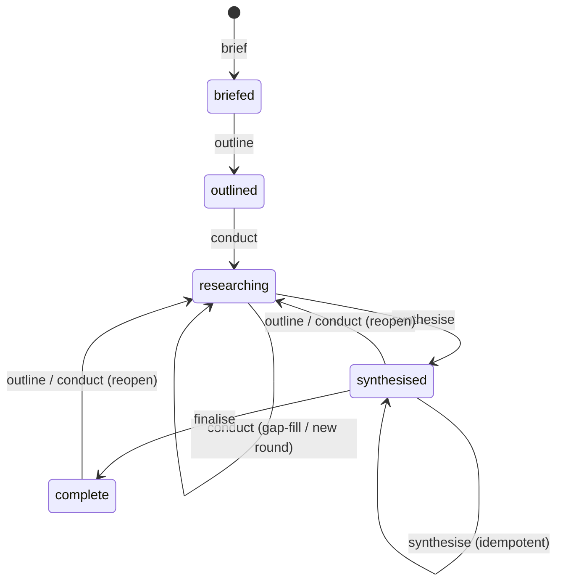

# Research: Implementing story 0279 — Iterative Accretion and Finalise

**Date**: 2026-09-19T15:56:33+00:00 (UTC)
**Author**: Toby Clemson
**Git Commit**: f13d0e60ef0cfd42595d3947c3086c1d57878422 (jj working-copy commit; detached HEAD)
**Repository**: accelerator

## Research Question

What does the codebase look like today for implementing story 0279
(*Iterative Accretion and Finalise*), Slice 2 of the topic-research skillset?
Specifically: where does the work land, what contract and machinery already
exist from Slice 1 (0277) and the 0278 collapse, what has to change, and what
existing patterns should the new behaviour be modelled on?

## Summary

**0279 is a pure `SKILL.md` verb-logic slice. The frontmatter contract it
needs already landed with 0278 — no Rust, schema, template, or fixture-vocab
change is required.** The single file that changes is
`skills/research/research-topic/SKILL.md`; everything else is verification
scaffolding.

Three facts drive that conclusion:

- **The schema already admits all five states.** The `(topic-research,
  manifest)` row's `status_vocab` is
  `["briefed", "outlined", "researching", "synthesised", "complete"]` —
  provisioned for forward-compatibility by 0278's manifest-status collapse
  (`cli/corpus/src/frontmatter_validation/schema.rs:189-203`). `rounds_covered`
  already exists on the synthesis template and its schema row; `round` already
  exists on the finding row. 0279 writes values the contract already accepts.
- **All status transitions are hand-edited YAML in the skill.** No `accelerator
  corpus` subcommand mutates a manifest — the CLI only resolves, derives
  provenance, fetches templates, and validates after the fact. `finalise` and
  reopen-regression are the skill editing `manifest.md` in place.
- **0277 deliberately parked the re-invocation tests for 0279.** Finding
  immutability and gap-detection are asserted-but-not-exercised in Slice 1; the
  criteria that re-run a verb over an existing set are 0279's to write.

The verb-level deltas over the shipped 0277 engine:

| Verb | 0277 today | 0279 change |
|---|---|---|
| `outline` | Writes `## Round 1`; precond `status: briefed` | Append `## Round N+1` when highest round conducted, else revise in place; relax precond + reopen-regress |
| `conduct` | Hardcodes injected `round 1`, `round_count: 1`; precond `status: outlined` | Inject real round N; derive `round_count` from findings; gap-only across rounds; reopen-regress |
| `synthesise` | Sets `synthesised`, flips `primary` | Wholesale rewrite; stamp `rounds_covered = round_count`; keep `primary` on reopen |
| `finalise` | **Absent** | New verb: refuse unless `synthesised`, else set `complete` |

⚠️ Staleness stays **derived, not stored** — the `finalise` gate is the single
condition `status == synthesised`. Do not add a `stale` field; that would
reintroduce the dual source of truth the 0278 collapse removed.

## Detailed Findings

### The artifact contract already supports 0279 (no schema work)

The five topic-research templates are flat files at
`templates/topic-research-{manifest,brief,outline,finding,synthesis}.md`,
resolved at runtime by `accelerator config template topic-research --kind <k>`
(`cli/launcher/src/config_command/core/template.rs:26-50`). Two fields matter
for 0279 and **both already exist**:

- **Manifest `status`** carries the five-state comment `briefed | outlined |
  researching | synthesised | complete` (`templates/topic-research-manifest.md:8`),
  matching the schema `status_vocab`
  (`cli/corpus/src/frontmatter_validation/schema.rs:194-200`).
- **Synthesis `rounds_covered`** is present, default `1`
  (`templates/topic-research-synthesis.md:10`); it is the synthesis row's one
  required extra (`schema.rs:231-239`).

The schema is a compiled-in Rust constant `SCHEMA: [SchemaRow; 18]`
(`schema.rs:19-240`), mirrored by `templates-schema.tsv` and kept in lockstep by
a unit test (`schema.rs:436-485`). Validation matches a document to its row by
the document's own `type` + `kind` frontmatter (`mod.rs:204-228`), then
`check_status` requires a non-empty `status` to be in the row's vocab, emitting
`BadStatus` otherwise (`mod.rs:307-321`). Extras are presence-checked only —
there is **no numeric or value check** on `round_count`, `finding_count`,
`round`, or `rounds_covered` (`mod.rs:371-386`), so their correctness is the
skill's responsibility, verified by fixtures rather than the validator.

⚠️ **One cross-language coupling to leave alone.** The manifest vocab is
rendered into `cli/corpus/tests/fixtures/topic-research-status-vocab.json`,
read by the frontend `lifecycle-*` chip map and pinned by a test
(`schema.rs:327-351`). Because 0279 changes no vocab, this fixture needs no
regeneration — but any future vocab edit does.

### The shipped 0277 engine and where each verb transitions status

`skills/research/research-topic/SKILL.md` is the whole engine: one skill,
four verbs dispatched on argument, **breadth 8 / depth 1** hardcoded
(`SKILL.md:44-49`). The governing discipline, which every 0279 transition must
preserve (`SKILL.md:204-217`): write and validate content **first**, edit
`manifest.md` as the **final step**, re-validate the manifest after each
in-place edit; reconcile `finding_count` to findings actually on disk.

The current linear state machine and its strict preconditions
(`SKILL.md:63-73`):

- `outline` requires `status: briefed`.
- `conduct` requires `status: outlined` and an outline with ≥1 focus area.
- `synthesise` requires ≥1 finding.

Per-verb transitions as they stand:

- **`brief` → `briefed`** (`SKILL.md:98-107`): atomic set creation under a
  `.<slug>.tmp/` sibling, rename in, counts 0, `primary: brief.md`. Mirrors
  `inventory-design`.
- **`outline` → `outlined`** (`SKILL.md:117-118`): writes `## Round 1`, then
  flips status last. The cleanest content-first/manifest-last template.
- **`conduct` → `researching`** (`SKILL.md:120-164`): reconciles against disk
  first (flip checkbox of any focus area whose finding exists and validates,
  repair a stale manifest), refuses to overwrite an existing finding path,
  spawns one `researcher` per outstanding area, quarantines invalid findings to
  a dot-prefixed `.invalid` marker, then sets `round_count: 1` and
  `finding_count` = retained-validated count. Injects `round 1` into each
  researcher prompt (`SKILL.md:140`, `163-164`).
- **`synthesise` → `synthesised`** (`SKILL.md:166-177`): writes `synthesis.md`
  inline (spawns nothing), anti-changelog discipline, then flips status and
  `primary → synthesis.md` together as the crash-safe final step.

⚠️ Two hazards 0279 inherits, both still open (`SKILL.md:219-226`): the
`conduct` write-scope assertion is deferred (compensating control is human
commit review), and the full loop is **WebFetch-coupled** — do not run it
unattended against live web. Full-loop verification is manual and coupled to
external site availability.

### The five-state lifecycle and reopen regression 0279 adds

The design is fixed and consistent across the epic table (`0121:103-112`), the
0277 work item (`0277:220`), and 0278 (`0278:348-349`, `0278:384`): `complete`
and reopen-regression are 0279's exclusive deliverable on top of the vocab
0278 provisioned. Load-bearing rules for the implementer:

- **Reopen regresses to `researching`.** `outline` or `conduct` on a
  `synthesised` or `complete` set returns it to `researching` — that regression
  *is* the staleness mark; no `stale` field exists (`0121:112`,
  work item AC lines 123-131).
- **`finalise` refuses any non-`synthesised` set**, covering both an absent
  synthesis (never reached `synthesised`) and a stale one (regressed to
  `researching`); it exits non-zero naming the current status and mutates
  nothing (work item AC lines 128-131).
- **`primary` stays on `synthesis.md` once a dossier exists.** A reopen keeps
  `synthesis.md` as the landing document until the next `synthesise` overwrites
  it (work item AC lines 136-140; `0121:96`).

The preconditions in the Shared Preamble must widen accordingly: `outline` from
`briefed`/`outlined`/`synthesised`/`complete`; `conduct` from
`outlined`/`researching`/`synthesised`/`complete`; `finalise` from
`synthesised` only. The strict linear list at `SKILL.md:63-73` is the exact
text to rewrite.

### round_count / finding_count / rounds_covered / primary semantics

The manifest counters are **derived from disk, never counters incremented
blind** — this is the subtlety in the accretion criteria:

- **`round_count`** = the highest `round` stamped on any finding on disk (work
  item AC lines 95-102, Technical Note lines 184-192). Consequence: only
  `conduct` can advance it, by landing findings in a newly appended round; a
  gap-fill `conduct` within an existing round leaves it unchanged; `outline`
  never advances it (a `## Round N` heading is a pending plan until findings
  land). 0277 hardcodes `round_count: 1` (`SKILL.md:160-162`) — 0279 replaces
  that with the derivation.
- **`finding_count`** = count of retained, validated finding files on disk,
  excluding dead researchers and quarantined invalids (`SKILL.md:160-164`;
  `0277-plan:1013`). Already correct in 0277; 0279 keeps it accurate across
  rounds.
- **`rounds_covered`** (synthesis) = stamped equal to `round_count` on each
  `synthesise` (work item AC lines 103-108). Reader-facing provenance and a
  corroborating staleness check (a finding whose `round` exceeds
  `rounds_covered` confirms staleness) — never the authoritative gate.
- **`primary`** tracks whether a dossier exists at all, not whether it is
  fresh; `synthesise` flips it once and nothing flips it back (Technical Note
  lines 193-196).

The round number also flows into `conduct`'s researcher spawn: `round` is an
injected value the finding-outputter writes into the finding template's `round:`
slot (`skills/research/outputters/finding-outputter/SKILL.md:27,35-37`;
`templates/topic-research-finding.md:10`). 0279's `conduct` must inject the
real round N (the highest pending `## Round N`) rather than the constant `1` —
a wording change in the same spot, not new machinery.

### `finalise` and reopen must be hand-edited YAML (no CLI mutator)

The entire `accelerator corpus` surface is `Adr | Metadata | Linkage |
Frontmatter | Resolve` (`cli/corpus-cli/src/cli.rs:17-51`), all read-only:
`resolve` prints a path, `metadata derive` prints provenance, `frontmatter
validate` prints violations. **Nothing writes a manifest**
(`cli/corpus-adapters/src/metadata.rs:205-210` states the skills copy
provenance into frontmatter themselves). So 0279's role for the CLI is
unchanged from 0277: resolve the set root, derive provenance, fetch templates,
and validate the hand-edited result — which will reject any status outside the
five-state vocab.

`corpus resolve --type topic-research` returns the **set directory** (not a
file), because `topic-research` is a nested-manifest type
(`cli/corpus/src/doc_type.rs:165-171`), and tolerates a bare slug, the set dir,
or a sub-document path (`cli/corpus/src/resolve.rs:57-159`). `finalise` uses it
exactly as the other slug-taking verbs do (`SKILL.md:53-62`).

### Patterns to model the new behaviour on

Three existing skills give the shapes to copy:

- **`finalise` ≈ `synthesise`'s final flip + `review-adr`'s guarded table.**
  Mirror `synthesise`'s crash-safe "validate first, flip status as the final
  step" framing (`SKILL.md:175-177`) — but `finalise` writes no content, only
  the gate and the flip. `review-adr` supplies the guarded-transition-table and
  terminal-state-refusal wording to imitate
  (`skills/decisions/review-adr/SKILL.md:75-102`, `238-247`): read status
  first, refuse when the precondition fails, edit only status/metadata.
- **Reopen-regression ≈ `create-adr`'s in-place status-only edit.** "Read
  status → verify precondition → edit ONLY the status field in place, touch
  nothing else" (`skills/decisions/create-adr/SKILL.md:193-201`). The same
  shape as `inventory-design`'s idempotent supersede sweep
  (`skills/design/inventory-design/SKILL.md:321-326`), whose
  "authoritative-even-on-partial-failure" framing suits reopen.
- **Gap-detection ≈ `conduct`'s existing checkbox reconciliation.**
  Finding-existence is ground truth; only a finding that exists *and* validates
  flips its checkbox (`SKILL.md:122-124`, `149-158`). 0277 already does this
  within Round 1; 0279 generalises the same loop across rounds. This is
  extension, not new invention.

### Test strategy: mirror 0277's phasing; 0279 owns the re-invocation tests

0277 was built in seven independently-mergeable, red-green-refactor phases,
each ending green on `mise run test` + `mise run check` (`0277-plan:168-193`).
Because the verb loop is WebFetch-coupled, behaviour is locked by **committed
fixtures + golden validation**, not live runs (`0277-plan:1077-1119`):

- A hand-authored full set is committed at
  `cli/corpus-cli/tests/fixtures/topic-research-set/` with a golden
  (`cli/corpus-cli/tests/frontmatter_goldens.rs`) that validates each member via
  explicit `corpus frontmatter validate --file`.
- Negative per-kind cases are committed tests (a `finding` with `status: draft`
  rejected; a `manifest` missing `primary`; a bogus `kind` → `UnknownKind`).

⚠️ **0279 is where the re-invocation, gap-detection, and idempotent-accretion
tests actually live** — 0277 asserted finding immutability but explicitly did
not exercise it (`0277:230-232`). The natural automated surface for 0279 is to
extend the committed fixture to a **multi-round set** (findings stamped
`round: 1` and `round: 2`, `round_count: 2`, `rounds_covered: 2`) and validate
it clean, plus negative cases. The behavioural criteria — `finalise` refusing a
stale set, reopen regressing status — are model-executed and verified
manually/co-land, since no CLI performs them. **Confirmed: there is no
`research-topic` eval suite today**, and one is deliberately out of 0279's
scope — it will be added separately. So within 0279, behavioural coverage is
the multi-round fixture golden (contract) plus manual live-web runs; the eval
suite that would automate the finalise-refusal and reopen criteria lands in a
later, separate change.

## Code References

- `skills/research/research-topic/SKILL.md` — the single file 0279 changes;
  verbs, preconditions (`:63-73`), transitions (`:98-177`), validate-every-write
  (`:204-217`), deferred hazards (`:219-226`).
- `skills/research/outputters/finding-outputter/SKILL.md:27,35-37` — how
  injected `round` lands in a finding.
- `templates/topic-research-manifest.md:8,11-13` — `status` vocab comment,
  `round_count`, `finding_count`, `primary`.
- `templates/topic-research-synthesis.md:10` — `rounds_covered` (already
  present).
- `templates/topic-research-finding.md:10` — `round` stamp.
- `cli/corpus/src/frontmatter_validation/schema.rs:189-239` — the five
  topic-research schema rows; manifest `status_vocab` at `:194-200`.
- `cli/corpus/src/frontmatter_validation/mod.rs:307-321,371-386` — status-vocab
  check and presence-only extras check.
- `cli/corpus/src/frontmatter_validation/schema.rs:327-351` — the frontend
  status-vocab fixture pin.
- `cli/corpus-cli/src/cli.rs:17-51` — the read-only corpus command surface (no
  manifest mutator).
- `cli/corpus/src/doc_type.rs:165-171` — `topic-research` is a nested-manifest
  set type; `cli/corpus/src/resolve.rs:57-159` — slug/path resolution.
- `skills/decisions/review-adr/SKILL.md:75-102` — guarded transition table.
- `skills/decisions/create-adr/SKILL.md:193-201` — in-place status-only
  regression.
- `skills/design/inventory-design/SKILL.md:321-326` — idempotent supersede
  sweep.
- `cli/corpus-cli/tests/fixtures/topic-research-set/` +
  `cli/corpus-cli/tests/frontmatter_goldens.rs` — the fixture golden 0279
  extends to multi-round.

## Architecture Insights

- **The contract leads the behaviour.** 0278 deliberately provisioned the full
  five-state vocab ahead of the verb that writes `complete`, so slices land
  contract-first, behaviour-second. 0279 is the behaviour half of a split that
  was designed to be safe to land in either order.
- **The manifest is the aggregate root; counters are projections of disk.**
  `round_count`/`finding_count` are derived from findings on disk, not
  incremented — which is what makes gap-fill vs new-round, and crash recovery,
  fall out correctly without bookkeeping. Staleness follows the same principle:
  it is derived from the lifecycle position, never stored.
- **Skills mutate, the CLI validates.** The split — skill hand-edits YAML, CLI
  is a read-only validator/resolver — means 0279's correctness is enforced by
  fixtures and manual runs, not by a type system. The 80% of the value is in
  getting the SKILL.md prose unambiguous.
- **Subagent trust boundary is inherited unchanged.** Only `conduct` spawns
  researchers (granted WebFetch/Write/Read, no Bash); `synthesise` and
  `finalise` run inline. Web content and returned summaries are untrusted data.
  0279 adds no new spawn point.

## Historical Context

- `meta/work/0121-topic-research-skillset.md` — parent epic; the canonical
  lifecycle table (`:103-112`), slice map, and terminology
  (`round`/`round_count`/`finding_count`/`rounds_covered`/`primary`, `:69-99`).
- `meta/work/0277-single-round-web-research-engine.md` — Slice 1 engine;
  establishes the four-state lifecycle and defers re-invocation tests to 0279
  (`:230-232`).
- `meta/work/0278-topic-research-visualiser-doc-type.md` — the manifest-status
  collapse: `research_status` removed, five-state vocab provisioned, `complete`
  admitted for forward-compat (`:186-198`, `:384`).
- `meta/plans/2026-09-09-0277-single-round-web-research-engine.md` — the
  seven-phase, fixture-driven test strategy 0279 should mirror
  (`:1077-1119`). ⚠️ Its `(topic-research, manifest)` row is **pre-collapse**
  (`research_status`, `status_vocab: complete`) and is superseded by the 0278
  plan — build on 0278's row, not this text.
- `meta/plans/2026-09-10-0278-topic-research-visualiser-doc-type.md` — the
  authoritative post-collapse schema row (`:437-472`).
- ADRs framing the contract: `ADR-0033` (unified base schema), `ADR-0040`
  (omit-when-empty), `ADR-0067` (kind-discriminated schema + templates),
  `ADR-0068` (flat vs nested-manifest set resolution — the direct precedent for
  a set with an aggregate-root manifest), `ADR-0042` (status-value
  reconciliation).

## Related Research

- `meta/research/codebase/2026-09-08-0277-single-round-web-research-engine.md`
  — the Slice 1 engine research this extends.
- `meta/research/codebase/2026-09-10-0278-topic-research-visualiser-doc-type-indexer.md`
  and `meta/research/codebase/2026-09-12-0278-complete-codebase-research-rename.md`
  — the 0278 doc-type/collapse research.
- `meta/research/codebase/2026-08-11-0196-design-cli-implementation-surface.md`
  — the `inventory-design` set/manifest precedent.

## Open Questions

- ❓ **Should `finalise` accept the same tolerant SLUG forms and appear in
  `argument-hint` / `allowed-tools`?** The skill's `argument-hint` and
  `allowed-tools` (`SKILL.md:8-13`) list four verbs and the read-only corpus
  commands; `finalise` needs no new tools but the hint and dispatch text must
  gain the fifth verb.
- ❓ **Does the multi-round fixture belong in `corpus-cli` fixtures or a new
  location?** 0277's single-round fixture lives in
  `cli/corpus-cli/tests/fixtures/topic-research-set/`; extending it in place
  changes the existing golden — decide whether to grow that set to two rounds or
  add a sibling multi-round fixture.
