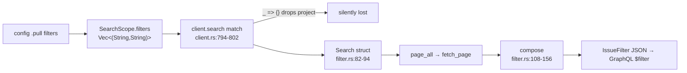

# Research: Linear Pull Filters via Catalogue-Resolved Ids

**Date**: 2026-09-22T09:46:05+00:00 (UTC)
**Author**: Toby Clemson
**Git Commit**: 15605264838ee2004161cef81988857d2c1858d1
**Branch**: anonymous jj working copy `tvumqtvsmqzp` (no bookmark; not on `main`)
**Repository**: accelerator (workspace: `ticket-management`)

## Research Question

What is the current state of every code seam work item 0292 touches, so an
implementation plan can be built on ground truth? 0292 adds a Linear `project`
pull filter, converts `label` and `assignee` from raw-name comparators to
catalogue-resolved ids, and extends init discovery to persist `projects`,
`issueLabels`, and `users` in `catalogue.json`.

## Summary

The story is buildable and its shape is sound, but three of its code-pointer
claims are inaccurate and one acceptance criterion demands machinery that does
not exist yet. The load-bearing corrections:

- **The per-tracker filter seam does not exist.** `FILTER_SCHEMA`
  (`cli/tracker-support/src/pull.rs:269`) is a single tracker-agnostic const;
  only *scope nouns* branch on `Tracker` today. Accepting `project` under Linear
  and rejecting it under Jira means introducing a `Tracker` parameter into
  filter-key validation, a seam that has no precedent in the filter path.
- **There is no typed comparator layer.** `IDComparator`,
  `EntityIdentifierIDComparator`, and `StringComparator` are Linear
  *server-side* GraphQL types — they exist nowhere in Rust. `compose` emits an
  untyped `serde_json::Value` via `json!`. The nil-UUID distinction the work
  item cites is enforced only server-side and pinned only by the id strings the
  hand-written golden fixture happens to use.
- **`write_catalogue` / `grow_catalogue` live in `cache.rs`, not
  `catalogue.rs`,** and `grow_catalogue` only ever appends to the `teams` array.
  The acceptance criterion "*init discovery **or a pull that adds a new team***
  → catalogue holds projects/labels/users" therefore requires new grow-path
  logic that is not present today.
- ✅ The public-API risk is lower than the work item implies: **`linear-client`
  has no public-API snapshot at all** (explicitly exempt). Every change inside
  that crate is off the `cargo-public-api` radar. Only `tracker` /
  `tracker-support` are pinned, and the story touches no public signature there
  (`FILTER_SCHEMA` is private).

Adding `project` correctly is a **three-edit-point change with no compiler
enforcement** binding the points together, and **no existing test would catch a
dropped `project` filter**. The `state` family (name→UUID resolution with an
`UnknownState` refusal) is the exact template for the new resolvers; the `teams`
paginator is the exact template for the three new discovery fetches.

## Detailed Findings

### 1. Filter schema and the per-tracker validation seam

The accepted filter-key set is tracker-agnostic today; the per-tracker split
covers only scope nouns.

- **`FILTER_SCHEMA` is a private const** at
  `cli/tracker-support/src/pull.rs:269-274`: a `FilterSchema { accepted:
  &["label", "state", "assignee"] }`. It carries no `Tracker` discriminator. Its
  sole use is `let accepted = FILTER_SCHEMA.accepted;` at `pull.rs:366` inside
  `validate`.
- **`FilterSchema`** (`cli/tracker/src/lib.rs:335-339`) is a one-field public
  struct (`accepted: &'static [&'static str]`) with no methods. Its public
  surface is pinned at `cli/tracker/tests/fixtures/public-api.txt:158-168`.
- **`validate(config: &PullConfig, tracker: Tracker)`**
  (`pull.rs:343-391`) short-circuits in order: scope nouns → unknown top-level
  keys → mutual exclusion → filters → ceilings. `tracker` influences only the
  scope-noun and top-level-key steps (via `accepts_noun` /
  `accepted_top_level_keys`). **The filter-key loop (`pull.rs:366-379`) takes no
  account of `tracker`** — the same three keys are accepted for both.
- **The existing per-tracker branch is `Tracker::noun(kind)`**
  (`pull.rs:295-302`): `additional_projects`/`all_projects` (Jira) vs
  `additional_teams`/`all_teams` (Linear), consulted by `accepts_noun`
  (`pull.rs:304-307`) and `accepted_top_level_keys` (`pull.rs:309-317`), and
  mirrored outside the crate in `cli/launcher/src/config_command/core/dump.rs`
  `pull_fields` (`dump.rs:83-102`). This is the pattern a per-tracker filter-key
  split must follow.
- **`PullConfigError::UnsupportedFilterKey { key, accepted: Vec<String> }`**
  (`pull.rs:82-83`) already carries the accepted set; its `detail` renders
  `accepted: label, state, assignee` (`pull.rs:120-124`). Splitting the set per
  tracker changes only the `Vec` this variant reports — no new variant needed.
- **`PullConfig.filters` is `Vec<(String, Vec<String>)>`** (`pull.rs:34`) — an
  ordered vec of `(key, value-list)` pairs, keys AND'd, values OR'd. Not a map,
  not typed fields. `parse_filters` (`pull.rs:201-216`) captures keys verbatim;
  acceptance is deferred to `validate`.
- **Two callers**: config-time in `dump.rs:135` (the `config` dump / validate
  path) and sync-time in `cli/work-cli/src/sync.rs:758` (`validate_pull_config`,
  run before discovery at `sync.rs:1138`). Both resolve the tracker via
  `Tracker::from_integration`.
- **Tests**: `an_unsupported_filter_key_is_rejected` (`pull.rs:827-839`) pins
  the exact accepted set; `an_invalid_pull_block_fails_loud_before_discovery`
  (`cli/work-cli/tests/cli_sync.rs:104-121`) proves the config refusal fires
  before discovery. A per-tracker `project` acceptance needs a new test that
  accepts `project` under Linear and rejects it under Jira.

### 2. Linear filter lowering

`compose` builds an untyped JSON object with one hard-coded arm per family;
`state` is the only family that resolves names to ids today.

- **`compose(search: &Search, states: &dyn StateResolver) -> Result<Value,
  ClientError>`** (`cli/linear-client/src/filter.rs:108-156`) inserts one entry
  per family into a `serde_json::Map` and returns `Value::Object`. Object keys
  serialise alphabetically (BTreeMap), so wire order is not part of the
  contract.
- **Cardinality split**: `comparator` (`filter.rs:160-165`) →
  `eq` (one value) / `in` (several); `ignore_case_comparator`
  (`filter.rs:170-175`) → `eqIgnoreCase` (one) / `in` (several).
- **Emitted shapes today** (confirmed against the golden fixture):

  | Family | Key | Comparator source | Single | Several |
  |---|---|---|---|---|
  | `state` | `state.id` | `comparator`, resolved to UUID | `{"eq":"state-uuid"}` | `{"in":[…]}` |
  | `label` | `labels.name` | `comparator`, raw name | `{"eq":"infra"}` | `{"in":["a","b"]}` |
  | `assignee` | `assignee.name` | `ignore_case_comparator`, raw name | `{"eqIgnoreCase":"alice"}` | `{"in":[…]}` |

  ⚠️ The work item describes `label` only in its `in` form; the single-value
  form today is `eq`, and the key is `labels` (plural). `assignee` single-value
  is `eqIgnoreCase`, not `eq`.
- **Converting `label`/`assignee` to ids** means: resolve each name→id through a
  new resolver, key under `id` not `name`, and drop `ignore_case_comparator` for
  assignee (ids are exact — `eq`/`in`). Target shapes:
  `{"labels":{"id":{…}}}`, `{"assignee":{"id":{…}}}`, mirroring the `state` arm
  exactly.
- **`StateResolver` is the template** (`filter.rs:14-27`): `resolve(name) ->
  Option<String>` returns `Some` only on exactly one match; `resolve_all`
  returns every match so a caller can tell unknown (empty) from ambiguous
  (≥2). The **`UnknownState` refusal lives in `compose`**, not the resolver
  (`filter.rs:133-135`, collected with `collect::<Result<_,_>>()?`), erroring
  `ClientError::UnknownState` (`cli/linear-client/src/error.rs:23-27`) → exit
  `SEARCH_BAD_STATE` (`cli/linear-cli/src/exit_codes.rs:166`). The new
  project/label/user resolvers must each add a trait, a `Fixed*` test double, a
  `Catalogue*` impl, a compose arm, and a dedicated `ClientError` variant.
- **Golden fixture**: `cli/linear-client/tests/fixtures/issue-filter.txt` — a
  hand-written, tab-separated `case / spec / expected-filter` table, no schema
  validator, *the* contract for the emitted shape. Extending filters means new
  rows (a `project=` row; `label`/`assignee` rows re-expressed as `id`
  comparators), using **real-shaped UUIDs for project** — the nil placeholder is
  rejected by Linear's `EntityIdentifierIDComparator`.
- **`parse_spec`** (`cli/linear-client/tests/filter.rs:42-61`) is a test-only
  DSL decoding the fixture's spec column into a `Search`; it deliberately
  mirrors the production intake in `client.rs`. Comparators (`eq`/`in`,
  `id`/`name` keying) are *not* in the grammar — they are an output of
  `compose`. Adding `project` means a `"project" => search.project = values()`
  arm here plus `Search.project`.
- ⚠️ **No typed comparator layer exists.** `IDComparator`,
  `EntityIdentifierIDComparator`, `StringComparator`, and `IssueFilter` appear
  in Rust only as GraphQL variable-type strings (`client.rs:88`, `:102`) and in
  the work-item prose. There is no `Serialize` impl and no compile-time guard
  distinguishing the two id comparators.

### 3. Catalogue and discovery

The catalogue is untyped JSON with two write paths that behave very differently;
the new sections must pick which path refreshes them.

- **On-disk model** (`cli/linear-client/tests/fixtures/catalogue.golden.json`):
  `team {id,key,name}` + `workflowStates [{id,name,type,position}]` written by
  init; a `teams [{key,id,name}]` array appended lazily by pulls. No
  `projects`/`issueLabels`/`users` today. The catalogue is read/written as
  untyped `serde_json::Value` — there are no serde structs; the new resolvers
  follow the same pattern.
- **`CatalogueStates`** (`cli/linear-client/src/catalogue.rs:28-91`) stores a
  flat `Vec<(name, id)>`, matches case-insensitively/trimmed (`normalise`,
  `catalogue.rs:70-72`), and returns `Some` only on a unique match — both
  unknown and ambiguous collapse to `None`. **`CatalogueTeam`** (singular,
  `catalogue.rs:93-160`) adds the multi-entry-array + base-fold-in pattern and a
  `catalogued()` listing. Together they are the direct template for
  `CatalogueProjects` / `CatalogueLabels` / `CatalogueUsers`.
- ⚠️ **`write_catalogue` and `grow_catalogue` live in
  `cli/linear-client/src/cache.rs`, not `catalogue.rs`** (the work item's
  pointer is wrong):
  - `write_catalogue(shape)` (`cache.rs:113-119`) is the init path — it
    **clobbers** the whole file with the `{team, workflowStates}` value from
    `discover_team`, under a lock. Called only from the init `Discover` arm.
  - `grow_catalogue(teams)` (`cache.rs:132-174`) is the pull path — a
    **read-merge-write that only appends to the `teams` array**, one entry per
    genuinely new team, preserving `team`/`workflowStates` untouched. It never
    calls `write_catalogue`. Its caller `grow_linear_catalogue`
    (`cli/work-cli/src/sync.rs:919-994`) gates the whole thing on a pull having
    imported items from a *not-yet-catalogued* team.
- **Discovery queries** are inline `const &str` in
  `cli/linear-client/src/discovery.rs` (no `.graphql` files anywhere). ⚠️ The
  two existing fetches use *different shapes*: `TEAMS` (`discovery.rs:19-24`) is
  a **workspace-scoped, Relay-paginated** top-level connection; `TEAM_STATES`
  (`discovery.rs:25-30`) is a **per-team, nested, unpaginated** `states { nodes
  }` selection. Linear's `projects` / `issueLabels` / `users` are all top-level
  workspace connections, so the three new fetches must mirror **`TEAMS`**, not
  the states selection.
- **`paginate_teams`** (`discovery.rs:74-102`) is the paginator to copy
  verbatim: init `cursor=None`, loop `send(TEAMS, {cursor})` →
  `interpret` (fail-loud on any page error) → extend from `/data/teams/nodes` →
  read `pageInfo.hasNextPage`/`endCursor` → break on `!has_next ||
  cursor.is_none()`. Each new section needs its own query const, `paginate_*`
  fn, and `/data/<field>` pointer.
- **Init entry point**: `cli/linear-cli` `Command::Init { Discover { team_id,
  force } }` → `run_init` (`cli/linear-cli/src/main.rs:382-453`) →
  `discover_team(&team_id)` → `cache.write_catalogue(&catalogue)` →
  `report_team_key_writeback`. Init never calls `grow_catalogue`.
- **Tests** use an in-process `http_test_support::MockServer` (not VCR):
  discovery (`tests/discovery.rs`), resolvers (`tests/catalogue.rs`, pure), the
  cache write-path against a `FakeFs` (`tests/cache.rs`), and CLI-level init
  scenarios (`cli/linear-cli/tests/flow_init.rs` with
  `tests/fixtures/scenarios/*.json`).

### 4. Client search intake — the three-edit-point change

Adding `project` requires three edits that the compiler will not keep in sync.

- **Edit point A — `Search` struct** (`cli/linear-client/src/filter.rs:82-94`):
  add `pub project: Vec<String>,` beside `state`/`assignee`/`label`. The
  `#[derive(Default, PartialEq, Eq)]` means every `..Search::default()` site
  keeps compiling.
- **Edit point B — the intake match** (`cli/linear-client/src/client.rs:794-802`):
  the loop over `scope.filters` has arms for `state`/`assignee`/`label`/`text`
  and a **`_ => {}` catch-all at `client.rs:800`**. ⚠️ A validated `("project",
  …)` pair falls straight through and is dropped — a silent-wrong-answer, not a
  crash. Add `"project" => search.project.push(value.clone()),`. Because the
  match is on `&str` with a catch-all, **the compiler will not flag the missing
  arm**.
- **Edit point C — the `compose` lowering block** (`filter.rs:108-156`): add an
  `if !search.project.is_empty()` arm emitting `{"project":{"id": …}}` after
  resolving names→ids. Without it, the new field never reaches the GraphQL
  filter.
- **Second consumer for free**: `search_detailed` (`client.rs:394-449`) also
  consumes `Search` and calls `compose`, so it inherits `project` once the field
  and arm land.
- ⚠️ **No existing test catches a dropped `project`.** The only intake test,
  `a_flat_filter_bag_groups_same_key_values_into_one_in_clause`
  (`cli/linear-client/tests/port.rs:287-322`), asserts only `label` and `state`.
  The `compose` family-coverage guard `the_fixture_covers_every_family`
  (`tests/filter.rs:83-101`) is pinned to exactly five families
  (`["team","state","assignee","label","text"]`) and would need `"project"`
  added. TDD order: a failing `port.rs` intake test + a new fixture row +
  `"project"` in the `FAMILIES` guard and `parse_spec`, *then* the three edits.

### 5. Supporting surface

- **Config parsing**: the `<tracker>.pull` block is parsed by
  `cli/tracker-support/src/pull.rs` (`read` at `:522`, `parse` at `:173`,
  `parse_filters` at `:201`). The `work.integration` key and the `linear.*` /
  `jira.*` sections are declared in `cli/config/src/catalogue.rs` (integration
  values `["jira","linear","trello","github-issues"]`; `EXTRA_KEYS` at
  `:131-141`). The canonical config file is `.accelerator/config.md`
  (YAML-frontmatter markdown). ⚠️ The concrete pull-filter runtime fixture
  (`config-adapters/tests/fixtures/configs/research-knobs/…`) shows as *staged*
  in the opening git status but is **absent from this working tree** — it lives
  in another jj workspace's index.
- ✅ **Public-API snapshots**: 13 `public-api.txt` files under `cli/`;
  `tasks/public_api.py` pins a specific set and **explicitly exempts
  `linear-client` and `jira-client`** as provider/adapter surfaces
  (`public_api.py:52,56`). `tracker`, `tracker-support`, and `work` are pinned;
  `work`'s snapshot has no pull entries. So `mise run public-api:update` is
  needed only if a public signature in `tracker`/`tracker-support` actually
  changes — which this story avoids.
- **Jira contrast**: Jira lowers `status`/`labels`/`assignee` to JQL in
  `cli/jira-client/src/jql.rs` (clauses joined with ` AND `, `:244`); golden
  fixture `cli/jira-client/tests/fixtures/jql-composition.txt`. Untouched by
  this story (a Jira `project` filter is explicitly out of scope).
- **Workspace layout** (`cli/Cargo.toml`): confirmed member names `tracker`,
  `tracker-support`, `linear-client`, `linear-cli`, `work`, plus `jira-client` /
  `jira-cli`. `linear-client` is the Linear provider adapter; `linear-cli`
  (`accelerator-linear`) is its CLI composition root.
- **Enforcement tasks** (`mise.toml`): `cli:check` (`:583`), `public-api:check`
  (`:596`) / `public-api:update` (`:601`), `deny:check` (`:587`), `pup:check`
  (`:591`); the last three sit outside the `cli:` roll-up (`tasks/README.md`).

### 6. Corrections and discrepancies versus the work item

| Work-item claim | Reality | Impact |
|---|---|---|
| Catalogue write lives in `catalogue.rs` (`discover_team` → `write_catalogue`) | `write_catalogue`/`grow_catalogue` are in `cache.rs`; `catalogue.rs` holds only resolvers | Plan must point at `cache.rs` |
| A pull "adds a new team" repopulates projects/labels/users | `grow_catalogue` only appends to the `teams` array; no logic refreshes other sections | New grow-path work, or drop that acceptance criterion |
| `EntityIdentifierIDComparator` / `IDComparator` are the shapes to emit | Server-side GraphQL types only; Rust emits untyped JSON, no guard | Distinction pinned only by fixture id strings |
| `label` lowers to `labels:{name:{in}}` | Single value is `eq`; key is `labels` (plural) | Fixture rows must cover both forms |
| Public-API pins `cli/tracker`, `cli/tracker-support` (not `cli/work`) | Correct — and `linear-client` is unpinned entirely | `linear-client` changes need no snapshot update |

## Code References

- `cli/tracker-support/src/pull.rs:269-274` — `FILTER_SCHEMA` private const
  (`label`/`state`/`assignee`)
- `cli/tracker-support/src/pull.rs:343-391` — `validate`; filter loop
  (`:366-379`) is tracker-independent
- `cli/tracker-support/src/pull.rs:295-317` — `Tracker::noun` / `accepts_noun` /
  `accepted_top_level_keys`, the per-tracker scope-noun seam
- `cli/tracker/src/lib.rs:335-339` — `FilterSchema` type
- `cli/linear-client/src/filter.rs:108-156` — `compose`
- `cli/linear-client/src/filter.rs:14-37` — `StateResolver` + `FixedStates`
- `cli/linear-client/src/filter.rs:160-175` — `comparator` /
  `ignore_case_comparator`
- `cli/linear-client/src/filter.rs:82-94` — `Search` struct (edit point A)
- `cli/linear-client/src/client.rs:775-812` — `search`; `_ => {}` at `:800`
  (edit point B)
- `cli/linear-client/src/client.rs:394-449` — `search_detailed` (second
  `compose` consumer)
- `cli/linear-client/src/catalogue.rs:28-91` — `CatalogueStates`
- `cli/linear-client/src/catalogue.rs:93-160` — `CatalogueTeam`
- `cli/linear-client/src/cache.rs:113-119` — `write_catalogue` (init clobber)
- `cli/linear-client/src/cache.rs:132-174` — `grow_catalogue` (pull append)
- `cli/linear-client/src/discovery.rs:19-30` — `TEAMS` / `TEAM_STATES` queries
- `cli/linear-client/src/discovery.rs:74-102` — `paginate_teams` (paginator
  template)
- `cli/linear-cli/src/main.rs:382-453` — `run_init` → `write_catalogue`
- `cli/work-cli/src/sync.rs:758` — sync-time `validate`
- `cli/work-cli/src/sync.rs:919-994` — `grow_linear_catalogue` (pull grow gate)
- `cli/linear-client/tests/fixtures/issue-filter.txt` — golden filter fixture
- `cli/linear-client/tests/fixtures/catalogue.golden.json` — catalogue shape
- `cli/linear-client/tests/port.rs:287-322` — the only intake test
- `cli/jira-client/src/jql.rs:164-244` — Jira lowering (contrast)
- `tasks/public_api.py:15-90` — pinned crates + `linear-client`/`jira-client`
  exemptions

## Architecture Insights

- **Resolve-and-refuse over match-literally.** The `state` family sets the house
  pattern: names resolve to stable ids through a catalogue snapshot, and an
  unresolved or ambiguous name aborts the whole `compose` rather than silently
  matching none or several. 0292 generalises this to project/label/assignee.
- **The catalogue is untyped-JSON by convention.** Both the on-disk file and the
  resolvers avoid serde structs, favouring `.get`/`.pointer` over a `Value`. New
  sections should match this rather than introduce typed models.
- **Two catalogue write paths with different guarantees.** Init clobbers the
  whole file (team-scoped, committed, refreshed on demand); pulls append only
  new teams under a lock. Workspace-scoped sections (projects/labels/users) fit
  the *init* model cleanly but not the *team-triggered grow* model — the pull
  refresh the work item asks for is a genuine design decision, not a mechanical
  copy.
- **Silent-drop is the recurring failure mode.** Both the intake match
  (`_ => {}`) and `compose` (a missing family) fail by producing a valid filter
  over the wrong issue set. The fixture's row-coverage guard exists precisely to
  catch the second; the first has no guard at all.
- **The provider crates are deliberately unpinned.** `linear-client` /
  `jira-client` track upstream API shape, so their surface is exempt from
  `cargo-public-api`; the stable contract sits one layer up in
  `tracker`/`tracker-support`.

## Historical Context

- `meta/work/0229-per-tracker-pull-scope-configuration.md` (**done**) — the
  direct predecessor that introduced `FilterSchema` / `validate` and the
  per-tracker scope split. Its full research→plan→review→validation→PR cluster
  is the closest prior art:
  - `meta/research/codebase/2026-09-11-0229-per-tracker-pull-scope-configuration.md`
  - `meta/plans/2026-09-11-0229-per-tracker-pull-scope-configuration.md`
  - `meta/prs/128-description.md`
- `meta/work/0048-linear-integration.md` (**done**) +
  `meta/research/codebase/2026-06-14-0048-linear-integration-apis.md` — the
  primary Linear GraphQL / `IssueFilter` research (id-vs-name comparators).
- `meta/work/0220-untracked-remote-discovery-never-runs-on-linear.md` (**done**)
  +
  `meta/research/codebase/2026-08-30-0220-untracked-remote-discovery-never-runs-on-linear.md`
  — the catalogue-state discovery fix; where `catalogue.json` / `CatalogueStates`
  history lives (no standalone catalogue doc exists).
- `meta/work/0211-integration-binaries-and-bash-cluster-retirement.md`
  (**done**) — migrated the Linear client into the `linear-client` Rust crate
  where lowering now lives.
- `meta/work/0146-work-item-sync-enhancements.md` (**draft**, parent epic) — its
  Stories entry still describes 0292 as `project.name` lowering and is stale
  (flagged in the work item's own drafting notes).
- `meta/work/0227-accelerator-config-validate-command.md` (**draft**) and
  `meta/work/0293-negated-pull-filters.md` (**draft**) — the downstream consumer
  and the follow-up that negates the id-keyed forms this story establishes.
- `meta/reviews/work/0292-linear-project-pull-filter-review-1.md` — the sole
  review of 0292, verdict **APPROVE**.

## Related Research

- `meta/research/codebase/2026-09-11-0229-per-tracker-pull-scope-configuration.md`
  — pull-scope/filter-schema plumbing (strongest direct prior).
- `meta/research/codebase/2026-06-14-0048-linear-integration-apis.md` — Linear
  GraphQL / `IssueFilter` deep dive.
- `meta/research/codebase/2026-08-30-0220-untracked-remote-discovery-never-runs-on-linear.md`
  — Linear discovery + catalogue-state handling.

## Open Questions

- ❓ **Does a team-adding pull refresh projects/labels/users, or only init?**
  The acceptance criterion says a pull that adds a new team must repopulate the
  three new sections, but `grow_catalogue` only touches the `teams` array today.
  Either `grow_catalogue` (and its `grow_linear_catalogue` caller) gains a
  workspace-section refresh, or the criterion narrows to init-only. This is the
  single largest scoping decision for the plan.
- ❓ **Where does the assignee tier precedence (email → full name → display
  name, first unique tier wins) live** — in `CatalogueUsers::resolve`, or in the
  `compose` arm? The `state` template resolves a single dimension; the
  three-tier user resolver is genuinely new behaviour with no direct precedent,
  and its collision-refuses-rather-than-falls-through rule needs its own tests.
- ❓ **Do project/label/user refusals each get a distinct `ClientError` variant
  and exit code**, mirroring `UnknownState` → `SEARCH_BAD_STATE`, or share one?
  Distinct variants give sharper operator messages at the cost of more
  `exit_codes` wiring.
- ❓ **Is the `catalogue.json` schema versioned?** A cold-start catalogue lacks
  the three new sections; the work item treats this as a one-time re-init
  migration, but nothing in `cache.rs` records a catalogue schema version to
  detect the gap and prompt the re-init automatically.
