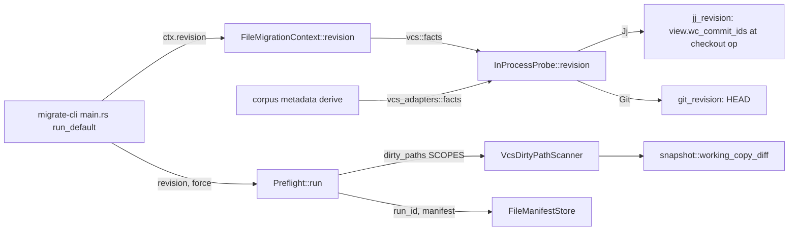

# False dirty-tree detection on jj repositories (0241)

**Date**: 2026-09-23 16:39 UTC
**Author**: Toby Clemson
**Git Commit**: 4895cc3f89bfede8289e6cb5d7ede9f319262972
**Branch**: none (jj working-copy commit in the `build-system` workspace)
**Repository**: accelerator

## Research Question

For the bug in `meta/work/0241-migrate-false-dirty-tree-detection.md`: where
does the jj run base come from, why does the guarded resume never engage on
jj, how does the jj dirty-path computation diverge from `jj status`, and what
code, tests, lints and prior decisions constrain the fix?

## Summary

The run base is a regression from the shell-to-Rust port. 0119's shell plan
recorded jj's `change_id` of `@` and explicitly warned that `commit_id`
"changes on every file write" and would break a legitimate resume. The Rust
port reads the run base from `RepoFacts.revision`, which 0188 defined as
`@`'s `commit_id`. Any jj command between the stall and the resume
re-snapshots `@`, so the pre-flight's whole-run gate
(`cli/migrate/src/preflight.rs:93-98`) fails and every dirty path is foreign.

- **Run base**: `jj_revision` (`cli/vcs-adapters/src/library.rs:643-693`) is
  the single source for both the run base and corpus metadata stamping. The
  fix needs a second, parent-derived query used only by
  `FileMigrationContext::revision` (`cli/migrate-adapters/src/context.rs:88-91`),
  the pre-flight's only production revision caller.
- **Excludes gap**: `snapshot::working_copy_diff` passes
  `base_ignores: GitIgnoreFile::empty()`
  (`cli/vcs-adapters/src/library/snapshot.rs:158-164`). In-tree `.gitignore`
  files are still honoured by jj-lib's walk; `core.excludesFile`, the XDG
  default and `info/exclude` are not. Every building block to reproduce
  jj-cli's `base_ignores` is public in jj-lib 0.43.0.
- **Size gap**: `max_new_file_size: u64::MAX`, and the snapshot uses
  `StackedConfig::with_defaults()` only, so no user, repo or workspace config
  is read. jj-lib itself never reads `snapshot.max-new-file-size`; the key,
  the 1 MiB default and the `0`-means-unlimited rule live in jj-cli.
- **Lint**: `lint:vcs-settings:check` already exempts `snapshot.rs`, which
  already constructs `UserSettings`. The work item's open question is
  therefore less about the lint than about building repo and workspace
  config layers read-only: jj-lib's `SecureConfig::maybe_load_config` writes,
  and no public read-only path resolver exists.
- **Refusal**: `PreflightError::ForeignDirt` is a unit variant; the foreign
  paths are computed in `Preflight::run` and dropped.
- **Tests**: no jj guarded-resume test, no jj stall test in any VCS, no
  `jj status` parity oracle for dirty paths.

## Detailed Findings

### Run base derivation and the pre-flight

- `cli/migrate-cli/src/main.rs:208-290` (`run_default`) builds the context,
  manifest store and scanner, then passes `revision: ctx.revision()` (238)
  and `force` (`ACCELERATOR_MIGRATE_FORCE` non-empty, 64-67) into
  `Preflight`.
- `cli/migrate/src/preflight.rs:66-124`:
  1. Force (71-75) and clean (83-87) both truncate the manifest and write the
     current revision as the run id. This is where a run records its base.
  2. Dirty (89-113): `base_matches` requires `Some(recorded) == Some(current)`;
     `usable` requires both manifest and run id; any foreign path, or any gate
     failing, returns `Err(PreflightError::ForeignDirt)`.
  3. `classify` is called with `base_revision_matches` hard-coded `true` (105)
     because the gate at 98 already enforced it.
- `cli/migrate/src/manifest.rs:32-48` classifies runner-managed, session
  artefact, manifested, foreign, in that order.
- `cli/migrate-adapters/src/manifest_store.rs`: run id in
  `.accelerator/state/migrations-run.id` (109-117 write, 102-107 read; empty
  → `None`); paths in `migrations-run-paths.txt`. `clear()` (119-127) runs
  only on success (`main.rs:285-287`), so a stalled run keeps both.
- Paths are recorded by `FileMigrationContext::write`/`write_private`
  (`context.rs:98-130`); `merge_move` is deliberately untracked
  (`ports.rs:59-63`).
- `jj_revision` (`library.rs:643-693`) is settings-free: it decodes
  `.jj/working_copy/checkout`, loads the operation and view from
  `SimpleOpStore`, and returns `view.wc_commit_ids[workspace]`. It never loads
  a `ReadonlyRepo` or a commit, so it has no parent access today.
  `an_unsnapshotted_edit_is_the_one_documented_divergence`
  (`cli/vcs-adapters/tests/library.rs:429`) pins its snapshot-free semantics.

### Obtaining the parents of `@`

Two routes exist; neither is implemented.

- **Via the exempt snapshot module**: `snapshot::load`
  (`snapshot.rs:102-123`) loads the workspace with `UserSettings` and
  `load_at_head`; `head_commit` (197-208) returns `@`'s `Commit`, whose
  `parent_ids()` (`jj-lib/src/commit.rs:106`) is the run base input. It reads
  at the op-heads head, whereas `jj_revision` reads at the checkout file's
  operation; the two agree except during concurrent or stale operations.
- **Settings-free**: `GitBackend::load` takes `&UserSettings`
  (`jj-lib/src/git_backend.rs:310-311`), so a settings-free route must open
  the backing git repository with gix directly (via
  `.jj/repo/store/git_target`) and read `@`'s git parents. The git backend
  maps a parentless commit to the root commit id, 20 zero bytes
  (`git_backend.rs:197`, filter at 424). This route only covers git-backed
  repositories.

Lexicographic sort and `+` join (requirement 1) is new code either way.

### jj dirty-path computation

- `InProcessProbe::dirty_paths` (`library.rs:393-403`) dispatches to
  `dirty_paths::jj_dirty_paths` (`library/dirty_paths.rs:49-58`), a thin map
  over `snapshot::working_copy_diff`.
- `working_copy_diff` (`snapshot.rs:128-193`):
  - baseline `wc_commit.parent_tree(repo)` (152): already the merged parent
    tree, so it is consistent with a parent-derived run base;
  - snapshots under jj's working-copy lock and drops it without `finish`
    (168): no operation saved, `@` not rewritten, but tree and blob objects
    are written to the backend;
  - `_stats` (`SnapshotStats.untracked_paths`, with
    `UntrackedReason::FileTooLarge`) is discarded;
  - no rename detection: a rename is a delete plus an add, matching the work
    item's parity rule of counting both paths.
- `status_log::jj_status` (`library/status_log.rs:300-332`) uses the same
  function and adds `tree.conflicts()`. Fixing `working_copy_diff` fixes both
  jj callers in one place.

#### jj-lib 0.43.0 semantics relevant to requirements 3 and 4

| Concern | jj-lib behaviour | Location |
|---|---|---|
| `base_ignores` | seeds the root; each dir chains its own `.gitignore` | `local_working_copy.rs:1349-1354`, `1559` |
| Ignored new file | dropped silently unless force-tracked | `local_working_copy.rs:1659-1664` |
| Size check | `len > max_new_file_size`, new files only; no `0` special case | `local_working_copy.rs:1678-1688` |
| Limit parsing | `HumanByteSize: TryFrom<ConfigValue>` (int or string) | `settings.rs:321-384` |
| Config lookup | `StackedConfig::get_value_with` | `config.rs:775` |
| Layer order | Default < System < EnvBase < User < Repo < Workspace < EnvOverrides < CommandArg | `config.rs:281-299` |
| Git backend access | `git::get_git_backend`, `git_repo()`, `git_repo_path()` | `git.rs:419-426`, `git_backend.rs:342-349` |
| Ignore chaining | `GitIgnoreFile::chain_with_file` (missing file is a no-op) | `gitignore.rs:87-101` |

jj-lib does not read `snapshot.max-new-file-size` anywhere and has no helper
for `core.excludesFile` or `info/exclude`. The 1 MiB default, `0` as
unlimited, the `repos/<id>` / `workspaces/<id>` directory layout and the
exclude chaining are jj-cli behaviour, not verifiable from local sources
(jj-cli is not in the cargo registry). The work item's review pass 3 states
they were checked against the jj-cli 0.43.0 source.

#### Repo and workspace config discovery

- `jj_user_name` (`library.rs:745-774`) builds `StackedConfig::empty()` with
  system (`/etc/jj/config.toml`, `/etc/jj/conf.d`, skipped when `JJ_CONFIG`
  is set), user (`JJ_CONFIG` exclusively, else legacy `~/.jjconfig.toml`,
  `<config_dir>/jj/config.toml`, `<config_dir>/jj/conf.d`) and a `JJ_USER`
  override. Its path helpers (`jj_system_config_paths` 799-808,
  `jj_user_config_paths` 815-850, `load_jj_config_path` 780-795) are directly
  reusable for requirement 4. No repo or workspace layer exists (doc 740-744).
- `jj-lib/src/secure_config.rs`: `SecureConfig::new_repo` (`.jj/repo`,
  `config-id`, legacy `config.toml`) and `new_workspace` (`.jj`,
  `workspace-config-id`, legacy `workspace-config.toml`) (165-177).
  `maybe_load_config` (355-399) generates, migrates legacy files to symlinks
  (317-351), rewrites metadata or copies config on a moved repository
  (236-276). `root_config_dir` is caller-supplied; the `repos`/`workspaces`
  directory names are jj-cli's. A read-only resolver must read the id file,
  validate 20 hex characters (370-374), join `<root>/<id>/config.toml`, and
  fall back to the legacy file when no id file exists.
- ⚠️ The snapshot's other settings (`fsmonitor.backend`,
  `working-copy.eol-conversion`, `exec-bit-change`,
  `ui.conflict-marker-style`) also come from bundled defaults
  (`jj-lib/src/config/misc.toml`). Loading the user's full stack into the
  snapshot's `UserSettings` would change them too; a configured Watchman
  backend would fail hard because jj-lib is built without `watchman`
  (`local_working_copy.rs:1435-1442`). Resolving only
  `snapshot.max-new-file-size` from a separate stack avoids that.

### Consumers and error handling

| Consumer | Entry | On error | Warn event |
|---|---|---|---|
| Migrate pre-flight | `migrate-adapters/src/dirty_path_scanner.rs:31-50` | treated as clean | "could not compute the working-copy diff; treating as clean" (38-42) |
| `work sync` | `work-adapters/src/sync/working_copy_status.rs:32-55` | `Dirtiness::Unknown` | "…every item's dirtiness is unknown" (42-49) |
| VCS status renderer | `vcs-cli/src/report.rs:47-83` | `(status unavailable)` | "could not render {subject}" (67-71) |

- ⚠️ On a scan error the pre-flight takes the clean branch, which truncates
  the manifest and overwrites the run id (`preflight.rs:83-87`). An invalid
  `snapshot.max-new-file-size` would therefore discard a stalled run's
  ownership record, not just proceed. Requirement 4 accepts "proceeds as if
  clean"; the manifest loss is an unstated consequence.
- The scanner's `.claude/accelerator` scope is a bare prefix, matching
  `.claude/accelerator.md` and siblings (46-49).
- `main.rs:54-62` picks the scanner's `VcsKind` from markers at the config
  root only; the revision path discovers the repository separately.

### Refusal rendering

- `DIRTY_TREE_REFUSAL` (`cli/migrate-cli/src/render.rs:15`) lists no paths.
- `main.rs:249-252` prints it and returns `kernel::Error::Failed("")`, exit 1.
- `resume_affordance` (`render.rs:17-37`) prints the owned paths under
  "Resuming over this run's own partial migration output:".
- The stall message (`render.rs:172-218`) promises resume "when the base
  revision is unchanged" (190-193).
- Requirement 5 needs `ForeignDirt` to carry the foreign paths;
  `meta/work/0263-rename-foreigndirt.md` is a pending rename of the same type.

### `lint:vcs-settings:check`

- `tasks/lint/vcs_settings.py`: regex `\bUserSettings\b|\bWorkspace::load\b`
  (55) over every `*.rs` under `cli/vcs-adapters` after stripping comments
  (61-85). `_EXEMPT` (48-53): `library/snapshot.rs` and `library/tracked.rs`.
- Registered in `tasks/__init__.py:104`, `tasks/lint/__init__.py:15,34`;
  documented at `tasks/README.md:133-145`.
- `snapshot.rs`'s module doc claims it is "the one place" `UserSettings` is
  built; `tracked.rs:41` also builds one.
- Code that reads the limit via `UserSettings` must live in `snapshot.rs`
  (or `tracked.rs`) to pass the lint. A `StackedConfig` plus
  `get_value_with(…, HumanByteSize::try_from)` needs no `UserSettings` at all
  and can live anywhere in the crate.

### Tests and fixtures

- `cli/vcs-adapters/tests/dirty_paths.rs` (feature `bash-parity`): three git,
  three jj cases, all `--no-colocate`, all hard-coded expectations. No
  `jj status` oracle, no modified-tracked, deletion, colocated or error case.
- `cli/vcs-test-support/src/hermetic.rs`: `rooted_at` (37-57) creates
  `hermetic-home`, `hermetic-xdg` and `hermetic-jj.toml`; `apply` (60-81)
  sets `HOME`, `XDG_CONFIG_HOME`, `JJ_CONFIG`, `GIT_CEILING_DIRECTORIES`,
  `GIT_CONFIG_NOSYSTEM=1`, `GIT_CONFIG_GLOBAL=/dev/null`. `jj()` (150-160)
  runs the pinned CLI; `assert_jj_matches` (224-240) checks major.minor.
  - ⚠️ `GIT_CONFIG_GLOBAL=/dev/null` hides any global `core.excludesFile`;
    the exclude criteria need a per-test override of it, and `JJ_CONFIG` must
    be unset or re-pointed for the user-layer and system-layer size cases.
  - ⚠️ The system layer is a fixed `/etc/jj` path; the "system 1 KiB"
    criteria cannot be exercised hermetically without an injectable system
    config root.
- `cli/migrate-cli/tests/dirty_tree_preflight.rs` (bash-parity, `Hermetic`):
  git refuse (62), force (90), clean (114), guarded resume with run id seeded
  to `HEAD` (136), `.accelerator` refuse (209), clear on success (234); jj
  refuse only (308). The comment at 148-150 claims gix excludes untracked
  files, contradicting `git_dirty_paths` (`UntrackedFiles::Files`).
- Stall fixtures run in a VCS-free `TempDir`: the 0007 stall test is
  `cli/migrate-cli/tests/migration_0007.rs:349`, not
  `list_and_decisions_file.rs` as the work item states; the latter has only
  `seed_ambiguous_reference` (48-64). Neither exercises the pre-flight.
- `cli/vcs-adapters/tests/library.rs` has a `jj_revision_oracle`
  (`jj log -r @ -T commit_id`, 304-311), per-workspace revision tests (333)
  and `reading_the_revision_writes_nothing` (408). A parent-derived oracle is
  `jj log -r 'parents(@)' -T commit_id`.
- `CHANGELOG.md`: `## [Unreleased]` has `Added`, `Changed`, `Security`, no
  `### Fixed`; entry style is `- **Headline.** Prose…` at 80 columns
  (see 1.23.0 `Fixed`, 179-189).

## Code References

- `cli/migrate/src/preflight.rs:16` — `SCOPES`
- `cli/migrate/src/preflight.rs:28-37` — `PreflightError`, unit `ForeignDirt`
- `cli/migrate/src/preflight.rs:66-124` — `Preflight::run`, run-base gate at 93-98
- `cli/migrate/src/ports.rs:71` — `MigrationContext::revision`
- `cli/migrate/src/ports.rs:320-365` — `DirtyPathScanner`, `ManifestStore`
- `cli/migrate/src/manifest.rs:32-99` — ownership classification
- `cli/migrate-adapters/src/context.rs:88-91` — revision source for the run base
- `cli/migrate-adapters/src/manifest_store.rs:38-127` — run id and manifest files
- `cli/migrate-adapters/src/dirty_path_scanner.rs:31-50` — scanner, fail-open
- `cli/migrate-cli/src/main.rs:208-290` — composition and outcome mapping
- `cli/migrate-cli/src/render.rs:15` — `DIRTY_TREE_REFUSAL`
- `cli/migrate-cli/src/render.rs:17-37` — `resume_affordance`
- `cli/vcs-adapters/src/library.rs:393-403` — `InProcessProbe::dirty_paths`
- `cli/vcs-adapters/src/library.rs:527-542` — `VcsProbe::revision`
- `cli/vcs-adapters/src/library.rs:596-619` — `git_revision`
- `cli/vcs-adapters/src/library.rs:643-727` — `jj_revision`, `read_checkout`
- `cli/vcs-adapters/src/library.rs:745-850` — `jj_user_name` and config path helpers
- `cli/vcs-adapters/src/library/snapshot.rs:102-208` — `load`, `working_copy_diff`, `head_commit`
- `cli/vcs-adapters/src/library/dirty_paths.rs:16-58` — git and jj dirty paths
- `cli/vcs-adapters/src/library/status_log.rs:300-332` — `jj_status`
- `cli/corpus-adapters/src/metadata.rs:192-262` — corpus revision stamping (must stay `@`)
- `cli/work-adapters/src/sync/working_copy_status.rs:32-71` — `work sync` dirtiness
- `cli/vcs-cli/src/report.rs:47-83` — renderer fallback
- `tasks/lint/vcs_settings.py:46-100` — the lint and its exemptions
- `cli/vcs-test-support/src/hermetic.rs:37-240` — hermetic harness
- `cli/migrate-cli/tests/dirty_tree_preflight.rs:136,308` — git resume, jj refuse
- `cli/migrate-cli/tests/migration_0007.rs:349` — 0007 stall

## Architecture Insights

- **Ports keep the fix local.** `migrate` sees only
  `MigrationContext::revision` and `DirtyPathScanner`; the run base can move
  to a new adapter query without touching the domain, and the corpus path
  (`vcs_adapters::facts` → `VcsProbe::revision`) stays on `@`. The domain
  language suggests naming the new concept `run_base` rather than overloading
  `revision`.
- **One seam for dirty paths.** 0198 extracted `snapshot::working_copy_diff`
  so both jj callers share it; excludes and the size limit belong in its
  `SnapshotOptions`, reaching all three consumers at once.
- **Manifest semantics follow the dirty-path computation.** The manifest is
  the scoped dirty delta around each migration (0119). Honouring excludes and
  the size limit changes what a run can own as well as what it refuses.
- **Settings-free by policy, not necessity.** 0188 banned `UserSettings`
  because jj-lib's private defaults panicked one at a time; its later note
  records that `from_config` returns `Result` and needs five keys. The ban is
  about crash surface on the hook and visualiser paths.

## Historical Context

- `meta/plans/2026-06-21-0119-resume-safe-partial-migration-failure.md` —
  chose the base revision as run id, jj `change_id` over `commit_id`
  explicitly; fail-closed staleness; refusal lists no paths (no rationale
  recorded); migrations must never commit.
- `meta/plans/2026-08-03-0188-library-backed-vcs-adapter.md` — `UserSettings`
  ban and lint rationale; settings-free `jj_revision` returning `@`'s
  `commit_id`; hermetic harness design; four-pin jj-lib upgrade rule.
- `meta/plans/2026-08-31-0198-vcs-agnostic-status-log-renderer.md` —
  extracted `snapshot.rs`, moved the lint exemption there, kept
  `u64::MAX` deliberately (accepted time/memory/disk exposure), made git
  honour global excludes via `gix::open` (precedent for requirement 3).
- `meta/reviews/work/0241-migrate-false-dirty-tree-detection-review-1.md` —
  six passes; settled corpus metadata on `@`, the merge `+` join, keeping the
  bundle together, layer-override semantics. Left for the plan: the
  `jj edit` sibling fixture cannot distinguish unchanged from stale; no
  criterion for user-layer sources; copied-repository size behaviour
  unconfirmed; `work sync` fixture location; system-layer source.

## Related Research

- `meta/research/codebase/2026-06-21-0119-resume-safe-partial-migration-failure.md`
- `meta/research/codebase/2026-06-20-0116-structured-stall-on-no-decision-input.md`
- `meta/research/codebase/2026-08-02-0188-library-backed-vcs-adapter.md`
- `meta/research/codebase/2026-08-31-0198-vcs-agnostic-status-log-renderer.md`
- `meta/research/codebase/2026-08-06-0172-migration-engine-implementation-research.md`

## Open Questions

- **Parent route**: read `@`'s parents through the exempt `snapshot::load`
  (at op-heads head, needs `UserSettings`, any backend) or settings-free via
  gix on `git_target` (at the checkout operation, git backend only)? The
  work item's "every jj repository" scope favours the former.
- **Size-limit resolution**: a standalone `StackedConfig` read with
  `HumanByteSize::try_from` avoids `UserSettings` entirely, which appears to
  answer the work item's open question without a lint exception. Confirm the
  jj-cli behaviours (1 MiB default, `0` unlimited, `repos/<id>` layout) with
  the pinned `jj` binary in the first failing test, since jj-cli source is
  not available locally.
- **System layer in tests**: `/etc/jj` is hard-coded; the "system 1 KiB"
  criteria need an injectable system config root or cannot run
  hermetically.
- **Scan error wipes the manifest**: should requirement 4's invalid-limit
  path be allowed to truncate a stalled run's manifest via the clean branch?
- **Stale `@` vs head**: `jj_revision` reads at the checkout operation;
  `working_copy_diff` loads at head. Decide which operation the run base
  reads, and whether a stale working copy needs handling.
- Not checked: `jj status` output for the exclude and size cases on the
  pinned jj 0.43.0 binary; Windows config paths.
