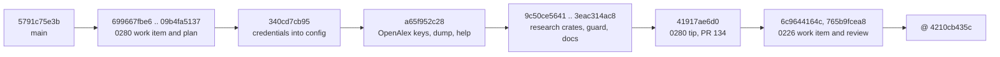

# Unify the trust barrier for consent config keys

**Date**: 2026-09-24 15:09 BST, updated 2026-09-24 23:58 BST
**Author**: Toby Clemson
**Git Commit**: `4210cb435c` (jj change `qspqnpsy`)
**Branch**: 0226 work-item commits on `0280-academic-source-profiles`
(`41917ae6d0`), itself on `main` (`5791c75e3b`)
**Repository**: accelerator

## Research Question

What does the codebase look like today for every surface work item 0226
touches? That covers the catalogue, the provenance and value checks for the
consent keys, the command runners, the repository-root definitions, the
Playwright daemon handoff, the `SessionStart` summary and the shipped docs.
Where does the work item's picture diverge from the code, and what constrains
the design?

This revision re-verifies every finding after 0226 was rebased onto the 0280
branch. All line references are at `@` unless stated otherwise.

## Summary

The barriers exist as the work item describes, with differences in the
detail. The rebase settles the base-branch question: the credential ladder now
lives in `cli/config/src/credentials.rs` behind four ports, and its adapters
and runner live in `cli/config-adapters/src/credentials.rs`. Five findings
change how 0226 should be planned:

- ⚠️ **0226's Technical Notes cite paths that no longer exist.** Examples are
  `cli/tracker-support/src/credentials.rs:243-409`, `:422-432` and
  `:124-133,450-459`. `tracker-support` now holds no credential code
  (`cli/tracker-support/src/lib.rs:12-30`), and
  `research_never_reaches_tracker_support` (`cli/pup.ron:132-146`) bans it
  from the research crates.
- ⚠️ **0280 added a sixth command-valued key, and 0226 does not know it
  exists.** `openalex.api_key_cmd` resolves through the same ladder. Its
  timeout is the fetch deadline's remaining budget (up to 100s), not 30s, and
  unit tests pin that. Integration tests pin `E_TOKEN_CMD_FROM_SHARED_CONFIG`,
  `E_TOKEN_FROM_TRACKED_FILE` and `E_TOKEN_CMD_FROM_TRACKED_FILE` for the
  OpenAlex keys. 0226 mentions neither `openalex` key nor 0280.
- ⚠️ **0280's validation already asks for 0226's runner fixes without
  naming 0226.** It recommends killing the helper's process group on timeout
  and rejecting over-cap output as a follow-up. That is Requirement 5's
  kill-all and cap-refusal criteria.
- ❓ **`ACCELERATOR_ALLOW_INSECURE_LOCAL` is still unreachable in
  production.** The ladder's gate honours it, but the next personal read goes
  through `FileConfigStore::read`, which refuses the same file
  unconditionally. Both override tests use an in-memory config fake, so they
  pass anyway.
- ⚠️ **Provenance is now copied four times, and every copy fails open.**
  `research-cli/src/provenance.rs` is a fourth identical `VcsProvenance`.
  `Provenance::is_tracked` still returns `bool`.

The hexagonal constraints set the shape of the solution. The policy, refusal
vocabulary and catalogue attribute go in `cli/config`, which `pup.ron` now
bars from `std::{fs,process,env}` (`cli/pup.ron:56`). Tracking queries,
canonicalisation, temp-dir creation and spawning go behind ports, with
adapters in `config-adapters`, and composition roots pass env values in.
`vcs_adapters::InProcessProbe::is_tracked` already returns
`Result<bool, Error>`, so fail-closed provenance needs only a port-shape
change and one shared adapter.

## Detailed Findings

### Branch topology

These surfaces changed since the first revision:

- the credential ladder and runner;
- `EXTRA_KEYS`;
- the four `VcsProvenance` copies;
- `jira-client`'s auth;
- `for_credential`;
- `dump.rs`, `help.rs` and `pup.ron`;
- `launcher/src/main.rs`;
- `config_read.rs`;
- `skills/config/configure/SKILL.md`;
- the new `docs-site/.../research.md`.

The collaboration, design, VCS, store, service, precedence, error and summary
files are byte-identical, so their references carry over unchanged.

### Catalogue

- The catalogue is made of flat `pub const` slices with no per-key descriptor
  (`cli/config/src/catalogue.rs`).
  - `EXTRA_KEYS` (`:134-153`) holds seven consent keys:
    - `jira.allowed_sites` (`:135`), `jira.token_cmd` (`:139`),
      `linear.token_cmd` (`:144`), `github.token_cmd` (`:146`) and
      `design.browser_path` (`:152`);
    - `openalex.api_key` (`:147`) and `openalex.api_key_cmd` (`:148`),
      added by 0280.
  - The consumers that iterate the tables directly:
    - the launcher `dump`;
    - `help.rs::recognised_keys` (`cli/launcher/src/launch/help.rs:52-75`);
    - `visualiser/server/src/config.rs`.
  - `default_for` is at `:254-275` and never consults `EXTRA_KEYS`.
    `is_valid_work_integration` is at `:126-128`.
- **The catalogue has no attribute precedent.** `dump` hides secrets by leaf
  name: `CREDENTIAL_LEAVES = ["token", "token_cmd", "api_key", "api_key_cmd"]`
  (`cli/launcher/src/config_command/core/dump.rs:318-319`) is matched in
  `extra_row` (`:321-341`). `jira.allowed_sites` and `design.browser_path`
  print in clear.
  - 0280's plan defers "catalogue-level secret classification" until a third
    source lands.
  - A consent attribute on a key descriptor would absorb that and replace the
    leaf-name convention.
- The count test (`:307-318`, 65 keys) excludes `EXTRA_KEYS`, so a descriptor
  covering only the extra keys leaves it intact.
  - `config/tests/extra_keys_mirror.rs` pins three memberships.
  - Per-group tests pin the GitHub (`:401-405`), OpenAlex (`:407-411`) and
    design (`:413-418`) keys.

### Config service, precedence and masking

These files are unchanged since the first revision.

- `Source` is `Personal | Team | Catalogue | Unset`, with no `Env` variant
  (`cli/config/src/service.rs:50-55`).
- `ConfigAccess::get(key, Some(level))` reads one level raw
  (`service.rs:361-365`, `:484-486`). It is the per-level probe the policy
  needs.
- `effective_nonempty` (`service.rs:428-441`) collapses an empty personal
  value to the catalogue default, not to Team. For `EXTRA_KEYS` the result is
  `Unset`.
- `env_beats_config` (`cli/config/src/precedence.rs:14-26`) treats
  whitespace as absent.
- ⚠️ **The design barrier masks more than 0226 states.**
  `design-cli/src/config.rs:69-73` sets `team_level_present` only when Team
  wins. Any personal value therefore suppresses the team-level warning.
- ADR-0047 has no unset sentinel and no env tier. 0226 formalises env as the
  top tier and as a trust boundary, which may warrant an ADR note.

### Personal-file invariants and the insecure-local override

- **Store guard.** `require_secure_personal_file`
  (`cli/config-adapters/src/store.rs:185-193`, applied at `:210` and `:260`)
  calls `store::require_owner_only_permissions`
  (`cli/store/src/lib.rs:177-191`).
  - It refuses a symlink or any group or other bit, and has no bypass.
  - The error is `ConfigError::Invalid`, which counts as a refusal.
- **Ladder gate.** The ladder's own gate is `personal_config_exists`
  (`cli/config/src/credentials.rs:439-466`).
  - A symlink or non-regular file gives `LocalPermsInsecure { mode: 0 }`, and
    its message suggests `chmod 600`.
  - A group- or other-readable file is refused unless
    `insecure_override_allowed` (`:468-477`) holds. That needs
    `ACCELERATOR_ALLOW_INSECURE_LOCAL=1`, a regular marker at
    `INSECURE_MARKER_RELATIVE` (`:174`) and a tracked marker.
- **Why the override is unreachable, in call order:**
  1. The gate passes on a 0644 file with a tracked marker and the variable
     set.
  2. `level_value(..., Level::Personal)` (`:418-433`) calls
     `config.get(key, Some(Personal))`, which reaches `FileConfigStore::read`.
  3. The store refuses the file, and the ladder surfaces
     `CredentialError::ConfigUnreadable`. That error has no `E_` code and
     exits 1 in Jira.
  4. In the Jira and Linear CLIs, earlier merged reads pre-empt even step 2:
     `integrations_dir` (`cli/jira-cli/src/context.rs:118-120,157`,
     `cli/linear-cli/src/context.rs:99-101,141`) and `jira.site`
     (`cli/jira-client/src/auth.rs:66-67`).
- **Override tests.** Both use an in-memory `FixedConfig` with no permission
  check, so the store never runs:
  - `cli/config/tests/credentials.rs:442-462`;
  - `cli/config-adapters/tests/credentials.rs:273-297`, which writes a real
    0644 file and marker.
- **Public API pins.** `insecure_marker` and `INSECURE_MARKER_RELATIVE` are
  pinned in `cli/config/tests/fixtures/public-api.txt:122,161`.
- ⚠️ **The docs contradict each other on the bypass.**
  - `docs-site/.../configuration.md:26` says "there is no bypass".
  - `skills/config/configure/SKILL.md:779-782`, `:889-892` and `:947-949`
    present the override as working, the last for OpenAlex.

### Credential ladder: `jira.token_cmd`, `linear.token_cmd`, `openalex.api_key_cmd`

`resolve_token` (`cli/config/src/credentials.rs:294-353`) tries these rungs:

1. The env value (`:298-300`).
2. The env command (`:302-307`). This rung has no value check and no
   provenance check.
3. If `personal_config_exists` (`:309`):
   - the personal value, refused as `TokenFromTrackedFile` when the file is
     tracked (`refuse_tracked_value`, `:381-392`);
   - then the personal command, refused as `TokenCmdFromTrackedFile`
     (`refuse_tracked_source`, `:367-379`, `pub`).
4. Otherwise (`:337-348`):
   - a team command gives `TokenCmdFromSharedConfig`, even beside a team
     value;
   - otherwise the team value is used.
5. If nothing matched, `NoToken` (`:350-352`).

- ✅ **The work item's claim is confirmed.** When `config.local.md` exists,
  the team level is never read, so a team `token_cmd` or `api_key_cmd` is
  ignored silently.
  - `a_shared_token_command_is_refused_rather_than_ignored`
    (`cli/config/tests/credentials.rs:298-311`) and its sibling at `:589-602`
    cover only the absent-file branch.
  - `research-cli`'s
    `a_personal_config_without_a_key_leaves_the_call_keyless`
    (`tests/fetch_openalex.rs:588`) pins the silent skip for OpenAlex.
- **`CredentialError` codes** (`:193-256`):
  - `E_NO_TOKEN`;
  - `E_TOKEN_CMD_FAILED`, shared by `TokenCmdFailed` and `TokenCmdTimedOut`;
  - `E_TOKEN_CMD_FROM_SHARED_CONFIG`;
  - `E_TOKEN_CMD_FROM_TRACKED_FILE`;
  - `E_TOKEN_FROM_TRACKED_FILE`, new in 0280;
  - `E_LOCAL_PERMS_INSECURE`;
  - `E_TOKEN_MALFORMED`;
  - `ConfigUnreadable`, which has no code.

  `Debug` redacts secrets (`:258-285`).
- ⚠️ **The docs now disagree with each other.** The OpenAlex section says a
  team `api_key_cmd` is "refused" (`SKILL.md:941-945`). The Jira and Linear
  sections still say a team `token_cmd` is "ignored" with a warning
  (`:772-776`, `:803-807`, `:885-889`). The code refuses all three.
- The stale fixture comment in
  `cli/jira-cli/tests/fixtures/capture-exit-codes.sh:12-13` still calls code
  26 "never a fatal exit". The Rust code maps it to `NO_TOKEN` (24).

### OpenAlex keys (new since the first revision)

- **Resolution.** `resolve_key` (`cli/research-cli/src/fetch_command.rs:172-191`)
  builds the context with `project_credential_context` and calls
  `resolve_token` with the keys at `:192-202`:
  - env `ACCELERATOR_OPENALEX_API_KEY` and `ACCELERATOR_OPENALEX_API_KEY_CMD`;
  - config `openalex.api_key` and `openalex.api_key_cmd`.
- ⏱️ **Timeout.** `command_timeout` is `deadline.remaining(clock.now())`
  (`:181`), against `CALL_BUDGET` = 100s (`cli/research-cli/src/main.rs:58-59`).
  Unit tests pin the budget arithmetic:
  - `the_key_command_is_bounded_by_the_budget_the_deadline_has_left`
    (`fetch_command.rs:641`) expects 88s after 12s have elapsed;
  - `a_slow_key_command_leaves_room_for_only_the_attempts_that_fit` (`:608`);
  - two siblings at `:620` and `:630`.

  This conflicts with Requirement 5's fixed 30s "for every command-valued
  key".
- **Severity.** `NoToken` means keyless (`:188`). Every other
  `CredentialError` falls through a catch-all arm (`:189`), and `main.rs:132-135`
  prints it and exits 1 before any request. research-cli has no exhaustive
  match, so new codes need no research exit mapping. They also cannot get a
  distinct exit code there without new work.
- **Integration tests** (`cli/research-cli/tests/fetch_openalex.rs`):
  - `:602`, `:612` pin `E_TOKEN_CMD_FROM_SHARED_CONFIG: openalex.api_key_cmd`.
  - `:643-654` pin `E_TOKEN_FROM_TRACKED_FILE` and
    `E_TOKEN_CMD_FROM_TRACKED_FILE`.
  - `:659-664` pin `E_LOCAL_PERMS_INSECURE`, where the permission gate fires
    before the tracking check.
  - `:669` covers a tracked file without a key, which runs keyless.

  No integration test covers a key command that times out.
- **Plaintext keys.** `openalex.api_key` is a plaintext credential, like
  `github.token`. 0226's Assumptions keep plaintext tokens out of the policy.
  Yet the ladder already refuses a tracked personal plaintext key, which
  0226's Requirement 2 applies only to consent keys.
- **The research guard is unrelated.** `accelerator research guard`
  (`hooks/hooks.json:41-63`, `cli/research-cli/src/guard.rs`) confines the
  researcher subagent's Bash and writes. It reads only `agents.researcher`
  and `paths.research_topics`, not credentials.

### `jira.allowed_sites`

`allowed_sites` (`cli/jira-client/src/auth.rs:158-181`) behaves as follows:

- A team-level value gives `AllowlistFromSharedConfig`
  (`cli/jira-client/src/error.rs:26-31`), which exits 1 through `for_client`
  (`cli/jira-cli/src/exit_codes.rs:191-193`).
  - It fires even when a personal value exists and the site is inside
    `*.atlassian.net`.
  - That is fatal today, where 0226's severity matrix wants a warning.
- A tracked personal value is refused through `refuse_tracked_source`
  (`:169-173`). It emits the misnamed `E_TOKEN_CMD_FROM_TRACKED_FILE:
  jira.allowed_sites comes from …` and exits 24.
- `resolve_credentials` (`:63-80`) runs the allowlist before the token
  ladder.
  - `allowed_sites` does not call the ladder's `personal_config_exists`.
  - A group-readable `config.local.md` therefore surfaces as a store refusal,
    not as `E_LOCAL_PERMS_INSECURE`.
- `host_is_admissible` (`:135-142`) admits a label-boundary
  `*.atlassian.net` match or an exact allowlisted host.
- `ACCELERATOR_JIRA_API_URL` bypasses the allowlist
  (`cli/jira-cli/src/context.rs:74`).

### `github.token_cmd`

This path is unchanged. `resolve_github_token`
(`cli/collaboration-cli/src/auth.rs:43-91`) is independent of the ladder and
tries, in order:

1. `GH_TOKEN`, then `GITHUB_TOKEN`.
2. `github.token` via `effective(None)`, which accepts a team-level token.
3. A team `token_cmd`, refused as `kernel::Error::Refusal` with no `E_` code.
   It fires only when steps 1–2 found nothing, even if `config.local.md`
   exists.
4. A personal `token_cmd`.

`run_token_cmd` (`:137-160`) is a bare `bash -c` with an inherited
environment, the inherited cwd, no timeout and no cap. It has no
tracked-file check. Now that the ladder lives in `config`, `github.token_cmd`
is the only command-valued key outside it.

### Duplicated provenance

| Implementation | Struct / impl | On tracking error |
|---|---|---|
| `cli/jira-cli/src/context.rs` | `:86-96` / `:98-110` | `.unwrap_or(false)` |
| `cli/linear-cli/src/context.rs` | `:67-77` / `:79-91` | `.unwrap_or(false)` |
| `cli/work-cli/src/tracker_registry.rs` | `:78-88` / `:90-110` | `warn!`, then `false` |
| `cli/research-cli/src/provenance.rs` | `:12-22` / `:24-35` | `.unwrap_or(false)` |

- The four copies are structurally identical and share no code.
  - They implement `config::credentials::Provenance { fn is_tracked(&Path) -> bool }`
    (`cli/config/src/credentials.rs:104-106`).
  - `CredentialPorts::system` takes a `Box<dyn Provenance>`
    (`cli/config-adapters/src/credentials.rs:39-46`).
  - A single fail-closed adapter in `config-adapters` would replace all four.
- They delegate to `InProcessProbe::is_tracked(root, relpath, kind) -> Result<bool, Error>`
  (`cli/vcs-adapters/src/library.rs:442-453`), which treats each VCS
  differently:
  - git reads the index;
  - jj reads the working-copy commit tree without a snapshot;
  - `VcsKind::None` gives `Ok(false)`.
- ⚠️ **Every copy can misidentify the root, and every failure reads as
  untracked.**
  - The root comes from `FileConfigStore::discover_root`
    (`store.rs:113-125`; research at `cli/research-cli/src/context.rs:24-30`),
    which stops at the nearest `.accelerator/` and does not canonicalise.
  - With `.accelerator/` below the VCS root, `kind(root)` is `None`.
  - A failed `strip_prefix` or a non-UTF-8 path also yields untracked.

### Command runner

| Property | `BashTokenCommandRunner` | `collaboration-cli` | Req 5 target |
|---|---|---|---|
| cwd | project root (`policy.working_directory`) | inherited | fresh empty temp dir per run |
| env | `PATH`/`HOME`/`TERM`, hard-coded `:130-135` | inherited | plus `GH_HOST`/`GH_CONFIG_DIR` for GitHub |
| timeout kill | `child.kill()`, bash only `:167-171` | none | every process started |
| output cap | stdout `take(cap)` `:151-160`; stderr null `:145` | none | 65,536 bytes combined; refuse on excess |

- Lines refer to `cli/config-adapters/src/credentials.rs:124-198`.
- ⚠️ **The timeout does not bound the call.**
  - `reader.join()` (`:182`) runs unconditionally after a kill and blocks
    until every holder of the stdout pipe closes it.
  - `setsid` plus `killpg` fixes both the survivors and the hang.
- ⚠️ **Behaviour past the cap depends on how much is written.**
  - Nothing drains stdout beyond the cap.
  - A helper that writes more than the cap plus a pipe buffer blocks and
    times out.
  - A helper that writes less than that exits, and its truncated output is
    accepted as a token.
- **Port shapes.**
  - `TokenCommandRunner::run(&str, &CommandPolicy)` (`cli/config/src/credentials.rs:161-171`)
    returns `CouldNotRun | Failed | TimedOut`, with no output-exceeded
    variant.
  - `CommandPolicy` (`:109-127`) carries `timeout`, `max_output_bytes` and
    `working_directory`, but no env allow-list or temp-dir rule.
- **Tests.**
  - `a_hanging_helper_is_abandoned_at_the_timeout`
    (`cli/config-adapters/tests/credentials.rs:374-391`) uses a bare
    `sleep 120`, which bash likely execs, so no grandchild survives.
  - `an_unbounded_helper_is_truncated_rather_than_buffered_without_limit`
    (`:393-412`) accepts either truncation or failure.

### `design.browser_path` and the Playwright daemon

These files are unchanged since the first revision.

- **Resolution:** `resolve_browser_hatch` (`cli/design-cli/src/config.rs:51-82`)
  reads `effective_nonempty(None)`.
  - `ACCELERATOR_DESIGN_BROWSER_PATH` wins via `env_beats_config`.
  - It passes `std::fs::canonicalize` to `vet`.
  - It has no tests.
- **Vetting:** `vet` (`cli/design/src/runtime/browser_path.rs:34-90`)
  behaves as follows:
  - It returns the raw trimmed value (`:66-69`), not the canonical path.
  - A relative value is canonicalised against the executor cwd, but the
    daemon resolves it against its own cwd (`DaemonSpawner::spawn` sets
    none, `cli/design-adapters/src/process.rs:139-221`).
  - "Inside" means under the canonical `facts.root`. The check fails open if
    that root cannot be canonicalised (`:81-83`).
  - A nonexistent path passes (`:181-192`).
  - Refusals are stderr warnings (`executor.rs:133-135`).
- **Handoff:** `ACCELERATOR_DESIGN_BROWSER_EXECUTABLE` (`executor.rs:442-445`)
  reaches `daemon.js::ensureBrowser` (`:201-213`), which launches Chromium
  once per daemon lifetime. `ping` (`:282-303`) reports the daemon's own
  path.
- **Reuse:** the decision (`cli/design/src/executor/launch.rs:85-165`,
  `reuse.rs:37-76`) uses pid liveness and start time only.
  `StateDirectory::interpret` (`design-adapters/src/state.rs:47-96`) drops
  every other `server-info.json` field. The browser path would need
  recording in three places:
  - `daemon.js::writeServerInfo` (`:606-618`);
  - `RecordedDaemon`/`RecordedState` (`daemon_identity.rs:33-50`);
  - `interpret`.
- ⚠️ **A restart needs a stop path the launcher does not have.** Recovery
  never signals (`reuse.rs:26-32`). `HostControl::terminate`
  (`process.rs:114-127`) only kills a just-spawned child. Two options:
  - `daemon-stop` over the authenticated client (`forwardable.rs:20-32`,
    `daemon.js:309-312`);
  - an identity-verified SIGTERM after a `Reuse` verdict.

  Either must run under `launcher.lock` and survive 0196's deferred `flock`
  lease.
- **Test harnesses:** `launch.rs:199-694` has fakes that suit
  restart-decision tests. `lib/daemon.test.js` forks a real daemon with a
  mock Playwright, but no JS test covers `executablePath`.

### Repository roots (Requirement 3)

| Root | Source | Canonical | Notes |
|---|---|---|---|
| Config root | `FileConfigStore::discover_root` (`store.rs:113-125`) | no | nearest `.accelerator/`, `.git` or `.jj`; used by all four provenance copies |
| Workspace root | `vcs_adapters::facts(&cwd).root` (`vcs-adapters/src/lib.rs:21-24`) | yes | jj workspace or git linked worktree |
| Main repository (jj) | `RepoRoot::repository_root` (`library.rs:541-544,600-619`) | yes | no error channel |
| Main repository (git) | `InProcessProbe::worktree` → `main_worktree_root` (`library.rs:232-258`) | yes | not reached by `repository_root()` |

- ⚠️ **`repository_root()` does not give git's main worktree.** For a linked
  worktree it returns the worktree itself. `vcs::classify::classify`
  (`cli/vcs/src/classify.rs:91-186`) already combines both.
- The `vcs` crate has no tracked-status port; `is_tracked` is an inherent
  adapter method.
- Mixing canonical and non-canonical roots breaks `strip_prefix` on macOS,
  where `/var` resolves to `/private/var`.

### `SessionStart` summary (Requirement 9)

- The hook is `bin/accelerator config summary --format=hook --fail-safe`
  (`hooks/hooks.json:18`).
- `assemble` (`cli/launcher/src/config_command/core/summary.rs:38-79`) holds
  the team and personal `Node`s separately (`:44-45`).
- ⚠️ **The launcher has no VCS access.** It has no `vcs-adapters` edge, and
  `ConfigStack` (`core/mod.rs:92-100`) has no provenance port.
  - The wiring now lives in `compose_stack`
    (`cli/launcher/src/main.rs:235-259`), invoked lazily from `dispatch`
    (`:406-415`).
  - `config_command_may_not_import_adapters_or_launch`
    (`cli/pup.ron:537-550`) forces the new port through that root.
- `hook_envelope` (`render/summary.rs:63-67`) passes `None` to
  `kernel::hooks::session_start`. That function already emits both channels
  (`cli/kernel/src/hooks.rs:9-23`).
- ⚠️ **An insecure `config.local.md` makes the hook fail loud despite
  `--fail-safe`.**
  - `finish` (`launch/inbound/cli.rs:459-478`) propagates refusals.
  - 0280's new `DispatchFailurePolicy` (`cli/launcher/src/launch/core.rs:246-291`)
    governs dispatched sub-binaries only, not the in-process config command.
- The black-box tests are at `cli/launcher/tests/config_read.rs:1379-1497`,
  with fixtures at `:25-64`. `local` chmods the file to 0600. Tracked-file
  tests need `vcs-test-support::Hermetic`.

### Exit codes and refusal vocabulary

- The `E_*` codes exist only as `Display` prefixes:
  - `CredentialError` (`cli/config/src/credentials.rs:205-256`);
  - `jira-client`'s `ClientError`.
- `ConfigError::is_refusal` is exhaustive (`cli/config/src/error.rs:79-92`).
- Per-CLI mapping of credential errors differs by CLI:

| CLI | Credential mapping | Exhaustive | Allowlist refusal |
|---|---|---|---|
| jira | `for_credential` (`jira-cli/src/exit_codes.rs:202-214`) | yes, 9 variants | `ERROR` (1) |
| linear | `Credential(_) => NO_TOKEN` (`linear-cli/src/exit_codes.rs:163`) | no, flattened | n/a |
| research | catch-all, exit 1 (`fetch_command.rs:189`) | no | n/a |
| collaboration | `kernel::Error::Refusal` | n/a | n/a |

- Jira's mapping:
  - 24 (`NO_TOKEN`) for `NoToken`, shared-config, both tracked variants and
    malformed;
  - 25 for failed and timed out;
  - 29 for insecure permissions;
  - 1 for unreadable.
- 0269 froze the numeric codes as a contract. A unit test at
  `exit_codes.rs:264-281` pins the two tracked variants.
- ❓ **0226 specifies no numeric mapping for its seven codes.**
  - Team-level and tracked plausibly map to 24, and timeout to 25.
  - `E_COMMAND_OUTPUT_EXCEEDED` and `E_CONSENT_KEY_TRACKING_UNKNOWN` have no
    counterpart.
- Requirement 8's retirement list omits four codes, and their fate against
  the new ones is unspecified:
  - `E_TOKEN_CMD_FROM_TRACKED_FILE`, used for `allowed_sites` too;
  - `E_TOKEN_FROM_TRACKED_FILE`;
  - `E_TOKEN_CMD_FAILED`;
  - `E_ALLOWED_SITES_FROM_SHARED_CONFIG`.

### Hexagonal placement

- `config_domain_imports_only_permitted` (`cli/pup.ron:45-61`) allows only
  `std|core|alloc`, `kernel::Error` and `crate`, and denies
  `^std::(fs|process|env)` (`:56`). Env values must be inputs to the policy.
- Placement follows from that:
  - **In `config`:** the policy, the catalogue attribute, the refusal
    vocabulary, the runner policy (env allow-list per key, timeout, cap, cwd
    rule) and the ports.
  - **In `config-adapters`:** canonicalisation, the fail-closed tracking
    adapter over `vcs-adapters`, temp-dir lifecycle, and spawn plus group
    kill.
- `design_domain_imports_only_permitted` (`pup.ron:487-503`) does not permit
  `config`. The path check runs in `design-cli`, and only the vetted value
  crosses into `design`.
- The research crates are fenced too:
  - `research_domain_imports_only_permitted` (`:98-112`);
  - `research_never_reaches_tracker_support` (`:132-146`).

  `research-cli` is already a composition root over `config-adapters`
  (`main.rs:111-131`).
- The precedent for a shared gated helper is `resolve_with_deprecated_fallback`
  (`cli/config/src/legacy_alias.rs`). Warnings travel beside the value.

### Shipped docs

- Edit `skills/config/configure/SKILL.md`. The docs-site mirror is generated
  and gitignored; its current build has no OpenAlex section.
- The terms to change in `SKILL.md`:
  - "ignored" for a team `token_cmd`: `:772-776`, `:803-807`, `:885-889`;
  - the override and marker presented as working: `:779-782`, `:889-892`,
    `:947-949`;
  - the OpenAlex refusals: `:941-945`, `:950-953`;
  - `allowed_sites`: `:742-750`;
  - `visualiser.editor`: `:714-732`.
- `SKILL.md` has no GitHub section and no mention of `design.browser_path`.
- `docs-site/src/content/docs/research.md:167-197` documents the OpenAlex
  ladder and a refusal table that shows today's codes (`:185-192`).
- The hand-maintained docs-site pages that mention consent keys or
  personal-file rules:
  - `configuration.md:21-30`, which says "no bypass" at `:26`;
  - `collaboration.md:48-65`;
  - `design.md:221-227`;
  - `guides/configuration-cookbook.md:142-153`;
  - `guides/sync-work-items.mdx:51-73`;
  - `guides/review-a-pr.mdx:19-22`;
  - `skills/issue-trackers.mdx:41-91`;
  - `visualiser.md:120-123`.
- Only `research.md` and `SKILL.md:950-953` state that a tracked
  `config.local.md` is refused, and only for the OpenAlex keys.

## Code References

- `cli/config/src/catalogue.rs:134-153` – `EXTRA_KEYS`, home of all seven consent keys
- `cli/config/src/credentials.rs:98-186` – ports, `CommandPolicy`, `INSECURE_MARKER_RELATIVE`, `CredentialContext`
- `cli/config/src/credentials.rs:193-285` – `CredentialError` codes and redacting `Debug`
- `cli/config/src/credentials.rs:294-353,367-392,418-477` – ladder, tracked refusals, `level_value`, permission gate, override
- `cli/config-adapters/src/credentials.rs:24-71` – `CredentialPorts`, `project_credential_context`
- `cli/config-adapters/src/credentials.rs:124-198` – `BashTokenCommandRunner`
- `cli/research-cli/src/fetch_command.rs:172-219` – OpenAlex key resolution, deadline-derived timeout
- `cli/research-cli/src/provenance.rs:12-35` – fourth `VcsProvenance`
- `cli/jira-cli/src/context.rs:86-110`, `cli/linear-cli/src/context.rs:67-91`, `cli/work-cli/src/tracker_registry.rs:78-110` – the other three
- `cli/jira-client/src/auth.rs:63-181` – `resolve_credentials`, `allowed_sites`, `host_is_admissible`
- `cli/jira-cli/src/exit_codes.rs:191-214` – `for_client`, `for_credential`
- `cli/linear-cli/src/exit_codes.rs:163` – flattened credential mapping
- `cli/collaboration-cli/src/auth.rs:43-160` – `github.token_cmd` resolution and bare runner
- `cli/config-adapters/src/store.rs:113-125,185-193` – `discover_root`, personal-file guard
- `cli/config/src/service.rs:50-55,361-441` – `Source`, `ConfigAccess`, `effective_nonempty`
- `cli/vcs-adapters/src/library.rs:232-258,442-453,541-544,600-619` – worktree facts, `is_tracked`, repository root
- `cli/design-cli/src/config.rs:51-82`, `cli/design/src/runtime/browser_path.rs:34-90` – browser-path resolution and `vet`
- `cli/design/src/executor/launch.rs:85-187`, `reuse.rs:26-76` – reuse decision, no-signal recovery
- `skills/design/inventory-design/scripts/playwright/lib/daemon.js:201-213,282-312,606-618` – browser launch, ping, stop, server info
- `cli/launcher/src/config_command/core/summary.rs:38-79`, `render/summary.rs:63-67` – summary assembly, hook envelope
- `cli/launcher/src/main.rs:235-259` – `compose_stack`
- `cli/launcher/src/launch/inbound/cli.rs:459-478` – `--fail-safe` handling of refusals
- `cli/launcher/src/config_command/core/dump.rs:318-341` – `CREDENTIAL_LEAVES`
- `cli/pup.ron:45-61,98-146,487-503,537-550` – config, research, design, config-command rules

## Architecture Insights

- **0226's policy fits the port split 0280 built.** `config` owns the pure
  ladder over `Environment`, `Provenance`, `FileFacts` and
  `TokenCommandRunner`, and `config-adapters` owns the system adapters.
  0226 needs four changes to that split:
  - widen `Provenance` to tracked/untracked/unknown;
  - extend `CommandPolicy` with a per-key env allow-list and a temp-dir cwd
    rule;
  - add an output-exceeded failure;
  - add ports for path facts and repository roots.
- **The policy owns the refusal, and callers own the timeout budget.**
  0280's deadline-derived timeout shows callers already need to shorten it.
  A fixed 30s ceiling, reduced by the caller's remaining budget, reconciles
  Requirement 5 with 0280 without losing either guarantee.
- **Severity stays with consumers.** Jira gives distinct exit codes, Linear
  flattens them, and research exits 1. The policy should return structured
  refusals (code, key, reason, route), and each CLI maps them. 0227 needs to
  enumerate consent keys and list violations without a consumer.
- **The design domain stays config-agnostic.** Only the vetted canonical
  path, or none, reaches `design` and the daemon.

## Historical Context

- `meta/plans/2026-09-23-0280-academic-source-profiles.md`:
  - Phase 2 (`:356-497`) moved the ladder into `config`, added
    `TokenFromTrackedFile`, and fixed the `{key}` rendering.
  - OpenAlex keys are at `:511-549`, and the deadline timeout at `:885-889`.
  - The "not doing" list defers catalogue-level secret classification
    (`:171-172`).
  - The plan never mentions 0226.
- `meta/validations/2026-09-23-0280-academic-source-profiles-validation.md`:
  - `:129-135` recommends a follow-up for a process-group kill and over-cap
    refusal.
  - `:85-88` records the `Box<dyn Provenance>` deviation.
  - A real-key manual check is unticked (`:146`).
- `meta/prs/134-description.md:96-112`: the credentials summary for PR 134.
- `meta/plans/2026-08-11-0196-design-vendored-runtime-distribution.md`: the
  `browser_path` rationale and `env_beats_config`. Its barrier AC is still
  unticked.
- `meta/plans/2026-08-31-0272-relocate-insecure-local-override-marker.md`:
  the override's gates. The plan predates the store-level guard that makes
  the override unreachable.
- `meta/plans/2026-09-10-0228-layered-configuration-key-model.md`: the
  `legacy_alias` helper precedent.
- `meta/plans/2026-09-06-0269-remove-bash-vocabulary-and-redesign-exit-code-classification.md`:
  frozen numeric exit codes.
- `meta/decisions/ADR-0053-…` and `ADR-0047-…`: the hexagonal core and the
  two config tiers.
- `meta/reviews/work/0226-unify-the-trust-barrier-for-consent-config-keys-review-1.md`:
  - All three passes returned REVISE, and the edits made after pass 3 were
    not re-reviewed.
  - Items still open: scope breadth; the phase-1-only `blocks` relation; no
    cleanup of existing markers; no follow-ups for out-of-scope hazards.
  - All of the review predates the rebase.
- `meta/work/0227-accelerator-config-validate-command.md`:
  - It cites `cli/tracker-support/src/credentials.rs` (`:69`) and 0226's old
    title (`:155-156`).
  - Its open question at `:148-149` is now answered by 0226.
  - Its relation to 0226 does not match: 0227 has
    `relates_to: [0221, 0226]` and "Blocked by: 0221" only, while 0226
    declares `blocks: [0227]`.

## Related Research

- `meta/research/codebase/2026-09-23-0280-academic-source-profiles.md`
- `meta/research/codebase/2026-08-31-0272-relocate-insecure-local-override-marker.md`
- `meta/research/codebase/2026-08-11-0196-design-cli-implementation-surface.md`
- `meta/research/codebase/2026-09-10-0228-layered-configuration-key-model.md`
- `meta/research/codebase/2026-08-17-0210-provider-client-crates-over-the-tracker-port.md`

## Open Questions

- ❓ **OpenAlex keys.** Does `openalex.api_key_cmd` join the consent keys?
  That makes six command-valued keys, plus `jira.allowed_sites` and
  `design.browser_path`. If `openalex.api_key` stays out, as plaintext
  `github.token` does, is the ladder's existing tracked-file refusal for
  plaintext keys kept, widened or dropped?
- ❓ **Timeout reconciliation.** Should the timeout be a fixed 30s ceiling
  that callers can only shorten, or should it be caller-supplied? 0280's unit
  tests currently pin budgets up to 88s.
- ❓ **Exit-code mapping.** The seven new codes need numeric mappings under
  0269's frozen contract. Linear flattens every credential error and research
  exits 1, so only Jira needs a distinct mapping.
- ❓ **Retirement list.** `E_TOKEN_CMD_FROM_TRACKED_FILE`,
  `E_TOKEN_FROM_TRACKED_FILE`, `E_TOKEN_CMD_FAILED` and
  `E_ALLOWED_SITES_FROM_SHARED_CONFIG` are absent from Requirement 8. 0280's
  tests and `research.md` pin the first two.
- ✅ **"VCS detected".** This is resolved: detection walks up, matching every
  other VCS query. See the follow-up below.
- ❓ **Daemon stop mechanism.** Should the restart use a graceful
  `daemon-stop` or an identity-verified SIGTERM?
- ❓ **An insecure `config.local.md` in `SessionStart`.** The store refusal
  bypasses `--fail-safe`. Should Requirement 9 change that?
- **Not checked:**
  - the jj snapshot gap in `is_tracked` for a freshly created
    `config.local.md` in a live session;
  - whether `visualiser/server/src/config.rs` reads any consent key.

  `scripts/config-defaults.sh`, cited by 0196, no longer exists.

## Follow-up Research 2026-09-25 01:35 BST

### VCS detection across the codebase

Requirement 2 refuses a tracked `config.local.md` only "when a VCS is
detected". This survey asks how each site detects the VCS, so that 0226 can
match them.

- ✅ **The canonical rule walks upward.** The rule has two steps:
  - walk up from the start directory to the nearest ancestor holding `.jj` or
    `.git`, with jj winning when both are present;
  - run root-scoped queries such as `is_tracked` and `dirty_paths` against
    that root.

  The module docs at `cli/vcs-adapters/src/library.rs:3-8` ("three walks")
  and the `VcsKind` doc at `cli/vcs/src/lib.rs:16-20` state it. No ADR covers
  it.
- **Some primitives walk and some do not.** `markers::walk_up` walks, and
  `marker_kind` does not:
  - `markers::walk_up` (`cli/vcs-adapters/src/markers.rs:11-23`) walks.
  - `marker_kind(root)` (`:42-50`) reads one directory only.
    `InProcessProbe::kind` (`library.rs:548-550`) wraps it, and is meant for a
    root that `RepoRoot::discover` (`library.rs:537-539`) has already walked
    to.

| Site | Detection | Walks up |
|---|---|---|
| `vcs_adapters::facts` (`vcs-adapters/src/lib.rs:22-24` → `vcs/src/lib.rs:139-156`) | `discover`, then `kind` at the found root | yes |
| `vcs::classify::classify` (`vcs/src/classify.rs:91-186`), `mode::determine` (`mode.rs:48-61`) | gix and jj-lib discovery | yes |
| `accelerator vcs detect` / `guard` / `status` / `log` / `root` (`vcs-cli/src/detect.rs:206-229`, `guard.rs:39-80`, `report.rs:55-60`, `root.rs:12-25`) | `mode::determine`, `classify`, `discover` | yes |
| design-cli (`design-cli/src/executor.rs:370-383`) | `facts(&cwd)` | yes |
| corpus metadata (`corpus-adapters/src/metadata.rs:214-221`) | `facts(start)` | yes |
| work sync/list (`work-adapters/src/sync/working_copy_status.rs:32-55`) | `facts(start)`, even when handed the config root | yes |
| work author (`work-adapters/src/author.rs:29-30`) | `vcs::user_name` | yes |
| collaboration `origin_url` (`library.rs:378-388`) | `gix::discover` | yes |
| four `VcsProvenance` copies (jira, linear, work, research) | `InProcessProbe.kind(discover_root(..))` | no |
| migrate-cli `vcs_kind` (`migrate-cli/src/main.rs:53-61`) | its own `.jj`/`.git` check at `discover_root(..)` | no |

- ⚠️ **The outliers fail differently, but always silently.** Take `.git` at
  `/r` and `.accelerator/` at `/r/sub`. `discover_root` stops at `/r/sub`,
  which `store.rs:1357-1368` pins. The outliers then see `VcsKind::None`:
  - The provenance copies report every path as untracked
    (`library.rs:451`). The tracked-file refusals fail open, and the
    insecure-override marker check fails closed.
  - migrate-cli sees a clean working copy with no run base, so its dirty-tree
    guard never acts.
- ⚠️ **Fixing `kind` alone is not enough.** `is_tracked` strips the path
  against the root and opens exactly that root (`gix::open`, or the jj loader,
  in `library/tracked.rs:27,48`). A correct adapter must take both the kind
  and the `relpath` base from the walked root, `facts().root`.
- `FileConfigStore::discover_root` (`cli/config-adapters/src/store.rs:113-125`)
  is a config root, not a VCS root. It is right for locating
  `.accelerator/`, and it is used by:
  - `compose`;
  - every CLI;
  - the visualiser.

**Consequence for 0226.** Requirement 2 now defines detection as the upward
walk from the config root, and adds an acceptance criterion for a tracked
`config.local.md` under a subdirectory `.accelerator/`. migrate-cli's
`vcs_kind` has the same gap, but 0226 records it as out of scope. It needs its
own follow-up.
