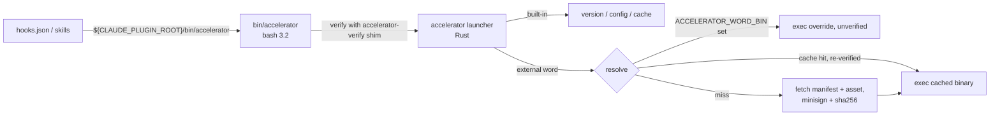

# Full CLI surface: commands, subcommands, switches, and configuration/environment variables

**Date**: 2026-10-03 16:09 UTC
**Author**: Toby Clemson
**Git Commit**: 8e89034225f28472cf1ed499a3d3e0b13859406f
**Branch**: detached working-copy change (`ssmwptlozppy`), not pushed
**Repository**: accelerator

## Research Question

Produce a report of the full CLI surface area: all commands, subcommands,
switches, and the configuration and environment variables associated with
each.

## Summary

The CLI is one bash bootstrap, one Rust launcher, and ten dispatched
sub-binaries, plus a signature-verifier shim. The launcher implements three
built-ins itself: `version`, `config` and `cache`. Every other first word is
`exec`'d as `accelerator-<word>`. That binary is resolved in this order: an
`ACCELERATOR_<WORD>_BIN` override, then the version-scoped cache, then a
signed-manifest fetch.

| Word | Binary | Commands | Reads config? |
|---|---|---|---|
| *(built-in)* | `accelerator` | `version`, `config` (19 leaves), `cache` (4) | yes, all keys via `config` |
| `vcs` | `accelerator-vcs` | `detect`, `status`, `log`, `root`, `tracking`, `guard` | no |
| `corpus` | `accelerator-corpus` | `adr`, `metadata`, `linkage`, `frontmatter`, `resolve` | `paths.*` |
| `work` | `accelerator-work` | 11: `resolve` … `sync` | `work.*`, `paths.*`, tracker blocks |
| `migrate` | `accelerator-migrate` | flag-driven, no subcommands | `paths.*`, `templates.*`, `work.*` |
| `jira` | `accelerator-jira` | 10 incl. `init`, `fields` groups | `jira.*`, `paths.integrations` |
| `linear` | `accelerator-linear` | 7 incl. `init` group | `linear.*`, `paths.integrations` |
| `collaboration` | `accelerator-collaboration` | `pr base-repo`, `pr update-body` | `github.token(_cmd)` |
| `design` | `accelerator-design` | 7 incl. `executor` | `design.browser_path`, `paths.tmp` |
| `research` | `accelerator-research` | `fetch`, `topic outstanding`, `guard` | `openalex.*`, `agents.researcher`, `paths.*` |
| `visualiser` | `accelerator-visualiser` | `start`, `stop`, `status`, `serve` | `visualiser.*`, `paths.*`, `work.*` |
| *(reserved)* | `accelerator-verify` | three positionals, bootstrap-only | no |

Configuration is a 65-key catalogue (`cli/config/src/catalogue.rs`), plus
presence-only "extra" keys. Settings come from `.accelerator/config.md` (team
level) and `.accelerator/config.local.md` (personal level), and the personal
level overrides the team level. Six credential/path keys are consent keys
that the team level may not set. There are roughly 60 environment variables
in five families:

- dispatch and bootstrap (`ACCELERATOR_CACHE_DIR`, `ACCELERATOR_*_BIN`, …)
- the credential ladder (`ACCELERATOR_JIRA_TOKEN`, `GH_TOKEN`, …)
- per-binary behaviour (`ACCELERATOR_MIGRATE_FORCE`, `ACCELERATOR_VISUALISER_IDLE_TIMEOUT`, …)
- test seams (`ACCELERATOR_*_API_URL`, loopback-feature variables)
- variables the launcher and `design` export to their children

Exit codes share a common base: 0 for success, 1 for a failure, 2 for a
refusal or usage error. Four binaries build on it:

- `jira`, `linear` and `work` define rich numeric vocabularies.
- `corpus resolve` reserves codes 3, 4 and 6.
- The launcher itself remaps clap usage errors from 2 to 1.

Most of this report comes from reading the code; only one item was checked by
running it. The divergences found between code, docs and catalogue are listed
under [Discrepancies and defects](#discrepancies-and-defects):

- ✅ `corpus frontmatter validate --dir <relative>` silently passes a broken
  corpus. This was reproduced by running it.
- `visualiser.binary` and `ACCELERATOR_VISUALISER_RELEASES_URL` are
  documented but never read.
- `linear update` drops `--assignee-id`/`--priority`, and it blanks whichever
  of title/description is omitted.

## Detailed Findings

### 1. Invocation chain and dispatch

**Bootstrap (`bin/accelerator`)**:

1. Scans argv for `--fail-safe` before `--`. If found, every bootstrap abort
   exits 0 instead of 1 (`bin/accelerator:35-54`).
2. Resolves the plugin root through at most 16 symlink hops and exports
   `ACCELERATOR_PLUGIN_ROOT` (`:95-122`).
3. Detects the platform (`darwin|linux` × `arm64|x64`, `:125-137`) and reads
   the version from `.claude-plugin/plugin.json` (`:139-144`).
4. Stages the vendored `accelerator-verify-<platform>` shim into the cache
   under its sha256 name (`:300-352`).
5. Fetches the launcher if needed, under the mkdir lock
   `.accelerator-lock-<platform>`, and verifies it with minisign
   (`:404-453`).
6. `exec`s the launcher (`:457`).

A developer override bypasses verification. It needs all three of these to
hold: `ACCELERATOR_ALLOW_UNVERIFIED_LAUNCHER=1`, a `.accelerator-dev-launcher`
marker file, and `ACCELERATOR_LAUNCHER_BIN` pointing inside `cli/target/`
(`:228-254`).

**Launcher (`cli/launcher`)**: clap is given `disable_version_flag`, so there
is no `--version` flag; the `version` subcommand replaces it. Unknown words
fall into `#[command(external_subcommand)]`
(`cli/launcher/src/launch/inbound/cli.rs:9-35`). The dispatch table is not
hard-coded. Any non-built-in word is looked up in the signed `manifest.json`
under `binaries[<word>]` (`resolve/manifest.rs:147-154`). The build publishes
the ten words in `tasks/shared/paths.py:29-40` (`DISPATCHED_SUBBINARIES`), and
`verify` and `launcher` are reserved (`tasks/shared/dispatch_coherence.py:47`).

Resolution runs in order (`cli/launcher/src/main.rs:107-125`):

1. **Override.** If `ACCELERATOR_<WORD>_BIN` is non-empty, it is exec'd
   unverified. The name is the word uppercased with `-` mapped to `_`
   (`launch/core.rs:399-424`, `launch/outbound/mod.rs:23-49`).
2. **Cache root.** `ACCELERATOR_CACHE_DIR`, else
   `${ACCELERATOR_PLUGIN_ROOT}/bin`, else the error `CacheRootUnavailable`
   (`resolve/cache_root.rs:36-74`).
3. **Cache hit.** The binary is `<word>-<version>-<sha>` with a `.minisig`
   beside it. Its sha256 and signature are re-verified on every hit; a failure
   triggers a refetch (`resolve/mod.rs:181-234`).
4. **Fetch.** `manifest.json` and `manifest.minisig` come from
   `ACCELERATOR_RELEASE_BASE_URL`, or by default from
   `https://github.com/atomicinnovation/accelerator/releases/download/v<ver>`.
   - The manifest's `version` must equal the launcher's version
     (anti-rollback).
   - The asset is checked by sha256 and minisign before an atomic write
     (`main.rs:56-65`, `resolve/manifest.rs:111-144`).
   - Transport is HTTPS-only, and redirects are confined to `github.com` and
     `*.githubusercontent.com`. A dispatch fetch gets 3 attempts, a 10 s
     connect timeout and a 300 s total; a help fetch gets 1 attempt and 5 s
     (`resolve/fetcher.rs:12-34,158-187`).
5. **Exec.** The child inherits the full environment and replaces the
   launcher process (`launch/outbound/exec.rs:14-23`).

**Dispatch-failure switches.** The launcher scans argv before `--` for two
switches. Every sub-binary accepts them only as no-ops, for the launcher's
benefit:

- `--fail-safe`: an *availability* failure exits 0 with a warning.
- `--non-blocking`: an *integrity* refusal exits 1 instead of 2. Without it,
  integrity failures exit 2 even under `--fail-safe` (`launch/core.rs:226-291`).

**`design`-only pre-dispatch.** For `design`, the launcher clears
`ACCELERATOR_TREE_*` and `ACCELERATOR_LAUNCHER_PATH`. It then exports
`ACCELERATOR_LAUNCHER_PATH=current_exe()` and an `ACCELERATOR_TREE_<ARTIFACT>`
for each browser or driver tree that is already materialised
(`main.rs:424-488`, `launch/core.rs:433-464`).

**Help.** Three forms get help:

- **Root help:** `accelerator --help`, `-h` or `help` renders built-ins plus
  every manifest `binaries` entry, with control characters stripped. It falls
  back to built-ins only if the manifest fetch fails (`main.rs:135-166`,
  `launch/help.rs:30-47`).
- **Bare `accelerator`:** prints the same listing, followed by a stderr cue,
  and exits **1**.
- **Sub-binary help:** `accelerator <word> --help` passes through to the
  child unchanged.

### 2. Launcher built-ins

#### `accelerator version`

No arguments. Prints `accelerator <ver>`, `commit:`, `built:` and `target:`,
from `CARGO_PKG_VERSION` and the vergen `VERGEN_GIT_SHA`,
`VERGEN_BUILD_TIMESTAMP` and `VERGEN_CARGO_TARGET_TRIPLE` values captured at
compile time (`cli/launcher/src/version/inbound/cli.rs:7-15`).

#### `accelerator config <action>`

Two flags are shared by every read action:

- `--allow-legacy-layout`: read `.claude/accelerator(.local).md` when no
  `.accelerator/` config exists.
- `--fail-safe`: on a read failure, print nothing or an `Unavailable` notice
  and exit 0. A refusal still fails (`config_command/inbound/cli.rs:478-497`).

`config --help` appends a "Recognised keys:" block (`launch/help.rs:52-78`).
Definitions are at `cli/launcher/src/launch/inbound/cli.rs:92-366`.

| Action | Positionals | Switches (beyond the shared pair) | Notes |
|---|---|---|---|
| `get` | `<KEY>` | `--default <V>`, `--level team\|personal`, `--explain` | `--explain` writes provenance to stderr |
| `set` | `<KEY> <VALUE>` | `--level team\|personal` (default `personal`) | no shared flags |
| `init` | — | — | always `LegacyPolicy::Reject` |
| `path` | `<KEY> [DEFAULT]` | `--level`, `--explain` | reads `paths.<key>` |
| `agent` | `<NAME>` | — | default `accelerator:<name>` |
| `agents` | — | — | |
| `work` | `<KEY>` | — | reads `work.<key>`; an invalid `work.integration` fails even under `--fail-safe` |
| `context` | — | `--skill <NAME>` | `.accelerator/skills/<name>/context.md` |
| `instructions` | `<SKILL>` | — | `.accelerator/skills/<skill>/instructions.md` |
| `paths` | `[ROOT]` | `--doc-types`, `--all`, `--format block\|tsv` | ⚠️ `--format` is parsed but dropped (`launch/mod.rs:94-103`) |
| `dump` | — | — | |
| `review` | `<MODE>` = `pr\|plan\|work-item` | — | |
| `summary` | — | `--format plain\|hook` | `hook` wraps output in a SessionStart envelope and also runs the consent audit |
| `template` | `<NAME>` | `--kind <K>` | tries `<name>-<kind>` first |
| `templates list` | — | — | |
| `templates show` | `<NAME>` | — | |
| `templates eject` | `[NAME]` xor `--all` | `--force`, `--dry-run` | no shared flags; existing template → refusal (2) |
| `templates diff` | `<NAME>` | — | no override → refusal (2) |
| `templates reset` | `<NAME>` | `--confirm` | no override → refusal (2) |

During config composition, the launcher dispatches
`vcs tracking --path .accelerator/config.local.md` as a captured child. The
child gets a 2 s deadline and its stdout is capped at 4 KiB
(`launch/outbound/tracking.rs:20,43-65`).

#### `accelerator cache <action>`

Artifact names are checked against `pins.toml` (`browser`, `driver`); an
unknown name is a refusal (2) (`cli/launcher/src/launch/cache.rs`).

| Action | Args / switches | Output |
|---|---|---|
| `verify [NAME]` | — | `<artifact>\tok` or `<artifact>\t<fault>\t<path>`; any fault → 1 |
| `repair [NAME]` | `--force` | `<artifact>\t<path>` |
| `ensure <NAMES>...` | at least one name | `<name>\t<tree>\t<lease>`; on failure a stderr JSON `ensure-failed` envelope with a `cause` |
| `prune` | `--older-than <secs>` (default 14 days) | `reclaimed <n> entries` |

### 3. `accelerator vcs`

None of these commands runs `git` or `jj` as a subprocess. Everything is done
in-process through `gix` and `jj-lib`. `ACCELERATOR_LOG` is honoured (via
`init_if_requested`). There is no `--version` flag.

| Command | Switches | stdin | Output | Exit |
|---|---|---|---|---|
| `detect` | `--format hook` (ignored), `--descriptive`, `--fail-safe` | — | SessionStart `additionalContext` JSON (the VCS cheat sheet, plus a workspace-boundary block when one applies) | 0; 1 on probe failure without `--fail-safe` |
| `status` | `--fail-safe` (launcher-only) | — | `Branch: …` + changed paths, or `(status unavailable)` | always 0 |
| `log` | `--fail-safe` (launcher-only) | — | ≤5 `<12-char id> <subject>` lines, or `(log unavailable)` | always 0 |
| `root` | — | — | canonical working-copy root | 1 outside a repo |
| `tracking` | `--path <PATH>` (required) | — | `tracked` \| `untracked` | 1 when indeterminate |
| `guard` | `--format hook` (ignored), `--fail-safe` | PreToolUse JSON `.tool_input.command` | nothing (allow), a deny decision (pure jj), or a `systemMessage` (colocated) | 0; 1 on probe failure without `--fail-safe` |

`guard` behaviour (`cli/vcs/src/guard.rs:19-157`):

- It blocks the first `git ` segment whose `` is one of: `status`,
  `diff`, `add`, `commit`, `log`, `branch`, `checkout`, `switch`, `merge`,
  `rebase`, `reset`, `stash`, `show`.
- Segments are split on unquoted `&&`, `||`, `;` and `|`.
- A command starting `gh ` or `rtk ` is always allowed.
- In `Git` mode, every command is allowed.

Relevant environment and VCS-native settings:

- **jj snapshot (`status`):** reads `JJ_CONFIG`, `HOME`, `XDG_CONFIG_HOME`
  and the platform config dir, plus jj's `snapshot.max-new-file-size`
  (default 1 MiB).
- **Git excludes:** reads `core.excludesFile` (`cli/vcs-adapters/src/library/jj_config.rs`,
  `git_excludes.rs`).

### 4. `accelerator corpus`

There is no `--version` flag. A clap usage error exits 2.
`kernel::Error::Refusal` is never constructed here, so in practice every
failure except `resolve`'s codes exits 1.

| Command | Positionals | Switches | Config | Output / exit |
|---|---|---|---|---|
| `adr next-number` | — | `--count <N>` (default 1, validated by hand → 1), `--fail-safe` | `paths.decisions` | zero-padded numbers; a missing dir warns and starts at 0001 |
| `adr read-status` | `[FILE]` (missing → 1) | — | — | `status:` value |
| `metadata derive` | — | `--filename-timestamp-format date-time-underscored\|compact-time\|date-only` | — | 4 labelled lines (UTC time, filename stamp, revision, repo); runs `date +%z` as a subprocess, so `TZ` and `PATH` matter |
| `linkage extract` | `<FILE>` | `--source-type <T>` | all 14 doc-type `paths.*` | TSV `source_type key target_ref anchor band` |
| `frontmatter validate` | — | `--dir 
`…, `--file 
`…, `--checks structure,references` | all 14 doc-type `paths.*` | violations on stderr, `<path>: <CODE> — <msg>`; 1 if any |
| `frontmatter print-schema` | — | — | — | one-line JSON schema |
| `resolve` | `<SLUG>` | `--type <linkage-type>` (required) | `paths.<type>` | absolute path; exit 0/1/2/3/4/6 (see §16) |

`resolve --type` accepts: `work-item`, `plan`, `plan-validation`,
`pr-description`, `adr`, `codebase-research`, `issue-research`,
`design-inventory`, `topic-research`, `design-gap`, `plan-review`,
`work-item-review`, `pr-review`, `note`.

✅ **`frontmatter validate --dir` with a relative path is broken.** A
relative path (`meta/x` or `./meta/x`) yields no output and exits 0 even
when the directory contains a fenceless file. The same directory given as an
absolute path, or the bare command, reports `NO-FENCE` and exits 1. This was
reproduced against `1.24.0-pre.73` in a throwaway project. The cause is that
the doc-type table is joined to the project root, while relative walks yield
relative paths, so `doc_type::infer` filters every file out
(`cli/corpus-cli/src/main.rs:118-121`, `cli/corpus/src/doc_type.rs:226-238`).

### 5. `accelerator work`

There is no `--version` flag. `ACCELERATOR_LOG` is **not** honoured, because
logging is never initialised. The write commands (`create`, `update`, `sync`)
refuse when the personal config is being ignored as insecure.

| Command | Positionals | Switches |
|---|---|---|
| `resolve` | `<input>` (path, full ID, or number) | — |
| `template-hints` | `<field>` | — |
| `show` | `<path>` | `--field <name>` |
| `diff` | `<local> <remote>` | — |
| `create` | `<title> <kind> <priority>` | `--status` (draft), `--parent`, `--tag`…, `--block`…, `--blocked-by`…, `--derived-from`…, `--relates-to`…, `--source`, `--project`, `--author`, `--producer` (accelerator-work), `--body-file`, `--push`, `--dry-run` |
| `update` | `<path>` | `--set K=V`…, `--add-tag`…, `--remove-tag`…, `--append K=V`…, `--remove K=V`… (K ∈ blocks/blocked_by/derived_from/relates_to), `--push` |
| `link-external-id` | `<path> <external_id>` | — |
| `canonicalise-id` | `<input>` | — |
| `next-number` | — | `--project`, `--count` (1) |
| `list` | `[term]` | `--status`, `--kind`, `--priority`, `--parent`, `--tag`…, `--hierarchy` |
| `sync` | — | `--push-only` ⊕ `--pull-only`, `--preview`, `--resolve <id>=remote\|local\|skip`…, `--per-item-reads`, `--max-pulls <N\|unlimited>`, `--max-pushes <N\|unlimited>`, `--allow-unbounded`, `--target <token>`… |

`sync` prints TSV lines `<id>\t<action>\t<state>\t<detail>`, then a
`#\tdiscovery` line and a `#\tsummary` line (`cli/work-cli/src/sync.rs:203-283`).

Config reads:

- `work.id_pattern`, and `work.key` with `work.default_project_code` as its
  deprecated fallback: every ID-scheme command.
- `paths.work`: every command except `show`, `diff` and `link-external-id`.
- `paths.templates` and `templates.work-item`: `create` and `template-hints`.
- `work.integration` and `paths.integrations`: `create --push/--dry-run`,
  `update --push`, `sync`, and the `list` Sync column.
- `<tracker>.pull.*` and `<tracker>.push.max_items`: `sync`.

The tracker credentials and environment variables are those listed under
§7, §8 and §15. `ACCELERATOR_PLUGIN_ROOT` locates the template fallback.

⚠️ `create --push` exits **0** on `local-save`, which also covers "no tracker
configured" (72/73/74 downgraded). Only `loud-terminal` exits 71.

### 6. `accelerator migrate`

Flag-driven, with no subcommands. The first matching mode wins, in this order
(`cli/migrate-cli/src/main.rs:113-156`):

1. `--discoverability-hook`
2. `--skip <id>`
3. `--unskip <id>`
4. `--unapply <id>`
5. decisions-file checks
6. `--list`
7. default run

| Switch | Effect |
|---|---|
| `--skip <id>` / `--unskip <id>` / `--unapply <id>` | edit `.accelerator/state/migrations-{skipped,applied}` under the run lock; ids are not validated against the registry |
| `--list` | `<pos>\t<key>\t<proposed>\t<path>:<anchor>` for pending interactive transformations |
| `--decisions-file <path>` | `accept` / `skip` / `edit <v>` per line; `#` is **not** a comment |
| `--discoverability-hook` | SessionStart `systemMessage` when the ledger is behind; never composes config |
| `--format hook` | parsed, unused |
| `--fail-safe` | launcher-only |

Environment variables:

- `ACCELERATOR_MIGRATE_FORCE`: any non-empty value skips the dirty-tree
  pre-flight.
- `ACCELERATOR_MIGRATE_DECISIONS_FILE`: fallback for `--decisions-file`.
- `ACCELERATOR_LOG`: honoured; a malformed value warns.

The registry holds ten migrations, `0001` to `0010`. Only
`0007-unify-meta-corpus-frontmatter` is interactive
(`cli/migrate/src/registry.rs:71-84`).

### 7. `accelerator jira`

Every networked command builds its client through `context::build_client`.
That compose step resolves the credential ladder, the `jira.pull.max_pages`
caps and `ACCELERATOR_JIRA_API_URL`. JSON output carries an injected
`"outcome"` field.

| Command | Positionals | Switches |
|---|---|---|
| `create` | — | `--summary` (runtime-required), `--type`/`--issuetype`, `--issuetype-id`, `--project`, `--body` \| `--body-file`, `--assignee`, `--reporter` (`@me` or accountId), `--priority`, `--label`…, `--component`…, `--parent`, `--custom SLUG=VALUE`…, `--emit json\|key`, `-q` (unused) |
| `update` | `<KEY>` | `--summary`, `--body`/`--body-file`, `--priority`, `--assignee`, `--reporter`, `--parent`, `--label`… \| `--add-label`/`--remove-label`, `--component`… \| `--add-component`/`--remove-component`, `--custom`…, `--no-notify`, `-q` |
| `show` | `<KEY>` | `--comments N`, `--fields` (`*all`), `--expand` (`names,schema,transitions`), `--render-adf` / `--no-render-adf` |
| `search` | — | `--project` \| `--all-projects`, `--status`…, `--label`…, `--assignee`…, `--type`…, `--component`…, `--reporter`…, `--parent`… (prefix `~` negates), `--text`…, `--watching`, `--jql`, `--field`…, `--limit` (50), `--page-token`, `--render-adf`, `-q` |
| `comment add` / `edit` | `<KEY> [<COMMENT_ID>]` | `--body` \| `--body-file`, `--visibility role:N\|group:N`, `--no-notify`, `-q` |
| `comment list` | `<KEY>` | `--page-size` (50, 1–100), `--first-page-only`, `-q` |
| `comment delete` | `<KEY> <COMMENT_ID>` | `--no-notify`, `-q` |
| `transition` | `<KEY> [STATE]` | `--state`, `--transition-id`, `--resolution`, `--comment` \| `--comment-file`, `--no-notify`, `-q` |
| `attach` | `<KEY> <FILES>...` | `-q` (ignored); paths confined to the project root |
| `init` | `[verify\|discover\|prompt-default\|refresh-fields\|list-projects\|list-fields]` | bare = verify → discover → prompt-default |
| `fields` | `refresh` \| `resolve <QUERY>` \| `list` | — |
| `resolve-fields` | — | `--file <work-item>` \| `--kind story\|bug\|epic\|task\|spike`, `--project`, `--id`; builds no client |

Config keys:

- **Site and identity:** `jira.site` (exit 27 if missing), `jira.email`
  (exit 28).
- **Token:** `jira.token` / `jira.token_cmd` (exit 24 if neither).
- **Site allowlist:** `jira.allowed_sites`, a consent key.
- **Project:** `jira.project_key`, required to build any client (exit 100);
  falls back to `work.default_project_code` when `work.integration: jira`.
- **Pagination caps:** `jira.pull.max_pages`.
- **State directory:** `paths.integrations`.

State files are written to `<integrations>/jira/`: `site.json`,
`projects.json`, `fields.json` and `.cache-version.json`.

### 8. `accelerator linear`

| Command | Positionals | Switches |
|---|---|---|
| `create` | `[FILE]` | `--title`, `--body-file`, `-q` (ignored) |
| `update` | `<ID>` | `--title`, `--description`, `--state`, `--assignee-id`, `--priority`, `-q` |
| `show` | `<ID>` | `--comments N` |
| `search` | — | `--state`, `--assignee`, `--label`, `--text`, `--limit` (unused), `-q` |
| `comment add` | `<ID>` | `--body` \| `--body-file`, `-q` |
| `transition` | `<ID> [STATE]` | `--state`, `-q` |
| `attach` | `<ID>` | `--url` ⊕ `--file`, `--title`, `-q` |
| `init verify` / `list-teams` / `discover` | — | `discover`: `--team-id <ID>` (required), `--force` |

Config keys:

- **Token:** `linear.token` / `linear.token_cmd`.
- **Team id:** `linear.team_id`, falling back to the catalogue's base team.
- **Team key:** `linear.team_key`, falling back to
  `work.default_project_code` (when `work.integration: linear`), then the
  catalogue. `init discover` **writes this key back to the team-level
  `config.md`**; overwriting an existing value needs `--force` or a TTY
  confirmation.
- **Pagination caps:** `linear.pull.max_pages`.
- **State directory:** `paths.integrations`.

State files are written to `<integrations>/linear/`: `viewer.json` and
`catalogue.json` (committed).

⚠️ Client construction resolves the team before anything else. A fresh
repository with no `linear.team_id` and no catalogue therefore fails every
command with exit 105, including `init verify` and `init list-teams`
(`cli/linear-client/src/auth.rs:65-97`).

### 9. `accelerator collaboration`

| Command | Positionals | Switches | Output |
|---|---|---|---|
| `pr base-repo` | `<PULL_NUMBER>` (u64) | — | `owner/repo` (follows the fork `parent`) |
| `pr update-body` | `<PULL_NUMBER>` | `--body-file <PATH>` (required, read first) | silent |

The binary talks to GitHub through octocrab REST and never shells out to
`gh`. The origin remote is read via `gix`.

- **Token ladder:** `GH_TOKEN` → `GITHUB_TOKEN` → personal `github.token` →
  personal `github.token_cmd` → team `github.token`. The team-level value is
  used only when the personal file is absent.
- **Token command environment:** `github.token_cmd` runs as `bash -c`
  under `env_clear`. Only `PATH` (filtered), `HOME`, `TERM`,
  `XDG_CONFIG_HOME`, `XDG_RUNTIME_DIR`, `DBUS_SESSION_BUS_ADDRESS`,
  `GH_HOST` and `GH_CONFIG_DIR` are passed through. It has a 30 s timeout
  and a 64 KiB output cap.
- **API base:** `ACCELERATOR_COLLABORATION_GITHUB_API_URL` overrides
  `https://api.github.com`. An unparseable value is silently ignored.
- **Logging:** `ACCELERATOR_LOG` is not honoured.

### 10. `accelerator design`

| Command | Positionals | Switches | Output / exit |
|---|---|---|---|
| `validate-source` | `<LOCATION>` | `--allow-internal`, `--allow-insecure-scheme` | silent 0; verdict 1 |
| `resolve-auth` | — | — | `header` \| `form` \| `none`; partial credential set → 2 |
| `scrub-secrets` | `<FILE>` | — | leak → 1 (value never printed); missing file → 2 |
| `notify-downgrade` | — | `--reason <9-value enum>` (required), `--from`, `--to` (ignored) | fixed notice |
| `audit-cue-phrases` | `<FILE>` | — | uncued H2 → 1 |
| `notices` | — | `--artifact driver\|browser` | NOTICES listing; nothing materialised → 1 |
| `executor` | `<COMMAND> [ARGS...]` | `--allow-internal`, `--allow-insecure-scheme` (must come **before** `COMMAND`) | exec's the Node client; downgrade → **3** |

`executor` accepts the commands `ping`, `daemon-status`, `daemon-stop`,
`navigate`, `snapshot`, `links`, `screenshot`, `evaluate`, `click`, `type` and
`wait_for` (`cli/design/src/executor/forwardable.rs:20-32`). The clap
doc-comment lists fewer.

Config keys:

- `design.browser_path`: a path-consent key, settable at the personal level
  or through `ACCELERATOR_DESIGN_BROWSER_PATH` only.
- `paths.tmp`: the state directory is
  `<tmp>/inventory-design-playwright/{bundled|custom-<hash>}`.

Environment variables:

- **Credentials:** `ACCELERATOR_BROWSER_{AUTH_HEADER,LOCATION,USERNAME,PASSWORD,LOGIN_URL}`.
- **Set by the launcher:** `ACCELERATOR_TREE_{DRIVER,BROWSER}` and
  `ACCELERATOR_LAUNCHER_PATH`.
- **Required:** `ACCELERATOR_PLUGIN_ROOT`.
- **Exported to Node:** `ACCELERATOR_PLAYWRIGHT_STATE_DIR`, `NODE_PATH`,
  `ACCELERATOR_PLAYWRIGHT_NS_ROOT`, `ACCELERATOR_DESIGN_BROWSER_EXECUTABLE`,
  and `ACCELERATOR_PLAYWRIGHT_IDENTITY_FD=3`. The daemon receives only
  `PATH`, `HOME` and `TMPDIR` alongside these.

### 11. `accelerator research`

| Command | Positionals | Switches | Output / exit |
|---|---|---|---|
| `fetch` | `<openalex\|arxiv> <search\|lookup> [TERMS...]` | `--limit <1–25>` (default 10) | one-line JSON with `status:ok` or `status:unavailable` (both exit 0); usage errors → 2; key/client failures → 1 |
| `topic outstanding` | `<SLUG>` | `--profiles-dir <DIR>` (required) | one-line JSON `{items,pairs,skipped,warnings}` |
| `guard` | — | `--fail-safe`, `--non-blocking` (launcher-only) | PreToolUse JSON on stdin; block → 2 |

`guard` confines `agents.researcher` (default `accelerator:researcher`) in
two ways:

- **Bash:** only commands starting `accelerator research fetch `, with a
  metacharacter lexer.
- **Writes:** only to `<paths.research_topics>/<set>/findings/<name>.md`.

A parse error in `guard` exits **0**, so the hook never blocks by accident
(`cli/research-cli/src/main.rs:88-102`).

Config keys: `openalex.api_key` / `openalex.api_key_cmd` (env
`ACCELERATOR_OPENALEX_API_KEY` / `_CMD`), `paths.tmp` for the arXiv pacing
lock files, `paths.research_topics`, and `agents.researcher`. Calls have a
100 s budget and requests a 30 s budget.

### 12. `accelerator visualiser`

clap has `version` enabled here, so `--version`/`-V` exist, unlike every
other binary.

| Command | Switches | Output / exit |
|---|---|---|
| *(global)* | `--owner-pid <PID>` | used by `start` and `serve` only |
| `start` | — | `**Visualiser URL**: http://127.0.0.1:<port>` (reuses a live server); errors as stdout JSON `{"error":…}`, exit 1 |
| `stop` | — | JSON `status`: `not_running` \| `stopped` \| `refused` \| `failed` |
| `status` | — | JSON `running` (with url and pid) \| `stopped` |
| `serve` | `--owner-start-time <secs>` | foreground daemon; pre-logging failures → 2, `run` errors → 1 |

The skill invocation is `accelerator visualiser --owner-pid $PPID
${ARGUMENTS:-start}` (`skills/visualisation/visualise/SKILL.md:30`). State
lives in `<paths.tmp>/visualiser/` (mode 0700): `server-info.json`,
`server.pid`, `server-stopped.json`, `launcher.lock`,
`server.bootstrap.log`, and `server.log` (rotated at 5 MiB, 3 kept).

Config keys:

- `paths.tmp`.
- `paths.tickets` / `paths.work`, for the migration-debt check.
- All 14 doc-type `paths.*`, plus `paths.templates` and `templates.<name>`.
- `work.id_pattern` and `work.key`.
- `visualiser.kanban_columns`.
- `visualiser.idle_timeout` (default `8h`; `never` or `0` disables).
- `visualiser.editor` and `visualiser.editor_project`.

Environment variables:

- **Required by `serve`:** `ACCELERATOR_PLUGIN_ROOT`.
- **Overrides:** `ACCELERATOR_VISUALISER_IDLE_TIMEOUT`,
  `ACCELERATOR_VISUALISER_EDITOR`, `ACCELERATOR_VISUALISER_EDITOR_PROJECT`.
- **Logging:** `RUST_LOG`, not `ACCELERATOR_LOG`.
- **`dev-frontend` feature only:** `E2E_SERVER_HOST` and
  `ACCELERATOR_VISUALISER_E2E_INSECURE`.

### 13. `accelerator-verify`

`accelerator-verify <public-key-file> <signature-file> <target-file>` takes
raw `args_os`, with no clap and no switches. It exits 0 for a valid
non-legacy minisign signature and 1 otherwise, including a wrong argument
count. It reads no environment variables and no config
(`cli/verify/src/main.rs`). It is reserved from dispatch and used only by
the bootstrap.

### 14. Hook wiring (`hooks/hooks.json`)

| Event | Matcher | Command |
|---|---|---|
| SessionStart | — | `accelerator vcs detect --format=hook --fail-safe --descriptive` |
| SessionStart | — | `accelerator config summary --format=hook --fail-safe` |
| SessionStart | — | `accelerator migrate --discoverability-hook --format=hook --fail-safe` |
| SessionStart | — | `hooks/launcher-link-refresh.sh` (keeps `${CLAUDE_PLUGIN_DATA}/bin/accelerator` → bootstrap symlink; always exits 0) |
| PreToolUse | `Bash` | `accelerator vcs guard --format=hook --fail-safe` |
| PreToolUse | `Bash` | `accelerator research guard --fail-safe --non-blocking` |
| PreToolUse | `Write\|Edit\|MultiEdit\|NotebookEdit` | `accelerator research guard --fail-safe --non-blocking` |

Every hook command uses the full `${CLAUDE_PLUGIN_ROOT}/bin/accelerator`
path.

### 15. Environment variables (consolidated)

**Dispatch and bootstrap**

| Variable | Read by | Effect / default |
|---|---|---|
| `ACCELERATOR_PLUGIN_ROOT` | launcher, `work`, `design`, `visualiser` | exported by the bootstrap; default cache root is `<it>/bin`; template and plugin-file root; required by `visualiser serve` and `design executor` |
| `ACCELERATOR_CACHE_DIR` | bootstrap, launcher, link-refresh hook | cache directory; default `<plugin_root>/bin` |
| `ACCELERATOR_RELEASE_BASE_URL` | bootstrap, launcher | release asset base URL |
| `ACCELERATOR_<WORD>_BIN` | launcher | unverified sub-binary override, e.g. `ACCELERATOR_VCS_BIN` |
| `ACCELERATOR_LOG` | launcher (always; malformed → exit 1), `vcs`, `migrate` (malformed → warn) | tracing `EnvFilter` to stderr; ignored by every other sub-binary |
| `ACCELERATOR_ALLOW_UNVERIFIED_LAUNCHER`, `ACCELERATOR_LAUNCHER_BIN` | bootstrap | developer launcher override (also needs the marker file) |
| `ACCELERATOR_UNAME_S`, `ACCELERATOR_UNAME_M`, `ACCELERATOR_BOOTSTRAP_DOWNLOADER`, `ACCELERATOR_LOCK_MAX_WAIT` | bootstrap | test seams; the lock wait defaults to 300 ticks of 0.1 s |
| `CLAUDE_PLUGIN_ROOT`, `CLAUDE_PLUGIN_DATA` | `hooks.json`, link-refresh hook | set by Claude Code |

**Credential ladder** (`cli/config/src/catalogue.rs:203-265`,
`cli/config/src/credentials.rs:194-256`)

| Variable | Key it overrides | Consumers |
|---|---|---|
| `ACCELERATOR_JIRA_TOKEN` / `_CMD` | `jira.token` / `jira.token_cmd` | `jira`, `work` |
| `ACCELERATOR_JIRA_ALLOWED_SITES` | `jira.allowed_sites` | `jira`, `work` |
| `ACCELERATOR_LINEAR_TOKEN` / `_CMD` | `linear.token` / `linear.token_cmd` | `linear`, `work` |
| `GH_TOKEN`, then `GITHUB_TOKEN` | `github.token` | `collaboration` |
| `ACCELERATOR_OPENALEX_API_KEY` / `_CMD` | `openalex.api_key(_cmd)` | `research fetch openalex` |
| `ACCELERATOR_DESIGN_BROWSER_PATH` | `design.browser_path` | `design executor` |
| `PATH`, `HOME`, `TERM`, `XDG_CONFIG_HOME`, `XDG_RUNTIME_DIR`, `DBUS_SESSION_BUS_ADDRESS` (+ `GH_HOST`, `GH_CONFIG_DIR` for GitHub) | — | the only variables passed to a `*_cmd` child; `TMPDIR` sets its working directory |

**Per-binary behaviour**

| Variable | Binary | Effect |
|---|---|---|
| `ACCELERATOR_MIGRATE_FORCE` | `migrate` | skip the dirty-tree pre-flight |
| `ACCELERATOR_MIGRATE_DECISIONS_FILE` | `migrate` | fallback for `--decisions-file` |
| `ACCELERATOR_VISUALISER_IDLE_TIMEOUT` / `_EDITOR` / `_EDITOR_PROJECT` | `visualiser` | override the matching `visualiser.*` key |
| `RUST_LOG` | `visualiser` | `server.log` filter |
| `ACCELERATOR_BROWSER_{AUTH_HEADER,LOCATION,USERNAME,PASSWORD,LOGIN_URL}` | `design` | browser auth; scanned by `scrub-secrets` |
| `ACCELERATOR_TREE_{DRIVER,BROWSER}`, `ACCELERATOR_LAUNCHER_PATH` | `design` | warm-tree paths and launcher path, both set by the launcher |
| `JJ_CONFIG`, `HOME`, `XDG_CONFIG_HOME`, `JJ_USER` | `vcs`, `work` (author), anything detecting a repo | jj and git config discovery |
| `TZ`, `PATH` | `corpus metadata derive` | consumed by the `date +%z` subprocess |

**Test seams** (release builds refuse the loopback feature)

| Variable | Binary | Notes |
|---|---|---|
| `ACCELERATOR_JIRA_API_URL` | `jira` | must be https on `*.atlassian.net`; loopback only with `test-loopback`; invalid → 2 |
| `ACCELERATOR_LINEAR_API_URL` | `linear` | `*.linear.app` https; invalid → 2 |
| `ACCELERATOR_COLLABORATION_GITHUB_API_URL` | `collaboration` | an unparseable value is ignored silently |
| `ACCELERATOR_OPENALEX_API_URL`, `ACCELERATOR_ARXIV_API_URL`, `ACCELERATOR_ARXIV_OAI_URL`, `ACCELERATOR_RESEARCH_TEST_{CALL_BUDGET_MS,CLOCK_LOG,CLOCK_EPOCH,GUARD_PANIC}` | `research` | `test-loopback` builds only |
| `E2E_SERVER_HOST`, `ACCELERATOR_VISUALISER_E2E_INSECURE` | `visualiser` | `dev-frontend` builds only; release staging rejects the string |
| `VISUALISER_API_PORT`, `VISUALISER_INFO_PATH`, `E2E_HEALTH_PORT`, `BASE_URL`, `CHROMIUM_CHANNEL`, `PLAYWRIGHT_LOCALE`, `CI` | frontend dev and e2e tooling | not read by any binary |

### 16. Configuration keys (consolidated)

Keys are read from `.accelerator/config.md` (team) and
`.accelerator/config.local.md` (personal), and personal wins. The personal
file is ignored, with a warning, if it is a symlink or readable by group or
others. Write commands then refuse. Every catalogue key is also readable by
skills through `accelerator config get|path|work|agent|…`.

| Section | Keys (default) | Read by binaries |
|---|---|---|
| `paths.*` doc types | `work` (meta/work), `plans`, `validations`, `prs`, `decisions`, `research_codebase`, `research_issues`, `research_design_inventories`, `research_design_gaps`, `research_topics`, `review_plans`, `review_work`, `review_prs`, `notes` | `corpus`, `work` (`paths.work`), `migrate`, `visualiser`, `research` (`research_topics`) |
| `paths.*` infrastructure | `templates` (.accelerator/templates), `tmp` (.accelerator/tmp), `integrations` (.accelerator/state/integrations), `global` (meta/global) | `work`, `jira`, `linear`, `design`, `research`, `visualiser`, `migrate` |
| `templates.*` | 18 names, no default | `work create`, `visualiser`, `config template` |
| `work.*` | `integration` ("", one of jira/linear/trello/github-issues), `id_pattern` ({number:04d}), `key` (""), `default_project_code` (deprecated) | `work`, `visualiser`, `migrate`, `jira`/`linear` (alias) |
| `review.*` | 11 keys (`max_inline_comments` 10, `min_lenses` 4, `max_lenses` 8, …) | none; skills read them via `config review` |
| `research.topic.*` | `breadth` 8, `depth` 1 | none; skills only |
| `agents.*` | 10 agent names (`accelerator:<name>`) | `research guard` (`agents.researcher`); otherwise skills |
| `visualiser.*` | `kanban_columns`, `idle_timeout` (8h), `editor`, `editor_project`, `binary` | `visualiser` (`binary` is never read) |
| `jira.*` | `site`, `email`, `token`, `token_cmd`†, `allowed_sites`†, `project_key`, `pull.{max_items,max_pages,additional_projects,all_projects,filters}`, `push.max_items` | `jira`, `work` |
| `linear.*` | `team_id`, `team_key`, `token`, `token_cmd`†, `pull.{…,additional_teams,all_teams}`, `push.max_items` | `linear`, `work` |
| `github.*` | `token`, `token_cmd`† | `collaboration` |
| `openalex.*` | `api_key`, `api_key_cmd`† | `research` |
| `design.*` | `browser_path`† | `design` |

† Consent key: refused at the team level and from a tracked personal file
(`catalogue.rs:273-276,475-488`). The pull and push defaults are
`max_items` 25 and `max_pages` 50. A personal tracker block replaces the
team block wholesale (`cli/tracker-support/src/block.rs:22-46`).

Non-key config files:

- `.accelerator/skills/<skill>/{context,instructions}.md`
- `.accelerator/lenses/*/SKILL.md`
- legacy `.claude/accelerator(.local).md`

### 17. Exit-code conventions

| Binary | 0 | 1 | 2 | Beyond |
|---|---|---|---|---|
| launcher | success, root help | failure, **clap usage (remapped from 2)**, bare `accelerator` | refusal / integrity | child's code via exec |
| `vcs`, `collaboration`, `corpus`, `migrate`, `design` | success | failure / verdict | refusal / usage | `corpus resolve` 3 not-found, 4 unknown type, 6 outside root; `design executor` 3 downgrade |
| `work` | clean | error | usage | 3–8 resolve/sync outcomes; 70 retryable, 71 terminal, 72 not available, 73 unrecognised, 74 unconfigured |
| `jira` | clean | error | usage | 11–34 transport/auth/JQL, 40–61 ADF/cache/init, 75–133 per-command blocks (70–74 reserved for dispatch) |
| `linear` | clean | error | usage | 11–53 transport/auth, 60–62 init, 75–138 per-command |
| `research` | success (including `unavailable`) | failure | usage / guard block | `guard` parse error → 0 |
| `visualiser` | success | operational error | `serve` pre-logging failure, usage | — |
| `verify` | valid | everything else | — | — |

### Discrepancies and defects

| # | Item | Evidence |
|---|---|---|
| 1 | ✅ `corpus frontmatter validate --dir <relative>` validates nothing and exits 0 | reproduced; §4 |
| 2 | `visualiser.binary` key: in the catalogue and SKILL.md, never read | `catalogue.rs:259`, `SKILL.md:96-111` |
| 3 | `ACCELERATOR_VISUALISER_RELEASES_URL` documented, never read; `ACCELERATOR_RELEASE_BASE_URL` is the working equivalent | `SKILL.md:113-115` |
| 4 | SKILL.md documents a `{"error":"unknown subcommand"}` reply; clap actually emits a usage error with exit 2 | `cli/visualiser/server/src/main.rs:24-38` |
| 5 | The catalogue lists no env overrides for `visualiser.editor`, `visualiser.editor_project` or `visualiser.idle_timeout`, but the server honours them | `catalogue.rs:257-258`, `compose.rs:81-90,248` |
| 6 | `config paths --format` parsed and dropped | `launch/mod.rs:94-103` |
| 7 | `linear update`: `--assignee-id` and `--priority` never sent; an omitted title or description is sent as `""`; `--state` silently ignores the other flags | `linear-cli/src/main.rs:299-342`, `linear-client/src/client.rs:699-712` |
| 8 | `linear search --limit` unused | `linear-cli/src/cli.rs:101-113` |
| 9 | Fresh Linear setup: every command, including `init verify`/`list-teams`, needs a team id → 105 | `linear-client/src/auth.rs:65-97` |
| 10 | `jira search` with `@me` always fails through the CLI (`FixedResolver::new()`) | `jira-cli/src/context.rs:204-205` |
| 11 | `jira show --comments` and `search --limit` are not range-checked (their exit codes go unused); `create -q` is never read | `jira-cli/src/main.rs:465-474` |
| 12 | `ACCELERATOR_LOG` handled three ways: fatal if malformed (launcher), warn (`vcs`, `migrate`), ignored (others); `visualiser` uses `RUST_LOG` | §15 |
| 13 | `corpus adr read-status` usage message names the retired `adr-read-status.sh` | `corpus-cli/src/adr.rs:88-123` |
| 14 | `docs-site/.../corpus.md` omits `resolve`, `print-schema` and `--filename-timestamp-format` | `corpus.md:15-20` |
| 15 | `design executor` doc-comment lists fewer commands than the allowlist | `design-cli/src/cli.rs:77-78` |
| 16 | `migrate --skip` accepts unregistered ids; in a decisions file, `#` is an error, not a comment | `migrate/src/ledger.rs:87-96`, `decisions_file.rs` |
| 17 | `--format hook` on `vcs detect`/`guard` and `migrate` has one value and is ignored | §3, §6 |
| 18 | `FIXTURES_PATH` passed to the e2e server, never read | `frontend/e2e/start-server.mjs:99` |

## Code References

- `bin/accelerator:35-457` - bootstrap: fail-safe scan, plugin root, platform, shim staging, launcher fetch, dev override
- `hooks/hooks.json:9-60` - SessionStart and PreToolUse hook commands
- `hooks/launcher-link-refresh.sh:20-89` - `CLAUDE_PLUGIN_DATA` symlink maintenance
- `cli/launcher/src/launch/inbound/cli.rs:9-366` - launcher clap tree (`version`, `config`, `cache`, external)
- `cli/launcher/src/main.rs:56-65,107-166,209-261,424-488,505-567` - base URL, resolution, help, exit mapping, design pre-dispatch
- `cli/launcher/src/launch/core.rs:226-291,399-464` - fail-safe/non-blocking, override variable names, tree env
- `cli/launcher/src/launch/outbound/resolve/` - manifest, cache root, fetcher, verifier
- `cli/config/src/catalogue.rs:34-488` - every config key, default, consent class and env override
- `cli/config/src/credentials.rs:194-256` - credential ladder
- `cli/config-adapters/src/store.rs:113-231` - project root discovery, file layout, personal-file screening, `ACCELERATOR_PLUGIN_ROOT`
- `cli/vcs-cli/src/cli.rs:12-81`, `cli/vcs/src/guard.rs:19-157` - vcs surface and guard rules
- `cli/corpus-cli/src/cli.rs:43-159`, `exit_codes.rs:25-31` - corpus surface
- `cli/work-cli/src/cli.rs:12-314`, `exit_codes.rs:74-97` - work surface
- `cli/migrate-cli/src/cli.rs:12-63`, `main.rs:63-156` - migrate surface and env
- `cli/jira-cli/src/cli.rs:21-343`, `exit_codes.rs:34-212` - jira surface
- `cli/linear-cli/src/cli.rs:18-172`, `exit_codes.rs:34-245` - linear surface
- `cli/collaboration-cli/src/cli.rs:12-36`, `main.rs:48-269` - collaboration surface
- `cli/design-cli/src/cli.rs:11-130`, `executor.rs` - design surface
- `cli/research-cli/src/cli.rs:11-78`, `main.rs:60-153`, `loopback.rs` - research surface
- `cli/visualiser/server/src/main.rs:13-153`, `orchestration/mod.rs` - visualiser surface
- `cli/verify/src/main.rs` - signature verifier
- `tasks/shared/paths.py:29-40` - `DISPATCHED_SUBBINARIES`

## Architecture Insights

- **Launcher conventions.** The words dispatched are defined by data, not
  code. The signed manifest, not the launcher source, decides which external
  words exist; `tasks/shared/dispatch_coherence.py` keeps the build and
  manifest consistent. The shared `--fail-safe` and `--non-blocking` switches
  belong to the launcher: every sub-binary declares them only so argv
  parsing does not reject them.
- **One config composition path.** `config_adapters::compose(cwd,
  LegacyPolicy)` is called by every config-reading binary, so root discovery,
  personal-file screening and legacy refusal behave the same everywhere. The
  launcher's `config` command is the one place that allows the legacy layout,
  and only behind a flag.
- **Credentials through one ladder.** Jira, Linear, GitHub and OpenAlex all
  resolve tokens through `config::credentials`. Each has the same five rungs,
  the same consent rules for `*_cmd` keys, and the same sandboxed command
  runner. Only the variable names differ.
- **Domain-specific exit codes in the tracker binaries.** `jira`, `linear`
  and `work` encode retryability and configuration state in exit codes, so
  skills can branch without parsing stderr. The other binaries stay on the
  0/1/2 base.
- **Inconsistencies.** Version flags, logging initialisation and treatment
  of the `--format` switch differ between binaries (§17, discrepancies
  6, 12 and 17). That points to no shared CLI scaffold beyond `kernel`.

## Historical Context

- `meta/decisions/ADR-0054-git-style-modular-cli-of-on-demand-static-binaries.md` - the dispatch model.
- `meta/decisions/ADR-0053-thin-cli-over-a-hexagonal-ports-and-adapters-core.md` - why the CLI crates are thin.
- `meta/decisions/ADR-0061-signed-content-addressed-tree-generations.md`, `ADR-0063-plugin-version-scoped-artifact-cache.md`, `ADR-0064-producer-signed-tree-attestation-over-a-compiled-in-digest.md` - tree artifacts and cache.
- `meta/decisions/ADR-0047-multi-level-userspace-configuration-model.md` - team and personal levels.
- `meta/decisions/ADR-0021-template-management-subcommands.md` - `config templates`.
- `meta/work/0251-env-var-overrides-in-config-crates.md` - env-over-config precedence.
- `meta/work/0258-help-show-subcommands.md` - help behaviour.
- `meta/work/0269-remove-bash-references-from-jira-linear-clients.md` - exit-code vocabulary.
- `meta/work/0226-unify-the-trust-barrier-for-consent-config-keys.md` - consent keys.
- `docs-site/src/content/docs/configuration.md`, `internals.md` - user-facing reference that this document cross-checks.

## Related Research

- `meta/research/codebase/2026-07-03-0164-launcher-and-git-style-dispatch.md`
- `meta/research/codebase/2026-08-02-0187-generalise-sub-binary-registration-surface.md`
- `meta/research/codebase/2026-09-05-0258-help-show-subcommands.md`
- `meta/research/codebase/2026-09-06-0269-remove-bash-vocabulary-and-redesign-exit-code-classification.md`
- `meta/research/codebase/2026-09-10-0228-layered-configuration-key-model.md`
- `meta/research/codebase/2026-08-06-0195-accelerator-corpus-cli-implementation-surface.md`
- `meta/research/codebase/2026-08-11-0196-design-cli-implementation-surface.md`
- `meta/research/codebase/2026-08-08-0197-accelerator-collaboration-pr-helper-cli.md`

## Open Questions

- ❓ Should all sub-binaries agree on `--version`, `ACCELERATOR_LOG`
  initialisation and the clap usage exit code? Today the launcher remaps
  usage errors to 1 while every child uses 2.
- ❓ Should `visualiser.binary` and `ACCELERATOR_VISUALISER_RELEASES_URL` be
  implemented, or removed from the catalogue and SKILL.md?
- Whether the launcher's reqwest client honours `HTTPS_PROXY`/`NO_PROXY` was
  not checked: no `.no_proxy()` call was found, but the crate feature flags
  were not inspected.
- What `gix` and `jj-lib` read from the environment on their own was not
  traced.
- Discrepancies 2–18 come from reading the code; only discrepancy 1 was
  executed. The Linear and Jira findings (7–11) need live credentials to
  confirm.
