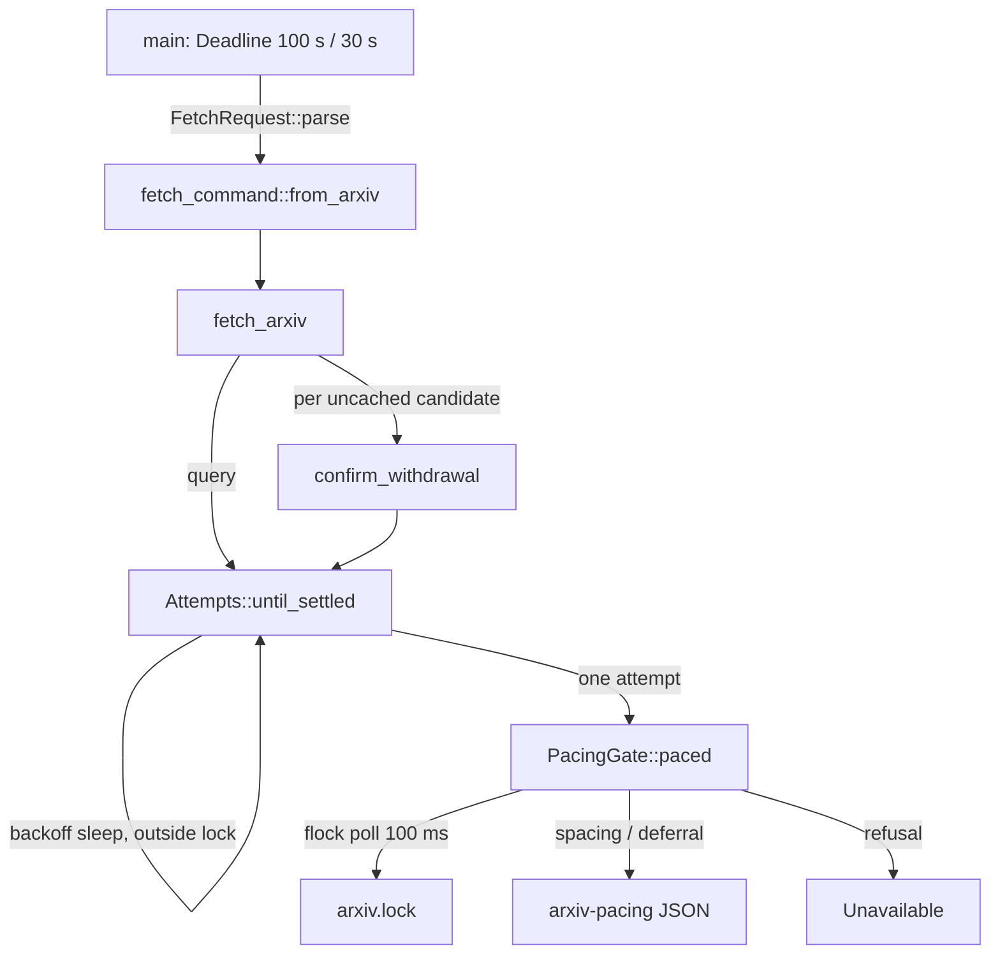

# Codebase context for 0295: a fair arXiv fetch queue that waits across calls

**Date**: 2026-10-06T00:35:10+01:00 (2026-10-05T23:35:10Z)
**Author**: Toby Clemson
**Git Commit**: 28eabf9e59fa2139cbe368c8e1dd7d3269420bb8 (working copy on
`353fa9d6`, "Review 0295 and mark it ready")
**Branch**: detached (jj working copy; not pushed)
**Repository**: accelerator

## Research Question

What does the codebase look like today for everything work item 0295
(`meta/work/0295-per-profile-batch-cap-for-arxiv-researchers.md`) touches?
That covers the arXiv pacing gate, the fetch and retry path, the
`research fetch` CLI contract, the researcher and profile prompts, test
infrastructure, and architecture constraints. Where does the existing code
support the design, and where does it conflict with the work item's
requirements?

## Summary

Every seam the story needs already exists. What needs reworking is the
gate's shape, not its surroundings.

- **The gate is a domain port wrapping one attempt.**
  `PacingGate::paced(&mut dyn FnMut() -> Attempted, &Deadline)`
  (`cli/research/src/sources/fetch.rs:93-105`) runs one HTTP attempt under
  the lock. `Attempts::until_settled` (`fetch.rs:392-450`) calls it once per
  attempt and sleeps retry backoff outside it. `fetch_arxiv` (`fetch.rs:233-291`)
  calls `until_settled` once for the query and once per uncached withdrawal
  candidate. Whole-call admission needs a new port shape that holds the lock
  across many attempts and requests.
- **The adapter is a polled, non-FIFO `flock`.** `FilePacingGate`
  (`cli/research-adapters/src/pacing.rs`) polls
  `NonBlockingLockExclusive` (rustix) on `<paths.tmp>/research/arxiv.lock`
  every 100 ms until the deadline cannot admit `POLL + per_request`. It
  persists spacing and throttle deferral in `arxiv-pacing` as wall-clock
  milliseconds. 0280 recorded the non-FIFO polling and the resulting
  starvation as an accepted risk; no queue or ticket design was ever drafted.
- **Time is already injectable across processes.** `Clock` separates
  `now() -> Instant` from `wall_now() -> SystemTime` (`fetch.rs:70-76`).
  Single-threaded fakes exist (`RecordingClock`). A binary-level
  `LoggingClock` behind the `test-loopback` feature makes waits virtual and
  pins `wall_now` to an epoch. Tests already seed persisted times by writing
  the state file directly.
- **There are no concurrency tests.** Contention is only simulated by
  flocking `arxiv.lock` from the test process. Real-time two-process tests
  exist (`cli/research-cli/tests/arxiv_pacing.rs`); nothing runs N > 2
  workers.
- **The CLI contract extends cleanly.** Output is an internally tagged
  `Document` enum (`#[serde(tag = "status")]`,
  `cli/research-cli/src/render.rs:53-67`). A `waiting` variant would render
  as `"status":"waiting"`. A ticket flag would sit next to `--limit` in
  `Command::Fetch` (`cli/research-cli/src/cli.rs:37-48`). The research guard
  checks only the command prefix and blocks `$` expansion and input
  redirection, so a ticket has to be a literal plain word.
- **The prompt side treats `unavailable` as terminal.** The arXiv profile
  says "End in exactly one of these" and caps a researcher at 3 `search` and
  5 `lookup` calls that reach the CLI
  (`skills/research/profiles/arxiv-profile/SKILL.md:40-41, 72-86`).
  Re-presentations would count against that cap unless the profile exempts
  them.
- **Seven findings bear on the work item as written**; see the Architecture
  Insights section. Two are design tensions: holding backoff under the lock
  reverses a deliberate 0280 decision, and a fixed 33 s serving window
  differs from the deadline arithmetic already in place. Three are gaps:
  `rate_limited` refusals with no cause still exist, the profile's call cap
  would count re-presentations, and the time model has to differ between
  stress and binary tests. Two resolve open items: 0161 has no evals, and
  whole-call admission closes 0280's duplicate-OAI gap.

## Detailed Findings

### Current call path

### Pacing gate (`cli/research-adapters/src/pacing.rs`)

- **Constants** (`pacing.rs:40-47`):
  - file names `arxiv.lock`, `arxiv-pacing`, `arxiv-requests.log`,
    `arxiv-contention.log`;
  - timings `SPACING` 3 s, `DEFERRAL_CEILING` 30 s, `POLL` 100 ms.
- **Construction** (`pacing.rs:58-75`): the struct holds `ScratchDir`,
  `Rc<dyn Clock>` and `Rc<dyn Diagnostics>`. The `Rc`s make it
  single-threaded, which is fine because each `fetch` is its own process.
- **`hold`** (`pacing.rs:79-110`):
  - It polls `flock(NonBlockingLockExclusive)`.
  - On `WOULDBLOCK` it checks `deadline.admits_attempt_after(now, POLL)`.
    If that fails, it reports "lock contention", appends to
    `arxiv-contention.log` and returns `Unavailable::lock_contention()`.
    Otherwise it sleeps `POLL` and tries again.
  - If the file cannot be opened, or `flock` fails with another errno, the
    gate reports it and paces without the lock (`Ok(None)`).
- **`paced`** (`pacing.rs:145-169`):
  1. Hold the lock.
  2. Read `arxiv-pacing` (corrupt reads as default) and filter it through
     `trusted_at`.
  3. `wait = wait_at(wall_now)`.
  4. If `!admits_attempt_after(now, wait)`, return
     `Unavailable::new(RateLimited)` with no cause, no log entry and no
     diagnostic (see Insight 3).
  5. Sleep the wait inside the lock.
  6. Append to `arxiv-requests.log`.
  7. Run the attempt.
  8. Re-read the state, set `last_finish`, merge any `defer_until`, and store
     it atomically.
  9. Drop the file to release the lock.
- **Pacing state** (`pacing.rs:171-245`):
  - The wait is the larger of the spacing wait (`last_finish + 3 s`, clamped
    to 0–3 s) and the deferral wait (`not_before`, clamped to 0–30 s).
  - `not_before` only moves forward and is capped at `now + 30 s`. A stored
    value more than 30 s ahead is discarded.
  - On disk it is
    `{"last_finish_ms":…,"not_before_ms":…}` (`StoredState`).
  - Spacing runs from the last *finish*. Spacing from the start let two
    requests land 2.969 s apart in 0280's real-clock suite.
- **Logs** (`pacing.rs:132-137`): one decimal epoch-millisecond line per
  event, appended through `ScratchDir::append_line` without atomic writes.
  The contention log has exactly one writer (`pacing.rs:96`).
- **`NoPacing`** (`pacing.rs:27-38`) runs the attempt and ignores the
  deadline. OpenAlex uses it.

### Fetch and retry path (`cli/research/src/sources/`)

- **Port contract** (`fetch.rs:86-105`):
  - `Attempted { defer_until: Option<SystemTime> }`.
  - `paced` returns `Result<(), Unavailable>`. The attempt's result travels
    through a captured variable, not the return value.
  - A gate `Ok` that never ran the attempt makes `until_settled` return
    `Unavailable(last_retryable or RateLimited)` (`fetch.rs:443-447`).
- **`Attempts::until_settled`** (`fetch.rs:392-450`). Each iteration:
  1. Admission check: `deadline.admits_attempt_after(now, wait)`.
  2. Backoff sleep, outside the gate (`fetch.rs:407-409`).
  3. One `gate.paced` pass. The closure sends the request, classifies the
     response, computes the deferral and runs `accept`; decoding and the
     confirmation-cache write happen inside the pass.
  4. On a gate refusal, return `Unavailable { reason: last_retryable or
     refused.reason, cause: refused.cause }` (`fetch.rs:421-426`).
  5. On `Retry`, take the next backoff from `RetrySchedule::wait_before`, or
     give up when the schedule is exhausted.
- **`Deadline`** (`cli/research/src/sources/schedule.rs:66-97`):
  - It is a pure value with `ends_at: Instant` and `per_request`.
  - `admits_attempt_after(now, wait)` is `now + wait + per_request <=
    ends_at`, inclusive.
  - `remaining(now)` saturates at zero.
  - The deadline is built in `main` before argument parsing
    (`cli/research-cli/src/main.rs:75-78`).
- **`RetrySchedule`** (`schedule.rs:25-60`):
  - `BACKOFF = [3 s, 6 s, 12 s]`.
  - `Retry-After` replaces the backoff, clamped to 30 s.
  - `wait_before` returns `None` after 3 retries, so a request makes at most
    4 attempts.
  - `deferral_after` reuses the last entry after the final attempt.
- **Classification** (`classify.rs:180-207`):
  - arXiv 403, 406 and 429 retry as `RateLimited`. These count as
    throttling, so they set a shared deferral.
  - 5xx, timeouts and connection failures retry as `UpstreamError`, with no
    deferral.
  - 3xx and other 4xx fail.
  - `Retry-After` accepts delta-seconds only (`transport.rs:119-133`).
- **`fetch_arxiv`** (`fetch.rs:233-291`):
  - One `Attempts` and one deadline cover the whole call.
  - The query is sent first. `listed_entries` filters and limits the results
    (`fetch.rs:296-311`).
  - Each withdrawal candidate (`arxiv.rs:47-68`) is skipped if this call
    already knows it. Otherwise the gate checks
    `ports.confirmations.recall(id)`, and on a miss runs
    `confirm_withdrawal`: one `until_settled` over OAI-PMH `GetRecord`
    (`request.rs:631-641`), recording the verdict inside the gate pass
    (`fetch.rs:315-334`).
  - Any unavailable or failed confirmation aborts the whole call.
- **Confirmation cache** (`cli/research-adapters/src/confirmations.rs`):
  - Stored in `arxiv-withdrawals.json` as
    `BTreeMap<unversioned, {version, withdrawn}>`.
  - It is recalled outside the lock and written by read-merge-replace inside
    the gate pass.
  - Recalling outside the lock duplicates OAI requests across parallel
    researchers; 0280 recorded this as an accepted gap.
- **`Unavailable`** (`fetch.rs:107-149`):
  - `Cause` has a single variant, `LockContention`.
  - `Reason` is `RateLimited`, `BudgetExhausted` or `UpstreamError`
    (`classify.rs:41-56`).
  - Domain types carry no serde; wire codes come from `const fn code()`.
  - `FetchOutcome` is `Records | Unavailable | Failed` (`fetch.rs:151-156`).

### CLI contract (`cli/research-cli/`)

- **Arguments** (`cli.rs:37-48`): `Fetch { family, verb, terms:
  Vec<String>, #[arg(long)] limit: Option<String> }`.
  - Every argument is a raw `String`; the domain parses them in
    `FetchRequest::parse` (`request.rs:496-532`).
  - Lookup validates `--limit` and then ignores it.
  - The help text is `FETCH_HELP` (`cli.rs:11-24`), which
    `fetch_openalex.rs:125` asserts on.
- **Dispatch**:
  - `main.rs:79-147` destructures the command and calls `fetch()`.
  - `source_call` (`main.rs:226-270`) builds `FilePacingGate` and
    `FileConfirmationCache` for arXiv over `project.research_scratch()`
    (`context.rs:42-46`, default `.accelerator/tmp/research`).
- **Rendering** (`render.rs:15-67`):
  - `Document::{Ok, Unavailable}` uses `#[serde(tag = "status", rename_all =
    "snake_case")]`.
  - `cause` and `authenticated` are skipped when `None`.
  - Ok and unavailable both exit 0, `Failed` exits 1, and usage errors exit
    2 (`main.rs:73, 281-302`).
  - The stderr summary is `research fetch: <family> <verb> unavailable
    (<reason>) after N attempts` (`render.rs:34-51`).
- **Loopback seams** (`loopback.rs`), compiled only with `test-loopback`
  and refused in release builds (`main.rs:61-66`, `tasks/build.py:359-374`):
  - `ACCELERATOR_ARXIV_API_URL` and `ACCELERATOR_ARXIV_OAI_URL` (loopback
    URLs only).
  - `ACCELERATOR_RESEARCH_TEST_CALL_BUDGET_MS`.
  - `ACCELERATOR_RESEARCH_TEST_CLOCK_LOG` / `_CLOCK_EPOCH` for the
    `LoggingClock`. In it, `sleep` logs the wait instead of sleeping,
    `now = Instant::now() + waited` and `wall_now = epoch + waited`.
- **Guard** (`cli/research/src/confinement.rs:13-29`):
  - `PERMITTED_PREFIX = "accelerator research fetch "`.
  - It also blocks `Construct::Expansion` and `InputRedirection`. The
    boundary cases are in `cli/research/tests/fixtures/guard-boundary.tsv`.
  - In 0283's step 17 the guard blocked `curl` and `for` loops that wrapped
    the fetch, so any queue has to live inside `fetch`.

### Researcher and skill consumers

- **arXiv profile** (`skills/research/profiles/arxiv-profile/SKILL.md`):
  - It grants `Bash(accelerator research fetch *)` (`:9-10`).
  - Call budget: 3 `search` and 5 `lookup` calls "that reach the CLI"
    (`:40-41`).
  - Bash `timeout` 120000 ms (`:43-45`).
  - Its Outcome section (`:70-86`) lists Records, Unavailable, Failed,
    Denied and None found. Every `unavailable` ends the researcher with no
    file. Only exit 2 and guard blocks mean "correct and continue"
    (`:85-86`).
- **OpenAlex profile**: the same structure, plus `authenticated`
  (`openalex-profile/SKILL.md:39-42, 66-80`). The web profile has no
  `unavailable`.
- **`agents/researcher.md`**:
  - It is source-agnostic; `tests/unit/tasks/test_research_structure.py:102-107`
    pins it to name no source family.
  - It has no retry or loop instruction and no turn limit. Outcome handling
    is entirely the profile's job.
- **`research-topic` reason table**
  (`skills/research/research-topic/SKILL.md:441-453`):
  - The `lock_contention` row at `:446` tells the user to lower
    `--concurrency`.
  - `conduct` never runs `fetch`. It learns of failures only from the
    researcher's summary and the files on disk (`:352-364`).
  - A docs mirror lives at
    `docs-site/src/content/docs/reference/skills/research/research-topic.md:444-445`.
- **Planner** (`cli/research/src/conduct/window.rs:35-73`): there is no
  per-profile cap. The only cap is the global `--limit`
  (`window.rs:51`), and its tests use profile `"web"` throughout.
- **Prompt-text tests** (`tests/unit/tasks/test_research_structure.py`):
  - They pin the `--limit {concurrency}` command strings (`:168-185`,
    `:248-261`), the `| Reason |` header (`:307-313`) and the Denied wording
    in every profile (`:348-362`).
  - Nothing asserts on the `lock_contention` row, the Unavailable bullet or
    the 120000 ms timeout.

### Test infrastructure

- **Adapter tests** (`cli/research-adapters/tests/pacing.rs`, 14 tests):
  - They run real `flock` on a tempdir with `RecordingClock`
    (`tests/support/mod.rs:29-69`, `Rc`/`Cell`, single-threaded, wall origin
    `UNIX_EPOCH + 1_800_000_000 s`).
  - `store_state` seeds raw JSON (`pacing.rs:65-81`).
  - `hold_lock` / `lock_is_free` take a second fd (`pacing.rs:83-93`).
- **Domain tests** (`cli/research/tests/support/mod.rs`): `RecordingClock`,
  `ScriptedTransport`, `RecordingGate` (with scripted refusal and
  `is_inside()`), `StubArxivDecoder` and `MemoryConfirmations`.
- **Binary tests**:
  - `cli/research-cli/tests/fetch_arxiv.rs` asserts the
    `lock_contention` JSON with the lock held by the test (`:402-426`) and
    two-process deferral hand-off (`:376-399`).
  - `arxiv_pacing.rs` runs real-time child processes against
    `http-test-support`'s `MockHTTPServer`, asserting arrival gaps through
    `hit_instants` (`:56-110`).
- **Thread-safe fake clocks** exist only outside research:
  `launcher/tests/tree_resolution.rs:490-499` (`AdvancingClock(AtomicU64)`)
  and `design/src/executor/launch.rs:239` (`TickingClock`).
- **Concurrency test patterns**:
  - `launcher/tests/tree_resolution.rs:598-627` (`Barrier` with
    `thread::scope`).
  - `corpus-adapters/tests/store.rs:136-167` (12 appenders).
  - `corpus-adapters/src/lock.rs:467-512` forces a race through an injected
    hook, because sampling hit the race about once in ten CI runs.

### Persistence and locking patterns to reuse

- **`ScratchDir`** (`cli/research-adapters/src/scratch.rs`) offers
  `replace` (atomic, contained), `append_line`, `open` (creates, never
  truncates) and `read`. It has no list, remove or subdirectory helpers, so
  a queue stored as one file per ticket would add them.
- **Liveness through `flock`**:
  `launcher/src/launch/outbound/resolve/tree/lease.rs:1-10, 92-110` treats
  the kernel as the liveness oracle. `probe_liveness` returns
  `Free | Held | Unknown`, and `Unknown` is never treated as free.
- **One file per entry**: `launcher/.../tree/claims.rs:32-97` stores
  `claims/<digest>.<id>`, enumerated with `read_dir` and filtered by time.
- **The opposite pattern**: `corpus-adapters/src/lock.rs:130-199`, a
  `mkdir` lock with PID-reclaim subtleties, argues for `flock` liveness
  instead.

## Code References

- `cli/research/src/sources/fetch.rs:70-76` — `Clock` (`now`, `wall_now`, `sleep`)
- `cli/research/src/sources/fetch.rs:78-83` — `ConfirmationCache` port
- `cli/research/src/sources/fetch.rs:86-105` — `Attempted`, `PacingGate::paced`
- `cli/research/src/sources/fetch.rs:107-156` — `Cause`, `Unavailable`, `FetchOutcome`
- `cli/research/src/sources/fetch.rs:233-291` — `fetch_arxiv`
- `cli/research/src/sources/fetch.rs:315-334` — `confirm_withdrawal`
- `cli/research/src/sources/fetch.rs:392-489` — `Attempts::until_settled`, `deferral`, `step`
- `cli/research/src/sources/schedule.rs:25-97` — `RetrySchedule`, `Deadline`
- `cli/research/src/sources/classify.rs:41-56, 137-207` — `Reason`, throttling, arXiv classification
- `cli/research/src/confinement.rs:13-29` — guard prefix and stricter constructs
- `cli/research/src/conduct/window.rs:35-82` — spawn window, global `--limit`
- `cli/research-adapters/src/pacing.rs:27-252` — `NoPacing`, `FilePacingGate`, `PacingState`
- `cli/research-adapters/src/scratch.rs:16-92` — `ScratchDir`
- `cli/research-adapters/src/confirmations.rs:15-75` — `FileConfirmationCache`
- `cli/research-cli/src/cli.rs:11-48` — `FETCH_HELP`, `Command::Fetch`
- `cli/research-cli/src/main.rs:61-78, 226-350` — loopback guard, budgets, `source_call`, clock and endpoint selection
- `cli/research-cli/src/render.rs:15-67` — `Document`, summary line
- `cli/research-cli/src/loopback.rs:15-138` — test seams
- `cli/research-cli/src/context.rs:42-46` — `research_scratch`
- `cli/research-adapters/tests/pacing.rs` — gate adapter tests
- `cli/research-cli/tests/fetch_arxiv.rs:376-426` — deferral hand-off, `lock_contention` JSON
- `cli/research-cli/tests/arxiv_pacing.rs` — real-time multi-process pacing
- `cli/research/tests/fixtures/public-api.txt:465, 533` — public API snapshot (`Unavailable::lock_contention`)
- `cli/pup.ron:95-133` — research cargo-pup rules
- `skills/research/profiles/arxiv-profile/SKILL.md:40-46, 70-86` — call budget, timeout, Outcome
- `skills/research/research-topic/SKILL.md:441-453` — reason table
- `agents/researcher.md:18-39` — generic researcher body
- `tests/unit/tasks/test_research_structure.py:102-107, 168-185, 248-261, 307-313, 348-362` — prompt-structure assertions
- `docs-site/src/content/docs/research.md:80, 149-165` — user docs for reasons and scratch files
- `launcher/src/launch/outbound/resolve/tree/lease.rs:56-157` — `flock` liveness pattern
- `launcher/tests/tree_resolution.rs:490-627` — thread-safe clock, barrier test

## Architecture Insights

1. **Backoff under the lock reverses a deliberate 0280 decision.** 0280's
   plan review (pass 1) moved backoff outside the gate so that a backing-off
   process does not block others. The shared `not_before` carries the
   throttle signal instead (0280 plan 746-748, 1131).
   - For throttling (403/406/429), every caller is deferred anyway, so
     holding the lock costs nothing extra.
   - For 5xx responses and timeouts, which set no deferral, holding the lock
     through a 3/6/12 s backoff leaves arXiv idle for everyone else. The
     work item accepts this ("backoff held under the serving lock … adds
     idle lock time").
   - A planning choice remains: release and re-admit per request rather
     than per call for non-throttling retries, or accept the idle time.
2. **A fixed 33 s window versus the existing admission arithmetic.**
   `Deadline::admits_attempt_after(now, wait)` already computes
   `now + wait + 30 s <= end`, where `wait` is the actual spacing or deferral
   wait (0–3 s, up to 30 s when deferred).
   - The work item fixes the serving window at 33 s (`REQUEST_BUDGET` plus
     the worst-case spacing). Its boundary criteria (32 s / 33 s, and
     38 s / 39 s with a 6 s backoff) depend on that fixed value.
   - Using the actual wait would admit more calls when spacing has already
     elapsed. The criteria would then need to fix the spacing state.
   - Under whole-call admission the admitted invocation knows its own
     spacing, so the existing arithmetic applies directly from the second
     request on.
3. **A refusal with no cause survives the change.** `paced` step 4 returns
   `Unavailable::new(RateLimited)` with no cause and no log when a stored
   deferral (up to 30 s) plus 30 s does not fit. 0283 noted this path is
   invisible (0283 plan 2493-2495).
   - The work item says the 900 s cap becomes the only path to
     `lock_contention`. It does not say what this path becomes.
   - To be consistent with "keeps its priority", a deferral that does not
     fit at admission should probably return `waiting`.
   - A related case: `until_settled` returns `Unavailable(RateLimited)`
     when the deadline cannot admit the next backoff (`fetch.rs:402-406`).
     The work item maps that to `waiting` for admitted invocations.
4. **The profile's call cap would count re-presentations.** The arXiv
   profile allows 3 `search` and 5 `lookup` calls "that reach the CLI", and
   a re-presented ticket reaches the CLI.
   - The profile has to exempt `waiting` re-presentations, or count fetch
     requests rather than invocations.
   - Its Outcome list ("End in exactly one of these") needs `waiting` as a
     non-terminal case, alongside exit 2 and guard blocks.
   - `agents/researcher.md` must stay source-agnostic; the structure test
     enforces this. So the loop instruction belongs in the profile, not the
     agent.
5. **The time model differs between tests.**
   - `LoggingClock` keeps a separate `waited` offset in each process, and
     every process starts from the same epoch. Virtual wall time therefore
     does not agree across concurrent processes, which suits sequential
     hand-off tests only.
   - The 30-fetch stress criterion needs either threads in one process with
     a thread-safe fake clock against the adapter, or real-time child
     processes. Real time costs about 30 × (1 s + 3 s) ≈ 120 s, shortened
     with `ACCELERATOR_RESEARCH_TEST_CALL_BUDGET_MS`.
   - The work item's Open Question (tests set ticket issue and end times)
     fits the existing `store_state` seeding pattern.
6. **Whole-call admission closes a 0280 gap.** Recalling the confirmation
   cache outside the lock duplicates OAI requests across parallel
   researchers. If the admitted invocation holds the serving lock for the
   whole call, recall moves under the lock and the duplication goes away.
7. **A queue needs a short-held lock separate from the serving lock.**
   The serving lock (`arxiv.lock`) is held for whole calls, which may last
   tens of seconds, so it cannot also protect queue bookkeeping (issue,
   expiry, position) without blocking every waiter.
   - Existing patterns suggest a separate short-held queue lock for queue
     bookkeeping, one file per ticket (the `claims/` pattern), and a
     per-ticket `flock` probed for liveness (the `lease.rs`
     `probe_liveness` pattern).
   - This is an observation from existing patterns, not a decision.
8. **The ports-and-adapters rules hold.** `research` has no external
   dependencies, and cargo-pup enforces domain purity
   (`cli/pup.ron:95-133`; ADR-0053).
   - Queue policy belongs in `research`: ordering, expiry, the cap and
     admission arithmetic.
   - File and `flock` mechanics belong in `research-adapters`.
   - The `research` public-API snapshot
     (`cli/research/tests/fixtures/public-api.txt`) changes with any new
     port or outcome. `research-adapters` has no snapshot.
9. **Downstream text to update.**
   - The reason table (`research-topic/SKILL.md:446`) and its docs mirror.
   - `docs-site/src/content/docs/research.md:80, 149-165`, which documents
     `arxiv.lock`, `arxiv-requests.log` and `arxiv-contention.log`.
   - `FETCH_HELP` (`cli.rs:11-24`), which documents the JSON shapes and the
     100 s limit.
   - The CHANGELOG.

## Historical Context

- `meta/plans/2026-09-23-0280-academic-source-profiles.md` is where the gate
  was designed.
  - `flock` rather than the `mkdir` lock (P:1099). No reason is recorded;
    kernel release on process death is the likely one.
  - Non-FIFO polling accepted (P:1135, 2211-2215).
  - Backoff outside the lock, with a shared, forward-only `not_before`
    (P:735-748, 1117-1131).
  - Spacing from the finish (P:1122-1125).
  - The 100 s / 30 s deadline below the 120 s Bash timeout
    (P:270-275, 2220-2221).
  - Coordinating across repositories on one machine is out of scope (P:148).
- `meta/reviews/plans/2026-09-23-0280-academic-source-profiles-review-1.md`
  records starvation as accepted (R:273-274, 641-642, 814-816). It leaves
  open the duplicate OAI recall outside the lock (R:1084-1085) and unbounded
  log growth (R:1000-1001). It also notes that one combined wait log cannot
  tell pacing waits from retry waits (R:1425-1427), which matters once
  backoff moves inside the lock.
- `meta/research/codebase/2026-09-23-0280-academic-source-profiles.md`
  covers arXiv's terms (one connection, 3 s, every machine; capacity 429s
  since November 2025; C:218-226) and the OAI-PMH withdrawal evidence
  (C:245-259).
- `meta/plans/2026-09-26-0283-recursive-finding-deepening.md` records:
  - arXiv serialisation as an accepted risk (:166-168);
  - the lock model (:2645-2650);
  - the silent `rate_limited` path (:2493-2495);
  - no retry within a run, where a failed node is `unfinished` until
    `conduct` is re-run (:1466-1467, 1489-1493);
  - the step 17 method (:2481-2500).
  - It names 0295 as a batch cap at :166-168, :2499-2500, :2514-2515,
    :2645-2650 and :2692.
- `meta/validations/2026-09-28-0283-recursive-finding-deepening-validation.md`
  holds the baseline: 4 contention entries over 110 requests, 4 of 24
  nodes, and 452 s (fetch window 412 s; :105-122).
  - The launch method is at :26-44.
  - It names 0295 as a batch cap at :22-23, :77 and :119-121.
  - It does not record the exact log-counting commands or the bounds of the
    batch window.
- ADRs: ADR-0053 (thin CLI over a hexagonal core), ADR-0052 (filesystem as
  message bus), ADR-0019 (ephemeral files under `paths.tmp`), ADR-0012
  (resilience as an architecture concern). No ADR covers coordination
  between processes or clock injection specifically.

## Related Research

- `meta/research/codebase/2026-09-23-0280-academic-source-profiles.md`
- `meta/research/codebase/2026-09-26-0283-recursive-finding-deepening.md`
- `meta/research/codebase/2026-08-21-0190-acquire-lock-mkdir-classification.md`
  (the `mkdir` lock classification, background for choosing `flock`)

## Open Questions

- **Port shape for whole-call admission.** One option is a session-style
  port, where admission yields a held turn the workflow uses for every
  attempt. The other is a gate that wraps all of `fetch_arxiv`. Either way,
  `Attempts::until_settled` and `confirm_withdrawal` currently assume one
  gate pass per attempt.
- **Serving-window arithmetic.** Keep the work item's fixed 33 s, or reuse
  `admits_attempt_after` with the actual spacing wait (Insight 2)? This
  decides how the boundary criteria are written.
- **Backoff under the lock for retries that are not throttling** (Insight
  1).
- **Deferral refusals.** What does a stored deferral that does not fit
  become (Insight 3): `waiting`, or `rate_limited` with no cause?
- **Profile call budget.** How do re-presentations interact with the 3 / 5
  call cap (Insight 4)?
- **Stress-test harness.** Threads with a thread-safe fake clock, or
  real-time processes (Insight 5)?
- **Unbounded state.** Queue entries, like 0280's logs and cache, grow
  without bound unless pruning is designed in. Expired tickets are natural
  candidates.
- **0161 check.** Resolved: no Inspect evals or research evals exist
  (`skills/research/` has no `evals/`), so nothing depends on the
  `lock_contention` remedy text. The work item's dependency note can be
  closed.
