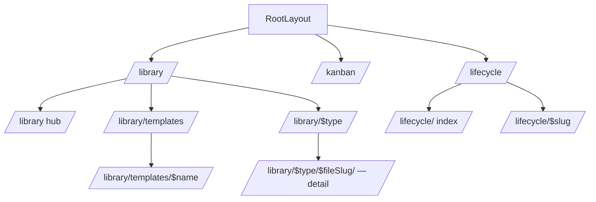

# Design Inventory: current-app

## Overview

**Scope**: the Accelerator Visualiser frontend (React 19 SPA served by a local Rust HTTP server) with deliberate emphasis on **document detail pages** — the per-item views reached by clicking through from any library list. Detail-page chrome, the shared `LibraryDocView` component, the `LibraryTemplatesView` outlier, and the lifecycle cluster detail were all probed at runtime; the surrounding shell (Topbar, Sidebar, Library hub, list views, Kanban, Lifecycle index) was characterised more lightly.

**Crawler methodology**: hybrid. Code-static analysis (`src/styles/global.css`, `src/styles/tokens.ts`, `src/router.ts`, every detail-page component and CSS module) was the ground truth for tokens, route tree, component shape, and prop signatures. Runtime navigation against a live server captured DOM order, computed styles, and full-page screenshots for one representative slug per doc-type plus the not-found and lifecycle-detail states.

**Source path**: visualiser source lives at `skills/visualisation/visualise/frontend/src/` inside this workspace (`build-system`). All `src/`-relative refs in this document are relative to that frontend root.

**Known gaps**:
- Pages with `frontmatterState === 'malformed'` were not encountered in the sampled detail set — the malformed banner styling (`LibraryDocView.module.css:14-30`, `FrontmatterChips.module.css:9-15`) is documented from source but not visually verified.
- `pr-descriptions` and `pr-reviews` are first-class doc types in the IA but have 0 documents; their detail pages share `LibraryDocView` and were not exercised.
- Loading-state screenshots were not captured — TanStack Query resolves against the local backend so quickly that the deferred-hint UX (>250 ms) does not trigger reliably on cold navigations.
- The dark-theme token mirror (`[data-theme="dark"]` and `@media (prefers-color-scheme: dark)` blocks in `global.css`) is documented from source but screenshots were captured in light theme only.
- Wiki-link pending and unresolved states (`.wiki-link-pending`, `.unresolved-wiki-link`) are documented from `src/styles/wiki-links.global.css` but were not exercised at runtime.

## Design System

### Tokens

#### CSS custom properties — colours (light)

Defined on `:root` in `src/styles/global.css` and mirrored in `src/styles/tokens.ts` for runtime lookup. Dark overrides live in `[data-theme="dark"]` (MIRROR-A) and `@media (prefers-color-scheme: dark)` (MIRROR-B) blocks within the same stylesheet.

| Token | Value | Category | Ref |
|---|---|---|---|
| `--ac-bg` | `#fbfcfe` | surface/page | `src/styles/global.css:71` |
| `--ac-bg-raised` | `#ffffff` | surface/raised (Chip default bg) | `src/styles/global.css:72` |
| `--ac-bg-sunken` | `#f4f6fa` | surface/sunken (template preview body, inline code) | `src/styles/global.css:73` |
| `--ac-bg-chrome` | `#ffffff` | surface/chrome (topbar) | `src/styles/global.css:74` |
| `--ac-bg-sidebar` | `#f7f8fb` | surface/sidebar | `src/styles/global.css:75` |
| `--ac-bg-card` | `#ffffff` | surface/card | `src/styles/global.css:76` |
| `--ac-bg-hover` | `rgba(32,34,49,0.04)` | interaction/hover | `src/styles/global.css:77` |
| `--ac-bg-active` | `rgba(89,95,200,0.09)` | interaction/active | `src/styles/global.css:78` |
| `--ac-fg` | `#14161f` | text/default | `src/styles/global.css:79` |
| `--ac-fg-strong` | `#0a111b` | text/strong (title, markdown body) | `src/styles/global.css:80` |
| `--ac-fg-muted` | `#5f6378` | text/muted (subtitle, chip text) | `src/styles/global.css:81` |
| `--ac-fg-faint` | `#8b90a3` | text/faint (eyebrow, caption) | `src/styles/global.css:82` |
| `--ac-stroke` | `rgba(32,34,49,0.10)` | border/default | `src/styles/global.css:83` |
| `--ac-stroke-soft` | `rgba(32,34,49,0.06)` | border/soft (markdown h1 underline) | `src/styles/global.css:84` |
| `--ac-stroke-strong` | `rgba(32,34,49,0.18)` | border/strong (panel hover) | `src/styles/global.css:85` |
| `--ac-accent` | `#595fc8` | accent/primary (link, Declared border, indigo chip) | `src/styles/global.css:86` |
| `--ac-accent-2` | `#cb4647` | accent/2 (brand glyph, hljs literal) | `src/styles/global.css:87` |
| `--ac-accent-tint` | `rgba(89,95,200,0.12)` | accent/tint (indigo chip border) | `src/styles/global.css:88` |
| `--ac-accent-faint` | `rgba(89,95,200,0.06)` | accent/faint (active panel ring) | `src/styles/global.css:89` |
| `--ac-ok` | `#2e8b57` | semantic/success | `src/styles/global.css:90` |
| `--ac-warn` | `#d98f2e` | semantic/warning (malformed banner) | `src/styles/global.css:91` |
| `--ac-err` | `#cb4647` | semantic/error | `src/styles/global.css:92` |
| `--ac-violet` | `#7b5cd9` | accent/violet | `src/styles/global.css:93` |

Per-doc-type glyph tokens (`--ac-doc-{key}` and `--ac-doc-bg-{key}`) declared at `src/styles/global.css:98-124` (light) and `:213-238` (dark) — used by Glyph in the sidebar/library hub, **not consumed by the detail page**.

#### CSS custom properties — typography & rhythm

| Token | Value | Ref |
|---|---|---|
| `--ac-font-display` | `"Sora", system-ui, sans-serif` | `src/styles/global.css:127` |
| `--ac-font-body` | `"Inter", system-ui, sans-serif` | `src/styles/global.css:128` |
| `--ac-font-mono` | `"Fira Code", ui-monospace, monospace` | `src/styles/global.css:129` |
| `--size-hero` | `68px` | `src/styles/global.css:130` |
| `--size-h1` | `48px` | `src/styles/global.css:131` |
| `--size-h2` | `36px` | `src/styles/global.css:132` |
| `--size-h3` | `28px` (Page title) | `src/styles/global.css:133` |
| `--size-h4` | `26px` | `src/styles/global.css:134` |
| `--size-lg` | `22px` (markdown h2) | `src/styles/global.css:135` |
| `--size-body` | `20px` | `src/styles/global.css:136` |
| `--size-md` | `18px` | `src/styles/global.css:137` |
| `--size-sm` | `16px` (markdown h3) | `src/styles/global.css:138` |
| `--size-xs` | `14px` (aside body, tier label, code blocks) | `src/styles/global.css:139` |
| `--size-xxs` | `12px` (eyebrow H3, tier path, file path, badges) | `src/styles/global.css:140` |
| `--size-chip` | `10.5px` (Chip sm) | `src/styles/global.css:141` |
| `--size-chip-md` | `11.5px` (Chip md) | `src/styles/global.css:142` |
| `--lh-tight` | `1.05` | `src/styles/global.css:143` |
| `--lh-snug` | `1.2` | `src/styles/global.css:144` |
| `--lh-normal` | `1.5` | `src/styles/global.css:145` |
| `--lh-loose` | `1.6` (markdown body) | `src/styles/global.css:146` |
| `--tracking-caps` | `0.12em` | `src/styles/global.css:147` |

Font-mode override: `[data-font="mono"]` (`:308-311`) collapses display + body to `var(--ac-font-mono)` — toggled by `FontModeToggle` in the Topbar. `@font-face` declarations span `:12-67` (Sora 600/700, Inter 400/500/600/700, Fira Code 400/500).

#### CSS custom properties — spacing, radius, shadow, layout

| Token | Value | Ref |
|---|---|---|
| `--sp-1` … `--sp-11` | `4 / 8 / 12 / 16 / 24 / 32 / 40 / 48 / 64 / 80 / 124px` | `src/styles/global.css:150-160` |
| `--radius-sm` | `4px` (tier panel, preview pane, banners, error block, sidebar items) | `src/styles/global.css:163` |
| `--radius-md` | `8px` (template index card, sidebar search) | `src/styles/global.css:164` |
| `--radius-lg` | `12px` (not used by detail surface) | `src/styles/global.css:165` |
| `--radius-pill` | `999px` (Chip, OriginPill pulse) | `src/styles/global.css:166` |
| `--shadow-card` | `6px 12px 85px 0 rgba(0,0,0,0.08)` | `src/styles/global.css:169` |
| `--shadow-card-lg` | `12px 24px 120px 0 rgba(0,0,0,0.12)` | `src/styles/global.css:170` |
| `--shadow-crisp` | `0 1px 2px rgba(10,17,27,.06), 0 4px 12px rgba(10,17,27,.04)` | `src/styles/global.css:171` |
| `--ac-shadow-soft` | per-theme | `src/styles/global.css:172,239` |
| `--ac-shadow-lift` | per-theme | `src/styles/global.css:173,240` |
| `--ac-topbar-h` | `48px` | `src/styles/global.css:176` |
| `--ac-content-max-width` | `1200px` | `src/styles/global.css:177` |
| `--ac-content-max-width-narrow` | `600px` (Page `maxWidth='narrow'`) | `src/styles/global.css:178` |

Detail-page-specific off-scale values worth noting:
- Markdown body cap: hard-coded `max-width: 720px` (`MarkdownRenderer.module.css:2`) — does not consume `--ac-content-max-width-narrow`.
- Markdown `<pre>` border-radius: `6px` (`MarkdownRenderer.module.css:15`) — off the radius scale.
- RelatedArtifacts `.badge` border-radius: `2px` (`RelatedArtifacts.module.css:47`) — off the radius scale.
- Markdown h1 size: `1.75rem` (`MarkdownRenderer.module.css:9`) — off the `--size-*` scale.
- Page eyebrow size: `11px`, subtitle size: `13px` (`Page.module.css:35,56`) — off the `--size-*` scale.

#### Focus styling

Global: `:focus-visible { outline: 2px solid var(--ac-accent); outline-offset: 2px; }` (`src/styles/global.css:313-316`). Forced-colors override at `:318-322`. Breadcrumb-specific override adds `border-radius: 2px` (`Breadcrumbs.module.css:31-35`). Active tier panel adds an extra ring via `box-shadow: 0 0 0 3px var(--ac-accent-faint)` (`LibraryTemplatesView.module.css:52`).

#### Motion

- Tier panel hover: `border-color 0.12s, box-shadow 0.12s` (`LibraryTemplatesView.module.css:39`)
- Sidebar library heading hover: `background 120ms, color 120ms` (`Sidebar.module.css:111-112`)
- OriginPill pulse: 2s alternating, honours `prefers-reduced-motion` (`OriginPill.module.css:15-23`; keyframes `global.css:324-327`)

#### Computed style — observed at runtime on detail pages

| Element | Selector | Computed |
|---|---|---|
| Page H1 | `h1._title_135jd_42` | Sora 28/32.2, weight 600, color `#0a111b`, tracking -0.28px |
| Page subtitle wrapper | `div._subtitle_135jd_52` | Inter 13/19.5, color `#5f6378`, inline-flex, gap 8px, margin-top 4px |
| FrontmatterChips container | `div._chips_1ibm5_1` | flex, gap 6.4px, margin-bottom 16px |
| FrontmatterChips chip | `span._chip_qv10w_1` | Fira Code 10.5, weight 500, color `#5f6378`, bg `#fff`, border 1px solid `rgba(32,34,49,0.1)`, border-radius 999px, padding 2px 8px |
| Aside H3 ("Related artifacts", "File") | `h3` in `_aside_ttf2g_8` | Inter 12, weight 600, color `#8b90a3`, uppercase, margin-bottom 6.4px |
| Declared group | `._group_yt80y_10._groupDeclared_yt80y_40` | Inter 14, color `#5f6378`, border-left 2px solid `#595fc8`, padding-left 8px |
| Inferred group | `._group_yt80y_10._groupInferred_yt80y_41` | Inter 14, color `#5f6378`, border-left 2px dashed `#8b90a3`, padding-left 8px |
| File path | `p._meta_ttf2g_12` | Fira Code 12, color `#5f6378` |
| Markdown body container | `div._markdown_…_1` | Inter 16, line-height 1.6, color `#0a111b`, max-width 720px |
| Markdown h2 | `h2` inside markdown | Sora 22, weight 600, color `#0a111b`, margin 24px 0 8px |

#### Runtime constants worth tracking

| Constant | Value | Where | Ref |
|---|---|---|---|
| Deferred fetching hint delay | `delayMs = 250` | `useDeferredFetchingHint` | `src/api/use-deferred-fetching-hint.ts:18` |
| Wiki-link work-item config stale time | `Infinity` | `useWikiLinkResolver` | `src/api/use-wiki-link-resolver.ts:55` |
| SHA truncation length | 12-char prefix + `…` (5 hex tail) | `truncateSha256` | `src/routes/library/LibraryTemplatesView.tsx:136-139` |
| Wiki-link default pattern | `[[ADR-NNNN]] / [[WORK-ITEM-NNNN]]` (numeric-only) | `buildWikiLinkPattern(null)` | `src/api/wiki-links.ts:28-33`; `MarkdownRenderer.tsx:9` |

### Layout Primitives

- Topbar height: `48px` (`--ac-topbar-h`)
- Sidebar width: `240px` (`Sidebar.module.css:2`)
- Default content cap: `1200px` (`--ac-content-max-width`)
- Narrow content cap: `600px` (`--ac-content-max-width-narrow`) — opt-in via `Page` prop `maxWidth='narrow'`; **not used by detail pages**.
- Markdown body cap: `720px` (hard-coded in `MarkdownRenderer.module.css:2`)
- Detail page article grid (`LibraryDocView`): two-column `body | aside` via `.article` (`LibraryDocView.module.css:1-6`)
- Template detail two-column grid: `304px 632px`, gap `--sp-4` (24px) — observed at runtime; declared in `LibraryTemplatesView.module.css:15-20`
- Spacing scale used pervasively on detail surface: `--sp-2` (8px), `--sp-3` (12px), `--sp-4` (16px), `--sp-5` (24px)

## Component Catalogue

Split between detail-page-specific components and shared chrome. Detail-page-specific ones are the things you'd touch when reshaping the detail surface; shared chrome wraps every route and shouldn't be in scope for a detail-only redesign without explicit cross-cutting intent.

### Detail-page-specific

#### `LibraryDocView`
- **Path**: `src/routes/library/LibraryDocView.tsx`
- **Purpose**: Shared detail page for all twelve generic library doc types.
- **Props** (`:18-21`): `type?: DocTypeKey`, `fileSlug?: string` (prop overrides route param via `useParams`, `:25-30`).
- **Sub-elements**: `Page` (title/subtitle/body) — see render flow below.
- **Class hooks** (`LibraryDocView.module.css`): `.article`, `.body`, `.aside`, `.empty`, `.meta`, `.error`, `.malformedBanner`, `.malformedPrefix`.

#### `LibraryTemplatesView`
- **Path**: `src/routes/library/LibraryTemplatesView.tsx`
- **Purpose**: Detail page for a single template (distinct chrome — composes the `TemplatesPage` index chrome with an `extraContent` section showing tier picker + preview pane).
- **Props** (`:12-14`): `name?: string`.
- **Internal subcomponents**: `TemplateDetailSection` (`:29-72`), `TierCard` (`:103-127`), `TemplatePreviewPane` (`:141-174`).
- **Helpers**: `parentDirOf` (`:78-82`), `tierDescription` (`:88-101`), `findWinningTier` (`:129-131`), `truncateSha256` (`:136-139`).
- **Class hooks**: `.detail`, `.detailHeading`, `.twoColumn`, `.tiers`, `.panel`, `.absent`, `.tierEyebrow`, `.panelHeader`, `.tierLabel`, `.tierPath`, `.tierNote`, `.absentNote`, `.previewPane`, `.previewHeader`, `.previewPath`, `.contentHashLabel`, `.previewBody`, `.error`.
- **Test hooks**: `data-testid="templates-detail-layout"` (`:57`), `data-testid="template-preview-pane"` (`:146,153`), `data-testid="template-preview-header"` (`:154`), `data-testid="template-preview-code"` (`template-highlight.tsx:42`). Active panel uses `data-active="true"`; hash uses `data-full-sha`.

#### `Page`
- **Path**: `src/components/Page/Page.tsx`
- **Purpose**: Standard page chrome — eyebrow, title, optional subtitle, optional actions, divider, content slot.
- **Props** (`PageProps`, `:4-11`): `eyebrow?`, `title` (required), `subtitle?`, `actions?`, `maxWidth?: 'default' | 'narrow'` (default `'default'`), `children`.
- **Sub-elements**: `<section>` › `<header>` with `.eyebrow[data-slot="eyebrow"]`, `.headerTopRow` containing `.title` (`<h1>`) + `.subtitle[data-slot="subtitle"]` + `.actions[data-slot="actions"]`, `
`, `
{children}`.
- **Class hooks**: `.page`, `.narrow` (`Page.module.css:1-13`).

#### `FrontmatterChips`
- **Path**: `src/components/FrontmatterChips/FrontmatterChips.tsx`
- **Purpose**: Render arbitrary frontmatter key/value pairs as a Chip strip in the page subtitle slot; show inline malformed banner when YAML parse failed; absent → null.
- **Props**: tagged union — `{ state: 'absent' }` | `{ state: 'malformed' }` | `{ state: 'parsed'; frontmatter: Record<string,unknown> }` (`:5-8`).
- **Value formatting** (`formatChipValue`, `:10-14`): arrays joined with `, `, objects `JSON.stringify`'d, primitives `String(v)`.
- **Variant mapping**: only the `status` key receives a coloured Chip variant via `statusToChipVariant` (`src/api/status-variant.ts:15-22`); all other keys render as `neutral`. (`:38`)
- **Sub-elements**: `
` of `Chip` children; `
` for malformed.
- **Observed gap**: note-type docs render with an empty chip strip (no FrontmatterChips entries), leaving the H1 directly above the divider.

#### `MarkdownRenderer`
- **Path**: `src/components/MarkdownRenderer/MarkdownRenderer.tsx`
- **Purpose**: Render markdown content with GFM, hljs syntax highlighting, and optional wiki-link rewriting.
- **Props** (`:11-23`): `content: string`, `resolveWikiLink?: Resolver`, `wikiLinkPattern?: RegExp` (defaults to `buildWikiLinkPattern(null)`).
- **Pipeline**: `react-markdown` + `remark-gfm` (always) + `remarkWikiLinks(pattern, resolver)` (when resolver provided); rehype: `rehype-highlight` (`:34-48`).
- **Class hooks**: `.markdown`; global `.wiki-link-pending` and `.unresolved-wiki-link` from `src/styles/wiki-links.global.css:8-21`.

#### `wiki-link-plugin` (`remarkWikiLinks`)
- **Path**: `src/components/MarkdownRenderer/wiki-link-plugin.ts`
- **Purpose**: Remark plugin rewriting `[[ADR-NNNN]]` / `[[WORK-ITEM-…]]` text-node matches to a TanStack-Router `Link` (resolved), `` (settled miss), or `` (cache warming).
- **Marker shape**: pseudo-mdast `wikiLinkMarker` with `data.hName='span'`, `data.hProperties.className`, `data.hProperties.title` (`:26-36`).

#### `RelatedArtifacts`
- **Path**: `src/components/RelatedArtifacts/RelatedArtifacts.tsx`
- **Purpose**: Render the three related-artifact groups (declared outbound `Targets`, declared inbound `Referenced by`, inferred cluster `Same lifecycle`) with a legend; show empty-state copy if all empty; optional `Updating…` deferred-loading hint.
- **Props** (`:5-15`): `related: RelatedArtifactsResponse`, `showUpdatingHint?: boolean`.
- **`RelatedGroup`** (`:79-99`): `
` › `<h4 class=.groupHeading>` › `<ul class=.groupList>` of `<li class=.groupItem>` each containing `<a href=/library/{type}/{slug}>` + `{kind}`.
- **Class hooks**: `.legend`, `.group`, `.groupDeclared`, `.groupInferred`, `.groupHeading`, `.groupList`, `.groupItem`, `.badge`, `.badgeDeclared`, `.badgeInferred`, `.emptyAll`, `.updating`.

#### `Chip`
- **Path**: `src/components/Chip/Chip.tsx`
- **Purpose**: Inline pill primitive — 6-colour variant set, 2 sizes, optional leading slot.
- **Props** (`:8-14`): `variant: 'neutral'|'indigo'|'green'|'amber'|'red'|'violet'`, `size?: 'sm'|'md'` (default `'sm'`), `leading?: ReactNode`, `aria-label?`, `children`.
- **Sub-elements**: `` optionally with `` + ``.
- **Used on**: detail subtitle (via `FrontmatterChips`), template tier header (active/absent badges in `LibraryTemplatesView.tsx:120-121`).

#### `TemplateHighlight`
- **Path**: `src/routes/library/template-highlight.tsx`
- **Purpose**: Render template content with hljs YAML (frontmatter) + hljs Markdown (body) + custom `{{var}}` wrapping in `.hljs-template-variable`; preserves empty lines via per-line `.tpl-line` wrapping.
- **Props** (`:29`): `{ content: string }`.
- **Output**: `<pre class="tpl-highlight hljs" data-testid="template-preview-code">` with imperatively-set `innerHTML` (`:32-35`).
- **Exposed helper**: `renderHighlightedTemplate(content)` (pure HTML renderer, unit-testable) (`:47-90`).
- **Frontmatter split** (`splitFrontmatter`, `:92-116`): `/^---\n([\s\S]*?)\n---(?:\n([\s\S]*))?$/`.

#### `template-tier`
- **Path**: `src/routes/library/template-tier.ts`
- **Purpose**: Tier-source label maps + glyph-key lookup.
- **Exports** (`:4-22, 65-78`): `TIER_LABELS`, `TIER_SHORT_LABELS`, `TIER_ORDER` (`['plugin-default','user-override','config-override']`), `glyphKeyForTemplate(name)`.

### Shared chrome (composed around detail pages)

#### `RootLayout`
- **Path**: `src/components/RootLayout/RootLayout.tsx`
- **Purpose**: Top-level shell — provides Theme/FontMode/DocEvents/UnseenDocTypes contexts; fetches docTypes + libraryStructure; renders Topbar + Sidebar + `<Outlet>`.
- **Layout**: `.root` column flex (height 100vh), `.body` row flex (min-height 0), `.main` flex 1 overflow-y auto (`RootLayout.module.css:1-30`).

#### `Topbar`
- **Path**: `src/components/Topbar/Topbar.tsx`
- **Children** (`:9-28`): `Brand` → vertical `.divider` → `Breadcrumbs` → `.spacer` → `OriginPill` → `SseIndicator` → `.toggleGroup` { `ThemeToggle`, `FontModeToggle` }.
- **Height**: 48px (`--ac-topbar-h`).

#### `Breadcrumbs`
- **Path**: `src/components/Breadcrumbs/Breadcrumbs.tsx`
- **Purpose**: Derive trail from `useMatches()` filtered by `loaderData.crumb: string` (`:14-17,34`).
- **DOM**: `<nav aria-label="Breadcrumb" class=.breadcrumbs>` › `<ol class=.list>` › `<li class=.crumb>` with `›` separators; last crumb ``, others `<a class=.link>`.
- **DEV warning**: console.warn if a matched route has no crumb loaderData (`:23-31`).

#### `Sidebar`
- **Path**: `src/components/Sidebar/Sidebar.tsx`
- **Purpose**: Search row, per-phase doc-type nav (DEFINE / DISCOVER / BUILD / SHIP / REMEMBER), VIEWS section (Kanban, Lifecycle), `ActivityFeed`, META section (Templates) when provided.
- **Width**: 240px (`Sidebar.module.css:2`).

#### `LibraryLayout`
- **Path**: `src/routes/library/LibraryLayout.tsx` — bare `<Outlet />`.

#### `OriginPill`, `Brand`, `SseIndicator`, `ThemeToggle`, `FontModeToggle`
- Topbar accessories — see `src/components/{OriginPill,Brand,SseIndicator,ThemeToggle,FontModeToggle}/`. Not detail-page-specific.

## Screen Inventory

Detail pages first (the focus of this inventory). Each entry records: the route, the doc-type sub-variant, observed states, and the screenshot capturing the rendered page.

### detail-work-item — `/library/work-items/{slug}`

- **Purpose**: Show one work item with frontmatter chips and rendered markdown body.
- **Components used**: `Page`, `FrontmatterChips`, `Chip`, `RelatedArtifacts` (Declared, sometimes Inferred), `MarkdownRenderer`.
- **States observed**: success.
- **Sample slug**: `templates-view-redesign`.
- **DOM order**: H1 → FrontmatterChips → `
` → article (aside [Related artifacts → File] + body [markdown]).
- **Notable**: rendered AC bullets become disabled HTML checkboxes (handled by `react-markdown` GFM task lists). Chip strip includes id, type, status, priority, tags, title, author, date.
- **Screenshot**: `screenshots/detail-work-item-templates-view-redesign.png`

### detail-work-item-review — `/library/work-item-reviews/{slug}`

- **Purpose**: Show a review pass against a work item, with per-lens results and possible re-review passes.
- **Components used**: identical to work-item.
- **States observed**: success.
- **Sample slug**: `0042-templates-view-redesign-review-1`.
- **Notable**: H1 surfaces the raw slug (no humanised title). Chip strip carries `lenses` comma-list and pass numbers. Body shape: Cross-Cutting Themes, Findings (Critical/Major/Minor/Suggestions), Strengths, Recommended Changes, Per-Lens Results, Re-Review passes.
- **Screenshot**: `screenshots/detail-work-item-review-0042.png`

### detail-design-inventory — `/library/design-inventories/{slug}`

- **Purpose**: Show a captured design-inventory artifact.
- **States observed**: success.
- **Sample slug**: `140608-claude-design-prototype`.
- **Notable**: chip strip contains duplicated values (author + ISO timestamps appear twice — `last_updated` mirrors `date` and `last_updated_by` mirrors `author`). Reads as content-data smell in the chip strip, not a chrome bug.
- **Screenshot**: `screenshots/detail-design-inventory-claude-prototype.png`

### detail-design-gap — `/library/design-gaps/{slug}`

- **Purpose**: Show a gap analysis between two inventories.
- **States observed**: success.
- **Sample slug**: `current-app-vs-claude-design-prototype`.
- **Notable**: one chip carries a full file path (`meta/research/design-inventories/2026-05-06-…/inventory.md`) — long strings inflate the chip strip; potential overflow concern under narrower viewports.
- **Screenshot**: `screenshots/detail-design-gap-current-vs-claude.png`

### detail-research — `/library/research/{slug}`

- **Purpose**: Show a research artifact.
- **States observed**: success; only sampled page with `Same lifecycle` (Inferred) group visible in the aside.
- **Sample slug**: `0042-templates-view-redesign`.
- **Notable**: Inferred styling = 2px **dashed** `#8b90a3` left border vs Declared 2px **solid** `#595fc8`. A raw 40-char git commit hash appears as a chip — long monospace string at chip size.
- **Screenshot**: `screenshots/detail-research-0042.png`

### detail-plan — `/library/plans/{slug}`

- **Purpose**: Show an implementation plan.
- **States observed**: success; both Declared and Inferred groups visible (Targets, Referenced by, Same lifecycle).
- **Sample slug**: `0042-templates-view-redesign`.
- **Notable**: this is the richest related-artifacts panel; useful reference for that component's full state.
- **Screenshot**: `screenshots/detail-plan-0042.png`

### detail-plan-review — `/library/plan-reviews/{slug}`

- **Purpose**: Multi-lens plan review with optional re-review passes.
- **States observed**: success.
- **Sample slug**: `0042-templates-view-redesign`.
- **Notable**: chip strip carries a long comma-joined `lenses` list (`architecture, code-quality, test-coverage, correctness, performance, standards`) that is the widest chip in the strip — wrap cadence feels uneven.
- **Screenshot**: `screenshots/detail-plan-review-0042.png`

### detail-validation — `/library/validations/{slug}`

- **Purpose**: Validation report against a plan.
- **States observed**: success.
- **Sample slug**: `meta-visualiser-phase-11-testing-validation`.
- **Notable**: the verdict word (`pass`) renders as a neutral chip — no semantic colour for pass/fail. H1 is slug-shaped.
- **Screenshot**: `screenshots/detail-validation-phase-11.png`

### detail-decision — `/library/decisions/{slug}`

- **Purpose**: Show an ADR.
- **States observed**: success; Inferred group present.
- **Sample slug**: `template-management-subcommands`.
- **Notable**: H1 prefixed `ADR-NNNN:`; the same ID also appears as a chip — duplicated signal between title and chip strip.
- **Screenshot**: `screenshots/detail-decision-template-mgmt.png`

### detail-note — `/library/notes/{slug}`

- **Purpose**: Freeform note.
- **States observed**: success.
- **Sample slug**: `config-read-path-missing-design-keys`.
- **Notable**: **chip strip is empty** for notes (FrontmatterChips renders an empty `.chips`). H1 sits directly over the divider with no chip strip beneath. H1 contains inline code spans rendered via `react-markdown` (only place observed where H1 has inline code formatting).
- **Screenshot**: `screenshots/detail-note-config-read-path.png`

### detail-template — `/library/templates/{name}`

- **Purpose**: Template detail with tier picker + content preview.
- **States observed**: success (TIER 3 active for `adr`; TIER 1 & TIER 2 absent).
- **Sample name**: `adr`.
- **DOM order**: `Templates` page header (eyebrow + H1) → `
` → list of all templates (index reused) → `section.detail` (`h2.detailHeading` "TIERS · adr.md" → `div.twoColumn` { `.tiers` column with 3 `TierCard`s | `.previewPane` with header + body }).
- **Notable**: active tier signalled by border colour (`#595fc8`) + 3px accent-faint ring + `Chip variant=indigo`; absent tier signalled by opacity 0.55 + `Chip variant=neutral`. Preview body is `Fira Code 12` but with `white-space: normal` (collapses internal whitespace despite the monospace face — likely worth a follow-up).
- **Screenshot**: `screenshots/detail-template-adr.png`

### error-not-found — `/library/{type}/{unknown-slug}`

- **Purpose**: Doc-not-found state.
- **Sample URL**: `/library/decisions/does-not-exist-xyz`.
- **DOM**: Page shell retained; H1 `"Document not found"`; body `
Document not found.
`. No aside, no chips, no back-link, no retry affordance. Breadcrumb still shows `Library › decisions › does-not-exist-xyz`.
- **Screenshot**: `screenshots/detail-not-found.png`

### detail-lifecycle-cluster — `/lifecycle/{slug}`

- **Purpose**: Show a lifecycle pipeline cluster (all artifacts sharing a slug prefix).
- **Components used**: lifecycle-specific (not shared with `LibraryDocView`).
- **States observed**: success.
- **Sample slug**: `0042-templates-view-redesign`.
- **DOM order**: standard `_page_` shell → back link → 8 `_stage_` rows in fixed order (Work item, Research, Plan, Plan review, Validation, PR descriptions, PR review, Decision). Each row carries an uppercase stage label + entry links or `no <stage> yet` placeholder.
- **Notable**: stage rail is realised as `padding-left: 22px` on each row rather than a sibling rail element. Stage label uses Inter 12 / weight 400 / `letter-spacing: 0.72px` — same family + size as the eyebrow H3s elsewhere but **weight 400 vs 600** (small inconsistency).
- **Screenshot**: `screenshots/detail-lifecycle-0042.png`

### Non-detail screens (briefly)

- `/library` — Library hub: per-phase H2 groupings of doc-type entry points with `(no documents yet)` placeholders for empty types.
- `/library/{type}` — Library list view (`LibraryTypeView`): sortable rows linking to `/library/{type}/{slug}`. Out of scope for this inventory.
- `/library/templates` — Templates index reusing `TemplatesPage` chrome (also shown above the detail when on `/library/templates/{name}`).
- `/kanban` — Kanban board: 4 columns (Draft, Ready, In progress, Done); cards link to `/library/work-items/{slug}`. No card popovers.
- `/lifecycle` — Cluster index; sortable by Recent / Oldest / Completeness.
- `/` — redirects to `/library`.
- Dev showcases: `/glyph-showcase`, `/chip-showcase` (uncrumbed).

## Feature Catalogue

| Feature | Capability | Surfacing component(s) | Depends on |
|---|---|---|---|
| Detail page rendering | Render any library doc as a Page with chip-strip subtitle and markdown body in `<article class=.article>` (aside + body grid). | `LibraryDocView`, `Page`, `FrontmatterChips`, `MarkdownRenderer`, `RelatedArtifacts` | `useDocPageData` (`useDocContent` + `useRelated`), `fetchDocs` |
| Wiki-link navigation in markdown body | Rewrites `[[ADR-NNNN]]` / `[[WORK-ITEM-NNNN]]` text occurrences to internal links (resolved), italic dim pending markers, or dotted-underline unresolved markers. | `MarkdownRenderer` + `remarkWikiLinks` | `useWikiLinkResolver` (combines decisions + work-items caches + `/api/work-item/config`); `buildWikiLinkPattern` |
| Deferred-loading hint UX | Surfaces an "Updating…" label only after a refetch has been in flight ≥ 250 ms (refetch only, not initial load) — suppresses flash from unrelated `doc-changed` invalidations. | `RelatedArtifacts` `.updating` | `useDeferredFetchingHint(query, 250)` |
| Related-artifacts declared vs inferred classification | Declared groups (`Targets`, `Referenced by`) render with 2px solid accent left border + `.badgeDeclared`; inferred (`Same lifecycle`) renders with 2px dashed faint left border + `.badgeInferred`; inline `<dl>` legend defines each. | `RelatedArtifacts`, `RelatedGroup`, `Legend` | `useRelated(relPath)` |
| `Same lifecycle` grouping | Groups artifacts sharing a slug prefix with the current doc under the `Same lifecycle` heading. | `RelatedGroup label="Same lifecycle" kind="inferred"` | `useRelated` (`inferredCluster`) |
| Template tier resolution | Renders three tier cards in fixed resolution order; the active winner gets accent border + ring + indigo `active` chip; missing tiers render at opacity 0.55 with neutral `absent` chip; preview shows the winning tier's content with `tier not present` fallback. | `TierCard`, `TemplatePreviewPane`, `Chip` | `fetchTemplateDetail`, `TIER_LABELS`/`TIER_ORDER` (`template-tier.ts`), `findWinningTier` |
| Content-hash display | Shows truncated `sha256-xxxxx…` next to the winning tier's path; full hash exposed via `title` + `data-full-sha`. | `TemplatePreviewPane.previewHeader` | `truncateSha256` |
| Template syntax highlighting | YAML highlighting on frontmatter + Markdown highlighting on body + custom `{{var}}` wrapping in `.hljs-template-variable`; per-line `.tpl-line` wrapping preserves empty lines. | `TemplateHighlight` | `highlight.js` (markdown + yaml grammars) |
| Markdown syntax highlighting (general) | `rehype-highlight` applies hljs to fenced code blocks; theme classes (`hljs-*`) duplicated in `LibraryTemplatesView.module.css` so the template preview can share the look. | `MarkdownRenderer`, `TemplateHighlight` | `rehype-highlight`, `highlight.js` |
| Frontmatter chip rendering | Renders every non-null, non-empty frontmatter entry as a Chip; only the `status` key receives semantic colour; arrays joined with `, `, objects JSON-stringified. | `FrontmatterChips`, `Chip` | `statusToChipVariant`, `isStatusKey` |
| Malformed-frontmatter banner | When the parsed-state is `malformed`, two banners appear: an inline `.banner` inside the subtitle slot (`FrontmatterChips`) and a full-width `.malformedBanner` strip rendered above the markdown body (`LibraryDocView.tsx:112-117`). | `FrontmatterChips`, `LibraryDocView` | `entry.frontmatterState` |
| Document not found | When the list query returns no matching entry, the Page shell is reused with title `"Document not found"` and a bare `
Document not found.
` body. | `LibraryDocView` (inline branch) | — |
| Lifecycle cluster pipeline | Renders an 8-stage cluster (Work item, Research, Plan, Plan review, Validation, PR descriptions, PR review, Decision) with present entries or `no <stage> yet` placeholders. | `LifecycleClusterView` (`src/routes/lifecycle/`) | lifecycle cluster API |

## Information Architecture

Route tree from `src/router.ts` (see lines referenced):

| Path | Component | Crumb | Params | Notes | Ref |
|---|---|---|---|---|---|
| `/` | redirect → `/library` | — | — | `beforeLoad` | `:58-62` |
| `/library` | `LibraryLayout` | `"Library"` | — | static crumb | `:64-68` |
| `/library/` (index) | `LibraryOverviewHub` | — | — | uncrumbed | `:71-75` |
| `/library/templates` | `LibraryTemplatesIndex` | `"Templates"` | — | literal beats `/$type` | `:81-85` |
| `/library/templates/$name` | `LibraryTemplatesView` | `params.name` | `name` | | `:87-91` |
| `/library/$type` | `LibraryTypeView` | `params.type` | `type: DocTypeKey` | unknown type → redirect to `/library` | `:96-106` |
| `/library/$type/$fileSlug` | `LibraryDocView` | `params.fileSlug` | `type`, `fileSlug` | **the detail route** | `:108-112` |
| `/lifecycle` | `LifecycleLayout` | `"Lifecycle"` | — | | `:114-118` |
| `/lifecycle/` | `LifecycleIndex` | — | — | | `:120-124` |
| `/lifecycle/$slug` | `LifecycleClusterView` | `params.slug` | `slug` | | `:126-130` |
| `/kanban` | `KanbanBoard` | `"Kanban"` | — | | `:132-136` |
| `/glyph-showcase` | `GlyphShowcase` | — | — | dev-only | `:141-145` |
| `/chip-showcase` | `ChipShowcase` | — | — | dev-only | `:150-154` |

`withCrumb(crumbOrResolver, options)` (`router.ts:28-40`) wraps `createRoute` with a `loader` that returns `{ crumb }` for the static-string case, or calls the resolver `({ params }) => string` for dynamic crumbs. The Breadcrumbs component reads this via `useMatches()`.

Doc-type sidebar grouping (per `Sidebar.tsx`):

- **DEFINE**: work-items, work-item-reviews
- **DISCOVER**: design-inventories, design-gaps, research
- **BUILD**: plans, plan-reviews, validations
- **SHIP**: pr-descriptions, pr-reviews (empty)
- **REMEMBER**: decisions, notes
- **META**: templates

## Crawl Notes

- Hybrid mode: code-static + Playwright runtime. Bootstrap and ping both succeeded (Node 22.22.2, Playwright 1.55.1, Chromium 1193).
- The first browser-analyser invocation halted because the inventory output root was set to a path under the parent repo root (`/Users/.../accelerator/meta/...`), outside the active jj workspace. Re-spawned the agent with `ACCELERATOR_INVENTORY_OUTPUT_ROOT` set to `…/workspaces/build-system/meta/research/design-inventories/.2026-05-21-004250-current-app.tmp` and the capture completed.
- 13 screenshots captured (~2.1 MB total), well under the 50 MB budget; no screenshot budget hit.
- Page cap not reached (≤ 20 distinct routes probed).
- Wall-clock timeout not hit; browser-analyser ran ~9 minutes including the abandoned first attempt.
- Auth mode `none`; no auth-walled routes encountered.
- No URL query strings observed on any captured page; none required scrubbing.
- Loading state on the detail page (TanStack Query in-flight) was not captured — the local backend answers fast enough that the deferred-hint UX (≥250 ms) does not surface.
- Malformed-frontmatter state was not encountered in any sampled page; the styling is documented from source only.
- Dark-theme tokens documented from source; runtime capture was light-theme only.
- The lifecycle stage rail uses Inter 12 weight **400** for its uppercase eyebrow vs the Inter 12 weight **600** used for the detail-page aside H3 eyebrows — small typographic inconsistency worth flagging if a future redesign harmonises eyebrow treatments.
- A handful of detail pages render the raw slug as H1 (work-item-review, plan-review, validation) instead of a humanised title; others (plan, research, decision, design-inventory, design-gap, work-item) surface a humanised `entry.title`.
- Note-type detail pages render no chips at all (FrontmatterChips emits an empty `.chips`). Worth flagging — leaves the H1 unanchored visually.
- One observation in `LibraryTemplatesView`: the preview body uses Fira Code 12 but with `white-space: normal`, which collapses internal whitespace despite the monospace face; likely a styling oversight given the source content's structure.

## References

- Source location (running server): `http://127.0.0.1:52339/`
- Frontend source: `skills/visualisation/visualise/frontend/src/` (workspace-relative)
- Prior inventory: `meta/research/design-inventories/2026-05-06-135214-current-app/inventory.md` (sequence 1, superseded by this artifact)
- Sibling inventory: `meta/research/design-inventories/2026-05-06-140608-claude-design-prototype/inventory.md` (target design surface for gap analysis)
- Suggested next step: run `/accelerator:analyse-design-gaps current-app claude-design-prototype` to compute the gap.
