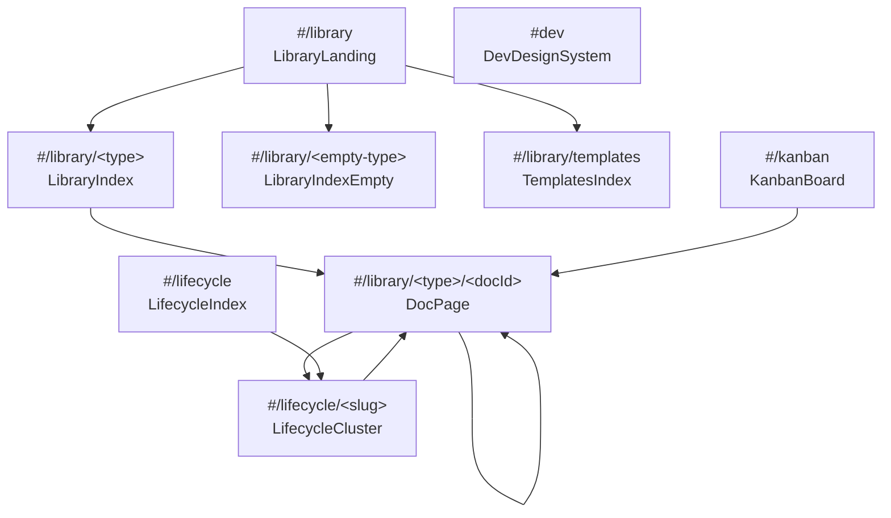

# Design Inventory: claude-design-prototype

## Overview

**Scope**: The Accelerator Visualiser prototype as served from a local static
host at `http://localhost:54844/Accelerator%20Visualiser.html`. The prototype is
a single-page React app composed via classic `<script>` tags (no bundler) with
hash-fragment routing. Source code is available at
`/Users/tobyclemson/Downloads/Accelerator/` and was treated as ground truth for
tokens, component definitions, and information architecture; runtime
observations supplied screen states, screenshots, and computed values.

**Focus**: Per the inventory request, document detail pages received deep
attention — all twelve doc kinds reachable through `DocPage` were navigated
and captured, plus the supporting screens (library landing, type-scoped lists,
empty state, lifecycle index/cluster, kanban, templates, hidden dev page).

**Routes covered (verified via navigation)**:
- `#/library` (LibraryLanding)
- `#/library/<type>` for `work`, `decisions`, `notes`, `templates`
- `#/library/<type>/<docId>` for `work`, `decisions`, `plans`, `plan-reviews`,
  `work-reviews`, `pr-descriptions`, `design-inventories`, `design-gaps`
- `#/lifecycle` (LifecycleIndex)
- `#/lifecycle/<slug>` (LifecycleCluster) — `meta-visualisation`,
  `three-layer-review-system-architecture`
- `#/kanban` (KanbanBoard)
- `#dev` (hidden DevDesignSystem reference page)

**Excluded**: `#/templates` (sidebar label only — URL updates but view does not
switch). Type-scoped lists for `research`, `validations`, `pr-reviews`,
`design-inventories`, `design-gaps`, `work-reviews`, `plan-reviews` were not
individually re-listed (their schemas are inferred from `LIBRARY_INDEX` and
the per-type detail pages were visited).

**Crawler methodology**: Hybrid. `codebase-analyser` extracted the complete
token system from `src/app.css` and `assets/tokens.css`, plus the component
catalogue from `src/*.jsx` and `design-canvas.jsx`. `browser-analyser` drove
Playwright to navigate each hash route, capture full-page screenshots in both
light and dark themes, and read computed styles via `getComputedStyle`.

**Known gaps**:
- No auth-walled routes — auth mode is `none`.
- The "screenshots gallery" referenced in the `DocPage` source (`view-library.jsx:379-399`)
  for design-inventory pages did not render at runtime; the body shows a
  literal `screenshots:6` text instead. The conditional block exists in code
  but is not wired into the fixture's body markdown.
- `#/templates` and `#/templates/<type>` are placeholder hashes; clicking
  changes the URL but not the canvas.
- No 404/error screen exists; arbitrary unknown hashes were not exercised.

## Design System

### Token system structure

Two layered stylesheets compose the system:

1. **Brand layer** — `assets/tokens.css` declares the Atomic palette
   (`--atomic-*`), brand typography stack with `@font-face`, brand size scale,
   spacing, radii, shadows.
2. **Application layer** — `src/app.css` declares semantic `--ac-*` tokens
   (themed via `:root` and `[data-theme="dark"]`) and every component class.

The `--ac-*` layer is what components reference; brand-layer tokens are pulled
in occasionally (e.g. dark marquee at `src/app.css:1377`).

### Colour tokens — application layer (light theme, `src/app.css:6-42`)

| Token | Value | Category |
|-------|-------|----------|
| `--ac-bg` | `#FBFCFE` | bg |
| `--ac-bg-raised` | `#FFFFFF` | bg |
| `--ac-bg-sunken` | `#F4F6FA` | bg |
| `--ac-bg-chrome` | `#FFFFFF` | bg |
| `--ac-bg-sidebar` | `#F7F8FB` | bg |
| `--ac-bg-card` | `#FFFFFF` | bg |
| `--ac-bg-hover` | `rgba(32,34,49,0.04)` | bg |
| `--ac-bg-active` | `rgba(89,95,200,0.09)` | bg |
| `--ac-fg` | `#14161F` | fg |
| `--ac-fg-strong` | `#0A111B` | fg |
| `--ac-fg-muted` | `#5F6378` | fg |
| `--ac-fg-faint` | `#8B90A3` | fg |
| `--ac-stroke` | `rgba(32,34,49,0.10)` | stroke |
| `--ac-stroke-soft` | `rgba(32,34,49,0.06)` | stroke |
| `--ac-stroke-strong` | `rgba(32,34,49,0.18)` | stroke |
| `--ac-accent` | `#595FC8` | accent (indigo) |
| `--ac-accent-2` | `#CB4647` | accent (red CTA) |
| `--ac-accent-tint` | `rgba(89,95,200,0.12)` | accent |
| `--ac-accent-faint` | `rgba(89,95,200,0.06)` | accent |
| `--ac-ok` | `#2E8B57` | status |
| `--ac-warn` | `#D98F2E` | status |
| `--ac-err` | `#CB4647` | status |
| `--ac-violet` | `#7B5CD9` | accent (alt) |

### Colour tokens — application layer (dark theme, `src/app.css:44-70`)

| Token | Value | Category |
|-------|-------|----------|
| `--ac-bg` | `#0A111B` | bg |
| `--ac-bg-raised` | `#0E0F19` | bg |
| `--ac-bg-sunken` | `#070B12` | bg |
| `--ac-bg-chrome` | `#0E0F19` | bg |
| `--ac-bg-sidebar` | `#0B121C` | bg |
| `--ac-bg-card` | `#131524` | bg |
| `--ac-bg-hover` | `rgba(255,255,255,0.04)` | bg |
| `--ac-bg-active` | `rgba(89,95,200,0.22)` | bg |
| `--ac-fg` | `#E7E9F2` | fg |
| `--ac-fg-strong` | `#FFFFFF` | fg |
| `--ac-fg-muted` | `#A0A5B8` | fg |
| `--ac-fg-faint` | `#6C7088` | fg |
| `--ac-stroke` | `rgba(255,255,255,0.08)` | stroke |
| `--ac-stroke-soft` | `rgba(255,255,255,0.04)` | stroke |
| `--ac-stroke-strong` | `rgba(255,255,255,0.16)` | stroke |
| `--ac-accent` | `#8A90E8` | accent |
| `--ac-accent-2` | `#E86A6B` | accent |
| `--ac-accent-tint` | `rgba(138,144,232,0.18)` | accent |
| `--ac-accent-faint` | `rgba(138,144,232,0.08)` | accent |

### Brand palette — `assets/tokens.css:34-105`

| Token | Value |
|-------|-------|
| `--atomic-night` | `#0E0F19` |
| `--atomic-night-2` | `#0A111B` |
| `--atomic-night-3` | `#171925` |
| `--atomic-night-4` | `#1D2131` |
| `--atomic-ink` | `#202231` |
| `--atomic-ink-2` | `#2C2E41` |
| `--atomic-red` | `#CB4647` |
| `--atomic-red-2` | `#DF5758` |
| `--atomic-red-3` | `#E24E53` |
| `--atomic-indigo` | `#595FC8` |
| `--atomic-indigo-2` | `#323062` |
| `--atomic-indigo-tint` | `#C1C5FF` |
| `--atomic-medium-purple` | `#965DD9` |
| `--atomic-cream-can` | `#F5C25F` |
| `--atomic-steel-blue` | `#4295A5` |
| `--atomic-pastel-green` | `#6BE58B` |
| `--atomic-river-bed` | `#4A545F` |
| `--atomic-aquamarine` | `#73E4E2` |
| `--atomic-tradewind` | `#52B0AA` |
| `--atomic-geyser` | `#D3DBE0` |
| `--atomic-malibu` | `#72CBF5` |
| `--atomic-link-water` | `#DDECF4` |
| `--atomic-marigold` | `#F9DE6F` |
| `--atomic-white` | `#FFFFFF` |
| `--atomic-bone` | `#FBFCFE` |
| `--atomic-mist` | `#D9D9D9` |
| `--atomic-ash` | `#D3DBE0` |
| `--atomic-smoke` | `#C7C9D8` |
| `--atomic-slate` | `#5F6378` |
| `--atomic-slate-2` | `#4A545F` |

Aliases at `tokens.css:67-71`: `--atomic-violet`, `--atomic-teal`, `--atomic-sky`, `--atomic-sky-2`.
Overlays at `tokens.css:83-85`: `--atomic-overlay-ink`, `--atomic-stroke-light`, `--atomic-shadow-soft`.
Semantic layer at `tokens.css:88-104`: `--fg-1..3`, `--fg-on-dark-1..3`, `--bg-1/2`, `--bg-dark-1..3`, `--accent`, `--accent-2`, `--stroke`, `--stroke-dark`.

### Doc-type hues (HSL-driven palettes, `src/ui.jsx:264-278`)

Consumed by `TypeGlyph`, `StageTile`, `BigGlyph`, and `.ac-empty-page` tint.

| Type | Hue | Short label |
|------|-----|-------------|
| `work` | 12 | WRK |
| `decisions` | 355 | ADR |
| `research` | 28 | RSC |
| `plans` | 220 | PLN |
| `plan-reviews` | 260 | P/R |
| `validations` | 160 | VAL |
| `pr-descriptions` | 200 | PR |
| `pr-reviews` | 280 | P/R |
| `work-reviews` | 340 | W/R |
| `design-inventories` | 185 | INV |
| `design-gaps` | 95 | GAP |
| `notes` | 50 | NTE |
| `templates` | 215 | TPL |

### Code-block local palette (`.ac-codeblock`, `src/app.css:766-800`)

Self-contained dark palette used regardless of theme: `--code-bg #0E1320`,
`--code-bg-head #161B2C`, `--code-stroke rgba(255,255,255,0.07)`,
`--code-fg #D7DCEC`, `--code-fg-faint #6F7796`. Per-token-class colours:
`--tk-com #6F7796`, `--tk-str #6BE58B`, `--tk-num #F9DE6F`, `--tk-kw #C1C5FF`,
`--tk-lit #F9A66B`, `--tk-typ #73E4E2`, `--tk-fn #FFC1A8`, `--tk-attr #C18CF0`,
`--tk-deco #C18CF0`, `--tk-macro #DF9CE6`, `--tk-var #72CBF5`, `--tk-key #C1C5FF`,
`--tk-flag #F9DE6F`, `--tk-heredoc #C18CF0`, `--tk-pun #8990B0`,
`--tk-lifet #F9A66B`, `--tk-header #C18CF0`, `--tk-anchor #DF9CE6`,
`--tk-tag #DF5758`, `--tk-doctype #C18CF0`, `--tk-bn #72CBF5`, `--tk-prop #72CBF5`,
`--tk-sel #FFC1A8`, `--tk-atrule #C18CF0`, plus diff tokens `--tk-dhdr`,
`--tk-dhunk`, `--tk-dadd`, `--tk-ddel`.

### Typography

**Font families** (`src/app.css:39-41` + override `73-76`):

| Token | Value |
|-------|-------|
| `--ac-font-display` | `"Sora", system-ui, sans-serif` |
| `--ac-font-body` | `"Inter", system-ui, sans-serif` |
| `--ac-font-mono` | `"Fira Code", ui-monospace, monospace` |
| `[data-font="mono"]` override | display + body switched to Fira Code |

Brand-layer mirrors at `tokens.css:107-109`: `--font-display`, `--font-body`, `--font-mono`.

**`@font-face` declarations** (`tokens.css:9-32`): Sora variable, Inter variable upright, Inter italic variable. All `font-display: swap`.

**Brand size scale (px), `tokens.css:112-122`**:

| Token | Value |
|-------|-------|
| `--size-hero` | 68 |
| `--size-h1` | 48 |
| `--size-h2` | 36 |
| `--size-h3` | 28 |
| `--size-h4` | 26 |
| `--size-lg` | 22 |
| `--size-body` | 20 |
| `--size-md` | 18 |
| `--size-sm` | 16 |
| `--size-xs` | 14 |
| `--size-xxs` | 12 |

**Note**: the application UI in `app.css` does NOT consume `--size-*`. Sizes are
hard-coded per component (body 14px at line 84, page H1 28px at line 631,
pagehead eyebrow 11px at line 622, chip 10.5px at line 647, markdown body
14.5px at line 755, etc.).

**Line-heights & tracking** (`tokens.css:124-129`):

| Token | Value |
|-------|-------|
| `--lh-tight` | 1.05 |
| `--lh-snug` | 1.2 |
| `--lh-normal` | 1.5 |
| `--lh-loose` | 1.6 |
| `--tracking-caps` | 0.12em |

**Computed runtime values** (confirmed via getComputedStyle):
- Body: Inter 14px (13px in topbar).
- H1 (page header): Sora 28px / 600 / line-height 32.2px.
- Eyebrow + code + mono pills: Fira Code 11px, letter-spacing 1.32px, uppercase.

### Spacing (brand layer only, `tokens.css:142-152`)

| Token | Value |
|-------|-------|
| `--sp-1` | 4px |
| `--sp-2` | 8px |
| `--sp-3` | 12px |
| `--sp-4` | 16px |
| `--sp-5` | 24px |
| `--sp-6` | 32px |
| `--sp-7` | 40px |
| `--sp-8` | 48px |
| `--sp-9` | 64px |
| `--sp-10` | 80px |
| `--sp-11` | 124px |

App-layer CSS hard-codes pixel spacing per component.

### Radii (`tokens.css:132-135`)

| Token | Value |
|-------|-------|
| `--radius-sm` | 4px |
| `--radius-md` | 8px |
| `--radius-lg` | 12px |
| `--radius-pill` | 999px |

Components typically hard-code `border-radius: 4px / 5px / 6px / 999px`.

### Shadows / elevation

App layer (`src/app.css:36-37`, dark override `68-69`):

| Token | Value |
|-------|-------|
| `--ac-shadow-soft` | `0 1px 2px rgba(10,17,27,0.04), 0 8px 28px rgba(10,17,27,0.06)` |
| `--ac-shadow-lift` | `0 2px 4px rgba(10,17,27,0.06), 0 20px 60px rgba(10,17,27,0.10)` |

Brand layer (`tokens.css:137-139`):

| Token | Value |
|-------|-------|
| `--shadow-card` | `6px 12px 85px 0 rgba(0,0,0,0.08)` |
| `--shadow-card-lg` | `12px 24px 120px 0 rgba(0,0,0,0.12)` |
| `--shadow-crisp` | `0 1px 2px rgba(10,17,27,0.06), 0 4px 12px rgba(10,17,27,0.04)` |

### Motion

No motion tokens declared. Durations and easings are inlined per rule.
Representative samples (`src/app.css`):
- Filter pop-in 140ms cubic-bezier(.2,.8,.2,1) (line 168)
- Search pop 140ms (line 343)
- Nav transition 120ms (line 491)
- Pulse 2.4s (line 559)
- Toast in 300ms (line 1276)
- Marquee 50s linear (line 1385)
- Big-glyph hover 160ms (line 1782)

### Layout primitives

**No breakpoint tokens.** Hard-coded media queries:
- `max-width: 1100px` — collapse `.ac-doc-split` to single column (`src/app.css:728`)
- `max-width: 900px` — collapse dev-page TOC (`src/app.css:1884`)
- `max-width: 820px` — collapse `.ac-empty-page` (`src/app.css:1100`)

**Container widths**:
- `.ac-page` max-width 1200px, padding 28px 40px 80px (`src/app.css:610`)
- `.ac-page--wide` removes max-width (`src/app.css:611`)
- `.ds-layout` (dev page) max-width 1280px (`src/app.css:1424`)
- App shell grid: 256px sidebar | 1fr main, 48px topbar | 1fr (`src/app.css:97-99`)
- `.ac-doc-split` 1fr | 280px (`src/app.css:725`)
- `.ac-tpl-detail` 300px | 1fr (`src/app.css:1213`)
- `.ds-tocaside` 220px (`src/app.css:1422`)

**Runtime confirmation**: app shell at the captured viewport renders `256px 1024px` columns, `48px 672px` rows. Doc-detail split renders main body at 624px and aside at 280px (no max-width on the article column).

## Component Catalogue

### Shared UI primitives — `src/ui.jsx`

#### Icon
- **Source**: `src/ui.jsx:8`
- **Props**: `{ name, size=18, className, style }`
- **Purpose**: 32-entry inline-SVG icon set; feather-style stroke at `currentColor`.

#### AtomicMark
- **Source**: `src/ui.jsx:56`
- **Props**: `{ size=28 }`
- **Purpose**: Atomic hex brand mark with gradient accents.

#### Chip
- **Source**: `src/ui.jsx:73`
- **Props**: `{ children, tone="neutral", size="sm" }`
- **Purpose**: Pill chip. Tones: `neutral`, `indigo`, `green`, `amber`, `red`, `violet`.

#### StatusBadge
- **Source**: `src/ui.jsx:77`
- **Props**: `{ status }`
- **Purpose**: Maps status / verdict keys to a `Chip` tone + label.

#### StageDots
- **Source**: `src/ui.jsx:98`
- **Props**: `{ present, stages, compact=false }`
- **Purpose**: Row of filled / empty dots indicating pipeline-stage presence.

#### TypeGlyph
- **Source**: `src/ui.jsx:396`
- **Props**: `{ type, size=28 }`
- **Purpose**: Hue-tinted rounded square containing the per-type line-icon. Used in eyebrows (size 16), aside related rows (22), landing card hero (34).

#### renderMarkdown (helper)
- **Source**: `src/ui.jsx:122`
- **Signature**: `(src) => ReactNode[]`
- **Purpose**: Minimal markdown → React. Supports h1/h2/h3, p, ol/ul, table, fenced code (via `HighlightedCode`), inline `code`, `**bold**`, `*em*`, `[[wiki-links]]`.

Also exported on `window`: `TYPE_META` (line 264), `TYPE_ICONS` (line 280).

### Iconography — `src/big-glyphs.jsx`

| Component | Line | Props | Purpose |
|-----------|------|-------|---------|
| `BigGlyph` | 417 | `{ type, size=88, hue }` | Per-type hero illustration; 80×80 viewBox, sketchbook style |
| `bigPalette` | 16 | `(hue)` | Returns 7-tone palette derived from one hue |
| `BIG_GLYPHS` | 31 | (map) | Per-type render functions |
| `DEFAULT_BIG` | 408 | `(p)` | Fallback graphic |

### Syntax highlighting — `src/highlight.jsx`

| Export | Line | Purpose |
|--------|------|---------|
| `HighlightedCode` | 171 | Renders `tokenize(code, lang)` as `<span class="tk tk-…">…</span>` chain |
| `tokenize` | — | Tokeniser driven by `LANG_RULES` |
| `langLabel` | — | Pretty language label from `LANG_LABELS` |

### Search — `src/search.jsx`

| Component | Line | Props | Purpose |
|-----------|------|-------|---------|
| `Highlight` | 121 | `{ text, q }` | Wraps query matches in `<span class="ac-search__mark">` |
| `SearchBox` | 137 | `{ setRoute, initialQuery="" }` | Sidebar search input + inline results panel; `/` global keybind |
| `useSearch` | 97 | `(query)` | Debounced corpus search; returns `{ status, results }` |
| `useDebouncedValue` | 83 | `(value, delayMs)` | 200ms trailing-edge debounce |
| `buildCorpus` / `rankCorpus` | 19 / 52 | — | Builds flat corpus from `LIBRARY_INDEX`; ranks by title/slug/id prefix → mtime |

### App shell — `src/app-shell.jsx`

| Component | Line | Props | Purpose |
|-----------|------|-------|---------|
| `Sidebar` | 5 | `{ route, setRoute, initialSearch, onSecret }` | 256px left nav: search · Library groups · Views · Activity · Meta · foot (triple-click → dev) |
| `Topbar` | 122 | `{ route, setRoute, theme, setTheme, fontMode, setFontMode }` | 48px chrome: brand + breadcrumbs + server pill + SSE pill + theme toggle |

### View components — `src/view-library.jsx`

| Component | Line | Props | Purpose |
|-----------|------|-------|---------|
| `LibraryLanding` | 3 | `{ setRoute }` | Library landing hub grouped by `LIBRARY_GROUPS` (Define/Discover/Build/Ship/Remember); per-type card grid |
| `SlugFacet` | 47 | `{ slugs, rows, selected, onToggle }` | Slug filter facet with embedded search |
| `LibraryIndex` | 90 | `{ type, setRoute }` | Sortable, filterable per-type table; short-circuits to `TemplatesIndex` or `LibraryIndexEmpty` |
| `DocPage` | 323 | `{ type, docId, slug, setRoute }` | The single document detail page — used for every doc kind (see deep dive below) |

### View components — `src/view-lifecycle.jsx`

| Component | Line | Props | Purpose |
|-----------|------|-------|---------|
| `StageTile` | 5 | `{ on, stage, size=28 }` | Single tinted tile for one pipeline stage |
| `HexChain` | 28 | `{ present, stages=window.STAGES, size=28 }` | Horizontal chain of `StageTile`s with connectors |
| `LifecycleIndex` | 51 | `{ setRoute }` | Cluster cards index with `HexChain`; sort by updated / completeness |
| `LifecycleCluster` | 98 | `{ slug, setRoute }` | Cluster detail with sticky pipeline header + vertical stage timeline |

### View components — `src/view-kanban.jsx`

| Component | Line | Props | Purpose |
|-----------|------|-------|---------|
| `KanbanCard` | 3 | `{ item, onDragStart, dragging, setRoute }` | Work-item card; opens `DocPage` on click |
| `KanbanBoard` | 24 | `{ setRoute, pushToast }` | Three columns (Todo / In progress / Done) with HTML5 drag-and-drop; toasts on move |

### View components — `src/view-templates.jsx`

| Component | Line | Props | Purpose |
|-----------|------|-------|---------|
| `TierPill` | 3 | `{ tier, present, active }` | Tier-presence pill |
| `TemplatesIndex` | 9 | `{ setRoute }` | Template list → tier panel + code-style preview split |
| `syntaxHighlight` | 92 | `(src)` | Mini frontmatter+markdown line tokenizer for the preview pane |

### View components — `src/view-empty.jsx`

| Component | Line | Props | Purpose |
|-----------|------|-------|---------|
| `PaperFold` | 12 | `{ size=64, hue=215 }` | Inline folded-paper SVG, hue-tinted |
| `LibraryLandingEmptyCard` | 49 | `{ def, type, setRoute }` | Dashed/striped card variant for empty type on landing |
| `LibraryIndexEmpty` | 72 | `{ type, setRoute }` | Full-page empty state with `BigGlyph` hero + `TYPE_COPY` purpose copy |

### View components — `src/view-dev.jsx`

| Component | Line | Props | Purpose |
|-----------|------|-------|---------|
| `DSSection` | 43 | `{ id, title, hint, children }` | Section frame for a dev-doc section |
| `DSSpec` | 59 | `{ name, mono, children, span=1 }` | Live-thing + label cell |
| `Swatch` | 72 | `{ token, label, note }` | One colour swatch; reads computed value into hex chip |
| `DevDesignSystem` | 94 | `{ setRoute, theme, setTheme }` | Hidden dev page: sticky marquee + TOC + 24 sections covering every primitive |

### App-host components — `Accelerator Visualiser.html`

| Component | Line | Props | Purpose |
|-----------|------|-------|---------|
| `App` | 82 | — | Hash router, dev-mode toggle, theme/font/toast/tweaks state, route dispatch |
| `Toaster` | 40 | `{ toasts, dismiss }` | Fixed bottom-right toast stack |
| `TweaksPanel` | 59 | `{ visible, theme, setTheme, fontMode, setFontMode, ... }` | Fixed bottom-left iframe-host edit-mode panel |

### Canvas-host components — `design-canvas.jsx`

Provided as a Figma-style wrapper for arranging screen variants on a pan/zoom
canvas. Not used inside the visualiser app; included for completeness.

| Component | Line | Props | Purpose |
|-----------|------|-------|---------|
| `DesignCanvas` | 71 | `{ children, minScale, maxScale, style }` | Pan/zoom viewport; persisted state via sidecar JSON; focus overlay |
| `DCSection` | 333 | `{ id, title, subtitle, children, gap=48 }` | Section frame with editable title + reorderable artboard row |
| `DCArtboard` | 372 | `{ id, label, width=260, height=480, children, style }` | Artboard slot marker |
| `DCPostIt` | 607 | `{ children, top, left, right, bottom, rotate=-2, width=180 }` | Absolutely-positioned sticky note |

## Screen Inventory

### `doc-detail-work` — `#/library/work/META-0011`
- **Purpose**: Work-item detail page (the user's primary focus area).
- **Components used**: `TypeGlyph` (eyebrow + aside), `StatusBadge`, `Chip` (date, author), `renderMarkdown`, aside section blocks.
- **States observed**: success.
- **Key interactions**: Header buttons "Open in editor", "Copy link"; related-artifact rows navigate via `setRoute`; cluster button navigates to `#/lifecycle/<slug>`; `WORK*` frontmatter values render as inline links.
- **Notable**: Renders the live "External edit detected" inline alert in the aside region with a dismiss button.
- **Screenshot**: `screenshots/doc-detail-work.png`

### `doc-detail-decision` — `#/library/decisions/ADR-0002`
- **Purpose**: ADR / decision detail page.
- **Components used**: same `DocPage` template; status chip = `Accepted`.
- **States observed**: success.
- **Aside sections**: Related artifacts, File, Cluster.
- **Screenshot**: `screenshots/doc-detail-decision.png`

### `doc-detail-plan` — `#/library/plans/2026-04-17-plan`
- **Purpose**: Plan detail page.
- **Components used**: same `DocPage`; status chip = `Draft`.
- **Aside sections**: Related artifacts, File, Cluster.
- **Screenshot**: `screenshots/doc-detail-plan.png`

### `doc-detail-plan-meta-visualisation` — `#/library/plans/2026-04-17?slug=meta-visualisation`
- **Purpose**: Plan detail page captured as a full-page scroll (light + dark), showing the entire rendered article including aside and markdown body.
- **H1**: "Meta directory visualiser — design" (Sora 600 28px / lh 32.2px / tracking -0.28px).
- **Eyebrow**: `plans · meta-visualisation` (Fira Code 11px uppercase, letter-spacing 1.32px).
- **Chip row**: `Draft`, `2026-04-17`, `Toby Clemson` — all three render with the neutral tone class (`ac-chip--neutral`); no tone differentiation between status / date / author chips on this record. No verdict chip.
- **Aside sections present**: Related artifacts (4 rows), File, Cluster. No Declared links.
  - Related artifacts: `META-0011 — Browser-based visualiser for meta/` (work item), `2026-04-15 — Companion tools for Claude Code` (research), `review-1 — Plan review · round 1` (plan review), `2026-04-19 — Open questions on SSE reconnect` (note). All rows carry the `(inferred)` tag.
  - File: `meta/plans/2026-04-17-meta-visualisation.md`, etag `sha256-4f2a19…`, size `4.2 KiB`.
  - Cluster: `Meta directory visualiser · 5 artifacts · 5m ago`.
- **Frontmatter `.ac-fm`** (rendered as CSS-grid of `.ac-fm__k` / `.ac-fm__v`, NOT an HTML `<table>`): `title, type, status, date, last_updated, author, slug`.
- **Body markdown**: 6 H2s in order — Purpose, Scope (v1), Architecture, Module sketch, Local launch, Links; 8 fenced code blocks, 1 ordered list, 1 unordered list, 1 inline wiki-link (`META-0011` rendered as `<a class="ac-md-wikilink" href="#">`), 0 tables, 0 H3s.
- **Layout**: `.ac-page` outer width 1024px (at 1280px viewport: 1280 − 256px sidebar); `.ac-doc-aside` 280px. Natural scroll height with overflow relaxed: 2751px.
- **Screenshots**: `screenshots/doc-detail-plan-meta-visualisation-fullpage.png` (light, 1314 × 2751), `screenshots/doc-detail-plan-meta-visualisation-fullpage-dark.png` (dark, 1314 × 2751).

### `doc-detail-plan-review` — `#/library/plan-reviews/2026-04-18-review`
- **Purpose**: Plan-review detail page.
- **Components used**: `DocPage` with declared-target aside section enabled.
- **Aside sections**: Related artifacts, **Declared links**, File, Cluster.
- **Frontmatter shape**: `title, type, verdict, date, author, target, round`.
- **Screenshot**: `screenshots/doc-detail-plan-review.png`

### `doc-detail-work-review` — `#/library/work-reviews/WR-0030-r4`
- **Purpose**: Work-item review detail page.
- **Components used**: `DocPage` with declared-target aside.
- **Aside sections**: Related artifacts, **Declared links**, File (no Cluster — single-target review).
- **Frontmatter shape**: includes `target, work_item, review_number, lenses`.
- **Body**: includes a markdown table.
- **Screenshot**: `screenshots/doc-detail-work-review.png`

### `doc-detail-pr-description` — `#/library/pr-descriptions/PR-133`
- **Purpose**: PR-description detail page.
- **Components used**: `DocPage`; status chip = `Merged`.
- **Aside sections**: Related artifacts, File (no Cluster, no Declared links).
- **Frontmatter shape**: `title, type, pr_number, status, date, author, jira`.
- **Screenshot**: `screenshots/doc-detail-pr-description.png`

### `doc-detail-design-inventory` — `#/library/design-inventories/DI-2026-05-06-current-app`
- **Purpose**: Design-inventory detail page.
- **Components used**: `DocPage` — the conditional screenshots-gallery block (`view-library.jsx:379-399`) is gated on `content.type === "design-inventories"` but did not visibly render at runtime; the page body shows a literal `screenshots:6` text and a markdown table instead.
- **Aside sections**: Related artifacts, File.
- **Frontmatter shape**: `title, type, source, source_kind, source_location, git_commit, branch, crawler, author, status`.
- **Screenshot**: `screenshots/doc-detail-design-inventory.png`

### `doc-detail-design-gap` — `#/library/design-gaps/DG-2026-05-06-current-vs-prototype`
- **Purpose**: Design-gap detail page.
- **Aside sections**: Related artifacts, File.
- **Frontmatter shape**: `title, type, current_inventory, target_inventory, author, status, date`.
- **Screenshot**: `screenshots/doc-detail-design-gap.png`

### `doc-detail-work-dark` — `#/library/work/META-0011` (dark)
- **Purpose**: Dark-theme variant of `doc-detail-work` — confirms the `data-theme="dark"` token override on all chrome (chips, eyebrow, aside dividers).
- **Computed deltas**: bg `#0A111B`, fg `#E7E9F2`, accent `#8A90E8`.
- **Screenshot**: `screenshots/doc-detail-work-dark.png`

### `library-landing` — `#/library`
- **Purpose**: All-doc-types landing.
- **Components used**: `LibraryLanding`, `TypeGlyph`, `LibraryLandingEmptyCard`.
- **States observed**: success; per-type empty cards rendered inline for types with zero rows.
- **Screenshot**: `screenshots/library-landing.png`

### `library-type-list-work` — `#/library/work`
- **Purpose**: Sortable list of work items.
- **Components used**: `LibraryIndex`, `StatusBadge`, `SlugFacet`.
- **Sidebar shows**: `Work items 14`.
- **Screenshot**: `screenshots/library-type-list-work.png`

### `library-type-list-decisions` — `#/library/decisions`
- **Purpose**: Sortable list of decisions.
- **Sidebar shows**: `Decisions 9`.
- **Screenshot**: `screenshots/library-type-list-decisions.png`

### `library-type-empty-notes` — `#/library/notes`
- **Purpose**: Empty-state for a type with zero documents.
- **Components used**: `LibraryIndexEmpty`, `BigGlyph`, `TYPE_COPY`.
- **States observed**: empty.
- **Screenshot**: `screenshots/library-type-empty-notes.png`

### `lifecycle-index` — `#/lifecycle`
- **Purpose**: Cluster directory with pipeline chains per cluster.
- **Components used**: `LifecycleIndex`, `HexChain`, `StatusBadge`.
- **Screenshot**: `screenshots/lifecycle-index.png`

### `lifecycle-cluster` — `#/lifecycle/meta-visualisation`
- **Purpose**: Single cluster's lifecycle pipeline (work item + research + plan + reviews + validation + PR + decision).
- **Components used**: `LifecycleCluster`, `HexChain`, `StageTile`, `StatusBadge`.
- **States observed**: success; missing stages render inline "No <stage> yet" placeholders.
- **Screenshot**: `screenshots/lifecycle-cluster.png`

### `kanban-board` — `#/kanban`
- **Purpose**: Three-column drag-and-drop work-item board with write-back simulation.
- **Components used**: `KanbanBoard`, `KanbanCard`, `StageDots`, `Chip`.
- **States observed**: success; live toast on drop.
- **Screenshot**: `screenshots/kanban-board.png`

### `templates` — `#/library/templates`
- **Purpose**: Template inventory with three tier resolution (`config user default`).
- **Components used**: `TemplatesIndex`, `TierPill`, `TypeGlyph`, `Chip`.
- **Screenshot**: `screenshots/templates.png`

### `dev-design-system` — `#dev`
- **Purpose**: Hidden internal design-system reference page (24 numbered sections, intended scroll-spy TOC).
- **Activation**: URL hash `#dev`, Cmd/Ctrl+Shift+D keybind, or sidebar triple-click.
- **Components used**: `DevDesignSystem`, `DSSection`, `Swatch`, plus instances of every primitive.
- **Screenshot**: `screenshots/dev-design-system.png`

### `dev-overview-fullpage` — `#dev/overview`
- **Purpose**: Full-page capture of the hidden design-system reference page anchored at the `overview` section.
- **TOC** (24 entries, rendered as `<a href="#dev/<slug>">`, mono numerals): `01 Overview`, `02 Colours`, `03 Type`, `04 Spacing`, `05 Radii & shadows`, `06 Icons`, `07 Doc-type glyphs`, `08 Empty-state glyphs`, `09 Atomic mark`, `10 Chips`, `11 Status badges`, `12 Stage dots`, `13 Tier pills`, `14 Buttons`, `15 Inputs & form`, `16 Sidebar nav`, `17 Cards`, `18 Tables`, `19 Markdown`, `20 Code blocks`, `21 Frontmatter`, `22 Empty & banners`, `23 Toasts`, `24 Topbar`.
- **Overview section contents** (`section#ds-overview.ds-section`): label `§ overview`, title `Overview`, two prose paragraphs about the inventory's purpose and the layered token system (`tokens.css` brand + `src/app.css` app overrides), followed by a 4-tile `.ds-overview-grid` of mono-numeral metric cards: `03 font families · Sora · Inter · Fira Code`, `33 stroke icons · Feather-style, 2px stroke, currentColor`, `13 doc-type glyphs · Hue-tinted square + line drawing per type`, `02 themes · flip to dark →` (the right-arrow on the last tile is a clickable `.ds-link` button).
- **Primitives demonstrated in Overview**: section header pattern (`ds-section__head` / `__id` / `__title`), `.ds-prose`, inline `<code>`, `.ds-overview-grid` + `.ds-overview-card` (4-tile metric grid with mono numeral, label, sub), `.mono` modifier, `.ds-link` text-only button.
- **Scroll-spy defect (runtime-observed)**: navigating to `#dev/overview` (scrollY 0) leaves the active TOC item pinned to `02 Colours`. Clicking the `#dev/overview` TOC link does not promote it to active; scrolling to other sections (Type at y=2327, Buttons at y=7746) also does not change the active highlight. Either the scroll-spy listens to a non-window scroll source (the dev page lays out in the body's natural flow rather than inside `.ac-main`, so a listener bound to `.ac-main.scroll` would no-op) or the initial active state is hard-pinned. Worth flagging in any downstream gap analysis.
- **Layout**: natural document `scrollHeight` 12 079px at 1280px viewport — significantly taller than every other route.
- **Screenshot**: `screenshots/dev-overview-fullpage.png` (1594 × 12 079, ~2.6 MiB).

## Document Detail Page — Deep Dive

The user requested document detail pages as the primary focus, so this section
expands on the `DocPage` component.

### Component identity

- **Source**: `src/view-library.jsx:323-467`
- **Props**: `{ type, docId, slug, setRoute }`
- **Route**: `#/library/<type>/<docId>?slug=<cluster>`

### One component, every doc kind

`DocPage` renders **all twelve real doc kinds** plus the curated `ADR-0002`
fallback. Content resolution (`view-library.jsx:325-338`):

1. Direct lookup in curated `window.DOC_CONTENT[docId]`.
2. Aliased curated content for a couple of fixtures (`plans/2026-04-17` →
   `2026-04-17-plan`; `plan-reviews/review-1` → `2026-04-18-review`).
3. Synthesised content via `window.synthDocContent(type, row)` (`src/data.jsx:1064`)
   which has a `switch (type)` branch per kind generating realistic
   frontmatter + body skeletons.
4. Final fallback to `DOC_CONTENT["ADR-0002"]`.

Differentiation between kinds comes from:
- `content.type` (which `TypeGlyph` and labels are used).
- `content.frontmatter` (variable key set per type).
- One conditional **design-inventory-only** block (a captured-screenshots
  gallery at `view-library.jsx:379-399`) — present in source, not currently
  rendering at runtime.

### Layout

Outer wrapper: `.ac-page` (max-width 1200px, padding 28px 40px 80px,
`src/app.css:610`).

Body grid `.ac-doc-split` (`src/app.css:723-728`):
- `grid-template-columns: 1fr 280px`, `gap: 40px`.
- Collapses to single column below `1100px` viewport.
- Runtime: main column 624px, aside 280px (at default app-shell sizing).

### Header (`view-library.jsx:352-367`)

`.ac-pagehead` (`src/app.css:613-639`): flex row with bottom border, padding-bottom
16px, margin-bottom 20px.

**Left**:
1. **Eyebrow** — `.ac-pagehead__eyebrow` (`app.css:619-627`): inline-flex with
   `TypeGlyph size={16}` + `<content.type> · <slug>` text. Fira Code 11px,
   uppercase, letter-spacing 0.12em (1.32px runtime), colour `--ac-fg-faint`.
2. **H1 title** (`app.css:628-637`): Sora 600 28px, line-height 1.15,
   letter-spacing -0.01em, colour `--ac-fg-strong`.
3. **Chip row** (`view-library.jsx:343-348`): built from `fm.status` →
   `StatusBadge`, `fm.verdict` → `StatusBadge`, `fm.date` → neutral `Chip`,
   `fm.author` → neutral `Chip`. Flex `gap: 6px`, wrapped.

**Right**: two `.ac-topbar__btn` buttons — "Open in editor" (`Icon name="edit"`)
and "Copy link" (`Icon name="link"`). Decorative — no `onClick`.

### Body (left column, `view-library.jsx:370-401`)

1. **Frontmatter table** — `.ac-fm` (`app.css:741-753`): CSS grid `auto 1fr`,
   gap `6px 12px`, Fira Code 11.5px, `--ac-bg-sunken` background,
   `--ac-stroke` border, `border-radius: 4px`, padding `12px 14px`. Iterates
   `Object.entries(fm)` skipping null/undefined; linkifies `WORK*` values.
2. **Conditional screenshots gallery** (only when `content.type ===
   "design-inventories"`, `view-library.jsx:379-399`): designed as a 3-column
   grid of 6 placeholder browser-chrome mocks with gradient background and
   24px dot grid. **Not observed rendering at runtime** — runtime renders a
   literal `screenshots:6` text from the markdown body instead.
3. **Markdown body** — `.ac-md` (`app.css:755`): max-width 72ch, font-size
   14.5px, line-height 1.65, colour `--ac-fg`. Rendered by `renderMarkdown`
   (h1/h2/h3, p, ol/ul, fenced code via `HighlightedCode`, tables, inline
   `code`, `**bold**`, `*em*`, `[[wiki-links]]`).

### Aside (right rail, `view-library.jsx:403-463`)

`.ac-doc-aside` (`app.css:730-739`): fixed 280px column, left border
`1px solid var(--ac-stroke)`, padding-left 24px, font-size 13px.

Section headers (`h4`) styled as eyebrow: Fira Code 10.5px,
letter-spacing 0.12em, uppercase, `--ac-fg-faint`. Section separators:
`border-top: 1px dashed var(--ac-stroke)`.

Always-ordered sections:

1. **Related artifacts** (lines 405-423) — looks up `CLUSTERS` by slug, filters
   out current doc, lists rows with `TypeGlyph size={22}` + title + meta.
   Empty fallback copy: "No cluster matches for this slug." Always rendered.
2. **Declared links** (lines 425-438) — only rendered when `fm.target` exists
   (plan-review / work-review / pr-review). Renders the explicit declared
   target with `(declared)` tag in accent colour.
3. **File** (lines 440-447) — synthetic file path `meta/<type>/<docId|fm.date>-<slug>.md`,
   etag (`sha256-4f2a19…`), size (`4.2 KiB`). All Fira Code, `--ac-fg-faint`.
   Always rendered.
4. **Cluster** (lines 449-462) — only when a matching cluster exists. Navigates
   to `#/lifecycle/<slug>`; shows cluster title and `<n> artifacts · <updated>`.

### Aside-section presence per doc kind (runtime-verified)

| Doc kind | Related | Declared | File | Cluster |
|----------|:-:|:-:|:-:|:-:|
| work | x | | x | x |
| decisions | x | | x | x |
| plans | x | | x | x |
| plan-reviews | x | x | x | x |
| work-reviews | x | x | x | |
| pr-descriptions | x | | x | |
| design-inventories | x | | x | |
| design-gaps | x | | x | |

### Frontmatter shapes (from `synthDocContent`, `data.jsx:1064`)

| Doc kind | Frontmatter keys |
|----------|------------------|
| `work` | title, type, status, id, date, author, slug |
| `work-reviews` | title, type, verdict, date, author, target, work_item, review_number, lenses |
| `research` | title, type, date, author, slug |
| `plans` | title, type, status, date, last_updated, author, slug |
| `plan-reviews` | title, type, verdict, date, author, target, round |
| `validations` | title, type, verdict, date, author |
| `pr-descriptions` | title, type, pr_number, status, date, author, jira |
| `pr-reviews` | title, type, verdict, date, author, target, review_number |
| `decisions` | title, type, status, date, author, work_item, supersedes |
| `notes` | title, type, date, author |
| `design-inventories` | title, type, source, source_kind, source_location, git_commit, branch, crawler, author, status, sequence |
| `design-gaps` | title, type, current_inventory, target_inventory, author, status, date |

### Action affordances

- Title-bar buttons: "Open in editor", "Copy link" — decorative only.
- Related-artifact rows: `setRoute({view, type, docId, slug})` to sibling doc.
- Cluster button: navigates to `#/lifecycle/<slug>`.
- `WORK*` values in frontmatter render as inline `<a>` (no href).
- `[[wiki-links]]` in markdown render as `<a className="ac-md-wikilink"
  href="#">` — visual only, no nav handler.

### Sample dimensions

- Page width: max 1200px; padding 28px / 40px / 80px.
- Body column: 1fr (~624px at default viewport), capped at 72ch for prose.
- Aside: fixed 280px; collapses below 1100px viewport.
- TypeGlyph sizes: 16 (eyebrow), 22 (aside rows), 28 (chain stages), 34 (landing).
- Frontmatter table: 11.5px mono, padding 12px 14px.
- Aside h4 eyebrows: 10.5px mono uppercase.
- Markdown body: 14.5px / line-height 1.65.
- Markdown H1 28px, H2 18px, H3 15px.

## Feature Catalogue

### live-meta-indexing
- **Capability**: The visualiser is wired to a local indexer (server pill
  shows `127.0.0.1:52914`, "SSE" indicator) and reacts to disk changes —
  simulated by an "External edit detected" inline alert with cache
  invalidation copy.
- **Surfaces on**: `lifecycle-cluster` (live alert observed),
  every screen (persistent SSE indicator in topbar).
- **Depends on**: local meta indexer (mocked in prototype).

### hash-fragment-routing
- **Capability**: All view switching driven by `location.hash`; persists to
  `localStorage["accelerator-route"]`; Back/Forward natively work.
- **Surfaces on**: every route.
- **Depends on**: `Accelerator Visualiser.html:82-280` (`App` + `hashToRoute`).

### omnibar-search
- **Capability**: Live-filtered global search across `LIBRARY_INDEX` corpus;
  ranks by title/slug/id prefix → mtime; `/` keybind, match counter, Enter
  selects.
- **Surfaces on**: sidebar (`SearchBox`).
- **Depends on**: `src/search.jsx` (`useSearch`, `buildCorpus`, `rankCorpus`).

### kanban-drag-and-drop
- **Capability**: HTML5 drag-and-drop to change a work item's `status`; toasts
  on drop (simulating write-back).
- **Surfaces on**: `kanban-board`.
- **Depends on**: `KanbanBoard.handleDrop` + `pushToast` from `App`.

### lifecycle-pipeline-visualisation
- **Capability**: Per-cluster pipeline chain (`HexChain`) shows presence of
  each stage (Work item → Research → Plan → Plan review → Validation → PR
  description → PR review → Decision); missing stages render placeholders.
- **Surfaces on**: `lifecycle-index`, `lifecycle-cluster`.
- **Depends on**: `window.STAGES`, `window.CLUSTERS`, `LIBRARY_INDEX`.

### template-tier-resolution
- **Capability**: Each template is shown with `config user default` tier pills
  indicating presence/absence of an override at each tier; code-style
  preview pane.
- **Surfaces on**: `templates`.
- **Depends on**: `view-templates.jsx`, `window.TEMPLATES`.

### dual-theme
- **Capability**: Light / dark theme toggled via `<html data-theme>`; all
  `--ac-*` tokens re-resolve; toggle is an icon button in the topbar.
- **Surfaces on**: every route.
- **Depends on**: `:root` + `[data-theme="dark"]` declarations in `src/app.css`.

### dev-mode-keybind
- **Capability**: Cmd/Ctrl+Shift+D toggles a hidden dev page; Escape exits;
  sidebar triple-click also triggers; `#dev` URL hash works.
- **Surfaces on**: `dev-design-system`.
- **Depends on**: `App` keydown handler (`Accelerator Visualiser.html:168-181`).

### markdown-with-wiki-links
- **Capability**: Markdown body supports h1/h2/h3, lists, code blocks
  (syntax-highlighted via `tokenize`), tables, inline `code`, `**bold**`,
  `*em*`, and `[[wiki-link]]` syntax.
- **Surfaces on**: every doc detail page.
- **Depends on**: `renderMarkdown` in `src/ui.jsx`.

### type-colour-coding
- **Capability**: Every doc type has an HSL hue; consumed by `TypeGlyph`,
  `StageTile`, `BigGlyph`, and empty-page tint to provide a stable visual
  identity per doc kind.
- **Surfaces on**: every route featuring documents.
- **Depends on**: `TYPE_META` in `src/ui.jsx:264-278`.

### empty-state-rendering
- **Capability**: A type with zero rows renders a full-page empty state
  using a `BigGlyph` hero and `TYPE_COPY` purpose copy.
- **Surfaces on**: `library-type-empty-notes` (and every empty type).
- **Depends on**: `view-empty.jsx`, `src/type-copy.jsx`.

## Information Architecture

### Routing model

Hash-fragment routing managed in `Accelerator Visualiser.html` (the host),
NOT in `app-shell.jsx`. The host's `App` component:

- Maintains route state via `useState`, persisted to `localStorage["accelerator-route"]`.
- Parses `location.hash` → `{ view, type, docId, slug }` via `hashToRoute()`.
- Routes through `setRouteSafe()` which writes `location.hash`, triggering a
  `hashchange` listener that resyncs state. URL is the single source of truth.
- Theme/font modes are propagated as attributes on `<html>`.

### Route table

```
#/library                           → LibraryLanding
#/library/<type>                    → LibraryIndex (or LibraryIndexEmpty / TemplatesIndex)
#/library/<type>/<docId>?slug=<s>   → DocPage
#/lifecycle                         → LifecycleIndex
#/lifecycle/<slug>                  → LifecycleCluster
#/kanban                            → KanbanBoard
#dev                                → DevDesignSystem (hidden)
#dev/<section-id>                   → DevDesignSystem with scroll target
```

`<type>` is one of: `work`, `decisions`, `research`, `plans`, `plan-reviews`,
`validations`, `pr-descriptions`, `pr-reviews`, `work-reviews`,
`design-inventories`, `design-gaps`, `notes`, `templates`.

### Persistent chrome (visible on every route)

- **Topbar (48px)**: workspace label `Accelerator · VISUALISER`, view-mode
  breadcrumb, server status text `127.0.0.1:52914`, `SSE` indicator (plain
  Fira Code 11px text, no chip styling), theme-toggle icon button.
- **Sidebar (256px left)**:
  - `SearchBox` (live omnibar)
  - LIBRARY tree grouped by lifecycle phase (DEFINE / DISCOVER / BUILD / SHIP / REMEMBER) with per-type counts
  - VIEWS section (Kanban, Lifecycle)
  - ACTIVITY / LIVE feed of recent edits
  - META section (Templates count = 5)
- **Footer**: `accelerator-visualiser v0.4.1 · embed-dist`.

### Primary user flows

1. **Browse by type**: sidebar → LIBRARY → type → `library-type-list` → table row → `doc-detail`.
2. **Browse by lifecycle**: sidebar → VIEWS → Lifecycle → `lifecycle-index` → cluster card → `lifecycle-cluster` → stage tile → `doc-detail`.
3. **Manage work**: sidebar → VIEWS → Kanban → `kanban-board` → drag card to new column → toast confirms.
4. **Find anything**: type query in sidebar search → arrow-key through results → Enter to navigate.
5. **Review design system**: triple-click sidebar foot OR Cmd/Ctrl+Shift+D OR `#dev` → `dev-design-system`.

### Navigation graph



## Crawl Notes

- **Crawler mode**: hybrid. Source analysed at `/Users/tobyclemson/Downloads/Accelerator/`; runtime captured at `http://localhost:54844/Accelerator%20Visualiser.html`.
- **No bounds hit**: 21 screenshots totalling 6.4 MB (well under 50 MB); 18 distinct routes navigated (within the 50-route cap); total wall-clock comfortably under 5 minutes.
- **Full-page capture caveat (doc-detail routes)**: `MAIN.ac-main` is the scroll container on doc-detail routes, so Playwright's `fullPage: true` against `document.documentElement` reports only the viewport (720px). To capture the entire scrollable article, the inline overflow on `html`, `body`, `.ac-app`, and `.ac-main` was temporarily relaxed to `height: auto; max-height: none; overflow: visible`, lifting the natural document height (e.g. plan page → 2751px). Dev page does not need this — it lays out in the body's natural flow.
- **Scroll-spy defect on `#dev`**: the dev page TOC's active highlight does not track URL hash or scroll position. Navigating to `#dev/overview` (scrollY 0) and to subsequent sections by scrolling both leave `02 Colours` highlighted as active. Likely cause: scroll-spy is bound to a non-window source (the dev page lays out in body flow, not in `.ac-main`). Recorded for the gap report.
- **`.ac-fm` is a CSS grid, not a `<table>`**: the doc-detail "frontmatter table" is implemented as `.ac-fm__k` / `.ac-fm__v` cells in a `display: grid` container — earlier description as "frontmatter table" referred to its visual treatment, not DOM structure.
- **No auth walls**: auth mode is `none`; nothing skipped.
- **URL scrubbing**: prototype URLs have no query strings to scrub (the `slug` parameter on `?slug=…` is part of the application contract, not a tracking query); URLs are recorded verbatim where they appear in the route table.
- **Browser-locator finding superseded by source analysis**: the browser-locator initially reported "no standalone document-detail screen exists" because `LIBRARY_INDEX` rows in the type-list table are not anchor elements (the click handler is JS-attached). Direct hash navigation (`#/library/<type>/<docId>`) confirms the standalone `DocPage` is real and renders all twelve doc kinds.
- **Design-inventory screenshots-gallery non-rendering**: the `DocPage` source contains a 3-column placeholder gallery gated on `content.type === "design-inventories"` (`view-library.jsx:379-399`). At runtime the design-inventory fixture renders a literal `screenshots:6` text in the markdown body instead — the gallery component is in source but not currently fed any data. Worth flagging in any downstream gap analysis.
- **Theme-toggle a11y gap**: the topbar theme-toggle is an icon-only button with no `aria-label`. Identified by position only.
- **State indicators are not pills**: the `127.0.0.1:52914` and `SSE` indicators in the topbar are plain Fira Code 11px text — no chip background, border, or radius. Earlier descriptions calling them "pills" overstate the chrome.

## References

- **Source code**: `/Users/tobyclemson/Downloads/Accelerator/` (provided as standalone prototype reference; not under VCS)
- **Runtime URL**: `http://localhost:54844/Accelerator%20Visualiser.html`
- **Prior inventory of this source**: `meta/research/design-inventories/2026-05-06-140608-claude-design-prototype/inventory.md` (sequence 1 — superseded by this inventory)
- **Companion inventory of the current app**: `meta/research/design-inventories/2026-05-21-004250-current-app/inventory.md`
- **Suggested next step**: `/accelerator:analyse-design-gaps current-app claude-design-prototype` to compute the diff between the two surfaces.
