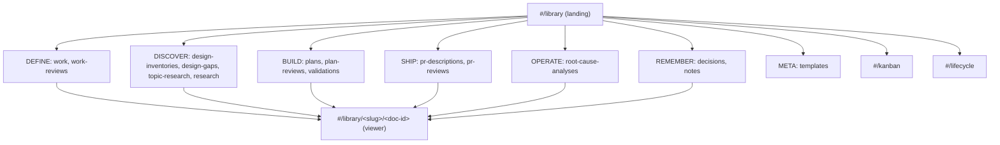

# Design Inventory: claude-design-prototype

## Overview

Runtime crawl of the Accelerator Visualiser design prototype — a hash-routed
React SPA served as a single static HTML shell at
`http://localhost:8000/Accelerator%20Visualiser.html`, entered at `#/library`.
The prototype visualises the plugin's `meta/` corpus (work items, plans,
reviews, decisions, research, and the rest) across a library, a kanban board, a
lifecycle overview, and a per-document viewer.

**Scope covered**: all 18 concrete hash routes plus the parameterized document
viewer, over the persistent global chrome (top bar, sidebar, search). Ten
screens were screenshotted across five archetypes and both themes. No route was
auth-walled; the crawl finished well inside the 50-route cap and the 5-minute
budget.

**Methodology**: `runtime` crawler via the Playwright executor. Design tokens
were read from the live stylesheet layers (`assets/tokens.css`, `app.css`) and
`getComputedStyle`, which are route-independent; screens were reached by
navigating hash routes and confirmed by their rendered heading.

**Known gaps**: the executor build (`design-1.24.0-pre.63`) exposes only
`ping, navigate, snapshot, screenshot, evaluate, links, daemon-stop` — there is
no `click`/`type`/`wait_for`, so interaction-only states were reproduced through
`evaluate` (theme flip, search-query injection) rather than real input. The
SSE-driven "external edit" toast never fired during the crawl and has no
screenshot. Fira Code (the mono family) is not bundled, so monospace text falls
back to the system `ui-monospace`. See Crawl Notes for the screenshot-bootstrap
gap that forced a dedicated recapture pass.

## Design System

The prototype ships **two token layers**. Layer 1 is primitives plus light
aliases in `assets/tokens.css` (`--atomic-*`, `--fg-*`, `--bg-*`, `--size-*`,
`--sp-*`, `--radius-*`, `--shadow-*`, `--font-*`). Layer 2 is the semantic app
layer in `app.css` (`--ac-*`), which the chrome and components actually
reference and the **only layer that flips by theme**.

### Tokens

#### Colour — semantic `--ac-*` (light / dark)

| Token | Light | Dark |
|-------|-------|------|
| `--ac-bg` | `#FBFCFE` | `#0A111B` |
| `--ac-bg-raised` | `#FFFFFF` | `#0E0F19` |
| `--ac-bg-sunken` | `#F4F6FA` | `#070B12` |
| `--ac-bg-chrome` | `#FFFFFF` | `#0E0F19` |
| `--ac-bg-sidebar` | `#F7F8FB` | `#0B121C` |
| `--ac-bg-card` | `#FFFFFF` | `#131524` |
| `--ac-bg-hover` | `rgba(32,34,49,0.04)` | `rgba(255,255,255,0.04)` |
| `--ac-bg-active` | `rgba(89,95,200,0.09)` | `rgba(89,95,200,0.22)` |
| `--ac-fg` | `#14161F` | `#E7E9F2` |
| `--ac-fg-strong` | `#0A111B` | `#FFFFFF` |
| `--ac-fg-muted` | `#5F6378` | `#A0A5B8` |
| `--ac-fg-faint` | `#8B90A3` | `#6C7088` |
| `--ac-stroke` | `rgba(32,34,49,0.10)` | `rgba(255,255,255,0.08)` |
| `--ac-stroke-soft` | `rgba(32,34,49,0.06)` | `rgba(255,255,255,0.04)` |
| `--ac-stroke-strong` | `rgba(32,34,49,0.18)` | `rgba(255,255,255,0.16)` |
| `--ac-accent` | `#595FC8` | `#8A90E8` |
| `--ac-accent-2` | `#CB4647` | `#E86A6B` |
| `--ac-accent-tint` | `rgba(89,95,200,0.12)` | `rgba(138,144,232,0.18)` |
| `--ac-accent-faint` | `rgba(89,95,200,0.06)` | `rgba(138,144,232,0.08)` |
| `--ac-ok` | `#2E8B57` | inherited (chips use `rgb(121,217,166)`) |
| `--ac-warn` | `#D98F2E` | inherited (chips use `rgb(228,183,110)`) |
| `--ac-err` | `#CB4647` | inherited |
| `--ac-violet` | `#7B5CD9` | inherited |

`--ac-ok/warn/err/violet` are not redefined in the dark block (they carry over);
dark-tuned chips/badges get their own rgba values.

#### Colour — primitive `--atomic-*` (theme-independent, `tokens.css :root`)

| Token | Value | Category |
|-------|-------|----------|
| `--atomic-night` | `#0E0F19` | brand core |
| `--atomic-night-2` | `#0A111B` | brand core |
| `--atomic-night-3` | `#171925` | brand core |
| `--atomic-night-4` | `#1D2131` | brand core |
| `--atomic-ink` | `#202231` | brand core |
| `--atomic-ink-2` | `#2C2E41` | brand core |
| `--atomic-red` | `#CB4647` | brand |
| `--atomic-red-2` | `#DF5758` | brand |
| `--atomic-red-3` | `#E24E53` | brand |
| `--atomic-indigo` | `#595FC8` | brand |
| `--atomic-indigo-2` | `#323062` | brand |
| `--atomic-indigo-tint` | `#C1C5FF` | brand |
| `--atomic-medium-purple` (`--atomic-violet`) | `#965DD9` | extended |
| `--atomic-cream-can` | `#F5C25F` | extended |
| `--atomic-steel-blue` | `#4295A5` | extended |
| `--atomic-pastel-green` | `#6BE58B` | extended |
| `--atomic-river-bed` | `#4A545F` | extended |
| `--atomic-aquamarine` | `#73E4E2` | extended |
| `--atomic-tradewind` (`--atomic-teal`) | `#52B0AA` | extended |
| `--atomic-geyser` | `#D3DBE0` | extended |
| `--atomic-malibu` (`--atomic-sky`) | `#72CBF5` | extended |
| `--atomic-link-water` | `#DDECF4` | extended |
| `--atomic-marigold` | `#F9DE6F` | extended |
| `--atomic-white` | `#FFFFFF` | neutral |
| `--atomic-bone` | `#FBFCFE` | neutral |
| `--atomic-mist` | `#D9D9D9` | neutral |
| `--atomic-ash` | `#D3DBE0` | neutral |
| `--atomic-smoke` | `#C7C9D8` | neutral |
| `--atomic-slate` | `#5F6378` | neutral |
| `--atomic-slate-2` | `#4A545F` | neutral |
| `--atomic-overlay-ink` | `rgba(23,25,37,0.56)` | utility |
| `--atomic-stroke-light` | `rgba(255,255,255,0.35)` | utility |
| `--atomic-shadow-soft` | `rgba(0,0,0,0.08)` | utility |

Light aliases map these to roles: `--fg-1=night`, `--fg-2=slate`,
`--fg-3=slate-2`, `--bg-1=white`, `--bg-2=bone`, `--accent=red`,
`--accent-2=indigo`, `--stroke=ash`.

#### Colour — per-doc-type glyph accents (landing cards, light theme; inline)

Each doc type has a distinct hue (`color` on a tinted `background`, 34px glyph
box, 5px padding):

| Type | Glyph fg | Glyph bg |
|------|----------|----------|
| Work items | `rgb(188,66,36)` | `rgb(252,236,232)` |
| Work item reviews | `rgb(188,36,87)` | `rgb(252,232,239)` |
| Design inventories | `rgb(36,176,188)` | `rgb(232,251,252)` |
| Design gaps | `rgb(99,188,36)` | `rgb(241,252,232)` |
| Topic research | `rgb(28,146,51)` | `rgb(232,252,236)` |
| Codebase research | `rgb(188,107,36)` | `rgb(252,242,232)` |
| Plans | `rgb(36,87,188)` | `rgb(232,239,252)` |
| Plan reviews | `rgb(87,36,188)` | `rgb(239,232,252)` |
| Validations | `rgb(36,188,138)` | `rgb(232,252,246)` |
| PR descriptions | `rgb(36,138,188)` | `rgb(232,246,252)` |
| PR reviews | `rgb(138,36,188)` | `rgb(246,232,252)` |
| Root cause analyses | `rgb(188,36,163)` | `rgb(252,232,249)` |
| Decisions | `rgb(188,36,49)` | `rgb(252,232,234)` |
| Notes (empty) | `rgb(188,163,36)` | `rgb(252,249,232)` |

In dark theme glyphs recolour via `color-mix(in oklab, currentcolor 14%,
transparent)` background and `color-mix(... 70%, white)` foreground. Phase-group
labels (DEFINE/DISCOVER/BUILD/SHIP/OPERATE/REMEMBER) carry no accent — muted mono
uppercase text.

#### Colour — status and kind

| Token / class | Value | Meaning |
|---------------|-------|---------|
| `.ac-chip--neutral` | text `rgb(95,99,120)`, bg white | Draft / Todo |
| `.ac-chip--green` | text `rgb(46,139,87)`, bg `rgba(46,139,87,0.08)` | Accepted / Done |
| `.ac-chip--indigo` | text `rgb(89,95,200)`, bg `rgba(89,95,200,0.06)` | Proposed / In progress |
| `.ac-kindbadge` STORY | `rgb(89,95,200)` (indigo) | work-item kind |
| `.ac-kindbadge` BUG | `rgb(203,70,71)` (red) | work-item kind |
| `.ac-kindbadge` TASK | `rgb(95,99,120)` (neutral) | work-item kind |
| `.ac-kindbadge` SPIKE | `rgb(180,118,31)` on `rgba(217,143,46,0.12)` (amber) | work-item kind |
| `.ac-kindbadge` EPIC | `rgb(123,92,217)` (violet) | work-item kind |

#### Typography

| Role | Family | Notes |
|------|--------|-------|
| Display | `"Sora", system-ui, sans-serif` | headings, brand, card titles |
| Body | `"Inter", system-ui, sans-serif` | body, breadcrumb |
| Mono | `"Fira Code", ui-monospace, monospace` | eyebrows, counts, metadata, code |

Only Sora (weight 100–800) and Inter (100–900 + italic) are `@font-face`-bundled
variable fonts (`font-display: swap`). Fira Code is not bundled — mono falls
back to system `ui-monospace`.

Font-size scale (`--size-*`): hero `68`, h1 `48`, h2 `36`, h3 `28`, h4 `26`,
lg `22`, body `20`, md `18`, sm `16`, xs `14`, xxs `12` (px). Component styles
frequently override smaller (page h1 28px, card title 16px, nav item 13px,
eyebrows/counts 10.5–11px).

Weights: body base `300`; h1/h2 `600`; h3/h4 `700`; brand-name `600`. Line
heights (`--lh-*`): tight `1.05`, snug `1.2`, normal `1.5`, loose `1.6`.
Letter-spacing: `--tracking-caps 0.12em` (uppercase eyebrows/labels), headings
`-0.01em`, brand-sub `0.18em`.

#### Spacing, radius, shadow, motion

| Category | Values |
|----------|--------|
| Spacing (`--sp-1..11`) | `4, 8, 12, 16, 24, 32, 40, 48, 64, 80, 124` (px) |
| Radius (`--radius-*`) | `sm 4`, `md 8`, `lg 12`, `pill 999` (px); landing cards use 6px, chips 999px |
| Shadow (primitive) | `--shadow-card 6px 12px 85px rgba(0,0,0,0.08)`; `--shadow-card-lg 12px 24px 120px rgba(0,0,0,0.12)`; `--shadow-crisp 0 1px 2px / 0 4px 12px` |
| Shadow (semantic) | `--ac-shadow-soft` (search panel); `--ac-shadow-lift` (toast) — both deepen in dark |
| Motion | no duration/easing tokens; inline transitions 120–160ms; keyframes `ac-pulse` (2.4s LIVE dot), `ac-toast-in`, `ac-search-pop`, `ac-filter-in`, `ac-search-bar`, `ds-marquee` |

The top bar, sidebar and landing cards render **flat** (no box-shadow;
separation via 1px strokes).

### Layout Primitives

| Primitive | Value |
|-----------|-------|
| App shell | CSS grid `256px 1fr` × `48px 1fr`; areas `topbar` / `sidebar` / `main` |
| Sidebar | 256px, `--ac-bg-sidebar`, right 1px stroke, padding `16px 0 24px`, scrollbar hidden |
| Top bar | 48px, `--ac-bg-chrome`, bottom 1px stroke, padding `0 16px`, 13px base |
| Content container | `.ac-page` `max-width:1200px; margin:0 auto; padding:28px 40px 80px` (`--wide` variant drops the cap) |
| Landing grid | `repeat(auto-fill, minmax(280px, 1fr)); gap:12px` (≈3 columns at 1024px), per-phase sections |
| z-index | toaster + filter popover `50`, tweaks `60`, marquee `5`; toaster `position:fixed` bottom-right |
| Breakpoints | up `1536px`; down `1100px`, `900px`, `820px` |

## Component Catalogue

### Top bar (`.ac-topbar`)

- **Variants / props**: brand lockup ("Accelerator" / "VISUALISER"), breadcrumb
  trail (current segment `strong`), SSE connection indicator, two toggle buttons.
- **Used on screens**: all routes.
- **Source**: `.ac-topbar__brand`, `.ac-topbar__crumbs`, `.ac-topbar__status`,
  `.ac-topbar__toggles > .ac-topbar__btn`.

### SSE connection indicator (`.ac-topbar__status`)

- **States**: connected — `.dot` `--ac-ok` `rgb(46,139,87)` + 3px glow ring
  `box-shadow 0 0 0 3px rgba(46,139,87,0.18)`; disconnected — `.dot.off`
  `--ac-fg-faint`, no ring (defined but never active during the crawl).
- **Used on screens**: all routes (text `127.0.0.1:<port> · SSE`).

### Theme / font toggles (`.ac-topbar__btn`)

- **Variants / props**: 32px square, radius 4px; `.is-active` → accent-faint bg +
  accent fg. Toggle theme flips `documentElement[data-theme]` light↔dark
  (rebinds only the `--ac-*` layer); Toggle monospaced fonts flips
  `[data-font]` display↔mono (reassigns `--ac-font-display`/`-body` to Fira Code).
- **Used on screens**: all routes.

### Sidebar navigation (`.ac-sidebar` / `.ac-nav`)

- **Variants / props**: LIBRARY button; phase groups (DEFINE, DISCOVER, BUILD,
  SHIP, OPERATE, REMEMBER) of `.ac-nav__item` rows with live-pulse + count;
  VIEWS group (Kanban, Lifecycle); ACTIVITY/LIVE feed; META group (Templates);
  version footer. Item states: default muted → hover → `.is-active` accent-faint.
- **Used on screens**: all routes.
- **Observed counts**: Work items 14, Work item reviews 11, Design inventories 4,
  Design gaps 3, Topic research 4, Codebase research 12, Plans 18, Plan reviews
  22, Validations 7, PR descriptions 6, PR reviews 8, Root cause analyses 4,
  Decisions 9, Notes 0, Templates 6.

### Activity / live feed (`.ac-activity`)

- **Variants / props**: `.ac-activity__item` rows = 22px glyph + action line +
  mono filename · relative time; an animated `.ac-pulse` accent dot marks LIVE.
- **Used on screens**: all routes (sidebar).

### Library type card (`.ac-lcard`)

- **Variants / props**: populated (glyph + title + count + `latest ·` line) and
  `--empty` (dashed hatch, desaturated glyph, "EMPTY" pill, "0" dot). Hover →
  stroke-strong + bg-hover. 2-col grid (34px glyph + content), radius 6px.
- **Used on screens**: `library-landing`. (Also the row unit on `lifecycle`.)

### Collection table (`.ac-libtable`)

- **Variants / props**: columns ID/Date · Title · Status · Slug · Modified; each
  `<tr>` is `cursor:pointer` (opens the document). Data differs by type (date-id
  vs work-item-id; absolute vs relative modified; status vocabulary). No per-row
  type badge or count.
- **Used on screens**: `collection-plans`, `collection-work` (every populated
  `#/library/<slug>`).

### Sort control (`.ac-sort-btn`)

- **Variants / props**: "Recently modified" button → single-select listbox
  {Recently modified, Oldest first, Title A→Z, Title Z→A, ID ascending}.
- **Used on screens**: populated collections.

### Filter control (`.ac-filter__pop`)

- **Variants / props**: "Filter" button → multi-facet popover; STATUS checkbox
  group with facet counts, CLUSTER SLUG group with a "Filter slugs…" search input
  above a scrollable checkbox list. Popover radius 6px, `--ac-shadow-soft`.
- **Used on screens**: populated collections.

### Empty / fallback page (`.ac-empty-page`)

- **Variants / props**: real empty (human type label h1, bespoke type blurb) vs
  unknown-slug fallback (raw slug h1, generic "Documents of this type live
  here."). Both carry a mono path eyebrow and the live-indexer hint. No sort/filter.
- **Used on screens**: `collection-notes-empty`, `collection-unknown-fallback`.

### Kanban board + card (`.ac-kanban` / `.ac-kcol` / `.ac-kcard`)

- **Variants / props**: 3 neutral status columns (Todo, In progress, Done) — status
  is conveyed by column position, not colour. Card (`draggable="true"`) = kind
  badge + work-item id + title + slug + `N linked` + relative time + a 7-dot
  hexchain progress row. Column radius 6px, card radius 4px / padding 12px.
- **Used on screens**: `kanban`.

### Lifecycle card + hexchain (`.ac-lcycle .ac-lcard` / `.ac-hexchain`)

- **Variants / props**: flat rows (one per work unit), each = title + slug +
  status chip + `N artifacts` + a 7-stage hexagon chain with `reached/total`
  count. Stages (fixed inline hues): Work item `rgb(197,38,38)`, Research
  `rgb(197,112,38)`, Plan `rgb(38,91,197)`, Plan review `rgb(91,38,197)`,
  Validation `rgb(38,197,144)`, PR description `rgb(38,144,197)`, PR review
  `rgb(144,38,197)`. Reached stages carry class `on`.
- **Used on screens**: `lifecycle` (hexchain progress dots also on kanban cards).

### View toggles (`.ac-tweaks__seg`)

- **Variants / props**: segmented control {Updated, Completeness}; active button
  class `on` → indigo text/border + `rgba(89,95,200,0.06)` fill. Reorders the same
  cards in place (Completeness sorts reached/total descending).
- **Used on screens**: `lifecycle`.

### Document viewer

- **Variants / props**: breadcrumb, eyebrow, title h1, meta row (status badge,
  date, author), `Open in editor` + `Copy link` ghost buttons, frontmatter block,
  typed body sections (for a Decision: Context / Decision / Consequences / Sketch
  with highlighted code / Links), inline cross-links (`<a href="#">` + JS onClick,
  `--ac-accent`), plus RELATED ARTIFACTS, FILE (path · etag · size) and CLUSTER
  panels. RELATED ARTIFACTS cards are onClick DIVs (radius 4px, padding 8px 10px),
  each with a type-accent label and an `(inferred)` tag; CLUSTER shows a collapsed
  expand button.
- **Used on screens**: `document-viewer` (`#/library/<slug>/<doc-id>`).

### Global search overlay (`.ac-search__panel`)

- **Variants / props**: searchbox "Search meta documents" + `Clear search`
  (Esc). Query opens an anchored dropdown `role=listbox` of `role=option` rows —
  **flat, relevance-ranked, not grouped under type headers**; each row leads with a
  type label then title then `Type · path`, matched substring `.ac-search__mark`
  (`--ac-accent-tint`). Meta bar shows `N matches · <query>` with `↵`/`esc` hints.
  Panel bg `--ac-bg-raised`, `--ac-shadow-soft`, radius 6px. Stylesheet also
  defines loading (`.ac-search__loadbar`) and empty (`.ac-search__empty-*`) states
  (not triggered).
- **Used on screens**: overlays all routes; captured on the library landing.

### Toaster (`.ac-toaster` / `.ac-toast`)

- **Variants / props**: fixed bottom-right mount, z-index 50, `ac-toast-in`
  animation; toast bg `--ac-bg-card`, `--ac-shadow-lift`, radius 5px. The
  external-edit toast ("A reviewer agent updated … Query invalidated." + dismiss)
  is SSE-driven and did not fire during the crawl.
- **Used on screens**: all routes (mount always present).

## Screen Inventory

### library-landing — `#/library`

- **Purpose**: entry hub; all doc types as phase-grouped cards.
- **Components used**: top bar, sidebar, library type cards, phase sections.
- **States observed**: success. Notes card renders the empty variant (0 docs).
- **Key interactions**: click a type card → collection; click a view → kanban/lifecycle.
- **Screenshot**: `screenshots/library-landing.png` (light),
  `screenshots/library-landing-dark.png` (dark).

### collection-plans — `#/library/plans`

- **Purpose**: populated collection (7–18 docs by type).
- **Components used**: breadcrumb, collection table, sort, filter.
- **States observed**: success.
- **Key interactions**: row click → document viewer; sort listbox; filter popover.
- **Screenshot**: `screenshots/collection-plans.png`.

### collection-work — `#/library/work`

- **Purpose**: work-item collection (labelled "Work items"; slug is `work`).
- **Components used**: breadcrumb, collection table (work-item ids, relative
  modified, Todo/In progress/Done status).
- **States observed**: success.
- **Screenshot**: `screenshots/collection-work.png`.

### collection-notes-empty — `#/library/notes`

- **Purpose**: real empty state.
- **Components used**: empty page (human label "Notes", bespoke blurb, mono path
  eyebrow `meta/notes/`, live-indexer hint). No sort/filter.
- **States observed**: empty.
- **Screenshot**: `screenshots/collection-notes-empty.png`.

### collection-unknown-fallback — `#/library/<unknown-slug>`

- **Purpose**: generic fallback for an unrecognised slug.
- **Components used**: empty page (raw-slug h1, generic "Documents of this type
  live here.", derived glyph prefix).
- **States observed**: fallback (distinct from real empty by h1 and blurb).
- **Screenshot**: `screenshots/collection-unknown-fallback.png`.

### kanban — `#/kanban`

- **Purpose**: work items grouped by status; drag-to-move writes to disk.
- **Components used**: eyebrow + h1 ("Work items"), 3 status columns, kanban cards.
- **States observed**: success (Todo 5, In progress 3, Done 4; 12 total). No breadcrumb.
- **Key interactions**: drag card between columns (persists to file).
- **Screenshot**: `screenshots/kanban.png`.

### lifecycle — `#/lifecycle`

- **Purpose**: every work unit and how far it has progressed.
- **Components used**: eyebrow + h1 ("Lifecycle overview"), Updated/Completeness
  toggle, 8 lifecycle rows, 7-stage hexchain per row.
- **States observed**: success. Toggling Completeness reorders in place
  (reached/total descending); Updated is recency order.
- **Screenshot**: `screenshots/lifecycle.png`.

### document-viewer — `#/library/<slug>/<doc-id>`

- **Purpose**: read one document with typed sections, related artifacts, file
  metadata, cluster.
- **Components used**: breadcrumb, doc header + meta, action buttons, frontmatter,
  typed body, RELATED ARTIFACTS / FILE / CLUSTER panels, inline cross-links.
- **States observed**: success (captured `#/library/decisions/ADR-0002`, a
  Decision). Content mounts asynchronously shortly after navigation.
- **Key interactions**: Open in editor; Copy link; related-artifact cards →
  navigate; cross-links; cluster expand (interaction not actuable in this
  executor build).
- **Screenshot**: `screenshots/document-viewer.png`.

### search-overlay — global

- **Purpose**: relevance-ranked search across all meta documents.
- **Components used**: searchbox, results listbox, match-count + keyboard hints.
- **States observed**: success (20 matches; a `plan` query was injected via
  `evaluate` to open the panel). Loading and empty states defined but not triggered.
- **Screenshot**: `screenshots/search-overlay.png`.

## Feature Catalogue

### corpus-browsing

- **Capability**: browse every `meta/` document type from a phase-grouped hub and
  drill into per-type collections.
- **Surfaces on**: library-landing, all collection screens.
- **Depends on**: the file indexer over `meta/`; per-type counts.

### document-viewing

- **Capability**: read a single document with typed body sections, frontmatter,
  file metadata (path, etag, size), related artifacts and cluster.
- **Surfaces on**: document-viewer.
- **Depends on**: the resolved document + its inferred relations/cluster.

### global-search

- **Capability**: relevance-ranked full-text search across the corpus, keyboard
  driven (`↵`/`esc`), grouped by leading type label per row.
- **Surfaces on**: all routes (overlay).
- **Depends on**: a search index over meta documents.

### kanban-board

- **Capability**: work items by status with drag-to-move that writes the change
  back to the file on disk.
- **Surfaces on**: kanban.
- **Depends on**: work-item status field; a write-back channel to disk.

### lifecycle-overview

- **Capability**: per-work-unit progress across the 7-stage pipeline, sortable by
  recency or completeness.
- **Surfaces on**: lifecycle.
- **Depends on**: artifact linkage per work unit; stage-reached inference.

### collection-sort-filter

- **Capability**: reorder a collection (5 sort keys) and filter it by status and
  cluster slug with facet counts.
- **Surfaces on**: populated collections.
- **Depends on**: per-document status + slug facets.

### live-updates (SSE)

- **Capability**: a persistent SSE connection drives the activity feed, live
  counts, and an external-edit toast when a file changes on disk.
- **Surfaces on**: all routes (indicator + activity feed); toast on landing.
- **Depends on**: an SSE endpoint at `127.0.0.1:<port>`.

### theming

- **Capability**: light/dark theme toggle and a display/monospace font toggle,
  both persisted on the document root.
- **Surfaces on**: all routes (top-bar toggles).
- **Depends on**: the `--ac-*` semantic layer + `[data-theme]`/`[data-font]`.

## Information Architecture

Route table (18 concrete + 1 parameterized): the sidebar's phase groups map
one-to-one to `#/library/<slug>` collections (`work`, `work-reviews`,
`design-inventories`, `design-gaps`, `topic-research`, `research`, `plans`,
`plan-reviews`, `validations`, `pr-descriptions`, `pr-reviews`,
`root-cause-analyses`, `decisions`, `notes`, `templates`); VIEWS reach `#/kanban`
and `#/lifecycle`; any collection row, landing card, search result or
related-artifact card opens `#/library/<slug>/<doc-id>`. Note the label/slug
mismatch: "Work items" → `work`, "Codebase research" → `research`.

## Crawl Notes

- **Screenshot bootstrap gap (skill defect)**: the executor's screenshot
  path-guard requires `ACCELERATOR_INVENTORY_OUTPUT_ROOT` in the daemon's
  environment, but `inventory-design/SKILL.md` never sets it before the daemon is
  spawned (Step 5 `executor ping`). All four analyser agents were therefore
  refused every `screenshot` with `screenshot-output-root-unset`, and could not
  fix it from their own shells because the running daemon had already captured its
  environment. Recovery: after the analysers returned, the daemon was stopped and
  restarted with `ACCELERATOR_INVENTORY_OUTPUT_ROOT` pointed at this inventory's
  `screenshots/` dir (the daemon inherits the spawner's env — no `env_clear`), and
  a single serial recapture pass produced all screenshots below. A prior
  `current-app` inventory hit the same gap.
- **Executor build lacks interaction commands**: `design-1.24.0-pre.63` exposes
  only `ping, navigate, snapshot, screenshot, evaluate, links, daemon-stop`, and
  `snapshot` carries no element refs. Theme flip, search-query entry and doc-card
  navigation were reproduced through `evaluate` (setting `data-theme`, injecting
  the search input via the native value setter). Genuinely click-only affordances
  — related-artifact navigation, cluster expand, the completeness toggle's own
  click — were catalogued from the DOM/stylesheet, not actuated.
- **Shared-daemon drift during the parallel pass**: the four analysers drove one
  shared browser tab, so routes and the search query changed under each other
  mid-crawl. Token/CSS data (route-independent) is unaffected; the recapture pass
  was run serially by the orchestrator to avoid drift, and every capture was
  confirmed by its rendered heading.
- **Persisted search state**: a `review` query set by a sibling during the
  parallel pass survived in the daemon's browser storage and reopened the search
  overlay across navigations. It was cleared before the final captures; the light
  and dark landings and the six view captures are clean.
- **SSE external-edit toast not captured**: the toast never fired during the crawl
  (polled 30+ times); only the persistent SSE indicator and activity feed were
  observed. No screenshot exists for it. `screenshots_incomplete` remains `false`
  (the 50 MB budget was not exhausted — total ≈1.2 MB).
- **URL hygiene**: the entry URL and all routes are fragment-based; no query
  strings were present, so none were stripped. `source_location` records the app
  shell without its `#/library` entry fragment.
- **Fonts**: Fira Code (mono) is not bundled; monospace text renders in the system
  `ui-monospace` fallback.

## References

- Source: `http://localhost:8000/Accelerator%20Visualiser.html` (entry `#/library`)
- Prototype source tree: `meta/research/design-inventories/temp-claude-design-prototype/prototype-full/`
- Prior inventory (superseded): `meta/research/design-inventories/2026-05-21-015231-claude-design-prototype/`
- Counterpart current-app inventory: `meta/research/design-inventories/2026-05-21-004250-current-app/`
